# EUDI Wallet: Relying Party Integration Flows

**DR-0002** · Published · Last updated 2026-03-16 · ~4,550 lines

> Exhaustive investigation of the EU Digital Identity Wallet ecosystem from the Relying Party (RP) perspective. Covers every RP-facing flow at protocol depth: registration with Member State Registrars (CIR 2025/848, TS5/TS6), trust infrastructure (Access Certificates, Registration Certificates, Trusted Lists, WUA verification), remote presentation (same-device and cross-device via OpenID4VP with SD-JWT VC and mdoc), proximity presentation (supervised and unsupervised via ISO/IEC 18013-5), wallet-to-wallet interactions (TS9), SCA for electronic payments (TS12, PSD2 Dynamic Linking), pseudonym-based authentication, combined presentations via DCQL, data deletion requests (TS7), DPA reporting (TS8), and the intermediary model. Includes exact protocol payloads, annotated Mermaid sequence diagrams, and regulatory compliance mapping (eIDAS 2.0, PSD2/PSR, GDPR, DORA, AML/KYC). Applicable to banks, financial institutions, public sector bodies, and any entity integrating with the EUDI Wallet as a Relying Party.

## Table of Contents

- [Context](#context)
- [Scope](#scope)
- [Regulatory Foundation](#regulatory-foundation)
  - [1. eIDAS 2.0 and the EUDI Wallet Regulation](#1-eidas-20-and-the-eudi-wallet-regulation)
  - [2. Commission Implementing Regulations (CIRs)](#2-commission-implementing-regulations-cirs)
  - [3. Architecture and Reference Framework (ARF)](#3-architecture-and-reference-framework-arf)
  - [4. Technical Specifications and Standards (STS)](#4-technical-specifications-and-standards-sts)
- [Ecosystem Roles from RP Perspective](#ecosystem-roles-from-rp-perspective)
  - [5. Relying Parties, RP Instances, and Intermediaries](#5-relying-parties-rp-instances-and-intermediaries)
  - [6. Supporting Ecosystem Entities](#6-supporting-ecosystem-entities)
- [RP Registration](#rp-registration)
  - [7. RP Registration, Data Model, and Registrar API](#7-rp-registration-data-model-and-registrar-api)
- [Trust Infrastructure](#trust-infrastructure)
  - [10. Trust Infrastructure: Certificates, Attestations, and Trusted Lists](#10-trust-infrastructure-certificates-attestations-and-trusted-lists)
- [Credential Formats](#credential-formats)
  - [15. SD-JWT VC Format Deep-Dive](#15-sd-jwt-vc-format-deep-dive)
  - [16. mdoc (ISO/IEC 18013-5) Format Deep-Dive](#16-mdoc-isoiec-18013-5-format-deep-dive)
  - [17. Format Selection: SD-JWT VC vs. mdoc](#17-format-selection-sd-jwt-vc-vs-mdoc)
- [Remote Presentation Flows](#remote-presentation-flows)
  - [18. OpenID4VP Protocol Foundations](#18-openid4vp-protocol-foundations)
  - [19. HAIP 1.0 Requirements for RPs](#19-haip-10-requirements-for-rps)
  - [20. Same-Device Remote Presentation](#20-same-device-remote-presentation)
  - [21. Cross-Device Remote Presentation](#21-cross-device-remote-presentation)
  - [22. RP Authentication in Remote Flows](#22-rp-authentication-in-remote-flows)
  - [23. Presentation Verification by RP](#23-presentation-verification-by-rp)
- [Proximity Presentation Flows](#proximity-presentation-flows)
  - [24. ISO/IEC 18013-5 Protocol Foundations](#24-isoiec-18013-5-protocol-foundations)
  - [25. Proximity Supervised Flow](#25-proximity-supervised-flow)
  - [26. Proximity Unsupervised Flow](#26-proximity-unsupervised-flow)
  - [27. Device Engagement and Session Establishment](#27-device-engagement-and-session-establishment)
- [Wallet-to-Wallet Interactions](#wallet-to-wallet-interactions)
  - [28. W2W Presentation Flow (TS9)](#28-w2w-presentation-flow-ts9)
- [SCA for Electronic Payments](#sca-for-electronic-payments)
  - [29. SCA Attestation Lifecycle](#29-sca-attestation-lifecycle)
  - [30. Issuer-Requested SCA Flow](#30-issuer-requested-sca-flow)
  - [31. Third-Party-Requested SCA Flow](#31-third-party-requested-sca-flow)
  - [32. Transaction Data and Dynamic Linking (TS12)](#32-transaction-data-and-dynamic-linking-ts12)
- [Pseudonym-Based Authentication](#pseudonym-based-authentication)
  - [33. Pseudonym-Based Authentication and WebAuthn](#33-pseudonym-based-authentication-and-webauthn)
- [Combined Presentations](#combined-presentations)
  - [35. DCQL and Combined Presentations](#35-dcql-and-combined-presentations)
- [RP Obligations and User Rights](#rp-obligations-and-user-rights)
  - [37. RP Obligations: Data Deletion, DPA Reporting, and Disclosure Policy](#37-rp-obligations-data-deletion-dpa-reporting-and-disclosure-policy)
- [Intermediary Model](#intermediary-model)
  - [40. Intermediary Architecture and Trust Flows](#40-intermediary-architecture-and-trust-flows)
- [Regulatory Compliance for RPs](#regulatory-compliance-for-rps)
  - [41. eIDAS 2.0 RP Obligations and Timelines](#41-eidas-20-rp-obligations-and-timelines)
  - [42. PSD2/PSR and SCA Bridge](#42-psd2psr-and-sca-bridge)
  - [43. GDPR Obligations for RPs](#43-gdpr-obligations-for-rps)
  - [44. AML/KYC Onboarding via EUDI Wallet](#44-amlkyc-onboarding-via-eudi-wallet)
  - [45. DORA Considerations for Financial RPs](#45-dora-considerations-for-financial-rps)
- [Vendor Landscape](#vendor-landscape)
  - [46. RP Integration SDKs and Services](#46-rp-integration-sdks-and-services)
- [Synthesis and Conclusions](#synthesis-and-conclusions)
  - [47. Findings](#47-findings)
  - [48. Recommendations](#48-recommendations)
  - [49. Open Questions](#49-open-questions)
- [50. References](#50-references)
- [Annexes](#annexes)
  - [Annex A: Exact Response Payloads](#annex-a-exact-response-payloads)
  - [Annex B: Status List Verification Deep-Dive](#annex-b-status-list-verification-deep-dive)
  - [Annex C: Additional Sequence Diagrams](#annex-c-additional-sequence-diagrams)
  - [Annex D: SCA Deep-Dive Corrections and Expansions (from TS12)](#annex-d-sca-deep-dive-corrections-and-expansions-from-ts12)
  - [Annex E: TS7 and TS8 Interface Corrections](#annex-e-ts7-and-ts8-interface-corrections)
  - [Annex F: Attestation Rulebooks for RPs](#annex-f-attestation-rulebooks-for-rps)
  - [Annex G: Expanded Vendor Landscape](#annex-g-expanded-vendor-landscape)

### Reading Guide

> **Note**: This investigation is structured in ten thematic blocks. Choose your entry point based on your role:
>
> | Sections | Theme | Best For |
> |:---------|:------|:---------|
> | **§1–§4** | Regulatory foundation, CIRs, ARF, STS | **Compliance officers** mapping legal obligations |
> | **§5–§6** | Ecosystem roles and RP taxonomy | **Business analysts** understanding the RP landscape |
> | **§7** | RP Registration, data model, and Registrar API | **Integration engineers** implementing onboarding |
> | **§10** | Trust infrastructure: certificates, attestations, Trusted Lists | **Security architects** designing trust chains |
> | **§15–§17** | Credential formats: SD-JWT VC and mdoc | **Protocol engineers** implementing verification |
> | **§18–§23** | Remote presentation flows (OpenID4VP, HAIP) | **Backend developers** building remote verification |
> | **§24–§27** | Proximity presentation flows (ISO 18013-5) | **Embedded/mobile developers** building face-to-face flows |
> | **§29–§32** | SCA for payments (TS12, PSD2) | **Payment architects** integrating EUDI Wallet SCA |
> | **§33, §35, §37, §40** | Pseudonyms, DCQL, RP obligations, intermediaries | **Product managers** scoping full feature coverage |
> | **§41–§45** | Regulatory compliance (eIDAS, PSD2, GDPR, DORA) | **Legal/compliance teams** assessing regulatory risk |
>
> **Persona-based reading paths:**
>
> | Persona | Start Here | Then Read | Finally |
> |:--------|:-----------|:----------|:--------|
> | **Bank RP Architect** | §47 (Findings) → §48 (Recs) | §7 (Registration) → §10 (Trust) → §18–§23 (Remote) | §29–§32 (SCA/Payments) → §42 (PSD2) → §44 (AML/KYC) |
> | **Public Sector RP** | §1–§4 (Regulatory) → §41 (Obligations) | §5–§6 (Roles) → §20–§21 (Remote Flows) | §33 (Pseudonyms) → §43 (GDPR) |
> | **Intermediary/Vendor** | §40 (Intermediary Model) → §7 (Registration) | §10 (Trust) → §22 (RP Auth) | §37 (RP Obligations) → §47–§49 (Findings) |
> | **Mobile Developer** | §15–§17 (Formats) → §24–§27 (Proximity) | §18–§23 (Remote) → §28 (W2W) | §35 (DCQL) → §23 (Verification) |

---

### RP Integration Architecture Map

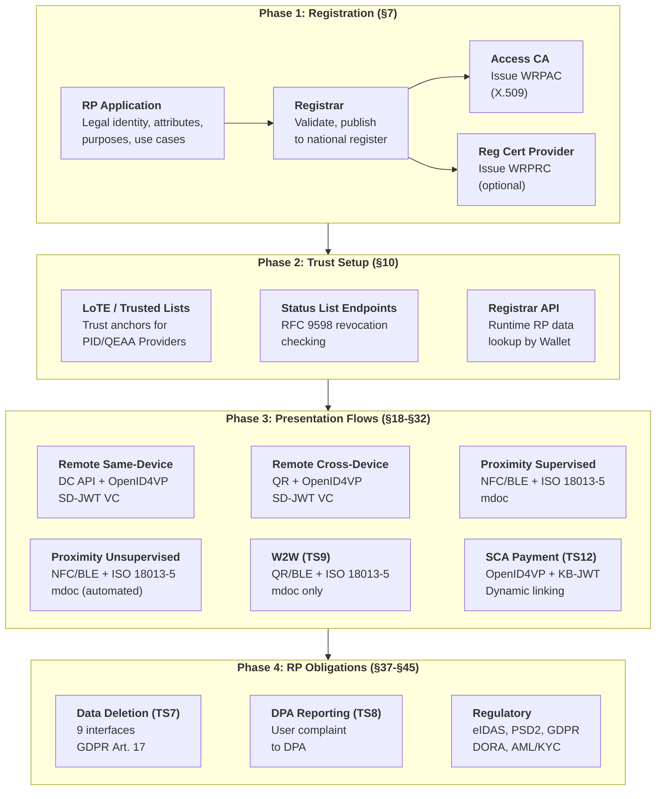
```mermaid
---
config:
  flowchart:
    subGraphTitleMargin:
      bottom: 25
    nodeSpacing: 30
    rankSpacing: 45
---
flowchart TD
    subgraph REG["`**Phase 1: Registration (§7)**`"]
        direction LR
        R1["`**RP Application**
        Legal identity, attributes,
        purposes,&nbsp;use&nbsp;cases`"]
        R2["`**Registrar**
        Validate, publish
        to&nbsp;national&nbsp;register`"]
        R3["`**Access CA**
        Issue WRPAC
        (X.509)`"]
        R4["`**Reg Cert Provider**
        Issue WRPRC
        (optional)`"]
        R1 --> R2
        R2 --> R3
        R2 --> R4
    end

    subgraph TRUST["`**Phase 2: Trust Setup (§10)**`"]
        direction LR
        T1["`**LoTE / Trusted Lists**
        Trust anchors for
        PID/QEAA&nbsp;Providers`"]
        T2["`**Status List Endpoints**
        RFC 9598 revocation
        checking`"]
        T3["`**Registrar API**
        Runtime RP data
        lookup&nbsp;by&nbsp;Wallet`"]
        T1 ~~~ T2 ~~~ T3
    end

    subgraph FLOWS["`**Phase 3: Presentation Flows (§18-§32)**`"]
        direction LR
        F1["`**Remote Same-Device**
        DC API + OpenID4VP
        SD-JWT&nbsp;VC`"]
        F2["`**Remote Cross-Device**
        QR + OpenID4VP
        SD-JWT&nbsp;VC`"]
        F3["`**Proximity Supervised**
        NFC/BLE + ISO 18013-5
        mdoc`"]
        F4["`**Proximity Unsupervised**
        NFC/BLE + ISO 18013-5
        mdoc&nbsp;(automated)`"]
        F5["`**W2W (TS9)**
        QR/BLE + ISO 18013-5
        mdoc&nbsp;only`"]
        F6["`**SCA Payment (TS12)**
        OpenID4VP + KB-JWT
        Dynamic&nbsp;linking`"]
        F1 ~~~ F2 ~~~ F3
        F4 ~~~ F5 ~~~ F6
    end

    subgraph OBLIGATIONS["`**Phase 4: RP Obligations (§37-§45)**`"]
        direction LR
        O1["`**Data Deletion (TS7)**
        9 interfaces
        GDPR&nbsp;Art.&nbsp;17`"]
        O2["`**DPA Reporting (TS8)**
        User complaint
        to&nbsp;DPA`"]
        O3["`**Regulatory**
        eIDAS, PSD2, GDPR
        DORA,&nbsp;AML/KYC`"]
        O1 ~~~ O2 ~~~ O3
    end

    REG --> TRUST
    TRUST --> FLOWS
    FLOWS --> OBLIGATIONS

    style REG text-align:left
    style TRUST text-align:left
    style FLOWS text-align:left
    style OBLIGATIONS text-align:left
    style R1 text-align:left
    style R2 text-align:left
    style R3 text-align:left
    style R4 text-align:left
    style T1 text-align:left
    style T2 text-align:left
    style T3 text-align:left
    style F1 text-align:left
    style F2 text-align:left
    style F3 text-align:left
    style F4 text-align:left
    style F5 text-align:left
    style F6 text-align:left
    style O1 text-align:left
    style O2 text-align:left
    style O3 text-align:left
```

---

## Context

The **European Digital Identity Wallet (EUDI Wallet)** is the centrepiece of the revised eIDAS Regulation ([Regulation (EU) 2024/1183](https://eur-lex.europa.eu/legal-content/EN/TXT/?uri=CELEX:32024R1183)), commonly known as **eIDAS 2.0**. By December 2026, every EU Member State must provide at least one EUDI Wallet to its citizens. By December 2027, regulated private-sector entities — including banks, payment service providers, telecom operators, healthcare providers, and very large online platforms — **must accept** the EUDI Wallet for user identification, authentication, and (where applicable) Strong Customer Authentication.

This investigation examines the EUDI Wallet ecosystem **exclusively from the Relying Party (RP) perspective** — the entity that requests and verifies credentials presented by Wallet Users. The canonical RP throughout this document is a **bank or financial institution**, as banks face the most complex integration requirements: they must support remote and proximity presentation flows, implement SCA via EUDI Wallet for PSD2 compliance, perform AML/KYC onboarding using wallet-presented credentials, and integrate with the national RP registration infrastructure.

### Why Now?

1. **Regulatory deadline pressure** — The December 2027 mandate for private-sector acceptance is 21 months away. Banks and financial institutions must begin integration planning now to meet the timeline.
2. **Specification maturity** — The critical Technical Specifications (TS5, TS6, TS7, TS8, TS9, TS12) reached v1.0 in 2025. OpenID4VP 1.0 achieved Final status in July 2025. HAIP 1.0 was approved in December 2025. The ARF has been updated through v2.7+ with 27+ CIRs now adopted.
3. **Pilot programme insights** — The EU Large-Scale Pilots (POTENTIAL, EWC, DC4EU, NOBID) have generated real-world implementation experience that informs the flows documented here.
4. **SCA integration** — TS12 (SCA Implementation with Wallet, v1.0 December 2025) defines the complete payment authentication flow using EUDI Wallet, creating an urgent integration requirement for banks under PSD2.
5. **Trust infrastructure deployment** — Member States are establishing Registrars, Access Certificate Authorities, and national registries per CIR 2025/848, creating the operational infrastructure that RPs must integrate with.

---

## Scope

### In Scope

- Complete RP registration flow with Member State Registrar (CIR 2025/848, TS5, TS6)
- Trust infrastructure: Access Certificates (WRPAC), Registration Certificates (WRPRC), Trusted Lists, WUA verification
- Credential format internals: SD-JWT VC (selective disclosure, Key Binding JWT) and mdoc (MSO, namespaces, device binding)
- Remote presentation: same-device and cross-device flows via OpenID4VP (HAIP 1.0, DCQL)
- Proximity presentation: supervised and unsupervised flows via ISO/IEC 18013-5
- Wallet-to-wallet interactions (TS9) — where the RP is another Wallet User acting as Verifier
- SCA for electronic payments: issuer-requested and third-party-requested flows (TS12, PSD2)
- Pseudonym-based authentication (Use Cases A–D, WebAuthn integration)
- Combined presentations via DCQL (multi-attestation requests)
- RP obligations: data deletion (TS7), DPA reporting (TS8), embedded disclosure policy evaluation
- Intermediary model and trust flows
- Regulatory compliance: eIDAS 2.0 obligations, PSD2/PSR SCA bridge, GDPR, AML/KYC, DORA
- W3C Digital Credentials API implications for RP integration

### Out of Scope

- Wallet Provider implementation internals (WSCA/WSCD architecture, key management)
- PID Provider and Attestation Provider issuance internals (covered only where they intersect RP flows)
- Wallet Solution certification by CABs (covered at a high level for RP trust assessment)
- National-level implementation variations (each Member State's specific registration procedures)

---

## Regulatory Foundation

### 1. eIDAS 2.0 and the EUDI Wallet Regulation

The revised eIDAS Regulation ([Regulation (EU) 2024/1183](https://eur-lex.europa.eu/legal-content/EN/TXT/?uri=CELEX:32024R1183)), adopted on 11 April 2024 and entering into force on 20 May 2024, amends the original eIDAS Regulation (EU) No 910/2014 to establish the legal framework for the European Digital Identity Wallet. For Relying Parties, the key articles are:

| Article | Requirement | RP Impact |
|:--------|:------------|:----------|
| **Art. 5a** | Member States shall provide at least one EUDI Wallet by December 2026 | Creates the ecosystem RPs must integrate with |
| **Art. 5b** | RP obligations: registration, data minimisation, transparency, non-discrimination | Core compliance requirements for all RPs |
| **Art. 5b(2)** | RPs shall not request more attributes than necessary for the service | Data minimisation — enforceable obligation |
| **Art. 5b(3)** | RPs shall inform Users of the identity and contact details they can verify | Transparency — RP must expose registration data |
| **Art. 5b(4)** | RPs shall ensure data presented is not shared with third parties without consent | Data protection — restricts downstream sharing |
| **Art. 5b(7)** | Specific private-sector entities shall accept the EUDI Wallet by Dec 2027 | **Mandatory acceptance** for banks, telecom, VLOPs |
| **Art. 5b(9)** | RPs shall not refuse pseudonyms where identification not required by law | Pseudonym acceptance — mandatory |
| **Art. 5b(10)** | Intermediaries deemed RPs; shall not store transaction content data | Intermediary obligations |
| **Art. 5f(2)** | EUDI Wallet shall support Strong User Authentication for electronic payments | SCA integration requirement for PSPs |

#### 1.1 Mandatory Acceptance by Private Sector (Art. 5b(7))

Article 5b(7) specifies that the following categories of private-sector entities **must accept** the EUDI Wallet when user identification is required by national or Union law, or by contractual obligation:

- **Transport service providers** (airlines, railways, etc.)
- **Energy sector operators**
- **Financial services** (banks, PSPs, insurers, investment firms) — under PSD2, MiFID II, Solvency II, AMLD
- **Social security institutions**
- **Healthcare providers and institutions**
- **Drinking water supply and waste treatment services**
- **Postal services**
- **Digital infrastructure and services** — including Very Large Online Platforms (Art. 33 DSA)
- **Education and training institutions** — for educational credentials
- **Telecom operators** — under EECC

The acceptance deadline is **21 December 2027** (24 months after adoption of the first implementing act specifying technical specifications under Art. 5a(23), which was adopted in December 2025).

#### 1.2 Key Timelines for RPs

| Date | Milestone |
|:-----|:----------|
| 20 May 2024 | eIDAS 2.0 enters into force |
| Nov 2024 – Dec 2025 | Batch adoption of CIRs (protocols, registration, certification) |
| Throughout 2025 | Technical Specifications (TS1–TS14) reach v1.0 |
| Dec 2025 | HAIP 1.0 approved as Final Specification by OIDF |
| Jul 2025 | OpenID4VP 1.0 achieves Final status |
| 21 Dec 2026 | Member States must provide at least one EUDI Wallet |
| 21 Dec 2027 | **Mandatory private-sector acceptance** of EUDI Wallet |
| 2028+ | Full enforcement, supervisory review cycle |

### 2. Commission Implementing Regulations (CIRs)

The Commission has adopted a comprehensive set of Implementing Regulations that operationalise the eIDAS 2.0 framework. The following CIRs are directly relevant to Relying Parties:

| CIR | Subject | RP Relevance |
|:----|:--------|:-------------|
| [CIR 2024/2977](https://data.europa.eu/eli/reg_impl/2024/2977/oj) | PID and EAA | Defines credential attributes RPs can request |
| [CIR 2024/2979](https://data.europa.eu/eli/reg_impl/2024/2979/oj) | Integrity and core functionalities | Specifies Wallet capabilities RPs can rely on |
| [CIR 2024/2980](https://data.europa.eu/eli/reg_impl/2024/2980/oj) | Ecosystem notifications | Notification infrastructure for trust events |
| [CIR 2024/2981](https://data.europa.eu/eli/reg_impl/2024/2981/oj) | Certification of Wallet Solutions | Basis for RP trust in Wallet Unit authenticity |
| **[CIR 2024/2982](https://data.europa.eu/eli/reg_impl/2024/2982/oj)** | **Protocols and interfaces** | **Core protocol requirements for RP interaction** |
| [CIR 2025/846](https://data.europa.eu/eli/reg_impl/2025/846/oj) | Cross-border identity matching | Relevant for RPs accepting cross-border PIDs |
| **[CIR 2025/848](https://data.europa.eu/eli/reg_impl/2025/848/oj)** | **Registration of Wallet-Relying Parties** | **Primary registration framework for RPs** |
| [CIR 2025/849](https://data.europa.eu/eli/reg_impl/2025/849/oj) | List of certified EUDI Wallets | RPs can verify Wallet Solution certification status |
| [CIR 2025/1566](http://data.europa.eu/eli/reg_impl/2025/1566/oj) | Verification of QC/QEAA holder identity | Relevant for RPs verifying qualified attestations |

**CIR 2024/2982** (Protocols and interfaces) is the most technically significant for RPs. It specifies:

- The use of OpenID4VP for remote presentation requests (Art. 3)
- The use of ISO/IEC 18013-5 for proximity presentation (Art. 4)
- Requirements for RP authentication towards Wallet Units (Art. 5)
- Data deletion request support (Art. 6)
- DPA reporting support (Art. 7)
- Pseudonym support requirements (Art. 14)
- Transaction data support for SCA (implicit in Art. 3, detailed in TS12)

**CIR 2025/848** (Registration of Wallet-Relying Parties) is the operational foundation for RP onboarding. It specifies:

- National register establishment and maintenance (Art. 3)
- Common registration policies (Art. 4)
- Public API for querying RP registration information (Art. 3(5)–(6))
- Access Certificate issuance (Art. 7) — the WRPAC
- Registration Certificate issuance (Art. 8) — the WRPRC (optional per Member State)

### 3. Architecture and Reference Framework (ARF)

The ARF (currently at v2.7+) is the Commission-maintained technical reference document that interprets the Regulation and CIRs into an implementable architecture. While the ARF is **informative** (not legally binding), it provides the de facto technical consensus for the ecosystem.

Key ARF sections relevant to RPs:

| ARF Section | Content |
|:------------|:--------|
| §3.11 | Relying Parties, RP Instances, Intermediaries — role definitions |
| §3.17 | Registrars — registration process |
| §3.18 | Access Certificate Authorities — certificate issuance |
| §3.19 | Providers of Registration Certificates — WRPRC issuance |
| §4.4 | Data presentation flows — proximity and remote |
| §5.5 | Catalogue of attributes and attestation schemes |
| §5.6 | Transactional data — SCA/dynamic linking |
| §6.4.2 | RP registration process |
| §6.6 | Attestation presentation and verification |
| §6.6.3 | RP authentication, disclosure policy, attribute verification |
| §6.6.5 | Presentation to intermediaries |

### 4. Technical Specifications and Standards (STS)

The Technical Specifications are developed by the European Digital Identity Cooperation Group and define the detailed technical requirements for each interface. The following are directly relevant to RP integration:

| STS | Title | Version | RP Relevance |
|:----|:------|:--------|:-------------|
| **TS5** | Common formats and API for RP registration information | 1.0 | RP registration data model and REST API |
| **TS6** | Common set of RP information to be registered | 1.0 | Mandatory and conditional registration attributes |
| **TS7** | Common interface for data deletion requests | 0.95 | RP must support data deletion requests from Wallet Users |
| **TS8** | Common interface for reporting of WRP to DPA | 0.95 | RP must be prepared for DPA reports from Wallet Users |
| **TS9** | Wallet-to-Wallet interactions | 1.0 | RP when acting as Verifier in W2W mode |
| **TS12** | SCA implementation with the Wallet | 1.0 | Complete payment SCA flow for bank RPs |
| TS1 | EUDI Wallet Trust Mark | — | Visual trust mark for RP-facing UI |
| TS2 | Notification Publication Provider Information | — | Notification system for ecosystem events |
| TS3 | Wallet Unit Attestations (WUA) | — | WUA format that RP verifies during presentation |
| TS10 | Data Portability and Download (Export) | — | Transaction log format (informative for RP) |
| TS11 | Interfaces for Catalogue of Attributes and Schemes | — | Attestation scheme discovery for RP |

External standards mandated by the ARF and CIRs:

| Standard | Role in RP Integration |
|:---------|:-----------------------|
| **OpenID4VP 1.0** | Remote presentation protocol |
| **HAIP 1.0** | High-assurance profile for OpenID4VP (mandatory for EUDI ecosystem) |
| **ISO/IEC 18013-5** | Proximity presentation protocol (mdoc) |
| **ISO/IEC 18013-7** | Online presentation of mdoc via OpenID4VP |
| **SD-JWT VC** (IETF) | Credential format with selective disclosure |
| **DCQL** | Digital Credentials Query Language for presentation requests |
| **ETSI TS 119 475** (draft) | Access Certificate profile for WRPAC |
| **ETSI TS 119 411-8** (draft) | Registration Certificate profile for WRPRC |
| **W3C Digital Credentials API** | Browser-based wallet invocation (under development) |
| **OAuth 2.0 / OIDC** | Foundation protocols for remote flows |

---

## Ecosystem Roles from RP Perspective

### 5. Relying Parties, RP Instances, and Intermediaries

#### 5.1 Relying Party Definition

A **Relying Party (RP)** is a service provider that requests attributes contained within a PID, QEAA, PuB-EAA, or EAA from a Wallet Unit, subject to User approval and within the limits of applicable legislation and rules.

> **Important distinction**: The term "Relying Party" in the ARF refers **exclusively** to service providers requesting attributes — not to Attestation Providers (QEAA Providers, PuB-EAA Providers, EAA Providers), even though the Regulation technically classifies Attestation Providers as Relying Parties too.

An RP may rely on the Wallet Unit for different reasons:

- **Legal requirement** — Art. 5b(7) mandates acceptance by specific sectors
- **Contractual agreement** — business decision to accept EUDI Wallet credentials
- **Own decision** — voluntary adoption for competitive advantage

#### 5.2 RP Instances

An **RP Instance** is a system consisting of software and hardware that the RP uses to interact with Wallet Units. Each RP Instance:

- Maintains an interface with Wallet Units to request PIDs and attestations
- Implements RP authentication using an **Access Certificate** (WRPAC) obtained by the RP
- Operates independently — a single RP can have **multiple RP Instances** (e.g., different branches, different services, different environments)

Each RP Instance requires its own Access Certificate, though the legal subject of all certificates is the RP itself.

#### 5.3 Intermediaries

An **intermediary** is a special class of RP defined in Art. 5b(10):

> *"Intermediaries acting on behalf of relying parties shall be deemed to be relying parties and shall not store data about the content of the transaction."*

An intermediary:

- Offers services to other RPs (called "intermediated RPs") to connect to Wallet Units on their behalf
- Performs **all tasks** assigned to an RP in the ARF on behalf of the intermediated RP
- Is subject to registration requirements as an RP itself
- **Must not store** the content of the transaction data (User attributes)
- Must forward presented attributes to the intermediated RP

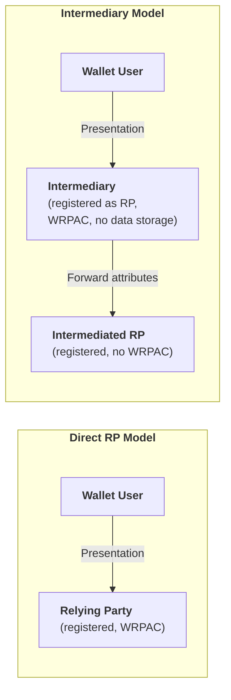
```mermaid
---
config:
  flowchart:
    subGraphTitleMargin:
      bottom: 25
    nodeSpacing: 40
    rankSpacing: 60
---
flowchart LR
    subgraph Direct["`**Direct RP Model**`"]
        direction TB
        U1["`**Wallet User**`"] -->|"Presentation"| RP1["`**Relying Party**
        (registered,&nbsp;WRPAC)`"]
    end

    subgraph Intermediated["`**Intermediary Model**`"]
        direction TB
        U2["`**Wallet User**`"] -->|"Presentation"| INT["`**Intermediary**
        (registered&nbsp;as&nbsp;RP,
        WRPAC,&nbsp;no&nbsp;data&nbsp;storage)`"]
        INT -->|"Forward attributes"| RP2["`**Intermediated RP**
        (registered,&nbsp;no&nbsp;WRPAC)`"]
    end
    
    style U1 text-align:left
    style RP1 text-align:left
    style U2 text-align:left
    style INT text-align:left
    style RP2 text-align:left
```

### 6. Supporting Ecosystem Entities

From the RP perspective, the following ecosystem entities are critical:

| Entity | Role for RP |
|:-------|:------------|
| **Registrar** | Registers the RP, records intended attributes and purposes, issues registration data |
| **Access Certificate Authority** | Issues WRPAC(s) — one per RP Instance — enabling Wallet authentication |
| **Provider of Registration Certificates** | Issues WRPRC (optional per MS) — embeds registration data in a certificate |
| **Trusted List / LoTE Provider** | Publishes trust anchors that Wallet Units use to verify RP certificates |
| **Wallet Provider** | Builds the Wallet Solution that Users interact with; RP has no direct interface |
| **PID Provider** | Issues PIDs that RPs request and verify |
| **Attestation Provider** | Issues QEAAs, PuB-EAAs, EAAs that RPs request and verify |
| **CAB** | Certifies Wallet Solutions — RP relies on certification for trust |
| **Supervisory Body** | Oversees RP compliance with eIDAS 2.0 obligations |

---

## RP Registration

### 7. RP Registration, Data Model, and Registrar API

#### 7.1 Registration Obligation

To rely on Wallet Units for providing a service, an RP **must register** with a Registrar in the Member State where it is established (Art. 5b(1), CIR 2025/848 Art. 3). Registration is a prerequisite for:

1. Receiving one or more **Access Certificates** (WRPAC) from an Access Certificate Authority
2. Optionally receiving one or more **Registration Certificates** (WRPRC) if supported by the MS
3. Having registration data published in the **national register** — publicly accessible online
4. Being discoverable and verifiable by Wallet Units via the **Registrar API**

#### 7.2 Registration Process Overview

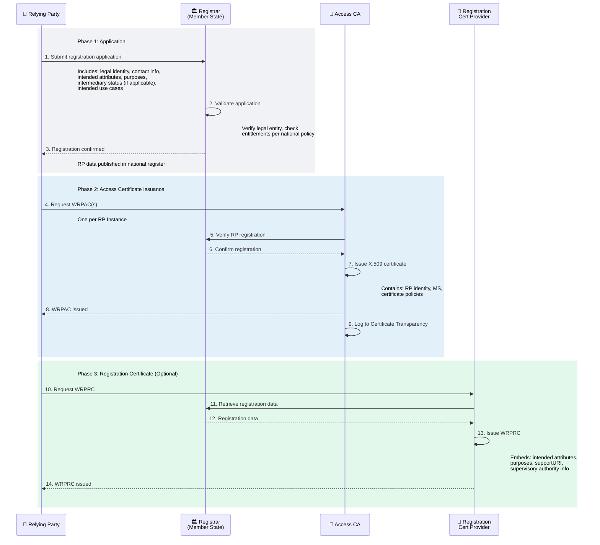
```mermaid
---
config:
  themeVariables:
    noteBkgColor: "transparent"
    noteBorderColor: "transparent"
  sequence:
    messageAlign: left
    noteAlign: left
    actorMargin: 200
---
sequenceDiagram
    participant RP as 🏦 Relying Party
    participant REG as 🏛️ Registrar<br/>(Member State)
    participant ACA as 🔐 Access CA
    participant RCP as 📜 Registration<br/>Cert Provider

    rect rgba(148, 163, 184, 0.14)
    Note right of RP: Phase 1: Application
    RP->>REG: 1. Submit registration application
    Note right of RP: Includes: legal identity, contact info,<br/>intended attributes, purposes,<br/>intermediary status (if applicable),<br/>intended use cases
    REG->>REG: 2. Validate application
    Note right of REG: Verify legal entity, check<br/>entitlements per national policy
    REG-->>RP: 3. Registration confirmed
    Note right of RP: RP data published in national register
    end

    rect rgba(52, 152, 219, 0.14)
    Note right of RP: Phase 2: Access Certificate Issuance
    RP->>ACA: 4. Request WRPAC(s)
    Note right of RP: One per RP Instance
    ACA->>REG: 5. Verify RP registration
    REG-->>ACA: 6. Confirm registration
    ACA->>ACA: 7. Issue X.509 certificate
    Note right of ACA: Contains: RP identity, MS,<br/>certificate policies
    ACA-->>RP: 8. WRPAC issued
    ACA->>ACA: 9. Log to Certificate Transparency
    Note right of ACA: ⠀
    end

    rect rgba(46, 204, 113, 0.14)
    Note right of RP: Phase 3: Registration Certificate (Optional)
    RP->>RCP: 10. Request WRPRC
    RCP->>REG: 11. Retrieve registration data
    REG-->>RCP: 12. Registration data
    RCP->>RCP: 13. Issue WRPRC
    Note right of RCP: Embeds: intended attributes,<br/>purposes, supportURI,<br/>supervisory authority info
    RCP-->>RP: 14. WRPRC issued
    Note right of RP: ⠀
    end
```

**Phase 1 — Application**: The RP submits a registration application to the Registrar in its Member State. The application includes comprehensive information about the RP's identity, intended operations, and the attributes it plans to request from Wallet Users. The Registrar validates the application against national policy.

**Phase 2 — Access Certificate**: Upon successful registration, the RP obtains one or more Access Certificates (WRPACs) from an Access Certificate Authority authorised by the Member State. Each RP Instance (e.g., a web service, a mobile app, a physical terminal) requires its own WRPAC. The Access CA logs all certificates to a Certificate Transparency log.

**Phase 3 — Registration Certificate** (optional): If the Member State's Registrar supports Registration Certificates, a Provider of Registration Certificates issues a WRPRC to the RP. The WRPRC embeds the RP's registration data (intended attributes, purposes, support URI, supervisory authority) in a signed certificate that can be presented to Wallet Units, enabling offline verification without querying the Registrar API.

#### 7.3 RP Registration Data Model (TS5/TS6)

TS5 defines the common data model for RP registration information, and TS6 specifies the minimum common data set required for registration. Together, they define the `WalletRelyingParty` data structure.

#### 7.3.1 WalletRelyingParty Data Model

The core data model uses JSON and is defined in TS5 with the following structure:

```json
{
  "walletRelyingPartyId": "urn:eudi:wrp:de:bank-example:12345",
  "legalName": "Example Bank AG",
  "tradeName": "Example Bank",
  "registrationDate": "2026-06-15",
  "memberState": "DE",
  "registrarId": "urn:eudi:registrar:de:bafin",
  "legalEntityIdentifier": {
    "type": "LEI",
    "value": "5299001GCLKH6FPVJW75"
  },
  "entityType": "PRIVATE",
  "role": "RELYING_PARTY",
  "contactInfo": {
    "supportURI": [
      "https://support.example-bank.de/eudi-wallet",
      "mailto:eudi-support@example-bank.de",
      "tel:+49-800-123-4567"
    ],
    "technicalContact": {
      "name": "EUDI Integration Team",
      "email": "eudi-tech@example-bank.de"
    }
  },
  "intendedAttributes": [
    {
      "attestationType": "eu.europa.ec.eudi.pid.1",
      "attributes": [
        "family_name", "given_name", "birth_date",
        "age_over_18", "nationality", "resident_address"
      ],
      "purpose": "Customer onboarding and KYC verification",
      "lawfulBasis": "Legal obligation (AMLD Art. 13)"
    },
    {
      "attestationType": "eu.europa.ec.eudi.sca.payment.1",
      "attributes": ["pan_last_four", "scheme"],
      "purpose": "Strong Customer Authentication for payments",
      "lawfulBasis": "Legal obligation (PSD2 Art. 97)"
    }
  ],
  "intermediary": {
    "isUsingIntermediary": true,
    "intermediaryId": "urn:eudi:wrp:nl:signicat:67890",
    "intermediaryName": "Signicat B.V."
  },
  "supervisoryAuthority": {
    "name": "Der Bundesbeauftragte für den Datenschutz",
    "infoURI": "https://www.bfdi.bund.de/",
    "email": "poststelle@bfdi.bund.de"
  },
  "status": "ACTIVE",
  "lastUpdated": "2026-06-15T10:30:00Z"
}
```

#### 7.3.2 Mandatory vs. Conditional Attributes (TS6)

TS6 defines which attributes are mandatory and which are conditional based on the RP's role:

| Attribute | Mandatory | Conditional | Notes |
|:----------|:---------:|:-----------:|:------|
| `walletRelyingPartyId` | ✅ | | Unique identifier assigned by Registrar |
| `legalName` | ✅ | | Official legal name of the entity |
| `tradeName` | | ✅ | If different from legal name |
| `memberState` | ✅ | | MS where RP is established |
| `legalEntityIdentifier` | ✅ | | LEI, national ID, or other identifier |
| `entityType` | ✅ | | PUBLIC or PRIVATE |
| `role` | ✅ | | RELYING_PARTY or INTERMEDIARY |
| `contactInfo.supportURI` | ✅ | | At least one: website, email, or phone |
| `intendedAttributes` | ✅ | | Attestation types and attributes RP will request |
| `intendedAttributes[].purpose` | ✅ | | Purpose for requesting each attribute set |
| `intermediary` | | ✅ | Required if RP uses an intermediary |
| `supervisoryAuthority` | ✅ | | DPA contact information |
| `status` | ✅ | | ACTIVE, SUSPENDED, REVOKED |

> **RP Implementation Note**: The `supportURI` field is particularly important because it is used by the Wallet Unit to enable Users to submit data deletion requests (TS7) and is included in the WRPRC (if available). RPs **SHOULD** register a website URL as the primary `supportURI`, as the Wallet Unit assumes a browser is always available on the user's device.


#### 7.4 Registrar REST API

TS5 defines a public REST API (OpenAPI 3.1) enabling any party — including Wallet Units, RPs, and the general public — to query the national register of Wallet-Relying Parties. The API is critical for the RP integration flow because:

1. **Wallet Units query it** to verify RP registration and intended attributes when no WRPRC is available
2. **RPs query it** to verify their own registration status and that of intermediaries
3. **Supervisory bodies** use it for monitoring and enforcement

#### 7.4.1 API Endpoints

| Method | Path | Authentication | Purpose |
|:-------|:-----|:---------------|:--------|
| `GET` | `/wrp` | Public (open) | Query registered WRPs by parameters |
| `GET` | `/wrp/{identifier}` | Public (open) | Retrieve single WRP by identifier |
| `GET` | `/wrp/check-intended-use` | Public (open) | Boolean check if intended use matches |
| `POST` | `/wrp` | Authenticated (MS-specific) | Create new WRP registration |
| `PUT` | `/wrp` | Authenticated (MS-specific) | Update existing WRP registration |
| `DELETE` | `/wrp` | Authenticated (MS-specific) | Delete WRP registration |

> **Key design decision**: Write methods (POST, PUT, DELETE) use Member State–specific authentication and authorisation mechanisms. The harmonisation of the `POST` method has been left for further study — meaning each Member State may implement a different registration application process.

#### 7.4.2 Public Query Parameters

The `GET /wrp` endpoint supports the following query parameters:

| Parameter | Type | Description |
|:----------|:-----|:------------|
| `identifier` | string | Official or business registration number |
| `legalname` | string | Official company name |
| `tradename` | string | Trade name |
| `policy` | string | URL of the WRP's privacy policy |
| `entitlement` | string | Type of entitlement (e.g., PuB-EAA Provider) |
| `providesattestation` | string | Type of attestation provided |
| `usesintermediary` | boolean | Whether WRP uses an intermediary |
| `isintermediary` | boolean | Whether WRP acts as an intermediary |
| `intendeduseidentifier` | string | Identifier for a specific intended use |
| `intendedUseClaimPath` | string | Claim path within an intended use |
| `intendedUseCredentialMeta` | string | Credential metadata for intended use |
| `intendedUseCredentialFormat` | string | Credential format (e.g., `dc+sd-jwt`) |

Parameters can be combined:

```
GET /wrp?identifier=someIdentifier&claimpath=IBAN&credentialformat=dc+sd-jwt
GET /wrp?legalname=Another%20Org&isintermediary=false
```

#### 7.4.3 Response Format

All `GET` responses are **JWS-signed** by the Registrar. A successful `GET /wrp` response returns an array of matching `WalletRelyingParty` objects plus Certificate Transparency log information for each entity's Access Certificates (per RFC 9162).

The dedicated `GET /wrp/check-intended-use` endpoint returns a JWS-signed boolean `TRUE` or `FALSE`, enabling Wallet Units to perform a lightweight check during presentation without downloading the full registration data.

#### 7.4.4 Wallet Unit to Registrar API Interaction

When a Wallet Unit receives a presentation request from an RP Instance that does not include a WRPRC, the Wallet Unit uses the Registrar API to verify the RP's intended attributes:

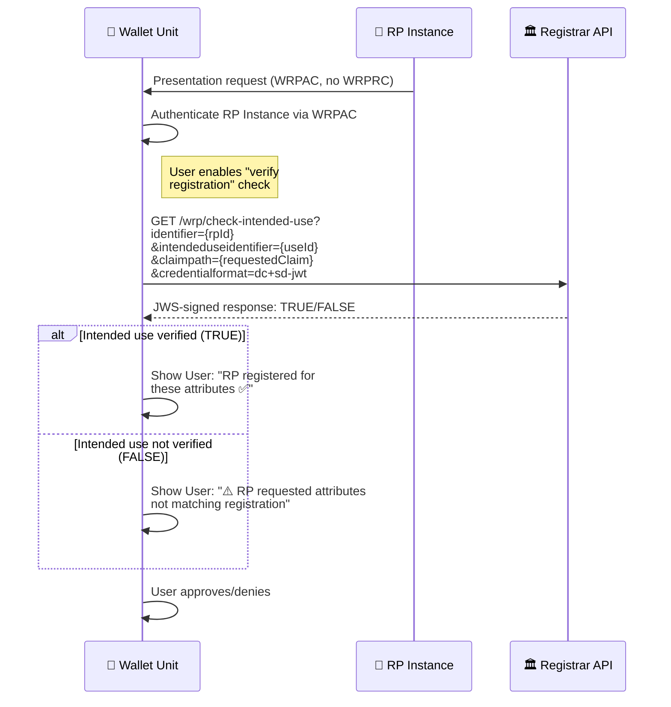
```mermaid
---
config:
  sequence:
    messageAlign: left
    noteAlign: left
---
sequenceDiagram
    participant WU as 📱 Wallet Unit
    participant RPI as 🏦 RP Instance
    participant REG as 🏛️ Registrar API

    RPI->>WU: Presentation request (WRPAC, no WRPRC)
    WU->>WU: Authenticate RP Instance via WRPAC
    Note right of WU: User enables "verify<br/>registration" check

    WU->>REG: GET /wrp/check-intended-use?<br/>identifier={rpId}<br/>&intendeduseidentifier={useId}<br/>&claimpath={requestedClaim}<br/>&credentialformat=dc+sd-jwt
    REG-->>WU: JWS-signed response: TRUE/FALSE
    
    alt Intended use verified (TRUE)
        WU->>WU: Show User: "RP registered for<br/>these attributes ✅"
    else Intended use not verified (FALSE)
        WU->>WU: Show User: "⚠️ RP requested attributes<br/>not matching registration"
    end
    
    WU->>WU: User approves/denies
```

#### 7.4.5 Security Considerations

TS5 mandates the following protections for the Registrar API:

- **DDoS protection**: Cloud-based DDoS protection, WAF, rate limiting
- **Rate limiting**: Per-IP rate limiting (e.g., 3 calls/min — specific limits are MS-defined)
- **Query complexity limits**: Maximum number of query parameters per call
- **Caching**: Aggressive caching for `GET` responses (registration data changes infrequently)
- **Network segmentation**: API servers in private subnet behind WAF, isolated from the Registrar database
- **Monitoring**: Request rates, latency, error rates, source IP alerting

#### 7.5 API Payload Walkthrough (TS5 OpenAPI 3.1)

The following examples are derived from the official TS5 OpenAPI 3.1 specification (`ts5-openapi31-registrar-api.yml`). All `GET` responses are returned as `application/jwt` (JWS compact serialisation) with an `x-jku-url` header pointing to the Registrar's JWKS.

<details>
<summary><strong>GET /wrp?identifier={id}</strong> — Query registered WRPs by identifier</summary>

```http
GET /wrp?identifier=5299001GCLKH6FPVJW75 HTTP/1.1
Host: registrar.example-ms.de
Accept: application/jwt
```

Response (`200 OK`, `Content-Type: application/jwt`, `x-jku-url: https://registrar.example-ms.de/.well-known/jwks.json`):

The JWS payload, once decoded and signature-verified against the Registrar's JWKS, conforms to the `SignedWRPArray` schema:

```json
{
  "iss": "urn:eudi:registrar:de:bafin",
  "iat": 1750003200,
  "data": [
    {
      "providerType": 1,
      "x5c": "<base64-encoded WRPAC>",
      "policy": [
        {
          "policyURI": "https://example-bank.de/privacy",
          "type": "privacy_policy"
        }
      ],
      "entitlement": ["relying_party"],
      "isPSB": false,
      "isIntermediary": false,
      "tradeName": "Example Bank",
      "registryURI": "https://registrar.example-ms.de/wrp/5299001GCLKH6FPVJW75",
      "supportURI": [
        "https://support.example-bank.de/eudi-wallet",
        "mailto:eudi-support@example-bank.de"
      ],
      "supervisoryAuthority": {
        "country": "DE",
        "legalPerson": {
          "legalName": ["Der Bundesbeauftragte für den Datenschutz"]
        },
        "infoURI": ["https://www.bfdi.bund.de/"],
        "email": ["poststelle@bfdi.bund.de"]
      },
      "srvDescription": [
        [
          {"lang": "de", "content": "Online-Banking und Kontoeröffnung"},
          {"lang": "en", "content": "Online banking and account opening"}
        ]
      ],
      "intendedUse": [
        {
          "intendedUseIdentifier": "urn:eudi:wrp:de:example-bank:kyc",
          "createdAt": "2026-06-15T10:30:00Z",
          "purpose": [
            {"lang": "de", "content": "Kundenidentifizierung und KYC-Prüfung"},
            {"lang": "en", "content": "Customer identification and KYC verification"}
          ],
          "privacyPolicy": [
            {
              "policyURI": "https://example-bank.de/privacy/kyc",
              "type": "privacy_policy"
            }
          ],
          "credential": [
            {
              "format": "dc+sd-jwt",
              "meta": "eu.europa.ec.eudi.pid.1",
              "claim": [
                {"path": "family_name"},
                {"path": "given_name"},
                {"path": "birth_date"},
                {"path": "age_over_18"},
                {"path": "nationality"},
                {"path": "resident_address"}
              ]
            }
          ]
        },
        {
          "intendedUseIdentifier": "urn:eudi:wrp:de:example-bank:sca",
          "createdAt": "2026-06-15T10:30:00Z",
          "purpose": [
            {"lang": "en", "content": "Strong Customer Authentication for payments"}
          ],
          "privacyPolicy": [
            {
              "policyURI": "https://example-bank.de/privacy/sca",
              "type": "privacy_policy"
            }
          ],
          "credential": [
            {
              "format": "dc+sd-jwt",
              "meta": "eu.europa.ec.eudi.sca.payment.1",
              "claim": [
                {"path": "pan_last_four"},
                {"path": "scheme"}
              ]
            }
          ]
        }
      ],
      "usesIntermediary": []
    }
  ],
  "pagination": {
    "next_cursor": null,
    "has_next_page": false
  }
}
```

</details>

<details>
<summary><strong>GET /wrp/{identifier}</strong> — Retrieve a single WRP by identifier</summary>

```http
GET /wrp/5299001GCLKH6FPVJW75 HTTP/1.1
Host: registrar.example-ms.de
Accept: application/jwt
```

Response (`200 OK`): Same as the `GET /wrp` response, but the JWS payload conforms to `SignedWRP` (single object, not array):

```json
{
  "iss": "urn:eudi:registrar:de:bafin",
  "iat": 1750003200,
  "data": {
    "providerType": 1,
    "entitlement": ["relying_party"],
    "isPSB": false,
    "isIntermediary": false,
    "tradeName": "Example Bank",
    "registryURI": "https://registrar.example-ms.de/wrp/5299001GCLKH6FPVJW75",
    "supportURI": ["https://support.example-bank.de/eudi-wallet"],
    "intendedUse": [ "..." ]
  }
}
```

`404 Not Found` if the identifier does not match any registered WRP.

</details>

<details>
<summary><strong>GET /wrp/check-intended-use</strong> — Lightweight boolean check (used by Wallet Units)</summary>

This is the most critical endpoint for real-time RP verification during presentation. The Wallet Unit calls it to determine whether the RP is registered for the specific credential and claim it is requesting.

```http
GET /wrp/check-intended-use?rpidentifier=5299001GCLKH6FPVJW75
    &credentialformat=dc%2Bsd-jwt
    &claimpath=family_name
    &credentialmeta=eu.europa.ec.eudi.pid.1
Host: registrar.example-ms.de
Accept: application/jwt
```

Response (`200 OK`): JWS payload conforming to `SignedIntendedUseCheckResult`:

```json
{
  "iss": "urn:eudi:registrar:de:bafin",
  "iat": 1750003200,
  "data": {
    "isRegistered": true,
    "details": "Intended use 'urn:eudi:wrp:de:example-bank:kyc' includes claim 'family_name' in format 'dc+sd-jwt' with meta 'eu.europa.ec.eudi.pid.1'"
  }
}
```

When the RP requests an attribute it is **not** registered for:

```json
{
  "iss": "urn:eudi:registrar:de:bafin",
  "iat": 1750003200,
  "data": {
    "isRegistered": false,
    "details": "No matching intended use found for claim 'IBAN' in format 'dc+sd-jwt'"
  }
}
```

</details>

<details>
<summary><strong>PUT /wrp</strong> — Update existing WRP registration (authenticated)</summary>

```http
PUT /wrp HTTP/1.1
Host: registrar.example-ms.de
Content-Type: application/json
Authorization: Bearer <MS-specific auth token>

{
  "providerType": 1,
  "entitlement": ["relying_party"],
  "isPSB": false,
  "isIntermediary": false,
  "tradeName": "Example Bank",
  "supportURI": [
    "https://support.example-bank.de/eudi-wallet",
    "mailto:eudi-support@example-bank.de",
    "tel:+49-800-123-4567"
  ],
  "intendedUse": [
    {
      "intendedUseIdentifier": "urn:eudi:wrp:de:example-bank:kyc",
      "purpose": [
        {"lang": "en", "content": "Customer identification and KYC verification"}
      ],
      "privacyPolicy": [
        {"policyURI": "https://example-bank.de/privacy/kyc", "type": "privacy_policy"}
      ],
      "credential": [
        {
          "format": "dc+sd-jwt",
          "meta": "eu.europa.ec.eudi.pid.1",
          "claim": [
            {"path": "family_name"},
            {"path": "given_name"},
            {"path": "birth_date"},
            {"path": "resident_address"},
            {"path": "resident_country"}
          ]
        }
      ]
    }
  ]
}
```

Response (`200 OK`): The updated WRP as a JWS-signed `SignedWRP` object. `400` if the payload is invalid, `404` if the WRP does not exist.

> **Note**: The `POST` method for creating new registrations has been **parked for further study** by request of DE. Each Member State may implement a different registration application process.

</details>

<details>
<summary><strong>DELETE /wrp/{identifier}</strong> — Delete a WRP registration (authenticated)</summary>

```http
DELETE /wrp/5299001GCLKH6FPVJW75 HTTP/1.1
Host: registrar.example-ms.de
Authorization: Bearer <MS-specific auth token>
```

Response: `204 No Content` on success, `404 Not Found` if the identifier does not match.

</details>

---

## Trust Infrastructure

### 10. Trust Infrastructure: Certificates, Attestations, and Trusted Lists

#### 10.1 Certificate Hierarchy and Trust Chains

The EUDI Wallet trust infrastructure is built on a hierarchical certificate model that enables Wallet Units to verify the identity and authorisation of every entity they interact with. For the RP, this hierarchy determines how the RP authenticates itself to Wallet Units and how the RP verifies the credentials it receives.

#### 10.1.1 End-to-End Trust Architecture

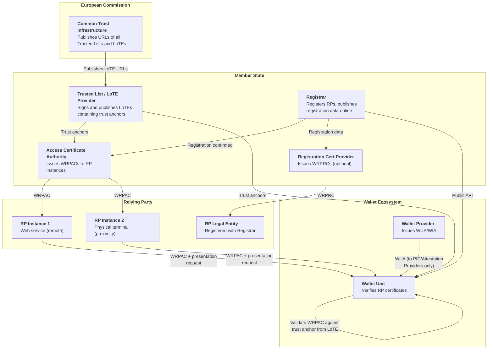
```mermaid
---
config:
  flowchart:
    subGraphTitleMargin:
      bottom: 25
    nodeSpacing: 50
    rankSpacing: 50
---
flowchart TD
    subgraph Commission["`**European Commission**`"]
        CI["`**Common Trust Infrastructure**
        Publishes URLs of all
        Trusted Lists and LoTEs`"]
    end

    subgraph MemberState["`**Member State**`"]
        TLP["`**Trusted List / LoTE Provider**
        Signs and publishes LoTEs
        containing trust anchors`"]
        REG["`**Registrar**
        Registers RPs, publishes
        registration data online`"]
        ACA["`**Access Certificate Authority**
        Issues WRPACs to RP Instances`"]
        RCP["`**Registration Cert Provider**
        Issues WRPRCs (optional)`"]
    end

    subgraph RPSystem["`**Relying Party**`"]
        RP["`**RP Legal Entity**
        Registered with Registrar`"]
        RPI1["`**RP Instance 1**
        Web service (remote)`"]
        RPI2["`**RP Instance 2**
        Physical terminal (proximity)`"]
    end

    subgraph WalletSide["`**Wallet Ecosystem**`"]
        WU["`**Wallet Unit**
        Verifies RP certificates`"]
        WP["`**Wallet Provider**
        Issues WUA/WIA`"]
    end

    CI -->|"Publishes LoTE URLs"| TLP
    TLP -->|"Trust anchors"| ACA
    TLP -->|"Trust anchors"| WU
    REG -->|"Registration confirmed"| ACA
    REG -->|"Registration data"| RCP
    ACA -->|"WRPAC"| RPI1
    ACA -->|"WRPAC"| RPI2
    RCP -->|"WRPRC"| RP
    RPI1 -->|"WRPAC + presentation<br/>request"| WU
    RPI2 -->|"WRPAC + presentation<br/>request"| WU
    WU -->|"Validate WRPAC against<br/>trust anchor from LoTE"| WU
    WP -->|"WUA (to PID/Attestation<br/>Providers only)"| WU
    REG -->|"Public API"| WU

    style CI text-align:left
    style TLP text-align:left
    style REG text-align:left
    style ACA text-align:left
    style RCP text-align:left
    style RP text-align:left
    style RPI1 text-align:left
    style RPI2 text-align:left
    style WU text-align:left
    style WP text-align:left
```

#### 10.1.2 Certificate Chain for RP Authentication

When a Wallet Unit processes a presentation request from an RP Instance, it performs the following certificate chain validation:

```
Trust Anchor (in LoTE, signed by Trusted List Provider)
    └── Intermediate CA Certificate(s) (optional)
        └── WRPAC (Wallet-Relying Party Access Certificate)
            └── Signature over the presentation request
```

The Wallet Unit:

1. Extracts the WRPAC and any intermediate certificates from the presentation request
2. Verifies the signature over the request using the public key in the WRPAC
3. Validates the certificate chain up to the trust anchor obtained from the LoTE
4. Checks revocation status for every certificate in the chain (including the trust anchor if applicable)
5. If all checks pass, the RP Instance is authenticated

#### 10.1.3 Trust Verification from RP Side

When the RP receives a presentation response, it performs its own trust chain validation:

```
PID/QEAA Trust Anchor (in LoTE/Trusted List, via Commission infrastructure)
    └── Intermediate signing certificate(s) (optional)
        └── PID/QEAA Issuer signing key
            └── Signature over the PID/attestation

PuB-EAA Trust Anchor (QTSP Trusted List)
    └── QTSP signing certificate
        └── PuB-EAA Provider certificate
            └── Signature over the PuB-EAA
```

For **non-qualified EAAs**, the applicable Rulebook specifies on how the RP obtains the relevant trust anchor.

#### 10.2 Access Certificates (WRPAC)

#### 10.2.1 Purpose

The **Wallet-Relying Party Access Certificate (WRPAC)** is an X.509 certificate that enables an RP Instance to authenticate itself to a Wallet Unit during a presentation request. It is the primary credential that the RP uses in every interaction with a Wallet Unit.

Key properties:

- **One WRPAC per RP Instance** — each technical system (web service, mobile app, terminal) gets its own certificate
- **Legal subject is the RP** — all WRPACs for a single RP share the same legal entity identity
- **Issued by an Access CA** authorised by the Member State
- **Trust anchors published in LoTE** — enabling cross-border validation by any Wallet Unit in the EU
- **Logged in Certificate Transparency** (RFC 9162) — enabling detection of erroneous or fraudulent issuance
- **ETSI TS 119 475** (draft) defines the detailed certificate profile

#### 10.2.2 WRPAC Structure

Based on ETSI TS 119 475, the WRPAC follows the X.509v3 format with EUDI-specific extensions:

| Field | Content | Example |
|:------|:--------|:--------|
| `Subject.commonName` | RP legal name | `Example Bank AG` |
| `Subject.organizationIdentifier` | RP unique identifier | `VATDE-123456789` |
| `Subject.countryName` | Member State | `DE` |
| `SubjectAltName.dNSName` | Domain name of RP Instance | `eudi.example-bank.de` |
| `Issuer` | Access Certificate Authority | `EUDI Access CA DE` |
| `ExtKeyUsage` | Extended key usage | `id-kp-eudi-wallet-rp-auth` |
| `CRLDistributionPoints` | Revocation checking endpoint | `http://crl.access-ca.de/wrpac.crl` |
| `AuthorityInfoAccess` | OCSP endpoint | `http://ocsp.access-ca.de/` |
| CT Precertificate SCT | Certificate Transparency | Signed Certificate Timestamp |

> **Critical for intermediaries**: When an intermediary acts on behalf of an intermediated RP, the WRPAC belongs to the intermediary. The intermediated RP's identity is conveyed in the **presentation request extension** and the **WRPRC** (if available), not in the WRPAC.

#### 10.2.3 WRPAC Usage in Protocols

**In OpenID4VP (remote flows)**: The RP Instance includes the WRPAC as part of the Signed Authorization Request (JAR). Per HAIP 1.0, client identification uses `x509_hash` — the Wallet Unit can verify the certificate chain from the JWT header.

**In ISO/IEC 18013-5 (proximity flows)**: The RP Instance (mdoc reader) includes the WRPAC in the `ReaderAuth` structure within the `DeviceRequest`. The mdoc verifies the signature over the `ReaderAuthentication` CBOR structure using the public key in the WRPAC.

#### 10.3 Registration Certificates (WRPRC)

#### 10.3.1 Purpose

The **Wallet-Relying Party Registration Certificate (WRPRC)** is an optional certificate that embeds the RP's registration data in a signed, portable format. While the WRPAC proves the RP's *identity*, the WRPRC proves its *authorisation* — specifically, which attributes it registered to request and for what purposes.

Key properties:

- **Optional per Member State** — CIR 2025/848 Art. 8 states Member States **may** authorise CAs to issue WRPRCs
- **Contains registration data** — intended attributes, purposes, support URI, supervisory authority
- **Multiple WRPRCs per RP** — one per intended use (service/purpose)
- **Enables offline verification** — Wallet Units can verify the RP's registered scope without querying the Registrar API
- **ETSI TS 119 411-8** (draft) defines the detailed format
- **Issued by a Provider of Registration Certificates** — separate from the Access CA

#### 10.3.2 WRPRC vs. Online Registry Lookup

| Aspect | WRPRC (Certificate) | Registrar API (Online) |
|:-------|:--------------------|:----------------------|
| **Availability** | Always available (offline-capable) | Requires internet connection |
| **Freshness** | Point-in-time snapshot; must be revoked if policy changes | Real-time data |
| **Verification** | Cryptographic signature verification | JWS-signed API response |
| **Granularity** | One certificate per intended use | Full registration record |
| **Privacy** | No Registrar contacted → no metadata leakage | Registrar sees query → potential tracking |
| **MS dependency** | Optional; not all MS will issue | Mandatory; all MS must provide API |

When both are available, the Wallet Unit prioritises the WRPRC for offline verification efficiency.

#### 10.3.3 Data Included in WRPRC

Based on TS7 and CIR 2025/848 requirements, the WRPRC contains at minimum:

- RP's user-friendly name and unique identifier
- Intended use description (human-readable)
- Attributes the RP is authorised to request for this intended use
- URL to the RP's privacy policy
- `supportURI` — contact endpoints for data deletion requests (website, email, phone)
- `supervisoryAuthority` — DPA contact information (name, URI, email)
- Registrar identifier and URL

#### 10.4 Wallet Unit Attestation (WUA): RP Perspective

#### 10.4.1 What RPs Need to Know

The **Wallet Unit Attestation (WUA)** is a signed information object issued by the Wallet Provider to the Wallet Unit during activation. However, there is a critical design decision in the ARF that RPs must understand:

> **WUAs are NOT presented to Relying Parties.** They are presented only to PID Providers and Attestation Providers during issuance. This is a deliberate privacy-preserving design: RPs do not have a business need to know the WSCA/WSCD properties of a Wallet Unit, and exposing WUAs to RPs would enable linkability.

This means that an RP **cannot directly verify** whether a Wallet Unit has been revoked by checking a WUA. Instead, the RP relies on two indirect mechanisms:

1. **PID credential validity**: PID Providers are legally required (CIR 2024/2977, Art. 5.4(b)) to revoke a PID when the Wallet Unit is revoked. If the RP verifies the PID is not revoked (via Status List), it can trust the Wallet Unit is valid.
2. **Attestation validity**: Attestation Providers may similarly revoke attestations when a Wallet Unit is revoked.

#### 10.4.2 Implications for RP Verification Flow

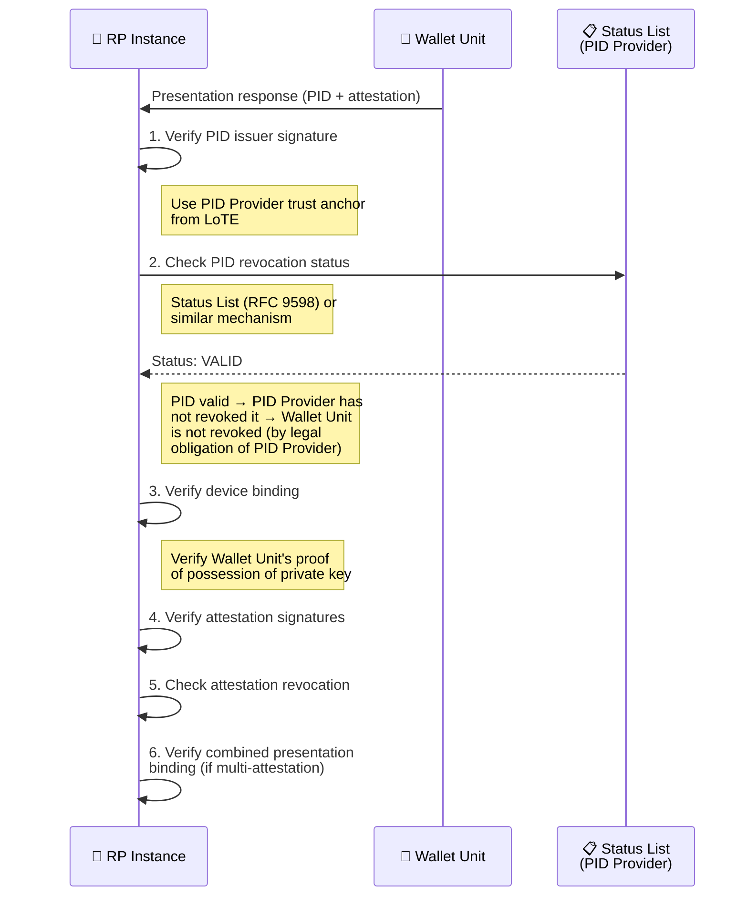
```mermaid
---
config:
  sequence:
    messageAlign: left
    noteAlign: left
---
sequenceDiagram
    participant RPI as 🏦 RP Instance
    participant WU as 📱 Wallet Unit
    participant SL as 📋 Status List<br/>(PID Provider)

    WU->>RPI: Presentation response (PID + attestation)
    
    RPI->>RPI: 1. Verify PID issuer signature
    Note right of RPI: Use PID Provider trust anchor<br/>from LoTE

    RPI->>SL: 2. Check PID revocation status
    Note right of RPI: Status List (RFC 9598) or<br/>similar mechanism
    SL-->>RPI: Status: VALID
    Note right of RPI: PID valid → PID Provider has<br/>not revoked it → Wallet Unit<br/>is not revoked (by legal<br/>obligation of PID Provider)

    RPI->>RPI: 3. Verify device binding
    Note right of RPI: Verify Wallet Unit's proof<br/>of possession of private key

    RPI->>RPI: 4. Verify attestation signatures
    RPI->>RPI: 5. Check attestation revocation
    RPI->>RPI: 6. Verify combined presentation<br/>binding (if multi-attestation)
```

#### 10.4.3 Wallet Instance Attestation (WIA): Also Not Seen by RPs

Similarly, the **Wallet Instance Attestation (WIA)** — a short-lived (< 24 hours) attestation about the Wallet Instance — is presented only to Providers, not to RPs.

#### 10.5 Trusted Lists and Lists of Trusted Entities

#### 10.5.1 Architecture

The trust anchor discovery mechanism in the EUDI Wallet ecosystem uses a two-tier architecture:

1. **Common Trust Infrastructure** — Maintained by the European Commission. Contains the URLs of all Trusted Lists and LoTEs across all Member States. Any entity in the ecosystem can discover all trust anchors by starting from this common infrastructure.

2. **Trusted Lists and LoTEs** — Published by Member State Trusted List/LoTE Providers. Each LoTE contains the trust anchors (public key + entity identifier) for the entities notified by that Member State.

#### 10.5.2 LoTE Types Relevant to RPs

| LoTE Type | Contains Trust Anchors Of | RP Uses It To |
|:----------|:--------------------------|:--------------|
| **Access CA LoTE** | Access Certificate Authorities | N/A (Wallet Units use this to verify WRPAC) |
| **PID Provider LoTE** | PID Providers (notified) | Verify PID issuer signatures |
| **QEAA Trusted List** | QEAA Providers (qualified status) | Verify QEAA issuer signatures |
| **PuB-EAA Trusted List** | PuB-EAA Providers (notified) | Discover PuB-EAA Provider identity; actual verification uses QTSP certificate |
| **QTSP Trusted List** | Qualified Trust Service Providers (Art. 22) | Verify PuB-EAA Provider certificates |
| **Registration Cert LoTE** | Providers of Registration Certificates | N/A (Wallet Units use this to verify WRPRCs) |
| **Wallet Provider LoTE** | Wallet Providers | N/A (Providers use this to verify WUA/WIA) |

#### 10.5.3 RP Trust Anchor Retrieval Flow

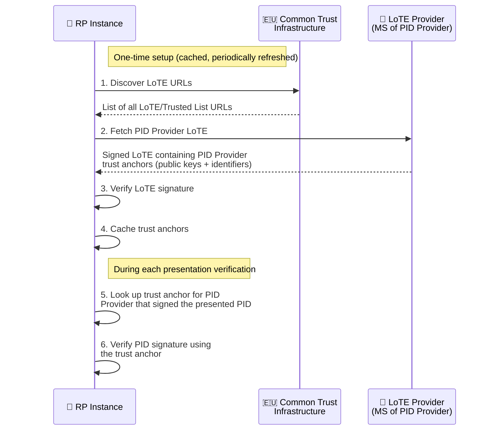
```mermaid
---
config:
  sequence:
    messageAlign: left
    noteAlign: left
---
sequenceDiagram
    participant RPI as 🏦 RP Instance
    participant CTI as 🇪🇺 Common Trust<br/>Infrastructure
    participant LOTE as 📜 LoTE Provider<br/>(MS of PID Provider)

    Note right of RPI: One-time setup (cached, periodically refreshed)
    
    RPI->>CTI: 1. Discover LoTE URLs
    CTI-->>RPI: List of all LoTE/Trusted List URLs
    
    RPI->>LOTE: 2. Fetch PID Provider LoTE
    LOTE-->>RPI: Signed LoTE containing PID Provider<br/>trust anchors (public keys + identifiers)
    
    RPI->>RPI: 3. Verify LoTE signature
    RPI->>RPI: 4. Cache trust anchors

    Note right of RPI: During each presentation verification
    
    RPI->>RPI: 5. Look up trust anchor for PID<br/>Provider that signed the presented PID
    RPI->>RPI: 6. Verify PID signature using<br/>the trust anchor
```

#### 10.5.4 Trust Anchor Lifecycle Events That Affect RPs

| Event | Impact on RP |
|:------|:-------------|
| **PID Provider suspended** | LoTE status changed to Invalid → RP should reject PIDs from this Provider |
| **QEAA Provider loses qualified status** | Trusted List updated → RP should reject new QEAAs from this Provider |
| **Access CA compromised** | LoTE updated → Wallet Units stop trusting WRPACs from this CA → RP must obtain new WRPAC from different CA |
| **Wallet Provider suspended** | Wallet Provider LoTE updated → PID/Attestation Providers stop issuing → existing PIDs remain valid until revoked |
| **RP registration suspended** | WRPAC revoked → RP Instance can no longer authenticate to Wallet Units |

> **RP operational requirement**: RPs must implement periodic LoTE/Trusted List refresh (at minimum daily, recommended more frequently) to ensure they are using current trust anchors for verifying presented credentials. Stale trust anchors could lead to accepting credentials from suspended Providers.

---

## Credential Formats

### 15. SD-JWT VC Format Deep-Dive

#### 15.1 Overview

**SD-JWT VC** (Selective Disclosure JSON Web Token Verifiable Credential) is one of two mandatory credential formats in the EUDI Wallet ecosystem (alongside mdoc). It is the primary format for remote (over-the-internet) presentation flows.

An SD-JWT VC consists of three parts, serialised as a single string separated by tildes (`~`):

```
<Issuer-signed JWT>~<Disclosure 1>~<Disclosure 2>~...~<Key Binding JWT>
```

| Component | Purpose |
|:----------|:--------|
| **Issuer-signed JWT** | Contains the credential metadata and hashed attribute references; signed by the PID/Attestation Provider |
| **Disclosures** | Base64url-encoded `[salt, claim_name, claim_value]` arrays — one per selectively-disclosed attribute |
| **Key Binding JWT** | Proves the presenter (Wallet Unit) possesses the private key bound to the credential; signed by the Wallet Unit |

#### 15.2 Structure: Decoded Issuer JWT

The decoded payload of the Issuer-signed JWT for a PID:

```json
{
  "iss": "https://pid-provider.example.de",
  "iat": 1719504000,
  "exp": 1751040000,
  "vct": "eu.europa.ec.eudi.pid.1",
  "cnf": {
    "jwk": {
      "kty": "EC",
      "crv": "P-256",
      "x": "TCAER19Zvu3OHF4j4W4vfSVoHIP1ILilDls7vCeGemc",
      "y": "ZxjiWWbZMQGHVWKVQ4hbSIirsVfuecCE6t4jT9F2HZQ"
    }
  },
  "status": {
    "status_list": {
      "idx": 4321,
      "uri": "https://pid-provider.example.de/statuslist/1"
    }
  },
  "_sd": [
    "09vKrJMOGniTguCgaSferQ3JnE-qHcslWfuVxjKl_kY",
    "2FK0leQ_7mlJPG0VGNSBqj-nA36-tVac3K5vGqhlBPo",
    "Cmz3HYpvJPl9C_x4EQk6gSsqakzGVhGP3aeNOmTi8DI"
  ],
  "_sd_alg": "sha-256"
}
```

Key fields:

- `vct` — Verifiable Credential Type: `eu.europa.ec.eudi.pid.1` for PID
- `cnf.jwk` — Confirmation key: the public key of the Wallet Unit (device binding)
- `status` — Status List reference for revocation checking
- `_sd` — Array of hashes of the selectable disclosures
- `_sd_alg` — Hash algorithm used (`sha-256`)

#### 15.3 Selective Disclosure in Practice

When the RP requests only `family_name` and `age_over_18`, the Wallet Unit:

1. Includes only the corresponding Disclosures (not all of them)
2. The RP can verify these Disclosures by hashing them and comparing with the `_sd` array in the Issuer JWT
3. Attributes NOT included in the Disclosures remain hidden — the RP sees only their hashes

Example Disclosures included:

```
WyJfMjZCY1R0ckJNR0RpaVl3UmRhZ0xBIiwiZmFtaWx5X25hbWUiLCJNw7xsbGVyIl0
~
WyJlbHVWNU9nM2dTTklJOEVZbnN4QV9BIiwiYWdlX292ZXJfMTgiLHRydWVd
```

Decoded: `["_26BcTrkBMGDiiYwRdagLA", "family_name", "Müller"]` and `["eluV5Og3gSNII8EYnsxA_A", "age_over_18", true]`

#### 15.4 Key Binding JWT

The Key Binding JWT proves the presenter controls the private key referenced in `cnf.jwk`. Its payload:

```json
{
  "aud": "https://verifier.example-bank.de",
  "nonce": "dBjftJeZ4CVP-mB92K27uhbUJU1p1r_wW1gFWFOEjXk",
  "iat": 1709769600,
  "sd_hash": "fUMUMhki0LFWse...base64url_of_sha256_of_sd_jwt"
}
```

- `aud` — The RP's identifier (prevents replay to a different RP)
- `nonce` — The nonce from the presentation request (prevents replay)
- `sd_hash` — Hash of the entire SD-JWT (binds the KB-JWT to the specific presentation)

### 16. mdoc (ISO/IEC 18013-5) Format Deep-Dive

#### 16.1 Overview

**mdoc** (mobile document) is the credential format defined by ISO/IEC 18013-5, originally for mobile driving licences (mDL). In the EUDI Wallet ecosystem, it is the mandatory format for **proximity** presentation flows and is also supported for remote flows via ISO/IEC 18013-7.

mdoc uses CBOR (Concise Binary Object Representation) encoding, which is more compact than JSON and optimised for constrained environments (NFC, BLE).

#### 16.2 mdoc Structure

An mdoc consists of two main structures:

```
MobileSecurityObject (MSO)
├── Signed by Issuer (PID/Attestation Provider)
├── Contains:
│   ├── Version
│   ├── Digest algorithm (SHA-256)
│   ├── Value digests (hash of each data element, per namespace)
│   ├── Device key info (public key bound to Wallet Unit)
│   ├── DocType (e.g., "eu.europa.ec.eudi.pid.1")
│   └── Validity info (signed, validFrom, validUntil)
│
IssuerSignedItem[]
├── Per-namespace arrays of data elements
├── Each item: { digestID, random, elementIdentifier, elementValue }
└── Selective disclosure by omission (don't include items you don't want to disclose)
```

#### 16.3 MSO in CBOR Diagnostic Notation

```
{
  "version": "1.0",
  "digestAlgorithm": "SHA-256",
  "valueDigests": {
    "eu.europa.ec.eudi.pid.1": {
      0: h'75167029...',  ; digest of family_name
      1: h'67e539d6...',  ; digest of given_name
      2: h'3394372d...',  ; digest of birth_date
      3: h'2e35ad3c...',  ; digest of age_over_18
    }
  },
  "deviceKeyInfo": {
    "deviceKey": {
      1: 2,      ; kty: EC2
      -1: 1,     ; crv: P-256
      -2: h'...' ; x-coordinate
      -3: h'...' ; y-coordinate
    }
  },
  "docType": "eu.europa.ec.eudi.pid.1",
  "validityInfo": {
    "signed": "2026-01-15T00:00:00Z",
    "validFrom": "2026-01-15T00:00:00Z",
    "validUntil": "2027-01-15T00:00:00Z"
  }
}
```

#### 16.4 Selective Disclosure in mdoc

Unlike SD-JWT VC (which uses hash-based selective disclosure), mdoc achieves selective disclosure by **omission**:

1. The MSO contains digests (hashes) of ALL data elements
2. The Wallet Unit includes only the `IssuerSignedItem` entries for the attributes the User approves
3. The RP can verify each received item by recomputing its hash and checking against the MSO digest
4. Items NOT included are invisible to the RP — the RP only sees their digest IDs

#### 16.5 Device Authentication (mdoc)

In proximity flows, the Wallet Unit provides a `DeviceAuth` structure:

```
DeviceAuth = {
  "deviceSignature": COSE_Sign1  ; over SessionTranscript
}
```

The `SessionTranscript` binds the response to the specific session, preventing replay. The RP verifies the signature using the `deviceKey` from the MSO.

### 17. Format Selection: SD-JWT VC vs. mdoc

| Aspect | SD-JWT VC | mdoc (ISO 18013-5) |
|:-------|:----------|:-------------------|
| **Encoding** | JSON / JWT (Base64url) | CBOR (binary) |
| **Transport** | HTTP / OpenID4VP | BLE / NFC / Wi-Fi Aware + ISO 18013-5 |
| **Primary use** | Remote flows (internet) | Proximity flows (face-to-face) |
| **Remote support** | Native via OpenID4VP | Via ISO 18013-7 over OpenID4VP |
| **Selective disclosure** | Hash-based (`_sd` array + Disclosures) | Omission-based (exclude IssuerSignedItems) |
| **Device binding** | Key Binding JWT (KB-JWT) | DeviceAuth (COSE_Sign1) |
| **Revocation** | Status List (JWT claim) | Status List or issuer-defined |
| **Size efficiency** | Larger (JSON text + Base64) | Smaller (CBOR binary) |
| **Offline verification** | Possible (if trust anchor cached) | Native (designed for offline) |
| **W2W interactions** | NOT supported (TS9) | Mandatory for W2W |
| **HAIP 1.0 support** | Yes | Yes (via ISO 18013-7) |

> **RP implementation note**: RPs MUST support both formats. For remote flows, the RP typically receives SD-JWT VCs. For proximity flows, the RP receives mdoc. For remote flows, the RP may also receive mdoc via ISO 18013-7 encapsulation in OpenID4VP. The DCQL query language allows the RP to express format preferences.

---

## Remote Presentation Flows

### 18. OpenID4VP Protocol Foundations

#### 18.1 Protocol Overview

**OpenID for Verifiable Presentations (OpenID4VP) 1.0** — which achieved Final Specification status in July 2025 — extends OAuth 2.0 to enable a Wallet (acting as an Authorization Server) to present Verifiable Credentials to an RP (acting as a Client/Verifier).

The core flow follows the OAuth 2.0 Authorization Code flow pattern, with key differences:

1. The **Authorization Request** contains a `dcql_query` (DCQL) specifying which credentials/attributes the RP needs
2. The **Authorization Response** contains a `vp_token` with the Verifiable Presentation(s)
3. Client identification uses `x509_hash` (WRPAC hash) rather than traditional OAuth client credentials
4. The request is a **Signed Authorization Request** (JAR — JWT-Secured Authorization Request)

#### 18.2 Key Protocol Parameters

| Parameter | Direction | Description |
|:----------|:----------|:------------|
| `client_id` | Request | RP identifier (hash of WRPAC in HAIP) |
| `client_id_scheme` | Request | `x509_hash` (HAIP mandatory) |
| `response_type` | Request | `vp_token` |
| `response_mode` | Request | `direct_post.jwt` (HAIP mandatory — encrypted response) |
| `dcql_query` | Request | DCQL-format query specifying required credentials and claims |
| `nonce` | Request | Random value for replay prevention |
| `state` | Request | Session binding for the RP |
| `response_uri` | Request | URL where Wallet posts the encrypted response |
| `transaction_data` | Request | Transaction-specific data for SCA (TS12) |
| `vp_token` | Response | Contains the Verifiable Presentation(s) |

### 19. HAIP 1.0 Requirements for RPs

**HAIP 1.0** (High Assurance Interoperability Profile), approved as a Final Specification by the OIDF in December 2025, defines mandatory requirements for the EUDI Wallet ecosystem.

#### 19.1 Mandatory RP Requirements Under HAIP

| Requirement | Specification | Impact on RP |
|:------------|:-------------|:-------------|
| **Signed Authorization Requests (JAR)** | Request must be a JWT signed with the RP's WRPAC private key | RP must implement JWT signing with X.509 |
| **Client ID via `x509_hash`** | Client identification via hash of the X.509 WRPAC | RP must compute and include certificate hash |
| **Encrypted responses** | `response_mode` = `direct_post.jwt` with ECDH-ES | RP must implement JWE decryption |
| **DCQL mandatory** | Must use DCQL (not legacy `presentation_definition`) | RP must implement DCQL query generation |
| **Response encryption** | Response encrypted to RP's ephemeral public key | RP generates ephemeral key pair per session |
| **Nonce binding** | Each request includes a unique nonce | RP must generate and validate nonces |

### 20. Same-Device Remote Presentation

#### 20.1 Flow Description

In the **same-device flow**, the User's browser and the Wallet Unit are on the same device. The RP's website (accessed via the browser) triggers the Wallet Unit to handle the presentation request.

#### 20.2 Detailed Sequence Diagram

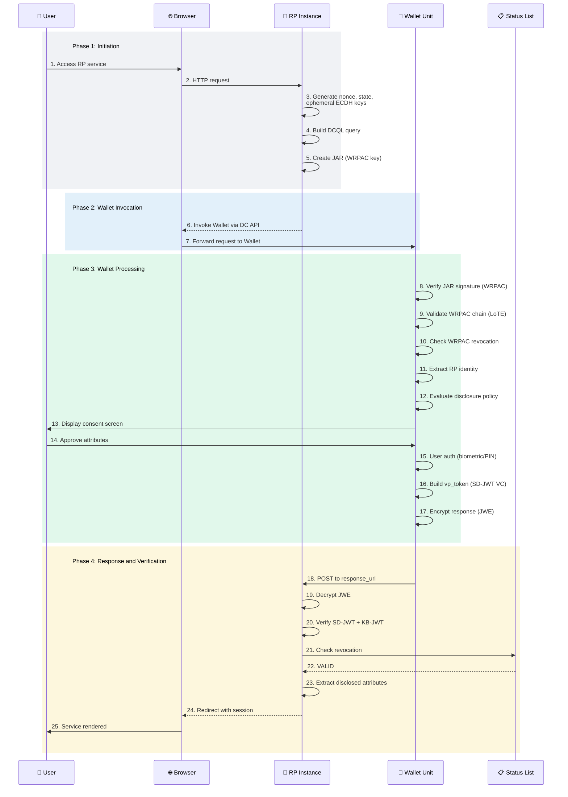
```mermaid
---
config:
  themeVariables:
    noteBkgColor: "transparent"
    noteBorderColor: "transparent"
  sequence:
    messageAlign: left
    noteAlign: left
    actorMargin: 120
---
sequenceDiagram
    participant User as 👤 User
    participant Browser as 🌐 Browser
    participant RP as 🏦 RP Instance
    participant WU as 📱 Wallet Unit
    participant SL as 📋 Status List

    rect rgba(148, 163, 184, 0.14)
    Note right of User: Phase 1: Initiation
    User->>Browser: 1. Access RP service
    Browser->>RP: 2. HTTP request
    RP->>RP: 3. Generate nonce, state,<br/>ephemeral ECDH keys
    RP->>RP: 4. Build DCQL query
    RP->>RP: 5. Create JAR (WRPAC key)
    end

    rect rgba(52, 152, 219, 0.14)
    Note right of User: Phase 2: Wallet Invocation
    RP-->>Browser: 6. Invoke Wallet via DC API
    Browser->>WU: 7. Forward request to Wallet
    end

    rect rgba(46, 204, 113, 0.14)
    Note right of User: Phase 3: Wallet Processing
    WU->>WU: 8. Verify JAR signature (WRPAC)
    WU->>WU: 9. Validate WRPAC chain (LoTE)
    WU->>WU: 10. Check WRPAC revocation
    WU->>WU: 11. Extract RP identity
    WU->>WU: 12. Evaluate disclosure policy
    WU->>User: 13. Display consent screen
    User->>WU: 14. Approve attributes
    WU->>WU: 15. User auth (biometric/PIN)
    WU->>WU: 16. Build vp_token (SD-JWT VC)
    WU->>WU: 17. Encrypt response (JWE)
    end

    rect rgba(241, 196, 15, 0.14)
    Note right of User: Phase 4: Response and Verification
    WU->>RP: 18. POST to response_uri
    RP->>RP: 19. Decrypt JWE
    RP->>RP: 20. Verify SD-JWT + KB-JWT
    RP->>SL: 21. Check revocation
    SL-->>RP: 22. VALID
    RP->>RP: 23. Extract disclosed attributes
    RP-->>Browser: 24. Redirect with session
    Browser->>User: 25. Service rendered
    Note right of RP: ⠀
    end
```

#### 20.3 Step-by-Step Payload Walkthrough

<details>
<summary><strong>Step 5 — RP constructs the JAR</strong> (same-device uses x509_hash client_id_scheme)</summary>

```json
{
  "iss": "https://verifier.example-bank.de",
  "aud": "https://self-issued.me/v2",
  "exp": 1709770200,
  "iat": 1709769600,
  "nbf": 1709769600,
  "jti": "f47ac10b-58cc-4372-a567-0e02b2c3d479",
  "client_id": "x509_hash://sha-256/fUMUMhki0LF...",
  "client_id_scheme": "x509_hash",
  "response_type": "vp_token",
  "response_mode": "direct_post.jwt",
  "response_uri": "https://verifier.example-bank.de/oid4vp/callback",
  "nonce": "dBjftJeZ4CVP-mB92K27uhbUJU1p1r_wW1gFWFOEjXk",
  "state": "af0ifjsldkj",
  "response_encryption_alg": "ECDH-ES",
  "response_encryption_enc": "A256GCM",
  "response_encryption_jwk": {
    "kty": "EC",
    "crv": "P-256",
    "x": "TCAER19Zvu3OHF4j4W4vfSVoHIP1ILilDls7vCeGemc",
    "y": "ZxjiWWbZMQGHVWKVQ4hbSIirsVfuecCE6t4jT9F2HZQ"
  },
  "dcql_query": {
    "credentials": [
      {
        "id": "pid",
        "format": "dc+sd-jwt",
        "meta": {
          "vct_values": ["eu.europa.ec.eudi.pid.1"]
        },
        "claims": [
          {"path": ["family_name"]},
          {"path": ["given_name"]},
          {"path": ["birth_date"]},
          {"path": ["age_over_18"]}
        ]
      }
    ]
  }
}
```

> **Same-device vs. cross-device**: In same-device flows, `client_id_scheme` is `x509_hash` — the browser/OS verifies the RP's origin matches the WRPAC's `dNSName`. In cross-device flows, `x509_san_dns` is used because there is no browser origin verification.

</details>

<details>
<summary><strong>Step 6 — RP invokes Wallet via W3C Digital Credentials API</strong></summary>

```javascript
const credential = await navigator.identity.get({
  digital: {
    requests: [{
      protocol: "openid4vp",
      data: {
        request: "<JWS compact serialization of JAR above>"
      }
    }]
  }
});
// credential.data contains the encrypted JWE response
```

The browser enforces **origin binding**: it verifies that the calling origin matches the `dNSName` SAN in the WRPAC's X.509 certificate (via the `x5c` header in the JAR). This prevents a malicious website from using another RP's WRPAC.

</details>

<details>
<summary><strong>Step 16 — Wallet builds vp_token</strong> (SD-JWT VC + KB-JWT)</summary>

```
<Issuer-signed JWT>~<Disclosure:family_name>~<Disclosure:given_name>~<Disclosure:birth_date>~<Disclosure:age_over_18>~<KB-JWT>
```

Key Binding JWT payload:

```json
{
  "typ": "kb+jwt",
  "aud": "x509_hash://sha-256/fUMUMhki0LF...",
  "nonce": "dBjftJeZ4CVP-mB92K27uhbUJU1p1r_wW1gFWFOEjXk",
  "iat": 1741269093,
  "sd_hash": "Re-CtLZfjGLErKy3eSriZ4bBx3AtUH5Q5wsWiiWKIwY"
}
```

</details>

<details>
<summary><strong>Step 18 — Wallet POSTs encrypted response</strong> + decrypted JWE payload</summary>

```http
POST /oid4vp/callback HTTP/1.1
Host: verifier.example-bank.de
Content-Type: application/x-www-form-urlencoded

response=<JWE compact serialization>
```

Decrypted JWE payload:

```json
{
  "vp_token": "<SD-JWT VC string as above>",
  "presentation_submission": {
    "id": "submission-1",
    "definition_id": "dcql-query-1",
    "descriptor_map": [
      {
        "id": "pid",
        "format": "dc+sd-jwt",
        "path": "$"
      }
    ]
  },
  "state": "af0ifjsldkj"
}
```

</details>

### 21. Cross-Device Remote Presentation

#### 21.1 Flow Description

In the **cross-device flow**, the User accesses the RP's service on one device (e.g., a laptop browser) but their Wallet Unit is on a different device (e.g., a smartphone). Connection between devices is established via a QR code, with the operating system ensuring proximity.

#### 21.2 Detailed Sequence Diagram

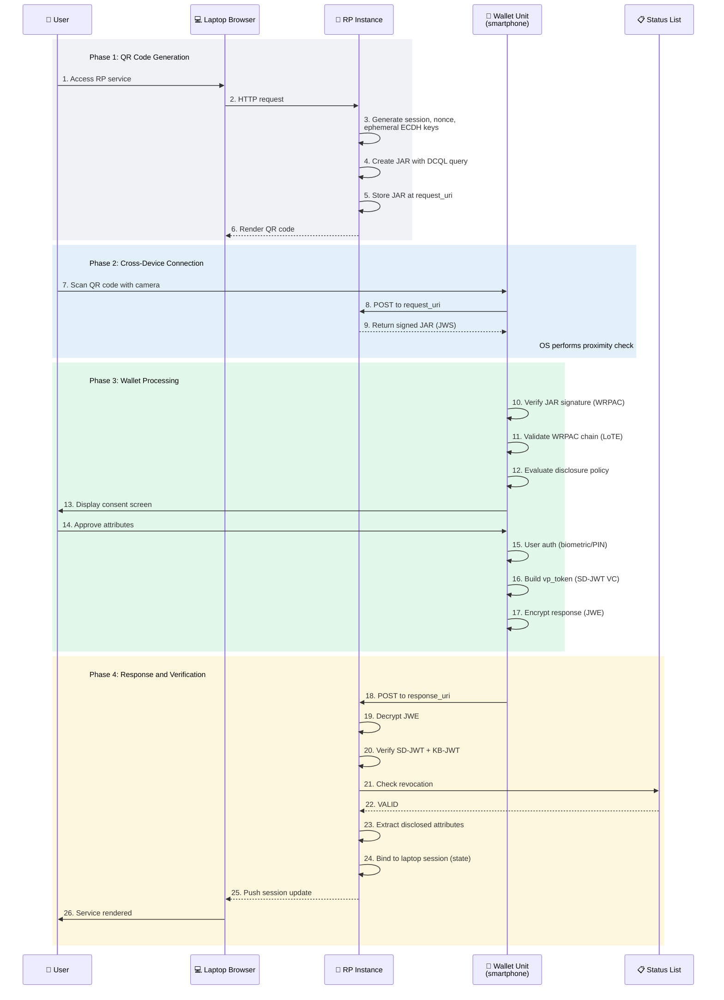
```mermaid
---
config:
  themeVariables:
    noteBkgColor: "transparent"
    noteBorderColor: "transparent"
  sequence:
    messageAlign: left
    noteAlign: left
    actorMargin: 120
---
sequenceDiagram
    participant User as 👤 User
    participant Laptop as 💻 Laptop Browser
    participant RP as 🏦 RP Instance
    participant Phone as 📱 Wallet Unit<br/>(smartphone)
    participant SL as 📋 Status List

    rect rgba(148, 163, 184, 0.14)
    Note right of User: Phase 1: QR Code Generation
    User->>Laptop: 1. Access RP service
    Laptop->>RP: 2. HTTP request
    RP->>RP: 3. Generate session, nonce,<br/>ephemeral ECDH keys
    RP->>RP: 4. Create JAR with DCQL query
    RP->>RP: 5. Store JAR at request_uri
    RP-->>Laptop: 6. Render QR code
    end

    rect rgba(52, 152, 219, 0.14)
    Note right of User: Phase 2: Cross-Device Connection
    User->>Phone: 7. Scan QR code with camera
    Phone->>RP: 8. POST to request_uri
    RP-->>Phone: 9. Return signed JAR (JWS)
    Note right of Phone: OS performs proximity check
    end

    rect rgba(46, 204, 113, 0.14)
    Note right of User: Phase 3: Wallet Processing
    Phone->>Phone: 10. Verify JAR signature (WRPAC)
    Phone->>Phone: 11. Validate WRPAC chain (LoTE)
    Phone->>Phone: 12. Evaluate disclosure policy
    Phone->>User: 13. Display consent screen
    User->>Phone: 14. Approve attributes
    Phone->>Phone: 15. User auth (biometric/PIN)
    Phone->>Phone: 16. Build vp_token (SD-JWT VC)
    Phone->>Phone: 17. Encrypt response (JWE)
    end

    rect rgba(241, 196, 15, 0.14)
    Note right of User: Phase 4: Response and Verification
    Phone->>RP: 18. POST to response_uri
    RP->>RP: 19. Decrypt JWE
    RP->>RP: 20. Verify SD-JWT + KB-JWT
    RP->>SL: 21. Check revocation
    SL-->>RP: 22. VALID
    RP->>RP: 23. Extract disclosed attributes
    RP->>RP: 24. Bind to laptop session (state)
    RP-->>Laptop: 25. Push session update
    Laptop->>User: 26. Service rendered
    Note right of RP: ⠀
    end
```

#### 21.3 Step-by-Step Payload Walkthrough

<details>
<summary><strong>Step 4 — RP constructs the JAR</strong> (JWT-Secured Authorization Request, signed with WRPAC private key)</summary>

```json
{
  "iss": "https://verifier.example-bank.de",
  "aud": "https://self-issued.me/v2",
  "exp": 1709770200,
  "iat": 1709769600,
  "nbf": 1709769600,
  "jti": "f47ac10b-58cc-4372-a567-0e02b2c3d479",
  "client_id": "x509_san_dns:eudi.example-bank.de",
  "client_id_scheme": "x509_san_dns",
  "response_type": "vp_token",
  "response_mode": "direct_post.jwt",
  "response_uri": "https://verifier.example-bank.de/oid4vp/callback",
  "nonce": "dBjftJeZ4CVP-mB92K27uhbUJU1p1r_wW1gFWFOEjXk",
  "state": "af0ifjsldkj",
  "response_encryption_alg": "ECDH-ES",
  "response_encryption_enc": "A256GCM",
  "response_encryption_jwk": {
    "kty": "EC",
    "crv": "P-256",
    "x": "TCAER19Zvu3OHF4j4W4vfSVoHIP1ILilDls7vCeGemc",
    "y": "ZxjiWWbZMQGHVWKVQ4hbSIirsVfuecCE6t4jT9F2HZQ"
  },
  "dcql_query": {
    "credentials": [
      {
        "id": "pid",
        "format": "dc+sd-jwt",
        "meta": {
          "vct_values": ["eu.europa.ec.eudi.pid.1"]
        },
        "claims": [
          {"path": ["family_name"]},
          {"path": ["given_name"]},
          {"path": ["birth_date"]}
        ]
      }
    ]
  }
}
```

The JAR is signed as a JWS with the RP's WRPAC private key. The JWS header contains the WRPAC chain (`x5c`):

```json
{
  "alg": "ES256",
  "typ": "oauth-authz-req+jwt",
  "x5c": [
    "<WRPAC certificate (DER, base64)>",
    "<Access CA intermediate certificate>"
  ]
}
```

</details>

<details>
<summary><strong>Step 6 — QR code content</strong> (URL-encoded)</summary>

```
openid4vp://authorize?
  request_uri=https://verifier.example-bank.de/oid4vp/request/f47ac10b
  &client_id=x509_san_dns:eudi.example-bank.de
```

</details>

<details>
<summary><strong>Step 8 — Wallet POSTs to request_uri</strong> (using request_uri_method: post for freshness)</summary>

```http
POST /oid4vp/request/f47ac10b HTTP/1.1
Host: verifier.example-bank.de
Content-Type: application/x-www-form-urlencoded

wallet_nonce=xyz789abc
```

</details>

<details>
<summary><strong>Step 16 — Wallet builds vp_token</strong> (SD-JWT VC with selected disclosures + Key Binding JWT)</summary>

```
<Issuer-signed JWT>~<Disclosure:family_name>~<Disclosure:given_name>~<Disclosure:birth_date>~<KB-JWT>
```

Key Binding JWT payload:

```json
{
  "typ": "kb+jwt",
  "aud": "x509_san_dns:eudi.example-bank.de",
  "nonce": "dBjftJeZ4CVP-mB92K27uhbUJU1p1r_wW1gFWFOEjXk",
  "iat": 1741269093,
  "sd_hash": "Re-CtLZfjGLErKy3eSriZ4bBx3AtUH5Q5wsWiiWKIwY"
}
```

</details>

<details>
<summary><strong>Step 17 — Wallet encrypts response</strong> (JWE using RP's ephemeral key from response_encryption_jwk)</summary>

```json
{
  "alg": "ECDH-ES",
  "enc": "A256GCM",
  "kid": "<RP ephemeral key thumbprint>",
  "epk": {
    "kty": "EC",
    "crv": "P-256",
    "x": "<Wallet ephemeral X>",
    "y": "<Wallet ephemeral Y>"
  }
}
```

</details>

<details>
<summary><strong>Step 18 — Wallet POSTs encrypted response</strong> to response_uri + <strong>decrypted JWE payload</strong></summary>

```http
POST /oid4vp/callback HTTP/1.1
Host: verifier.example-bank.de
Content-Type: application/x-www-form-urlencoded

response=<JWE compact serialization>
```

Decrypted JWE payload:

```json
{
  "vp_token": "<SD-JWT VC string as above>",
  "presentation_submission": {
    "id": "submission-1",
    "definition_id": "dcql-query-1",
    "descriptor_map": [
      {
        "id": "pid",
        "format": "dc+sd-jwt",
        "path": "$"
      }
    ]
  },
  "state": "af0ifjsldkj"
}
```

</details>

<details>
<summary><strong>Step 21 — RP checks credential revocation</strong> (RFC 9598 Status List)</summary>

```http
GET /status/1 HTTP/1.1
Host: pid-provider.example-ms.eu
Accept: application/statuslist+jwt
```

The RP decompresses the `lst` field (DEFLATE) and checks the bit at index `idx` from the credential's `status.status_list.idx` claim. Bit `0` = valid, bit `1` = revoked.

</details>

#### 21.4 Security Considerations for Cross-Device Flows

Cross-device flows are vulnerable to **phishing and relay attacks**. Key mitigations:

| Threat | Mitigation | Mechanism |
|:-------|:-----------|:----------|
| **Phishing** | Origin verification | WRPAC `dNSName` verified by Wallet |
| **Relay attack** | Proximity check | OS-level proximity verification via DC API |
| **Session hijacking** | State binding | `state` parameter binds QR session to browser session |
| **Replay** | Nonce + time binding | Unique nonce per request + short JAR expiry |
| **Man-in-the-middle** | End-to-end encryption | JWE-encrypted response with ephemeral keys |

### 22. RP Authentication in Remote Flows

#### 22.1 Authentication Steps (Wallet Side)

When the Wallet Unit receives a presentation request, it performs RP authentication in the following order:

1. **JAR signature verification** — Verify the JWT signature using the public key from the X.509 certificate in the JWT header
2. **Certificate chain validation** — Validate the WRPAC and intermediate certificates up to the LoTE trust anchor
3. **Revocation check** — Verify no certificate in the chain is revoked (CRL or OCSP)
4. **Origin verification** — In same-device flows, verify the `dNSName` in the WRPAC matches the origin of the request (enforced by browser/DC API)
5. **Registration verification** (optional, user-initiated) — If user has enabled it, check the WRPRC or query the Registrar API to verify the RP is registered for the requested attributes
6. **Disclosure policy evaluation** — If the requested attestation has an embedded disclosure policy, evaluate it against the WRPAC data

#### 22.2 Intermediary Authentication

When an intermediary acts on behalf of an intermediated RP:

- The **WRPAC** belongs to the intermediary → the Wallet authenticates the intermediary
- The **presentation request extension** contains the intermediated RP's identity (name, identifier, registrar URL, intended use ID)
- The **WRPRC** (if available) belongs to the intermediated RP → the Wallet verifies the intermediated RP's registration
- The Wallet displays **both identities** to the User: intermediary name AND intermediated RP name

### 23. Presentation Verification by RP

#### 23.1 Verification Checklist for SD-JWT VC

After receiving and decrypting the response, the RP performs:

| Step | Verification | Failure Action |
|:-----|:-------------|:---------------|
| 1 | **Decrypt JWE** using ephemeral private key | Reject — corrupted response |
| 2 | **Parse vp_token** — extract SD-JWT VC | Reject — malformed response |
| 3 | **Verify Issuer JWT signature** using PID/Attestation Provider trust anchor from LoTE | Reject — untrusted issuer |
| 4 | **Validate Issuer JWT claims**: `exp`, `iat`, `vct` | Reject — expired or wrong type |
| 5 | **Verify Disclosures** — hash each Disclosure and check against `_sd` array | Reject — tampered disclosures |
| 6 | **Verify Key Binding JWT signature** using `cnf.jwk` from Issuer JWT | Reject — presenter != holder |
| 7 | **Validate KB-JWT claims**: `aud` (must be RP), `nonce` (must match request), `sd_hash` | Reject — replay or mismatch |
| 8 | **Check credential revocation** via Status List | Reject — revoked credential |
| 9 | **Validate combined presentation binding** (if multi-attestation) — verify same `cnf` key | Reject — credentials from different Wallet Units |
| 10 | **Extract attribute values** from verified Disclosures | Process — attributes trusted |

#### 23.2 Verification Checklist for mdoc (via ISO 18013-7/OpenID4VP)

| Step | Verification | Failure Action |
|:-----|:-------------|:---------------|
| 1 | **Decrypt JWE** | Reject |
| 2 | **Parse DeviceResponse CBOR** from vp_token | Reject |
| 3 | **Verify IssuerAuth** (COSE_Sign1) using Provider trust anchor | Reject |
| 4 | **Validate MSO**: docType, validityInfo, digestAlgorithm | Reject |
| 5 | **Verify each IssuerSignedItem** — compute digest, compare with MSO valueDigests | Reject |
| 6 | **Verify DeviceAuth** (COSE_Sign1/Mac0) using deviceKey from MSO | Reject — device not bound |
| 7 | **Validate SessionTranscript** binding | Reject — replay |
| 8 | **Check credential revocation** | Reject |
| 9 | **Extract data elements** from verified IssuerSignedItems | Process |

---

## Proximity Presentation Flows

### 24. ISO/IEC 18013-5 Protocol Foundations

#### 24.1 Protocol Overview

ISO/IEC 18013-5 defines the interface between an **mdoc** (Wallet Unit) and an **mdoc reader** (RP Instance) for proximity-based credential exchange. The protocol is designed for face-to-face scenarios where the User physically presents their device to a terminal.

The proximity protocol uses three physical transport layers:

| Transport | Range | Typical Use Case |
|:----------|:------|:-----------------|
| **NFC** | < 10 cm | Initial device engagement (tap-to-share) |
| **BLE** | < 30 m | Data transfer after engagement |
| **Wi-Fi Aware** | < 50 m | High-bandwidth data transfer |

The protocol proceeds in four phases: Device Engagement → Session Establishment → Data Retrieval → Session Termination.

#### 24.2 Protocol Messages

| Message | Direction | Content |
|:--------|:----------|:--------|
| **DeviceEngagement** | Wallet → Reader | Wallet's ephemeral public key + transport options |
| **SessionEstablishment** | Reader → Wallet | Reader's ephemeral public key + encrypted DeviceRequest |
| **DeviceRequest** | Reader → Wallet | Requested namespaces/elements + ReaderAuth (WRPAC) |
| **DeviceResponse** | Wallet → Reader | IssuerSigned data + DeviceAuth + selected elements |
| **SessionTermination** | Either | Status code (session end) |

### 25. Proximity Supervised Flow

#### 25.1 Description

In the **supervised proximity flow**, the RP has an employee or agent present who operates the mdoc reader terminal. The employee may visually verify the User's identity by comparing the photo in the PID with the person presenting. This flow is used at:

- Border control (passport/ID verification)
- Banking branch KYC (customer onboarding)
- Healthcare reception (patient identification)
- Age-restricted sales (supervised verification)
- Government counters (public service delivery)

#### 25.2 Sequence Diagram

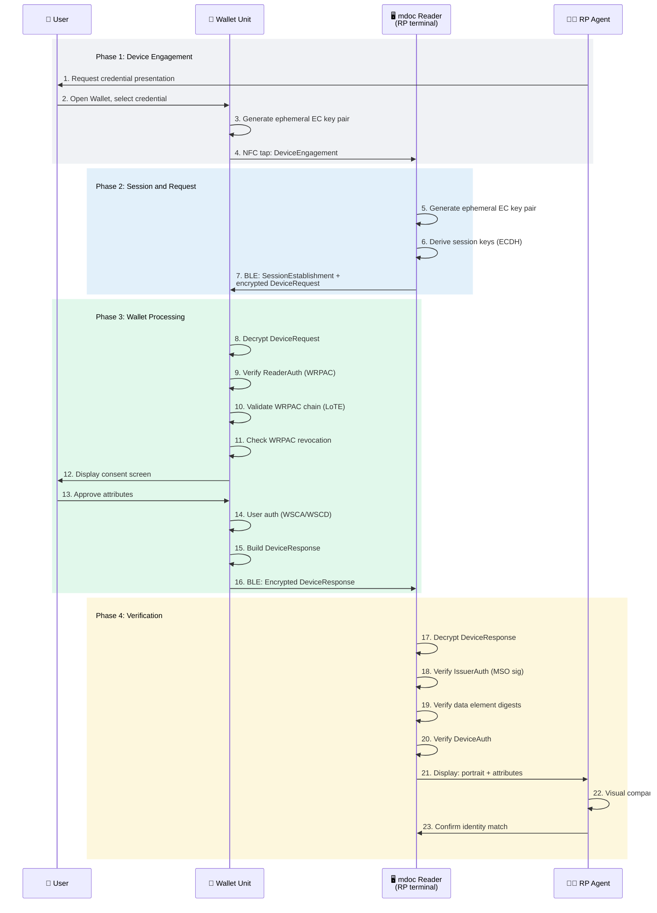
```mermaid
---
config:
  themeVariables:
    noteBkgColor: "transparent"
    noteBorderColor: "transparent"
  sequence:
    messageAlign: left
    noteAlign: left
    actorMargin: 150
---
sequenceDiagram
    participant User as 👤 User
    participant WU as 📱 Wallet Unit
    participant Reader as 🖥️ mdoc Reader<br/>(RP terminal)
    participant Agent as 👨‍💼 RP Agent

    rect rgba(148, 163, 184, 0.14)
    Note right of User: Phase 1: Device Engagement
    Agent->>User: 1. Request credential presentation
    User->>WU: 2. Open Wallet, select credential
    WU->>WU: 3. Generate ephemeral EC key pair
    WU->>Reader: 4. NFC tap: DeviceEngagement
    end

    rect rgba(52, 152, 219, 0.14)
    Note right of User: Phase 2: Session and Request
    Reader->>Reader: 5. Generate ephemeral EC key pair
    Reader->>Reader: 6. Derive session keys (ECDH)
    Reader->>WU: 7. BLE: SessionEstablishment +<br/>encrypted DeviceRequest
    end

    rect rgba(46, 204, 113, 0.14)
    Note right of User: Phase 3: Wallet Processing
    WU->>WU: 8. Decrypt DeviceRequest
    WU->>WU: 9. Verify ReaderAuth (WRPAC)
    WU->>WU: 10. Validate WRPAC chain (LoTE)
    WU->>WU: 11. Check WRPAC revocation
    WU->>User: 12. Display consent screen
    User->>WU: 13. Approve attributes
    WU->>WU: 14. User auth (WSCA/WSCD)
    WU->>WU: 15. Build DeviceResponse
    WU->>Reader: 16. BLE: Encrypted DeviceResponse
    end

    rect rgba(241, 196, 15, 0.14)
    Note right of User: Phase 4: Verification
    Reader->>Reader: 17. Decrypt DeviceResponse
    Reader->>Reader: 18. Verify IssuerAuth (MSO sig)
    Reader->>Reader: 19. Verify data element digests
    Reader->>Reader: 20. Verify DeviceAuth
    Reader->>Agent: 21. Display: portrait + attributes
    Agent->>Agent: 22. Visual comparison
    Agent->>Reader: 23. Confirm identity match
    Note right of Reader: ⠀
    end
```

#### 25.3 Step-by-Step Payload Walkthrough

<details>
<summary><strong>Step 4 — DeviceEngagement</strong> (CBOR, transmitted via NFC short-field communication)</summary>

```
DeviceEngagement = {
  0: "1.0",                              ; version
  1: [                                    ; security
    1,                                    ; cipher suite 1 (EC P-256)
    h'<mdoc ephemeral public key COSE_Key>'
  ],
  2: [                                    ; device retrieval methods
    [                                     ; BLE
      2,                                  ; type: BLE
      1,                                  ; version
      {                                   ; BLE options
        0: true,                          ; peripheral server mode
        1: h'A1B2C3D4E5F6...',            ; UUID
        10: h'<device address>'           ; peripheral address
      }
    ]
  ]
}
```

</details>

<details>
<summary><strong>Step 7 — DeviceRequest</strong> (CBOR, encrypted with session key derived from ECDH)</summary>

```
DeviceRequest = {
  "version": "1.0",
  "docRequests": [
    {
      "itemsRequest": 24(<<              ; CBOR tag 24: embedded CBOR
        {                                 ; ItemsRequest
          "docType": "eu.europa.ec.eudi.pid.1",
          "nameSpaces": {
            "eu.europa.ec.eudi.pid.1": {
              "family_name": true,        ; IntentToRetain
              "given_name": true,
              "portrait": true,
              "birth_date": true
            }
          }
        }
      >>),
      "readerAuth": [                     ; COSE_Sign1
        h'a10126',                        ; protected: {1: -7} (ES256)
        {                                 ; unprotected
          33: [                           ; x5chain: WRPAC chain
            h'<WRPAC certificate DER>',
            h'<Access CA intermediate DER>'
          ]
        },
        nil,                              ; detached payload
        h'<WRPAC signature over ItemsRequest>'
      ]
    }
  ]
}
```

</details>

<details>
<summary><strong>Step 15 — DeviceResponse</strong> (CBOR, encrypted with session key)</summary>

```
DeviceResponse = {
  "version": "1.0",
  "documents": [
    {
      "docType": "eu.europa.ec.eudi.pid.1",
      "issuerSigned": {
        "nameSpaces": {
          "eu.europa.ec.eudi.pid.1": [
            {                             ; IssuerSignedItem
              "digestID": 0,
              "random": h'8798645321abcdef',
              "elementIdentifier": "family_name",
              "elementValue": "Müller"
            },
            {
              "digestID": 1,
              "random": h'abcdef1234567890',
              "elementIdentifier": "given_name",
              "elementValue": "Erika"
            },
            {
              "digestID": 2,
              "random": h'1234567890abcdef',
              "elementIdentifier": "portrait",
              "elementValue": h'<JPEG portrait bytes>'
            },
            {
              "digestID": 3,
              "random": h'deadbeef12345678',
              "elementIdentifier": "birth_date",
              "elementValue": 1009("1984-01-26")
            }
          ]
        },
        "issuerAuth": [                   ; COSE_Sign1 (MSO)
          h'a10126',                      ; protected: ES256
          {},                             ; unprotected
          h'<MobileSecurityObject CBOR>', ; MSO with digests + validity
          h'<PID Provider signature>'     ; signature
        ]
      },
      "deviceSigned": {
        "nameSpaces": {},                 ; empty (no device-signed data)
        "deviceAuth": {
          "deviceSignature": [            ; COSE_Sign1
            h'a10126',                    ; protected: ES256
            {},                           ; unprotected
            nil,                          ; detached: SessionTranscript
            h'<device key signature>'     ; over SessionTranscript
          ]
        }
      }
    }
  ],
  "status": 0                             ; 0 = OK
}
```

</details>

<details>
<summary><strong>Verification steps 17–20</strong> — Reader verification procedure</summary>

1. **Step 17**: Decrypts the DeviceResponse using the session key derived from ECDH (mdoc ephemeral key × reader ephemeral key).
2. **Step 18**: Verifies the `issuerAuth` COSE_Sign1 signature. The MSO (MobileSecurityObject) contains per-element SHA-256 digests and the PID Provider's signing certificate. The reader validates this certificate chain against the LoTE trust anchor.
3. **Step 19**: For each `IssuerSignedItem`, re-computes `SHA-256(digestID || random || elementIdentifier || elementValue)` and compares against the corresponding digest in the MSO.
4. **Step 20**: Verifies the `deviceSignature` COSE_Sign1 over the `SessionTranscript` (which binds the presentation to this specific session). The public key used for verification is extracted from the MSO's `deviceKeyInfo`.

</details>

### 26. Proximity Unsupervised Flow

#### 26.1 Description

In the **unsupervised proximity flow**, there is no human agent — the RP terminal operates autonomously. This flow is used at:

- E-gates (automated border control)
- Self-service kiosks (age verification for alcohol/tobacco vending)
- Turnstiles (venue access)
- Parking barriers (credential-gated access)
- IoT devices (smart locks, car rental)

#### 26.2 Key Differences from Supervised Flow

| Aspect | Supervised | Unsupervised |
|:-------|:-----------|:-------------|
| **User binding** | Visual comparison by agent | Device-level user authentication (biometric/PIN) |
| **Portrait request** | Typically requested for visual match | May or may not be requested |
| **Trust level** | Higher (human verification) | Lower (device-only verification) |
| **Response speed** | Slower (human in the loop) | Faster (automated) |
| **Use cases** | High-security (border, KYC) | Convenience (age check, access) |

In the unsupervised flow, the RP trusts the device binding and user authentication mechanisms of the Wallet Unit rather than performing visual verification.

### 27. Device Engagement and Session Establishment

#### 27.1 Device Engagement Methods

| Method | Trigger | Data Transfer | Security |
|:-------|:--------|:--------------|:---------|
| **NFC Tap** | User taps device on terminal | Ephemeral key + BLE/Wi-Fi info | Short range prevents interception |
| **QR Code** | Reader displays, User scans | Ephemeral key + BLE/Wi-Fi info | Visual proximity requirement |
| **Device Retrieval** | Reader pushes engagement via BLE | Ephemeral key exchange | BLE proximity |

#### 27.2 Session Key Derivation

After exchanging ephemeral public keys, both parties derive session keys using ECDH + HKDF:

```
SharedSecret = ECDH(ePK_reader, eSK_mdoc)  ; or ECDH(ePK_mdoc, eSK_reader)
SessionKeys = HKDF-SHA-256(SharedSecret, "SKReader" | "SKDevice", SessionTranscript)
```

All subsequent messages are encrypted with AES-256-GCM using the derived session keys.

---

## Wallet-to-Wallet Interactions

### 28. W2W Presentation Flow (TS9)

#### 28.1 Overview

TS9 defines how two Wallet Units can exchange credentials directly without an RP backend server. In this flow, one Wallet User acts as the **Verifier** (requesting attributes) and the other acts as the **Presenter**.

| Aspect | Detail |
|:-------|:-------|
| **Protocol** | ISO/IEC 18013-5 (proximity only) |
| **Format** | mdoc only (SD-JWT VC NOT supported for W2W) |
| **Transport** | BLE, NFC, Wi-Fi Aware |
| **RP Instance** | The Verifier's Wallet Unit acts as the mdoc reader |
| **Authentication** | Open issue — how the Verifier authenticates is under discussion |

#### 28.2 Key Constraints

- W2W interactions use the **same ISO 18013-5 protocol** as proximity RP flows
- The Verifier's Wallet Unit generates a `PresentationOffer` specifying requested elements
- The Presenter's Wallet Unit processes this as if it were a standard proximity request
- **No WRPAC** — the Verifier is a User, not a registered RP. This means the standard RP authentication via certificate chain validation does not apply.

> **Open Issue (TS9)**: The mechanism for authenticating the Verifier in W2W is still under active discussion. Possible approaches include: (1) the Verifier presents their own PID first, (2) mutual disclosure via a negotiation protocol, or (3) no Verifier authentication with explicit user consent.

---

## SCA for Electronic Payments

### 29. SCA Attestation Lifecycle

#### 29.1 Context

**Strong Customer Authentication (SCA)** is mandated by PSD2 (Art. 97) for electronic payments. TS12 defines how EUDI Wallets can fulfil this requirement through a dedicated **SCA attestation** that links the Wallet to a Payment Service Provider (PSP).

The SCA attestation:

- Is issued by the PSP (or its agent) to the User's Wallet Unit
- Contains the User's payment credential reference (e.g., PAN last four digits, scheme)
- Enables the Wallet to generate dynamic authentication codes for transactions
- Must satisfy PSD2 dynamic linking requirements (binding authentication to transaction amount and payee)

#### 29.2 SCA Attestation Types

TS12 defines two attestation types:

| Type | VCT Identifier | Description |
|:-----|:---------------|:------------|
| **SCA Metadata** | `eu.europa.ec.eudi.sca.metadata.1` | Static metadata about the SCA relationship (PSP identity, payment instrument reference) |
| **SCA Transaction** | `eu.europa.ec.eudi.sca.transaction.1` | Per-transaction authentication data (amount, payee, dynamic code) |

### 30. Issuer-Requested SCA Flow

#### 30.1 Description

In the **issuer-requested SCA flow**, the PSP that issued the payment instrument (issuer bank) directly requests SCA from the User's Wallet when the User initiates a payment. This is the standard SCA flow for card-present and card-not-present transactions.

#### 30.2 Sequence Diagram

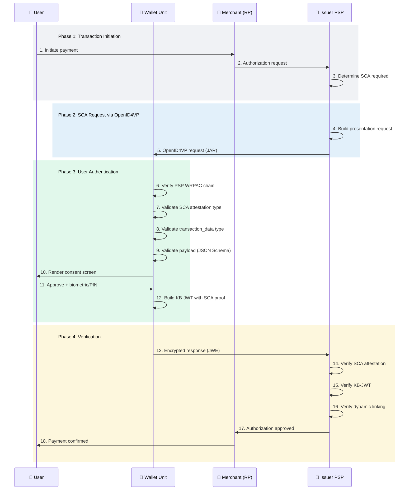
```mermaid
---
config:
  themeVariables:
    noteBkgColor: "transparent"
    noteBorderColor: "transparent"
  sequence:
    messageAlign: left
    noteAlign: left
    actorMargin: 130
---
sequenceDiagram
    participant User as 👤 User
    participant WU as 📱 Wallet Unit
    participant Merchant as 🛒 Merchant (RP)
    participant PSP as 🏦 Issuer PSP

    rect rgba(148, 163, 184, 0.14)
    Note right of User: Phase 1: Transaction Initiation
    User->>Merchant: 1. Initiate payment
    Merchant->>PSP: 2. Authorization request
    PSP->>PSP: 3. Determine SCA required
    end

    rect rgba(52, 152, 219, 0.14)
    Note right of User: Phase 2: SCA Request via OpenID4VP
    PSP->>PSP: 4. Build presentation request
    PSP->>WU: 5. OpenID4VP request (JAR)
    end

    rect rgba(46, 204, 113, 0.14)
    Note right of User: Phase 3: User Authentication
    WU->>WU: 6. Verify PSP WRPAC chain
    WU->>WU: 7. Validate SCA attestation type
    WU->>WU: 8. Validate transaction_data type
    WU->>WU: 9. Validate payload (JSON Schema)
    WU->>User: 10. Render consent screen
    User->>WU: 11. Approve + biometric/PIN
    WU->>WU: 12. Build KB-JWT with SCA proof
    end

    rect rgba(241, 196, 15, 0.14)
    Note right of User: Phase 4: Verification
    WU->>PSP: 13. Encrypted response (JWE)
    PSP->>PSP: 14. Verify SCA attestation
    PSP->>PSP: 15. Verify KB-JWT
    PSP->>PSP: 16. Verify dynamic linking
    PSP->>Merchant: 17. Authorization approved
    Merchant->>User: 18. Payment confirmed
    Note right of PSP: ⠀
    end
```

#### 30.3 Step-by-Step Payload Walkthrough

<details>
<summary><strong>Step 4 — PSP constructs the JAR</strong> with DCQL query for SCA attestation and transaction data</summary>

```json
{
  "iss": "https://psp.example-bank.de",
  "aud": "https://self-issued.me/v2",
  "exp": 1741355493,
  "iat": 1741269093,
  "jti": "a91c2f0e-7b3a-4c8d-b5e1-f234567890ab",
  "client_id": "x509_san_dns:sca.example-bank.de",
  "client_id_scheme": "x509_san_dns",
  "response_type": "vp_token",
  "response_mode": "direct_post.jwt",
  "response_uri": "https://psp.example-bank.de/sca/callback",
  "nonce": "bUtJdjJESWdmTWNjb011YQ",
  "state": "sca-session-xyz",
  "dcql_query": {
    "credentials": [
      {
        "id": "sca",
        "format": "dc+sd-jwt",
        "meta": {
          "vct_values": ["https://pay.example-bank.de/card"]
        }
      }
    ]
  },
  "transaction_data": [
    {
      "type": "urn:eudi:sca:payment:1",
      "credential_ids": ["sca"],
      "transaction_data_hashes_alg": "sha-256",
      "payload": {
        "transaction_id": "8D8AC610-3E4A-4B7C-9F12-A1B2C3D4E5F6",
        "date_time": "2026-07-15T14:32:00Z",
        "payee": {
          "name": "Online Store GmbH",
          "id": "DE89370501981234567890",
          "website": "https://online-store.de"
        },
        "currency": "EUR",
        "amount": 49.99
      }
    }
  ]
}
```

</details>

<details>
<summary><strong>Step 7 — Wallet checks SCA Attestation type</strong> by resolving VCT metadata</summary>

```json
{
  "vct": "https://pay.example-bank.de/card",
  "category": "urn:eu:europa:ec:eudi:sua:sca",
  "transaction_data_types": {
    "urn:eudi:sca:payment:1": {
      "schema_uri": "https://standards.example.org/eudiw-trx/payment-1.json",
      "ui_labels": {
        "affirmative_action_label": [
          {"lang": "de", "value": "Zahlung bestätigen"},
          {"lang": "en", "value": "Confirm Payment"}
        ],
        "denial_action_label": [
          {"lang": "de", "value": "Zahlung abbrechen"},
          {"lang": "en", "value": "Cancel Payment"}
        ]
      }
    }
  }
}
```

The Wallet verifies that `category` is `urn:eu:europa:ec:eudi:sua:sca`, confirming this is an SCA attestation. It then checks that `urn:eudi:sca:payment:1` exists in the `transaction_data_types` map and validates the `payload` against the linked JSON Schema.

</details>

<details>
<summary><strong>Step 10 — Wallet renders consent screen</strong> using TS12 display hierarchy</summary>

| Level | Displayed Fields | Rendering |
|:------|:----------------|:----------|
| **1** (prominent) | `amount`: 49.99, `currency`: EUR, `payee.name`: Online Store GmbH | Large font, main screen |
| **2** | `payee.id`: DE89370501981234567890 | Normal font, main screen |
| **3** | (none in this example) | Supplementary screen |
| **4** | `transaction_id`, `date_time` | Omitted from display |
| **Button** | "Zahlung bestätigen" | From `ui_labels.affirmative_action_label` (de) |

</details>

<details>
<summary><strong>Step 12 — Wallet builds the Key Binding JWT</strong> with SCA proof</summary>

```json
{
  "typ": "kb+jwt",
  "alg": "ES256"
}
```

```json
{
  "aud": "x509_san_dns:sca.example-bank.de",
  "iat": 1741269093,
  "jti": "deeec2b0-3bea-4477-bd5d-e3462a709481",
  "nonce": "bUtJdjJESWdmTWNjb011YQ",
  "sd_hash": "Re-CtLZfjGLErKy3eSriZ4bBx3AtUH5Q5wsWiiWKIwY",
  "amr": [
    {"knowledge": "pin_6_or_more_digits"},
    {"inherence": "fingerprint_device"}
  ],
  "transaction_data_hashes": [
    "OJcnQQByvV1iTYxiQQQx4dact-TNnSG-Ku_cs_6g55Q"
  ],
  "transaction_data_hashes_alg": "sha-256",
  "response_mode": "direct_post.jwt"
}
```

Key claims explained:

| Claim | Purpose | PSD2 Relevance |
|:------|:--------|:---------------|
| `jti` | Unique identifier, serves as the **Authentication Code** | PSD2 RTS Art. 4 — unique code linked to amount and payee |
| `amr` | Documents the authentication factors applied (knowledge + inherence = 2 of 3) | PSD2 Art. 97 — at least 2 independent SCA elements |
| `transaction_data_hashes` | SHA-256 of the `transaction_data[0].payload` (base64url) | PSD2 Art. 97(2) — dynamic linking: code bound to amount + payee |
| `sd_hash` | Binds KB-JWT to the specific SD-JWT VC presentation | Prevents replay with different credentials |

</details>

<details>
<summary><strong>Step 15 — PSP verifies the KB-JWT</strong></summary>

1. Verify `aud` matches PSP's own `client_id`
2. Verify `jti` is unique (store in replay cache)
3. Verify `amr` contains at least 2 of the 3 SCA factor categories (`knowledge`, `possession`, `inherence`)
4. Re-compute `SHA-256(transaction_data[0].payload)` and compare against `transaction_data_hashes[0]` — this proves the user saw and approved the exact transaction details (dynamic linking)
5. Verify `sd_hash` matches the hash of the presented SD-JWT VC (excluding KB-JWT)

</details>

### 31. Third-Party-Requested SCA Flow

In the **third-party-requested SCA flow**, a party other than the issuer bank (e.g., an AISP or PISP under PSD2/PSR) requests SCA from the User. The flow is structurally identical to §30 but with a different requesting party.

Key differences:

- The requesting party is an AISP (Account Information Service Provider) or PISP (Payment Initiation Service Provider)
- The AISP/PISP must be registered as an RP with a valid WRPAC
- The transaction data may contain account access information rather than payment details
- The issuer PSP may still be involved for authorization validation

### 32. Transaction Data and Dynamic Linking (TS12)

#### 32.1 Transaction Data Structure

TS12 defines the `transaction_data` parameter that is included in the OpenID4VP presentation request for SCA flows. This data binds the authentication to the specific transaction (PSD2 dynamic linking):

```json
{
  "transaction_data": [
    {
      "type": "payment_transaction",
      "credential_ids": ["sca_attestation"],
      "transaction_data_hashes_alg": "sha-256",
      "payment_data": {
        "amount": "149.99",
        "currency": "EUR",
        "payee_name": "TechStore España S.L.",
        "payee_account": "ES91 2100 0418 4502 0005 1332",
        "payment_reference": "INV-2026-07890",
        "date": "2026-07-15T14:30:00Z"
      }
    }
  ]
}
```

#### 32.2 Dynamic Linking Requirements

PSD2 Art. 97(2) requires that authentication codes are dynamically linked to a specific amount and payee. In the EUDI Wallet flow:

1. The `transaction_data` containing amount and payee is included in the presentation request
2. The Wallet Unit displays exact transaction details to the User
3. The User authenticates specifically for this transaction (not a generic auth)
4. The WSCA/WSCD signs a hash of the transaction data with the device-bound key
5. The SCA attestation in the response includes the signed transaction hash
6. The PSP verifies the signature, confirming the User authenticated for exactly this transaction

This satisfies the three pillars of PSD2 SCA:

| Pillar | SCA Element | EUDI Wallet Implementation |
|:-------|:------------|:---------------------------|
| **Knowledge** | Something only the user knows | PIN (WSCA/WSCD authentication) |
| **Possession** | Something only the user has | Device-bound key in WSCA/WSCD |
| **Inherence** | Something the user is | Biometric (WSCA/WSCD authentication) |

---

## Pseudonym-Based Authentication

### 33. Pseudonym-Based Authentication and WebAuthn

#### 33.1 Pseudonym Use Cases (A–D)

The EUDI Wallet supports pseudonyms as an alternative to attribute-based identification. Art. 5b(9) of eIDAS 2.0 mandates that RPs **shall not refuse** pseudonyms where identification is not required by law.

The ARF defines four pseudonym use cases:

| Use Case | Description | Example |
|:---------|:------------|:--------|
| **A: Unique pseudonym per RP** | Wallet generates a unique, persistent pseudonym for each RP | Returning user authentication on a forum |
| **B: Non-unique pseudonym** | RP receives a non-linkable pseudonym per session | Anonymous feedback, polls |
| **C: Pseudonym + selective attributes** | Pseudonym combined with specific attributes (e.g., age_over_18) | Age-gated content without full identity |
| **D: Pseudonym + full PID** | Pseudonym established alongside full identification | Banking relationship with both pseudonym and legal identity |

#### 33.1.1 Pseudonym Generation

Pseudonyms are generated by the Wallet Unit using OS-level authentication (not WSCA/WSCD). This means pseudonym presentation does not require the stronger device-bound authentication used for PID presentation.

The pseudonym is a cryptographic identifier:

- Deterministically derived for Use Case A (same pseudonym for the same RP across sessions)
- Randomly generated for Use Case B (different each session)
- Bound to the Wallet Unit (prevents forgery)
- Not linkable across RPs (in Use Cases A and B)

#### 33.2 WebAuthn and Pseudonym Presentation

For persistent pseudonym authentication (Use Case A), the Wallet Unit can register a pseudonym as a **WebAuthn credential** with the RP. Subsequent authentication uses the standard WebAuthn assertion flow — the RP never needs to learn the User's real identity.

The flow:

1. **Registration**: User uses Wallet to register a pseudonym with the RP via WebAuthn `navigator.credentials.create()`
2. **Authentication**: User authenticates to the RP via WebAuthn `navigator.credentials.get()` using the registered pseudonym credential
3. **Optional attribute enrichment**: RP can request additional attributes via OpenID4VP if needed, but the pseudonym serves as the primary identifier

---

## Combined Presentations

### 35. DCQL and Combined Presentations

#### 35.1 Overview

The **Digital Credentials Query Language (DCQL)** is a JSON-based query language integrated into OpenID4VP 1.0 and mandated by HAIP 1.0. It replaces the legacy `presentation_definition` (DIF Presentation Exchange) format with a more expressive, format-agnostic query mechanism.

#### 35.2 DCQL Structure

```json
{
  "credentials": [
    {
      "id": "credential_identifier",
      "format": "dc+sd-jwt | mso_mdoc",
      "meta": { "vct_values": ["..."] },
      "claims": [
        { "path": ["claim_name"] },
        { "path": ["nested", "claim"] }
      ]
    }
  ],
  "credential_sets": [
    {
      "purpose": "Human-readable purpose",
      "options": [
        ["credential_id_1", "credential_id_2"]
      ]
    }
  ]
}
```

Key capabilities:

- **Multi-credential requests**: Request attributes from multiple credentials in one query
- **Format specification**: Specify preferred credential format per query
- **Claim-level precision**: Request specific claims, including nested claims
- **Alternative credentials**: `credential_sets` with `options` allow the Wallet to choose between alternative credentials
- **Purpose statements**: Human-readable purpose for each credential set

#### 35.3 Multi-Attestation Combined Requests

#### 35.3.1 Example: Bank KYC and Address Verification

A bank performing customer onboarding might request both PID attributes and an address attestation:

```json
{
  "credentials": [
    {
      "id": "pid",
      "format": "dc+sd-jwt",
      "meta": { "vct_values": ["eu.europa.ec.eudi.pid.1"] },
      "claims": [
        {"path": ["family_name"]},
        {"path": ["given_name"]},
        {"path": ["birth_date"]},
        {"path": ["nationality"]}
      ]
    },
    {
      "id": "address",
      "format": "dc+sd-jwt",
      "meta": { "vct_values": ["eu.europa.ec.eudi.address.1"] },
      "claims": [
        {"path": ["resident_address"]},
        {"path": ["resident_city"]},
        {"path": ["resident_postal_code"]},
        {"path": ["resident_country"]}
      ]
    }
  ],
  "credential_sets": [
    {
      "purpose": "Customer onboarding and identity verification",
      "options": [["pid", "address"]]
    }
  ]
}
```

#### 35.3.2 Combined Presentation Verification

When the RP receives a combined presentation (multiple attestations in one response), it must verify that all attestations belong to the same Wallet Unit. This is done by checking that all attestations share the same `cnf` key (SD-JWT VC) or `deviceKey` (mdoc).

---

## RP Obligations and User Rights

### 37. RP Obligations: Data Deletion, DPA Reporting, and Disclosure Policy

#### 37.1 Data Deletion Requests (TS7)

#### 37.1.1 Legal Basis

GDPR Article 17 gives individuals the right to request erasure of their personal data. The EUDI Wallet operationalises this right through TS7, which defines the interface for Users to submit data deletion requests to RPs directly from their Wallet Unit.

#### 37.1.2 Process Flow

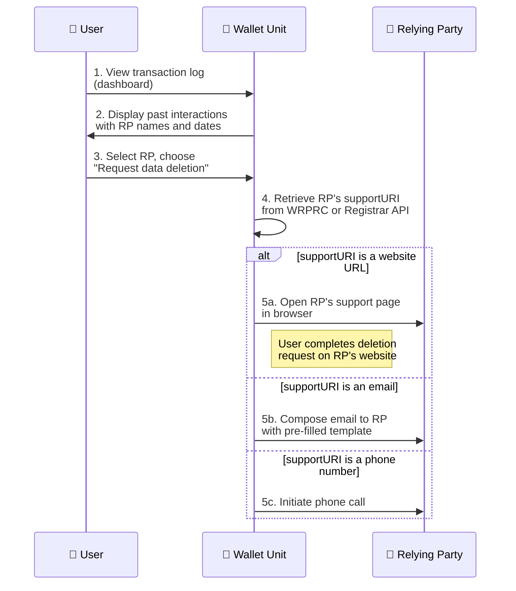
```mermaid
---
config:
  sequence:
    messageAlign: left
    noteAlign: left
---
sequenceDiagram
    participant User as 👤 User
    participant WU as 📱 Wallet Unit
    participant RP as 🏦 Relying Party

    User->>WU: 1. View transaction log<br/>(dashboard)
    WU->>User: 2. Display past interactions<br/>with RP names and dates
    User->>WU: 3. Select RP, choose<br/>"Request data deletion"
    WU->>WU: 4. Retrieve RP's supportURI<br/>from WRPRC or Registrar API
    
    alt supportURI is a website URL
        WU->>RP: 5a. Open RP's support page<br/>in browser
        Note right of WU: User completes deletion<br/>request on RP's website
    else supportURI is an email
        WU->>RP: 5b. Compose email to RP<br/>with pre-filled template
    else supportURI is a phone number
        WU->>RP: 5c. Initiate phone call
    end
```

#### 37.1.2.1 Payload Walkthrough

<details>
<summary><strong>Step 4 — Wallet retrieves RP's supportURI</strong> from WRPRC or Registrar API</summary>

If the WRPRC is not available, the Wallet Unit queries the Registrar:

```http
GET /wrp/5299001GCLKH6FPVJW75 HTTP/1.1
Host: registrar.example-ms.de
Accept: application/jwt
```

The Wallet extracts `supportURI` from the JWS payload:

```json
{
  "supportURI": [
    "https://support.example-bank.de/eudi-wallet",
    "mailto:eudi-support@example-bank.de",
    "tel:+49-800-123-4567"
  ]
}
```

The Wallet Unit prioritises the website URL (`https://`), falling back to email, then phone (DATA_DLT_02).

</details>

<details>
<summary><strong>Step 5b — Pre-filled email template</strong> (DATA_DLT_08 / DATA_DLT_09)</summary>

When the `supportURI` is an email address, the Wallet composes a draft:

```
To: eudi-support@example-bank.de
Subject: Request for Erasure of Personal Data (Art. 17 GDPR) — EUDI Wallet

Body:
Dear Data Protection Officer,

I hereby request the erasure of all personal data previously provided
to your organisation via my EUDI Wallet Unit, in accordance with
Article 17 of Regulation (EU) 2016/679 (GDPR).

Transaction details:
  - Date of presentation: 2026-07-15T14:32:00Z
  - Attributes presented: family_name, given_name, birth_date
  - Purpose: Customer identification and KYC verification

Please confirm the completion of the erasure within 30 days.

[User may edit before sending]
```

Per DATA_DLT_06, the Wallet logs the initiation: date/time, target RP, and attributes requested for deletion.

</details>

#### 37.1.3 RP Implementation Requirements

RPs must:

1. **Register at least one `supportURI`** — a website, email, or phone number that handles deletion requests
2. **Process deletion requests** within GDPR timelines (without undue delay, max 1 month)
3. **Confirm deletion** to the requesting User
4. **Not use attributes** obtained via the EUDI Wallet after receiving a valid deletion request

> **Implementation note**: TS7 currently recommends that the `supportURI` be a website URL, as the Wallet Unit assumes a browser is always available on the User's device. Email and phone alternatives are supported but may be less reliable.

#### 37.2 DPA Reporting (TS8)

#### 37.2.1 Overview

TS8 defines the interface for Users to report unlawful or suspicious data requests by RPs to their Data Protection Authority (DPA). This is a transparency mechanism that enables User-initiated oversight of RP behaviour.

#### 37.2.2 When the User May Report

The Wallet Unit logs every presentation interaction. The User may report an RP if:

- The RP requested attributes not registered for its stated purpose
- The RP requested excessive attributes beyond what was needed
- The RP's behaviour was suspicious or unexpected
- The User believes their data was misused after presentation

#### 37.2.3 Reporting Process

1. User views the transaction log in the Wallet dashboard
2. User selects the suspicious transaction
3. User chooses "Report to Data Protection Authority"
4. The Wallet retrieves the DPA contact information from the WRPRC or Registrar API (`supervisoryAuthority.email`)
5. The Wallet composes a pre-filled email/browser form with:
   - RP identity (name, identifier)
   - Date and time of the interaction
   - Attributes requested vs. attributes registered
   - User's description of the issue

#### 37.2.4 RP Implications

RPs should be aware that:

- Every presentation is logged by the Wallet Unit
- Users can report excessive attribute requests to the DPA at any time
- The Registrar API provides the DPA contact information alongside RP registration data
- Non-compliance with registered intended use may trigger DPA investigation

#### 37.3 Embedded Disclosure Policy Evaluation

#### 37.3.1 Overview

Attestation Providers can embed a **disclosure policy** in their attestations during issuance, restricting which RPs may receive the attestation. This is relevant for sensitive attestations (e.g., medical data, financial credentials) where the issuer wants to control disclosure scope.

#### 37.3.2 Policy Types (CIR 2024/2979, Annex III)

| Policy | Description | RP Impact |
|:-------|:------------|:----------|
| **No policy** | Default. No restrictions on disclosure. | Any authenticated RP may receive the attestation |
| **Authorised RPs only** | Only explicitly listed RPs may receive the attestation | RP must be on the issuer's allowlist (checked against WRPAC data) |
| **Specific root of trust** | Only RPs with WRPACs from specific CAs may receive | RP must have WRPAC from an authorised CA chain |

#### 37.3.3 Evaluation Flow

1. RP requests an attestation from the Wallet Unit
2. Wallet Unit checks if the attestation has an embedded disclosure policy
3. If yes: evaluate the policy against the RP's WRPAC data
4. If policy denies: inform the User (e.g., "The issuer of your medical record does not want you to share it with Bank X. Continue?")
5. **User can override**: The User always has the final decision, even if the policy denies

> **RP implementation consideration**: RPs requesting sensitive attestations should verify with the Attestation Provider that they are included in the disclosure policy. Otherwise, Users will receive a warning that may discourage them from sharing.

---

## Intermediary Model

### 40. Intermediary Architecture and Trust Flows

#### 40.1 Intermediary Role

An intermediary is a first-class RP in the EUDI Wallet ecosystem. It connects multiple "intermediated RPs" to the Wallet ecosystem, handling the technical complexity of:

- OpenID4VP / ISO 18013-5 protocol implementation
- WRPAC management and certificate chain maintenance
- Trust anchor refresh (LoTE/Trusted List synchronisation)
- Credential format parsing and verification (SD-JWT VC, mdoc)
- Revocation checking infrastructure
- DCQL query construction
- SCA flow orchestration (for PSP intermediaries)

#### 40.2 End-to-End Intermediary Flow

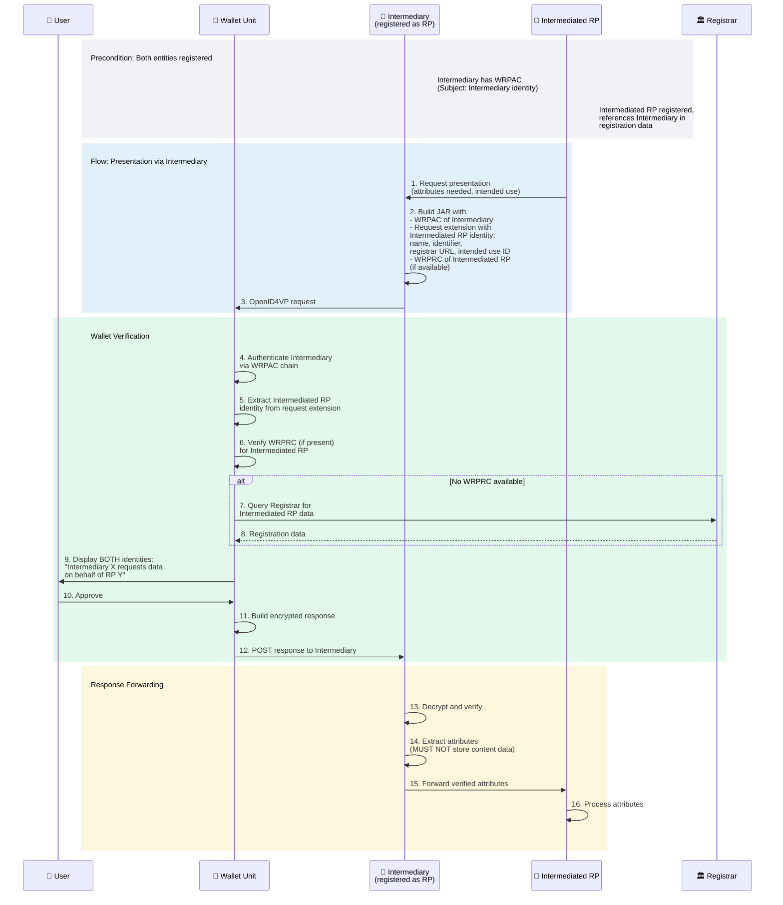
```mermaid
---
config:
  themeVariables:
    noteBkgColor: "transparent"
    noteBorderColor: "transparent"
  sequence:
    messageAlign: left
    noteAlign: left
    actorMargin: 120
---
sequenceDiagram
    participant User as 👤 User
    participant WU as 📱 Wallet Unit
    participant INT as 🔄 Intermediary<br/>(registered as RP)
    participant IRP as 🏦 Intermediated RP
    participant REG as 🏛️ Registrar

    rect rgba(148, 163, 184, 0.14)
    Note right of User: Precondition: Both entities registered
    Note right of INT: Intermediary has WRPAC<br/>(Subject: Intermediary identity)
    Note right of IRP: Intermediated RP registered,<br/>references Intermediary in<br/>registration data
    end

    rect rgba(52, 152, 219, 0.14)
    Note right of User: Flow: Presentation via Intermediary
    IRP->>INT: 1. Request presentation<br/>(attributes needed, intended use)
    INT->>INT: 2. Build JAR with:<br/>- WRPAC of Intermediary<br/>- Request extension with<br/>  Intermediated RP identity:<br/>  name, identifier,<br/>  registrar URL, intended use ID<br/>- WRPRC of Intermediated RP<br/>  (if available)
    INT->>WU: 3. OpenID4VP request
    end

    rect rgba(46, 204, 113, 0.14)
    Note right of User: Wallet Verification
    WU->>WU: 4. Authenticate Intermediary<br/>via WRPAC chain
    WU->>WU: 5. Extract Intermediated RP<br/>identity from request extension
    WU->>WU: 6. Verify WRPRC (if present)<br/>for Intermediated RP
    alt No WRPRC available
        WU->>REG: 7. Query Registrar for<br/>Intermediated RP data
        REG-->>WU: 8. Registration data
    end
    WU->>User: 9. Display BOTH identities:<br/>"Intermediary X requests data<br/>on behalf of RP Y"
    User->>WU: 10. Approve
    WU->>WU: 11. Build encrypted response
    WU->>INT: 12. POST response to Intermediary
    end

    rect rgba(241, 196, 15, 0.14)
    Note right of User: Response Forwarding
    INT->>INT: 13. Decrypt and verify
    INT->>INT: 14. Extract attributes<br/>(MUST NOT store content data)
    INT->>IRP: 15. Forward verified attributes
    IRP->>IRP: 16. Process attributes
    Note right of INT: ⠀
    end
```

#### 40.2.1 Intermediary Payload Walkthrough

<details>
<summary><strong>Step 2 — Intermediary builds the JAR</strong> with intermediated RP extension</summary>

The JAR is signed with the **Intermediary's** WRPAC private key. The key difference from a direct RP flow is the `intermediated_rp` extension in the request:

```json
{
  "iss": "https://verifier.signicat.com",
  "aud": "https://self-issued.me/v2",
  "exp": 1750089600,
  "iat": 1750003200,
  "jti": "b8d4e1f2-3c5a-6d7b-8e9f-0a1b2c3d4e5f",
  "client_id": "x509_san_dns:verifier.signicat.com",
  "client_id_scheme": "x509_san_dns",
  "response_type": "vp_token",
  "response_mode": "direct_post.jwt",
  "response_uri": "https://verifier.signicat.com/oid4vp/callback",
  "nonce": "kYzM4NTY3ODkwMTIzNDU2Nz",
  "state": "int-session-abc",
  "response_encryption_alg": "ECDH-ES",
  "response_encryption_enc": "A256GCM",
  "response_encryption_jwk": { "kty": "EC", "crv": "P-256", "x": "...", "y": "..." },
  "intermediated_rp": {
    "name": [
      {"lang": "de", "content": "Beispiel Bank AG"},
      {"lang": "en", "content": "Example Bank AG"}
    ],
    "identifier": "5299001GCLKH6FPVJW75",
    "registrar_uri": "https://registrar.example-ms.de",
    "intended_use_id": "urn:eudi:wrp:de:example-bank:kyc"
  },
  "dcql_query": {
    "credentials": [
      {
        "id": "pid",
        "format": "dc+sd-jwt",
        "meta": { "vct_values": ["eu.europa.ec.eudi.pid.1"] },
        "claims": [
          {"path": ["family_name"]},
          {"path": ["given_name"]},
          {"path": ["birth_date"]}
        ]
      }
    ]
  }
}
```

JWS header — signed with **Intermediary's** WRPAC, optionally including the intermediated RP's WRPRC:

```json
{
  "alg": "ES256",
  "typ": "oauth-authz-req+jwt",
  "x5c": [
    "<Intermediary WRPAC certificate DER>",
    "<Access CA intermediate>"
  ]
}
```

</details>

<details>
<summary><strong>Step 7 — Wallet queries Registrar for intermediated RP</strong> (when no WRPRC available)</summary>

```http
GET /wrp/check-intended-use?rpidentifier=5299001GCLKH6FPVJW75
    &intendeduseidentifier=urn:eudi:wrp:de:example-bank:kyc
    &credentialformat=dc%2Bsd-jwt
    &claimpath=family_name
Host: registrar.example-ms.de
Accept: application/jwt
```

The Wallet verifies both:
1. The **Intermediary** is authenticated via its WRPAC chain
2. The **Intermediated RP** is registered for the requested attributes via the Registrar API or WRPRC

</details>

#### 40.3 Intermediary Constraints (Art. 5b(10))

| Constraint | Requirement |
|:-----------|:------------|
| **Registration** | Intermediary must register as an RP itself |
| **No content storage** | Must NOT store the content of the transaction data (User attributes) |
| **Attribution** | Must clearly identify the intermediated RP in the request |
| **Transparency** | User must see both intermediary and RP identities |
| **Certificate** | Intermediary holds its own WRPAC; intermediated RP's identity is in request extension |
| **Forwarding** | Must forward all verified attributes to the intermediated RP |
| **Compliance** | Subject to all RP obligations (TS7, TS8, GDPR) |

---

## Regulatory Compliance for RPs

### 41. eIDAS 2.0 RP Obligations and Timelines

#### 41.1 RP Compliance Checklist

| Obligation | Article | Deadline | Implementation |
|:-----------|:--------|:---------|:---------------|
| Register with national Registrar | Art. 5b(1), CIR 2025/848 | Before accepting EUDI Wallet | Registration application + Registrar approval |
| Obtain WRPAC(s) | CIR 2025/848 Art. 7 | Before first presentation | Certificate request to Access CA |
| Accept EUDI Wallet | Art. 5b(7) | 21 Dec 2027 | Full OpenID4VP + ISO 18013-5 integration |
| Data minimisation | Art. 5b(2) | Ongoing (all interactions) | Request only necessary attributes |
| Transparency | Art. 5b(3) | Ongoing | Expose RP identity, purpose, privacy policy |
| No third-party sharing | Art. 5b(4) | Ongoing | Data handling controls |
| Accept pseudonyms | Art. 5b(9) | 21 Dec 2027 | Pseudonym support in auth system |
| Support data deletion requests | CIR 2024/2982 Art. 6 | Upon acceptance | `supportURI` implementation |
| Support DPA reporting | CIR 2024/2982 Art. 7 | Upon acceptance | `supervisoryAuthority` in registration |
| Non-discrimination | Art. 5b(6) | Ongoing | Equal service quality for wallet vs. non-wallet users |

### 42. PSD2/PSR and SCA Bridge

#### 42.1 Context

PSD2 (Directive 2015/2366/EU) requires Strong Customer Authentication (SCA) for electronic payments. The upcoming Payment Services Regulation (PSR) will replace PSD2 and continue these requirements. TS12 defines how the EUDI Wallet satisfies SCA requirements.

#### 42.2 Implementation: EUDI Wallet as SCA Method

| PSD2/PSR Requirement | EUDI Wallet Implementation |
|:---------------------|:---------------------------|
| **Two-factor authentication** (Art. 97) | Possession (device key in WSCA/WSCD) + Knowledge/Inherence (PIN/biometric) |
| **Dynamic linking** (Art. 97(2)) | `transaction_data` in OpenID4VP request binds auth to amount + payee |
| **Independence of elements** (RTS Art. 9) | WSCA/WSCD key is independent from display/input channels |
| **Confidentiality** (RTS Art. 22) | JWE-encrypted responses; WSCA/WSCD protects private keys |
| **Authentication code** (RTS Art. 5) | Device-bound signature over transaction hash = authentication code |

#### 42.3 PSP Implementation Steps

1. **Issue SCA attestation** to User's Wallet Unit during payment instrument enrolment (via OID4VCI)
2. **Register as RP** with national Registrar (declaring SCA attribute types)
3. **Obtain WRPAC** for the PSP's RP Instance
4. **Build DCQL queries** for SCA attestation type `eu.europa.ec.eudi.sca.transaction.1`
5. **Include `transaction_data`** in presentation requests for dynamic linking
6. **Verify SCA response**: attestation signature + transaction hash signature
7. **Map to existing authorisation infrastructure**: bridge between EUDI SCA response and the PSP's authorisation decision engine

### 43. GDPR Obligations for RPs

| GDPR Requirement | RP Implementation |
|:-----------------|:------------------|
| **Lawful basis** (Art. 6) | Must establish legal basis BEFORE requesting attributes; User approval in Wallet is NOT consent under GDPR |
| **Purpose limitation** (Art. 5(1)(b)) | Registered intended use = stated purpose; deviation triggers DPA reporting |
| **Data minimisation** (Art. 5(1)(c)) | Request only attributes needed for the registered intended use |
| **Right to erasure** (Art. 17) | Support TS7 data deletion requests |
| **Transparency** (Art. 13/14) | Privacy policy URL in registration data; intended use description in WRPRC |
| **Records of processing** (Art. 30) | RP must maintain records; Wallet's transaction log is on the User side |
| **DPIA** (Art. 35) | Large-scale processing of EUDI Wallet data likely triggers DPIA obligation |

### 44. AML/KYC Onboarding via EUDI Wallet

#### 44.1 Customer Due Diligence (CDD) Flow

Financial institutions subject to AMLD (Anti-Money Laundering Directive) must perform Customer Due Diligence during onboarding. The EUDI Wallet provides a streamlined digital CDD channel.

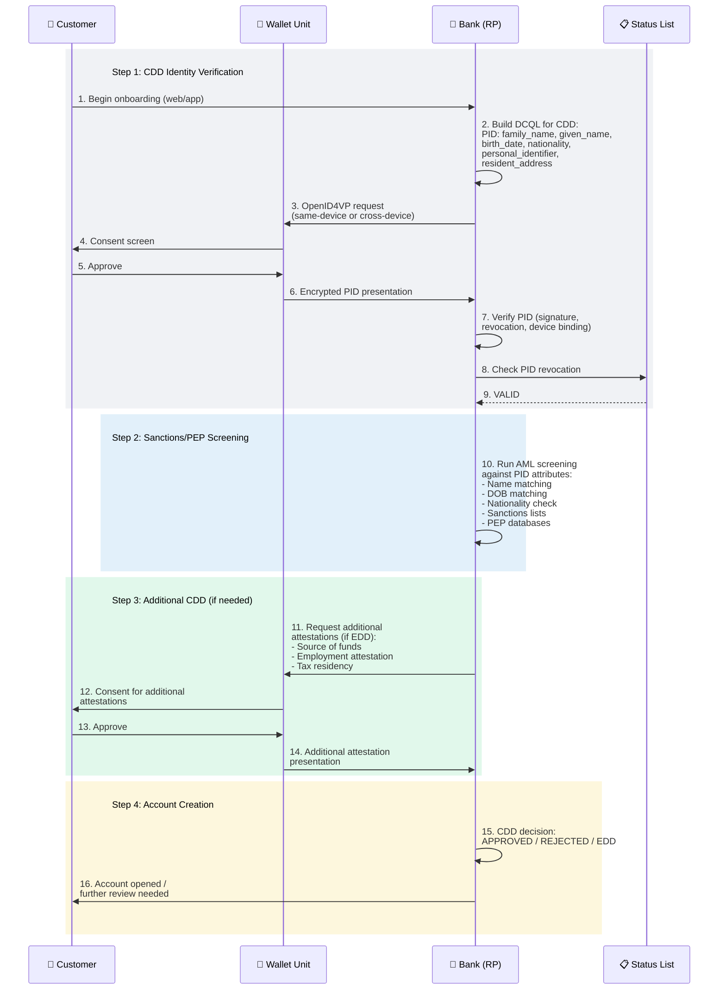
```mermaid
---
config:
  themeVariables:
    noteBkgColor: "transparent"
    noteBorderColor: "transparent"
  sequence:
    messageAlign: left
    noteAlign: left
    actorMargin: 120
---
sequenceDiagram
    participant User as 👤 Customer
    participant WU as 📱 Wallet Unit
    participant Bank as 🏦 Bank (RP)
    participant SL as 📋 Status List

    rect rgba(148, 163, 184, 0.14)
    Note right of User: Step 1: CDD Identity Verification
    User->>Bank: 1. Begin onboarding (web/app)
    Bank->>Bank: 2. Build DCQL for CDD:<br/>PID: family_name, given_name,<br/>birth_date, nationality,<br/>personal_identifier,<br/>resident_address
    Bank->>WU: 3. OpenID4VP request<br/>(same-device or cross-device)
    WU->>User: 4. Consent screen
    User->>WU: 5. Approve
    WU->>Bank: 6. Encrypted PID presentation
    Bank->>Bank: 7. Verify PID (signature,<br/>revocation, device binding)
    Bank->>SL: 8. Check PID revocation
    SL-->>Bank: 9. VALID
    end

    rect rgba(52, 152, 219, 0.14)
    Note right of User: Step 2: Sanctions/PEP Screening
    Bank->>Bank: 10. Run AML screening<br/>against PID attributes:<br/>- Name matching<br/>- DOB matching<br/>- Nationality check<br/>- Sanctions lists<br/>- PEP databases
    end

    rect rgba(46, 204, 113, 0.14)
    Note right of User: Step 3: Additional CDD (if needed)
    Bank->>WU: 11. Request additional<br/>attestations (if EDD):<br/>- Source of funds<br/>- Employment attestation<br/>- Tax residency
    WU->>User: 12. Consent for additional<br/>attestations
    User->>WU: 13. Approve
    WU->>Bank: 14. Additional attestation<br/>presentation
    end

    rect rgba(241, 196, 15, 0.14)
    Note right of User: Step 4: Account Creation
    Bank->>Bank: 15. CDD decision:<br/>APPROVED / REJECTED / EDD
    Bank->>User: 16. Account opened /<br/>further review needed
    Note right of Bank: ⠀
    end
```

#### 44.1.1 CDD Payload Walkthrough

<details>
<summary><strong>Step 2 — Bank constructs DCQL query for KYC onboarding</strong></summary>

The bank builds a DCQL query requesting the minimum PID attributes needed for AMLD Customer Due Diligence:

```json
{
  "credentials": [
    {
      "id": "pid_cdd",
      "format": "dc+sd-jwt",
      "meta": {
        "vct_values": ["eu.europa.ec.eudi.pid.1"]
      },
      "claims": [
        {"path": ["family_name"]},
        {"path": ["given_name"]},
        {"path": ["birth_date"]},
        {"path": ["nationality"]},
        {"path": ["personal_identifier"]},
        {"path": ["resident_address"]},
        {"path": ["resident_city"]},
        {"path": ["resident_postal_code"]},
        {"path": ["resident_country"]}
      ]
    }
  ]
}
```

> **Data minimisation**: The bank requests only CDD-required attributes. Optional PID attributes like `portrait`, `birth_place`, or `age_over_18` are excluded unless needed for Enhanced Due Diligence. The `personal_identifier` is the national ID number — critical for sanctions screening and cross-referencing against government databases.

</details>

<details>
<summary><strong>Step 3 — JAR for CDD presentation request</strong></summary>

The bank wraps the DCQL query in a signed JAR. The `purpose` extension informs the Wallet User of the lawful basis:

```json
{
  "iss": "https://onboarding.example-bank.de",
  "aud": "https://self-issued.me/v2",
  "exp": 1750007000,
  "iat": 1750003200,
  "jti": "cdd-req-a1b2c3d4-e5f6-7890-abcd-ef0123456789",
  "client_id": "x509_hash://sha-256/kR4mBz9vL2...",
  "client_id_scheme": "x509_hash",
  "response_type": "vp_token",
  "response_mode": "direct_post.jwt",
  "response_uri": "https://onboarding.example-bank.de/oid4vp/cdd-callback",
  "nonce": "QmFua19LWUNfT25ib2FyZGluZw",
  "state": "cdd-session-789xyz",
  "response_encryption_alg": "ECDH-ES",
  "response_encryption_enc": "A256GCM",
  "response_encryption_jwk": {
    "kty": "EC",
    "crv": "P-256",
    "x": "weNJy2HscCSM6AEDTDg04biOvhFhyyWvOHQfeF_PxMQ",
    "y": "e8lnCO-AlStT-DBER57_vilrLYyKpa5TXSg0GN7BJPQ"
  },
  "dcql_query": { "...as above..." },
  "rp_info": {
    "intended_use": "Customer onboarding and KYC verification under AMLD Art. 13",
    "privacy_policy_uri": "https://example-bank.de/privacy/kyc"
  }
}
```

> The `rp_info` extension is included in the JAR to provide transparency to the Wallet User about why these attributes are being requested. The Wallet Unit displays this information alongside the consent screen.

</details>

<details>
<summary><strong>Step 6 — Decrypted vp_token for CDD</strong> (bank receives and decrypts)</summary>

After the Wallet User approves, the bank receives an encrypted JWE at its `response_uri`. The decrypted payload contains the SD-JWT VC with all CDD-required attributes selectively disclosed:

```
<Issuer-signed JWT>~<Disclosure:family_name>~<Disclosure:given_name>~
<Disclosure:birth_date>~<Disclosure:nationality>~
<Disclosure:personal_identifier>~<Disclosure:resident_address>~
<Disclosure:resident_city>~<Disclosure:resident_postal_code>~
<Disclosure:resident_country>~<KB-JWT>
```

Decoded disclosures (base64url → JSON array):

```json
["2GLC42sKQveCfGfryNRN9w", "family_name", "Müller"]
["eluV5Og3gSNII8EYnsxA_A", "given_name", "Anna"]
["6Ij7tM-a5iVPGboS5tmvVA", "birth_date", "1990-03-15"]
["eI8ZWm9QnKPpNPeNeuHzsg", "nationality", "DE"]
["Qg_O64zqAxe412a108iroA", "personal_identifier", "1234567890"]
["AJx-095VPrpTtN4QMOqROA", "resident_address", "Musterstraße 42"]
["G02NSrQfjFXQ7Io09syajA", "resident_city", "Berlin"]
["lklxF5jMYlGTPUovMNIvCA", "resident_postal_code", "10115"]
["nPuoQnkRFq3BIeAm7AnXFA", "resident_country", "DE"]
```

Key Binding JWT payload (proves Wallet Unit possesses the device key):

```json
{
  "typ": "kb+jwt",
  "aud": "x509_hash://sha-256/kR4mBz9vL2...",
  "nonce": "QmFua19LWUNfT25ib2FyZGluZw",
  "iat": 1750003500,
  "sd_hash": "X4wJbK9wLu0pE8aRqGm_y2XzK..."
}
```

</details>

<details>
<summary><strong>Step 10 — AML screening against PID attributes</strong></summary>

After verifying the SD-JWT VC (issuer signature, KB-JWT, revocation status), the bank runs AML screening against the extracted attributes:

```
┌─────────────────────────────────────────────────────┐
│ AML/KYC Screening Pipeline                          │
├─────────────────────────────────────────────────────┤
│                                                     │
│ 1. NAME MATCHING                                    │
│    Input:  family_name="Müller", given_name="Anna"  │
│    Check:  EU Consolidated Sanctions List            │
│    Check:  UN Security Council Sanctions List        │
│    Check:  OFAC SDN List (if US nexus)               │
│    Result: ✅ No match                               │
│                                                     │
│ 2. PEP SCREENING                                    │
│    Input:  family_name="Müller", given_name="Anna",  │
│            birth_date="1990-03-15"                   │
│    Check:  Dow Jones / World-Check / similar          │
│    Result: ✅ No PEP match                           │
│                                                     │
│ 3. NATIONAL ID VERIFICATION                         │
│    Input:  personal_identifier="1234567890"          │
│    Check:  National registry cross-reference          │
│    Check:  Internal fraud database                    │
│    Result: ✅ Valid, no duplicates                    │
│                                                     │
│ 4. GEOGRAPHIC RISK                                  │
│    Input:  nationality="DE",                         │
│            resident_country="DE",                    │
│            resident_address="Musterstraße 42, Berlin"│
│    Check:  High-risk jurisdiction list (FATF)         │
│    Result: ✅ Low risk                               │
│                                                     │
│ DECISION: APPROVED — Standard CDD sufficient         │
│ Risk Score: LOW                                      │
│ EDD Required: NO                                     │
└─────────────────────────────────────────────────────┘
```

> **Key advantage**: The PID's `personal_identifier` attribute enables the bank to perform authoritative identity matching against national registries — something impossible with traditional document scanning where OCR errors are common. The cryptographic device binding (KB-JWT) proves the presentation originates from a genuine Wallet Unit, eliminating document forgery risk.

</details>

#### 44.2 CDD Attributes from EUDI Wallet

| AMLD Requirement | EUDI Wallet Source | PID Attribute |
|:-----------------|:-------------------|:--------------|
| Full name | PID | `family_name`, `given_name` |
| Date of birth | PID | `birth_date` |
| Place of birth | PID | `birth_place` (optional) |
| Nationality | PID | `nationality` |
| Residential address | PID or Address attestation | `resident_address`, `resident_city`, `resident_country` |
| National ID number | PID | `personal_identifier` |
| Photo/portrait | PID (proximity flow) | `portrait` |

#### 44.3 Enhanced Due Diligence (EDD)

For higher-risk customers, the bank may request additional attestations beyond the PID using DCQL combined queries. These might include:

- Source of funds attestation
- Employment/occupation attestation
- Tax residency certificate
- Residence permit (for non-EU nationals)

The availability of these attestations depends on Member State implementation and Attestation Provider ecosystem maturity.

### 45. DORA Considerations for Financial RPs

The **Digital Operational Resilience Act (DORA)** — Regulation (EU) 2022/2554 — is relevant to financial-sector RPs only where it directly impacts the RP flows depicted in this document:

| DORA Requirement | Impact on RP Flows |
|:-----------------|:-------------------|
| **ICT third-party risk** (Art. 28–30) | If the RP uses an intermediary (§40), the intermediary is an ICT third-party service provider subject to DORA oversight. The RP must assess its dependency. |
| **ICT incident notification** (Art. 17–23) | If a Wallet presentation flow outage constitutes an ICT-related incident (e.g., WRPAC revocation causing service disruption), the RP must follow DORA incident reporting. |
| **Digital resilience testing** (Art. 24–27) | The RP's EUDI Wallet integration (OpenID4VP endpoint, certificate chain validation, revocation checking) should be included in the RP's digital resilience testing programme. |
| **Information sharing** (Art. 45) | Trust infrastructure events (LoTE updates, Provider suspensions) should be incorporated into the RP's cyber threat intelligence sharing. |

---

## Vendor Landscape

### 46. RP Integration SDKs and Services

The following vendors have confirmed support for EUDI Wallet RP integration as of March 2026. This list includes only vendors with publicly documented EUDI Wallet support.

| Vendor | Product | EUDI Wallet Support | Key Capabilities |
|:-------|:--------|:-------------------|:-----------------|
| **walt.id** | [walt.id Identity Infrastructure](https://walt.id) | ✅ Verified — core contributor to EUDI reference implementation | Open-source verifier SDK; OpenID4VP 1.0, HAIP 1.0, DCQL, SD-JWT VC, mdoc; Kotlin/JVM |
| **Spruce ID** | [SpruceKit / DIDKit](https://spruceid.com) | ✅ Verified — ARF-aligned tooling | Rust-based verifier libraries; SD-JWT VC, mdoc, OpenID4VP; WASM support |
| **Procivis** | [Procivis One](https://procivis.ch) | ✅ Verified — Swiss EUDI Wallet pilot participant | Enterprise verifier platform; OpenID4VP, SD-JWT VC, mdoc; on-prem and SaaS |
| **iGrant.io** | [iGrant.io Data Exchange](https://igrant.io) | ✅ Verified — DCQL implementation contributed to OpenWallet Foundation | Open-source verifier; OpenID4VP 1.0, DCQL, SD-JWT VC |
| **Signicat** | [Signicat Identity Platform](https://signicat.com) | ✅ Verified — Active EUDI Wallet intermediary pilot | RP intermediary service; OpenID4VP, SD-JWT VC; SaaS and on-prem |
| **MATTR** | [MATTR VII](https://mattr.global) | ✅ Verified — HAIP 1.0 contributor | Verifier API; OpenID4VP 1.0, HAIP 1.0, SD-JWT VC, mdoc |
| **Thales** | [Thales D1 Trusted Digital Identity](https://thalesgroup.com) | ✅ Verified — EU Digital Identity Wallet pilot contributor | Enterprise identity platform; hardware security integration |

> **Vendor selection criteria for RPs**: When evaluating vendors, prioritise:
> 1. **HAIP 1.0 compliance** — mandatory for EUDI ecosystem
> 2. **Both format support** — SD-JWT VC AND mdoc
> 3. **DCQL support** — required by HAIP 1.0, replacing legacy presentation_definition
> 4. **Certificate management** — WRPAC lifecycle, trust anchor refresh
> 5. **Intermediary support** — if the RP plans to use an intermediary model
> 6. **SCA integration** — critical for PSPs and banks

---

## Synthesis and Conclusions

### 47. Findings

#### 47.1 Architectural Observations

1. **The RP integration surface is larger than anticipated.** An RP must integrate with at least 7 external systems: Registrar, Access CA, LoTE Provider, Wallet Units (via OpenID4VP or ISO 18013-5), Status Lists, and (optionally) Registration Certificate Provider and Registrar API. This creates a significant system integration burden.

2. **Two parallel credential format stacks create implementation complexity.** Supporting both SD-JWT VC (JSON/JWT-based) and mdoc (CBOR-based) requires two complete verification pipelines, including different selective disclosure models, different device binding verification, and different trust anchor formats.

3. **The trust model has no single point of failure but many points of coordination.** The LoTE/Trusted List hierarchy, certificate chain validation, revocation checking, and optionally registration certificate verification create a robust but operationally complex trust model.

4. **SCA via EUDI Wallet is a paradigm shift for banks.** Moving SCA from proprietary banking apps to an interoperable Wallet-based model requires re-architecting payment authentication flows, adapting to OpenID4VP-based SCA requests, and bridging Dynamic Linking into existing authorisation infrastructure.

5. **The intermediary model solves a real problem but creates trust complexity.** Intermediaries reduce the technical integration burden for smaller RPs but introduce a three-party trust model that requires careful handling of identity display, data forwarding, and no-storage constraints.

6. **Pseudonym support is non-trivial.** RPs must support four pseudonym use cases, implement WebAuthn-based pseudonym authentication, and ensure they never refuse pseudonyms where identification is not legally required.

7. **User sovereignty is deeply embedded.** Every flow gives the User override capability — even disclosure policy denials can be overridden. RPs must design their systems to handle partial approvals and User-initiated disclosures gracefully.

#### 47.2 Regulatory Observations

8. **GDPR compliance requires careful attention.** User approval in the Wallet is NOT GDPR consent. RPs must independently establish a lawful basis for processing before requesting attributes. This is a common misunderstanding.

9. **AML/KYC onboarding via EUDI Wallet is feasible but depends on attestation availability.** Basic CDD using PID attributes works well. Enhanced Due Diligence requires additional attestation types that may not be available in all Member States at launch.

10. **DORA creates additional operational requirements for financial RPs.** The EUDI Wallet integration infrastructure (endpoints, certificates, trust anchors) must be included in DORA-mandated resilience testing and incident reporting.

### 48. Recommendations

#### 48.1 For All RPs

| Priority | Recommendation |
|:---------|:---------------|
| 🔴 **Critical** | Begin RP registration with national Registrar immediately. Registration delays will compress the integration timeline. |
| 🔴 **Critical** | Implement both SD-JWT VC and mdoc verification pipelines. Both are mandatory. |
| 🔴 **Critical** | Implement HAIP 1.0 compliant OpenID4VP (JAR, x509_hash, direct_post.jwt, DCQL). |
| 🟡 **High** | Implement periodic LoTE/Trusted List refresh (minimum daily). |
| 🟡 **High** | Implement WRPAC revocation monitoring and renewal automation. |
| 🟡 **High** | Implement `supportURI` endpoint for TS7 data deletion requests. |
| 🟢 **Medium** | Support pseudonym-based authentication for services where legal identification is not required. |
| 🟢 **Medium** | Evaluate intermediary model vs. direct integration based on technical maturity and volume. |

#### 48.2 For Financial-Sector RPs (Banks, PSPs)

| Priority | Recommendation |
|:---------|:---------------|
| 🔴 **Critical** | Implement TS12 SCA flow including `transaction_data` and Dynamic Linking. |
| 🔴 **Critical** | Map EUDI Wallet SCA response to existing authorisation decision infrastructure. |
| 🔴 **Critical** | Implement CDD onboarding flow using PID + address attestation. |
| 🟡 **High** | Include EUDI Wallet integration in DORA digital resilience testing programme. |
| 🟡 **High** | Assess intermediary as ICT third-party service provider under DORA Art. 28–30. |
| 🟢 **Medium** | Prepare for Enhanced Due Diligence attestation types as MS ecosystems mature. |

### 49. Open Questions

| # | Question | Source | Status |
|:--|:---------|:-------|:-------|
| 1 | W2W Verifier authentication mechanism | TS9 | Under active discussion — no resolution yet |
| 2 | WRPRC exact X.509 profile | ETSI TS 119 411-8 | Draft — not yet finalised |
| 3 | Embedded disclosure policy technical format | ARF, CIR 2024/2979 Annex III | Specification forthcoming from Commission |
| 4 | Pseudonym Use Case D (with full PID) — exact protocol | ARF | Under discussion |
| 5 | POST method harmonisation for Registrar API | TS5 | Left for further study |
| 6 | PuB-EAA Provider certificate chain — QTSP integration details | ARF §6.6.3.6 | Additional specifications needed |
| 7 | Cross-border RP registration — RP established in non-EU EEA state | CIR 2025/848 | Requires clarification |
| 8 | SCA attestation issuance protocol (OID4VCI specifics) | TS12 | Partially specified, cross-references OID4VCI |
| 9 | Combined presentation with mixed formats (SD-JWT + mdoc in one response) | HAIP 1.0 | Not explicitly addressed |
| 10 | DC API deployment timeline across browsers | W3C Digital Credentials API | Under active W3C development |

---

## 50. References

### Regulations and Implementing Acts

| Identifier | Title | Citation |
|:-----------|:------|:---------|
| **eIDAS 2.0** | Regulation (EU) 2024/1183 (European Digital Identity Framework) | [CELEX:32024R1183](https://eur-lex.europa.eu/legal-content/EN/TXT/?uri=CELEX:32024R1183) |
| **CIR 2024/2977** | PID and EAA implementing regulation | [2024/2977](https://data.europa.eu/eli/reg_impl/2024/2977/oj) |
| **CIR 2024/2979** | Integrity and core functionalities | [2024/2979](https://data.europa.eu/eli/reg_impl/2024/2979/oj) |
| **CIR 2024/2982** | Protocols and interfaces | [2024/2982](https://data.europa.eu/eli/reg_impl/2024/2982/oj) |
| **CIR 2025/848** | Registration of Wallet-Relying Parties | [2025/848](https://data.europa.eu/eli/reg_impl/2025/848/oj) |
| **PSD2** | Directive (EU) 2015/2366 (Payment Services) | [CELEX:32015L2366](https://eur-lex.europa.eu/legal-content/EN/TXT/?uri=CELEX:32015L2366) |
| **GDPR** | Regulation (EU) 2016/679 | [CELEX:32016R0679](https://eur-lex.europa.eu/legal-content/EN/TXT/?uri=CELEX:32016R0679) |
| **DORA** | Regulation (EU) 2022/2554 | [CELEX:32022R2554](https://eur-lex.europa.eu/legal-content/EN/TXT/?uri=CELEX:32022R2554) |
| **AMLD6** | Directive (EU) 2024/1640 | [CELEX:32024L1640](https://eur-lex.europa.eu/legal-content/EN/TXT/?uri=CELEX:32024L1640) |

### Architecture and Technical Specifications

| Identifier | Title | Source |
|:-----------|:------|:-------|
| **ARF** | Architecture and Reference Framework (v2.7+) | [EUDI GitHub](https://github.com/eu-digital-identity-wallet/eudi-doc-architecture-and-reference-framework) |
| **TS5** | Common formats and API for RP registration information (v1.0) | [EUDI STS GitHub](https://github.com/eu-digital-identity-wallet/eudi-doc-standards-and-technical-specifications) |
| **TS6** | Common set of RP information to be registered (v1.0) | Same as TS5 |
| **TS7** | Common interface for data deletion requests (v0.95) | Same as TS5 |
| **TS8** | Common interface for reporting of WRP to DPA (v0.95) | Same as TS5 |
| **TS9** | Wallet-to-Wallet interactions (v1.0) | Same as TS5 |
| **TS12** | SCA implementation with the Wallet (v1.0) | Same as TS5 |

### Standards and Protocols

| Identifier | Title | Source |
|:-----------|:------|:-------|
| **OpenID4VP 1.0** | OpenID for Verifiable Presentations 1.0 (Final, July 2025) | [openid.net](https://openid.net/specs/openid-4-verifiable-presentations-1_0.html) |
| **HAIP 1.0** | High Assurance Interoperability Profile 1.0 (Final, Dec 2025) | [openid.net](https://openid.net/specs/openid4vc-high-assurance-interoperability-profile-1_0.html) |
| **OID4VCI** | OpenID for Verifiable Credential Issuance 1.0 | [openid.net](https://openid.net/specs/openid-4-verifiable-credential-issuance-1_0.html) |
| **SD-JWT VC** | SD-JWT-based Verifiable Credentials (IETF) | [datatracker.ietf.org](https://datatracker.ietf.org/doc/draft-ietf-oauth-sd-jwt-vc/) |
| **ISO/IEC 18013-5** | Personal identification — ISO-compliant driving licence — Part 5 | [iso.org](https://www.iso.org/standard/69084.html) |
| **ISO/IEC 18013-7** | Adds online presentation of mdoc via OpenID4VP | [iso.org](https://www.iso.org/standard/82772.html) |
| **DCQL** | Digital Credentials Query Language | Part of OpenID4VP 1.0 |
| **JAR** | JWT-Secured Authorization Request (RFC 9101) | [RFC 9101](https://datatracker.ietf.org/doc/rfc9101/) |
| **ETSI TS 119 475** | Relying Party attributes for EUDI Wallet | [ETSI](https://www.etsi.org/deliver/etsi_ts/119400_119499/119475/) |
| **ETSI TS 119 612** | Trusted Lists | [ETSI](https://www.etsi.org/deliver/etsi_ts/119600_119699/119612/) |
| **RFC 9162** | Certificate Transparency 2.0 | [RFC 9162](https://datatracker.ietf.org/doc/rfc9162/) |
| **RFC 9598** | Status List (Token Status List) | [RFC 9598](https://datatracker.ietf.org/doc/rfc9598/) |
| **W3C DC API** | Digital Credentials API | [W3C](https://wicg.github.io/digital-credentials/) |

---

## Annexes

### Annex A: Exact Response Payloads

#### A.1 SD-JWT VC vp_token Response

When the Wallet Unit responds to an OpenID4VP request with an SD-JWT VC credential, the presentation is delivered as a JWE-encrypted `direct_post.jwt`. The decrypted inner structure contains the `vp_token`:

```
<Issuer-signed JWT>~<Disclosure1>~<Disclosure2>~...~<DisclosureN>~<Key Binding JWT>
```

**Full decoded example** (PID presentation with selective disclosure of `family_name`, `given_name`, `birth_date`):

```json
// === Issuer-Signed JWT Header ===
{
  "typ": "vc+sd-jwt",
  "alg": "ES256",
  "kid": "pid-issuer-key-2026",
  "x5c": ["<PID Provider signing certificate>", "<Intermediate CA>"]
}

// === Issuer-Signed JWT Payload ===
{
  "iss": "https://pid-provider.example-ms.eu",
  "sub": "urn:eudi:pid:de:1234567890",
  "iat": 1721000000,
  "exp": 1752536000,
  "vct": "eu.europa.ec.eudi.pid.1",
  "status": {
    "status_list": {
      "idx": 42,
      "uri": "https://pid-provider.example-ms.eu/status/1"
    }
  },
  "cnf": {
    "jwk": {
      "kty": "EC",
      "crv": "P-256",
      "x": "TCAER19Zvu3OHF4j4W4vfSVoHIP1ILilDls7vCeGemc",
      "y": "ZxjiWWbZMQGHVWKVQ4hbSIirsVfuecCE6t4jT9F2HZQ"
    }
  },
  "_sd": [
    "CrQe7S5kqBAHt-nMYXgc6bdt2SH5aTY1sU_M-PgkjPI",
    "JzYjH4svliH0R3PyEMfeZu6Jt69u5WehB_GJ39D3LDc",
    "PorFbpKuVu6xymJagvkFsFXAbRoc2JGlAUA-2WXs5AI"
  ],
  "_sd_alg": "sha-256"
}

// === Disclosures (one per selectively-disclosed attribute) ===
// Disclosure 1: ["6Ij7tM-avx0UPEljMVdFBR", "family_name", "Müller"]
// Base64url: WyI2SWo3dE0tYXZ4MFVQRW...
// SHA-256 hash matches _sd[0]

// Disclosure 2: ["eluV5Og3gSNII8EYnsxA_A", "given_name", "Erika"]
// Base64url: WyJlbHVWNU9nM2dTTklJ...
// SHA-256 hash matches _sd[1]

// Disclosure 3: ["Qg_O64zqAxe412a108iroA", "birth_date", "1984-01-26"]
// Base64url: WyJRZ19PNjR6cUF4ZTQx...
// SHA-256 hash matches _sd[2]

// === Key Binding JWT Header ===
{
  "typ": "kb+jwt",
  "alg": "ES256"
}

// === Key Binding JWT Payload ===
{
  "aud": "x509_san_dns:eudi.example-bank.de",
  "nonce": "bUtJdjJESWdmTWNjb011YQ",
  "iat": 1741269093,
  "sd_hash": "Re-CtLZfjGLErKy3eSriZ4bBx3AtUH5Q5wsWiiWKIwY"
}
```

#### A.2 JWE Envelope (direct_post.jwt)

The `vp_token` is encrypted to the RP using the ephemeral public key from the Authorization Request:

```json
// === JWE Header ===
{
  "alg": "ECDH-ES",
  "enc": "A256GCM",
  "kid": "<RP ephemeral key thumbprint>",
  "epk": {
    "kty": "EC",
    "crv": "P-256",
    "x": "<Wallet ephemeral X>",
    "y": "<Wallet ephemeral Y>"
  },
  "apu": "<base64url(Wallet ephemeral key)>",
  "apv": "<base64url(RP nonce)>"
}

// === Decrypted JWE Payload ===
{
  "vp_token": "<SD-JWT VC string as shown above>",
  "presentation_submission": {
    "id": "submission-1",
    "definition_id": "dcql-query-1",
    "descriptor_map": [
      {
        "id": "pid",
        "format": "dc+sd-jwt",
        "path": "$"
      }
    ]
  },
  "state": "af0ifjsldkj"
}
```

#### A.3 mdoc DeviceResponse (CBOR Diagnostic Notation)

The proximity mdoc presentation response (ISO/IEC 18013-5):

```
DeviceResponse = {
  "version": "1.0",
  "documents": [
    {
      "docType": "eu.europa.ec.eudi.pid.1",
      "issuerSigned": {
        "nameSpaces": {
          "eu.europa.ec.eudi.pid.1": [
            {  ; IssuerSignedItem
              "digestID": 0,
              "random": h'8798645321abcdef',
              "elementIdentifier": "family_name",
              "elementValue": "Müller"
            },
            {
              "digestID": 1,
              "random": h'abcdef1234567890',
              "elementIdentifier": "given_name",
              "elementValue": "Erika"
            },
            {
              "digestID": 2,
              "random": h'1234567890abcdef',
              "elementIdentifier": "birth_date",
              "elementValue": 1009(  ; CBOR tag: full-date
                "1984-01-26"
              )
            }
          ]
        },
        "issuerAuth": [         ; COSE_Sign1
          h'a10126',             ; protected: {1: -7} (ES256)
          {},                    ; unprotected
          h'<MSO CBOR bytes>',  ; payload: MobileSecurityObject
          h'<signature bytes>'   ; signature
        ]
      },
      "deviceSigned": {
        "nameSpaces": {},        ; empty (no device-signed data)
        "deviceAuth": {
          "deviceSignature": [   ; COSE_Sign1
            h'a10126',           ; protected: ES256
            {},                  ; unprotected
            nil,                 ; detached payload (SessionTranscript)
            h'<device sig>'      ; signature over SessionTranscript
          ]
        }
      }
    }
  ],
  "status": 0                    ; 0 = OK
}
```

#### A.4 DC API navigator.credentials.get() Parameters

The W3C Digital Credentials API invocation for same-device remote flow:

```javascript
const credential = await navigator.credentials.get({
  digital: {
    providers: [{
      protocol: "openid4vp",
      request: {
        // JAR (signed by RP using WRPAC)
        client_id: "x509_san_dns:eudi.example-bank.de",
        request_uri: "https://eudi.example-bank.de/oid4vp/request/abc123",
        request_uri_method: "post"
      }
    }]
  },
  mediation: "required"  // Always prompt user
});

// Response: credential.data contains the encrypted vp_token (JWE)
const encryptedResponse = credential.data;
// RP backend decrypts with the ephemeral private key
```

---

### Annex B: Status List Verification Deep-Dive

#### B.1 RFC 9598 Status List Token Structure

The EUDI Wallet ecosystem uses **Token Status Lists** (RFC 9598) for credential revocation. Both PID Providers and Attestation Providers publish Status List Tokens that RPs must check.

A Status List Token is a JWT containing a compressed bitstring:

```json
// === Status List Token Header ===
{
  "typ": "statuslist+jwt",
  "alg": "ES256",
  "kid": "pid-provider-status-key"
}

// === Status List Token Payload ===
{
  "iss": "https://pid-provider.example-ms.eu",
  "sub": "https://pid-provider.example-ms.eu/status/1",
  "iat": 1741269093,
  "exp": 1741355493,
  "status_list": {
    "bits": 1,
    "lst": "<base64url-encoded DEFLATE-compressed bitstring>"
  }
}
```

Each credential references a specific index in the Status List. The RP looks up `idx` in the decompressed bitstring:

- Bit value `0` → credential is VALID
- Bit value `1` → credential is REVOKED/SUSPENDED

#### B.2 RP Status List Verification Flow

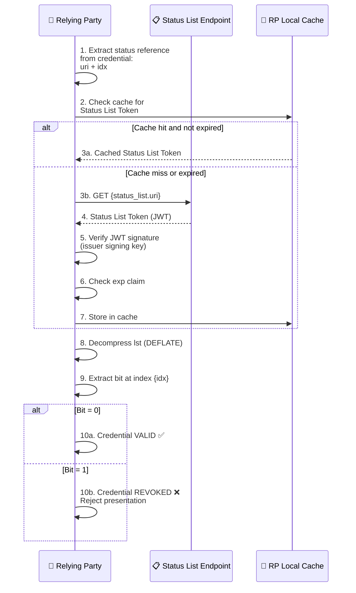
```mermaid
---
config:
  sequence:
    messageAlign: left
    noteAlign: left
---
sequenceDiagram
    participant RP as 🏦 Relying Party
    participant SL as 📋 Status List Endpoint
    participant Cache as 💾 RP Local Cache

    RP->>RP: 1. Extract status reference<br/>from credential:<br/>uri + idx
    RP->>Cache: 2. Check cache for<br/>Status List Token
    alt Cache hit and not expired
        Cache-->>RP: 3a. Cached Status List Token
    else Cache miss or expired
        RP->>SL: 3b. GET {status_list.uri}
        SL-->>RP: 4. Status List Token (JWT)
        RP->>RP: 5. Verify JWT signature<br/>(issuer signing key)
        RP->>RP: 6. Check exp claim
        RP->>Cache: 7. Store in cache
    end
    RP->>RP: 8. Decompress lst (DEFLATE)
    RP->>RP: 9. Extract bit at index {idx}
    alt Bit = 0
        RP->>RP: 10a. Credential VALID ✅
    else Bit = 1
        RP->>RP: 10b. Credential REVOKED ❌<br/>Reject presentation
    end
```

#### B.2.1 Status List Verification Payload Walkthrough

<details>
<summary><strong>Step 1 — Extract status reference from credential</strong></summary>

Within the SD-JWT VC Issuer-signed JWT payload, the PID Provider includes a `status` claim referencing the Status List endpoint and the credential's index:

```json
{
  "iss": "https://pid-provider.example-ms.eu",
  "iat": 1741269093,
  "exp": 1772805093,
  "vct": "eu.europa.ec.eudi.pid.1",
  "cnf": {
    "jwk": { "...device public key..." }
  },
  "status": {
    "status_list": {
      "idx": 8472,
      "uri": "https://pid-provider.example-ms.eu/status/lists/chunk-47"
    }
  },
  "_sd": [ "...selective disclosure hashes..." ],
  "_sd_alg": "sha-256"
}
```

The RP extracts:
- **`uri`**: `https://pid-provider.example-ms.eu/status/lists/chunk-47` — the Status List Token endpoint
- **`idx`**: `8472` — the bit position (0-indexed) within the decompressed bitstring

> **Chunking**: Per TS3 §2.5, Wallet Providers and PID Providers SHOULD chunk status lists to contain at least 10,000 entries each. The `chunk-47` segment identifier is illustrative — providers may use any opaque identifier for their chunking strategy.

</details>

<details>
<summary><strong>Steps 3b–4 — Fetch Status List Token from endpoint</strong></summary>

If the RP's local cache does not contain a valid (non-expired) Status List Token for this URI:

```http
GET /status/lists/chunk-47 HTTP/1.1
Host: pid-provider.example-ms.eu
Accept: application/statuslist+jwt
```

Response:

```http
HTTP/1.1 200 OK
Content-Type: application/statuslist+jwt
Cache-Control: max-age=86400

eyJhbGciOiJFUzI1NiIsInR5cCI6InN0YXR1c2xpc3Qrand0Iiwia2lkIjoicGlkLXByb3ZpZGVyLXN0YXR1cy1rZXkifQ.eyJpc3MiOiJodHRwczovL3BpZC1wcm92aWRlci5leGFtcGxlLW1zLmV1Iiwic3ViIjoiaHR0cHM6Ly9waWQtcHJvdmlkZXIuZXhhbXBsZS1tcy5ldS9zdGF0dXMvbGlzdHMvY2h1bmstNDciLCJpYXQiOjE3NDEyNjkwOTMsImV4cCI6MTc0MTM1NTQ5Mywic3RhdHVzX2xpc3QiOnsiYml0cyI6MSwibHN0IjoiPGJhc2U2NHVybC1lbmNvZGVkIERFRkxBVEUtY29tcHJlc3NlZCBiaXRzdHJpbmc-In0.signature
```

</details>

<details>
<summary><strong>Steps 5–6 — Decode and verify Status List Token</strong></summary>

The Status List Token is a standard JWT. Decoded:

```json
// Header
{
  "alg": "ES256",
  "typ": "statuslist+jwt",
  "kid": "pid-provider-status-key"
}

// Payload
{
  "iss": "https://pid-provider.example-ms.eu",
  "sub": "https://pid-provider.example-ms.eu/status/lists/chunk-47",
  "iat": 1741269093,
  "exp": 1741355493,
  "status_list": {
    "bits": 1,
    "lst": "eNrbuRgAAhcBXQ"
  }
}
```

RP verification checks:
1. **Signature**: Verify the JWT signature against the PID Provider's signing key (same trust chain used to verify the credential itself)
2. **Issuer match**: Confirm `iss` matches the credential's `iss` claim
3. **Subject match**: Confirm `sub` matches the `status.status_list.uri` from the credential
4. **Expiration**: Confirm `exp` > current time — if expired, re-fetch from endpoint
5. **Bits field**: `bits: 1` means each credential status is encoded as a single bit (0 = valid, 1 = revoked). Other values (2, 4, 8) allow for more granular status codes

</details>

<details>
<summary><strong>Steps 8–10 — Decompress and extract bit</strong></summary>

The `lst` value is a base64url-encoded DEFLATE-compressed bitstring. The RP decompresses it and extracts the bit at the credential's index:

```python
import base64
import zlib

# 1. Base64url-decode the lst value
compressed = base64.urlsafe_b64decode(status_list_token["status_list"]["lst"] + "==")

# 2. DEFLATE-decompress
decompressed = zlib.decompress(compressed, -zlib.MAX_WBITS)

# 3. Extract the bit at the credential's index
idx = 8472
bits_per_status = status_list_token["status_list"]["bits"]  # 1

# For bits=1: each byte contains 8 status values
byte_index = (idx * bits_per_status) // 8
bit_index = (idx * bits_per_status) % 8
status_byte = decompressed[byte_index]
status_value = (status_byte >> bit_index) & ((1 << bits_per_status) - 1)

# 4. Interpret the status
if status_value == 0:
    print("Credential VALID ✅")
elif status_value == 1:
    print("Credential REVOKED ❌ — reject presentation")
```

> **Performance note**: For a chunked Status List containing 10,000 entries with `bits=1`, the compressed bitstring is typically only a few hundred bytes. The RP should cache the decompressed bitstring alongside the JWT `exp` timestamp to avoid repeated decompression within the validity window.

</details>

#### B.3 RP Implementation Considerations

| Aspect | Recommendation |
|:-------|:---------------|
| **Caching** | Cache Status List Tokens locally; refresh based on `exp` claim. Typical TTL: 1–24 hours |
| **Batch checking** | For combined presentations, check ALL credentials against their respective Status Lists before accepting |
| **Offline proximity** | In unsupervised proximity flows, the terminal may not have real-time internet. Cache Status Lists aggressively. Accept a grace period window for revocation propagation |
| **Multiple providers** | Different credentials reference different Status List endpoints. The RP must maintain caches per provider |
| **Signature verification** | The Status List Token is signed by the same issuer key that signed the credential. Verify using the same trust chain |

---

### Annex C: Additional Sequence Diagrams

#### C.1 W2W Interaction Flow (TS9)

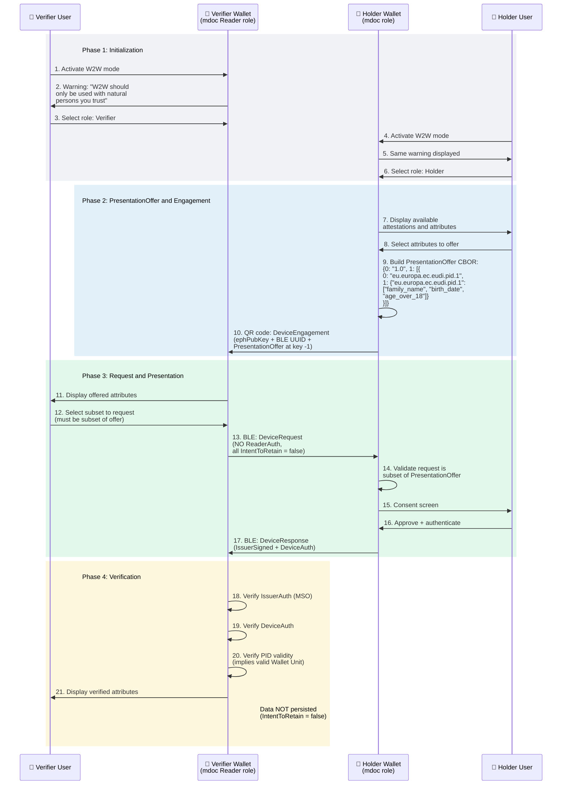
```mermaid
---
config:
  themeVariables:
    noteBkgColor: "transparent"
    noteBorderColor: "transparent"
  sequence:
    messageAlign: left
    noteAlign: left
    actorMargin: 140
---
sequenceDiagram
    participant VU as 👤 Verifier User
    participant VW as 📱 Verifier Wallet<br/>(mdoc Reader role)
    participant HW as 📱 Holder Wallet<br/>(mdoc role)
    participant HU as 👤 Holder User

    rect rgba(148, 163, 184, 0.14)
    Note right of VU: Phase 1: Initialization
    VU->>VW: 1. Activate W2W mode
    VW->>VU: 2. Warning: "W2W should<br/>only be used with natural<br/>persons you trust"
    VU->>VW: 3. Select role: Verifier
    HU->>HW: 4. Activate W2W mode
    HW->>HU: 5. Same warning displayed
    HU->>HW: 6. Select role: Holder
    end

    rect rgba(52, 152, 219, 0.14)
    Note right of VU: Phase 2: PresentationOffer and Engagement
    HW->>HU: 7. Display available<br/>attestations and attributes
    HU->>HW: 8. Select attributes to offer
    HW->>HW: 9. Build PresentationOffer CBOR:<br/>{0: "1.0", 1: [{<br/>  0: "eu.europa.ec.eudi.pid.1",<br/>  1: {"eu.europa.ec.eudi.pid.1":<br/>    ["family_name", "birth_date",<br/>     "age_over_18"]}<br/>}]}
    HW->>VW: 10. QR code: DeviceEngagement<br/>(ephPubKey + BLE UUID +<br/>PresentationOffer at key -1)
    end

    rect rgba(46, 204, 113, 0.14)
    Note right of VU: Phase 3: Request and Presentation
    VW->>VU: 11. Display offered attributes
    VU->>VW: 12. Select subset to request<br/>(must be subset of offer)
    VW->>HW: 13. BLE: DeviceRequest<br/>(NO ReaderAuth,<br/>all IntentToRetain = false)
    HW->>HW: 14. Validate request is<br/>subset of PresentationOffer
    HW->>HU: 15. Consent screen
    HU->>HW: 16. Approve + authenticate
    HW->>VW: 17. BLE: DeviceResponse<br/>(IssuerSigned + DeviceAuth)
    end

    rect rgba(241, 196, 15, 0.14)
    Note right of VU: Phase 4: Verification
    VW->>VW: 18. Verify IssuerAuth (MSO)
    VW->>VW: 19. Verify DeviceAuth
    VW->>VW: 20. Verify PID validity<br/>(implies valid Wallet Unit)
    VW->>VU: 21. Display verified attributes
    Note right of VW: Data NOT persisted<br/>(IntentToRetain = false)
    Note right of VW: ⠀
    end
```

**Key TS9 constraints** verified against source specification:

| Constraint | Source | Detail |
|:-----------|:-------|:-------|
| **QR mandatory** for device engagement | STS9_07/08 | QR codes are required; NFC is optional (unlike RP proximity where NFC is primary) |
| **No ReaderAuth** | STS9_30 | Verifier has no WRPAC. Authentication relies on out-of-band trust and PID validity |
| **IntentToRetain = false** | STS9_29 | Verifier SHALL NOT persist received data |
| **Rate limiting** | STS9_31/32 | Max 5 requests/hour, 20/day, 50/week (sliding windows) |
| **No screenshots** | STS9_36 | Wallet Providers SHOULD prevent screenshots of received presentations |
| **No data forwarding** | STS9_37 | Verifier Wallet SHALL NOT communicate received data to any other party |
| **PresentationOffer optional** | STS9_12 | Holder may present without a prior offer; in that case Verifier can request any attributes |
| **mdoc only** | TS9 §1.2 | SD-JWT VC is NOT supported for W2W |

<details>
<summary><strong>Step 9 — PresentationOffer CBOR</strong> (Holder builds, embedded in DeviceEngagement)</summary>

```
PresentationOffer = {
  0: "1.0",                              ; version
  1: [                                   ; offered documents
    {
      0: "eu.europa.ec.eudi.pid.1",      ; docType
      1: {                               ; offered nameSpaces + elements
        "eu.europa.ec.eudi.pid.1": [
          "family_name",
          "given_name",
          "birth_date",
          "age_over_18"
        ]
      }
    }
  ]
}
```

The PresentationOffer is embedded at key `-1` in the DeviceEngagement CBOR, alongside the ephemeral key and BLE transport info. The Verifier Wallet displays these attributes and the Verifier User selects a subset.

</details>

<details>
<summary><strong>Step 13 — DeviceRequest</strong> (no ReaderAuth — Verifier has no WRPAC)</summary>

```
DeviceRequest = {
  "version": "1.0",
  "docRequests": [
    {
      "itemsRequest": 24(<<
        {
          "docType": "eu.europa.ec.eudi.pid.1",
          "nameSpaces": {
            "eu.europa.ec.eudi.pid.1": {
              "family_name": false,       ; IntentToRetain = false (STS9_29)
              "birth_date": false,
              "age_over_18": false
            }
          }
        }
      >>)
      ; NOTE: No "readerAuth" field — STS9_30 prohibits it
    }
  ]
}
```

Key difference from RP proximity (§25): **no `readerAuth`** COSE_Sign1 — the Verifier Wallet has no WRPAC. All `IntentToRetain` flags MUST be `false`.

</details>

<details>
<summary><strong>Step 17 — DeviceResponse</strong> (same structure as §25.3 but without retention)</summary>

The DeviceResponse structure is identical to §25.3 (IssuerSigned + DeviceAuth). The Verifier Wallet verifies `issuerAuth` against the PID Provider trust anchor from LoTE, verifies `deviceSignature` over SessionTranscript, and displays the verified attributes. Per STS9_29, the data is **not persisted** after the session ends.

</details>

#### C.2 Unsupervised Proximity Flow

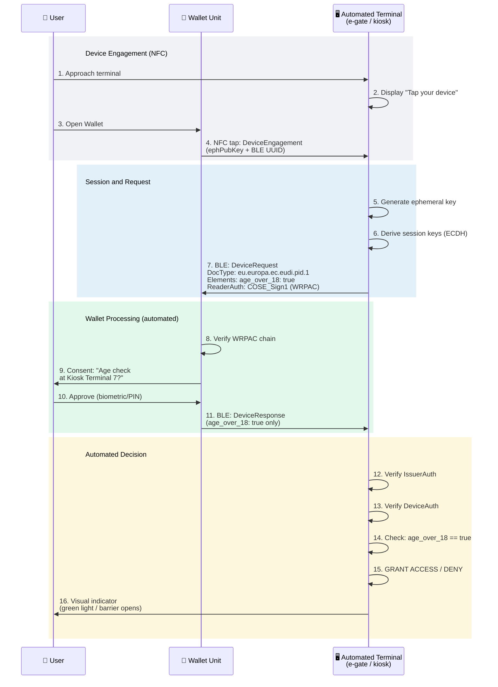
```mermaid
---
config:
  themeVariables:
    noteBkgColor: "transparent"
    noteBorderColor: "transparent"
  sequence:
    messageAlign: left
    noteAlign: left
    actorMargin: 130
---
sequenceDiagram
    participant User as 👤 User
    participant WU as 📱 Wallet Unit
    participant Terminal as 🖥️ Automated Terminal<br/>(e-gate / kiosk)

    rect rgba(148, 163, 184, 0.14)
    Note right of User: Device Engagement (NFC)
    User->>Terminal: 1. Approach terminal
    Terminal->>Terminal: 2. Display "Tap your device"
    User->>WU: 3. Open Wallet
    WU->>Terminal: 4. NFC tap: DeviceEngagement<br/>(ephPubKey + BLE UUID)
    end

    rect rgba(52, 152, 219, 0.14)
    Note right of User: Session and Request
    Terminal->>Terminal: 5. Generate ephemeral key
    Terminal->>Terminal: 6. Derive session keys (ECDH)
    Terminal->>WU: 7. BLE: DeviceRequest<br/>DocType: eu.europa.ec.eudi.pid.1<br/>Elements: age_over_18: true<br/>ReaderAuth: COSE_Sign1 (WRPAC)
    end

    rect rgba(46, 204, 113, 0.14)
    Note right of User: Wallet Processing (automated)
    WU->>WU: 8. Verify WRPAC chain
    WU->>User: 9. Consent: "Age check<br/>at Kiosk Terminal 7?"
    User->>WU: 10. Approve (biometric/PIN)
    WU->>Terminal: 11. BLE: DeviceResponse<br/>(age_over_18: true only)
    end

    rect rgba(241, 196, 15, 0.14)
    Note right of User: Automated Decision
    Terminal->>Terminal: 12. Verify IssuerAuth
    Terminal->>Terminal: 13. Verify DeviceAuth
    Terminal->>Terminal: 14. Check: age_over_18 == true
    Terminal->>Terminal: 15. GRANT ACCESS / DENY
    Terminal->>User: 16. Visual indicator<br/>(green light / barrier opens)
    Note right of Terminal: ⠀
    end
```

#### C.3 Pseudonym Registration via WebAuthn

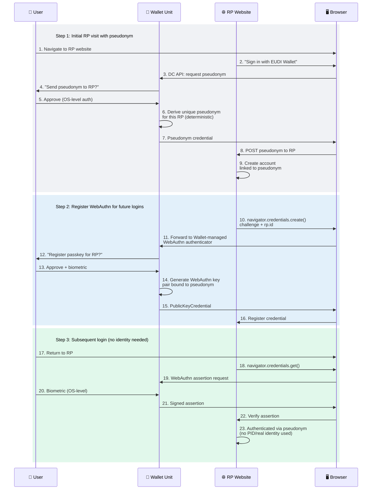
```mermaid
---
config:
  themeVariables:
    noteBkgColor: "transparent"
    noteBorderColor: "transparent"
  sequence:
    messageAlign: left
    noteAlign: left
    actorMargin: 120
---
sequenceDiagram
    participant User as 👤 User
    participant WU as 📱 Wallet Unit
    participant RP as 🌐 RP Website
    participant Browser as 🖥️ Browser

    rect rgba(148, 163, 184, 0.14)
    Note right of User: Step 1: Initial RP visit with pseudonym
    User->>Browser: 1. Navigate to RP website
    RP->>Browser: 2. "Sign in with EUDI Wallet"
    Browser->>WU: 3. DC API: request pseudonym
    WU->>User: 4. "Send pseudonym to RP?"
    User->>WU: 5. Approve (OS-level auth)
    WU->>WU: 6. Derive unique pseudonym<br/>for this RP (deterministic)
    WU->>Browser: 7. Pseudonym credential
    Browser->>RP: 8. POST pseudonym to RP
    RP->>RP: 9. Create account<br/>linked to pseudonym
    end

    rect rgba(52, 152, 219, 0.14)
    Note right of User: Step 2: Register WebAuthn for future logins
    RP->>Browser: 10. navigator.credentials.create()<br/>challenge + rp.id
    Browser->>WU: 11. Forward to Wallet-managed<br/>WebAuthn authenticator
    WU->>User: 12. "Register passkey for RP?"
    User->>WU: 13. Approve + biometric
    WU->>WU: 14. Generate WebAuthn key<br/>pair bound to pseudonym
    WU->>Browser: 15. PublicKeyCredential
    Browser->>RP: 16. Register credential
    end

    rect rgba(46, 204, 113, 0.14)
    Note right of User: Step 3: Subsequent login (no identity needed)
    User->>Browser: 17. Return to RP
    RP->>Browser: 18. navigator.credentials.get()
    Browser->>WU: 19. WebAuthn assertion request
    User->>WU: 20. Biometric (OS-level)
    WU->>Browser: 21. Signed assertion
    Browser->>RP: 22. Verify assertion
    RP->>RP: 23. Authenticated via pseudonym<br/>(no PID/real identity used)
    Note right of RP: ⠀
    end
```

---

### Annex D: SCA Deep-Dive Corrections and Expansions (from TS12)

Cross-verification against TS12 source specification (v1.0, Dec 2025) revealed the following corrections and additions to §29–§32:

#### D.1 Corrections to §29.2

TS12 does **not** define separate `eu.europa.ec.eudi.sca.metadata.1` and `eu.europa.ec.eudi.sca.transaction.1` VCT types. Instead, it specifies that SCA Attestations are identified by the `category` claim in the SD-JWT VC Type Metadata:

```json
{
  "vct": "https://pay.example.com/card",
  "category": "urn:eu:europa:ec:eudi:sua:sca"
}
```

The actual VCT values are defined by sector-specific **SCA Attestation Rulebooks**, not by TS12 itself. TS12 provides three non-normative attestation examples:

| SCA Attestation Type | Represents | Key Attributes |
|:---------------------|:-----------|:---------------|
| Card-based | Specific card belonging to a User | `pan_last_four`, `scheme`, `scheme_logo` |
| Account-based | Specific account belonging to a User | `iban`, `bic`, `currency` |
| User-only | The User/PSU themselves | `sub` only (no instrument details) |

#### D.2 Four Standardised Transaction Data Types (TS12 §4.3)

TS12 defines four payload schemas, not one:

| URN Identifier | Use Case | Required Fields |
|:---------------|:---------|:----------------|
| `urn:eudi:sca:payment:1` | Payment confirmation | `transaction_id`, `payee` (name + id), `currency`, `amount` |
| `urn:eudi:sca:login_risk_transaction:1` | Login and risk-based auth | `transaction_id`, `action` |
| `urn:eudi:sca:account_access:1` | Account information access (AISP) | `transaction_id` |
| `urn:eudi:sca:emandate:1` | E-mandate for payee-initiated tx | `transaction_id`, conditional: `purpose` or `payment_payload` |

#### D.3 KB-JWT Authentication Methods Reference (amr)

TS12 §3.6 mandates an `amr` claim in the Key Binding JWT that documents the authentication factors used. This is critical for PSD2 RTS traceability:

```json
{
  "aud": "x509_san_dns:shop.example.com",
  "iat": 1741269093,
  "jti": "deeec2b0-3bea-4477-bd5d-e3462a709481",
  "nonce": "bUtJdjJESWdmTWNjb011YQ",
  "sd_hash": "Re-CtLZfjGLErKy3eSriZ4bBx3AtUH5Q5wsWiiWKIwY",
  "amr": [
    {"knowledge": "pin_6_or_more_digits"},
    {"possession": "key_in_local_internal_wscd"},
    {"inherence": "fingerprint_device"}
  ],
  "transaction_data_hashes": [
    "OJcnQQByvV1iTYxiQQQx4dact-TNnSG-Ku_cs_6g55Q"
  ],
  "transaction_data_hashes_alg": "sha-256",
  "response_mode": "direct_post.jwt"
}
```

The `jti` claim serves as the **Authentication Code** required by PSD2 RTS. The `amr` proves at least 2 of 3 SCA factors were applied.

#### D.4 Payment Payload JSON Schema (from TS12 Normative File)

The exact JSON Schema from `ts12-urn-eudi-sca-payment-1-data-model.json`:

```json
{
  "$schema": "https://json-schema.org/draft/2020-12/schema",
  "type": "object",
  "properties": {
    "transaction_id": {"type": "string", "maxLength": 36, "minLength": 1},
    "date_time": {"type": "string", "format": "date-time"},
    "payee": {
      "type": "object",
      "properties": {
        "name": {"type": "string"},
        "id": {"type": "string"},
        "logo": {"type": "string", "format": "uri"},
        "website": {"type": "string", "format": "uri"}
      },
      "required": ["name", "id"]
    },
    "pisp": {
      "type": "object",
      "properties": {
        "legal_name": {"type": "string"},
        "brand_name": {"type": "string"},
        "domain_name": {"type": "string"}
      },
      "required": ["legal_name", "brand_name", "domain_name"]
    },
    "execution_date": {"type": "string", "format": "date-time"},
    "currency": {"type": "string", "pattern": "^[A-Z]{3}$"},
    "amount": {"type": "number"},
    "recurrence": {
      "type": "object",
      "properties": {
        "frequency": {
          "type": "string",
          "enum": ["INDA","DAIL","WEEK","TOWK","TWMN",
                   "MNTH","TOMN","QUTR","FOMN","SEMI",
                   "YEAR","TYEA"]
        }
      },
      "required": ["frequency"]
    }
  },
  "required": ["transaction_id", "payee", "currency", "amount"],
  "additionalProperties": false
}
```

#### D.5 SCA Attestation Metadata Visualisation Levels

TS12 §3.3.1 defines display hierarchy levels for transaction data fields:

| Level | Display Requirement | Example Fields |
|:------|:-------------------|:---------------|
| **1** | **Prominently** on main confirmation screen | `amount`, `currency`, `payee.name` |
| **2** | On main confirmation screen | `payee.id`, `execution_date` |
| **3** | Displayed, but MAY be on supplementary screen | `pisp.legal_name`, `recurrence.frequency` |
| **4** | MAY be omitted from display | `transaction_id`, `date_time` |

The Wallet Unit renders a custom consent screen with localised labels from the `ui_labels` catalogue:

```json
{
  "affirmative_action_label": [
    {"lang": "de", "value": "Zahlung bestätigen"},
    {"lang": "en", "value": "Confirm Payment"}
  ],
  "denial_action_label": [
    {"lang": "de", "value": "Zahlung abbrechen"},
    {"lang": "en", "value": "Cancel Payment"}
  ]
}
```

---

### Annex E: TS7 and TS8 Interface Corrections

Cross-verification against TS7 (v0.95) and TS8 (v0.95) source specifications.

#### E.1 TS7 Data Deletion: 9 Interfaces, Not 3

TS7 defines **9 interfaces** (I1–I9), not just 3 as simplified in §37. The full interface map:

| Interface | Type | Description |
|:----------|:-----|:------------|
| **I1** | Wallet UI | User-facing dashboard; browse transaction log, select RP, initiate deletion |
| **I2** | REST API | Wallet → Registrar API: retrieve `supportURI` (when WRPRC unavailable) |
| **I3** | Platform | Wallet → Browser: open RP's support website URL |
| **I4** | Logical | Browser → RP's web application (deletion form) |
| **I5** | Platform | Wallet → Email client: pre-fill `mailto:` with subject and body |
| **I6** | Logical | Email → RP's email system |
| **I7** | Platform | Wallet → Phone application |
| **I8** | Logical | Phone → RP's phone system |
| **I9** | Protocol | RP → Wallet: OID4VP for authenticating the requester |

**Key requirement from TS7** (DATA_DLT_07): Before executing a data deletion request, the RP **SHALL** authenticate the requesting User using mechanisms of its own choice. The RP **SHOULD** use the Wallet's OID4VP/signature facilities (I9) for this. This means the RP can trigger a reverse presentation to verify the identity of the person requesting deletion.

**Pre-filled email template** (DATA_DLT_08, DATA_DLT_09):
- Subject SHALL clearly indicate purpose (data deletion under GDPR Art. 17)
- Body SHOULD contain which attributes are requested to be deleted

**Open issues** from TS7:
- QES for deletion requests: not yet fully specified
- WRPAC may need to include `supportURI` to avoid Registrar API dependency

#### E.2 TS8 DPA Reporting: DPA Contact Lookup Chain

TS8 defines a **priority order** for locating DPA contact information (RPT_DPA_06):

1. **First**: From WRPRC (in log entry) — `supervisoryAuthority` field
2. **Second**: From WRPAC (in log entry) — if DPA info is embedded
3. **Third**: Lookup via Registrar API — based on RP Subject from WRPAC

**Fallback**: If RP's DPA cannot be determined, the Wallet SHALL provide the DPA of the Wallet Provider's Member State.

**Additional option**: User can choose from EDPB member list (https://www.edpb.europa.eu/about-edpb/about-edpb/members_en).

**Open issue** (TS8): CIR 2025/848 Annex I does **not** explicitly require DPA contact info in registration data. TS5/TS8 recommend adding this, but it's not yet legally mandated. RPs should proactively register this information anyway.

---

### Annex F: Attestation Rulebooks for RPs

#### F.1 Rulebook Architecture

Attestation Rulebooks define the complete lifecycle and presentation rules for specific attestation types. They are maintained in the [EUDI Attestation Rulebooks Catalog](https://github.com/eu-digital-identity-wallet/eudi-doc-attestation-rulebooks-catalog).

Currently published Rulebooks:

| Rulebook | Attestation Type | RP Relevance |
|:---------|:-----------------|:-------------|
| **PID Rulebook** | `eu.europa.ec.eudi.pid.1` | Core identity — every RP needs this |
| **mDL Rulebook** | `org.iso.18013.5.1.mDL` | Driving licence — transport, insurance, rental RPs |
| **SCA Attestation Rulebooks** | Per-scheme (TBD) | Payment-specific — banks, PSPs |

#### F.2 RP-Relevant Rulebook Content

A Rulebook typically specifies:

| Aspect | What It Defines | RP Impact |
|:-------|:----------------|:----------|
| **Attribute catalogue** | Mandatory vs. optional attributes within the attestation | RP knows which attributes it *can* request |
| **Namespace** | DocType and namespace identifiers (for mdoc) | RP must use exact identifiers in DeviceRequest |
| **VCT** | Verifiable Credential Type URI (for SD-JWT VC) | RP uses this in DCQL `meta.vct_values` |
| **Issuer trust model** | How the issuer chain is validated | RP builds verification logic accordingly |
| **Disclosure policies** | Default and allowed disclosure policies | RP knows if embedded restrictions may apply |
| **Revocation** | Required revocation mechanism (Status List) | RP knows which endpoint to check |
| **Validity period** | Maximum credential lifetime | RP can enforce freshness thresholds |

#### F.3 PID Rulebook: RP-Relevant Attributes

The PID Rulebook defines the full PID attribute set. RPs should request only what they need:

| Attribute | Data Type | Mandatory in PID | Common RP Use Cases |
|:----------|:----------|:-----------------|:--------------------|
| `family_name` | string | ✅ | KYC, legal contracts, account opening |
| `given_name` | string | ✅ | KYC, personalisation |
| `birth_date` | full-date | ✅ | Age verification, KYC |
| `age_over_18` | boolean | ✅ | Age-gated services (no DOB disclosure needed) |
| `age_in_years` | integer | Optional | Tiered age verification |
| `age_birth_year` | integer | Optional | Year-level age verification |
| `nationality` | string | Optional | AML screening, travel |
| `resident_address` | string | Optional | Delivery, billing, CDD |
| `resident_city` | string | Optional | Regional services |
| `resident_country` | string | Optional | Jurisdiction determination |
| `personal_identifier` | string | ✅ | Unique ID for AML/KYC |
| `portrait` | image/jpeg | Optional | Visual identity verification (proximity) |
| `birth_place` | string | Optional | Enhanced CDD |
| `gender` | string (ISO 5218) | Optional | Healthcare, formal documents |

**Data minimisation example**: An age-verification RP for alcohol sales should request ONLY `age_over_18`, NOT `birth_date`, `family_name`, or any other attributes.

---

### Annex G: Expanded Vendor Landscape

#### G.1 Vendor Detail Profiles

| Vendor | Licensing | Language/Stack | HAIP 1.0 | SD-JWT VC | mdoc | DCQL | SCA(TS12) | Intermediary | Deployment |
|:-------|:---------|:---------------|:---------|:----------|:-----|:-----|:----------|:-------------|:-----------|
| **walt.id** | Open-source (Apache 2.0) | Kotlin/JVM | ✅ | ✅ | ✅ | ✅ | Roadmap | ✅ | Self-hosted, Docker, K8s |
| **Spruce ID** | Open-source (dual: Apache 2.0 + MIT) | Rust + WASM | Partial | ✅ | ✅ | Partial | ❌ | ❌ | Library (embed) |
| **Procivis** | Commercial (free tier) | Rust | ✅ | ✅ | ✅ | ✅ | ❌ | ❌ | SaaS + on-prem |
| **iGrant.io** | Open-source (Apache 2.0) | Go | Partial | ✅ | ❌ | ✅ | ❌ | ❌ | SaaS + self-hosted |
| **Signicat** | Commercial (per-transaction) | Java/.NET | ✅ | ✅ | Roadmap | ✅ | Roadmap | ✅ (primary model) | SaaS + on-prem |
| **MATTR** | Commercial (API-based) | TypeScript | ✅ | ✅ | ✅ | ✅ | ❌ | ❌ | SaaS |
| **Thales** | Commercial (enterprise) | Java | ✅ | ✅ | ✅ | Roadmap | Roadmap | ✅ | On-prem + managed |
| **Lissi** (neosfer/Main Incubator) | Commercial | Java/Kotlin | ✅ | ✅ | ✅ | ✅ | ❌ | ✅ | SaaS + on-prem |
| **Vidos** | Commercial | TypeScript | ✅ | ✅ | ❌ | ✅ | ❌ | ❌ | SaaS |

#### G.2 Selection Decision Matrix

| RP Profile | Primary Selection Criteria | Recommended Vendors |
|:-----------|:--------------------------|:--------------------|
| **Bank/PSP** (direct integration) | SCA support, HAIP 1.0, both formats, certificate management | walt.id, Thales, Procivis |
| **Bank/PSP** (via intermediary) | Intermediary model, SCA passthrough | Signicat, Lissi |
| **Public sector** | Open-source preference, on-prem, both formats | walt.id, Procivis |
| **VLOP/telecom** | High throughput, SaaS, DCQL | MATTR, Signicat, Vidos |
| **Healthcare** | On-prem, mdoc for proximity | Thales, walt.id, Procivis |
| **Age verification** (retail) | mdoc proximity, low-cost terminal integration | walt.id (open-source), Spruce ID (embed) |
