# Cryptographic Hash Functions

**DR-0003** · Published · Last updated 2026-03-24 · ~10,800 lines

> Cryptographic hash functions are deterministic integrity primitives that compress arbitrary-length inputs into fixed-length digests or, in XOF form, into arbitrarily long outputs. This Deep Research document traces their evolution from Merkle-Damgard designs such as MD5, SHA-1, and SHA-2 through sponge-based and parallel constructions such as SHA-3, SHAKE, TurboSHAKE, KangarooTwelve, and BLAKE3, while also covering authentication-oriented derivatives (HMAC, KMAC, HKDF), memory-hard password hashing (Argon2), modern cryptanalysis, and the emerging demands of post-quantum cryptography and zero-knowledge proof systems.
>
> The paper is intended as both a rigorous theoretical reference and a practical engineering guide: it formalizes core security notions such as pre-image, second pre-image, collision resistance, random-oracle reasoning, and indifferentiability; explains the structural failures that broke legacy hashes; and closes with concrete deployment guidance for software architects, protocol designers, performance engineers, and security practitioners choosing hash functions under real-world constraints.

## Table of Contents

- [Context](#context)
- [Scope](#scope)
- [Foundations and Vulnerable Legacy Hashing](#foundations-and-vulnerable-legacy-hashing)
  - [1. Core Principles](#1-core-principles)
  - [2. MD5](#2-md5)
  - [3. SHA-1](#3-sha-1)
- [The Deterministic Multi-Purpose Standards](#the-deterministic-multi-purpose-standards)
  - [4. The SHA-2 Family (SHA-256/SHA-512)](#4-the-sha-2-family-sha-256sha-512)
  - [5. Architecting the Sponge Construction](#5-architecting-the-sponge-construction)
  - [6. The Keccak Algorithm](#6-the-keccak-algorithm)
  - [7. Extensible Output Functions (XOFs)](#7-extensible-output-functions-xofs)
- [High-Performance and Scalability](#high-performance-and-scalability)
  - [8. The BLAKE Family](#8-the-blake-family)
  - [9. TurboSHAKE (RFC 9861)](#9-turboshake-rfc-9861)
  - [10. Tree-Hashing (KangarooTwelve and ParallelHash)](#10-tree-hashing-kangarootwelve-and-parallelhash)
- [Cryptanalysis and Threat Landscape](#cryptanalysis-and-threat-landscape)
  - [11. The Attacker's Toolbox](#11-the-attackers-toolbox)
  - [12. Structural, Construction-Level, and Implementation Attacks](#12-structural-construction-level-and-implementation-attacks)
- [Authentication, Domain Separation and Key Stretching](#authentication-domain-separation-and-key-stretching)
  - [13. Advanced MAC Constructions](#13-advanced-mac-constructions)
  - [14. Password Hashing and Memory-Hard Functions](#14-password-hashing-and-memory-hard-functions)
- [The Cryptographic Frontier](#the-cryptographic-frontier)
  - [15. Post-Quantum Cryptography](#15-post-quantum-cryptography)
  - [16. Zero-Knowledge Arithmetization](#16-zero-knowledge-arithmetization)
  - [17. Future Trends Decision Guide](#17-future-trends-decision-guide)
- [Synthesis and Conclusions](#synthesis-and-conclusions)
  - [Findings](#findings)
  - [Recommendations](#recommendations)
  - [Common Misconceptions](#common-misconceptions)
  - [Open Questions](#open-questions)
  - [References](#references)

### Reading Guide

> This deep research document is structured progressively from foundational cryptographic theory to modern post-quantum applications. 
>
> | Sections | Theme | Best For |
> |:---------|:------|:---------|
> | **§1–§3** | Core hash properties, Merkle-Damgård, MD5, SHA-1 | **Students** building foundational cryptographic intuition |
> | **§4–§7** | SHA-2, Sponge constructions, Keccak tensor algebra, XOFs | **Architects** migrating to the SHA-3 ecosystem |
> | **§8–§10** | ARX designs, Tree Hash topologies for high-bandwidth hashing | **Performance Engineers** targeting SIMD scaling |
> | **§11–§12** | Attack taxonomy, differential/linear cryptanalysis, side channels | **Security Researchers** studying hash function cryptanalysis |
> | **§13–§14** | MAC formalisms, Domain Separation, and TMTO defense (Argon2) | **Security Engineers** designing authenticated systems |
> | **§15–§17** | Post-Quantum signatures, Zero-knowledge arithmetization | **Advanced Researchers** exploring cryptographic horizons |
> | **Synthesis** | Findings, Recommendations, Open Questions | **Decision-makers** needing actionable structural guidance |

---

## Context

Cryptographic hash functions sit at the operational heart of nearly every secure software system. From Git commit identifiers to password storage, TLS certificate validation, and zero-knowledge proofs, they provide the deterministic one-way mapping required to bridge arbitrary data to fixed-length representations. However, the architectural standards underpinning these functions have historically proven fragile. Legacy constructions like MD5 and SHA-1 collapsed under differential cryptanalysis, forcing the industry toward SHA-2 and ultimately inducing the NIST SHA-3 competition that formalized the sponge paradigm.

As computational models evolve toward highly parallel environments (GPU clusters, tree architectures) and confront existential shifts like Shor's algorithm (post-quantum cryptography) and SNARK/STARK arithmetization, the demands placed on hash functions are diverging. Understanding these mechanisms no longer means treating them as opaque digest black-boxes—it requires rigorous algebraic and combinatorial reasoning.

---

## Scope

This document provides an exhaustive treatment of **cryptographic hash functions**: their mathematical foundations, internal architectures, known attacks, and modern applications. Coverage spans from legacy Merkle-Damgård constructions (MD5, SHA-1, SHA-2) through Sponge-based designs (SHA-3, SHAKE, TurboSHAKE), high-performance tree-hashing (BLAKE family, KangarooTwelve), authentication primitives (HMAC, KMAC, HKDF), memory-hard password hashing (Argon2), and emerging frontiers in post-quantum signatures and zero-knowledge arithmetization.

**Out of scope:** Symmetric block/stream ciphers (AES, ChaCha20), asymmetric encryption schemes, key exchange protocols, and the internal mechanics of lattice-based or code-based PQC algorithms — except where they consume hash functions as sub-primitives. The document treats hash functions as the subject, not the broader cryptographic systems they enable.

<details>
<summary><strong>📎 Clarification: Pronunciation and Naming Notes</strong></summary>

This is a reader-support note, not part of the argument. The paper uses several surnames, competition entries, and branded constructions whose pronunciation is not obvious from English spelling.

| Term | Practical pronunciation | Why it appears here |
|------|-------------------------|---------------------|
| **Merkle-Damgård** | `MUR-kel DAHM-gord` (`/ˈmɜːrkəl ˈdɑːmɡɔːrd/`) | Foundational iterated hash construction |
| **Keccak** | `KETCH-ak` (`/ˈkɛtʃæk/`) | SHA-3 competition winner and sponge foundation |
| **Rijndael** | `RINE-dahl` (`/ˈreɪndaːl/`) | AES predecessor referenced in historical comparisons |
| **Joux** | `zhoo` (`/ʒu/`) | Multicollision attack on iterated hashes |
| **Grøstl** | roughly `GRUHS-tul` | SHA-3 finalist with non-English spelling |
| **KangarooTwelve** | as written | Tree-hashing SHA-3 derivative from the Keccak team |
| **TurboSHAKE** | as written | Round-reduced SHAKE variant standardized in RFC 9861 |
| **TupleHash** | as written | SP 800-185 construction for unambiguous tuple encoding |
| **KMAC** | `kay-mack` | Sponge-native message authentication code |
| **Argon2id** | `AR-gon two eye-dee` | Recommended password-hashing variant |
| **Fiat-Shamir** | `fee-AHT sha-MEER` | Transcript-to-challenge transform in proofs and protocols |
| **Brassard-Høyer-Tapp** | `brah-SAR HOY-er tap` | BHT quantum collision algorithm |
| **Poseidon** | `puh-SY-dun` | ZK-friendly hash used in arithmetic circuits |
| **Anemoi** | `AN-eh-moy` | Another arithmetization-oriented hash family |
| **SPHINCS+** | `sphinx plus` | Stateless hash-based signature scheme |
| **Dilithium** | `dih-LITH-ee-um` | Lattice-based PQ signature scheme |
| **Kyber / ML-KEM** | `KYE-ber` / `em-el-kem` | Historical and standardized names for the same KEM lineage |
| **Ascon** | `AZ-con` | Lightweight permutation-based standard for constrained devices |

The goal is not perfect phonetic purity across accents; it is to remove hesitation when these names first appear in dense technical sections.

</details>

---

## Foundations and Vulnerable Legacy Hashing

### 1. Core Principles

#### 1.0. Introduction: Why Hash Functions Matter

Cryptographic hash functions constitute the foundational integrity primitive of modern digital infrastructure—deterministic algorithms mapping arbitrary-length inputs to fixed-size digests under strict computational hardness constraints. Every TLS handshake, digital signature, blockchain transaction, and password verification system depends on the one-wayness and collision resistance of these constructs.

At the intersection of computability and cryptography sits the notion of a **One-Way Function (OWF)**: the operational split between *forward computation* (which must be efficiently computable in polynomial time) and *inverse searching* (which must be computationally infeasible for any Probabilistic Polynomial-Time adversary). A hash function's mapping from an infinite input space to a finite output space is inherently many-to-one; collisions are mathematically guaranteed by the Pigeonhole Principle.

<details>
<summary><strong>📎 Clarification: What a One-Way Function Contributes to Hash Security</strong></summary>

> A **one-way function** is not defined by output secrecy or by collision absence. Its defining feature is **computational asymmetry**: evaluation is efficient, but inversion is infeasible for efficient adversaries. This asymmetry is one of the foundational templates of modern cryptography.
>
> The asymmetry can be summarized schematically as:
>
> $$m \overset{H}{\longmapsto} h \qquad \text{easy}, \qquad h \overset{?}{\longmapsto} m' \text{ with } H(m')=h \qquad \text{hard}$$
>
> In the hash-function setting, the forward direction is the computation of the digest $h = H(m)$. The inverse direction is the pre-image problem: given a target digest $h$, recover some message $m$ such that $H(m)=h$. Because the input domain is far larger than the output domain, the inverse problem is not a matter of unique recovery; many pre-images may exist. The security question is whether any efficient adversary can find one.
>
> This is why collision existence and one-wayness must be distinguished carefully. Collisions exist as a matter of elementary counting, but that fact alone does not endanger the primitive. Security fails only if those collisions, pre-images, or related forgeries become computationally accessible within the adversary model. The relevant divide is therefore not existence versus non-existence, but efficient computability versus infeasible search.
>
> | Statement about the hash | Mathematical status | Security consequence |
> |--------------------------|---------------------|----------------------|
> | $\exists m_1 \neq m_2 : H(m_1)=H(m_2)$ | Necessarily true for finite digest range | Does **not** by itself break the primitive |
> | $\exists \mathcal{A}\in\mathrm{PPT}$ that finds such pairs efficiently | Contingent attack property | Breaks collision resistance |
> | $\exists \mathcal{A}\in\mathrm{PPT}$ that inverts $h$ efficiently | Contingent attack property | Breaks pre-image resistance / one-wayness |
>
> One-wayness also explains why cryptographic hashes differ fundamentally from checksums. A checksum is designed to detect random error patterns under benign conditions. A cryptographic hash is designed under an adversarial model in which the attacker may choose inputs strategically and exploit any detectable algebraic weakness. The one-way perspective places the primitive inside that adversarial setting from the outset.
>
> | Property | Checksum / error-detection view | Cryptographic one-way view |
> |----------|----------------------------------|-----------------------------|
> | Threat model | Random corruption | Adaptive adversary |
> | Required task | Detect accidental change | Resist targeted inversion, collision search, and forgery |
> | Security language | Error-detection rate | Computational infeasibility against PPT adversaries |

</details><br/>

When constructing theoretical OWFs, cryptographers use **reductions** to well-studied hard problems. For example, the RSA-based function $f_{N,e}(x) = x^e \pmod N$ proves that *if* factoring $N$ is hard, *then* inverting $f$ is hard. However, practical cryptographic hash functions (like SHA-2 or Keccak) are **heuristic one-way functions**. They do not reduce to cleanly defined mathematical problems like factoring. Instead, their security rests on complex algebraic permutations designed to resist all known cryptanalysis. The theoretical community acknowledges this discrepancy between *black-box reductions* (which are clean but yield protocols far too slow for practice) and *real-world primitives* (which are fast but unprovable unconditionally).

<details>
<summary><strong>📎 Clarification: Reductions, Hard Problems, and Why Practical Hashes Remain Heuristic</strong></summary>

> A **reduction** is a proof technique that transfers hardness from one problem to another. To say that inverting $f$ reduces to factoring means, more precisely, that an efficient algorithm for inverting $f$ would yield an efficient algorithm for solving the factoring problem as well. The reduction therefore converts a break of the cryptographic construction into a break of a previously assumed hard problem.
>
> In implication form, the logic is:
>
> $$\text{Efficient inverter for } f \;\Longrightarrow\; \text{efficient solver for the underlying hard problem}$$
>
> This style of reasoning is powerful because it localizes trust. Security no longer depends on vague confidence in the construction alone; it depends on the hardness of a specific mathematical problem that can be studied independently. That is why reductionist cryptography is often regarded as the cleanest theoretical ideal.
>
> Practical hash functions, however, usually do not fit that pattern. SHA-2, SHA-3, BLAKE2, and BLAKE3 are not known to be secure because breaking them would solve factoring, discrete logarithms, or some other standard hardness assumption. Their security is instead **heuristic**: designers build highly structured permutations and mixing layers intended to resist all presently known attacks, and the community gains confidence through prolonged public cryptanalysis.
>
> This does not mean that practical hashes are unserious or mathematically arbitrary. It means that their security justification is of a different kind. Reductionist constructions tend to offer cleaner theorems but poor performance; practical hashes offer excellent performance and wide deployment, but their resistance is argued from cryptanalytic evidence rather than from a tight reduction to an external hard problem.
>
> The distinction matters throughout this document. Whenever the paper discusses formal one-wayness, collision resistance, or random-oracle-style reasoning, it is important to remember that deployed hash functions occupy an intermediate position: they are treated using rigorous models and definitions, but the primitives themselves are not usually justified by reductionist proofs of the same kind as textbook number-theoretic constructions.
>
> | Security justification style | Typical statement | Strength | Limitation |
> |------------------------------|-------------------|----------|------------|
> | **Reductionist** | "Breaking scheme $S$ implies solving hard problem $P$" | Clean theorem, localized trust | Often inefficient in practice |
> | **Heuristic cryptanalytic** | "No efficient attack is known despite sustained analysis" | Fast, deployable, standard in practice | No tight reduction to a canonical hard problem |

</details><br/>

The formal requirements transcend simple error detection. Where checksums like CRC32 protect against *accidental* corruption—bit flips during transmission, storage degradation—cryptographic hashes must withstand *adversarial* manipulation: an attacker deliberately crafting a malicious input that produces an identical digest to the legitimate original. This adversarial resistance is what separates MD5 from CRC32, and what makes SHA-256 suitable for TLS certificates while CRC32 is not.

Historically, hash functions evolved through increasingly sophisticated cryptographic architectures. Ronald Rivest's MD4 (1990) and MD5 (1991) established the iterated Merkle-Damgård patterns that would influence SHA-1 (1995) and SHA-2 (2001). Each generation sought to increase the computational cost of collision discovery while maintaining throughput efficiency. Yet MD5 was broken in 2004, SHA-1 fell in 2017, and today's secure systems require SHA-256 or stronger. The perpetual arms race between hash designers and cryptanalysts drives the architectural evolution toward SHA-3's Sponge construction and BLAKE3's parallelized tree hashing—algorithms designed with fundamentally different structural assumptions to resist the attack classes that dismantled their predecessors.

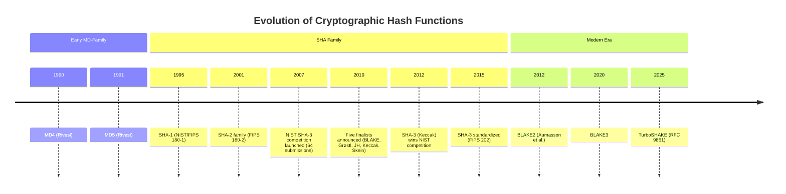

**Architectural Taxonomy:** Modern hash functions fall into three major construction families, each with distinct security and performance characteristics:

| Family | Core construction idea | Representative algorithms | Primary strength | Primary caution |
| --- | --- | --- | --- | --- |
| **Merkle-Damgård** (1989) | Sequentially iterates a compression function over padded message blocks | MD5, SHA-1, SHA-2 | Simple, well-studied, efficient on conventional CPUs | Final digest exposes the chaining state, enabling length-extension attacks in naive keyed uses |
| **Sponge** (2007) | Alternates absorb and squeeze phases over a large permutation state split into rate and capacity | SHA-3, SHAKE, TurboSHAKE, KangarooTwelve | Hidden capacity blocks state-reuse attacks and enables native XOF output | Typically trades some raw throughput for a larger permutation-oriented design |
| **Tree / HAIFA** (2008+) | Hardens iteration with counters/domain separation and, in tree modes, hashes chunks in parallel before combining parents | BLAKE2, BLAKE3 | Parallelism, SIMD-friendly performance, and better structural defenses than classic Merkle-Damgård | Security and performance depend more heavily on the exact mode shape than in a single linear chain |

**How Each Architecture Processes Data:** The taxonomy above classifies *what* each family provides. The diagram below shows *how* each one transforms input into output — the fundamental data flow that determines security properties.

```mermaid
---
config:
  flowchart:
    nodeSpacing: 25
    rankSpacing: 30
---
flowchart TD
    subgraph MD_Flow ["**Merkle-Damgård&nbsp;—&nbsp;Sequential&nbsp;Compression**"]
        direction LR
        MD_IV["`**IV**
        (fixed)`"]
        MD_F1["`**f**
        compress`"]
        MD_F2["`**f**
        compress`"]
        MD_FN["`**f**
        compress`"]
        MD_OUT["`**H(M)**
        = full state`"]
        MD_M1["`M₁`"]
        MD_M2["`M₂`"]
        MD_MN["`Mₙ‖pad`"]

        MD_IV --> MD_F1 --> MD_F2 --> MD_FN --> MD_OUT
        MD_M1 -.-> MD_F1
        MD_M2 -.-> MD_F2
        MD_MN -.-> MD_FN
    end

    subgraph SP_Flow ["**Sponge&nbsp;—&nbsp;Absorb&nbsp;/&nbsp;Squeeze&nbsp;Permutation**"]
        direction LR
        SP_INIT["`**0¹⁶⁰⁰**
        (zeroed)`"]
        SP_ABS1["`**⊕ + P**
        absorb`"]
        SP_ABS2["`**⊕ + P**
        absorb`"]
        SP_SQ1["`**P**
        squeeze`"]
        SP_OUT["`**H(M)**
        = rate bits
        *(capacity hidden)*`"]
        SP_M1["`M₁`"]
        SP_M2["`M₂`"]

        SP_INIT --> SP_ABS1 --> SP_ABS2 --> SP_SQ1 --> SP_OUT
        SP_M1 -.-> SP_ABS1
        SP_M2 -.-> SP_ABS2
    end

    subgraph TR_Flow ["**Tree&nbsp;—&nbsp;Parallel&nbsp;Chunk&nbsp;Hashing**"]
        direction LR
        TR_C1["`**H**
        chunk₁`"]
        TR_C2["`**H**
        chunk₂`"]
        TR_C3["`**H**
        chunk₃`"]
        TR_C4["`**H**
        chunk₄`"]
        TR_P1["`**H**
        parent`"]
        TR_P2["`**H**
        parent`"]
        TR_ROOT["`**H(M)**
        = root`"]

        TR_C1 --> TR_P1
        TR_C2 --> TR_P1
        TR_C3 --> TR_P2
        TR_C4 --> TR_P2
        TR_P1 --> TR_ROOT
        TR_P2 --> TR_ROOT
    end

    style MD_Flow text-align:left
    style SP_Flow text-align:left
    style TR_Flow text-align:left
    style MD_IV text-align:left
    style MD_OUT text-align:left
    style SP_INIT text-align:left
    style SP_OUT text-align:left
    style TR_ROOT text-align:left
    style MD_F1 text-align:left
    style MD_F2 text-align:left
    style MD_FN text-align:left
    style SP_ABS1 text-align:left
    style SP_ABS2 text-align:left
    style SP_SQ1 text-align:left
    style TR_C1 text-align:left
    style TR_C2 text-align:left
    style TR_C3 text-align:left
    style TR_C4 text-align:left
    style TR_P1 text-align:left
    style TR_P2 text-align:left
```

The key architectural insight: Merkle-Damgård exposes the **full internal state** as output (enabling length-extension attacks), Sponge **hides capacity bits** (making it indifferentiable from a Random Oracle), and Tree hashing enables **parallel computation** with logarithmic proof paths. These structural differences — not algorithmic details — determine which constructions are suitable for which applications.

#### 1.1. The Three Pillars: Pre-image, Second Pre-image, and Collision Resistance

To achieve mathematical rigorousness, cryptography relies on asymptotic complexity theory. Before formalizing security properties, we must define the computational boundaries framing the adversarial models.

**Definition 1.1 (Probabilistic Polynomial Time - PPT):**
An algorithm $\mathcal{A}$ is PPT if it is a randomized Turing machine whose maximum running time is bounded by a polynomial $p(\lambda)$ in the security parameter $\lambda$. In modern cryptography, adversaries are constrained to PPT. This models "feasible computation." Anything requiring exponential time $O(2^\lambda)$ is deemed computationally infeasible.

<details>
<summary><strong>📎 Clarification: Why Cryptography Models Adversaries as PPT Algorithms</strong></summary>

> In cryptographic notation, a PPT adversary is modeled as a randomized classical algorithm
>
> $$\mathcal{A}(1^\lambda; r) \quad \text{with} \quad \text{Time}_{\mathcal{A}}(\lambda, r) \le p(\lambda)$$
>
> for some polynomial $p$. The parameter $\lambda$ controls the security level, and $r$ denotes the adversary's internal random coins. The unary encoding $1^\lambda$ is standard in complexity theory: it indicates that one studies an entire parameterized family of experiments rather than one fixed concrete instance.
>
> ### Operational Reading
>
> A **randomized Turing machine** is the machine-independent abstraction used to represent an efficient classical attacker. The purpose of that abstraction is not to approximate implementation detail, but to make the security claim invariant under programming language, hardware platform, and low-level execution model.
>
> Randomness is included because many efficient procedures in cryptography are not deterministic. Search heuristics, Monte Carlo distinguishers, randomized reductions, sampling-based attacks, and primality-style tests all make internal random choices. The model therefore quantifies over both deterministic and randomized efficient adversaries.
>
> | Formal component | Role in the definition | Cryptographic reading |
> |------------------|------------------------|-----------------------|
> | $1^\lambda$ | Security parameter input | Family of stronger and weaker system instances |
> | $r$ | Internal random tape | Randomized attack strategy |
> | $p(\lambda)$ | Runtime upper bound | Feasible classical resources |
> | Universal quantification over PPT $\mathcal{A}$ | Adversary class | Every efficient classical attack in the model |
>
> ### Why Polynomial Growth Is the Boundary
>
> The core distinction is asymptotic growth with respect to $\lambda$:
>
> | Running cost | Asymptotic class | Interpretation in security definitions |
> |--------------|------------------|----------------------------------------|
> | $\lambda^2$, $\lambda^5$, $\lambda^{20}$ | Polynomial | Must be tolerated by the proof model |
> | $2^{\lambda/3}$, $2^{\lambda/2}$, $2^\lambda$ | Exponential | Treated as infeasible in the asymptotic model |
>
> The security parameter is therefore the formal hardness dial. In deployed systems it is realized by quantities such as digest length, key length, state width, or group size. Writing the adversary bound as a function of $\lambda$ lets cryptography express statements of the form "security improves as the parameter scales," rather than tying the theory to one concrete implementation point.
>
> ### Complexity-Theoretic Placement
>
> The phrase "PPT adversary" is broader than any one decision-problem class. It means an efficient randomized classical algorithm, whether it is being used as a distinguisher, inverter, forger, search procedure, or subroutine inside a reduction. Nearby complexity classes are still useful orientation points:
>
> | Class | Canonical meaning | Relation to PPT usage in cryptography |
> |-------|-------------------|----------------------------------------|
> | **BPP** | Efficient probabilistic decision procedures with bounded two-sided error | Helpful reference point, but narrower than the generic notion of a PPT adversary |
> | **RP** | Efficient randomized decision procedures with one-sided error | Illustrates how randomness can be constrained asymmetrically |
> | **ZPP** | Zero-error randomized computation with polynomial expected time | Shows a stricter correctness regime than bounded-error computation |
>
> The distinction matters because cryptographic adversaries are usually not framed as deciders for languages. They produce witnesses, collisions, forgeries, distinguishing bits, or transcripts. The PPT condition constrains their resources; it does not restrict them to a single output semantics.
>
> ### Representative Patterns
>
> | Pattern | Role of randomness | Relevance to the adversary model |
> |---------|--------------------|----------------------------------|
> | **Miller-Rabin style testing** | Random witness selection | Demonstrates that efficient probabilistic procedures can be substantially more practical than deterministic ones |
> | **Randomized search and restart attacks** | Candidate sampling, restarts, heuristic exploration | Captures realistic cryptanalytic behavior that is neither exhaustive nor purely deterministic |
> | **Randomized reductions** | Random self-reduction or simulation coins | Security proofs themselves often rely on probabilistic transformations |
>
> This is why the model is stated for probabilistic algorithms rather than only deterministic ones: if a scheme were secure only against deterministic attackers, many standard attack strategies and even many proof techniques would fall outside the statement.
>
> ### Scope and Limits of the Model
>
> A theorem that excludes all PPT adversaries says that no efficient **classical** attack succeeds except with negligible probability in the stated experiment. That is already a strong statement, but it is not a complete theory of deployment risk.
>
> | Phenomenon | Why it lies outside the bare PPT statement |
> |------------|--------------------------------------------|
> | Quantum algorithms | Requires a different computational model |
> | Side-channel leakage | Not represented by black-box runtime bounds |
> | Faulty implementations | Engineering defect, not asymptotic complexity behavior |
> | Operational compromise | External to the formal experiment |
>
> For hash functions, this modeling choice is essential. Because a finite digest space necessarily admits collisions, security cannot mean absolute non-existence of bad inputs. It means that finding collisions, pre-images, second pre-images, or usable forgeries should remain infeasible for every adversary whose resources stay within the PPT boundary.

</details><br/>

**Definition 1.2 (Negligible Function):**
A function $\mu: \mathbb{N} \to \mathbb{R}$ is *negligible*, denoted $\text{negl}(\lambda)$, if it approaches zero faster than the inverse of *any* positive polynomial. Formally:

$$\forall c \in \mathbb{N}, \exists \lambda_0 \in \mathbb{N} \text{ such that } \forall \lambda \ge \lambda_0, |\mu(\lambda)| < \frac{1}{\lambda^c}$$

<details>
<summary><strong>📎 Clarification: What Negligible Probability Actually Means in Cryptographic Proofs</strong></summary>

> Negligibility is stronger than ordinary convergence to zero. The useful equivalent test is:
>
> $$\mu(\lambda) \text{ is negligible } \iff \forall c>0,\; \lambda^c \mu(\lambda) \to 0 \text{ as } \lambda \to \infty$$
>
> This reformulation makes the asymptotic meaning more concrete: even after multiplying the adversary's success probability by **any** polynomial penalty factor, the result still vanishes.
>
> ### Growth-Rate Test
>
> The decisive boundary is the distinction between inverse-polynomial decay and genuinely negligible decay:
>
> | Candidate advantage $\mu(\lambda)$ | $\mu(\lambda)\to 0$? | Negligible? | Reason |
> |------------------------------------|----------------------|-------------|--------|
> | $1/\lambda$ | Yes | ❌ No | Already an inverse polynomial |
> | $1/\lambda^{100}$ | Yes | ❌ No | Still only inverse-polynomial decay |
> | $2^{-\lambda/2}$ | Yes | ✅ Yes | Exponential decay dominates every inverse polynomial |
> | $2^{-\lambda}$ | Yes | ✅ Yes | Exponential decay dominates every inverse polynomial |
>
> A quick dominance check makes the threshold explicit:
>
> $$\lambda^{101}\cdot \frac{1}{\lambda^{100}} = \lambda \not\to 0$$
>
> whereas
>
> $$\lambda^{50}\cdot 2^{-\lambda/2} \to 0$$
>
> because exponential decay eventually outruns every polynomial factor.
>
> ### Why Proofs Use This Class
>
> This threshold is built into proof methodology. Security reductions and hybrid arguments routinely lose polynomial factors. If one starts from a bound
>
> $$\text{Adv}_{\mathcal{A}}(\lambda) \le \mu(\lambda)$$
>
> and a reduction incurs polynomial loss
>
> $$\text{Adv}_{\mathcal{B}}(\lambda) \le q(\lambda)\,\mu(\lambda)$$
>
> for some polynomial $q$, then negligibility guarantees that $q(\lambda)\mu(\lambda)$ remains negligible. That closure property is one of the main reasons cryptographic definitions are phrased in this language.
>
> | Proof transformation | Effect on the bound | Safe if the original term is negligible? |
> |----------------------|---------------------|------------------------------------------|
> | Hybrid over $\lambda^3$ steps | Multiply by $\lambda^3$ | Yes |
> | Reduction with $\lambda^{12}$ overhead | Multiply by $\lambda^{12}$ | Yes |
> | Loss by constant factor $2^{20}$ | Multiply by a constant | Yes |
> | Replace by inverse polynomial $1/\lambda^5$ | Structural weakening | No longer negligible in general |
>
> ### Engineering Reading
>
> Negligibility is an **asymptotic classification**, not a direct deployment verdict. A bound may be negligible as a function of $\lambda$ and still be unsatisfactory at a poorly chosen concrete parameter. Conversely, a fixed number such as $2^{-64}$ may be operationally acceptable or unacceptable depending on the threat model, even though a single fixed probability is not itself classified by asymptotic growth.
>
> | Statement | Asymptotic status | Engineering interpretation |
> |-----------|-------------------|----------------------------|
> | $\mu(\lambda)=2^{-\lambda/2}$ | Negligible | Improves rapidly as the parameter scales |
> | $\mu(\lambda)=1/\lambda^{20}$ | Not negligible | May still be tiny at some concrete sizes, but does not support standard asymptotic closure arguments |
> | "Failure probability is $2^{-64}$ at $\lambda=128$" | Not an asymptotic function by itself | Must be judged directly as a concrete risk budget |

</details><br/>

**Definition 1.3 (Concrete vs. Asymptotic Security):**
While theoretical proofs use asymptotic limits ($\text{negl}(\lambda)$), empirical engineering uses **Concrete Security bounds**: A schema is $(t, \varepsilon)$-secure if no adversary running in time $\le t$ can break the scheme with success probability $\ge \varepsilon$. For SHA-256, we target $t$ and $\varepsilon$ combining such that the workload $t / \varepsilon \approx 2^{128}$.

<details>
<summary><strong>📎 Clarification: Why Cryptography Uses Both Asymptotic and Concrete Security Languages</strong></summary>

> The two security languages can be written side by side:
>
> $$\text{Asymptotic:} \qquad \text{Adv}_{\mathcal{S}}(\mathcal{A}) \le \text{negl}(\lambda)$$
>
> $$\text{Concrete:} \qquad \text{Adv}_{\mathcal{S}}^{\le t}(\mathcal{A}) < \varepsilon$$
>
> The first statement classifies security as $\lambda$ grows without bound. The second fixes an actual resource budget $t$ and asks whether any adversary within that budget can achieve success probability at least $\varepsilon$.
>
> ### What Each Language Exposes
>
> The contrast is easiest to see in tabular form:
>
> | Security language | Main question | Typical form | What it suppresses | What it exposes |
> |-------------------|---------------|--------------|--------------------|-----------------|
> | **Asymptotic** | Does security improve correctly as $\lambda$ grows? | $\text{Adv} \le \text{negl}(\lambda)$ | Constants, engineering cost, exact runtime budgets | Structural guarantees, reductions, impossibility boundaries |
> | **Concrete** | What can an adversary do at deployed parameters? | $(t,\varepsilon)$-security | Infinite-family perspective | Actual attack cost, success rate, effective brute-force level |
>
> Neither viewpoint subsumes the other. Asymptotic reasoning is the language of definitions and proofs; concrete reasoning is the language of deployment decisions and security targets.
>
> ### Concrete Interpretation
>
> A useful engineering heuristic is the **effective work factor**
>
> $$W_{\mathrm{eff}} \approx \frac{t}{\varepsilon}$$
>
> which asks what exhaustive-search workload would correspond to an adversary that spends time $t$ and succeeds with probability $\varepsilon$.
>
> In bit-security notation, one often reads
>
> $$W_{\mathrm{eff}} \approx 2^k \qquad \Longleftrightarrow \qquad \text{about } k \text{ bits of concrete security}$$
>
> Example:
>
> | Adversary runtime $t$ | Success probability $\varepsilon$ | Effective work $W_{\mathrm{eff}} \approx t/\varepsilon$ | Informal reading |
> |-----------------------|-----------------------------------|---------------------------------------------------------|------------------|
> | $2^{80}$ | $2^{-32}$ | $2^{112}$ | Roughly 112-bit concrete security |
> | $2^{96}$ | $2^{-32}$ | $2^{128}$ | Roughly 128-bit concrete security |
>
> One can also state the concrete language more explicitly as a resource-bounded supremum:
>
> $$\text{Adv}^{\le t}_{\mathcal{S}}(\lambda) = \sup_{\text{Time}(\mathcal{A})\le t} \text{Adv}_{\mathcal{S}}(\mathcal{A},\lambda)$$
>
> so that $(t,\varepsilon)$-security means $\text{Adv}^{\le t}_{\mathcal{S}}(\lambda) < \varepsilon$ at the chosen parameter.
>
> ### Why Hash Functions Need Both Views
>
> Hash functions make the distinction especially visible:
>
> | Statement | Security language | What it tells the reader |
> |-----------|-------------------|---------------------------|
> | "The family is collision resistant against all PPT adversaries except with negligible probability." | Asymptotic | The definition scales correctly and survives standard proof manipulations |
> | "SHA-256 collision search costs about $2^{128}$ work." | Concrete | The deployed parameter appears out of reach for exhaustive attack |
> | "A reduction loses a factor of $\lambda^8$." | Asymptotic | The theorem may still be valid because negligible bounds absorb polynomial loss |
> | "A system target is at least 128-bit collision strength." | Concrete | The deployment has a stated engineering security margin |
>
> The two languages therefore answer different questions. Asymptotic security tells whether the construction belongs to the right complexity class as parameters scale; concrete security tells whether the instantiated system is plausibly safe at the parameter sizes actually deployed.

</details><br/>

**Definition 1.4 (Hash Function Family):** Formally, a hash function must belong to a **Hash Function Family** $\mathcal{H} = \{H_k : \{0,1\}^* \to \{0,1\}^n\}_{k \in \mathcal{K}}$ indexed by a key $k$ generated based on a security parameter $\lambda$.

<details>
<summary><strong>📎 Clarification: Why Formal Hash Definitions Use Families Rather Than One Fixed Function</strong></summary>

> The fixed-function formulation fails for a simple formal reason. If $H$ is one concrete unkeyed function, then collisions exist:
>
> $$\exists m_1 \neq m_2 \;:\; H(m_1)=H(m_2)$$
>
> Once such a pair exists, there is a constant-size adversary
>
> $$\mathcal{A}_H() \to (m_1,m_2)$$
>
> that merely prints a hardwired collision. The adversary does not need to *find* the collision efficiently during the attack; it only needs to output one. A universal collision-resistance definition over all efficient adversaries therefore collapses for a fixed function.
>
> The family formulation repairs this by randomizing the instance:
>
> $$k \xleftarrow{R} \mathcal{K}, \qquad (m_1,m_2) \xleftarrow{} \mathcal{A}(k)$$
>
> and success is measured relative to the sampled member $H_k$. The attacker must now succeed against the instance presented in the game, not against one globally fixed function for which a collision could have been hardwired in advance.
>
> The contrast can be written as two game templates:
>
> $$\text{Fixed-function world: } \text{Exp}^{\mathrm{cr}}_{H,\mathcal{A}}=1 \iff \big(m_1 \neq m_2 \land H(m_1)=H(m_2)\big),$$
>
> $$\text{Family world: } \text{Exp}^{\mathrm{cr}}_{\mathcal{H},\mathcal{A}}(\lambda)=1 \iff \big(m_1 \neq m_2 \land H_k(m_1)=H_k(m_2)\big), \quad k \xleftarrow{R} \mathcal{K}.$$
>
> In the first experiment, a hardwired witness can trivialize the game. In the second, the adversary must respond to a sampled instance determined only at experiment time.
>
> The parameter $k$ is formal, not operational. It is not asserting that SHA-256 is deployed as a secret keyed primitive. Its role is to make the asymptotic definition logically meaningful by moving from one fixed artifact to an efficiently samplable family of instances.
>
> | Formal setting | Adversary's advantage |
> |----------------|-----------------------|
> | **Fixed function $H$** | Trivialized by a hardwired-collision adversary |
> | **Sampled family member $H_k$** | Measured by the success probability of $\mathcal{A}(k)$ in the security game |
>
> | Practitioner language | Formal cryptographic language |
> |-----------------------|------------------------------|
> | "SHA-256 is a hash function." | "Security is defined over a family $\mathcal{H}=\{H_k\}$." |
> | One named algorithm is the object of discussion. | A sampled instance is the object of the adversarial game. |
> | Collisions are discussed operationally. | Collision resistance is quantified over efficient adversaries against the family. |

</details><br/>

A cryptographically secure hash function must satisfy three distinct security properties, each defending against a different attack scenario. While often conflated, these properties form a strict hierarchy: collision resistance implies second pre-image resistance, which in turn implies pre-image resistance. The converse is not true—a function can resist pre-image attacks while being vulnerable to collisions.

##### 1.1.1. Pre-image Resistance and One-Wayness

**Definition 1.5 (Pre-image Resistance Game):**
For an output $y$ drawn from evaluating the hash function on a uniformly random input, it must be computationally infeasible to find any $x'$ such that $H(x') = y$. We formalize pre-image resistance using a cryptographic game played between a Challenger ($\mathcal{C}$) and a Probabilistic Polynomial-Time (PPT) Adversary ($\mathcal{A}$) given a security parameter $\lambda$:

1. $\mathcal{C}$ samples a key $k \xleftarrow{R} \mathcal{K}$ to select a specific hash function $H_k \in \mathcal{H}$.
2. $\mathcal{C}$ samples a random input $x \xleftarrow{R} \{0,1\}^*$ and computes $y = H_k(x)$.
3. $\mathcal{C}$ gives the public key $k$ and the target $y$ to $\mathcal{A}$.
4. $\mathcal{A}$ runs for polynomial time $p(\lambda)$ and outputs a guess $x'$.
5. $\mathcal{A}$ **wins** if $H_k(x') = y$.

This definition should be read as an **experiment**. The challenger samples the instance, gives the adversary a public challenge, and the game outputs either win or loss depending on whether the adversary produced a valid pre-image. Across the rest of the document, that pattern stays the same even when the property changes: the challenger controls what information is revealed, the adversary gets some freedom to choose outputs, and the definition specifies which event counts as winning.

**Advantage:**
The advantage of the adversary is its probability of winning:

$$\text{Adv}_{\mathcal{H}}^{\text{owf}}(\mathcal{A}) = \Pr[x' \leftarrow \mathcal{A}(k, y) : H_k(x') = y]$$

The hash family is Pre-Image Resistant if for all PPT adversaries $\mathcal{A}$, the advantage is **negligible**: $\text{Adv}_{\mathcal{H}}^{\text{owf}}(\mathcal{A}) \le \text{negl}(\lambda)$.

That advantage expression is not a separate mystery quantity; it is simply the probability that the adversary wins the experiment, taken over all randomness in the game. For pre-image resistance, the target digest is challenger-generated rather than adversary-chosen, so the experiment measures inversion difficulty against randomly sampled instances.

<details>
<summary><strong>📎 Clarification: How to Read a Game-Based Security Definition</strong></summary>

> A game-based definition packages a security claim as an **experiment**. The pre-image game can be written schematically as
>
> $$\text{Exp}^{\mathrm{owf}}_{\mathcal{H},\mathcal{A}}(\lambda)=1 \iff H_k(x')=y$$
>
> where
>
> $$k \xleftarrow{R} \mathcal{K}, \qquad x \xleftarrow{R} \{0,1\}^*, \qquad y := H_k(x), \qquad x' \xleftarrow{} \mathcal{A}(k,y).$$
>
> The security question is therefore reduced to a binary event: does the adversary win the experiment or not?
>
> The experiment flow is:
>
> | Step | Challenger action | Adversary knowledge after the step |
> |------|-------------------|------------------------------------|
> | 1 | Sample $k \xleftarrow{R} \mathcal{K}$ | Public hash instance $H_k$ |
> | 2 | Sample $x \xleftarrow{R} \{0,1\}^*$ and compute $y = H_k(x)$ | Target digest $y$ |
> | 3 | Hand $(k,y)$ to $\mathcal{A}$ | Full public challenge |
> | 4 | Receive guess $x'$ | Candidate pre-image |
> | 5 | Check whether $H_k(x') = y$ | Win / loss outcome |
>
> In later sections, the same structure reappears for second pre-image, collision, and target-collision resistance. What changes is not the idea of a game, but the challenge the adversary receives and the condition required to win.

</details><br/>


This property makes the hash function a **one-way function**: easy to compute in the forward direction ($m \mapsto h$), hard to invert ($h \mapsto m$). The asymmetry is fundamental to cryptography—encryption, digital signatures, and password storage all rely on operations that are tractable in one direction but not the reverse.

The canonical application is **password verification**. Rather than storing passwords in plaintext, systems store $H(\text{password})$. To authenticate, the system computes $H(\text{supplied password})$ and compares it to the stored hash. Even if an attacker steals the database of hashes, they cannot efficiently recover the original passwords—assuming the hash function is pre-image resistant and passwords have sufficient entropy.

##### 1.1.2. Second Pre-image Resistance (SPR)

**Definition 1.6 (Second Pre-image Resistance Game):**
Given a specific input $x_1$, it must be computationally infeasible to find a second, distinct input $x_2 \neq x_1$ such that $H(x_1) = H(x_2)$. We formalize this via a cryptographic game:

1. $\mathcal{C}$ samples key $k \xleftarrow{R} \mathcal{K}$ and target message $x_1 \xleftarrow{R} \{0,1\}^*$.
2. $\mathcal{C}$ provides $(k, x_1)$ to $\mathcal{A}$.
3. $\mathcal{A}$ outputs a second message $x_2$.
4. $\mathcal{A}$ **wins** if $x_1 \neq x_2$ and $H_k(x_1) = H_k(x_2)$.

**Advantage:**

$$\text{Adv}_{\mathcal{H}}^{\text{spr}}(\mathcal{A}) = \Pr[x_2 \leftarrow \mathcal{A}(k, x_1) : x_1 \neq x_2 \land H_k(x_1) = H_k(x_2)] \le \text{negl}(\lambda)$$

<details>
<summary><strong>📎 Clarification: Why Second Pre-image Resistance Is Not the Same as Collision Resistance</strong></summary>

> Second pre-image resistance and collision resistance are often confused because both involve finding two distinct messages with the same digest. The difference lies in **who controls the first message**.
>
> In the second pre-image setting, the adversary is given a specific target message $x_1$ and must produce a distinct partner $x_2$ that collides with it. The target is therefore fixed by the game. In the collision setting, by contrast, the adversary is free to choose both messages. That additional freedom is precisely what enables birthday-type search strategies and lowers the generic work factor from roughly $2^L$ to roughly $2^{L/2}$ for an $L$-bit hash output.
>
> The three related attack models are best compared directly:
>
> | Property | What is fixed for the attacker? | What may the attacker choose? | Generic work factor |
> |----------|----------------------------------|-------------------------------|---------------------|
> | **Pre-image** | Target digest $y$ | Any $x'$ with $H(x')=y$ | $\approx 2^L$ |
> | **Second pre-image** | Target message $x_1$ | Distinct $x_2$ with $H(x_2)=H(x_1)$ | $\approx 2^L$ |
> | **Collision** | Nothing | Both $x_1, x_2$ | $\approx 2^{L/2}$ |
>
> The operational consequence is that second pre-image resistance is the property most naturally aligned with **substitution attacks against an already chosen artifact**. A signed contract, a software release, a transparency-log entry, or an archived document is already fixed. The attacker's problem is not to find any colliding pair in the abstract, but to find a replacement object that collides with that specific target.
>
> This is why the generic security intuition differs even though the algebraic relation $H(x_1)=H(x_2)$ looks superficially similar in both cases. Collision resistance protects against freely engineered collision pairs; second pre-image resistance protects against malicious replacement of a pre-existing object.

</details><br/>

Second pre-image resistance is the natural integrity property for already-fixed artifacts such as signed contracts, software releases, or archived documents: the adversary should not be able to produce a distinct replacement with the same digest.

##### 1.1.3. Collision Resistance (CR) and the Birthday Paradox

**Definition 1.7 (Collision Resistance Game):**
It must be computationally infeasible to uncover *any* two distinct inputs $x_1 \neq x_2$ that produce an identical digest mapping. This is where the theoretical necessity of the Hash Function Family ($\mathcal{H}$) is fully realized:

1. $\mathcal{C}$ samples key $k \xleftarrow{R} \mathcal{K}$ and hands it to $\mathcal{A}$.
2. $\mathcal{A}$ runs freely and outputs a pair of messages $(x_1, x_2)$.
3. $\mathcal{A}$ **wins** if $x_1 \neq x_2$ and $H_k(x_1) = H_k(x_2)$.

**Advantage:**

$$\text{Adv}_{\mathcal{H}}^{\text{cr}}(\mathcal{A}) = \Pr[(x_1, x_2) \leftarrow \mathcal{A}(k) : x_1 \neq x_2 \land H_k(x_1) = H_k(x_2)] \le \text{negl}(\lambda)$$

Because the adversary must succeed for a *randomly chosen* key $k$ (which effectively picks a random permutation member from the family at runtime), the trivial $O(1)$ hardcoded adversary exploit fails.

Unlike second pre-image resistance, the attacker controls both inputs. This flexibility dramatically reduces the work factor via the **Birthday Paradox**: for an $L$-bit hash with $2^L$ possible outputs, a collision is expected after approximately $2^{L/2}$ random evaluations—a square-root reduction that halves the effective security bits. This bound is tight and algorithm-independent.

| Hash Output | Pre-image Security | Collision Security | Status |
|-------------|-------------------|-------------------|--------|
| 128-bit (MD5) | $2^{128}$ | $2^{64}$ | ❌ Broken in practice |
| 160-bit (SHA-1) | $2^{160}$ | $2^{80}$ | ❌ Broken (SHAttered, 2017) |
| 256-bit (SHA-256) | $2^{256}$ | $2^{128}$ | ✅ Secure today |
| 512-bit (SHA-512) | $2^{512}$ | $2^{256}$ | ✅ Post-quantum ready |

A 256-bit hash provides 128-bit collision security—sufficient against all known classical attacks. For post-quantum scenarios, Grover's algorithm reduces an $n$-bit hash's pre-image security to $n/2$ bits, but does not meaningfully undermine the birthday bound. Consequently, a baseline 256-bit hash unifies at a 128-bit quantum security floor for both pre-images and collisions.

<details>
<summary><strong>📖 Prerequisite: The Mathematics of the Birthday Bound</strong></summary>

> The birthday bound emerges from the quadratic growth of **combinations**, not permutations. When we ask "do any two hash outputs collide?", we are counting *unordered pairs*—and with $n$ evaluations, the number of pairs is:
>
> $$\binom{n}{2} = \frac{n(n-1)}{2} = O(n^2)$$
>
> **The classic analogy:** In a room of 23 people, there's a >50% chance that two share a birthday. With 23 people there are $\binom{23}{2} = 253$ pairs, each with a $\frac{364}{365}$ chance of *not* matching:
>
> $$\left(\frac{364}{365}\right)^{253} \approx 0.4995$$
>
> The counterintuitive result comes from underestimating how many pairs exist. **Contrast with targeted search:** asking "does anyone share *my* birthday?" requires ~253 people for 50%—checking only $n$ comparisons, not $\binom{n}{2}$. Collision attacks exploit the quadratic advantage; pre-image attacks don't.
>
> **Formal derivation:** For a hash with $L$-bit output ($d = 2^L$ possible digests), hashing $n$ random messages yields collision probability:
>
> $$P(n) = 1 - \prod_{i=0}^{n-1} \left(1 - \frac{i}{d}\right) \approx 1 - e^{-\frac{n^2}{2d}}$$
>
> Setting $P(n) = 0.5$ gives $n \approx 1.177 \sqrt{d} = 1.177 \times 2^{L/2}$. The constant is typically dropped, yielding the standard birthday bound of $2^{L/2}$.
>
> The **Poisson approximation** provides the intuition: the expected number of collisions among $n$ hashes into $d$ bins is $E[\text{collisions}] \approx \frac{n^2}{2d}$. Setting this to 1 gives $n \approx \sqrt{2d}$.
>
> ```mermaid
> ---
> config:
>     xyChart:
>         width: 520
>         height: 260
> ---
> xychart-beta
>     title "Collision Probability by Hash Size"
>     x-axis ["2³²", "2⁴⁸", "2⁶⁴", "2⁸⁰", "2⁹⁶", "2¹¹²", "2¹²⁸"]
>     y-axis "Collision Probability (%)" 0 --> 100
>     line [0, 0, 39, 100, 100, 100, 100]
>     line [0, 0, 0, 39, 100, 100, 100]
>     line [0, 0, 0, 0, 0, 0, 39]
> ```
>
> **Chart Legend (by line order):** Line 1 = 128-bit hash (MD5) · Line 2 = 160-bit hash (SHA-1) · Line 3 = 256-bit hash (SHA-256)
>
> The chart illustrates the sharp "cliff" behavior of collision probabilities. Each hash size has a critical threshold at its birthday bound ($2^{L/2}$) where collision probability jumps from negligible to near-certain.

</details>


##### 1.1.4. Target Collision Resistance (TCR) and UOWHF

**Definition 1.8 (Target Collision Resistance Game):**
Target Collision Resistance (TCR), also known as the Universal One-Way Hash Function (UOWHF) property (Naor and Yung, 1989), is a critical theoretical relaxation of full collision resistance. Unlike full Collision Resistance where $\mathcal{A}$ runs freely to find *any* collision pair, in the TCR game, the adversary must commit to a target message *before* the hash function key is revealed:

1. $\mathcal{A}_1$ commits to a target message $x_1$ and outputs some state information $st$.
2. $\mathcal{C}$ samples a random key $k \xleftarrow{R} \mathcal{K}$ and provides it to $\mathcal{A}_2$.
3. $\mathcal{A}_2(st, k)$ outputs a second message $x_2$.
4. $\mathcal{A}$ **wins** if $x_1 \neq x_2$ and $H_k(x_1) = H_k(x_2)$.

**Advantage:**

$$\text{Adv}_{\mathcal{H}}^{\text{tcr}}(\mathcal{A}) = \Pr[(x_1, st) \leftarrow \mathcal{A}_1(), k \xleftarrow{R} \mathcal{K}, x_2 \leftarrow \mathcal{A}_2(st, k) : x_1 \neq x_2 \land H_k(x_1) = H_k(x_2)] \le \text{negl}(\lambda)$$

<details>
<summary><strong>📎 Clarification: Why Target Collision Resistance Is Weaker Than Full Collision Resistance Yet Still Useful</strong></summary>

> Target Collision Resistance (TCR) changes the order of play. The adversary must first commit to a target message $x_1$ and only later learns which family member $H_k$ will be used. This removes the central freedom exploited by ordinary collision search: the ability to adapt both sides of the collision after seeing the concrete function instance.
>
> The distinction is easiest to see at the experiment level:
>
> $$\text{CR: } k \xleftarrow{R} \mathcal{K}, \quad (x_1,x_2) \xleftarrow{} \mathcal{A}(k)$$
>
> $$\text{TCR: } (x_1,st) \xleftarrow{} \mathcal{A}_1(), \quad k \xleftarrow{R} \mathcal{K}, \quad x_2 \xleftarrow{} \mathcal{A}_2(st,k)$$
>
> In full collision resistance, both sides of the pair may be chosen after the instance is known. In TCR, one side is committed before the instance is sampled.
>
> That change is enough to eliminate the generic birthday strategy. Birthday attacks rely on filling the output space with many candidate hashes and then looking for any pair that collides. TCR denies the attacker one of those degrees of freedom, because one message is fixed before the relevant hash instance is known. The problem therefore behaves more like a targeted search than an unrestricted pair search.
>
> The comparison with full collision resistance is:
>
> | Property | When is $x_1$ chosen? | When is $k$ revealed? | Can the attacker adapt both sides of the collision? | Generic birthday attack? |
> |----------|------------------------|------------------------|------------------------------------------------------|--------------------------|
> | **Collision resistance** | After seeing the instance | Before search | Yes | ✅ Yes |
> | **Target collision resistance** | Before seeing the instance | After $x_1$ is fixed | No | ❌ No |
>
> TCR is formally weaker than full collision resistance because a scheme may resist target collisions while still admitting efficiently findable unrestricted collisions. Even so, it is not a merely academic weakening. It captures the security needed in several contexts where the attacker faces a committed object rather than a blank search space, and it plays a central role in theoretical constructions because it can be obtained from assumptions weaker than those currently known to imply full collision-resistant hashing.
>
> The importance of TCR in the literature is therefore twofold: it isolates a meaningful security notion for targeted attacks, and it occupies a theoretically more accessible position in the landscape of assumptions and constructions.

</details><br/>

Naor and Yung's theoretical result is especially important here: UOWHFs can be constructed from *any* standard one-way function, whereas it remains unknown whether full Collision-Resistant Hash Functions (CRHFs) admit an equally general construction.

##### 1.1.5. Which Property Matters for Which Application?

The formal properties above are often taught as a flat checklist. Real systems do not consume them symmetrically. A signed PDF, a password verifier, a Merkle tree root, a transcript hash inside a key exchange, and a keyed MAC tag can all use "a hash function" while depending on fundamentally different security assumptions.

The engineering mistake to avoid is **property substitution**: assuming that because a hash still looks strong under one metric (for example, no practical pre-image attack), it remains safe for every deployment. MD5 and SHA-1 demonstrated the opposite. Once collision resistance failed, signature schemes, certificates, and commitments collapsed long before anyone found practical pre-images.

| Use Case | Primary Property | Why It Matters | If You Choose the Wrong Property | Safe Default |
|----------|------------------|----------------|----------------------------------|--------------|
| **Digital signatures / certificates** | **Collision resistance** | The signer authorizes `H(M)`, so two messages with the same digest enable document or certificate forgery | Chosen-prefix collisions let attackers transplant valid signatures onto malicious payloads | SHA-256 / SHA-384 / SHA-512, SHA3-256/512 |
| **Signed documents / file integrity against substitution** | **Second-preimage resistance** | The attacker is handed one fixed target and wants a distinct replacement with the same digest | A "different but same hash" file can silently replace the intended one | SHA-256 or stronger |
| **Password storage** | **Pre-image resistance is necessary but insufficient** | Attackers work offline with many guesses and many targets; economics and amortization dominate | Fast hashes remain mathematically one-way yet operationally cheap to brute-force on GPUs/ASICs | Argon2id with per-user salts |
| **API authentication / session tokens / webhooks** | **Keyed PRF/MAC security** | Authenticity depends on the key separating valid tags from forgeries | Raw `H(K \| M)` can fail even when the hash has no practical collisions or pre-images | HMAC-SHA-256, KMAC, BLAKE2 keyed mode |
| **Merkle trees / transparency logs / content-addressed storage** | **Collision resistance + domain separation** | Internal nodes and leaves must not be confusable, and root collisions break global integrity | Structural ambiguity or collisions can let one tree authenticate another payload set | SHA-256 with explicit leaf/node prefixes, SHA3-256, BLAKE3 |
| **Commitments** | **Binding = collision resistance; hiding = randomized encoding** | The committer must not open one commitment two ways, and the commitment must not leak the message | Deterministic `H(m)` has no hiding; weak collision resistance breaks binding | `H(r \| m)` with SHA-3 or HMAC-based commitments |
| **Transcript hashing / Fiat-Shamir / protocol binding** | **Domain separation + ROM-style reasoning** | The hash becomes part of the protocol state, challenge generation, or key schedule | Cross-protocol reuse or ambiguous framing can create replay, downgrade, or proof-substitution vulnerabilities | Transcript-bound SHA-256/HKDF or cSHAKE/SHAKE with explicit labels |
| **Hash-to-curve / XOF expansion / deterministic sampling** | **Uniform expansion + domain separation** | The hash output must be interpreted as structured randomness without cross-domain collisions | Reusing a bare hash across contexts can bias sampling or enable cross-protocol substitution | RFC 9380 `expand_message_xmd` / `expand_message_xof`, cSHAKE |

<details>
<summary><strong>📎 Clarification: Why "Use a Hash Function" Is Not a Complete Security Requirement</strong></summary>

> The application matrix is intended to correct a common engineering simplification: treating a cryptographic hash as a single interchangeable security object whose properties transfer uniformly across all deployments.
>
> A more precise engineering specification has the form:
>
> $$\text{deployment requirement} = \text{property} + \text{construction} + \text{framing / domain separation}$$
>
> In practice, systems consume different aspects of the primitive. A digital signature depends critically on collision resistance because the signer authenticates a digest that must not correspond to two attacker-chosen documents. Password storage depends on pre-image resistance only in a very incomplete sense; the dominant issue is offline guessing cost, which is why memory-hardness and salting matter more than bare one-wayness. API authentication depends not on unkeyed hash security alone but on a keyed construction that prevents forgery under an adversarial message model.
>
> The phrase **property substitution** names the resulting failure mode. An engineer observes that a primitive remains strong under one metric and then incorrectly treats that surviving property as a substitute for the property actually required by the deployment. MD5 and SHA-1 are the canonical warnings: practical pre-image attacks remained out of reach long after collision attacks had already destroyed their suitability for signatures and certificates.
>
> A second lesson follows from the same table: wrappers and framing are often as important as the underlying digest algorithm. HMAC, KMAC, transcript labeling, tuple framing, leaf/node prefixes, and XOF domain separation all exist because "the hash function is strong" is not, by itself, enough to prevent protocol confusion or state-reuse attacks.
>
> The broader principle is that a secure system should be specified in terms of the **exact property and construction** it requires, not merely in terms of a familiar hash name.
>
> | Shorthand requirement | Why it is incomplete | Proper requirement form |
> |-----------------------|----------------------|-------------------------|
> | "Use SHA-256" | Names only the digest algorithm | Specify the consumed property and wrapper, e.g. `HMAC-SHA-256` or transcript-bound SHA-256 |
> | "Use a hash for passwords" | Ignores offline guessing economics | Specify a memory-hard password hash such as Argon2id with salts |
> | "Hash the transcript" | Ignores framing ambiguity | Specify labeled / domain-separated transcript hashing |

</details>

##### 1.1.6. The Avalanche Effect and Diffusion

A crucial property not captured by the three pillars is the **avalanche effect**: changing a single bit of the input should change approximately half of the output bits, and these changes should appear random and unpredictable.

**Demonstration with SHA-256:**

| Input | SHA-256 Digest (hex, truncated) |
|-------|--------------------------------|
| `hello` | `2cf24dba5f...` |
| `hellp` | `e8b2190b27...` (completely different) |
| `Hellp` | `e0bc614e18...` (completely different again) |

A one-bit change in the input (the final 'o' → 'p') produces a completely unrelated output. This diffusion property ensures that small input changes cascade through the hash function's internal state, preventing attackers from predicting how modifications affect the output.

The avalanche effect is achieved through repeated application of mixing operations: rotations, XORs, modular additions, and nonlinear Boolean functions. Each round of a hash function's compression function increases diffusion, and after sufficient rounds, every input bit has influenced every output bit with probability approaching $\frac{1}{2}$. This is why hash functions have many rounds (64 for SHA-256, 80 for SHA-1)—each round adds another layer of mixing that makes the relationship between input and output more complex and less predictable.

<details>
<summary><strong>🔧 Deep Dive: The Strict Avalanche Criterion (SAC)</strong></summary>

> The avalanche effect sounds intuitive—"flip one bit, change half the outputs"—but cryptographers need formal, testable definitions. The **Strict Avalanche Criterion (SAC)** provides this rigor.
>
> A function $f: \{0,1\}^n \rightarrow \{0,1\}^m$ satisfies SAC if: for any input $x$ and any output bit position $j$, flipping any single input bit $i$ changes output bit $j$ with probability exactly $\frac{1}{2}$:

$$
\Pr[f(x)_{j} \neq f(x \oplus e_i)_{j}] = \frac{1}{2}
$$

> where $e_i$ is a unit vector with a 1 only at position $i$.
>
> **What this means:** If you flip input bit 7, then output bit 0 should change 50% of the time, output bit 1 should change 50% of the time, and so on—with *no correlation* between which bits change. The output changes as if by random coin flip, not in a predictable pattern.
>
> ### Why "Strict" Matters
>
> The original **avalanche criterion** only required that *approximately* half the output bits change. A function could pass this test while having exploitable structure—for example, always flipping bits 0–63 together as a block.
>
> SAC is stricter: *each* output bit must flip independently with probability $\frac{1}{2}$. This prevents:
>
> - **Bit clustering:** Correlated output changes that reveal input patterns
> - **Linear trails:** Predictable relationships between specific input and output bits
> - **Statistical biases:** Outputs that deviate from uniform random distribution
>
> ### Testing SAC in Practice
>
> Cryptographers validate hash functions using statistical tests:
>
> 1. **Sample random inputs:** Generate thousands of message pairs $(x, x \oplus e_i)$
> 2. **Count bit flips:** For each output bit $j$, tally how often $f(x)_j \neq f(x \oplus e_i)_j$
> 3. **Chi-squared test:** Verify the count is consistent with $p = 0.5$
>
> A hash function that produces 48% or 52% flips passes; one producing 60% or 30% fails—indicating exploitable bias.
>
> ### SAC and Differential Cryptanalysis
>
> SAC directly thwarts differential attacks. If $f$ satisfies SAC, then for any input difference $\Delta$, the output difference $f(x \oplus \Delta) \oplus f(x)$ is uniformly distributed across all $2^m$ possible values. The attacker gains no statistical advantage:
>
> $$\Pr[f(x \oplus \Delta) \oplus f(x) = \delta] = \frac{1}{2^m}$$
>
> for all differences $\Delta \neq 0$ and all output patterns $\delta$.
>
> **When SAC fails:** MD5's broken round functions don't satisfy SAC. Specific input differences produce specific output differences with probability $2^{-20}$ instead of $2^{-128}$—the statistical bias Wang exploited to find collisions.

</details>

#### 1.2. Random Oracle Boundaries

##### 1.2.1. Hard-Core Predicates

A fundamental theorem (Goldreich-Levin) bridges one-wayness to actual unpredictability over individual bits: If $f$ is a one-way function, there exists a predicate $h$ such that predicting a single bit $b = h(x)$ from $f(x)$ is just as hard as fully inverting $f$. If a PPT algorithm guesses $b$ with a non-negligible advantage over purely random guessing ($1/2$), a hybrid reduction argument can use that algorithm to invert $f$ entirely. Many upper-layer constructs (Pseudorandom Generators) build from hard-core predicates rather than naked OWFs.

<details>
<summary><strong>📖 Prerequisite: What a Hard-Core Predicate Contributes Beyond One-Wayness</strong></summary>

> One-wayness says that recovering the full secret input $x$ from $f(x)$ is hard. It does **not** automatically say that every partial piece of information about $x$ is hidden. A badly behaved one-way function could, in principle, remain hard to invert while still leaking some structured fragment of the input.
>
> A **hard-core predicate** addresses that gap. It is a single bit-valued function $h(x)$ with the property that, given only $f(x)$, no efficient adversary can predict $h(x)$ with non-negligible advantage over random guessing. The Goldreich-Levin theorem shows that every one-way function possesses such a predicate.
>
> Formally, the prediction requirement has the shape
>
> $$\Pr[\mathcal{A}(f(x)) = h(x)] \le \frac{1}{2} + \text{negl}(\lambda)$$
>
> for every PPT adversary $\mathcal{A}$.
>
> In the Goldreich-Levin setting, the canonical hard-core bit is derived from an auxiliary random mask $r$:
>
> $$h_r(x) = \langle r, x \rangle \bmod 2$$
>
> and the theorem informally says that if an efficient adversary could predict $\langle r, x \rangle$ from $(f(x), r)$ with non-negligible advantage, that predictor could be converted into an inverter for $f$. The hard-core predicate is therefore not an arbitrary bit of $x$; it is a carefully constructed predicate whose predictability would contradict one-wayness.
>
> This result matters because cryptography often needs **pseudorandom-looking output**, not merely inversion resistance. Key derivation, pseudorandom generation, challenge derivation, and several proof techniques rely on the ability to extract bits that remain computationally unpredictable even when a related public value is known.
>
> The theorem should not be read as saying that every obvious bit of $x$ is hard-core. The point is existential and constructive: there exists a carefully defined predicate derived from the input whose prediction is as hard as inversion. That bridge from one-wayness to unpredictability is one of the reasons one-way functions occupy such a central place in complexity-theoretic cryptography.
>
> | Security notion | Informal question | Typical success condition |
> |-----------------|-------------------|---------------------------|
> | **One-wayness** | Can the adversary recover $x$ from $f(x)$? | Output some valid pre-image |
> | **Hard-core unpredictability** | Can the adversary predict one designated bit of $x$ from $f(x)$? | Beat random guessing by non-negligible advantage |
>
> | Object in the theorem | Role |
> |------------------------|------|
> | $f(x)$ | Public one-way image |
> | $r$ | Public random selector |
> | $\langle r, x \rangle \bmod 2$ | Hard-core bit tied to $x$ |
> | Predictor for $h_r(x)$ | Candidate algorithm that would violate one-wayness if too successful |

</details>

##### 1.2.2. The Random Oracle Model (ROM)

When cryptographic engineers design complex identity protocols, proving their security against computationally bounded adversaries using *heuristic* hash functions (like SHA-2) is notoriously difficult. Instead, theoreticians retreat to the **Random Oracle Model (ROM)** (Bellare and Rogaway, 1993).

**The Model:** Under the ROM, the concrete analytical hash function $H$ is replaced by a black-box *Random Oracle* $\mathcal{RO}$. 
- The Oracle maintains an internal state table of previous queries.
- When presented with a query $x$, the Oracle checks if $x$ is in its table.
- If $x$ exists, it returns the previously assigned target value $y$.
- If $x$ is new, it uniformly samples a truly random value $y \xleftarrow{R} \{0,1\}^n$, stores the tuple $(x, y)$, and returns $y$.

**Why it matters:** The ROM lets a proof treat the hash interface as an ideal randomized oracle with perfect consistency and uniformity. A protocol proven secure in the ROM has therefore survived analysis under an ideal-hash abstraction. This is strong evidence about the protocol logic, but it is not by itself a universal instantiation theorem for every concrete hash construction.

<details>
<summary><strong>📎 Clarification: What the Random Oracle Model Does and Does Not Prove</strong></summary>

> The Random Oracle Model is an **idealization**. It does not claim that SHA-256, SHA-3, or any real hash function literally behaves as a uniformly random function. It says instead: suppose the protocol had access to a perfect oracle that returns independently random outputs while remaining consistent on repeated queries. Under that assumption, can the protocol be proven secure?
>
> The oracle interface is:
>
> $$\mathcal{RO}(x)=
\begin{cases}
T[x] & \text{if } x \in \text{dom}(T) \\
y \xleftarrow{R} \{0,1\}^n,\; T[x]\gets y,\; y & \text{otherwise}
\end{cases}$$
>
> | Query case | Oracle behavior | Security intuition |
> |------------|-----------------|--------------------|
> | Repeated query $x$ | Return stored value $T[x]$ | The oracle behaves like a deterministic function on repeated inputs |
> | Fresh query $x$ | Sample new uniform $y$ and store $(x,y)$ | Outputs have no exploitable structure beyond consistency |
>
> ### What the Model Buys
>
> The value of the model is separation of concerns. It lets the proof treat the hash interface as an ideal black box and focus on protocol structure: message flow, challenge binding, replay resistance, transcript dependence, and adversarial query strategies. A ROM proof therefore shows that the protocol logic is sound **if** the hash behaves like an ideal oracle for the purposes relevant to the proof.
>
> That conditional form can be summarized as
>
> $$\text{secure protocol in }(\mathcal{RO}\text{-world}) \;\not\!\!\Longrightarrow\; \text{secure under every concrete } H,$$
>
> but rather
>
> $$\text{secure protocol in }(\mathcal{RO}\text{-world}) \;\Longrightarrow\; \text{protocol logic survives ideal-hash analysis.}$$
>
> ### What the Model Does Not Buy
>
> This is useful but limited. A ROM proof does not automatically justify substituting an arbitrary concrete hash function into the protocol. The substitution step requires additional reasoning, because a real construction may expose structure that the ideal oracle forbids. Length extension, state exposure, biased outputs, and algebraic distinguishers are precisely the kinds of non-ideal behaviors that can invalidate naive instantiation.
>
> The safest way to read a ROM theorem is therefore conditional: the protocol is secure in the ideal oracle world, and any real-world break must arise either from the gap between the concrete hash and the ideal oracle abstraction or from assumptions outside the model. The theorem is strong evidence about protocol design, but it is not the same thing as a full instantiation theorem for every deployed hash primitive.
>
> | Question | ROM answer | What still requires separate analysis |
> |----------|------------|----------------------------------------|
> | Is the protocol logic secure if the hash behaves ideally? | ✅ Yes, this is the point of the model | — |
> | Does a ROM proof automatically validate SHA-256 / SHA-3 instantiation? | ❌ No | Concrete structural properties of the chosen hash construction |
> | Can the proof ignore transcript framing and oracle-query strategy? | ❌ No | Those are usually the main objects of the ROM proof itself |

</details>

##### 1.2.3. Indifferentiability: Can a Construction Replace a Random Oracle?

The Random Oracle Model assumes a perfect black-box hash. But real hash functions are *constructions* built from smaller primitives—so a critical question arises: **can a given construction safely replace a Random Oracle in any protocol proven secure in the ROM?**

The **indifferentiability framework** (Maurer, Renner, and Holenstein, 2004) formalizes this. A construction $\mathcal{C}$ using an ideal primitive $P$ is **indifferentiable** from a Random Oracle $\mathcal{RO}$ if no efficient distinguisher $\mathcal{D}$ can tell the two apart—even when given access to the internal primitive:

$$\text{Adv}^{\text{indiff}}_{\mathcal{C},\mathcal{RO}}(\mathcal{D}) = \left| \Pr[\mathcal{D}^{\mathcal{C},P} = 1] - \Pr[\mathcal{D}^{\mathcal{RO},S} = 1] \right| \leq \text{negl}(\lambda)$$

where $S$ is a simulator that mimics the internal primitive's interface without access to $\mathcal{RO}$'s internal state.

**The critical distinction for hash architectures:**

| Construction | Indifferentiable from RO? | Why |
|--------------|--------------------------|-----|
| **Merkle-Damgård** (SHA-2) | ❌ No | Output exposes entire internal state → length-extension attack provides a trivial distinguisher |
| **Sponge** (SHA-3) | ✅ Yes | Capacity bits remain hidden; provably indifferentiable with bound $\mathcal{O}(q^2/2^c)$ where $q$ = queries, $c$ = capacity |
| **HMAC over MD** | ✅ Safe keyed wrapper | Double-wrapping hides the intermediate state and blocks the direct length-extension-based distinguisher that breaks raw Merkle-Damgård uses |

**Practical consequence:** Sponge-based hashes are the cleanest native fit for ROM-style protocol designs because hidden capacity blocks the trivial state-exposure distinguisher. Raw Merkle-Damgård deployments require more care: protocols must be analyzed for state-recovery consequences, and keyed uses should normally be wrapped in HMAC rather than exposed directly.

<details>
<summary><strong>📎 Clarification: Why Indifferentiability Is Stronger Than "Looks Random"</strong></summary>

> The indifferentiability experiment compares two worlds:
>
> $$\text{Real world: } \mathcal{D}^{\mathcal{C},P} \qquad\qquad \text{Ideal world: } \mathcal{D}^{\mathcal{RO},S}$$
>
> The goal is to make these two interactive systems computationally indistinguishable. This is stronger than ordinary output pseudorandomness because the distinguisher is not restricted to observing final hash outputs; it may also query the lower-level primitive interface.
>
> | Comparison notion | What the adversary sees | Why it is weaker or stronger |
> |-------------------|-------------------------|------------------------------|
> | Output pseudorandomness | Only hash outputs or oracle replies | Says little about exposed internal interfaces |
> | Indifferentiability | Construction plus primitive-side interface | Tests whether the whole construction can replace a random oracle compositionally |
>
> ### Why the Simulator Matters
>
> That stronger interface matters for hash constructions. A real hash is built from components such as permutations, compression functions, and feedforward steps. If access to those components exposes transcripts that could not be reproduced in an ideal random-oracle world, then the construction is not a sound generic substitute for the oracle abstraction.
>
> The simulator $S$ is therefore essential. It must emulate the primitive-side view in a way that remains consistent with the ideal random oracle. Failure of such a simulation means the construction leaks structural information absent from the ideal model.
>
> One can read the condition schematically as
>
> $$\forall \mathcal{D}\in\mathrm{PPT},\quad \left|\Pr[\mathcal{D}^{\mathcal{C},P}=1]-\Pr[\mathcal{D}^{\mathcal{RO},S}=1]\right| \le \text{negl}(\lambda).$$
>
> The simulator is what makes this a statement about **replaceability** rather than about isolated output statistics.
>
> ### Why Hash Constructions Diverge Here
>
> This is exactly where Merkle-Damgård and sponge constructions diverge. Merkle-Damgård exposes its final chaining state, enabling continuation behavior inconsistent with a true random oracle. Sponge constructions with hidden capacity do not expose enough internal state to support the same distinguisher.
>
> | World | External object | Auxiliary interface seen by distinguisher |
> |-------|-----------------|-------------------------------------------|
> | **Real** | Construction $\mathcal{C}$ | Access to primitive $P$ |
> | **Ideal** | Random oracle $\mathcal{RO}$ | Access to simulator $S$ |
>
> | Security question | If the answer is "no" |
> |-------------------|-----------------------|
> | Can $\mathcal{D}$ tell these worlds apart with non-negligible advantage? | The construction is not a faithful generic replacement for the ideal oracle abstraction |

</details>

#### 1.3. The Merkle-Damgård Iterated Construction

The **Merkle-Damgård (MD) construction**, proposed independently by Ralph Merkle and Ivan Damgård in 1989, solved a fundamental problem: how to build a hash function that accepts arbitrary-length inputs from a fixed-size primitive. All legacy hash functions—MD5, SHA-1, SHA-256, SHA-512—use this architecture.

The key insight is **iterated hashing**: instead of designing a monolithic function that handles all input sizes, design a **compression function** $f$ that processes fixed-size blocks, then iterate it over the entire message.

##### 1.3.1. Compression Functions and Fixed-Size Processing

**Definition 1.9 (Compression Function):**
A compression function $f$ takes two inputs: a fixed-size recursive **chaining value** (internal state) and a fixed-size **message block**, producing a new chaining value of the identical fixed size:

$$f: \{0,1\}^n \times \{0,1\}^b \rightarrow \{0,1\}^n$$

where $n$ is the state size (e.g., 256 bits for SHA-256) and $b$ is the block size (512 bits for SHA-256). The compression function operates as the cryptographic core.

<details>
<summary><strong>📎 Clarification: Why Arbitrary-Length Hashing Is Built from a Fixed-Size Compression Primitive</strong></summary>

> A compression function is the local workhorse of an iterated hash design. It is called "compression" not because the message becomes shorter in an information-theoretic sense, but because a large structured input pair $(\text{state}, \text{block})$ is folded back into a fixed-size state.
>
> The **chaining value** is the running summary carried from one message block to the next. It should be read as the internal digest-in-progress. The first chaining value is the fixed initialization vector $IV$; each subsequent one is the output of the previous compression call.
>
> This architecture solves the arbitrary-length input problem modularly. Instead of designing one enormous function that accepts every possible message length directly, the designer builds a fixed-input primitive and iterates it over successive blocks. The overall hash therefore inherits its structure from repeated local state transitions:
>
> $$H_i = f(H_{i-1}, M_i)$$
>
> The distinction between the **state size** $n$ and the **block size** $b$ is also important. The message may enter in chunks larger than the state being carried forward. Security properties of the overall construction depend on how this repeated state update behaves, not merely on the presence of many rounds inside the primitive itself.
>
> | Component | Formal type | Role in the iterated construction |
> |-----------|-------------|------------------------------------|
> | Chaining value $H_{i-1}$ | $\{0,1\}^n$ | Carries the internal digest state forward |
> | Message block $M_i$ | $\{0,1\}^b$ | Supplies the next chunk of input material |
> | Compression function $f$ | $\{0,1\}^n \times \{0,1\}^b \to \{0,1\}^n$ | Updates the internal state |
> | Final digest $H_L$ | $\{0,1\}^n$ | Publishes the terminal state or a projection of it |

</details><br/>

**Definition 1.10 (The Davies-Meyer Construction):**
The most ubiquitous compression function design (utilized by MD5, SHA-1, and SHA-2) constructs $f$ from an underlying block cipher $E$:

$$f(H_{i-1}, M_i) = E_{M_i}(H_{i-1}) \oplus H_{i-1}$$

The message block $M_i$ acts parametrically as the cipher key, encrypting the current state $H_{i-1}$, and subsequently XORing the result back with the initial state input. This explicit feedforward operation converts an invertible permutation into a non-invertible mixing function, guaranteeing one-wayness even if the block cipher $E$ exhibits ideal bijectivity.

<details>
<summary><strong>📎 Clarification: How Davies-Meyer Turns a Block Cipher into a Hash Compression Step</strong></summary>

> Davies-Meyer is a constructional bridge between two different kinds of primitive. A block cipher is designed as a keyed permutation: once the key is fixed, encryption is bijective. A hash compression function, by contrast, must serve as a one-way state update inside an iterated digest.
>
> The construction repurposes the message block $M_i$ as the effective cipher key and feeds the previous chaining value $H_{i-1}$ through the resulting permutation. By itself, that would still leave an invertible mapping relative to the chosen key. The crucial additional step is the **feedforward XOR** with the original state. That feedforward destroys the simple permutation structure and yields a function suitable for one-way state evolution.
>
> The intuition is architectural rather than merely algebraic. Davies-Meyer does not ask the block cipher to become a hash on its own. It uses the cipher as a highly nonlinear mixing component inside a larger update rule whose purpose is to carry forward a compact digest state over many message blocks.
>
> This is why the formula matters historically. It explains how MD-style designs could be built from well-understood symmetric primitives while still pursuing one-wayness and collision resistance at the level of the iterated construction.
>
> | Object | Formal behavior | Why it is insufficient on its own |
> |--------|-----------------|-----------------------------------|
> | Block cipher $E_K(\cdot)$ | Keyed permutation | Invertible once $K$ is known |
> | Raw keyed update $E_{M_i}(H_{i-1})$ | Message-as-key permutation step | Still structurally invertible relative to the chosen block |
> | Davies-Meyer step $E_{M_i}(H_{i-1}) \oplus H_{i-1}$ | Feedforward compression update | Breaks direct permutation structure and supports one-way state evolution |

</details><br/>

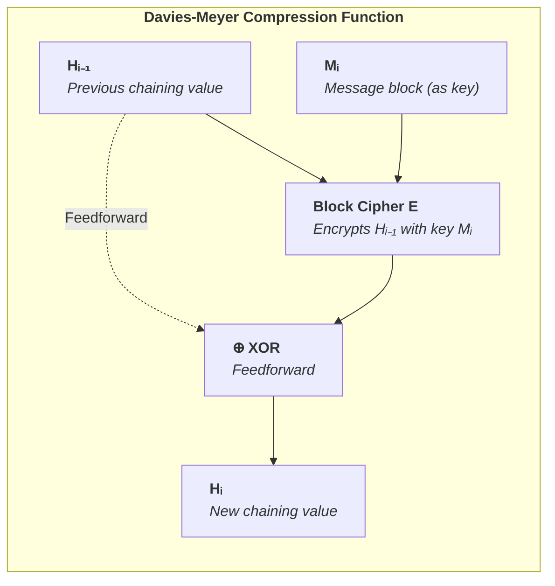

<details>
<summary><strong>🔧 Deep Dive: Why Davies-Meyer Needs the XOR Feedforward</strong></summary>

> The Davies-Meyer construction adds a seemingly minor detail: XOR the block cipher output back with the input state. This $\oplus H_{i-1}$ operation isn't optional—it's what makes the compression function one-way.
>
> Block ciphers like AES are **bijections**: every input maps to exactly one output, and every output maps back to exactly one input. Given the key $K$ and ciphertext $C$, you can always recover the plaintext:
>
> $$D_K(E_K(P)) = P$$
>
> This invertibility is essential for encryption—you need to decrypt messages. But for hash functions, it compromises one-way properties.
>
> ### What Happens Without Feedforward
>
> Suppose we define compression *without* the XOR:
>
> $$f'(H_{i-1}, M_i) = E_{M_i}(H_{i-1})$$
>
> An attacker who observes the hash output can **invert** the compression:
>
> 1. Intercept final hash $H_n$
> 2. Identify the last message block $M_n$ (it's in the message!)
> 3. Compute: $H_{n-1} = D_{M_n}(H_n)$
> 4. Repeat backwards through all blocks
> 5. Recover the original IV—and verify any preimage
>
> The hash function becomes trivially invertible. Pre-image resistance collapses entirely.
>
> ### How XOR Breaks Invertibility
>
> With the feedforward:
>
> $$f(H_{i-1}, M_i) = E_{M_i}(H_{i-1}) \oplus H_{i-1}$$
>
> Inversion requires solving:
>
> $$H_{i-1} = D_{M_i}(H_i \oplus H_{i-1})$$
>
> But $H_{i-1}$ appears on *both sides* of the equation! You need to know $H_{i-1}$ to compute $D_{M_i}$, but you need $D_{M_i}$ to find $H_{i-1}$. This circular dependency makes inversion intractable.
>
> ### Mathematical Perspective
>
> The XOR converts the compression function from a **permutation** (invertible) to a **general function** (not necessarily invertible). For any output $y$ and key $K$, there may be:
>
> - Zero inputs $x$ such that $E_K(x) \oplus x = y$ (no preimage exists)
> - Multiple inputs $x$ such that $E_K(x) \oplus x = y$ (many preimages exist)
>
> The function is no longer bijective; it's a **one-way mixing** of the cipher output and input state.
>
> ### Historical Context
>
> Davies identified this construction in 1984 while working on hash functions at IBM. The insight was that block ciphers, designed for symmetric encryption, could be repurposed for hashing—but only with a modification that breaks their inherent invertibility. The XOR "feedforward" is that modification.

</details>

##### 1.3.2. Padding and Length Encoding

**Definition 1.11 (Merkle-Damgård Padding & State Transition):**
Given a target hash scheme initialized by a fixed Initial Value ($IV \in \{0,1\}^n$), an arbitrary message $M \in \{0,1\}^*$ undergoes deterministic algorithmic padding $\text{pad}(M)$:
1. Append an identifying `1` bit separator.
2. Append exactly $k$ zero bits such that the running length equates to $b - 64 \pmod b$.
3. Append a 64-bit string encoding the original message length $|M|$ prior to padding.
The fully padded payload $M'$ is sectioned into equal $b$-bit blocks $M_1, M_2, \ldots, M_L$. The state transitioning functions recursively:
- $H_0 = IV$
- $H_i = f(H_{i-1}, M_i)$ for $i = 1, \dots, L$
- The final output digest maps to $H_L$.

<details>
<summary><strong>📎 Clarification: Why Padding and Length Encoding Are Part of the Security Definition</strong></summary>

> Padding is not a mere implementation detail added after the cryptographic design is complete. In Merkle-Damgård-style hashing it is part of the formal mechanism that turns arbitrary binary strings into a sequence of well-formed compression blocks.
>
> The padded encoding has the schematic form
>
> $$M' = M \parallel 1 \parallel 0^k \parallel \text{len}_{64}(M)$$
>
> The appended `1` bit marks the end of the original message, the zero string extends the encoding to the correct block boundary, and the final length field records the original message length before padding. Together these steps produce an injective parsing discipline for the message-plus-padding representation: different messages should not collapse into the same padded block sequence.
>
> The length field is especially important because the iterated construction reuses the same compression rule at every step. Without explicit encoding of the original message length, boundary ambiguities would arise, and distinct messages could be made to share the same padded representation. Merkle-Damgård strengthening prevents that class of trivial parsing collision.
>
> The state-transition equations then define the full hash evaluation procedure precisely. The security of the overall construction depends not only on the compression primitive $f$, but also on this disciplined message encoding and iteration rule. That is why padding appears inside the formal definition rather than being relegated to an implementation appendix.
>
> | Encoding component | Formal role | Security purpose |
> |--------------------|-------------|------------------|
> | `1` terminator bit | Marks message end | Prevents trivial suffix ambiguity |
> | `0^k` fill | Aligns to block boundary | Produces valid fixed-size parsing |
> | $\text{len}(M)$ field | Records original length | Prevents distinct-length parsing collisions |

</details><br/>

**Theorem 1.1 (Merkle-Damgård Collision Resistance Preservation):**
If the underlying compression function $f: \{0,1\}^n \times \{0,1\}^b \rightarrow \{0,1\}^n$ is definitively collision-resistant, then the complete hash function construction $\mathcal{H}_{MD}: \{0,1\}^* \rightarrow \{0,1\}^n$ strictly inherits matching asymptotic collision resistance.

<details>
<summary><strong>Proof</strong></summary>

> Assume, by contradiction, that a PPT adversary $\mathcal{A}$ surfaces a collision in $\mathcal{H}_{MD}$, producing $(M, M')$ where $M \neq M'$ but $H(M) = H(M')$.
> 1. **Case 1: $|M| \neq |M'|$ (Length differentiation).** The final 64-bit block values deterministically diverge. The compression function $f$ processing the final block definitively collides: $f(H_{L-1}, \dots \text{len}(M)) = f(H'_{L'-1}, \dots \text{len}(M'))$. This fractures the collision-resistance assumption on $f$.
> 2. **Case 2: $|M| = |M'|$ (Identical Length but distinct content).** We map backward block-by-block from the final iteration $L$. Since $H_L = H'_L$ and the final padding blocks match, we iteratively regress until the first computational instance where $H_{i-1} \neq H'_{i-1}$ or $M_i \neq M'_i$. Because $f(H_{i-1}, M_i) = f(H'_{i-1}, M'_i)$, we have explicitly found a localized collision in $f$.
> In all possible scenarios, an adversarial collision on $H$ necessitates a mechanical collision on $f$. Thus, $H$ strictly reduces to the collision-resistance baseline of $f$. $\blacksquare$

> The theorem works by showing that a collision in the full iterated hash cannot appear "out of nowhere." If two distinct messages produce the same final digest, then somewhere in the two evaluation traces the construction must have merged two distinct internal computations into the same chaining value.
>
> Merkle-Damgård strengthening is what makes this descent argument clean. The padding rules ensure that the two padded encodings cannot differ only by ambiguous parsing. If the original messages have different lengths, that difference is explicitly recorded in the final encoded blocks. If they have the same length, then the two padded block sequences must differ at some concrete position corresponding to the first block where the messages diverge.
>
> Once that structure is fixed, the proof walks backward from the common final digest until it reaches the earliest point at which the two executions differ. At that step, two distinct inputs to the compression layer produce the same output chaining value. That step is therefore a bona fide collision in the compression function itself.
>
> The reduction is important because it formalizes a design principle that recurs throughout hash construction theory: if the local state-update primitive is secure and the message encoding is disciplined, then the iterated construction can inherit that security at the global level. The theorem does not say Merkle-Damgård solves every problem; length extension and related structural issues remain. It says specifically that collisions in the full construction reduce to collisions in the compression core.
>
> | Reduction step | What is established |
> |----------------|---------------------|
> | Distinct messages $M \neq M'$ with $H(M)=H(M')$ | A full-hash collision exists |
> | Padding comparison | The two block encodings differ at some concrete position |
> | Backward walk to first divergence | Earliest differing compression inputs are isolated |
> | Equal output at that step | A collision in $f$ is obtained |

</details><br/>

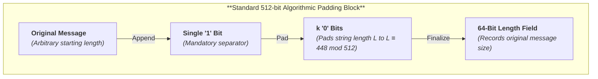

##### 1.3.3. The Length-Extension Vulnerability

Because $\mathcal{H}_{MD}$ directly exposes the internal accumulator state $H_L$ as the end digest, it fails to achieve Indifferentiability from a Random Oracle (ROM) when deployed in prefix-MAC constructions like $H(K \parallel M)$.

**Definition 1.12 (Length-Extension Forgery Game):**
We express the length-extension flaw as a deterministic cryptographic forgery game where an adversary $\mathcal{A}$ forces identical output mapping via state continuity.

1. $\mathcal{C}$ samples $K \xleftarrow{R} \mathcal{K}$ and selects an initial string $M_1$.
2. $\mathcal{C}$ issues $(M_1, t)$ and the bit-length $|K \parallel M_1|$ to $\mathcal{A}$, where $t = H(K \parallel M_1)$.
3. $\mathcal{A}$ selects an arbitrary extension string $M_2$.
4. $\mathcal{A}$ recursively calculates the exact MD padding suffix $P$ strictly required for the sequence $(K \parallel M_1)$.
5. $\mathcal{A}$ loads the observed target $t$ into an algorithmic replica as the initialization vector (setting internal state $H_L = t$).
6. $\mathcal{A}$ processes $M_2$ through the compression function $f(t, M_2)$ ending with a new finalized block payload $P_{\text{new}}$ mapped to $M_2$, producing output $t'$.
7. $\mathcal{A}$ outputs the forgery pair $(M_{\text{forge}}, t')$ where $M_{\text{forge}} = M_1 \parallel P \parallel M_2$.
8. $\mathcal{C}$ verifies the MAC: $H(K \parallel M_{\text{forge}}) = t'$.
9. $\mathcal{A}$ **wins** the game.

<details>
<summary><strong>📎 Clarification: Why Length Extension Is a Structural State-Reuse Failure</strong></summary>

> Length extension is easiest to understand as a consequence of **published internal state**. In a classic Merkle-Damgård hash, the final digest is not merely a summary label; it is the final chaining value itself. If the attacker also knows how the original message was padded, that published digest can serve as the starting state for additional compression steps.
>
> This is why naive prefix-MAC designs of the form $H(K \parallel M)$ fail. The attacker does not need to know the secret key $K$ in order to continue the computation. It is enough to know the digest $t = H(K \parallel M)$ and the total length of the secret-prefix message so that the original padding can be reconstructed correctly. Once those are known, the attacker can append new blocks and compute the digest of the extended message exactly as the legitimate hash process would.
>
> The continuation can be written schematically as
>
> $$t = H_L = H(K \parallel M), \qquad H_{L+1} = f(t, M_{2,1}), \qquad \ldots \qquad t' = H_{L+s}$$
>
> where the attacker treats the published digest $t$ as a valid initial chaining value for the appended block sequence of $M_2$.
>
> The forged transcript has the form
>
> $$M_{\mathrm{forge}} = M \parallel \text{pad}(K \parallel M) \parallel M_2$$
>
> together with a tag $t'$ computed by resuming the compression chain from the published digest $t$.
>
> | View of the digest | Consequence |
> |--------------------|-------------|
> | Digest as final label only | No continuation should be possible |
> | Digest equals final chaining value | Continuation becomes mechanically possible if padding is reconstructible |
>
> The vulnerability is therefore architectural, not merely algebraic. The problem is that the digest exposes a resumable state under a construction whose intermediate updates are publicly specified. Merkle-Damgård gives the attacker a valid continuation point.
>
> HMAC avoids this failure not by making Merkle-Damgård itself indifferentiable, but by wrapping the hash in a two-layer keyed construction whose security goal is different and whose intermediate states are not exposed in a way that enables raw continuation. Sponge designs avoid the same failure more natively because the published digest does not reveal the entire permutation state.
>
> | Attacker needs | Why it is sufficient in raw prefix-MAC |
> |----------------|----------------------------------------|
> | Published tag $t$ | Equals the final chaining state |
> | Length of $K \parallel M$ | Determines the original padding boundary |
> | Chosen extension $M_2$ | Supplies the new continuation blocks |

</details><br/>

Conditioned on the attacker knowing the correct padded length of $K \parallel M_1$, the forgery succeeds deterministically:

$$\Pr[\mathcal{A} \text{ wins}] = 1$$

**Theorem 1.2 (Sponge Resistance):**
Modern cryptographic primitives built on the Sponge Construction (e.g., Keccak) truncate their output mapping from an overarching hidden state layer (the "capacity"). They resist this forgery logic because the published digest does not expose the full internal state required to resume a valid permutation transcript.

<details>
<summary><strong>Proof</strong></summary>

> Write the final sponge state after absorbing $M$ as
>
> $$S_{\text{final}} = (R_{\text{final}}, C_{\text{final}}), \qquad |R_{\text{final}}| = r, \quad |C_{\text{final}}| = c,$$
> where $R$ is the visible rate portion and $C$ is the hidden capacity portion. A fixed-output sponge hash publishes only a truncation of the squeezed rate:
>
> $$H(M) = \text{trunc}_d(R_{\text{final}}).$$
>
> The Merkle-Damgård length-extension attack works only because the published digest is itself a valid chaining state for the next compression step. In a sponge, continuing the computation on an extension $M \parallel M'$ requires the attacker to know the entire internal state $(R_{\text{final}}, C_{\text{final}})$ so the next absorb/permutation step starts from the correct hidden capacity coordinates.
>
> But the digest reveals at most part of $R_{\text{final}}$ and reveals nothing directly about $C_{\text{final}}$. Many internal states are therefore consistent with the same published digest, and an adversary cannot identify the unique state needed to continue the transcript without recovering the hidden capacity information. Thus the digest is not a resumable computational state, and the deterministic continuation attack that succeeds against Merkle-Damgård does not transfer to the sponge setting. $\blacksquare$

</details>

The iterative processing flow is illustrated below:

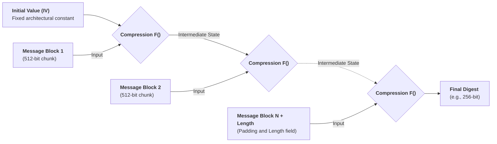

#### 1.4. Construction Countermeasures After Merkle-Damgård

Once Merkle-Damgård's fault lines became clear, hash designers did **not** respond with a single replacement idea. They developed a family of countermeasures aimed at one recurring problem: **state reusability**. If the digest exposes too much internal structure, or if the same compression function can be replayed in too many contexts without positional or domain metadata, attackers gain leverage through length-extension, multicollision chaining, herding, or structural ambiguity.

The unifying architectural question is whether an artifact that is valid in one context can be reused as meaningful input in another context the design never intended to make equivalent.

<details>
<summary><strong>📎 Clarification: State Reusability as the Unifying Failure Pattern</strong></summary>

> The subsections that follow are easiest to read if they are treated as responses to a single architectural question: **what information or structure is being reused too freely across contexts?**
>
> In classic Merkle-Damgård, the final digest can be reused as a valid continuation state. In multicollision and herding attacks, repeated application of the same untweaked compression rule allows attackers to chain local effects into larger global structures. In tree-hashing and transcript contexts, insufficient framing allows one semantic object to be reinterpreted as another.
>
> The unwanted relation can be expressed abstractly as
>
> $$\text{artifact extracted in context } C_1 \;\Longrightarrow\; \text{valid computational input in context } C_2,$$
>
> where the design never intended $C_1$ and $C_2$ to be interchangeable. Once such a relation exists, attackers can transport information across phases, positions, or semantic roles.
>
> The common issue is not merely "too few rounds" or "insufficient output length." It is that intermediate or final artifacts of the construction remain reusable in ways the protocol designer did not intend. Once that perspective is fixed, the countermeasures in this section become easier to classify: hide more state, bind position, distinguish finalization, or encode domains so that reuse no longer preserves meaning.
>
> | Failure mode | What is being reused incorrectly? | Typical countermeasure |
> |--------------|-----------------------------------|------------------------|
> | Length extension | Final digest as continuation state | Hide state or change finalization semantics |
> | Multicollision / herding | Uniform compression step across positions | Counters, tweaks, salts |
> | Tree ambiguity | Same bytes interpreted under multiple node roles | Domain tags / prefix-free encodings |
> | Transcript confusion | Same primitive reused across stages without framing | Explicit labels / customization strings |
>
> | Extracted artifact | Illicit reuse target | Resulting attack family |
> |--------------------|----------------------|------------------------|
> | Published digest | Next valid chaining state | Length extension / continuation |
> | Local collision gadget | Another position in the same iteration rule | Multicollision / herding |
> | Raw serialized bytes | Different semantic parser role | Tree ambiguity / transcript confusion |

</details><br/>

The main post-Merkle-Damgård defenses are summarized below:

| Countermeasure | Core Idea | Stops / Weakens | Representative Constructions |
|----------------|-----------|-----------------|------------------------------|
| **Wide-pipe** | Keep the internal state wider than the final digest | Weakens length-extension-style state recovery, herding, and long-message second-preimage shortcuts | SHA-384, SHA-512/256, Whirlpool variants |
| **Chop-MD / truncation** | Publish only a truncated digest rather than the entire final chaining value | Prevents trivial state replay from the digest alone | SHA-512/224, SHA-512/256 |
| **HAIFA counters and salts** | Inject block index and optional salt into each compression call | Breaks identical-step replay assumptions behind multicollisions and herding | BLAKE, BLAKE2 |
| **Finalization flags / mode bits** | Mark the last block or node type explicitly | Prevents continuing a finished hash as if it were a middle state | BLAKE2, BLAKE3 |
| **Prefix-free / domain-separated framing** | Encode type, length, or role before hashing data | Stops boundary confusion and structural reinterpretation | TupleHash, cSHAKE, Certificate Transparency, Sakura |
| **Hidden-capacity sponge state** | Reveal only part of a larger permutation state | Eliminates classic length-extension and greatly limits direct state reuse | SHA-3, SHAKE, KMAC, KangarooTwelve |

##### 1.4.1. Wide-Pipe and Chop-MD: Hiding More State Than You Publish

The simplest response to state exposure is to ensure the digest is **strictly smaller** than the internal state being protected. If the attacker sees only a projection of the final chaining value, they can no longer resume the computation directly.

For a wide-pipe construction with internal state size $w$ and published digest size $n < w$, the attacker does not recover the full chaining value from the digest alone. This does **not** magically improve the birthday bound on an $n$-bit output, but it does block certain construction-level attacks whose first step is "load the public digest as the next valid state."

<details>
<summary><strong>📎 Clarification: What Wide-Pipe Changes and What It Does Not</strong></summary>

> Wide-pipe designs are sometimes misunderstood as if truncation alone automatically increases every security margin. That is not the right interpretation.
>
> Publishing fewer bits than the internal state does **not** change the basic birthday bound of an $n$-bit output. A 256-bit published digest still offers collision resistance on the order of $2^{128}$ under generic search. What wide-pipe changes is the attacker's ability to reconstruct or reuse the **full chaining state** from the published digest alone.
>
> The benefit is therefore structural. Attacks that begin by loading the public digest as the next valid internal state become substantially harder or impossible, because the digest reveals only a projection of the true state. This weakens state-recovery and state-continuation strategies even though it does not magically convert an $n$-bit digest into a collision-resistant object beyond the generic $2^{n/2}$ limit.
>
> `SHA-512/256` is the canonical example. Its significance is not merely "a shorter SHA-512 output." The design preserves the larger internal state and exposes only part of it, which gives it a different structural profile from a design whose full internal state and final digest are identical.
>
> | Quantity | Raw same-width design | Wide-pipe design |
> |----------|-----------------------|------------------|
> | Internal state width | $n$ | $w > n$ |
> | Published digest width | $n$ | $n$ |
> | Digest reveals full state? | Often yes | No |
> | Generic collision cost | $\approx 2^{n/2}$ | $\approx 2^{n/2}$ |
> | State-reuse resistance | Weaker | Stronger |

</details>

##### 1.4.2. HAIFA: Counters, Salts, and Position-Bound Compression

HAIFA (HAsh Iterative FrAmework) generalizes Merkle-Damgård by injecting **position information** and optional **salting** into the compression call. Conceptually:

$$H_i = f(H_{i-1}, M_i, t_i, s)$$

where $t_i$ is a block counter and $s$ is an optional salt/domain parameter.

This changes the security game in a subtle but important way. In raw Merkle-Damgård, every step applies "the same compression function again." That regularity is exactly what Joux-style multicollisions and herding exploit. In HAIFA, the same message block processed at a different position is **not** the same call. Position becomes part of the primitive.

<details>
<summary><strong>📎 Clarification: Why Counters and Salts Change the Adversary's Search Space</strong></summary>

> HAIFA modifies the compression interface so that the update rule depends not only on the previous state and current message block, but also on contextual metadata such as the block index and optional salt.
>
> That change matters because several attacks on plain iterated hashing exploit **step uniformity**. If every round is the same transformation modulo the incoming block, then a collision or state-merging trick found locally can often be replicated, chained, or transplanted elsewhere in the computation. Counters disrupt that symmetry: a block processed in position $i$ is no longer interchangeable with the same block processed in position $j$.
>
> The salt parameter serves a related purpose at the domain level. It lets one derive distinct hash behaviors for different contexts without redesigning the primitive. Taken together, counters and salts make the internal computation more context-bound and therefore less reusable by generic structural attacks.
>
> | Iterated design | Compression interface |
> |-----------------|-----------------------|
> | Raw Merkle-Damgård | $H_i = f(H_{i-1}, M_i)$ |
> | HAIFA | $H_i = f(H_{i-1}, M_i, t_i, s)$ |
>
> The extra parameters $t_i$ and $s$ bind the update to its position and optional domain.

</details>

##### 1.4.3. Finalization and Last-Block Separation

Another recurring lesson is that the final block must not be semantically indistinguishable from an interior block. If a design lets the attacker treat "the output of a completed hash" as just another chaining value from the middle of a computation, continuations and structural confusions follow naturally.

Modern constructions therefore use:

- explicit **finalization flags**;
- separate **node-type flags** for leaves, parents, roots, and keyed modes;
- or domain-specific suffixes before padding.

BLAKE2 and BLAKE3 encode this principle directly. The same compression core is reused across many contexts, but **flags** prevent those contexts from collapsing into one another.

<details>
<summary><strong>📎 Clarification: Why Finalization Must Be a Distinct Semantic State</strong></summary>

> Finalization rules exist to ensure that "the computation is complete" is not merely an external interpretation placed on an otherwise ordinary internal state. If the last step were indistinguishable from any interior step, then the final digest could be treated as if it were simply another intermediate chaining value.
>
> In notation, the desired separation is
>
> $$H_i = f(H_{i-1}, M_i, \texttt{mid}) \qquad \text{versus} \qquad H_L = f(H_{L-1}, M_L, \texttt{final})$$
>
> rather than reusing the same semantic call shape for both interior and terminal processing.
>
> That is precisely the condition under which continuation-style attacks flourish. The attacker takes a completed computation and resumes it as though it had never ended. Finalization flags, last-block markers, and mode bits prevent that reinterpretation by changing the meaning of the final update itself.
>
> The broader lesson is that reuse of a compression core is not automatically dangerous. What matters is whether the construction distinguishes the roles under which the core is invoked. Once "interior block," "final block," "leaf," "parent," and "keyed mode" are explicitly separated, one primitive can support several contexts without allowing them to collapse into one another.
>
> | Compression-call role | Must it be distinguishable? | Why |
> |-----------------------|-----------------------------|-----|
> | Interior block | Yes | Prevents final-output continuation |
> | Final block | Yes | Marks completion semantics |
> | Leaf / parent node | Yes | Prevents tree reinterpretation |
> | Keyed / unkeyed mode | Yes | Prevents cross-context confusion |

</details>

##### 1.4.4. Prefix-Free Encoding and Structural Domain Separation

A distinct but related family of countermeasures addresses **ambiguity**, not merely state exposure. Even a collision-resistant primitive can be misused if the application lets different structured objects serialize to the same byte string before hashing.

This is why modern designs insist on:

- length-prefixing tuple elements;
- distinguishing Merkle-tree leaves from internal nodes;
- binding transcript hashes to specific protocol stages;
- and using customization strings or Sakura encodings in tree hashes.

The common principle is **prefix-free framing**: if two objects are semantically different, their encoded byte strings must diverge *before* the primitive sees them.

<details>
<summary><strong>📎 Clarification: Why Domain Separation Begins Before the Hash Function Runs</strong></summary>

> Domain separation is often described as if it were an optional label added at the end of protocol design. In fact, it is a statement about **how distinct semantic objects are serialized before hashing**.
>
> If two different objects can produce the same byte string prior to hashing, then no downstream cryptographic strength can recover the lost distinction. The primitive only sees bytes. It cannot infer whether those bytes represent a leaf node, an internal node, a transcript stage, a tuple element boundary, or a customization context unless the encoding makes that structure explicit.
>
> The design goal is therefore an injective encoding map
>
> $$\text{Enc} : \mathcal{O} \to \{0,1\}^*$$
>
> such that semantically distinct objects satisfy
>
> $$o_1 \neq o_2 \;\Longrightarrow\; \text{Enc}(o_1) \neq \text{Enc}(o_2).$$
>
> Prefix-free framing solves this by ensuring that no valid encoding is the prefix of another valid encoding in a way that creates ambiguity. Length prefixes, role tags, customization strings, Sakura framing, and leaf/node markers are all concrete manifestations of the same principle: the serialized representation must preserve the semantic separation that the protocol relies on.
>
> This is why domain separation belongs in the architecture of secure hashing rather than in a stylistic "best practices" appendix. It is a condition for making sure that structural meaning survives contact with the byte-level primitive.
>
> | Semantic objects | Unsafe bare encoding | Safe separated encoding |
> |------------------|----------------------|-------------------------|
> | Leaf `x` vs parent `(x,y)` | `x`, `x‖y` | `0x00‖x`, `0x01‖x‖y` |
> | Transcript stage A vs stage B | Same raw byte concatenation | Distinct stage labels / domain tags |
> | Tuple `(a,b)` vs concatenated string `ab` | `a‖b` | `len(a)‖a‖len(b)‖b` |

</details><br/>

<details>
<summary><strong>⚙️ Application: Which Countermeasure Fixes Which Failure Mode?</strong></summary>

> Designers often ask whether one "modernization" is enough. Usually it is not. Different failure modes require different structural defenses:
>
> | Failure mode | Structural cause | Minimal fix | Typical construction family |
> |--------------|------------------|-------------|-----------------------------|
> | Resume hashing from digest (`H(K \| M)` extension) | Published digest is a valid continuation state | Hide internal state or use a keyed wrapper such as HMAC/KMAC | Sponge, wide-pipe truncation, HMAC |
> | Joux multicollision chaining across identical steps | Same compression rule is replayed uniformly at every position | Counters / tweaks / HAIFA-style position binding | HAIFA, BLAKE-family variants |
> | Herding via reusable intermediate states | Intermediate states can be precomputed and linked later | Wider hidden state plus position/domain metadata | Wide-pipe, sponge, tree modes with framing |
> | Leaf/internal-node confusion in trees | Same byte strings can be interpreted under multiple semantic roles | Prefix-free encodings, node tags, Sakura-style framing | Sakura, BLAKE3 flags, explicit node prefixes |
> | Cross-protocol key-derivation collisions | Same primitive reused across domains without explicit context separation | cSHAKE customization strings, transcript labels, TupleHash-style framing | cSHAKE, TupleHash, transcript-bound KDFs |
>
> A second practical question is whether a given defense is sufficient on its own:
>
> | Countermeasure | What it fixes well | What it does **not** fix by itself |
> |----------------|--------------------|------------------------------------|
> | **Wide-pipe / truncation** | Direct state replay from the published digest | Domain ambiguity, position-uniform multicollision structure |
> | **HAIFA counters / salts** | Position reuse and some structural replay attacks | Finalization semantics, generic digest-state exposure if too much state is published |
> | **Finalization flags** | Treating the last block like a middle block | Cross-domain ambiguity unless roles are also encoded |
> | **Prefix-free / domain-separated framing** | Semantic confusion between leaves, parents, tuples, transcript stages, or protocol contexts | Raw state exposure problems inside the underlying construction |
> | **HMAC / KMAC** | Keyed authentication and raw continuation-style MAC misuse | Unkeyed collision resistance questions in other applications |
>
> **Bottom line:** modern hash design is less about inventing one magic primitive and more about ensuring that **state, position, and domain are never silently reusable**.

</details>

### 2. MD5

#### 2.0. The Rise of MD5

MD5 (Message-Digest Algorithm 5) was designed by Ronald Rivest in 1991 to replace MD4, which had shown early signs of cryptographic weakness. For over a decade, MD5 was *everywhere*—the default choice for file integrity verification, SSL/TLS certificates, software distribution signatures, and password storage.

The design goal was ambitious: a hash function fast enough for real-time processing on 1990s hardware, yet cryptographically secure against all known attacks. The 128-bit output length seemed sufficient—collision resistance of $2^{64}$ operations appeared computationally infeasible. In an era when 60 MHz processors were state-of-the-art, the birthday bound of $2^{64}$ hash computations would require more energy than the sun would produce in its lifetime.

This assumption held for 13 years. MD5 became deeply embedded in critical infrastructure: Certificate Authorities issued MD5-signed certificates for HTTPS, software vendors published MD5 checksums for downloads, and authentication systems stored MD5(password) as the industry standard. By 2004, billions of dollars in e-commerce relied on MD5's collision resistance.

#### 2.1. Algorithm Mechanics

MD5 processes 512-bit message blocks using standard Merkle-Damgård padding. The 128-bit internal state is divided into four 32-bit words initialized with little-endian constants:

| Register | Initial Value |
|----------|---------------|
| A | `0x67452301` |
| B | `0xefcdab89` |
| C | `0x98badcfe` |
| D | `0x10325476` |

Each 512-bit block passes through **64 operations** (4 rounds × 16 steps). Each step uses a non-linear Boolean function, modular addition, and left rotations (`<<<`).

**Definition 2.1 (Non-linear Boolean Round Functions):**
The hash primitive applies a sequence of non-linear bitwise Boolean functions operating over the 32-bit vector space $\mathbb{F}_2^{32}$. For state words $X, Y, Z \in \mathbb{F}_2^{32}$, the functions $F, G, H, I: (\mathbb{F}_2^{32})^3 \to \mathbb{F}_2^{32}$ map identically positioned bits $(x_j, y_j, z_j) \mapsto w_j$ per round:

1. **Round 1 (Multiplexer F):** $F(X, Y, Z) = (X \wedge Y) \oplus (\neg X \wedge Z)$
2. **Round 2 (Multiplexer G):** $G(X, Y, Z) = (X \wedge Z) \oplus (Y \wedge \neg Z)$
3. **Round 3 (Parity H):** $H(X, Y, Z) = X \oplus Y \oplus Z$
4. **Round 4 (Asymmetric I):** $I(X, Y, Z) = Y \oplus (X \vee \neg Z)$

The mathematical intent is to supply non-linearity to prevent algebraic solving. Ideally, each mapping should satisfy the Strict Avalanche Criterion (SAC), forcing any single-bit input change ($x_j \to \neg x_j$) to propagate a change to the output bit $w_j$ with a precise probability of $\frac{1}{2}$.

**Theorem 2.1 (Breakdown of the Strict Avalanche Criterion):**
The choice of the multiplexer functions $F$ and $G$ introduces a critical differential collision bias, failing SAC. During a bitwise differential analysis, if an adversary injects a difference $\Delta Y = Y \oplus Y'$ while holding $X$ and $Z$ constant, the output difference of $F$ evaluates to:

$$F(X, Y, Z) \oplus F(X, Y', Z) = (X \wedge Y) \oplus (X \wedge Y') = X \wedge (Y \oplus Y') = X \wedge \Delta Y$$

<details>
<summary><strong>Proof: The Cancellation Bias</strong></summary>

When the structurally independent vector $X$ evaluates to 0 at deterministic bit $j$ ($x_j = 0$), the differential output identically vanishes: $0 \wedge \Delta y_j = 0$. Thus, for inputs where $x_j = 0$ (occurring with probability $0.5$ for random states), the output difference is completely absorbed ($\Delta_{\text{out}} = 0$) regardless of the magnitude of $\Delta Y$. This deterministic "cancellation bias" allows adversaries to actively select differential pathways with $2^{-1}$ probability instead of the anticipated $2^{-32}$. This single formula embodies the fatal flaw operationalizing Wang’s differential multicollision capabilities across MD-era hashing algorithms.

</details>

To decouple symmetric correlations across iterations, the derivation constants vector $K_i \in \mathbb{F}_2^{32}$ is seeded utilizing a continuous transcendental projection:

$$K_i = \lfloor 2^{32} \times |\sin(i + 1)| \rfloor$$

These structurally irrational "nothing-up-my-sleeve" constants provide explicit step separation but fundamentally cannot overcome the non-linear algebraic failure housed inside $F$ and $G$.

##### 2.1.1. Single-Round Operation

Each of the 64 steps follows this transformation:

$$T = A + f(B, C, D) + X_i + K_i$$


$$A = D, \quad D = C, \quad C = B, \quad B = B + (T <<< s)$$

where $X_i$ is a 32-bit message word, $K_i$ is the round constant, and $s$ is a per-step rotation amount (varying from 3 to 23 bits). The state rotation (`A → D → C → B → B+temp`) ensures every register influences every other register over multiple rounds. Note: unlike SHA-1 (which applies a `<<< 30` rotation when shifting B into C), MD5 passes B directly.

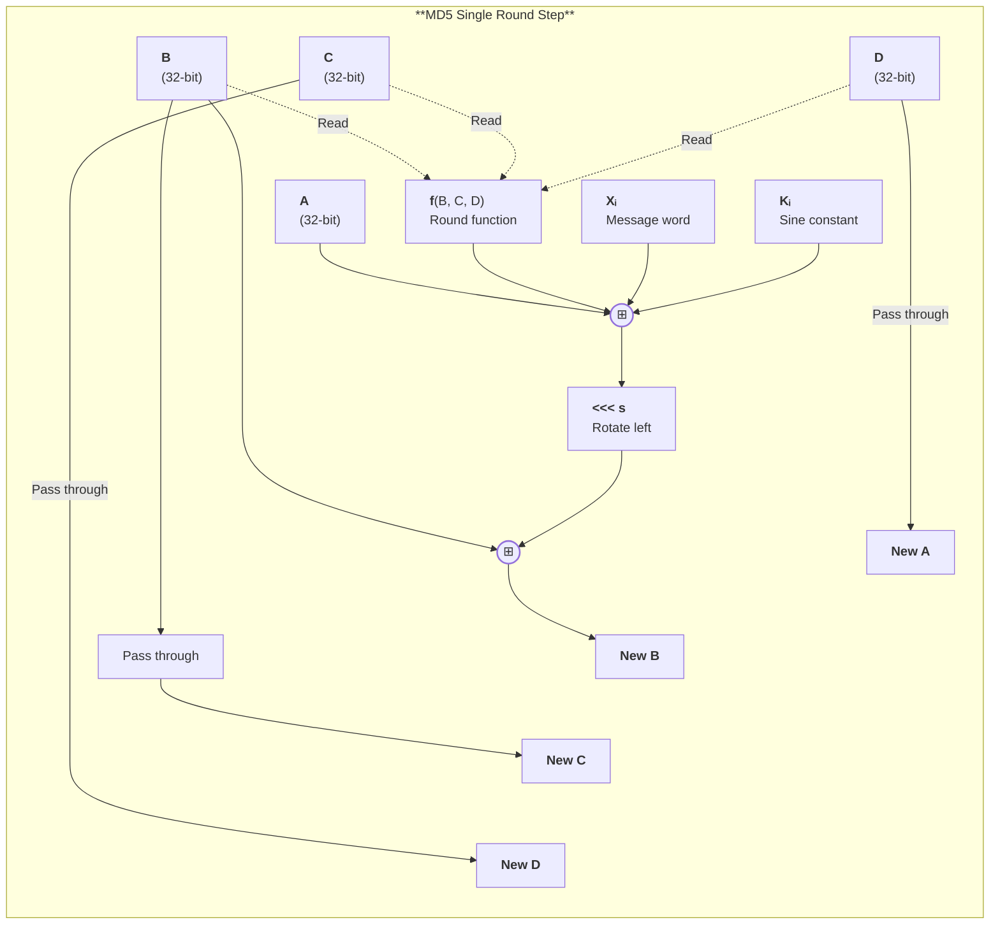

After 64 steps, the original registers (A, B, C, D) are added to the transformed values to produce the new state. This "feed-forward" addition prevents inversion—knowing the output state doesn't reveal the input state.

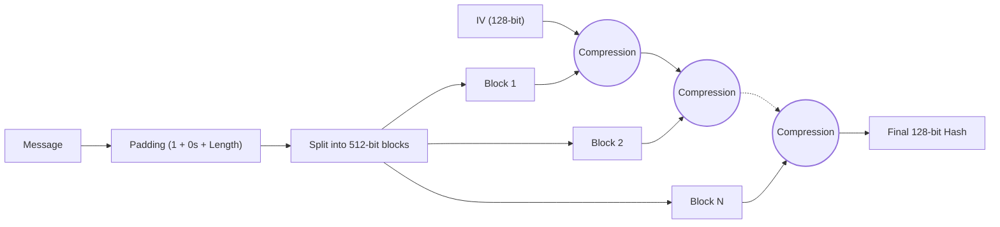

#### 2.2. The Breaking of MD5

MD5's collapse demonstrates how theoretical weaknesses cascade into practical exploits. The story unfolds in three acts: theoretical doubt, practical collision, and devastating real-world attack.

##### 2.2.1. Structural Cryptanalysis: Differential Characteristics

**Definition 2.2 (Differential Characteristic):**
Let $f: \{0,1\}^n \times \{0,1\}^b \to \{0,1\}^n$ be a compression function. A differential characteristic is a structured sequence of input and output differences $(\Delta_{\text{in}}, \Delta_{\text{out}})$ defined over the XOR algebraic field, tracking how an initial perturbation evolves:

$$\Delta_{\text{out}} = f(H, M \oplus \Delta_{\text{in}}) \oplus f(H, M)$$

The probability $p$ that a randomly chosen $M$ satisfies the path is:

$$p = \Pr_{M \xleftarrow{R} \{0,1\}^b}[f(H, M \oplus \Delta_{\text{in}}) \oplus f(H, M) = \Delta_{\text{out}}]$$

In an ideal hash primitive, optimal diffusion dictates $p \approx 2^{-n}$. Wang's breakthrough identified differential characteristics in MD5 where $\Delta_{\text{out}} = 0$ bounded at extraordinarily high probabilities ($p = 2^{-10}$ to $2^{-20}$) by exploiting the multiplexer cancellation biases (Theorem 2.1).

<details>
<summary><strong>📖 Prerequisite: How Differential Paths Convert Local Bias into a Full MD5 Collision</strong></summary>

> Differential cryptanalysis does not begin by searching directly for two complete messages with equal digests. It begins by specifying a **trajectory of internal differences** whose cumulative transition probability is anomalously large relative to the random baseline.
>
> If $\Delta Q_t$ denotes the state difference after step $t$, a candidate path is a sequence
>
> $$\Delta Q_0 \rightarrow \Delta Q_1 \rightarrow \cdots \rightarrow \Delta Q_r,$$
>
> with aggregate likelihood
>
> $$P_{\text{path}} = \prod_{t=1}^{r} \Pr[\Delta Q_t = \delta_t \mid \Delta Q_{t-1} = \delta_{t-1}].$$
>
> For an ideally diffusive design, most useful paths are crushed by near-random transition probabilities and the attacker is forced back toward generic birthday search. MD5's Boolean structure instead creates many bit positions where the transition law is biased rather than random, so carefully chosen message differences can make a long path survive with unexpectedly high probability.
>
> | Quantity | Meaning in Wang-style analysis |
> |----------|--------------------------------|
> | $\Delta M$ | Controlled message-word difference inserted by the attacker |
> | $\Delta Q_t$ | Internal state difference after step $t$ |
> | $P_{\text{path}}$ | Probability that all bit-conditions along the path hold simultaneously |
> | $\Delta H_1$ | Residual chaining-value difference after a near-collision block |
>
> MD5 collisions are then engineered in two layers:
>
> | Layer | Objective | Why it matters |
> |-------|-----------|----------------|
> | Near-collision block | Drive the state into a highly constrained residual difference $\Delta H_1 \neq 0$ | Converts an unstructured search problem into a controlled intermediate state |
> | Correction block | Choose a second difference that annihilates $\Delta H_1$ | Turns local path control into a full digest collision |
>
> The decisive conceptual shift is that the attacker is not "hoping" for two messages to collide. The attacker is solving for a high-probability differential script whose final line is $\Delta H_2 = 0$. Once the path probability is raised from the random regime toward $2^{-20}$ or $2^{-40}$, practical collision search becomes an engineering task rather than a thermodynamic impossibility.

</details><br/>

**Definition 2.3 (Wang's Two-Block Collision Construction):**
Because $p \approx 2^{-20}$ applies locally per block, Wang employed a sequential two-block collision architecture to forge identical end states:
1. **Block 1 (Near-Collision):** An initial differential $\Delta M_1$ is injected into the payload, causing the internal states to diverge, but strictly concluding with a predefined differential constant $\Delta H_1 \neq 0$.
2. **Block 2 (Annihilation):** A succeeding differential $\Delta M_2$ is synthesized against the perturbed state such that the differences cancel: $f(H_1 \oplus \Delta H_1, M_2 \oplus \Delta M_2) \oplus f(H_1, M_2) = 0$.
By isolating the algebraic equations across independent blocks, the overall attack complexity plunged from the ideal $2^{64}$ birthday bound to mere $2^{41}$ evaluations, permanently shattering the algorithm.

##### 2.2.2. Joux's Multicollision Attack on Iterated Structures

In 2004, Antoine Joux demonstrated that the Merkle-Damgård construction is intrinsically vulnerable to multicollisions—finding $k$ distinct messages that all hash to the same value—with an efficiency far greater than theoretically expected.

**Theorem 2.2 (Joux's Multicollision Bound):**
For an ideal monolithic hash function with an $n$-bit output, finding a $2^k$-collision requires $\mathcal{O}(2^{\frac{n(2^k-1)}{2^k}})$ operations. However, for any iterated Merkle-Damgård hash function, an adversary can construct a $2^k$-collision in only $\mathcal{O}(k \cdot 2^{n/2})$ operations.

<details>
<summary><strong>Proof: The Iterative Forgery</strong></summary>

1. The adversary computes a single collision pair $(M_1, M'_1)$ for the first compression iteration $f(IV, M) = f(IV, M') = H_1$. This costs $\mathcal{O}(2^{n/2})$ operations via the standard birthday paradox.
2. Using $H_1$ as the identical starting state, the adversary iterates the process to find a second collision pair $(M_2, M'_2)$ such that $f(H_1, M_2) = f(H_1, M'_2) = H_2$. This again costs $\mathcal{O}(2^{n/2})$.
3. Repeating this recursively $k$ times yields a final state $H_k$.
Due to MD state continuity, any traversal path of the chosen blocks (e.g., $M_1 \parallel M_2 \parallel \dots \parallel M_k$ or $M'_1 \parallel M_2 \parallel \dots \parallel M_k$) deterministically maps to the identical target state $H_k$. Thus, $2^k$ completely distinct messages share the exact same digest, computed in just $k \times \mathcal{O}(2^{n/2})$ cumulative operations, invalidating the security assumptions of cascaded concatenation designs.

</details>

##### 2.2.3. SHA-2 as the Functional Standardized Mitigation

The catastrophic breakdown of MD4, MD5, and eventually SHA-1 was rooted in shared algebraic flaws. The National Institute of Standards and Technology (NIST) formalized the SHA-2 family as the functional mitigation paradigm. While SHA-2 functionally retains the Merkle-Damgård iterative skeleton (and thus remains technically susceptible to length-extension and Joux's theoretic multicollisions), its parametric scaling thoroughly neutralizes the specific differential mechanics exploited by Wang:
- **Asymptotic State Expansion:** Bounding at an internal $n=256$ or $n=512$ bits computationally inflates Joux's $\mathcal{O}(k \cdot 2^{n/2})$ iterative attack cost far beyond modern silicon tractability.
- **Complex Message Schedules:** By expanding 16 input words into 64 (or 80) utilizing bitwise differential rotations and modular additions, SHA-2 prevents Wang's localized differential cancellation paths from persisting across multiple rounds. The sheer complexity of solving the expanded Boolean constraints blocks two-block cancellation vectors deterministically.

##### 2.2.4. The Collapse: MD5 Collision Attacks (2004–2012)

MD5's collision resistance was comprehensively shattered between 2004 and 2012 through three escalating attack milestones: Wang et al.'s initial collision generation (2004, ~$2^{41}$ operations), Stevens et al.'s chosen-prefix collision enabling X.509 certificate forgery (2008, ~$2^{39}$ operations on 200 PlayStation 3 consoles), and the Flame malware's nation-state deployment of an unknown collision variant to forge Windows Update code-signing certificates (2010–2012). Each milestone demonstrated that collision attacks are not merely theoretical — they enable document forgery, PKI compromise, and cyberweapon distribution.

<details>
<summary><strong>📎 Clarification: Why Chosen-Prefix Collisions Are Qualitatively Worse Than Ordinary Collisions</strong></summary>

> An ordinary collision demonstration proves that the digest space can be made to merge. A **chosen-prefix collision** proves something operationally stronger: the attacker can preserve two independently meaningful semantic prefixes while engineering only the trailing suffix material needed to force digest equality.
>
> The distinction is visible in the constraint system:
>
> $$\text{Ordinary: } \exists M \neq M' \text{ such that } H(M) = H(M'),$$
> $$\text{Chosen-prefix: } \forall P_1, P_2 \text{ in a feasible attacker set, } \exists S_1, S_2 \text{ such that } H(P_1 \parallel S_1) = H(P_2 \parallel S_2).$$
>
> The second statement is materially more dangerous because the attacker can let $P_1$ and $P_2$ encode different public keys, certificate attributes, executable headers, or contractual text while still converging to a shared digest.
>
> | Collision model | Attacker control over the prefix | Typical artifact |
> |-----------------|----------------------------------|------------------|
> | Generic / identical-prefix collision | Little or none; the colliding pair is usually artificial | Laboratory demonstration that the digest space is mergeable |
> | Chosen-prefix collision | High; the attacker fixes semantically meaningful prefixes first | Forged certificates, signed binaries, or substituted documents |
>
> In PKI, the crucial asymmetry is that the signature covers the digest, not the semantic intent of the prefix. Once the attacker can force
>
> $$H(P_{\text{benign}} \parallel S_{\text{benign}}) = H(P_{\text{rogue}} \parallel S_{\text{rogue}}),$$
>
> a signature issued for the benign artifact automatically authenticates the rogue one. Chosen-prefix capability is therefore the threshold at which "hash weakness" becomes a certificate-forgery primitive.

</details><br/>

<details>
<summary><strong>📜 Historical: MD5 Collision Attacks — Wang, Rogue CA, and Flame</strong></summary>

> The chronology is best read as an expansion in attacker control: first the ability to force a collision at all, then the ability to preserve arbitrary semantic prefixes, and finally the weaponization of that capability against global trust infrastructure.
>
> ### Wang's First Practical Collisions (2004)
>
> Dr. Xiaoyun Wang's team at Shandong University generated MD5 collisions in approximately one hour on an IBM p690 cluster. A real collision pair — two 128-byte messages with identical MD5 hashes:
>
> **Message 1 (hex, 64 bytes):**
> ```text
> d131dd02c5e6eec4 693d9a0698aff95c 2fcab58712467eab 4004583eb8fb7f89
> 55ad340609f4b302 83e488832571415a 085125e8f7cdc99f d91dbdf280373c5b
> ```
>
> **Message 2 (hex, 64 bytes — differing bytes marked with ^^):**
> ```text
> d131dd02c5e6eec4 693d9a0698aff95c 2fcab50712467eab 4004583eb8fb7f89
>                                           ^^
> 55ad340609f4b302 83e4888325f1415a 085125e8f7cdc99f d91dbd7280373c5b
>                               ^^                              ^^
> ```
>
> **MD5 Hash (both):** `79054025255fb1a26e4bc422aef54eb4`
>
> The three differing bytes flip individual bits that propagate through 64 rounds and ultimately cancel — a targeted differential attack, not a random search.
>
> ### The Chosen-Prefix Collision and Rogue CA Attack (2008)
>
> The **chosen-prefix collision attack** (Marc Stevens et al., 2008) escalated from random collisions to *meaningful* document forgery. Given two arbitrary prefixes $P_1$ and $P_2$, the attacker constructs suffixes $S_1$ and $S_2$ such that:
>
> $$\text{MD5}(P_1 \parallel S_1) = \text{MD5}(P_2 \parallel S_2)$$
>
> Researchers demonstrated this by creating a forged Certificate Authority certificate trusted by all major browsers:
> 1. Generate a legitimate CA certificate request with attacker-controlled public key
> 2. Generate a second certificate request with a *different* public key but the same MD5 hash
> 3. Get the legitimate request signed by a real CA (which still used MD5)
> 4. The signature validates both certificates — attacker now has a trusted CA certificate
>
> Cost: ~200 PlayStation 3 consoles for 2 days (~$20,000). Impact: the ability to issue trusted certificates for *any* domain.
>
> ### The Flame Malware Attack (2012)
>
> Flame was advanced nation-state spyware (believed joint US-Israeli) targeting Iranian infrastructure. Its attack chain exploited an MD5 collision to forge a Microsoft code-signing certificate, allowing installation via Windows Update without security warnings.
>
> | Property | Value |
> |----------|-------|
> | Certificate type | Code-signing (Authenticode) |
> | Hash algorithm | MD5 |
> | Collision type | Chosen-prefix |
> | Computation time | Estimated weeks on cluster |
> | Attack window | 2010–2012 (undetected) |
>
> **Critical innovation:** The attackers used an MD5 collision variant **unknown to public cryptography research** — when analysts reverse-engineered Flame, the technique was more advanced than any published attack, indicating cryptographic expertise ahead of academia.
>
> **Lessons:** (1) Collision attacks are practical — nation-states invest in them. (2) Secret attacks exist — your adversary may know techniques not yet published. (3) Deprecation takes too long — Microsoft knew MD5 was broken in 2008 but still used it in 2012. (4) Code-signing is only as strong as its hash — a broken hash invalidates the entire PKI chain.

</details>

<details>
<summary><strong>⚙️ Application: Chosen-Prefix Collisions and the Rogue Certificate Story</strong></summary>

> The rogue-CA episode is the cleanest real-world demonstration that a collision break is not merely "two weird files share a checksum." In PKI, a signature validates a digest of a structured certificate object, so chosen-prefix collision capability turns directly into a trust-transfer attack.
>
> ### System artifact and walkthrough
>
> What the certification authority signs is the certificate's **TBSCertificate** ("to be signed" certificate), not some abstract document:
>
> ```text
> TBSCertificate =
>     version ||
>     serialNumber ||
>     signatureAlgorithm ||
>     issuer ||
>     validity ||
>     subject ||
>     subjectPublicKeyInfo ||
>     extensions
> ```
>
> In the rogue-certificate attack, the adversary prepares two different prefixes:
>
> - $P_{\text{benign}}$: a certificate request the real CA will plausibly sign
> - $P_{\text{rogue}}$: a certificate with attacker-chosen semantics, especially a different public key and CA capabilities
>
> The attacker then searches for suffixes $S_{\text{benign}}$ and $S_{\text{rogue}}$ such that
>
> $$\text{MD5}(P_{\text{benign}} \parallel S_{\text{benign}}) = \text{MD5}(P_{\text{rogue}} \parallel S_{\text{rogue}}).$$
>
> Once the legitimate CA signs the benign TBSCertificate digest, the same signature also validates the rogue TBSCertificate because the signed hash is identical.
>
> ### Cryptographic property in play
>
> Chosen-prefix collisions are operationally worse than ordinary collisions because the attacker controls the meaningful prefix before doing the collision work. That changes the threat from
>
> $$\exists M \neq M' : H(M)=H(M')$$
>
> to a much more dangerous statement:
>
> $$\exists S_1, S_2 \text{ such that } H(P_1 \parallel S_1)=H(P_2 \parallel S_2)$$
>
> for attacker-selected, semantically different prefixes $P_1$ and $P_2$.
>
> In PKI, that is catastrophic because signatures bind to the digest, not to the human intent of the certificate fields:
>
> | Layer | What is authenticated |
> |-------|-----------------------|
> | CA signature | Hash of `TBSCertificate` |
> | Browser / relying party | Accepts the certificate if the signature verifies |
> | Real-world meaning | Derived from the certificate fields after signature validation |
>
> Once two different TBSCertificate encodings share one digest, the signature's authority transfers from the benign object to the malicious one.
>
> ### What breaks if done wrong
>
> Public-key infrastructure amplifies hash failure because the whole ecosystem is built on delegated signing authority. A single successful chosen-prefix collision can turn a routine certificate issuance into a credential that browsers treat as globally trusted.
>
> The rogue-CA story therefore teaches three separate lessons:
>
> 1. **Collision resistance alone is not a laboratory metric.** It protects the semantic uniqueness of signed objects.
> 2. **Chosen-prefix capability is the threshold where PKI becomes forgeable.** The attacker no longer needs a meaningless collision pair.
> 3. **Migration must start on credible theory, not after mass exploitation.** By the time chosen-prefix collisions become operationally affordable, the ecosystem is already late.
>
> The practical rule is blunt:
>
> $$\text{If a broken hash still sits under a signature system, the signature system is already on borrowed time.}$$

</details>


##### 2.2.5. The Deprecation Cascade

MD5's death was slow but inevitable:

| Year | Event |
|------|-------|
| 1996 | Dobbertin's pseudo-collision proves theoretical weakness |
| 2004 | Wang generates practical collisions (1 hour on cluster) |
| 2005 | Lenstra constructs chosen-prefix collision to forge X.509 certificate |
| 2008 | Rogue CA attack demonstrates PKI compromise; deprecation begins |
| 2012 | Flame malware discovered exploiting MD5 collision to forge Windows Update certificates |
| 2012 | Microsoft disables MD5 in Authenticode; CAs stop issuing MD5 certificates |
| 2014 | All major browsers distrust MD5 certificates |
| 2016 | NIST formally prohibits MD5 for federal use (SP 800-131A) |

Operationally, MD5 survives only in narrowly non-adversarial checksum roles where no authenticity, collision-resistance, or password-hardening claim is being made.

<details>
<summary><strong>⚙️ Application: The Remaining Operational Boundary for MD5</strong></summary>

> The practical rule is not merely "MD5 is old." The rule is that MD5 must never be assigned a security property whose failure would let an adversary profit from deliberate collision construction.
>
> | Use case | Does an attacker benefit from controlling colliding inputs? | MD5 acceptable? | Reason |
> |----------|------------------------------------------------------------|-----------------|--------|
> | Digital signatures, certificates, signed manifests | Yes | No | Collision capability transfers trust from a benign artifact to a forged one |
> | Password storage or KDF-style derivation | Yes | No | Fast evaluation and unsalted legacy use make offline guessing cheap even aside from collisions |
> | Untrusted-file integrity verification | Yes | No | A malicious sender can craft a payload matching a published MD5 checksum |
> | Internal deduplication index over trusted data | Usually no | Conditionally | Only if the hash is treated as a non-security bucket label and collisions are tolerated operationally |
> | Accidental corruption detection inside a closed pipeline | No adversarial benefit assumed | Conditionally | Detects random faults, but stronger drop-in checksums are generally preferable |
>
> The engineering boundary can be summarized as follows:
>
> $$\text{If adversarial input selection matters, MD5 is already disqualified.}$$
>
> Even in the residual "checksum only" niche, migration pressure remains rational because stronger alternatives remove the need to preserve a special-case exception in system design, audit language, and compliance documentation.

</details>

#### 2.3. Lessons Learned

MD5's failure offers enduring lessons for cryptographic system design:

**1. Attack complexity drops over time.** The theoretical birthday bound of $2^{64}$ was reduced to $2^{20}$ through clever cryptanalysis. Security margins that seem generous today may not survive tomorrow's analytical techniques. Modern hash functions (SHA-256, SHA-3) include larger security margins precisely because of this pattern.

**2. Algorithm agility is essential.** Systems that hardcoded MD5 could not easily transition to SHA-1 or SHA-256 when attacks emerged. Modern protocols preserve migration paths by versioning or negotiating cryptographic suites **inside authenticated protocol state**, allowing deprecation without leaving downgrade decisions attacker-steerable.

<details>
<summary><strong>⚙️ Application: Hash Agility Design Patterns</strong></summary>

> When designing systems that use hash functions, build in the ability to switch algorithms without breaking existing data or protocols:
>
> **Pattern 1 — Algorithm Identifier Tags:**
> Store or transmit hash outputs with an algorithm prefix. When the algorithm is deprecated, the parser knows how to handle legacy values.
> ```text
> $argon2id$v=19$m=65536,t=3,p=4$salt$hash        # Password hash
> sha256:a1b2c3d4...                                 # Content-addressable storage
> ```
>
> **Pattern 2 — Version Negotiation:**
> Protocols like TLS and SSH negotiate hash algorithms during the handshake. Both peers list supported algorithms; the strongest mutually-supported option is selected.
> ```text
> Client: signature_algorithms=[sha256, sha384, sha512]
> Server: Selected sha384
> ```
>
> **Pattern 3 — Dual-Hash Migration:**
> During transitions, emit both old and new hashes. Verifiers accept either, then gradually require the new hash. Git's SHA-1 → SHA-256 migration uses this approach with "interop" mode.
>
> **Pattern 4 — Abstract Hash Interface:**
> Code should depend on a `Hash` interface, not a concrete algorithm. This enables runtime dispatch without code changes:
> ```rust
> trait Hasher: Send + Sync {
>     fn update(&mut self, data: &[u8]);
>     fn finalize(self) -> Vec<u8>;
>     fn algorithm_id(&self) -> &str;
> }
> ```
>
> **Anti-patterns to avoid:**
> - Hardcoding `sha256(...)` calls without an abstraction layer
> - Storing bare hashes without algorithm metadata
> - Using hash outputs as fixed-width database columns (breaks when algorithm changes output size)

</details><br/>

**3. Nothing-up-my-sleeve numbers prevent backdoors.** MD5's sine-derived constants were a good design choice—no one could claim Rivest hid a weakness. SHA-1's NSA-designed constants raised suspicion; SHA-3's competition winner Keccak uses publicly derivable constants for transparency.

**4. Theoretical attacks become practical.** Dobbertin's 1996 attack seemed academic; eight years later, it directly enabled certificate forgery, and the Flame operation later demonstrated the same progression at nation-state scale against a software-update trust chain. Security practitioners must treat theoretical weaknesses as future vulnerabilities, not curiosities.

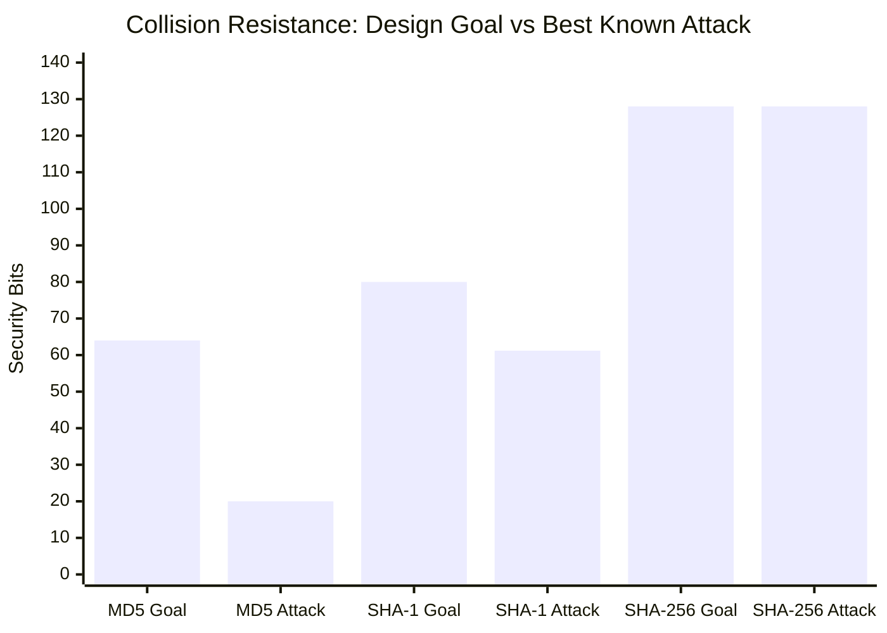

**Figure 2.3.** Security bit comparison showing MD5's catastrophic 44-bit collapse, SHA-1's ongoing erosion, and SHA-256's intact security margin. The visual contrast makes the "broken" status immediately apparent.

### 3. SHA-1

SHA-1 was designed by the NSA and published by NIST in 1995 (FIPS PUB 180-1) to address vulnerabilities in MD4 and MD5.

#### 3.0. The Transitional Standard

SHA-1 occupies a unique position in cryptographic history: the bridge between the broken MD5 era and the secure SHA-2 dominance. When the NSA designed SHA-1 in 1994, MD4 had already shown cryptographic weaknesses, and MD5's collision resistance was under active assault. The Federal government needed a hash function robust enough for digital signatures, certificate infrastructure, and classified document integrity—applications where failure would have national security implications.

The design was ambitious for its time: the first widely-deployed hash function with a 160-bit output, raising the theoretical collision resistance to $2^{80}$ operations. This 32-bit increase over MD5's 128-bit output seemed to buy decades of security margin. And for twenty years, it did: from 1995 to 2005, SHA-1 remained unbroken, enabling the early web's explosive growth.

**Ubiquity:** SHA-1 became the cryptographic backbone of the internet age:
- **Git:** Every commit, tree, and blob identified by SHA-1 hash (the "object ID" you see in `git log`)
- **PGP/GPG:** Key fingerprints and document signatures
- **TLS 1.0–1.2:** Certificate signatures and handshake validation
- **Code-signing:** Microsoft Authenticode, Apple code signatures
- **S/MIME:** Email encryption and authentication
- **Smart cards:** Government ID cards, banking tokens

By 2017, billions of devices trusted SHA-1 implicitly. When SHAttered broke that trust, the migration cost was measured in billions of dollars and years of coordinated industry effort.

<details>
<summary><strong>📎 Clarification: Why SHA-1's Differential Search Space Is Harder Than MD5's</strong></summary>

> Chapter 2 already introduced the mechanics of differential paths. The local question for SHA-1 is narrower: **why did essentially the same attack paradigm become materially less pliable when the target moved from MD5 to SHA-1?**
>
> The answer is that SHA-1 enlarges the attacker's constraint system along several independent axes at once:
>
> | Structural feature | MD5 | SHA-1 | Consequence for the attacker |
> |--------------------|-----|-------|-------------------------------|
> | State width | $4 \times 32 = 128$ bits | $5 \times 32 = 160$ bits | More simultaneous state differences must be coordinated |
> | Round count | 64 | 80 | Longer differential path to satisfy without collapse |
> | Message access | Direct cyclic reuse of 16 words | 80 derived schedule words | A local difference spreads into later rounds instead of staying localized |
> | Boolean structure | Four short segments with highly exploitable multiplexers early | 20-round segments with changing functions | No single local bias dominates the entire trail |
>
> The schedule expansion is especially important. In MD5, the attacker can often reason about a local perturbation in a message word as a sparse, position-specific event. In SHA-1, that same perturbation is recursively folded back into later schedule words:
>
> $$\Delta W_t = \text{ROTL}^{1}(\Delta W_{t-3} \oplus \Delta W_{t-8} \oplus \Delta W_{t-14} \oplus \Delta W_{t-16}).$$
>
> A difference introduced early therefore fans out into a dependency graph rather than remaining a mostly isolated lever. The search problem shifts from "cancel a few predictable local effects" toward "maintain a coherent trail across an expanding linear recurrence plus changing Boolean dynamics."
>
> | Informal attack question | MD5 | SHA-1 |
> |--------------------------|-----|-------|
> | Can a chosen $\Delta W_i$ remain locally controllable? | Often more so | Much less so |
> | Can the attacker revisit the same word positions cyclically? | Yes | No |
> | Does extra structure delay practical collisions? | Somewhat | Substantially, though not indefinitely |
>
> The correct lesson is therefore not that SHA-1 "solved" differential cryptanalysis. It is that SHA-1 forced the attacker to solve a substantially denser global bookkeeping problem, which bought time but not permanence.

</details>

#### 3.1. Differential Cryptanalysis Fundamentals

**Differential cryptanalysis** exploits predictable relationships between input differences ($\Delta_{\text{in}}$) and output differences ($\Delta_{\text{out}}$): when $\Delta_{\text{in}}$ leads to $\Delta_{\text{out}} = 0$ with probability significantly higher than random chance, the attacker has found a **differential path** that reduces collision search cost below the birthday bound. MD5's weak message schedule (cyclic word access, $W_{i \bmod 16}$) permitted Wang et al. to construct differential paths at cost $\sim 2^{41}$, while SHA-1's expansion function ($W_t = \text{ROTL}^{1}(W_{t-3} \oplus W_{t-8} \oplus W_{t-14} \oplus W_{t-16})$) forces attackers to consider exponentially more paths due to temporal spread and XOR diffusion — raising the attack complexity to $2^{69}$ (theoretical).

<details>
<summary><strong>🔧 Deep Dive: Why SHA-1's Message Schedule Resists MD5's Attack</strong></summary>

> **The core idea:** Instead of searching for collisions randomly (expecting $2^{n/2}$ attempts), differential cryptanalysis searches for structured input differences that propagate predictably through the compression function.
>
> ### Why MD5 Was Vulnerable
>
> MD5's message schedule accesses words cyclically: round $i$ uses word $W_{i \bmod 16}$. This creates predictable dependencies:
> - An attacker who introduces a difference $\Delta$ in $W_0$ knows exactly which rounds will "see" this difference (rounds 0, 16, 32, 48)
> - The 4-round cycle allows attackers to **cancel** differences strategically by introducing compensating differences in later words
> - Wang's team found differential paths where carefully-chosen input differences had high probability of producing zero output difference
>
> ### Why SHA-1 Resists This
>
> SHA-1's expansion function $W_t = \text{ROTL}^{1}(W_{t-3} \oplus W_{t-8} \oplus W_{t-14} \oplus W_{t-16})$ breaks predictability:
> - **No direct access:** You cannot "target" a specific round with a message word — the schedule words are derived, not direct
> - **XOR diffusion:** A difference in any input word affects multiple derived words through XOR, making propagation *unpredictable*
> - **Temporal spread:** The indices $t-3$, $t-8$, $t-14$, $t-16$ span 13 positions, ensuring each derived word depends on temporally distant inputs
>
> ### The Cost Calculation
>
> An attacker seeking a differential path must find a sequence of intermediate differences $(\Delta_0, \Delta_1, ..., \Delta_{80})$ through all 80 rounds, ensure each transition $\Delta_i \to \Delta_{i+1}$ has non-negligible probability, and account for message schedule dependencies constraining valid input differences. SHA-1's design raises the attack complexity from $2^{40}$ (MD5) to $2^{69}$ (theoretical SHA-1).

</details>


#### 3.2. Architectural Enhancements over MD5

SHA-1 uses Merkle-Damgård with 512-bit blocks but adds cryptographic strengthening designed to resist the differential cryptanalysis that would eventually break MD5:

1. **Expanded State:** 160 bits (five 32-bit words: $A, B, C, D, E$), raising collision resistance to $2^{80}$—a 32-bit security margin over MD5's 128-bit state
2. **More Rounds:** 80 operations per block vs MD5's 64, increasing diffusion depth
3. **Message Schedule:** The 16 message words expand to 80 via:

   $$W_t = \text{ROTL}^{1}(W_{t-3} \oplus W_{t-8} \oplus W_{t-14} \oplus W_{t-16})$$

##### 3.2.0. The Message Schedule: Diffusion Through Expansion

The message schedule expansion is SHA-1's most significant architectural improvement over MD5. In MD5, each round directly accesses one of the 16 message words—round $i$ uses $W_{i \bmod 16}$. This creates a vulnerability: an attacker who understands how differences propagate through rounds can predict which message bits influence which internal operations.

SHA-1 breaks this predictability by expanding 16 input words into 80 schedule words:

**Why Expansion Matters:**
- **Diffusion:** Each input bit influences multiple rounds. Word $W_0$ appears directly in round 0, then contributes (via XOR) to $W_{16}$, which feeds into $W_{32}$, $W_{48}$, and $W_{64}$. A single input bit cascades through 5+ round operations.
- **Non-linearity:** The XOR of four temporally-distant words ($t-3$, $t-8$, $t-14$, $t-16$) breaks linear relationships. If an attacker introduces a difference $\Delta$ in $W_0$, it doesn't propagate linearly to $W_{16}$—it combines with differences from $W_{13}$, $W_8$, $W_2$ in complex ways.
- **Round coverage:** With 80 schedule words for 80 rounds, every round uses a unique (derived) value, eliminating the cyclic reuse pattern MD5 exhibited.

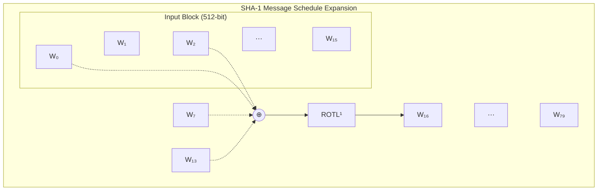

**Contrast with MD5:** MD5's direct word access allowed Wang's team to construct differential paths where specific bit differences canceled predictably. SHA-1's message schedule makes such paths exponentially harder to find—each schedule word depends on four predecessors, creating a dependency graph that defies simple analysis.


##### 3.2.1. Round Functions: Choose, Parity, and Majority

SHA-1 uses different Boolean functions per 20-round segment, each serving a distinct cryptographic purpose:

- **Steps 0–19:** $\text{Ch}(B, C, D) = (B \wedge C) \vee (\neg B \wedge D)$
- **Steps 20–39:** $\text{Parity}(B, C, D) = B \oplus C \oplus D$
- **Steps 40–59:** $\text{Maj}(B, C, D) = (B \wedge C) \vee (B \wedge D) \vee (C \wedge D)$
- **Steps 60–79:** $\text{Parity}(B, C, D) = B \oplus C \oplus D$

**Why Three Functions Instead of One?**

The function rotation serves multiple purposes:

1. **$\text{Ch}$ (Choose):** A *selection* function where $B$ acts as a multiplexer—when $B_i = 1$, output bit $i$ comes from $C$; when $B_i = 0$, it comes from $D$. This is identical to MD5's $F$ function in rounds 0-15, preserving proven mixing behavior.

2. **$\text{Parity}$:** The simplest possible non-linear mixing: XOR all three inputs. Every output bit depends on exactly three input bits with uniform probability. Maximum diffusion with minimum computational cost—a single CPU instruction on most architectures.

3. **$\text{Maj}$ (Majority):** A *voting* function where the output is 1 if at least two of three input bits are 1. This has superior cryptographic properties: it's "balanced" (equal probability of 0 and 1 outputs for random inputs) and highly non-linear. Cryptographers consider $\text{Maj}$ one of the strongest 3-bit Boolean functions.

The alternation between selection, parity, and voting functions creates different mixing dynamics in each 20-round segment. An attacker seeking differential paths must contend with three distinct function behaviors rather than exploiting patterns in a single repeated function.

##### 3.2.2. Rotation Constants: Why 5 and 30?

Each round applies two fixed rotations: $\text{ROTL}^5$ to register $A$ before the addition, and $\text{ROTL}^{30}$ to register $B$ after the state update. These constants are not arbitrary:

$$\gcd(5, 32) = 1 \quad \text{and} \quad \gcd(30, 32) = 2$$


The rotation by 5 is **relatively prime** to the 32-bit word size. This ensures that over repeated applications, every bit position cycles through all 32 positions. A bit that starts in position 0 will visit positions 5, 10, 15, 20, 25, 30, 3, 8, ... before returning to position 0 after 32 rotations.

The rotation by 30 (= $-2 \pmod{32}$) provides a complementary mixing pattern. Together, these rotations prevent bits from "clumping" in specific positions across the 80 rounds—a weakness that differential cryptanalysts could exploit.

##### 3.2.3. Compression Step

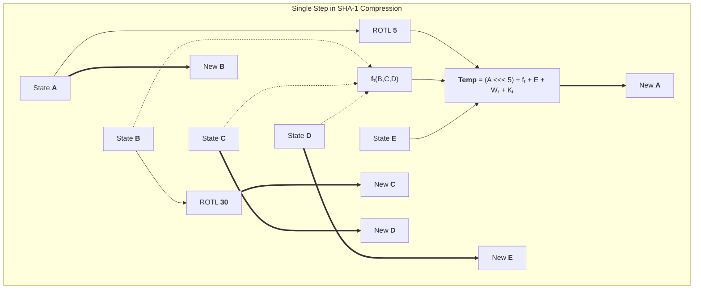

#### 3.3. From Theoretical to Practical Breaks

SHA-1's collapse followed the same trajectory as MD5: theoretical doubt, practical collision, then real-world exploitation. But the timeline stretched over 15 years—testament to SHA-1's stronger design.

##### 3.3.0. Wang's 2005 Attack: The Theory Breaks

In February 2005, Dr. Xiaoyun Wang's team demonstrated that SHA-1's collision resistance was not $2^{80}$ as designed, but approximately $2^{69}$ operations—a reduction of $2^{11}$ (about 2,000×). The attack exploited a critical weakness in SHA-1's early rounds.

**Message Modification Technique:**

Wang's innovation was *message modification*: the attacker tweaks message words *after* observing how differences propagate through early rounds. SHA-1's first 20 rounds use the $\text{Ch}$ function, which has known differential properties. By carefully selecting which bits to flip, Wang's team could suppress the "avalanche" that should have propagated differences unpredictably.

**Attack Complexity Reduction:**

$$\text{Design goal: } 2^{80} \xrightarrow{\text{Wang's attack}} 2^{69}$$

This was still impractical in 2005—$2^{69}$ operations would require years on the world's fastest supercomputers. But the psychological impact was immediate: SHA-1 was no longer "provably secure." NIST began planning SHA-2 migrations, and cryptographers intensified SHA-1 analysis.

##### 3.3.1. SHAttered (2017): The First Practical Collision

On February 23, 2017, researchers at CWI Amsterdam and Google announced SHAttered—the first practical SHA-1 collision. They produced two PDF files with different visual content but identical SHA-1 hashes:

**The Collision:**
- **File 1:** PDF displaying "SHAttered" on a red background
- **File 2:** PDF displaying "SHAttered" on a blue background
- **SHA-1 Hash (both):** `38762cf7f55934b34d179ae6a4c80cadccbb7f0a`

**Attack Parameters:**

| Metric | Value |
|--------|-------|
| Attack complexity | $2^{61.2}$ SHA-1 operations |
| CPU-equivalent time | ~6,500 CPU-years |
| GPU-equivalent time | ~110 GPU-years |
| Actual attack duration | ~2 months (distributed) |
| Compute cost estimate | ~$110,000 (cloud GPU rates) |
| Attack type | Identical-prefix collision |

These time and cost figures reflect the SHAttered team's published estimate for their 2017 attack configuration; they should be read as an order-of-magnitude benchmark rather than a hardware-independent constant.

**How the PDF Exploit Worked:**

The attack exploited PDF's structure: a PDF file contains a header, objects, and cross-reference tables. The researchers crafted two PDFs where the collision-producing differences were embedded in a JPEG comment field—an area invisible to users but processed during hashing.

<details>
<summary><strong>⚙️ Application: Verify the SHAttered Collision Yourself</strong></summary>

> The SHAttered researchers released both collision files publicly. You can verify the collision on any system with OpenSSL or `sha1sum`:
>
> ### Step 1: Download the Collision Files
>
> ```bash
> # Download both PDF files from the official SHAttered site
> wget https://shattered.io/static/shattered-1.pdf
> wget https://shattered.io/static/shattered-2.pdf
> ```
>
> ### Step 2: Verify Different Content
>
> ```bash
> # The files display different content (red vs blue background)
> xdg-open shattered-1.pdf &  # Opens "SHAttered" on red
> xdg-open shattered-2.pdf &  # Opens "SHAttered" on blue
> ```
>
> ### Step 3: Verify Identical SHA-1 Hashes
>
> ```bash
> # Using sha1sum
> sha1sum shattered-1.pdf shattered-2.pdf
> # Output:
> # 38762cf7f55934b34d179ae6a4c80cadccbb7f0a  shattered-1.pdf
> # 38762cf7f55934b34d179ae6a4c80cadccbb7f0a  shattered-2.pdf
>
> # Using OpenSSL
> openssl sha1 shattered-1.pdf
> openssl sha1 shattered-2.pdf
> ```
>
> ### Step 4: Verify Different SHA-256 Hashes
>
> The collision only works for SHA-1. SHA-256 produces different hashes:
>
> ```bash
> sha256sum shattered-1.pdf shattered-2.pdf
> # Output (truncated):
> # 2bb787a73e37352f91...  shattered-1.pdf
> # d23684d6a8da465a93...  shattered-2.pdf
> ```
>
> ### Why This Matters for Engineers
>
> This verification demonstrates a critical principle: **collision attacks are algorithm-specific**. A collision in SHA-1 does not translate to SHA-256, SHA-3, or BLAKE3. This is why multi-hash protocols (like Git's planned SHA-256 migration) can maintain security during transitions.
>
> ### The Collision Blocks Location
>
> The actual collision-inducing differences appear at byte offsets 320-383 in both files—the "collision blocks" that produce identical SHA-1 internal states. You can inspect them:
>
> ```bash
> # Extract collision blocks (bytes 320-383)
> dd if=shattered-1.pdf bs=1 skip=320 count=64 | xxd
> dd if=shattered-2.pdf bs=1 skip=320 count=64 | xxd
> ```

</details><br/>

1. Create a PDF template with attacker-controlled "collision blocks" near the beginning
2. Find two collision blocks $C_1$, $C_2$ such that $\text{SHA-1}(P \parallel C_1) = \text{SHA-1}(P \parallel C_2)$ for prefix $P$
3. Embed $C_1$ in one PDF, $C_2$ in another, with different visual content after the collision point
4. The hash function processes the collision blocks identically, then "forgets" the difference

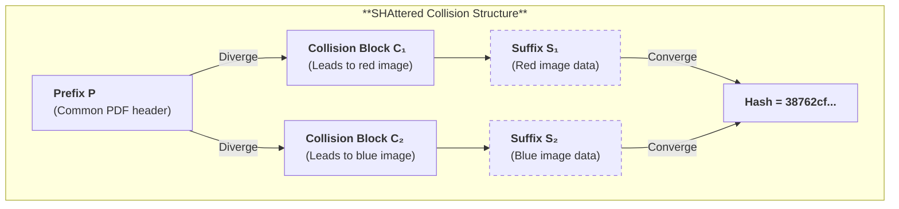

**Significance:** SHAttered proved that collision attacks had transitioned from academic exercises to practical attacks within reach of well-funded adversaries. A nation-state or large criminal organization could have replicated the attack years earlier in secret.

##### 3.3.2. SHAmbles (2020): The Chosen-Prefix Attack

SHAttered was an *identical-prefix* collision: both files share a common beginning, and the attacker finds collision blocks that make the hashes converge. But real-world attacks often require *chosen-prefix* collisions: given two *arbitrary* prefixes $P_1$ and $P_2$, find suffixes $S_1$ and $S_2$ such that:

$$\text{SHA-1}(P_1 \parallel S_1) = \text{SHA-1}(P_2 \parallel S_2)$$

In 2020, the SHAmbles attack achieved this at $2^{63.4}$ operations—cheaper than SHAttered despite being more flexible.

**Why Chosen-Prefix Is More Dangerous:**

| Attack Type | Attacker Controls | Practical Impact |
|-------------|-------------------|------------------|
| Identical-prefix | Collision blocks only | Must use attacker-crafted files |
| Chosen-prefix | Both prefixes and suffixes | Can forge arbitrary documents |

With chosen-prefix collisions, an attacker can:
- **Forge PGP keys:** Create two keys with different user IDs but the same fingerprint
- **Forge Git commits:** Create a commit with different content but the same SHA-1 object ID
- **Forge TLS certificates:** Create a certificate with different domain/keys but the same signature

**Attack Parameters:**

| Metric | Value |
|--------|-------|
| Attack complexity | $2^{63.4}$ SHA-1 operations |
| Estimated rental cost | ~$45,000 (authors' low-price cloud model) |
| Practical run profile | ~2 months on a large commodity-GPU cluster |
| Attack type | Chosen-prefix collision |

Leurent and Peyrin present the ~$45,000 figure as an aggressive rental-price estimate for chosen-prefix SHA-1 collisions; the paper's practical attack campaign used a longer, larger GPU run.

**Cost Reduction Trajectory:**

$$\text{2005: } \$10^{15} \text{ (theoretical)} \xrightarrow{\text{SHAttered}} \text{2017: } \$110,000 \xrightarrow{\text{SHAmbles}} \text{2020: } \$45,000$$

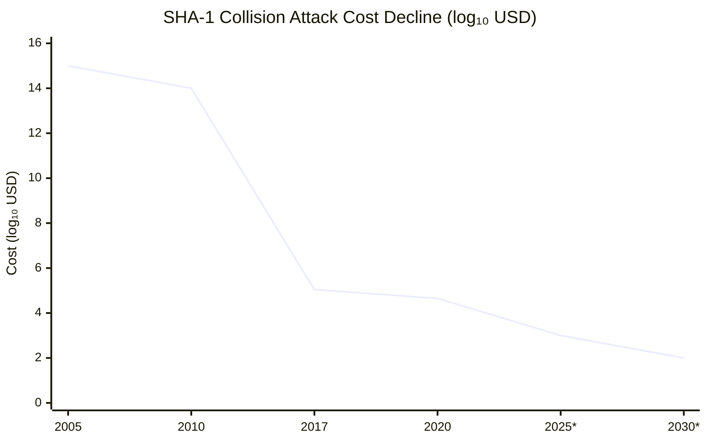

*Projected values (marked with *) extrapolate the trend line. The precipitous 10-order-of-magnitude drop from theoretical (2005) to practical (2017) demonstrates the second law of cryptanalysis: **attacks only get cheaper**.

At this trajectory, SHA-1 collisions will become trivially affordable by 2030. SHA-1 is dead for any security-sensitive application.

##### 3.3.3. The Migration Crisis

SHA-1's deprecation created the largest cryptographic migration in internet history. Unlike MD5, which was largely confined to certificate infrastructure, SHA-1 was embedded in:

**Git's SHA-1 Dependency:**

Git identifies every object (commit, tree, blob) by its SHA-1 hash. The `commit-hash` you see in `git log` is the SHA-1 of the commit object. This creates a *structural* dependency: changing the hash function requires re-hashing every object in the repository, breaking all signatures and references.

Git's migration to SHA-256 is ongoing:
- **2017:** Git 2.13 adds experimental SHA-256 support
- **2020:** Git introduces "interoperability" mode for gradual migration
- **Today:** Most repositories still use SHA-1; SHA-256 adoption is slow

The challenge: a SHA-1 collision in Git allows an attacker to create two different commits with the same ID. If you pull from an untrusted source, they could substitute a malicious commit that appears identical to the legitimate one.

**TLS and Browser Deprecation:**

| Year | Browser Action |
|------|----------------|
| 2014 | Chrome starts rejecting SHA-1 certificates expiring after 2016 |
| 2015 | Firefox, Safari follow Chrome's lead |
| 2017 | All major browsers distrust SHA-1 certificates entirely |
| Today | TLS 1.3 mandates SHA-256; SHA-1 only in legacy TLS 1.2 |

**Code-Signing Deprecation:**

- **Microsoft:** Authenticode stopped accepting SHA-1 signatures in 2016
- **Apple:** macOS 10.15 (2019) rejects SHA-1 code signatures
- **Driver signing:** Windows requires SHA-256 for kernel drivers

**The Technical Debt Lesson:**

Cryptographic migrations take *years*. SHA-1 was theoretically broken in 2005, yet 15 years later, Git still relies on it. Systems that hardcode hash functions create technical debt that compounds over time. Modern protocols (TLS 1.3, JWT) include algorithm negotiation precisely to avoid this trap.

##### 3.3.4. The Deprecation Timeline

| Year | Event | Impact |
|------|-------|--------|
| 1995 | SHA-1 published (FIPS 180-1) | Becomes federal standard |
| 2005 | Wang's attack ($2^{69}$) | Theoretical vulnerability proven |
| 2012 | NIST SP 800-131A recommends against SHA-1 | Federal agencies begin migration |
| 2014 | Chrome rejects SHA-1 certificates (2017+ expiry) | Industry deprecation begins |
| 2015 | CA/Browser Forum phases out SHA-1 | CAs stop issuing SHA-1 certificates |
| 2017 | SHAttered collision published | Practical attack demonstrated |
| 2017 | All browsers distrust SHA-1 certificates | Web PKI migration complete |
| 2020 | SHAmbles chosen-prefix attack | Forgery attacks become affordable |
| Today | SHA-1 deprecated everywhere except legacy Git | Migration ~95% complete |

> **Warning:** SHA-1 is cryptographically broken. Do not use for digital signatures, certificate issuance, password storage, or any security-sensitive application. Use SHA-256 (minimum) or SHA-3/BLAKE3 for new systems.

<details>
<summary><strong>📎 Clarification: Why Collision Failure Forced Migration Before Any Pre-image Break</strong></summary>

> SHA-1 was not retired because attackers learned how to invert arbitrary digests into original messages. It was retired because the most operationally important deployments did not depend on pre-image resistance in the first place; they depended on the inability to produce *two different structured artifacts with one valid digest*.
>
> The deployment question is therefore property-specific:
>
> | Deployment | Security property that fails first | Why collision-style attacks already suffice |
> |------------|------------------------------------|---------------------------------------------|
> | X.509 certificates and code-signing | Chosen-prefix collision resistance | A signature on one structured artifact can be transplanted to another artifact with the same digest |
> | Git / content-addressed storage under attacker influence | Collision resistance plus object-framing discipline | Two different objects can be engineered to share one identifier |
> | Timestamped or notarized documents | Collision resistance | A benign document and a malicious substitute can be bound to the same notarized digest |
> | Password hashing | Neither collision nor pre-image is the main issue | Fast unsalted hashing is already the wrong security model |
>
> For signed artifacts, the critical equation is
>
> $$\text{Sig}_{sk}(H(M_{\text{benign}})) = \text{Sig}_{sk}(H(M_{\text{rogue}})) \quad \text{whenever} \quad H(M_{\text{benign}})=H(M_{\text{rogue}}).$$
>
> Once the hash layer admits attacker-steered digest equality, the signature layer can authenticate the wrong semantics without ever being mathematically "forged." That is why browser vendors, certificate authorities, and software-signing ecosystems had to retire SHA-1 even though no general pre-image break existed.
>
> The migration trigger was therefore not "the whole hash function is invertible." It was the narrower but already decisive fact that the collision property protecting identity, binding, and non-substitutability had fallen below the operational threshold required by real systems.

</details><br/>

<details>
<summary><strong>📜 Historical: The Coordinated SHA-1 Browser Deprecation (2014–2020)</strong></summary>

> Browser deprecation mattered because it transformed a cryptanalytic result into a user-visible trust failure: the abstract weakness became an immediately broken lock icon, interstitial warning, and issuance ban.
>
> ### The Chrome Graduated Warning Campaign
>
> Google Chrome led the SHA-1 deprecation with a **graduated visual warning system** — the most aggressive browser-driven cryptographic migration to date:
>
> | Chrome Version | Date | Action |
> |:-----------:|------|--------|
> | 39 | Nov 2014 | Yellow warning triangle on SHA-1 certs expiring after 2016 |
> | 40 | Jan 2015 | "Affirmatively insecure" (red X) for SHA-1 certs expiring after 2017 |
> | 42 | Apr 2015 | Warning on *all* SHA-1 certificates regardless of expiry |
> | 56 | Jan 2017 | SHA-1 certificates treated as untrusted; interstitial warning |
>
> This graduated approach gave enterprises time to migrate while creating increasing urgency. The visual degradation (green → yellow → red padlock) was remarkably effective at driving administrator action.
>
> ### Other Browsers
>
> - **Firefox 51** (Jan 2017): Full SHA-1 distrust with override-able interstitial
> - **Edge** (Feb 2017): Followed Chrome's timeline
> - **Safari** (macOS Sierra, Sep 2016): Rejected SHA-1 certificates in Apple's trust store
>
> ### The CA/Browser Forum Baseline Requirements
>
> The **CA/Browser Forum Ballot 118** (Oct 2014) formalized the industry-wide deprecation:
> - CAs prohibited from issuing SHA-1 certificates after **January 1, 2016**
> - Existing SHA-1 certificates permitted until natural expiry
> - No SHA-1 certificate allowed to have an expiry date beyond **January 1, 2017**
>
> This governance mechanism ensured that even if browsers continued accepting SHA-1, no *new* SHA-1 certificates could be created — a supply-side shutdown complementing the browser's demand-side warnings.
>
> ### The Long Tail: Edge Cases That Delayed Full Removal
>
> - **Embedded systems** (ATMs, medical devices, industrial SCADA) with 10–20 year lifespans and non-upgradeable firmware continued to present SHA-1 certificates
> - **Government PKI** in several countries maintained SHA-1 root CAs for legacy interoperability
> - **Enterprise environments** with internal CAs and SHA-1-only hardware security modules (HSMs)
> - **Symantec's delayed migration** (eventually resulting in their entire CA business being distrusted by Chrome in 2018)
>
> These edge cases meant that while the web PKI migration was ~95% complete by 2017, full SHA-1 elimination in private/enterprise PKI wasn't achieved until 2020+.

</details>

#### 3.4. Why SHA-1 Resisted Longer Than MD5

SHA-1 survived 12 years longer than MD5 against collision attacks (2005 vs 2004). This wasn't luck—it was deliberate architectural hardening:

1. **Message schedule diffusion:** Each input bit in SHA-1 influences 80 rounds through the expanded message schedule (vs MD5's direct word access to 64 rounds). Attackers seeking differential paths must account for the XOR-dependencies across the entire 80-word schedule.

2. **5-word state (160 bits):** Differential cryptanalysis requires controlling differences across all state words. SHA-1's 160-bit state presents $2^{32}$ more combinations to control than MD5's 128-bit state—a significant barrier to practical attacks.

3. **Stronger round functions:** The $\text{Maj}$ (Majority) and $\text{Parity}$ functions have better cryptographic properties than MD5's $I$ function. The alternating function pattern (Ch → Parity → Maj → Parity) creates different mixing dynamics that resist uniform analysis.

4. **Rotation constants:** The relatively-prime rotation of 5 ensures maximum bit diffusion across 32-bit word boundaries, preventing bit-position clustering that could simplify differential analysis.

**But still Merkle-Damgård:** SHA-1 inherited the length-extension vulnerability from MD5. The final hash *is* the internal state, enabling the same forgery attacks on naive MAC constructions.

<details>
<summary><strong>🔧 Deep Dive: Why State Size Exponentially Increases Attack Complexity</strong></summary>

> SHA-1's 160-bit state (vs MD5's 128-bit) wasn't just "more bits"—it fundamentally changed the attack mathematics. Here's why:
>
> ### The Birthday Bound and Collision Resistance
>
> For an ideal hash function with $n$-bit output, finding a collision requires approximately $2^{n/2}$ operations (the birthday bound):
>
> $$\text{MD5 (128-bit): } 2^{64} \text{ operations}$$
> $$\text{SHA-1 (160-bit): } 2^{80} \text{ operations}$$
>
> This 16-bit increase raises the birthday bound by $2^{16} = 65,536\times$.
>
> ### Differential Cryptanalysis State Complexity
>
> For differential attacks, the state size matters differently. The attacker must control differences across *all state words simultaneously*:
>
> - **MD5:** 4 words × 32 bits = 128 bits of state to control
> - **SHA-1:** 5 words × 32 bits = 160 bits of state to control
>
> Each additional word introduces $2^{32}$ more possible difference patterns. The attack complexity scales with the *combinations* of differences:
>
> $$\text{State difference combinations: } 2^{32 \times (\text{number of words})}$$
>
> Adding a fifth word increases combinations by factor of $2^{32}$ (about 4 billion).
>
> ### Why MD5 Fell First: The 4-Word Vulnerability
>
> Wang's MD5 attack exploited the 4-word structure directly:
>
> 1. Introduce difference $\Delta$ in one input message
> 2. Track how $\Delta$ propagates through words $A, B, C, D$
> 3. Find "cancellation" conditions where differences in multiple words sum to zero
>
> With only 4 words, the cancellation equations are tractable. With 5 words (SHA-1), the system of equations becomes significantly more constrained—attackers must satisfy more conditions simultaneously.
>
> ### The Mathematics of Constraint Propagation
>
> SHA-1's compression function has the form:
>
> $$E_{\text{new}} = D, \quad D_{\text{new}} = C, \quad C_{\text{new}} = \text{ROTL}^{30}(B), \quad B_{\text{new}} = A, \quad A_{\text{new}} = \text{ROTL}^5(A) + f_t(B,C,D) + E + W_t + K_t$$
>
> A difference in any word propagates to *three* other words in the next round (via the feedback paths). With 5 words, the dependency graph has higher connectivity, making it harder to find "stable" differential paths where differences cancel cleanly.
>
> ### The 12-Year Gap Explained
>
> | Factor | MD5 | SHA-1 | Impact |
> |--------|-----|-------|--------|
> | State words | 4 | 5 | $2^{32}\times$ more combinations |
> | Rounds | 64 | 80 | $2^{16}\times$ more path segments |
> | Message schedule | Direct | Expanded | Exponentially harder differential analysis |
> | Birthday bound | $2^{64}$ | $2^{80}$ | $2^{16}\times$ more operations needed |
>
> Combined, these factors explain why MD5 fell in 2004 and SHA-1 took until 2017—a 13-year gap that bought critical time for SHA-2 adoption.

</details><br/>

**The fundamental lesson:** More rounds and larger state *help*, but architectural foundations matter more. SHA-1's 20-year resistance bought time for SHA-2 adoption, but Merkle-Damgård's inherent weaknesses made eventual collapse inevitable. This is why SHA-3 uses the Sponge construction—an entirely different architecture with different attack surfaces.

<details>
<summary><strong>⚙️ Application: Git's SHA-1 → SHA-256 Migration</strong></summary>

> Git is the most visible example of a system whose identifiers are not merely "hashed values" but the primary referential vocabulary of the platform, so its migration illustrates why post-break replacement remains operationally expensive.
>
> ### The Problem
>
> Git's entire object model is built on SHA-1: every commit, tree, blob, and tag is identified by its SHA-1 hash. The SHAttered collision (2017) demonstrated that chosen-prefix attacks on SHA-1 are practical — an attacker could theoretically craft two different files with the same Git object ID.
>
> ### Current Defenses
>
> Git added **collision detection** (based on the SHAttered researchers' detection code) to its `transfer.fsckObjects` validation pipeline. When receiving objects via `git push` or `git fetch`, Git checks whether the object matches known collision patterns:
>
> ```bash
> # Enable on servers to reject objects matching known collision patterns
> git config transfer.fsckObjects true
> git config receive.fsckObjects true
> ```
>
> This is a **stopgap**, not a solution — it detects known collision techniques but not future novel attacks.
>
> ### The SHA-256 Migration (GIT_HASH_ALGO)
>
> Git 2.29+ (2020) introduced experimental SHA-256 support via the `objectformat` extension:
>
> ```bash
> # Create a new SHA-256 repository
> git init --object-format=sha256
>
> # Check current hash algorithm
> git rev-parse --show-object-format
> ```
>
> **Migration challenges:**
>
> | Challenge | Impact | Status (2024) |
> |-----------|--------|:-------------:|
> | Object IDs change | Every reference (commit hashes, tags) becomes different | Solved (bidirectional mapping) |
> | Packfile format | Wire protocol must negotiate hash algorithm | Solved (protocol v2) |
> | Ecosystem tooling | GitHub, GitLab, CI/CD — all assume SHA-1 object IDs | ⚠️ Partial (GitHub in progress) |
> | Interop: SHA-1 ↔ SHA-256 | Remotes may use different algorithms | ⚠️ Experimental |
> | History rewriting | Migrating existing repos requires recomputing all objects | ❌ No automated path |
>
> **Timeline:** The migration is incremental. New repositories can opt into SHA-256, but the Git ecosystem (GitHub, GitLab, Bitbucket) must converge before it becomes the default. Full transition is expected to take 5–10 years.

</details>

<details>
<summary><strong>⚙️ Application: Git Object Identity, Collision Risk, and Migration Pressure</strong></summary>

> The cryptographic heart of Git is not "hash the file contents." Git hashes a **typed, length-bound object serialization**:
>
> ```text
> object = type || " " || decimal_length || NUL || content
> oid    = SHA-1(object)
> ```
>
> For a blob containing `hello\n`, the object hashed is conceptually:
>
> ```text
> "blob 6\0hello\n"
> ```
>
> ### System artifact and walkthrough
>
> This framing does important semantic work:
>
> | Component | Why it is present |
> |-----------|-------------------|
> | `type` | Separates blobs, trees, commits, and tags into different namespaces |
> | `decimal_length` | Prevents boundary ambiguity about how much content is part of the object |
> | `NUL` separator | Makes the header/content split unambiguous |
> | `content` | The actual payload committed by the object ID |
>
> That design means a tree object and a blob with the same raw payload bytes do **not** collide trivially at the object-model level, because the framed byte strings differ before hashing.
>
> ### Cryptographic property in play
>
> Git therefore relies on **two distinct layers of safety**:
>
> 1. **Structural framing** prevents parsing ambiguity and cross-type confusion.
> 2. **Collision resistance** preserves the claim that one object ID names one semantic object.
>
> In mathematical shorthand:
>
> $$\text{identity integrity} = \text{unambiguous serialization} + \text{strong collision resistance}. $$
>
> The first term stops accidental namespace collapse. The second stops a malicious actor from crafting
>
> $$O_1 \neq O_2 \quad \text{with} \quad H(O_1) = H(O_2),$$
>
> where both $O_1$ and $O_2$ are valid Git objects.
>
> ### What breaks if done wrong
>
> Framing alone is not enough. Once SHA-1 collision attacks became credible, Git could no longer rely on "well-structured objects" as a substitute for a strong digest. A collision-crafted repository object would threaten exactly the property users care about most: that a commit hash, tree hash, or blob hash is a trustworthy content identifier.
>
> | Defense | What it stops | What it does **not** stop |
> |---------|---------------|---------------------------|
> | Object framing | Type confusion, boundary ambiguity | Deliberate same-hash different-object attacks |
> | Collision detection stopgaps | Known published collision techniques | Future or unpublished collision constructions |
> | SHA-256 migration | Restores practical collision margin | Does not remove migration cost across the ecosystem |
>
> This is why Git's migration pressure is so instructive. The platform already had thoughtful object framing, yet it still had to move because content-addressed identity is only as strong as the underlying hash. The broader engineering lesson is:
>
> $$\text{good framing reduces ambiguity; good hashes preserve identity.}$$
>
> Systems that need durable object identity cannot afford to treat those as interchangeable responsibilities.

</details>

<details>
<summary><strong>📜 Historical: The Decade-Long SHA-1 Sunset (2005–2017)</strong></summary>

> The cryptographic deprecation of SHA-1 was announced in 2005, but the last major holdouts didn't migrate until 2017 — a 12-year gap that reveals how institutional inertia, backward compatibility, and economic incentives delay cryptographic transitions even when the threat is well-understood.
>
> ### Timeline
>
> | Year | Event | Actor |
> |:----:|-------|-------|
> | 2005 | Wang et al. demonstrate theoretical SHA-1 collision attack ($2^{69}$ operations) | Academic |
> | 2006 | NIST recommends transitioning to SHA-2 by 2010 for federal systems | NIST |
> | 2011 | NIST formally deprecates SHA-1 for digital signatures (SP 800-131A) | NIST |
> | 2014 | Google announces Chrome will progressively distrust SHA-1 certificates: yellow warning → red warning → full block over 3 releases | Google |
> | 2014 | Microsoft announces Windows will block SHA-1 TLS certificates after January 1, 2017 | Microsoft |
> | 2015 | Mozilla announces Firefox will reject SHA-1 certificates after January 1, 2016 (later extended to January 2017) | Mozilla |
> | 2015 | **CA/Browser Forum Ballot 152**: All certificate authorities must stop issuing SHA-1 certificates after January 1, 2016 | CA/B Forum |
> | 2016 | Symantec caught issuing SHA-1 certificates after the deadline; forced to revoke | Symantec |
> | 2017 | Chrome 56, Firefox 51, Edge: SHA-1 certificates produce fatal errors (not just warnings) | Browsers |
> | 2017 | **SHAttered** published — first practical SHA-1 collision ($2^{63.1}$ operations, ~110 GPU-years) | Google/CWI |
> | 2020 | **SHAmbles** chosen-prefix collision ($2^{63.4}$; authors estimate ~$45K at low rental prices, with a longer practical GPU campaign) | Leurent/Peyrin |
> | 2025 | Git ecosystem still transitioning to SHA-256; many legacy systems retain SHA-1 for non-security uses | Git |
>
> ### Why It Took 12 Years
>
> **1. The "Not Broken Enough" Problem:**
> From 2005 to 2017, SHA-1 was theoretically weakened but not *practically* broken. Security teams argued that $2^{69}$ operations was beyond any attacker's budget. This created a false sense of safety — organizations deprioritized migration because the threat felt abstract. The SHAttered attack ($2^{63.1}$ operations, with the authors estimating roughly $110,000 in cloud GPU time) shattered this complacency, but by then the deadline had already been set by browser vendors.
>
> **2. Certificate Pinning Made Migration Dangerous:**
> Many mobile applications and embedded devices used **certificate pinning** — hardcoding the expected certificate hash. Rotating certificates from SHA-1 to SHA-256 broke pinned connections, causing application failures. Organizations had to coordinate certificate rotation with all downstream consumers, a process that could take months per application.
>
> **3. Legacy Client Compatibility:**
> SHA-256 certificate support required TLS libraries from approximately 2008+. Older systems (Windows XP SP2, Android 2.x, Java 6, embedded IoT devices) could not validate SHA-256 certificates. Organizations serving these clients faced a choice: maintain security or maintain compatibility. Most chose compatibility until browser vendors forced the issue.
>
> **4. The CA Revenue Model:**
> Certificate Authorities had financial incentives to delay: SHA-1 certificates were already issued in bulk with multi-year validity periods. Early deprecation meant early revocation, refunds, and reissuance costs. The CA/Browser Forum's binding ballot (Ballot 152) was necessary precisely because voluntary migration was too slow.
>
> ### The Role of Browser Vendors as Forcing Functions
>
> The SHA-1 deprecation succeeded not because organizations migrated voluntarily, but because **browser vendors set non-negotiable deadlines**. Google's Chrome team was the primary forcing function:
>
> - **Chrome 39** (November 2014): SHA-1 certificates expiring after 2016 showed a yellow "degraded" lock icon
> - **Chrome 40** (January 2015): SHA-1 certificates expiring after 2016 showed a red "broken" lock icon
> - **Chrome 41** (March 2015): SHA-1 certificates expiring after 2017 showed a yellow warning
> - **Chrome 56** (January 2017): All SHA-1 certificates produced a fatal `NET::ERR_CERT_WEAK_SIGNATURE_ALGORITHM` error
>
> This graduated approach gave organizations 2+ years of warnings before the hard cutoff. The lesson: **cryptographic deprecation requires enforcement, not just recommendation.** NIST's 2006 recommendation was ignored for 8 years; Chrome's 2014 deadline was met within 3 years.
>
> ### Lessons for Future Migrations
>
> The SHA-1 sunset provides a template for the upcoming SHA-2 → post-quantum transition:
>
> 1. **Set hard deadlines early** — advisory deprecations are routinely ignored
> 2. **Graduate enforcement** — warnings before errors give organizations migration time
> 3. **Mandate algorithm agility** — systems that negotiated hash algorithms (TLS 1.2+) migrated smoothly; hardcoded systems required emergency patches
> 4. **Budget for long tails** — even with aggressive timelines, embedded/IoT systems may run deprecated algorithms for 5–10 years after the official sunset

</details>

### 4. The SHA-2 Family (SHA-256/SHA-512)

#### 4.0. Why SHA-2 Survived Without Changing the Architecture

SHA-2 was designed by the NSA in 2001 (FIPS 180-2), incorporating hard-won lessons from the differential cryptanalysis that broke MD5 and would later break SHA-1. It represents the culmination of two decades of Merkle-Damgård expertise: larger state, more rounds, denser mixing functions, and transparent constants derived from mathematical sources rather than agency-chosen values.

The result is a 25-year unbroken security record. Every HTTPS connection in TLS 1.3, every Bitcoin block hash, every software update signature, and every JSON Web Token relies on SHA-2. It is the cryptographic backbone of the modern internet.

The family includes **SHA-256** (32-bit words, 256-bit output, 64 rounds) and **SHA-512** (64-bit words, 512-bit output, 80 rounds). Both share the same compression structure but operate on different word sizes, making SHA-512 significantly faster on 64-bit systems.

The crucial nuance is that SHA-2 did **not** replace Merkle-Damgård. It retained the same broad iteration framework while fixing the specific algorithmic weaknesses that broke MD5 and SHA-1:

- **Inherited from SHA-1:** iterative Merkle-Damgård processing, Davies-Meyer-style feedforward, deterministic padding, and exposed final chaining value
- **Improved over SHA-1:** wider state, stronger message schedule, denser Boolean mixing, more rounds, and transparent nothing-up-my-sleeve constants
- **Did not fix:** length-extension, multicollision-style structural weaknesses, and the lack of random-oracle indifferentiability for raw Merkle-Damgård

This is why SHA-2 occupies a very specific historical position. It is the **successful endpoint of the classic Merkle-Damgård lineage**, not the architectural break from it. That architectural break arrives later with the sponge construction.

<details>
<summary><strong>📎 Clarification: Why SHA-2 Belongs to the Davies-Meyer Lineage Without Being Literal Davies-Meyer</strong></summary>

> Chapter 1 already introduced classical Davies-Meyer as the feedforward pattern
>
> $$h_i = E_{m_i}(h_{i-1}) \oplus h_{i-1},$$
>
> where a permutation-like primitive is converted into a one-way compression step by mixing the incoming chaining value back into the output. SHA-2 should be read as inheriting that **architectural idea**, not as instantiating the textbook block-cipher construction literally.
>
> | Aspect | Classical Davies-Meyer | SHA-256 / SHA-512 compression |
> |--------|------------------------|-------------------------------|
> | Core primitive | Block cipher / keyed permutation $E_m$ | Bespoke ARX-style round network with schedule words and constants |
> | Feedforward operation | XOR with prior chaining value | Word-wise modular addition of the prior chaining state after the round function |
> | Security role of feedforward | Prevents trivial inversion of a raw permutation output | Prevents the working variables from standing alone as an invertible state transform |
>
> The family resemblance matters because the same high-level consequences survive:
>
> | Inherited design choice | Consequence in SHA-2 |
> |-------------------------|----------------------|
> | Iterated Merkle-Damgård chaining | Security still depends on repeated public state updates |
> | Feedforward into the chaining state | The compression output is entangled with the previous state rather than exposed as a bare permutation result |
> | Published final chaining value (or a truncation of it) | Construction-level questions such as length extension and state reusability remain central |
>
> The practical takeaway is that SHA-2 is not "a block cipher turned into a hash" in the narrow textbook sense. It is a dedicated hash compression family that preserves the same feedforward philosophy and therefore inherits many of the same structural strengths and weaknesses of the Merkle-Damgård / Davies-Meyer era.

</details>

#### 4.1. Core Mechanics and Sigma Functions

SHA-2 is the most refined Merkle-Damgård design. The internal state is 8 words (256 or 512 bits).

The compression function uses **Sigma Functions** combining rotations, shifts, and XOR:

##### 4.1.0. The Round Constants: Nothing-Up-My-Sleeve

SHA-256 uses 64 round constants $K_0^{(256)}, \ldots, K_{63}^{(256)}$, each derived from the cube roots of the first 64 prime numbers:

$$K_i = \lfloor 2^{32} \times \sqrt[3]{\text{prime}_i} \rfloor \mod 2^{32}$$

where $\text{prime}_i$ denotes the $(i+1)$-th prime (2, 3, 5, 7, 11, ...). For example:

- $K_0 = \lfloor 2^{32} \times \sqrt[3]{2} \rfloor = \texttt{0x428a2f98}$
- $K_1 = \lfloor 2^{32} \times \sqrt[3]{3} \rfloor = \texttt{0x71374491}$
- $K_{63} = \lfloor 2^{32} \times \sqrt[3]{311} \rfloor = \texttt{0xc67178f2}$

These are **"nothing-up-my-sleeve" numbers**—mathematical constants that anyone can verify. If the NSA had embedded a backdoor, they would need to manipulate the constants in a way that creates a hidden attack path. But the constants are fully determined by the cube roots of primes; there is no room for manipulation.

> **Contrast with SHA-1:** SHA-1 used only 4 constants (0x67452301, 0xEFCDAB89, 0x98BADCFE, 0x10325476) that were "chosen" by the NSA with no public justification. While no backdoor was ever found, the lack of transparency fueled suspicion. SHA-2's 64 publicly-derived constants eliminate this concern entirely.

SHA-512 uses the same formula with $2^{64}$ instead of $2^{32}$, deriving its 80 constants from the cube roots of the first 80 primes.

##### 4.1.1. SHA-256 Logical Primitives

SHA-256 uses 64 rounds with six core operations:

- **$\text{Ch}(x,y,z)$** = $(x \wedge y) \oplus (\neg x \wedge z)$
- **$\text{Maj}(x,y,z)$** = $(x \wedge y) \oplus (x \wedge z) \oplus (y \wedge z)$
- **$\Sigma_0(x)$** = $\text{ROTR}^{2}(x) \oplus \text{ROTR}^{13}(x) \oplus \text{ROTR}^{22}(x)$
- **$\Sigma_1(x)$** = $\text{ROTR}^{6}(x) \oplus \text{ROTR}^{11}(x) \oplus \text{ROTR}^{25}(x)$
- **$\sigma_0(x)$** = $\text{ROTR}^{7}(x) \oplus \text{ROTR}^{18}(x) \oplus \text{SHR}^{3}(x)$ *(message schedule)*
- **$\sigma_1(x)$** = $\text{ROTR}^{17}(x) \oplus \text{ROTR}^{19}(x) \oplus \text{SHR}^{10}(x)$ *(message schedule)*

This dense combination of modular addition, rotations, and XOR defeats the differential attack paths used against earlier algorithms.

**Why These Specific Rotation Amounts?** The rotation values in $\Sigma_0$ (2, 13, 22) and $\Sigma_1$ (6, 11, 25) are not arbitrary. They are chosen to maximize **diffusion**—ensuring each input bit influences many output bits through different paths:

1. **No rotation is a multiple of another** — This prevents simple patterns where bits align predictably after multiple rounds
2. **The combined XOR creates complex non-linear mixing** — A single input bit affects multiple output bit positions simultaneously
3. **The sums avoid 32** — Since SHA-256 uses 32-bit words, rotations of 2 and 30 would be equivalent (30 = 32 - 2). The chosen values are all distinct modulo 32

<details>
<summary><strong>🔧 Deep Dive: The Mathematics of Diffusion in Sigma Functions</strong></summary>

> The rotation values in SHA-256's $\Sigma$ and $\sigma$ functions aren't arbitrary—they're carefully selected to maximize **avalanche effect**. Here's why they work:
>
> ### The XOR-of-Three-Rotations Pattern
>
> Each Sigma function XORs three rotated versions of the input:
>
> $$\Sigma_0(x) = \text{ROTR}^{2}(x) \oplus \text{ROTR}^{13}(x) \oplus \text{ROTR}^{22}(x)$$
>
> For a single input bit at position $i$, the output affects positions:
> - $(i + 2) \mod 32$
> - $(i + 13) \mod 32$
> - $(i + 22) \mod 32$
>
> After multiple rounds, each bit propagates through an expanding tree of influenced positions.
>
> ### Why Three Rotations?
>
> Two rotations would create predictable XOR patterns. Three rotations with coprime spacing ensures:
>
> 1. **No cancellation** — The three values can't XOR to zero for non-zero input
> 2. **Maximum spread** — The set $\{2, 13, 22\}$ has no common divisor with 32, ensuring coverage
> 3. **Non-linear interaction** — Combined with `Ch` and `Maj`, the functions resist linear cryptanalysis
>
> ### Diffusion Speed Analysis
>
> | Rounds | Affected Bits (from single input bit) |
> |--------|--------------------------------------|
> | 1 | ~6 bits |
> | 4 | ~40 bits |
> | 8 | All 256 state bits |
> | 24 | Full diffusion with high multiplicity |
>
> SHA-256's 64 rounds provide **8× the minimum** needed for full diffusion—a substantial security margin.
>
> ### Contrast with SHA-1's Weaker Diffusion
>
> SHA-1 used only two rotation amounts (5 and 30) in its round function. The limited diffusion was one factor enabling differential attacks:
>
> $$\text{SHA-1: } f(B,C,D) \text{ with } \text{ROTL}^5(A) + \ldots$$
> $$\text{SHA-256: } \Sigma_0(A) + \Sigma_1(E) + \text{Ch} + \text{Maj} + \ldots$$
>
> SHA-256's multi-path mixing makes finding differential trails exponentially harder.

</details>
<br/>

> **Contrast with SHA-1:** SHA-1's round function used simple rotations of 5, 30, and 30 bits—much less diffusion, and one of the attack vectors that broke it.

##### 4.1.2. The Message Schedule: Expansion from 16 to 64 Words

SHA-256's compression function requires 64 message words ($W_0$ through $W_{63}$), but each 512-bit block contains only 16 words ($W_0$ through $W_{15}$). The remaining 48 words are **derived** using the message schedule expansion:

$$W_i = W_{i-16} + \sigma_0(W_{i-15}) + W_{i-7} + \sigma_1(W_{i-2}) \quad \text{for } i = 16, \ldots, 63$$

This expansion is cryptographically critical: every derived word depends on **four** earlier words through non-linear transformations, creating a dependency graph that resists differential analysis.

```mermaid
---
config:
  flowchart:
    htmlLabels: true
---
flowchart LR
    subgraph Input["<b>Original Message Block (16 words)</b>"]
        direction LR
        W0["`W₀`"]
        W1["`W₁`"]
        W2["`W₂`"]
        W7["`W₇`"]
        W14["`W₁₄`"]
        W15["`W₁₅`"]
        dots1["`...`"]
        dots2["`...`"]
        
        W0 ~~~ W1 ~~~ W2 ~~~ dots1 ~~~ W7 ~~~ dots2 ~~~ W14 ~~~ W15
    end
    
    subgraph Expansion["<b>Message Schedule Expansion</b>"]
        direction TB
        sigma0["`**σ₀**(Wᵢ₋₁₅)
        ROTR⁷⊕ROTR¹⁸⊕SHR³`"]
        sigma1["`**σ₁**(Wᵢ₋₂)
        ROTR¹⁷⊕ROTR¹⁹⊕SHR¹⁰`"]
        add1(("`+`"))
        add2(("`+`"))
        add3(("`+`"))
        
        sigma0 --> add1
        add1 --> add2
        add2 --> add3
        sigma1 --> add3
    end
    
    subgraph Derived["<b>Derived Words (48 new words)</b>"]
        direction LR
        W16["`W₁₆`"]
        W17["`W₁₇`"]
        W31["`W₃₁`"]
        W47["`W₄₇`"]
        W63["`W₆₃`"]
        dots3["`...`"]
        dots4["`...`"]
        dots5["`...`"]
        
        W16 ~~~ W17 ~~~ dots3 ~~~ W31 ~~~ dots4 ~~~ W47 ~~~ dots5 ~~~ W63
    end
    
    W15 --> sigma0
    W2 --> sigma1
    W16 -.->|Wᵢ₋₁₆| add1
    W7 -.->|Wᵢ₋₇| add2
    
    add3 --> W16
    
    W14 -.->|for W₁₇| sigma0
    W1 -.->|for W₁₇| sigma1
    
    style Input text-align:left
    style Expansion text-align:left
    style Derived text-align:left
```

**Why this matters for security:**

1. **Deep dependencies** — Word $W_{63}$ transitively depends on *all* 16 original words through multiple expansion steps. Changing any input bit affects most schedule words.

2. **Non-linear mixing** — The σ functions combine rotations with shifts (not just rotations), preventing simple mathematical inversion.

3. **Comparison to SHA-1** — SHA-1's message schedule used a simpler XOR: $W_i = W_{i-16} \oplus W_{i-14} \oplus W_{i-8} \oplus W_{i-3}$. SHA-256's use of σ functions with addition provides stronger diffusion.

<details>
<summary><strong>🔧 Step-by-Step Expansion Example</strong></summary>

> Let's trace how $W_{16}$ is computed from the original block:
>
> ### Computing $W_{16}$
>
> $$W_{16} = W_0 + \sigma_0(W_1) + W_9 + \sigma_1(W_{14})$$
>
> Breaking down each component:
>
> | Term | Source | Transformation |
> |------|--------|----------------|
> | $W_0$ | Original block | None (direct use) |
> | $\sigma_0(W_1)$ | Original block | ROTR⁷ ⊕ ROTR¹⁸ ⊕ SHR³ |
> | $W_9$ | Original block | None (direct use) |
> | $\sigma_1(W_{14})$ | Original block | ROTR¹⁷ ⊕ ROTR¹⁹ ⊕ SHR¹⁰ |
>
> ### Computing $W_{20}$ (showing derived-word dependency)
>
> $$W_{20} = W_4 + \sigma_0(W_5) + W_{13} + \sigma_1(W_{18})$$
>
> Here, $W_{18}$ is itself a derived word! The dependency chain grows deeper:
>
> $$W_{18} = W_2 + \sigma_0(W_3) + W_{11} + \sigma_1(W_{16})$$
>
> And $W_{16}$ depends on $W_0, W_1, W_9, W_{14}$. So $W_{20}$ transitively depends on:
> - Directly: $W_4, W_5, W_{13}, W_{18}$
> - Via $W_{18}$: $W_2, W_3, W_{11}, W_{16}$
> - Via $W_{16}$: $W_0, W_1, W_9, W_{14}$
>
> **Total: 11 of 16 original words influence $W_{20}$** (some overlap in the chain).
>
> ### Dependency Growth
>
> | Schedule Word | Original Words in Dependency |
> |---------------|------------------------------|
> | $W_{16}$ | 4 words (direct) |
> | $W_{20}$ | ~11 words |
> | $W_{32}$ | All 16 words |
> | $W_{48}$+ | All 16 words with high multiplicity |
>
> By round 32, every schedule word depends on **all 16 original words**. This is why SHA-256 resists differential attacks—there are no "isolated" attack paths through the schedule.

</details>

##### 4.1.3. SHA-256 Round Structure

Each round computes two temporary values ($T_1$, $T_2$) from the 8-word state ($A$–$H$):

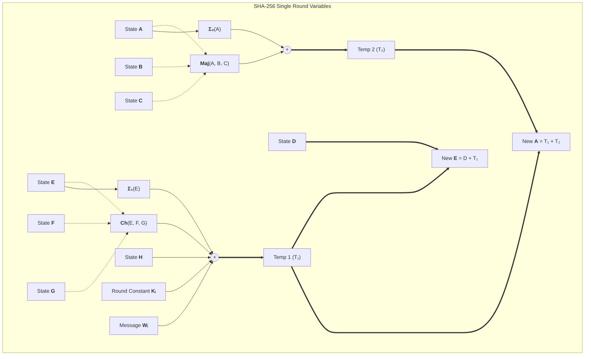

State update: `New A` → $A$, old $A$ → $B$, $B$ → $C$, $C$ → $D$, `New E` → $E$, $E$ → $F$, $F$ → $G$, $G$ → $H$.

<details>
<summary><strong>⚙️ Application: Bitcoin Block Header Hashing and Why It Uses Double-SHA256</strong></summary>

> Bitcoin's proof-of-work loop is the most famous real-world deployment of SHA-256, but what miners hash is not a vague "block." It is a precisely framed **80-byte block header**:
>
> ```text
> header =
>     version(4) ||
>     prev_block_hash(32) ||
>     merkle_root(32) ||
>     timestamp(4) ||
>     nBits(4) ||
>     nonce(4)
> ```
>
> The block identifier and mining target check are then computed as:
>
> $$\text{block id} = \text{SHA256}(\text{SHA256}(\text{header}))$$
>
> ### System artifact and walkthrough
>
> Each field has a distinct role:
>
> | Field | What it commits to |
> |-------|--------------------|
> | `version` | Consensus rule set used to interpret the block |
> | `prev_block_hash` | Parent link in the blockchain |
> | `merkle_root` | Commitment to all transactions in the block |
> | `timestamp` | Claimed production time |
> | `nBits` | Compact encoding of the target threshold |
> | `nonce` | Miner-controlled search variable |
>
> Miners do not partially extend a previously observed digest. They vary header fields under consensus rules, especially the nonce, timestamp, and transaction-dependent Merkle root, and recompute the **entire** double hash until the resulting 256-bit integer falls below the target implied by `nBits`.
>
> ### Cryptographic property in play
>
> The first SHA-256 invocation compresses a fixed-format 80-byte header into a 256-bit digest:
>
> $$h_1 = \text{SHA256}(\text{header}).$$
>
> The second invocation hashes that fixed-size digest again:
>
> $$h_2 = \text{SHA256}(h_1).$$
>
> This does **not** mean "raw SHA-256 was broken." The historical design intuition was more conservative: once the first pass produces a fixed-size 256-bit string, the second pass removes attacker control over any variable-length trailing structure and re-commits the header through the same primitive. In modern language, the second pass turns a structured 80-byte object into a two-stage pipeline where the outer hash sees only a fixed-length input.
>
> It is therefore best read as a belt-and-suspenders construction:
>
> | Interpretation | Accurate? | Why |
> |----------------|:---------:|-----|
> | "Double hashing proves SHA-256 is unsafe." | No | SHA-256 remains secure; Bitcoin was designed conservatively |
> | "Double hashing is a universal replacement for sound framing." | No | It helps in this fixed pipeline, but does not replace HMAC, domain separation, or protocol design |
> | "Double hashing removes attacker control over the outer input length." | Yes | The second hash sees exactly 256 bits |
>
> ### What breaks if done wrong
>
> The common misconception is to import Merkle-Damgård continuation language into mining and say that miners are somehow exploiting or depending on length extension. They are not. Bitcoin mining never asks, "Given this digest, can I continue hashing from it?" It asks, "Can I find a fresh header whose full double hash lands below the target?"
>
> If the protocol had instead exposed a looser, ambiguously framed object to the hash pipeline, consensus would be at risk because different implementations could disagree about what bytes were actually committed. The real engineering lesson is therefore:
>
> $$\text{fixed-format serialization} + \text{conservative digest pipeline} + \text{consensus lock-in}.$$
>
> Bitcoin's use of double-SHA256 is historically specific, but it vividly illustrates a broader rule: once a hash result becomes consensus-critical, even slightly awkward design choices become practically immutable.

</details>

#### 4.1.4. Hardware Acceleration (SHA-NI)

Modern CPUs execute SHA-256 in silicon via **Intel SHA Extensions**. Instructions like `sha256rnds2` compute two rounds simultaneously, while `sha256msg1` and `sha256msg2` handle message scheduling—bypassing software loop overhead entirely.

#### 4.1.5. SHA-256 vs SHA-512: Word Size Matters

Both algorithms share identical compression logic, but differ in word size and parameter scaling:

| Parameter | SHA-256 | SHA-512 | SHA-512/256 |
|-----------|---------|---------|-------------|
| Word size | 32 bits | 64 bits | 64 bits |
| State size | 256 bits | 512 bits | 512 bits |
| Rounds | 64 | 80 | 80 |
| Block size | 512 bits | 1024 bits | 1024 bits |
| Output | 256 bits | 512 bits | 256 bits |
| Optimized for | 32-bit CPUs | 64-bit CPUs | 64-bit CPUs |

**Key insight:** SHA-512 processes 64-bit words natively. On a 64-bit CPU, SHA-512 is **faster** than SHA-256 because it processes twice as much data per operation despite running 16 more rounds.

**SHA-512/256** is a truncated variant that gives you SHA-512 speed on 64-bit systems with a 256-bit output. It publishes only the leftmost 256 bits of a 512-bit chaining state and uses a distinct initialization vector, so it must be analyzed as a separate function rather than as a presentation-layer abbreviation of SHA-512.

> **Recommendation:** On 64-bit systems, prefer SHA-512 or SHA-512/256 over SHA-256 for better performance. On 32-bit systems (embedded devices, IoT), SHA-256 is faster.

<details>
<summary><strong>📎 Clarification: Why SHA-512/256 Is Not Merely "SHA-512, Then Cut in Half"</strong></summary>

> The tempting but incorrect mental model is
>
> $$\text{SHA-512/256}(M) \stackrel{?}{=} \text{Trunc}_{256}(\text{SHA-512}(M)).$$
>
> The actual construction uses a distinct initialization vector, so the correct relation is
>
> $$\text{SHA-512/256}(M) = \text{Trunc}_{256}(\mathcal{C}_{IV_{512/256}}(M)) \neq \text{Trunc}_{256}(\mathcal{C}_{IV_{512}}(M)).$$
>
> That distinction matters for both domain separation and structural security interpretation:
>
> | Property | SHA-512 | SHA-512/256 |
> |----------|---------|-------------|
> | Initial value | Standard SHA-512 IV | Distinct IV specified for the truncated variant |
> | Published output | 512 bits | 256 bits |
> | Digest reveals full chaining state? | Yes | No |
> | Function identity | Base function | Separate standardized function sharing the same compression core |
>
> If SHA-512/256 were defined as a bare left-truncation of SHA-512, then every SHA-512 computation would automatically induce a SHA-512/256 computation on the same message. Distinct IVs prevent that collapse: the two functions share implementation machinery, but they inhabit different domains and produce unrelated digests.
>
> The truncated output also changes the state-exposure story. A 256-bit SHA-512/256 digest does not reveal the full 512-bit chaining value needed to resume the Merkle-Damgård iteration directly, which is why the variant has a different structural profile from raw SHA-512 even though both are members of the same family.

</details><br/>

<details>
<summary><strong>🔧 Deep Dive: Why SHA-512 Has Different Rotation Constants</strong></summary>

> SHA-512 doesn't simply reuse SHA-256's rotation values—it scales them proportionally for 64-bit words. Understanding why reveals important design principles:
>
> ### The Scaling Principle
>
> SHA-256's $\Sigma_0$ uses rotations $\{2, 13, 22\}$ on 32-bit words. SHA-512's $\Sigma_0$ uses $\{28, 34, 39\}$ on 64-bit words. These aren't arbitrary—they maintain the same **relative positioning**:
>
> | Function | SHA-256 (32-bit) | SHA-512 (64-bit) | Ratio |
> |----------|------------------|------------------|-------|
> | $\Sigma_0$ | 2, 13, 22 | 28, 34, 39 | ~1.5–2× |
> | $\Sigma_1$ | 6, 11, 25 | 14, 18, 41 | ~1.5–2× |
> | $\sigma_0$ | 7, 18, 3 (shift) | 1, 8, 7 (shift) | — |
> | $\sigma_1$ | 17, 19, 10 (shift) | 19, 61, 6 (shift) | — |
>
> ### Why Not Exact Scaling?
>
> You might expect $\text{ROTR}^{2}$ in SHA-256 → $\text{ROTR}^{4}$ in SHA-512 (exact 2× scaling). But the designers chose values that:
>
> 1. **Maximize minimum distance** — The smallest rotation isn't so small that bits barely move
> 2. **Avoid symmetry** — No rotation is exactly half the word size (which would create pairs)
> 3. **Maintain coprimality** — The rotation set has no common factors with 64
>
> ### The 64-bit Advantage
>
> On a 64-bit CPU, SHA-512 processes **twice the data per operation**:
>
> ```text
> SHA-256: 1 × 32-bit addition per round
> SHA-512: 1 × 64-bit addition per round (same cycle count, 2× data)
> ```
>
> Despite running 80 rounds (vs SHA-256's 64), SHA-512 is typically **10–30% faster** on x86-64 because:
> - Fewer total blocks needed (1024-bit vs 512-bit block size)
> - Native 64-bit arithmetic
> - Better register utilization
>
> ### SHA-512/256: Best of Both Worlds
>
> SHA-512/256 truncates the 512-bit output to 256 bits. It uses distinct IV values (SHA-512 IV XORed with a tweak) to prevent:
>
> $$\text{SHA-512/256}(m) \neq \text{first 256 bits}(\text{SHA-512}(m))$$
>
> This prevents attackers from using SHA-512 collisions against SHA-512/256, even though both share the same compression function.

</details><br/>

**The Complete SHA-2 Family (FIPS 180-4):**

| Variant | Word Size | Rounds | Block Size | Digest | Collision Security | Primary Use |
|---------|:---------:|:------:|:----------:|:------:|:-----------------:|-------------|
| SHA-224 | 32-bit | 64 | 512-bit | 224-bit | 112-bit | Legacy TLS |
| **SHA-256** | 32-bit | 64 | 512-bit | 256-bit | 128-bit | Universal default |
| **SHA-384** | 64-bit | 80 | 1024-bit | 384-bit | 192-bit | TLS 1.3 with P-384 |
| **SHA-512** | 64-bit | 80 | 1024-bit | 512-bit | 256-bit | Post-quantum margin |
| **SHA-512/224** | 64-bit | 80 | 1024-bit | 224-bit | 112-bit | Rarely used |
| **SHA-512/256** | 64-bit | 80 | 1024-bit | 256-bit | 128-bit | Fast 256-bit on 64-bit CPUs |

SHA-384 and SHA-512/256 are truncated variants of SHA-512, each using **distinct initialization vectors** derived by modifying the SHA-512 IV. This IV separation ensures that truncation cannot be reversed to recover the full SHA-512 output. On 64-bit CPUs, SHA-512/256 outperforms SHA-256 by 10–30% because SHA-512's native 64-bit word operations process double the data per cycle despite requiring 80 rounds instead of 64.

#### 4.2. Digest Length, Truncation, and Security-Strength Budgeting

Digest length is not a cosmetic output parameter. It sets the concrete attack budget the defender is buying:

- for an $n$-bit fixed-output hash, **collision resistance** is upper-bounded by $2^{n/2}$;
- **pre-image resistance** is upper-bounded by $2^n$ classically and about $2^{n/2}$ against Grover-style quantum search;
- for XOFs, the effective strength is capped by both the **requested output length** and the sponge **capacity**.

For SHAKE specifically, if the requested output length is $d$ bits and the capacity is $c$, the security ceilings are:

$$\text{Collision strength} \le 2^{\min(d/2,\, c/2)}$$


$$\text{Pre-image strength} \le 2^{\min(d,\, c/2)}$$

This explains a common source of confusion:

- `SHAKE128(..., 4096 bits)` does **not** deliver 4096-bit security; its capacity still caps both collision and pre-image strength at 128 bits
- `SHAKE256(..., 256 bits)` can deliver 256-bit pre-image strength, but only 128-bit collision strength because the output itself is still 256 bits long
- to obtain **256-bit collision strength** from an XOF, you must request **at least 512 output bits** from a construction whose capacity supports it (for example, SHAKE256)

| Construction | Output Length | Collision Strength | Pre-image Strength | Typical Use |
|--------------|---------------|--------------------|--------------------|-------------|
| SHA-224 | 224 bits | 112 bits | 224 bits | Legacy interoperability only |
| SHA-256 | 256 bits | 128 bits | 256 bits | General-purpose default |
| SHA-512/256 | 256 bits | 128 bits | 256 bits | 64-bit software default when SHA-2 is required |
| SHA-384 | 384 bits | 192 bits | 384 bits | High-assurance signatures / long-lived PKI |
| SHA-512 | 512 bits | 256 bits | 512 bits | Maximum classical margin; strong PQ pre-image margin |
| SHAKE128 with 256-bit output | 256 bits | 128 bits | 128 bits | General XOF/KDF usage with 128-bit target |
| SHAKE256 with 256-bit output | 256 bits | 128 bits | 256 bits | XOF/KDF usage where pre-image margin dominates |
| SHAKE256 with 512-bit output | 512 bits | 256 bits | 256 bits | Collision-sensitive XOF applications |

The practical lesson is that **truncation is legitimate only when the reduced bound still matches the application's threat model**. MAC tags, for example, are often intentionally truncated to 128 or 192 bits because authenticity is keyed and the operational cost of transmitting 512 bits is rarely justified. Unkeyed collision-sensitive identifiers, however, should usually remain at 256 bits or above.

<details>
<summary><strong>⚙️ Application: Choosing Digest and Tag Lengths in Practice</strong></summary>

> A useful engineering rule is to choose the output length by the **strongest property your application actually consumes**:
>
> | Use Case | Recommended Output | Reason |
> |----------|--------------------|--------|
> | HMAC / KMAC tags, API request signing | 128–256 bits | Online forgery dominates; 128 bits is already enormous in keyed settings |
> | Content hashes, software artifacts, Merkle roots | 256 bits | Collision resistance is the operational floor |
> | Certificate / signature ecosystems with long lifetimes | 384–512 bits | Collision resistance, long retention, and migration lag justify a larger margin |
> | Post-quantum pre-image-sensitive uses | SHA-512, SHA3-512, or SHAKE256 with enough output | Grover halves pre-image security, so 512-bit-class primitives restore a 256-bit floor |
> | XOF-based expansion for sampling / transcript material | Match output to the protocol, but do not claim more security than the capacity permits | Output length and construction capacity jointly determine the ceiling |
>
> **Two easy mistakes:**
>
> 1. truncating an unkeyed digest to 64 bits and still calling it "secure";
> 2. requesting a huge SHAKE output and informally equating output length with security level.

</details>

#### 4.3. Length-Extension Attacks

SHA-2 is collision-resistant but its Merkle-Damgård design has a flaw: the final hash **is the internal state**.

An attacker who sees `MAC = SHA-256(Key || Message)` can:
1. Load the MAC as the IV for a new hash operation
2. Calculate the padding applied to the original message
3. Append attacker-controlled data $x$
4. Produce a valid MAC for `Key || Message || padding || x`

This forges a valid MAC without knowing the key.

<details>
<summary><strong>⚙️ Application: Concrete Length-Extension Attack Demonstration</strong></summary>

> Consider a vulnerable API that authenticates requests with `MAC = SHA-256(Secret || Request)`:
>
> ```text
> Secret = "s3cr3t" (unknown to attacker, 6 bytes)
> Request = "action=transfer&amount=100"
> Observed MAC = "7c9d...f2a1" (64 hex chars = 256 bits)
> ```
>
> The forge trace works because the attacker knows three operational facts even without the secret:
>
> 1. the exact public request bytes;
> 2. the secret length assumption to test (here 6 bytes);
> 3. the observed digest, which is the post-processing chaining state.
>
> ### Step 1: Reconstruct the hashed prefix length
>
> ```text
> len(Secret || Request) = 6 + 27 = 33 bytes = 264 bits
> ```
>
> ### Step 2: Reconstruct the Merkle-Damgård padding for that length
>
> ```text
> Original: "s3cr3t" || "action=transfer&amount=100" = 33 bytes
> Padding:  0x80 || (46 zero bytes) || 0x00...0x01\x08 (length = 264 bits)
> ```
>
> ### Step 3: Choose the attacker-controlled extension
>
> ```text
> Extension = "&to=attacker"
> ```
>
> ### Step 4: Resume hashing from the observed state
>
> ```text
> Forged request suffix = padding || "&to=attacker"
> Forged MAC = SHA-256(state=7c9d...f2a1, input="&to=attacker" + new_padding)
> ```
>
> This line is the critical state-reuse step. The attacker is **not** hashing the ASCII string `"7c9d...f2a1"`; they are treating the observed 256-bit digest as the internal SHA-256 state after the server finished processing `Secret || Request || padding`.
>
> ### Step 5: Send the forged pair to the server
>
> ```text
> Forged message = "action=transfer&amount=100" || padding || "&to=attacker"
> Forged MAC     = state-resumed SHA-256 result
> ```
>
> When the server verifies
>
> ```text
> SHA-256(Secret || forged_message)
> ```
>
> it reproduces the same internal continuation and accepts the forged MAC. The forged MAC is therefore **valid** for the message `Secret || Request || padding || "&to=attacker"` even though the attacker never knew the secret.
>
> ```mermaid
> ---
> config:
>   flowchart:
>     htmlLabels: true
> ---
> flowchart TD
>     subgraph Legitimate["<b>Legitimate MAC Computation (Server)</b>"]
>         direction TB
>         SECRET["`**Secret**
>         *s3cr3t (6 bytes)*`"]
>         REQUEST["`**Request**
>         *action=transfer&amp;amount=100*`"]
>         CONCAT1["`**Concatenate**
>         Secret || Request`"]
>         PAD1["`**MD Padding**
>         0x80 || zeros || length`"]
>         HASH1["`**SHA-256**
>         *Block processing*`"]
>         MAC1["`**Observed MAC**
>         7c9d...f2a1 (256 bits)*`"]
>         
>         SECRET --> CONCAT1
>         REQUEST --> CONCAT1
>         CONCAT1 --> PAD1
>         PAD1 --> HASH1
>         HASH1 --> MAC1
>     end
>     
>     subgraph Attack["<b>Length-Extension Attack (Attacker)</b>"]
>         direction TB
>         COMPUTE_PAD["`**Compute Padding**
>         *Attacker reconstructs original padding*`"]
>         EXTEND["`**Append Extension**
>         *&amp;to=attacker*`"]
>         FORGED_MSG["`**Forged Message**
>         Secret||Request||padding||extension`"]
>         STATE["`**Internal State**
>         *MAC = state (key insight)*`"]
>         NEW_PAD["`**New MD Padding**
>         *For extended message*`"]
>         HASH2["`**SHA-256**
>         *Continue from state*`"]
>         MAC2["`**Forged MAC**
>         *Valid for forged message*`"]
>         
>         COMPUTE_PAD --> EXTEND
>         EXTEND --> FORGED_MSG
>         STATE --> HASH2
>         NEW_PAD --> HASH2
>         HASH2 --> MAC2
>     end
>     
>     subgraph Verification["<b>Server Verification</b>"]
>         direction TB
>         VERIFY["`**Server validates**
>         SHA-256(Secret || forged_msg)`"]
>         MATCH["`**MACs Match!**
>         *Attack succeeds*`"]
>         
>         VERIFY --> MATCH
>     end
>     
>     MAC1 --> COMPUTE_PAD
>     MAC1 --> STATE
>     FORGED_MSG --> VERIFY
>     MAC2 --> MATCH
>     
>     style SECRET text-align:left
>     style REQUEST text-align:left
>     style CONCAT1 text-align:left
>     style PAD1 text-align:left
>     style HASH1 text-align:left
>     style MAC1 text-align:left
>     style COMPUTE_PAD text-align:left
>     style EXTEND text-align:left
>     style FORGED_MSG text-align:left
>     style STATE text-align:left
>     style NEW_PAD text-align:left
>     style HASH2 text-align:left
>     style MAC2 text-align:left
>     style VERIFY text-align:left
>     style MATCH text-align:left
> ```
>
> **Why this works:** the attacker knows the original public message length, can reconstruct the deterministic Merkle-Damgård padding, and can reuse the observed digest as the next chaining state. The server then unknowingly validates the exact continuation the attacker simulated offline.

</details>

##### 4.3.1. Why Merkle-Damgård is Vulnerable

The vulnerability is structural:

1. **No secret-dependent finalization** — The hash output is the raw internal state, not a transformation that depends on secret material
2. **State continuity** — Anyone can resume hashing from any observed hash value
3. **Predictable padding** — The padding scheme is deterministic and publicly computable

> **Contrast with SHA-3:** SHA-3's sponge construction "squeezes" output from the rate portion while the capacity remains hidden. The output is not the full state, making length-extension impossible.

<details>
<summary><strong>⚙️ Application: Vulnerable vs Secure MAC Implementations</strong></summary>

> Here's how the length-extension attack manifests in real code and how HMAC prevents it:
>
> ### ❌ Vulnerable: Naive MAC Construction
>
> ```python
> import hashlib
>
> def vulnerable_mac(secret: bytes, message: bytes) -> bytes:
>     """VULNERABLE to length-extension attacks!"""
>     return hashlib.sha256(secret + message).digest()
>
> # Attacker can forge valid MACs without knowing the secret
> # by extending from the observed hash state.
> ```
>
> **Attack vector:** An attacker who observes the MAC can compute valid MACs for `secret + message + padding + attacker_data` without knowing `secret`.
>
> ### ✅ Secure: HMAC-SHA256
>
> ```python
> import hmac
> import hashlib
>
> def secure_mac(secret: bytes, message: bytes) -> bytes:
>     """Secure against length-extension attacks."""
>     return hmac.new(secret, message, hashlib.sha256).digest()
>
> # Or using the standard library directly:
> mac = hmac.new(secret_key, message, hashlib.sha256).hexdigest()
> ```
>
> **Why it works:** The double-hash wrapping isolates the inner state. The observed MAC is the *outer* hash output, not a resumable state.
>
> ### ✅ Alternative: SHA-3 (Keccak)
>
> ```python
> import hashlib
>
> def sha3_mac(secret: bytes, message: bytes) -> bytes:
>     """SHA-3 is inherently resistant to length-extension."""
>     return hashlib.sha3_256(secret + message).digest()
> ```
>
> SHA-3's sponge construction avoids the length-extension failure mode that breaks Merkle-Damgård prefix-MACs. In production systems, however, KMAC remains the preferred SHA-3-native MAC because it gives explicit standardization, domain separation, and key separation.
>
> ### Real-World Vulnerability Examples
>
> | System | Vulnerability | Fix |
> |--------|---------------|-----|
> | **Flickr API (2009)** | `MD5(secret || params)` | Migrated to HMAC-SHA1 |
> | **AWS S3 Presigned URLs** | Uses HMAC-SHA256 | N/A (already secure) |
> | **JWT (HS256)** | Uses HMAC-SHA256 | N/A (already secure) |
> | **File upload APIs** | Often use naive `sha256(secret || file)` | Switch to HMAC |
>
> ### Detection in Code Reviews
>
> Search for these patterns in your codebase:
>
> ```bash
> # Potential vulnerabilities
> grep -r "sha256.*secret.*message" --include="*.py"
> grep -r "hashlib.sha.*+.*+" --include="*.py"
> grep -r "MD5.*||.*request" --include="*.js"
> ```
>
> Replace any `hash(key + message)` pattern with `HMAC(key, message)` or migrate to SHA-3.

</details>

#### 4.4. HMAC: The Mitigation

To prevent length-extension, use HMAC:

$$\text{HMAC}(K, m) = H((K \oplus \text{opad}) \parallel H((K \oplus \text{ipad}) \parallel m))$$

The double-wrapping isolates the inner hash state. The output of the inner hash becomes a fixed-size input to the outer hash, breaking state continuity and preventing extension. (For a comprehensive treatment of MAC constructions—including KMAC, TupleHash, and the comparison with Sponge-native MACs—see [§13. Advanced MAC Constructions](#13-advanced-mac-constructions).)

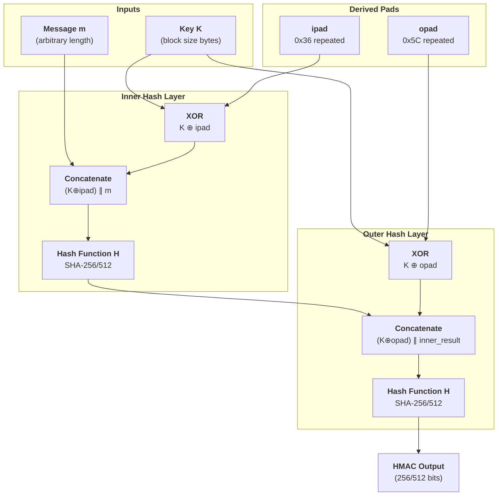

##### 4.4.1. Construction Rationale

The construction uses two **derived keys**:

- **ipad** = $0x36$ repeated to block size (inner padding)
- **opad** = $0x5C$ repeated to block size (outer padding)

These values are chosen to have **Hamming distance ≈ 50%** — the bit patterns are maximally different:

```text
0x36 = 0011 0110
0x5C = 0101 1100
       ---- ----
XOR:   0110 1010  (4 of 8 bits differ)
```

This ensures that even though the same key is used in both layers, the derived values are cryptographically independent.

**Why double-wrapping works:**

1. The **inner hash** $H((K \oplus \text{ipad}) \parallel m)$ produces a fixed-size output (256 bits for SHA-256)
2. This output becomes the *message* for the outer hash — it's not a hash state that can be extended
3. The **outer hash** $H((K \oplus \text{opad}) \parallel \text{inner result})$ applies a different key, so knowledge of the final MAC doesn't help compute valid extensions

An attacker who observes the MAC sees the outer hash output, not the inner hash state. Length-extension requires the attacker to know the internal state *after* processing the key-padded message — but that's hidden by the outer hash.

##### 4.4.2. Implementation Considerations

**Block size matters:**
- SHA-256: block size = 64 bytes (512 bits)
- SHA-512: block size = 128 bytes (1024 bits)

**Key handling:**
1. If $\text{len}(K) > \text{block size}$: $K' = H(K)$ (hash first)
2. If $\text{len}(K) < \text{block size}$: $K' = K || 0x00...$ (pad with zeros)
3. Compute $\text{ipad key} = K' \oplus \text{ipad}$
4. Compute $\text{opad key} = K' \oplus \text{opad}$

**Why not use SHA-3 instead?** SHA-3 (Keccak) removes the specific length-extension failure mode that breaks Merkle-Damgård prefix-MACs. But "not length-extension vulnerable" is not the same thing as "the best standardized MAC API." In production, a SHA-3 deployment should still prefer **KMAC** or another explicitly specified keyed construction with domain separation and framing. HMAC-SHA256 remains the operational standard largely because it is universally deployed and tightly integrated into existing protocols.

##### 4.4.3. Security Properties

HMAC has a **security proof** that reduces its security to the underlying hash function:

$$\text{Adv}^{\text{PRF}}_{\text{HMAC}}(t, q) \leq \text{Adv}^{\text{PRF}}_{H}(t) + \text{Adv}^{\text{MAC}}_{H}(t)$$

This means: if the underlying hash $H$ is a secure pseudorandom function, then HMAC is a secure MAC. The proof holds even when $H$ is Merkle-Damgård and vulnerable to length-extension — the HMAC construction itself blocks the attack.

**Deployment:** HMAC-SHA256 is used in:
- **JWT** (JSON Web Tokens) — `HS256` algorithm
- **AWS Signature Version 4** — all AWS API authentication
- **TLS 1.3** — record-layer authentication
- **OTPs** (HOTP/TOTP) — one-time password algorithms

#### 4.5. Why SHA-2 Remains Secure

SHA-2 has resisted 25 years of cryptanalysis. The design lessons from MD5 and SHA-1's failures created a robust construction:

1. **Dense mixing operations** — The $\Sigma$ and $\sigma$ functions combine rotations and XOR in patterns that maximize diffusion. Each input bit affects many output bits through multiple paths.

2. **Larger state** — 256-bit state (SHA-256) vs SHA-1's 160-bit. More state bits mean more work for collision attacks.

3. **Better message schedule** — SHA-256 expands 16 words to 64 using $\sigma_0$ and $\sigma_1$ with both rotations AND shifts. SHA-1's simple XOR-based expansion was one of its weaknesses.

4. **More rounds** — 64 rounds (SHA-256) or 80 rounds (SHA-512) vs SHA-1's 80 rounds on a smaller state. The round count provides substantial security margin.

5. **Transparent constants** — Cube roots of primes eliminate backdoor suspicion and prevent the designer from embedding hidden weaknesses.

6. **Security margin** — The best known theoretical attack breaks only **46 of 64 rounds** of SHA-256 (2016). SHA-256 retains 18 rounds of margin. For pre-image attacks, only **52 of 64 rounds** are broken (2012).

> **Contrast:** MD5 and SHA-1 had zero security margin when they fell — practical collisions matched the full round count. SHA-2's margin is why it remains secure.

#### 4.6. Real-World Deployment

SHA-2 is everywhere:

- **TLS 1.3** — All handshake signatures use SHA-256. Certificate signatures use SHA-256 or SHA-384. The protocol has no SHA-1 or MD5 options.

- **Bitcoin** — Uses **double SHA-256** ($\text{SHA256}(\text{SHA256}(data))$) for block hashes and transaction IDs. The double-hashing is a historical quirk, not a security requirement.

- **Code signing** — Microsoft Authenticode, Apple notarization, and Linux package repositories all require SHA-256 signatures. SHA-1 certificates expired in 2017.

- **Git** — The ongoing SHA-256 migration (git `sha256` object format) replaces the original SHA-1 object IDs. The transition is complex due to repository synchronization.

- **Password hashing** — **Not recommended.** SHA-256 is too fast for password hashing. Use Argon2id, bcrypt, or scrypt instead — these are designed to be slow and resist GPU/ASIC attacks.

#### 4.7. Randomized Hashing for Digital Signatures

Collision attacks become especially dangerous when the **message preparer** and the **message signer** are not the same party. If an attacker can hand a signer one benign document while secretly arranging a colliding malicious document, the signer may authorize the wrong semantic content. **Randomized hashing** was standardized precisely to harden this boundary.

The idea is simple: before hashing the message for signature, the signer injects fresh per-signature randomness $r$ into the hashing process, conceptually turning:

$$h = H(M) \quad \longrightarrow \quad h_r = H(r \parallel M)$$

The randomizer $r$ is then transmitted or otherwise bound so the verifier recomputes the same digest. Even if the attacker invested heavily in constructing a collision for a bare deterministic digest, they do **not** know the signer-chosen randomizer in advance, so the precomputed collision no longer lands on the same signed value.

Randomized hashing is therefore a **hedge** against collision-style message-preparation attacks. It is not a substitute for a strong modern hash:

- it does **not** repair a fully broken digest algorithm;
- it does **not** replace the need for collision-resistant hash choices in signature ecosystems;
- it is most useful when the signer cannot fully trust the entity that assembled the message bytes being signed.

In modern deployments, the need for randomized hashing has receded because SHA-256, SHA-384, and SHA-3 displaced SHA-1 in signature contexts. But the concept remains important because it teaches a broader systems lesson: sometimes the correct defense is not merely "choose a stronger primitive," but also **shift entropy and control to the honest signer**.

<details>
<summary><strong>📜 Historical: Why NIST Standardized Randomized Hashing, Then Withdrew It</strong></summary>

> NIST SP 800-106 standardized randomized hashing in 2009, at the exact moment when the ecosystem still had to reckon with SHA-1-era collision anxiety in digital signatures. The document's purpose was not to replace SHA-2 adoption, but to provide an additional signer-side defense when collision attacks were becoming more credible and migration was incomplete.
>
> More than a decade later, NIST withdrew SP 800-106 after the original operational motivation had faded. Stronger hash choices and updated signature practice made the special-purpose mitigation less central. That withdrawal does **not** make the idea unimportant; it means the ecosystem mostly solved the underlying problem by retiring weak signature hashes rather than by layering extra randomness on top of them.

</details>

## The Deterministic Multi-Purpose Standards

### 5. Architecting the Sponge Construction

#### 5.0. Why SHA-3? The Diversity Imperative

If SHA-2 remains unbroken and widely trusted, why did NIST launch the SHA-3 competition in 2007? The answer lies in **cryptographic diversity**—a risk management strategy against single points of failure.

The SHA-2 family (SHA-256, SHA-512, and their truncated variants) all share the Merkle-Damgård architecture. While no practical collisions exist, the entire family rests on one design philosophy. If a breakthrough attack compromised Merkle-Damgård's structural assumptions, every SHA-2 variant would fall simultaneously. The internet's cryptographic infrastructure would collapse overnight.

NIST's response was the **SHA-3 Competition (2007–2012)**: an open, international contest to select a backup hash function with a fundamentally different architecture. From 64 initial submissions, five finalists emerged—BLAKE, Grøstl, JH, Keccak, and Skein—each representing distinct cryptographic philosophies. The winner, **Keccak** `/ˈkɛtʃæk/`, introduced the **Sponge Construction**: a completely different paradigm from Merkle-Damgård.

> **Critical Insight:** SHA-3 is a *supplement*, not a *replacement*. SHA-2 remains NIST's primary recommendation. SHA-3 provides architectural diversity—if one family falls, the other provides a fallback.

Keccak's selection reflected multiple factors: elegant mathematical structure, the highest security margin against known attacks, native support for extensible output (XOFs), and excellent hardware performance. The sponge construction's immunity to length-extension attacks removed Merkle-Damgård's need for HMAC-style wrapping in naive keyed-prefix settings, while still leaving room for standardized keyed constructions such as KMAC.

#### 5.1. The Mathematics of Sponge Architecture

**Definition 5.1 (The Sponge Construction):**
A sponge construction builds a variable-length function $F: \{0,1\}^* \to \{0,1\}^*$ from a fixed-width permutation $P: \{0,1\}^b \to \{0,1\}^b$. The $b$-bit state is split into two parts:
- **Rate ($r$):** The portion that interacts with input and output — message blocks are XORed into the rate, and output is squeezed from the rate.
- **Capacity ($c$):** The hidden portion that is never directly exposed — it provides the security margin.
The total state width is $b = r + c$.

**Theorem 5.1 (Sponge Indifferentiability — Bertoni et al., 2008):**
A sponge construction using an ideal permutation is **indifferentiable** from a Random Oracle (§1.2.2). No efficient adversary can distinguish the sponge's output from truly random responses, up to a birthday-type bound on the capacity:

$$\text{Adv}^{\text{RO}}_{\text{Sponge}}(q) \leq \frac{q^2}{2^{c+1}}$$

where $q$ is the number of queries. An adversary needs at least $2^{c/2}$ queries to gain a non-negligible advantage. This means:

- **Fixed-output collision resistance** is bounded by $2^{\min(d/2,\, c/2)}$, where $d$ is the published digest length
- **Fixed-output pre-image resistance** is bounded by $2^{\min(d,\, c/2)}$
- **Throughput** depends only on the rate $r$ — increasing rate does not weaken security

<details>
<summary><strong>Proof</strong></summary>

> The Bertoni et al. argument is a simulation proof. Compare two worlds for an adversary making $q$ sponge queries:
>
> 1. An ideal sponge built from a random permutation $P$ with hidden capacity $c$.
> 2. A true random oracle together with a simulator that answers consistently.
>
> As long as no two adversarial transcripts force the simulator to reuse the same hidden $c$-bit state in an inconsistent way, the simulator can answer the adversary exactly as a random oracle would. The only bad event is therefore a birthday-style collision in the hidden capacity portion of the sponge state. For $q$ queries, the probability of such a bad event is bounded by
>
> $$\Pr[\text{bad}] \leq \frac{q(q-1)}{2^{c+1}} \leq \frac{q^2}{2^{c+1}}.$$
>
> Outside that bad event, the adversary's view in the sponge world and in the random-oracle world is identical, so the distinguishing advantage is at most the probability of the bad event itself:
>
> $$\text{Adv}^{\text{RO}}_{\text{Sponge}}(q) \leq \frac{q^2}{2^{c+1}}.$$

> Setting this upper bound to be non-negligible requires roughly birthday scale in the capacity, namely $q \approx 2^{c/2}$. For a published digest of length $d$, generic collision search is additionally bounded by $2^{d/2}$ and generic pre-image search by $2^d$, so the realized fixed-output strengths are
>
> $$2^{\min(d/2,\, c/2)} \quad \text{and} \quad 2^{\min(d,\, c/2)}.$$
> Thus the sponge's hidden-state security budget is controlled by capacity, while the published digest length can still impose the tighter bound for the specific output function in use. $\blacksquare$

</details>

Within a fixed permutation width $b = r + c$, the designer trades rate against hidden capacity. The realized security of a standardized fixed-output hash is then determined jointly by the capacity ceiling and the digest length actually published. This distinction is easy to miss on first read: capacity limits the underlying sponge's hidden-state security budget, but the digest length can still impose the tighter bound on the specific hash output that users actually compare. That is why SHA3-256 uses a 512-bit capacity yet still provides 128-bit collision resistance rather than 256-bit collision resistance.

| Standard Variant | Permutation Width ($b$) | Block Rate ($r$) | Hidden Capacity ($c$) | Collision Bound | Pre-image Bound |
|------------------|-------------------------|------------------|-----------------------|-----------------|-----------------|
| SHA3-224 | 1600 bits | 1152 bits | 448 bits | $\mathcal{O}(2^{112})$ | $\mathcal{O}(2^{224})$ |
| SHA3-256 | 1600 bits | 1088 bits | 512 bits | $\mathcal{O}(2^{128})$ | $\mathcal{O}(2^{256})$ |
| SHA3-384 | 1600 bits | 832 bits | 768 bits | $\mathcal{O}(2^{192})$ | $\mathcal{O}(2^{384})$ |
| SHA3-512 | 1600 bits | 576 bits | 1024 bits | $\mathcal{O}(2^{256})$ | $\mathcal{O}(2^{512})$ |

<details>
<summary><strong>📎 Clarification: Why the Capacity Ceiling Is Not the Same Thing as the Published Hash Strength</strong></summary>

> The phrase "capacity $c$ gives $c/2$-bit security" is a statement about the **generic sponge ceiling**, not an automatic statement about the security of every fixed-length digest extracted from that sponge.
>
> For a digest of length $d$, the relevant bounds are
>
> $$\text{Collision strength} \le 2^{\min(d/2,\, c/2)}, \qquad \text{Pre-image strength} \le 2^{\min(d,\, c/2)}.$$
>
> | Quantity | Determined by | Example for SHA3-256 |
> |----------|---------------|----------------------|
> | Capacity ceiling | Hidden state size $c$ | $c/2 = 256$ bits |
> | Published collision strength | $\min(d/2, c/2)$ | $\min(128, 256) = 128$ bits |
> | Published pre-image strength | $\min(d, c/2)$ | $\min(256, 256) = 256$ bits |
>
> The engineering payoff of a large capacity is that the sponge retains enough hidden-state margin to support the intended digest length, XOF behavior, and indifferentiability guarantees without exposing too much internal structure.

</details><br/>

<details>
<summary><strong>🔧 Step-by-Step Example: Reading a Toy Sponge Security Budget</strong></summary>

> Consider a deliberately tiny sponge with
>
> $$b = 40, \qquad r = 24, \qquad c = 16,$$
>
> and suppose we publish a digest of length $d = 12$ bits.
>
> The two relevant ceilings are:
>
> - **Capacity ceiling:** $c/2 = 8$ bits
> - **Digest-derived collision ceiling:** $d/2 = 6$ bits
> - **Digest-derived pre-image ceiling:** $d = 12$ bits
>
> Applying the sponge bounds:
>
> $$\text{Collision strength} \le 2^{\min(6, 8)} = 2^6$$
> $$\text{Pre-image strength} \le 2^{\min(12, 8)} = 2^8$$
>
> So even though the hidden capacity supports an 8-bit generic sponge ceiling, the **published 12-bit digest** lowers collision resistance to only 6 bits because birthday search sees only the output length actually exposed.
>
> | Quantity | Toy sponge result | Why |
> |----------|-------------------|-----|
> | Capacity ceiling | 8 bits | Hidden state contributes $c/2$ |
> | Collision strength | 6 bits | Limited by $d/2$ |
> | Pre-image strength | 8 bits | Limited by $\min(d, c/2)$ |
>
> SHA3-256 follows the same logic at real scale:
>
> - $c = 512 \Rightarrow c/2 = 256$
> - $d = 256 \Rightarrow d/2 = 128$
> - published collision resistance is therefore **128 bits**, not 256 bits
>
> The toy example is intentionally small, but the reading rule is the same: first compute the hidden-state ceiling from capacity, then ask whether the published digest length is already the tighter limit.

</details>

<details>
<summary><strong>🔧 Deep Dive: Why Capacity = 2n Gives an n-Bit Sponge Security Ceiling</strong></summary>

> The cleanest way to read the usual rule of thumb $c = 2n$ is as a statement about the **generic hidden-state ceiling** of the sponge, not as a claim that an $n$-bit published digest automatically has $n$-bit collision resistance.
>
> ### The Generic Sponge Security Bound
>
> Bertoni et al. (2008) proved that for a sponge with capacity $c$ and an ideal underlying permutation, the advantage of any adversary making $q$ queries is:
>
> $$\text{Adv}(q) \leq \frac{q^2}{2^{c+1}}$$
>
> This is a **birthday-type bound** on the capacity: the adversary must "collide" in the $c$-bit hidden state to distinguish the sponge from a random oracle. Setting $c = 2n$ for target security level $n$ gives:
>
> $$\text{Adv}(q) \leq \frac{q^2}{2^{2n+1}} \quad \Rightarrow \quad q \geq 2^n \text{ queries needed for non-negligible advantage}$$
>
> ### Why This Means Rate and Capacity Can Be Tuned Independently
>
> The capacity $c$ determines security; the rate $r$ determines throughput. Since $b = r + c$ is fixed (1600 bits for Keccak), increasing capacity reduces rate and vice versa:
>
> | Setting | $c$ (capacity ceiling) | $r$ (throughput) | Typical fixed-output strength | Throughput |
> |---------|:-----------:|:------------:|:---------:|:----------:|
> | SHA3-256 | 512 | 1088 | 128-bit collision / 256-bit pre-image | ~1 GB/s |
> | SHA3-512 | 1024 | 576 | 256-bit collision / 512-bit pre-image | ~0.5 GB/s |
> | SHAKE128 | 256 | 1344 | 128-bit ceiling | ~1.5 GB/s |
> | SHAKE256 | 512 | 1088 | 256-bit ceiling | ~1 GB/s |
>
> A system targeting only a 128-bit sponge ceiling (SHAKE128) gets nearly 3× the throughput of one configured for a 512-bit capacity ceiling (SHA3-512). For fixed-output hashes, the digest length may still impose the tighter collision bound.
>
> ### Why TurboSHAKE Can Use Fewer Rounds
>
> TurboSHAKE and KangarooTwelve use 12 rounds instead of SHA-3's 24. This does *not* reduce the capacity-based security bound — it reduces the **margin** against attacks on the permutation itself. The argument is:
>
> 1. Best known attack on Keccak-f breaks **6 rounds** (out of 24)
> 2. 12 rounds still provide a **2× margin** over the best attack
> 3. The capacity-based indifferentiability proof holds regardless of round count, *assuming the permutation is ideal*
> 4. With 12 rounds, the permutation is "close enough to ideal" for practical security
>
> This is why TurboSHAKE achieves ~2× the throughput of SHA-3 while maintaining 128-bit security — it trades margin on the permutation for performance while keeping the full capacity guarantee.

</details>

#### 5.2. Formal State Transitions (Absorb and Squeeze)

##### 5.2.1. The Absorb Phase

**Definition 5.2 (Absorbing State Mapping):**
Let $M$ be the padded message string severed into deterministic sequential $r$-bit blocks $m_0, m_1, \dots, m_k$. The uninitialized sponge tensor state $S = (S_r, S_c) \in \{0,1\}^b$ is defaulted to absolute zero ($0^b$). The absorbing transition mapping functionally iterates over the block series:

$$S_{i+1} = P((S_{i,r} \oplus m_i) \parallel S_{i,c}) \quad \text{for } i \in \{0, \dots, k\}$$

Because inputs are explicitly XOR-ed strictly into the $r$-bit rate partition $S_{i,r}$, the inner capacity $S_{i,c}$ is structurally quarantined from direct external interaction—it can mutate solely via the internal 1600-bit non-linear diffusion mechanics inside $P$.

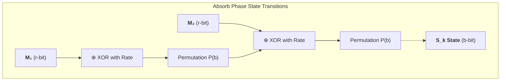

##### 5.2.2. The Squeeze Phase

**Definition 5.3 (Squeezing State Extraction):**
Once total block absorption concludes, the algorithm pivots to output extraction. Output material $z_0, z_1, \dots, z_n$ (in blocks of precisely length $r$) are formally generated via:
1. $z_j = S_{j,r}$ (Truncate and expose only the temporal rate bits).
2. Propagate the entire state matrix: $S_{j+1} = P(S_j)$.
This recursive algorithmic permutation guarantees that squeezed outputs dynamically decouple from deterministic periodicity. It satisfies the Extensible Output Function (XOF) paradigm while maintaining an uncompromised barrier around the secretive capacity variable $S_{j,c}$, eliminating state-resumption attacks and rendering classical length-extension mathematically impossible. That structural isolation removes the specific Merkle-Damgård failure mode, but it does **not** by itself make ad hoc keyed-prefix hashing the preferred engineering interface; production systems should still favor KMAC or another fully specified keyed sponge construction.

<details>
<summary><strong>⚙️ Application: Toy Absorb/Squeeze Walkthrough</strong></summary>

> Take a tiny illustrative sponge with
>
> $$b = 16, \qquad r = 8, \qquad c = 8.$$
>
> Let the initial state be all zeroes and let the padded one-block message be
>
> $$m_0 = 10110011.$$
>
> We write the state as `rate || capacity`.
>
> ### Step 1: Start from the zero state
>
> ```text
> S_0 = 00000000 || 00000000
> ```
>
> ### Step 2: Absorb the message into the rate only
>
> XOR the message into the left 8-bit rate portion:
>
> ```text
> rate     = 00000000
> message  = 10110011
> result   = 10110011
> ```
>
> So the pre-permutation state becomes
>
> ```text
> 10110011 || 00000000
> ```
>
> ### Step 3: Apply the permutation
>
> We do not need the internals of the toy permutation here; call the result
>
> ```text
> S_1 = P(10110011 || 00000000) = 01100110 || 11001010
> ```
>
> The important observation is structural: after permutation, both the rate and the capacity have changed even though the input touched only the rate.
>
> ### Step 4: Squeeze output from the rate
>
> The first output block is the rate portion of $S_1$:
>
> ```text
> z_0 = 01100110
> ```
>
> The hidden capacity bits
>
> ```text
> 11001010
> ```
>
> remain unexposed.
>
> ### Step 5: Continue squeezing if more output is needed
>
> Apply the permutation again:
>
> ```text
> S_2 = P(S_1)
> ```
>
> and read the next rate block $z_1$ from the left side of $S_2$.
>
> The takeaway is the same in real SHA-3: message blocks enter through the rate, permutations mix rate and capacity together, but output extraction reveals only the rate. The hidden capacity is exactly what prevents the digest from acting like a resumable public chaining state.

</details><br/>

<details>
<summary><strong>⚙️ Application: SHA-3 MAC Patterns vs HMAC-SHA256</strong></summary>

> Sponge hashing removes the specific **length-extension** failure that makes raw `SHA-256(K \parallel M)` unusable as a MAC. It does **not** follow that every ad hoc keyed-prefix sponge pattern is automatically the best protocol interface.
>
> | Construction | Length-extension safe? | Standardized framing? | Recommended role |
> |--------------|------------------------|------------------------|------------------|
> | `SHA-256(K \parallel M)` | No | No | Never use as a MAC |
> | HMAC-SHA256 | Yes | Yes | Best default when SHA-2 interoperability dominates |
> | `SHA3-256(K \parallel M)` | Yes, against classic continuation attacks | No | Acceptable only in tightly controlled protocols with explicit framing rules |
> | KMAC128 / KMAC256 | Yes | Yes | Preferred standardized keyed sponge construction |
>
> The engineering distinction is therefore:
>
> $$\text{length-extension immunity} \neq \text{fully specified keyed-domain semantics}.$$
>
> Even when raw keyed-prefix SHA-3 avoids the Merkle-Damgård continuation attack, the protocol still needs explicit answers to questions such as key separation, message framing, context labeling, and output-length conventions. KMAC supplies those answers natively; HMAC supplies them through a different wrapper discipline.
>
> | Scenario | Preferred choice | Why |
> |----------|------------------|-----|
> | Existing ecosystem standardized on SHA-2 | HMAC-SHA256 | Ubiquity, mature proofs, mature tooling |
> | New sponge-native design with standards latitude | KMAC256 | Keyed sponge semantics are standardized rather than improvised |
> | Extremely constrained internal protocol already proving its own framing | Raw `SHA3-256(K \parallel M)` only with care | Safe from classic length extension, but still easier to misuse than KMAC |
>
> **Bottom line:** the sponge changes what is catastrophically unsafe, but standardized keyed constructions remain the cleaner long-term engineering choice.

</details><br/>

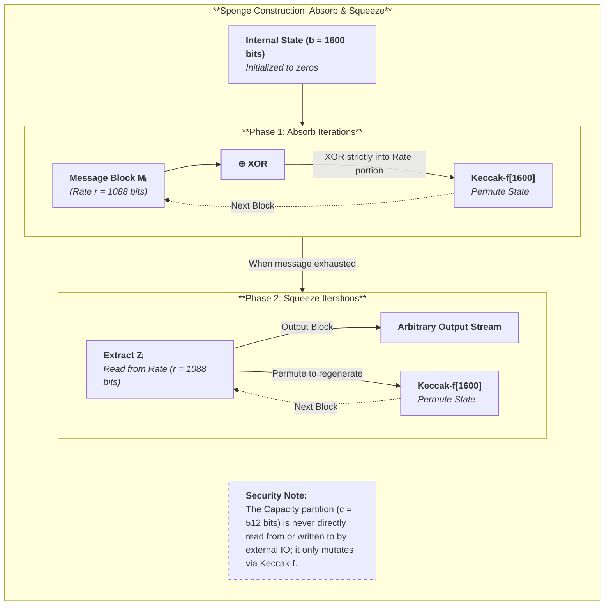

#### 5.3 Sponge vs. Merkle-Damgård: The Architectural Shift

The fundamental difference between SHA-2 and SHA-3 is the architectural transition from the **Merkle-Damgård framework** to the **Sponge construction**. This represents a shift from data compression to state permutation.

In Merkle-Damgård (e.g., SHA-256), the core primitive is a **compression function**: $f(\text{state}, \text{block}) \rightarrow \text{new state}$. The internal state (256 bits) is equal in size to the final digest, and upon completing the final block, the entire internal state is output to the user. Because this final state is completely exposed, an attacker can trivially use the digest as an initialization vector to append new data. This vulnerability necessitates "band-aids" like the double-layered HMAC construction for message authentication.

In contrast, the Sponge construction uses a **permutation**: $P(\text{state}) \rightarrow \text{state}$. It operates on a large internal state (1600 bits for Keccak) which is cryptographically mixed but never fully revealed. An attacker observing a 256-bit SHA-3 digest only sees the exposed **rate** portion; the remaining **capacity** bits remain perfectly hidden. This state isolation inherently neutralizes length-extension attacks because the attacker mathematically cannot continue the hash computation without the hidden capacity bits. That removes the classic Merkle-Damgård keyed-prefix failure mode, though production keyed hashing should still prefer KMAC or another fully specified keyed construction over ad hoc conventions.

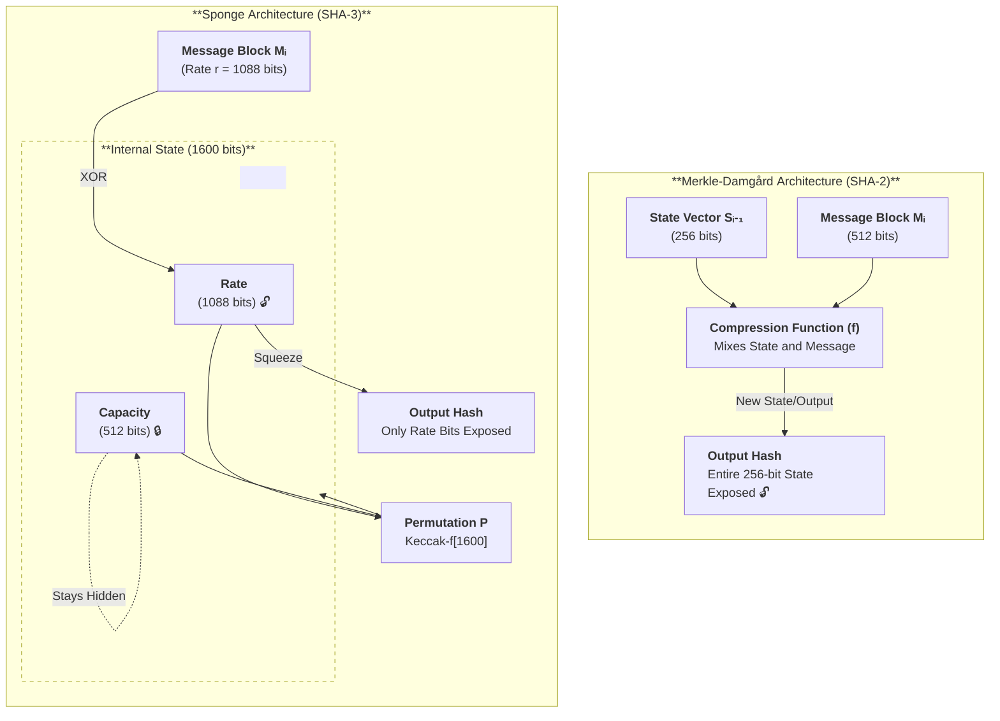

### 6. The Keccak Algorithm

#### 6.0. The SHA-3 Competition (2007–2012)

The NIST hash function competition was an unprecedented exercise in cryptographic transparency. Unlike SHA-1 and SHA-2, which were designed behind closed doors at the NSA, SHA-3 emerged from open international scrutiny.

**The 64 Submissions:** NIST received 64 hash function proposals from cryptographers worldwide. Over four years of public analysis, most fell to cryptanalytic attacks. By 2010, only five finalists remained:

| Finalist | Architecture | Key Characteristic |
|----------|-------------|-------------------|
| **BLAKE** | HAIFA (Merkle-Damgård variant) | ChaCha-based, fast on CPUs |
| **Grøstl** | AES-based permutation | Wide-pipe design, conservative |
| **JH** | Wide-pipe Merkle-Damgård | Efficient hardware implementation |
| **Keccak** | Sponge construction | Novel architecture, highest margin |
| **Skein** | Threefish block cipher | Very fast on 64-bit CPUs |

**Why Keccak Won:** NIST's selection criteria included security margin, performance across platforms, and algorithmic elegance. Keccak excelled in all three:

1. **Highest security margin:** Best cryptanalytic attacks broke only 6 of 24 rounds—a 4× margin
2. **Architectural novelty:** The sponge construction was fundamentally different from SHA-2
3. **Flexibility:** Native XOF support meant one primitive served multiple use cases
4. **Hardware efficiency:** Keccak's bitwise operations mapped well to ASIC/FPGA implementations

**The Controversy:** Some finalists (particularly BLAKE and Skein) were significantly faster on general-purpose CPUs. Critics argued that Keccak's selection prioritized theoretical elegance over practical deployment. NIST's response: SHA-3 is a backup, not a replacement—security margin matters more than speed for a reserve primitive.

<details>
<summary><strong>📜 Historical: The NIST SHA-3 Competition (2007–2012)</strong></summary>

> ### Timeline
>
> | Year | Event |
> |------|-------|
> | 2004 | Wang's MD5/SHA-0 collision attacks trigger concern about hash function diversity |
> | 2005 | Wang demonstrates theoretical SHA-1 weaknesses ($2^{69}$ complexity) |
> | 2007 | NIST announces open competition for SHA-3; calls for submissions |
> | 2008 | **64 submissions** received from cryptographers in 20+ countries |
> | 2009 | **Round 1 → 14 candidates** — 50 eliminated by cryptanalysis or implementation flaws |
> | 2010 | **Round 2 → 5 finalists** (BLAKE, Grøstl, JH, Keccak, Skein) |
> | 2012 | **Keccak selected** as SHA-3 (FIPS 202, finalized 2015) |
>
> ### The Round-Count Controversy
>
> The most contentious decision was Keccak's round count. The original Keccak submission used **24 rounds** of the Keccak-f permutation. The best cryptanalytic attack at the time of selection broke **6 of 24 rounds** — a 4× security margin.
>
> When NIST standardized SHA-3, some community members advocated for **reducing** the round count to 12 (matching the attack boundary more tightly) for improved performance. Others argued that the conservative 24-round choice was precisely *why* Keccak won — the `SHA-3 is insurance` philosophy demanded maximum margins.
>
> NIST ultimately kept 24 rounds for SHA-3/SHAKE, but the Keccak team later released **TurboSHAKE** (12 rounds) and **KangarooTwelve** (12 rounds) as performance-optimized alternatives — effectively acknowledging that 24 rounds were overly conservative for most applications while preserving the full-strength option for standards compliance.
>
> ### The "Insurance Policy" Philosophy
>
> NIST explicitly framed SHA-3 not as a replacement for SHA-2 (which remains unbroken), but as **cryptographic insurance**: if a breakthrough attack on Merkle-Damgård-based constructions emerges, the sponge-based SHA-3 provides architectural diversity. This framing was crucial because:
>
> 1. It avoided the perception that SHA-2 was broken (it isn't)
> 2. It justified selecting for security margin over raw speed
> 3. It positioned SHA-3's XOF capabilities as a bonus, not the primary selection criterion
>
> ### Community Response
>
> The cryptographic community's reaction was mixed:
> - **Pro-Keccak:** Security margin, architectural novelty, and XOF flexibility were compelling
> - **Pro-BLAKE:** Significantly faster on CPUs; led to BLAKE2 (2012) and BLAKE3 (2020) as *de facto* fast-hash standards outside NIST
> - **Pro-Skein:** Bruce Schneier's team argued Threefish-based design was more versatile
>
> The ultimate outcome vindicated both sides: SHA-3 became the standard for compliance and high-assurance contexts, while BLAKE2/3 dominated performance-sensitive applications. The competition elevated the entire field by producing multiple excellent hash function families.

</details>

#### 6.1. The Keccak-f 3D Tensor Algebra

The core algebraic mechanism of SHA-3 is the unkeyed cryptographic permutation `Keccak-f[b]`, computing deterministically over heavily abstracted spatial dimensions.

**Definition 6.1 (The 3D State Tensor):**
The overarching 1600-bit Keccak state is functionally organized as a three-dimensional Boolean tensor computed dynamically across the finite algebraic ring $A \in \mathbb{F}_2^{5 \times 5 \times w}$. An isolated component array bit maps explicitly to coordinates $A[x,y,z] \in \{0,1\}$, parametrically bounded by:
- $x \in \mathbb{Z}_5$: The cyclic row axis.
- $y \in \mathbb{Z}_5$: The cyclic column axis.
- $z \in \mathbb{Z}_{w}$: The unbounded continuous linear lane axis (standardized at $w = 64$ for `Keccak-f[1600]`).

Thus, the dimensional invariant holds invariant: $b = 5 \times 5 \times w = 1600$. By decomposing the state vector transversally into a grid of 64-bit lanes (fitting the strict word size of modern x86_64 silicon), this formulation maximally satisfies diffusion. In practice, implementers usually store the same object as `uint64_t state[25]`: the tensor notation $A[x,y,z]$ and the 25-lane machine-word array are not competing models, but two views of the same 1600-bit state. A solitary injected bit manipulation at tensor coordinate $(x_1, y_1, z_1)$ iterates exponentially along all three absolute axes, rapidly saturating the 3D domain.

<details>
<summary><strong>📎 Clarification: How to Read the Keccak State as Both Tensor and 25-Lane Machine Word Array</strong></summary>

> The tensor notation $A[x,y,z]$ is mathematically convenient because the round functions act on different geometric views of the same state. Implementers, however, usually hold the same object as **25 lanes of 64 bits each**.
>
> | View | Coordinates | Object counted | Size in `Keccak-f[1600]` |
> |------|-------------|----------------|---------------------------|
> | Bit view | $A[x,y,z]$ | One Boolean state bit | $5 \times 5 \times 64$ bits |
> | Lane view | $A[x,y,\cdot]$ | One 64-bit lane | 25 lanes |
> | Column view | $A[x,\cdot,\cdot]$ | Five lanes sharing the same $x$ index | 5 columns |
> | Row view | $A[\cdot,y,\cdot]$ | Five lanes sharing the same $y$ index | 5 rows |
>
> The five Keccak step mappings can then be read as acting on different projections:
>
> | Step | Natural geometric view |
> |------|------------------------|
> | $\theta$ | Column parities |
> | $\rho$ | Bit positions inside each lane |
> | $\pi$ | Lane locations on the $5 \times 5$ grid |
> | $\chi$ | Rows of five lane bits at fixed $y,z$ |
> | $\iota$ | The distinguished lane at $(0,0)$ |
>
> This dual perspective is important because it explains why Keccak reads elegantly in algebraic notation yet still maps efficiently to software as
>
> $$\texttt{uint64\_t state[25]}.$$
>
> The tensor and the lane array are not competing representations; they are the same state viewed through the two projections most useful for analysis and implementation.

</details><br/>

<details>
<summary><strong>🔧 Step-by-Step Example: Mapping One Keccak Lane Across Both Views</strong></summary>

> Suppose an implementation stores the Keccak state as
>
> ```c
> uint64_t state[25];
> ```
>
> and we focus on the lane at coordinates $(x,y) = (2,3)$. In tensor language, that lane is the 64-bit slice
>
> $$A[2,3,\cdot] = \big(A[2,3,0], A[2,3,1], \dots, A[2,3,63]\big).$$
>
> In software, the same object is one machine word, typically addressed conceptually as:
>
> ```text
> state[5*y + x] = state[17]
> ```
>
> for this particular coordinate pair.
>
> ### Reading the same lane in two ways
>
> | View | What you see |
> |------|---------------|
> | Tensor view | 64 individual bits indexed by $z$ |
> | Lane-array view | One 64-bit word in `state[17]` |
>
> ### How one round step uses that lane
>
> - Under **$\rho$**, the lane stays at the same $(x,y)$ location but its 64 bits rotate by the lane-specific offset.
> - Under **$\pi$**, the whole 64-bit lane moves to a new grid position, but it is still one machine word.
> - Under **$\theta$**, the lane contributes to a column parity computed from the five words sharing the same $x$ index.
>
> So if `state[17] = 0x0123456789abcdef`, then:
>
> 1. the tensor view interprets that word as 64 indexed bits $A[2,3,z]$;
> 2. $\rho$ rotates those bit positions inside the word;
> 3. $\pi$ relocates the resulting word to a different lane slot;
> 4. later steps mix it with neighboring words through column- and row-based logic.
>
> The practical payoff is that the algebraic notation tells you **which geometry is being manipulated**, while the implementation view tells you **which 64-bit word the code is loading, rotating, xoring, and storing**.

</details><br/>

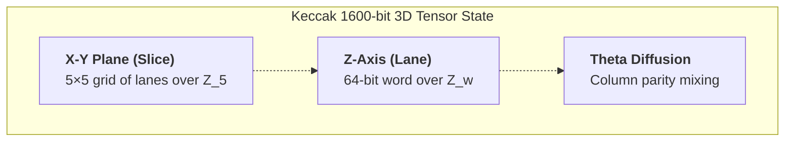

##### 6.1.1. Round Operations (Modulo Arithmetic Mappings)

Each of the sequential 24 iterations mandates the deterministic recursive application of five explicit non-commutative step mappings over the multi-dimensional tensor: $\theta \to \rho \to \pi \to \chi \to \iota$.

**Definition 6.2 ($\theta$: Column Parity Mixing):**
The $\theta$ (Theta) transformation enforces high-density translational diffusion by structurally pairing bits across the transverse $X$-plane. For spatial vector $(x,y,z)$:

$$C[x,z] = \bigoplus_{y=0}^{4} A[x, y, z]$$


$$A'[x,y,z] = A[x,y,z] \oplus C[(x-1) \bmod 5, z] \oplus C[(x+1) \bmod 5, (z-1) \bmod w]$$

In a single operational clock, a single isolated bit is propagated instantly to 11 adjacent topological nodes.

**Definition 6.3 ($\rho$: Inter-Slice Rotational Dispersion):**
The $\rho$ (Rho) transformation executes localized bitwise rotational offsets along the planar $Z$-axis, directly severing independent localized coordinate dependencies. The pre-computed permutation offsets $r[x,y]$ scale dynamically through $\mathbb{Z}_w$ determined exclusively by recursive triangular sequence integers:

$$A'[x,y,z] = A[x, y, (z - r[x,y]) \bmod w]$$

**Definition 6.4 ($\pi$: Intra-Slice Affine Transposition):**
The $\pi$ (Pi) mapping isolates and disperses contiguous planar bits across distant modular coordinates via a pure affine mathematical permutation mapping bounded entirely within the finite $\mathbb{Z}_5 \times \mathbb{Z}_5$ subspace:

$$A'[(y, 2x + 3y) \bmod 5, z] = A[x,y,z]$$

The $2x + 3y \mod 5$ transformation is perfectly invertible, guaranteeing no structural data is lost.

**Definition 6.5 ($\chi$: Non-linear Algebraic Threshold):**
To systematically dismantle algebraic models over $\mathbb{F}_2$, the $\chi$ (Chi) mapping provides Keccak's absolute non-linear defense mechanism. Operating independently over exactly 5-bit vector slices representing structural rows:

$$A'[x,y,z] = A[x,y,z] \oplus (\neg A[(x+1) \bmod 5, y, z] \wedge A[(x+2) \bmod 5, y, z])$$

Because the $\text{AND}$ multiplication elevates polynomials fundamentally to algebraic degree 2 uniformly, generating matrix inverses algebraically degenerates into solving isolated arrays of non-linear NP-Hard quadratic formulations. 

**Definition 6.6 ($\iota$: Algorithmic Symmetry Breaking):**
The final $\iota$ (Iota) function forces structural mathematical discordance across isolated parallel steps. Sourcing $i_r$-governed parameters directly from a primitive polynomial linear-feedback shift register (LFSR), an asymmetric constant vector is bound structurally to the origin lane $(0,0,z)$:

$$A'[0,0,z] = A[0,0,z] \oplus RC[i_r][z]$$

By stripping Keccak rounds of mathematical determinism, slide-derived distinguishing algorithms and identical symmetric multi-iteration overlaps are completely shattered algebraically.


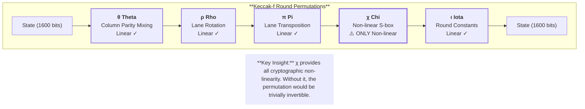

<details>
<summary><strong>🔧 Deep Dive: Understanding the Five Keccak Steps Intuitively</strong></summary>

> The formal definitions above (Definitions 6.2–6.6) present the step mappings as algebraic formulas over a 3D tensor. This Deep Dive explains *what each step accomplishes* and *why the specific combination achieves full-state diffusion* in remarkably few rounds.
>
> ### The Decomposition: Diffusion vs Confusion vs Symmetry
>
> Each step serves a distinct cryptographic role. Together, they cover the three requirements for a secure permutation:
>
> | Step | Type | Cryptographic Role | Operates On |
> |:----:|:----:|-------------------|:-----------:|
> | **θ** (Theta) | Linear | **Inter-column diffusion** — spreads each bit to 11 neighbors | Columns (across all 5 rows) |
> | **ρ** (Rho) | Linear | **Intra-lane diffusion** — offsets bits within each 64-bit lane | Individual lanes (Z-axis) |
> | **π** (Pi) | Linear | **Inter-lane diffusion** — rearranges lanes across the 5×5 grid | The X-Y plane |
> | **χ** (Chi) | **Non-linear** | **Confusion** — the *only* source of cryptographic non-linearity | 5-bit rows |
> | **ι** (Iota) | Constant | **Symmetry breaking** — prevents round self-similarity | Lane (0,0) only |
>
> ### Step-by-Step: What Happens to a Single Bit
>
> Suppose bit $A[2, 3, 17]$ is flipped (row 2, column 3, lane position 17). Here is what each step does to propagate this change:
>
> **1. θ (Theta) — Column parity mixing:**
> The column parity $C[2, 17]$ changes because $A[2, 3, 17]$ contributes to column $x=2$. This altered parity is XORed into *every* row of columns $x=1$ and $x=3$ (with a 1-bit rotation for $x=3$). Result: the single-bit flip now affects **10 additional bits** across two neighboring columns — 11 bits total are different after θ alone.
>
> **2. ρ (Rho) — Lane rotation:**
> Each of the 25 lanes is rotated by a fixed, pre-computed offset. The affected bits at position $z=17$ in various lanes now shift to *different* Z-positions. Crucially, these offsets are chosen from triangular numbers to maximize the time before any bit returns to its original position. This breaks local alignment — bits that were "column neighbors" after θ are now scattered across different lane positions.
>
> **3. π (Pi) — Lane transposition:**
> The affine map $(x', y') = (y, 2x + 3y \bmod 5)$ rearranges which lane sits at which grid position. Bits that were spread across two columns by θ are now dispersed across the entire 5×5 plane. After θ + ρ + π, a single-bit flip has influenced bits in multiple rows, multiple columns, and multiple lane positions.
>
> **4. χ (Chi) — Non-linear mixing:**
> This is where cryptographic hardness enters. The formula $A'[x] = A[x] \oplus (\neg A[x+1] \wedge A[x+2])$ evaluates a 3-input Boolean function across each 5-bit row. The AND gate ($\wedge$) creates **algebraic degree 2** — meaning the output cannot be expressed as a linear function of the input. After one application of χ, the relationship between input and output bits is quadratic. After two rounds, it is degree 4. After $R$ rounds: degree $2^R$. By round 8, the algebraic degree exceeds the state size, making equation-solving infeasible.
>
> **5. ι (Iota) — Round constant XOR:**
> A round-dependent constant (generated by an LFSR) is XORed into lane $(0,0)$. This seems minor, but without it, every round of Keccak-f would be *identical* — enabling **slide attacks** that compare round $i$ of one computation against round $i+1$ of another. The constants break this self-similarity.
>
> ### Avalanche Trace: 2 Rounds
>
> Starting from a single flipped bit, here is the approximate diffusion after each step:
>
> | After Step | Bits Affected | Percentage of 1600-bit State |
> |:----------:|:-------------:|:---------------------------:|
> | Input | 1 | 0.06% |
> | θ (Round 1) | 11 | 0.7% |
> | ρ + π (Round 1) | 11 (scattered) | 0.7% (dispersed spatially) |
> | χ (Round 1) | ~30 | 1.9% |
> | θ (Round 2) | ~200 | 12.5% |
> | ρ + π (Round 2) | ~200 (scattered) | 12.5% (fully dispersed) |
> | χ (Round 2) | ~600 | 37.5% |
>
> By round 4, a single-bit change has avalanched to affect approximately **800 of 1600 bits** (50%) with high probability — the statistical expectation for a random permutation. The remaining 20 rounds reinforce this to cryptographic certainty.
>
> ### Why Four Linear Steps but Only One Non-linear?
>
> This asymmetry is deliberate. Linear steps (θ, ρ, π) are computationally cheap and provide *diffusion* — spreading information across the state. Non-linear steps (χ) are computationally cheap too (just AND + NOT + XOR), but they provide *confusion* — destroying algebraic structure.
>
> The critical insight: **diffusion amplifies confusion**. One round of χ alone affects only the 5-bit row it operates on. But when θ first spreads the input across columns, ρ shifts lane positions, and π rearranges the grid, the *next* application of χ operates on bits that have already been mixed from distant state positions. Each round's non-linearity compounds with the previous round's diffusion, achieving exponential algebraic degree growth ($2^R$) with minimal per-round computation.
>
> This is why Keccak achieves full diffusion in ~4 rounds despite having only one non-linear step per round — the three linear steps create the "surface area" for χ to work on.

</details>

##### 6.1.3. Why 24 Rounds?

NIST selected 24 rounds as a security margin after SHA-1's collapse. The best published attacks against Keccak-f[1600] break approximately 6 rounds. The 24-round specification provides a 4× margin:

$$\text{Security margin} = \frac{24 - 6}{24} = 75\%$$

This conservatism reflects hard-won lessons: SHA-1's margin eroded from theoretical (1996) to practical (2017). Keccak's large margin ensures decades of security even if cryptanalysis improves dramatically.


#### 6.2. Keccak vs SHA-3

NIST modified Keccak's padding before standardizing FIPS 202. The domain separation byte ensures `Keccak-256` (used by Ethereum) produces different output than `SHA3-256`.

##### 6.2.1. Injective Padding and Domain Separation: `pad10*1`

**Definition 6.7 (The `pad10*1` Injective Function):**
To translate an arbitrary-length message $M \in \{0,1\}^*$ into a sequence of rigorously sized $r$-bit blocks for the sponge absorption phase, Keccak leverages a deterministic multi-rate padding rule formally denoted as $\text{pad10*1}(r, m)$. For a message length $m = |M|$, the padding string $P$ is formally constructed by:
1. Appending a mandatory `1` bit.
2. Appending $j$ instances of `0` bits, where $j$ is the unique minimal non-negative integer satisfying: $m + 1 + j + 1 \equiv 0 \pmod r$.
3. Appending a final terminating `1` bit.

Mathematically, the padded block $M'$ is generated by concatenating $M \parallel 1 \parallel 0^j \parallel 1$. Because the padding frame is explicitly demarcated by $1$ boundaries, the padding function is strictly **injective**—meaning $M_1 \neq M_2 \implies \text{pad}(M_1) \neq \text{pad}(M_2)$—even if $M_1$ is a prefix of $M_2$ with trailing zeros.

**Theorem 6.1 (NIST Domain Separation Variants):**
During the FIPS 202 standardization of SHA-3 and XOF variants (SHAKE), NIST modified the baseline Keccak padding injection by appending cryptographic domain separation suffixes *before* triggering the `pad10*1` evaluation.
- **SHA-3 Hashes:** Append the 2-bit string `01`. Combined with the padding starting `1` bit, the hexadecimal byte signature commonly resolves to `0x06`.
- **SHAKE XOFs:** Append the 4-bit string `1111`. Combined with the padding starting `1` bit, this resolves to `0x1F`.

By structurally altering the input string prior to padding computation, the state trajectories already diverge at the first absorbed block. This formal domain separation guarantees that $\text{SHA3-256}(M)$, $\text{SHAKE128}(M)$, and the legacy Ethereum $\text{Keccak-256}(M)$ remain distinct function families on identical payloads, preventing cross-protocol substitution by construction.

<details>
<summary><strong>Proof</strong></summary>

> Let $\delta_1 \neq \delta_2$ be two domain-separation suffixes. The critical fact is **where** they are injected: they are absorbed *before* the first permutation that mixes message material into the full 1600-bit state.
>
> If two variants absorb the same payload $M$ but different suffix strings $\delta_1 \neq \delta_2$, then the first absorbed block already differs:
>
> $$B_0^{(1)} = \text{Pad}(M \parallel \delta_1), \qquad B_0^{(2)} = \text{Pad}(M \parallel \delta_2), \qquad B_0^{(1)} \neq B_0^{(2)}.$$
>
> After the very first permutation call,
>
> $$S_1^{(1)} = P(S_0 \oplus B_0^{(1)}), \qquad S_1^{(2)} = P(S_0 \oplus B_0^{(2)}),$$
>
> and the two computations are now on different internal trajectories. Because later squeezing depends on the entire state history, the final outputs diverge even though the permutation core is identical.
>
> | Variant family | Suffix before `pad10*1` | Purpose |
> |----------------|-------------------------|---------|
> | Raw Keccak hash family | Legacy competition-domain suffix | Backward compatibility with pre-FIPS deployments such as Ethereum |
> | SHA-3 fixed-output hashes | `01` (byte-encoded as `0x06` with padding interaction) | Distinguish fixed-length FIPS 202 hashes |
> | SHAKE XOFs | `1111` (byte-encoded as `0x1F` with padding interaction) | Distinguish XOF behavior from fixed-output hashing |
>
> Domain separation is therefore not a cosmetic label attached after hashing. It is a first-block perturbation that commits the computation to a different semantic family from the moment absorption begins. Since the state trajectories diverge before any squeezing occurs, the resulting variants are distinct hash-function families by construction. $\blacksquare$

</details>

##### 6.2.2. Ethereum's Keccak-256

Ethereum uses the **original Keccak-256** (NIST competition version), not the standardized SHA3-256. This is a historical accident: Ethereum launched in 2015, one year before NIST finalized SHA-3 in FIPS 202 (2016). The Ethereum developers implemented the Keccak team's reference code, which NIST later modified.

**Demonstration of the difference (empty string input):**

| Variant | Hash of `""` |
|---------|--------------|
| Keccak-256 (Ethereum) | `c5d2460186f7233c927e7db2dcc703c0e500b653ca82273b7bfad8045d85a470` |
| SHA3-256 (NIST FIPS 202) | `a7ffc6f8bf1ed76651c14756a061d662f580ff4de43b49fa82d80a4b80f8434a` |

The outputs are **completely different** despite identical internal permutations—the padding suffix (`0x01` for Keccak, `0x06` for SHA-3) alters the final sponge state.

If you want a quick implementation sanity check, Python makes the distinction visible immediately: `pycryptodome` exposes Ethereum-style Keccak separately from `hashlib.sha3_256()`. The important engineering lesson is not the exact API surface of every ecosystem, but that `Keccak-256` and `SHA3-256` are different functions and must not be swapped interchangeably.

**Implications for developers:**
- Ethereum addresses are Keccak-256(PublicKey), not SHA3-256(PublicKey)
- Using the wrong hash function produces invalid addresses — **funds can be lost**
- Most cryptographic libraries provide both; always verify with the empty-string test vector above

<details>
<summary><strong>⚙️ Application: Ethereum Keccak-256 vs SHA3-256 in Real Systems</strong></summary>

> Ethereum is the canonical example of why "same permutation family" is not the same thing as "same protocol hash." The EVM, Solidity, address derivation rules, log topics, and ABI selectors are all built around **Keccak-256**, not NIST SHA3-256.
>
> ### System artifact and walkthrough
>
> Three common Ethereum artifacts all depend on the exact Keccak variant:
>
> | Artifact | Hash role | Conceptual formula |
> |----------|-----------|--------------------|
> | Externally owned account address | Derive account identifier from public key | `address = low_160_bits(Keccak256(pubkey))[12:32]` |
> | Function selector | Dispatch to ABI method | `selector = first_4_bytes(Keccak256("transfer(address,uint256)"))` |
> | Event topic | Identify emitted log type | `topic0 = Keccak256("Transfer(address,address,uint256)")` |
>
> The operational byte strings differ by use case, but the rule is the same: the protocol is committing to one exact 256-bit output derived with Ethereum's Keccak padding, not the FIPS 202 SHA3-256 suffix.
>
> ### Cryptographic property in play
>
> The deep lesson is that padding/domain-separation bits are **part of the function definition**, not cosmetic wrappers around a shared core. Even though both constructions use `Keccak-f[1600]`, their final absorbed states differ because the suffix bits differ. In symbolic form:
>
> $$\text{Keccak256}(M) \neq \text{SHA3\text{-}256}(M)$$
>
> for the same message $M$, not because the permutation changed, but because the padded input to that permutation changed.
>
> This is exactly the kind of distinction that senior engineers sometimes underweight: if the protocol standard fixes the serialization and suffix, then **the semantic identity of the hash function includes those bits**.
>
> ### What breaks if done wrong
>
> If a developer substitutes SHA3-256 where Ethereum expects Keccak-256, the failure is deterministic rather than probabilistic:
>
> - the derived address is wrong;
> - the 4-byte selector is wrong, so contract dispatch fails;
> - the event topic is wrong, so indexing and log filtering break.
>
> | Mistake | Immediate effect |
> |---------|------------------|
> | SHA3-256 used for address derivation | Funds may be sent to an unintended or nonexistent address |
> | SHA3-256 used for ABI selector | Contract call targets the wrong function selector or reverts |
> | SHA3-256 used for event topic | Off-chain systems miss or misclassify logs |
>
> The broader engineering lesson is not merely "Ethereum is quirky." It is that protocol identity lives in exact byte-level hashing semantics. When a standard says `keccak256`, that includes the framing and suffix choices all the way down.

</details>

<details>
<summary><strong>📜 Historical: How Ethereum Ended Up on the Wrong Keccak</strong></summary>

> The Ethereum/Keccak-256 divergence is a cautionary tale about adopting cryptographic primitives before their standardization is finalized.
>
> ### Timeline of the Divergence
>
> | Date | Event |
> |:----:|-------|
> | Oct 2012 | NIST selects Keccak as the SHA-3 winner |
> | 2013–2014 | Ethereum's Vitalik Buterin designs the protocol using the Keccak team's reference implementation |
> | Aug 2014 | Ethereum Yellow Paper published — specifies `KECCAK-256` throughout |
> | Feb 2014 | NIST proposes reducing SHA-3's capacity (security level) for better performance — *community backlash* |
> | Aug 2015 | NIST publishes FIPS 202 — keeps original security levels but adds domain separation padding (`0x06` for SHA-3 vs `0x01` for raw Keccak) |
> | Jul 2015 | Ethereum launches mainnet — already committed to raw Keccak-256 |
>
> ### Why Ethereum Didn't Use SHA3-256
>
> When Ethereum was designed (2013–2014), NIST had selected Keccak but hadn't finalized the standard. The Keccak team's reference code was publicly available. Ethereum developers made the reasonable decision to use the competition winner's reference implementation rather than wait for a standard that might take years.
>
> The critical moment came in February 2014, when NIST proposed *changing* Keccak's security parameters for the final standard — reducing the capacity from 512 bits to 256 bits for SHA3-256. The cryptographic community erupted in protest, and NIST ultimately reversed this decision. But the months of uncertainty reinforced Ethereum's choice to use the known-good competition submission rather than a moving standardization target.
>
> ### The "Should Ethereum Migrate?" Debate
>
> After FIPS 202 was finalized in August 2015 (one month after Ethereum's launch), the community debated whether to migrate to standard SHA3-256. The consensus was **no**, for several reasons:
>
> 1. **No security benefit:** Both variants use identical Keccak-f[1600] permutations with identical security margins. The only difference is a padding byte.
> 2. **Breaking change cost:** Every Ethereum address, contract hash, storage key, and transaction hash would change. The ecosystem disruption would be catastrophic.
> 3. **Ecosystem lock-in:** By 2016, thousands of smart contracts and tools assumed Keccak-256. A hard fork to change the hash function would be the most disruptive change possible.
>
> ### The Broader Lesson
>
> Ethereum's experience illustrates why **standards timing matters** for protocol design:
>
> - **Using a pre-standard primitive is risky** — the final standard may differ in incompatible ways
> - **The window between algorithm selection and standard publication** (2012–2015 for SHA-3) creates a dangerous gap where early adopters may commit to a non-final version
> - **Hash function agility** (§2.3) would have helped — if Ethereum's EVM had an abstract hash opcode rather than a hardcoded `KECCAK256` opcode, migration would be feasible
>
> Today, Ethereum's `keccak256()` opcode is permanently embedded in the EVM specification, the Solidity language, and every deployed smart contract. The divergence from SHA3-256 is irreversible — a permanent artifact of the 19-month gap between NIST's winner announcement and the final standard.

</details>

<details>
<summary><strong>⚙️ Application: Optimizing Keccak-f[1600] for Real-World Performance</strong></summary>

> The theoretical description of Keccak-f as a 3D tensor is mathematically elegant but suboptimal for actual implementation. Production code reorganizes the state for cache efficiency and vectorization.
>
> ### The Lane-Based Representation
>
> Instead of storing $A[x][y][z]$ as a 3D array, implementations store 25 lanes as 64-bit integers:
>
> ```c
> // Naive 3D representation (cache-unfriendly)
> uint8_t state[5][5][64];  // 1600 bytes, poor locality
>
> // Production lane representation (cache-friendly)
> uint64_t state[25];  // 200 bytes, excellent locality
> 
> // Access pattern: state[lane_index] where lane_index = 5*y + x
> ```
>
> ### Implementing the Step Mappings
>
> **θ (Theta) — Column Parity**
> ```c
> // Compute column parities (5 columns × 64 bits)
> uint64_t C[5];
> for (int x = 0; x < 5; x++) {
>     C[x] = state[x] ^ state[x + 5] ^ state[x + 10] 
>          ^ state[x + 15] ^ state[x + 20];
> }
> 
> // XOR parity into all lanes
> uint64_t D = C[4] ^ rotl64(C[1], 1);  // (x-1, z-1)
> for (int x = 0; x < 5; x++) {
>     uint64_t D_next = C[x] ^ rotl64(C[(x + 1) % 5], 1);
>     for (int y = 0; y < 5; y++) {
>         state[x + 5*y] ^= D;
>     }
>     D = D_next;
> }
> ```
>
> **ρ (Rho) and π (Pi) — Combined for Efficiency**
> ```c
> // Rotation offsets (triangular numbers mod 64)
> static const int rho_offsets[25] = {
>     0,  1, 62, 28, 27, 
>     36, 44,  6, 55, 20,
>     3, 10, 43, 25, 39,
>     41, 45, 15, 21,  8,
>     18,  2, 61, 56, 14
> };
> 
> // π permutation indices
> static const int pi_perm[25] = {
>     0,  6, 12, 18, 24,
>     3,  9, 10, 16, 22,
>     1,  7, 13, 19, 20,
>     4,  5, 11, 17, 23,
>     2,  8, 14, 15, 21
> };
> 
> uint64_t temp[25];
> for (int i = 0; i < 25; i++) {
>     temp[pi_perm[i]] = rotl64(state[i], rho_offsets[i]);
> }
> memcpy(state, temp, sizeof(temp));
> ```
>
> **χ (Chi) — The Non-linear Core**
> ```c
> // Apply χ row-by-row (each row is 5 lanes at same y)
> for (int y = 0; y < 5; y++) {
>     for (int x = 0; x < 5; x++) {
>         uint64_t a = state[y*5 + x];
>         uint64_t b = state[y*5 + (x+1)%5];
>         uint64_t c = state[y*5 + (x+2)%5];
>         temp[y*5 + x] = a ^ (~b & c);
>     }
> }
> ```
>
> ### SIMD Vectorization (AVX2/AVX-512)
>
> The independent lane operations enable aggressive vectorization:
>
> ```c
> // AVX2: Process 4 lanes in parallel
> __m256i lane0 = _mm256_loadu_si256((__m256i*)&state[0]);  // lanes 0-3
> __m256i lane5 = _mm256_loadu_si256((__m256i*)&state[5]);  // lanes 5-8
> 
> // θ: XOR 4 column parities simultaneously
> __m256i parity = _mm256_xor_si256(lane0, lane5);
> // ... continue for all 5 plane rows
> ```
>
> **AVX-512** can process all 25 lanes (1600 bits) in four 512-bit registers, achieving near-theoretical throughput.
>
> ### Hardware Acceleration
>
> | Platform | Feature | Speedup vs. Scalar |
> |----------|---------|-------------------|
> | Intel (Ice Lake+) | SHA Extensions (KECCAK) | 3-5× |
> | ARMv8 | SHA-3 instructions | 2-4× |
> | FPGA | Keccak core (unrolled) | 10-20× |
> | ASIC | Full custom | 50-100× |
>
> Intel's Ice Lake and later CPUs include native Keccak instructions:
> ```c
> // Intel SHA extensions
> #include <immintrin.h>
> __m128i state_lo, state_hi;  // 256-bit state portion
> state_lo = _mm_sha3rnds2_epi64(state_lo, state_hi, 0);
> ```
>
> ### Memory Bandwidth Considerations
>
> Keccak-f[1600]'s 200-byte state fits entirely in L1 cache. The algorithm is **compute-bound**, not memory-bound:
>
> - **24 rounds × 5 steps = 120 operations per bit**
> - **L1 cache hits:** ~99% for state access
> - **Dominant cost:** Rotation and XOR operations
>
> This contrasts with SHA-256, which is memory-bound due to its 64-byte message schedule expansion.

</details>

#### 6.3 Attack Resistance and Security Margin

Keccak's specification of 24 rounds provides an enormous theoretical security margin, validated by over a decade of aggressive public cryptanalysis. To date, practical collision attacks have fundamentally stalled at breaking roughly 6 out of the 24 rounds, preserving a 4× margin.

1. **Differential and Linear Analysis:** Classical attacks derive success from finding predictable statistical biases across multiple bounds. Keccak neuters these pathways through the interleaved, massive diffusion of the $\theta$ (parity) and $\chi$ (non-linearity) step mappings. A single bit difference completely cascades and influences the full 1600-bit state in just two rounds.
2. **Algebraic Cryptanalysis:** These techniques attempt to mathematically solve the polynomial system representing the hash function. While Keccak's internal non-linear $\chi$ function operates at a deliberately low algebraic degree of 2, hashing through 24 sequential rounds drives the overall polynomial degree up to an insurmountable $2^{24}$, computationally defeating algebraic solvers.
3. **Zero-Sum Distinguishers:** Academic research can distinguish the full 24-round *Keccak-f permutation* from an idealized random oracle. However, formulating these known non-random properties requires an attacker to freely manipulate the entire 1600-bit structure. In a Sponge construction, the attacker is explicitly denied access to the shielded capacity bits, rendering such mathematical distinguishers harmless against the actual hash function.

### 7. Extensible Output Functions (XOFs)

The Sponge architecture naturally gifted the industry a new primitive: the Extensible Output Function (XOF).

#### 7.1. Infinite Squeezing

Traditional hashes are mathematically fixed (e.g., SHA-256 will always render 256 bits). An XOF generates an arbitrary-length stream of deterministic pseudorandom data from a seed message. It shares some mechanics with stream ciphers, but that conceptual similarity should not be confused with a recommendation to replace standard encryption schemes with ad hoc XOF-based constructions.

<details>
<summary><strong>📎 Clarification: Why an XOF Is Not Merely "A Longer Hash"</strong></summary>

> A fixed-output hash and an XOF may share the same underlying sponge or permutation, but they expose fundamentally different interfaces.
>
> | Property | Fixed-output hash | XOF |
> |----------|-------------------|-----|
> | Output contract | One predetermined digest length | Caller chooses output length |
> | Typical use | Identifier, commitment, fixed-size digest | Expansion, transcript material, variable-length derivation |
> | Security interpretation | Bound tied directly to the published digest size | Bound tied jointly to output length and construction capacity |
> | API mindset | "Hash this message" | "Initialize one pseudorandom expansion stream from this message" |
>
> The crucial shift is semantic: an XOF is not asking for "more digest bits because more must be stronger." It is exposing a controlled **squeeze interface** over a hidden internal state. That makes it suitable for applications where one absorbed input must deterministically supply several non-interchangeable derived outputs of different lengths.
>
> In notation, a fixed hash publishes one value
>
> $$h = H(M),$$
>
> whereas an XOF exposes a family of truncations of the same squeeze stream
>
> $$z_L = \text{XOF}(M, L).$$
>
> This is why XOFs belong naturally in KDFs, transcript expansion, and hash-to-curve preprocessing, but not because "an ordinary digest was too short and needed extra padding."

</details>

##### 7.1.1. Use Cases for Arbitrary-Length Output

XOFs solve problems that fixed-output hashes cannot:

**Key Derivation Functions (KDFs):** A single seed (e.g., a master key or shared secret) must generate multiple independent keys:
- Encryption key (256 bits)
- MAC key (256 bits)
- IV/nonce (96 bits)
- Key identifier (64 bits)

With SHAKE128, one call produces all required output: `SHAKE128(seed, 872)` for 872 total bits. With SHA-256, you'd need HKDF-Expand with multiple iterations.

**Stream-Cipher-Like Expansion:** For symmetric encryption, an XOF can generate a keystream directly:
```text
Plaintext ⊕ SHAKE128(Key || Nonce, len(Plaintext))
```
This mirrors the broad "key + nonce + expanding keystream" pattern used by ChaCha20 or AES-CTR, but dedicated stream ciphers and AEADs remain the preferred production choice because they come with mature misuse guidance, established proofs, and interoperable protocol ecosystems.

<details>
<summary><strong>📖 Prerequisite: Stream Cipher Fundamentals</strong></summary>

> A stream cipher generates a pseudorandom keystream that encrypts data via XOR. Understanding this primitive clarifies why XOFs can emulate the same high-level pattern in specialized contexts.
>
> ### How Stream Ciphers Work
>
> A stream cipher maintains an internal state and produces output bits incrementally:
>
> ```text
> Keystream = PRF(Key, Nonce, Counter)
> Ciphertext = Plaintext ⊕ Keystream
> ```
>
> The security model requires:
> - **Keystream indistinguishability** — Output appears random to computationally bounded attackers
> - **Nonce uniqueness** — Reusing a nonce with the same key reveals plaintext XOR relationships
> - **Forward secrecy** — Compromising state at time $t$ doesn't reveal earlier keystream
>
> ### XOF-as-Stream-Cipher Construction
>
> A SHAKE-based keystream can be defined in the same broad pattern:
>
> $$\text{Keystream} = \text{SHAKE128}(\text{Key} \| \text{Nonce}, \text{MessageLength})$$
>
> **Security properties:**
> - Indistinguishability derives from sponge permutation's pseudorandomness
> - Nonce must be unique per key (same as ChaCha20, AES-CTR)
> - No forward secrecy guarantees — ephemeral keys recommended
>
> ### Comparison: SHAKE vs Dedicated Stream Ciphers
>
> | Property | SHAKE128 | ChaCha20 | AES-256-CTR |
> |----------|----------|----------|-------------|
> | Speed (software) | ~25 cycles/byte | ~3 cycles/byte | ~1.5 cycles/byte (AES-NI) |
> | Key size | Arbitrary | 256 bits | 256 bits |
> | Nonce size | Arbitrary | 96 bits | 96 bits |
> | Design goal | Hash/XOF | Stream cipher | Block cipher mode |
> | Side-channel resistance | Excellent | Excellent | Requires hardware |
>
> **When a SHAKE-based keystream is defensible:**
> - Prototyping or educational contexts
> - Specialized designs already committed to a SHA-3 / permutation-based ecosystem
> - Constrained environments where minimizing primitive diversity matters more than standard protocol interoperability
>
> **When to prefer ChaCha20/AES-CTR:**
> - Performance-critical applications
> - Protocol compliance (TLS 1.3, WireGuard)
> - Standardized misuse guidance, mature libraries, and broad review matter more than primitive unification

</details><br/>

**RSA-OAEP Mask Generation:** RSA-OAEP encryption uses MGF1 (Mask Generation Function 1), which is essentially a XOF. SHAKE simplifies this to a single call.

**Password-Based Encryption:** Deriving keys from passwords typically requires:
- A salt (random bytes)
- Multiple iterations (PBKDF2, Argon2)
- Variable-length output for different encryption algorithms

XOFs provide the variable-length output directly.

**XOF Output Generation Process:** Unlike fixed-output hashes (SHA-256 always produces 256 bits), XOFs generate arbitrary-length output through iterative squeezing:

```mermaid
---
config:
  flowchart:
    nodeSpacing: 35
    rankSpacing: 50
---
flowchart TD
    Start["**After Absorb Phase**&nbsp;—&nbsp;State contains 1600 pseudorandom bits"]
    
    Squeeze1["**First Squeeze**&nbsp;—&nbsp;Extract rate bits as Output Block 1"]
    
    Check{"**More output needed?**"}
    
    Permute["**Apply Keccak-f Permutation**&nbsp;—&nbsp;Mix state for next extraction"]
    
    SqueezeN["**Squeeze Next Block**&nbsp;—&nbsp;Extract rate bits as Output Block N"]
    
    Truncate["**Truncate to Exact Length**&nbsp;—&nbsp;Output = requested L bits"]
    
    Done["**XOF Output Complete**&nbsp;—&nbsp;Arbitrary-length digest produced"]
    
    Start --> Squeeze1
    Squeeze1 --> Check
    Check -- "Yes&nbsp;(need&nbsp;more&nbsp;bits)" --> Permute
    Permute --> SqueezeN
    SqueezeN --> Check
    Check -- "No&nbsp;(have&nbsp;enough&nbsp;bits)" --> Truncate
    Truncate --> Done
    
    style Start text-align:left
    style Squeeze1 text-align:left
    style Permute text-align:left
    style SqueezeN text-align:left
    style Truncate text-align:left
    style Done text-align:left
```

##### 7.1.2. Sponge vs Duplex

The classical **sponge** interface is batch-oriented:

1. absorb the full input;
2. stop absorbing;
3. squeeze as much output as needed.

Many real protocols, however, are **interactive** rather than batch-shaped. They need to absorb a transcript fragment, derive a challenge, absorb more state, derive another challenge, and continue. This is the domain of the **duplex construction**.

In a duplex object, the same hidden permutation state is reused across alternating calls:

$$S_{i+1} = P((S_{i,r} \oplus \sigma_i) \parallel S_{i,c}), \qquad z_i = \text{Trunc}_\ell(S_{i+1,r})$$

where $\sigma_i$ is the next absorbed fragment and $z_i$ is the next squeezed output fragment.

| Property | Sponge | Duplex |
|----------|--------|--------|
| Interaction model | Absorb all, then squeeze | Alternate absorb and squeeze |
| Best fit | Hashes, XOFs, one-shot KDFs | Transcript-driven protocols, challenge generation, stateful permutation APIs |
| Mental model | "Finalize, then read output" | "Maintain a running cryptographic state machine" |

The distinction matters because many SHA-3-derived applications are duplex-shaped in spirit even when the exposed API is not literally named "duplex." Transcript hashing, Fiat-Shamir challenge generation, and several permutation-based AEAD/KDF designs all rely on the idea that the state can evolve across alternating input and output events.

The practical engineering rule is straightforward: **prefer standardized duplex-inspired constructions over inventing custom state machines.** Use cSHAKE, KMAC, TupleHash, ParallelHash, or protocol-specified transcript formats rather than designing ad hoc absorb/squeeze schedules.

#### 7.2. SHAKE128 and SHAKE256

FIPS 202 standardized two XOFs: **SHAKE128** and **SHAKE256**. The numbers 128 and 256 refer to their target security level (defined by capacity *c*), *not* their output length. When calling SHAKE, the system explicitly passes the requested length $L$.

##### 7.2.1. Security Levels Explained

The naming convention differs from SHA-2. SHAKE128 provides:
- a **128-bit generic sponge security ceiling**
- collision resistance up to 128 bits when enough output is requested
- pre-image resistance up to 128 bits
- Capacity $c = 256$ bits

SHAKE256 provides:
- a **256-bit generic sponge security ceiling**
- collision resistance up to 256 bits when enough output is requested
- pre-image resistance up to 256 bits
- Capacity $c = 512$ bits

**Counterintuitive naming:** SHAKE128 is not "128-bit output"—it can produce arbitrary output. The 128 refers to security level, matching SHA-256's collision resistance.

| Function | Capacity | Security Interpretation | Rate | Throughput |
|----------|----------|-------------------------|------|------------|
| SHAKE128 | 256 bits | 128-bit sponge ceiling | 1344 bits | Highest |
| SHAKE256 | 512 bits | 256-bit sponge ceiling | 1088 bits | Moderate |
| SHA3-256 | 512 bits | 128-bit collision / 256-bit pre-image (fixed 256-bit output) | 1088 bits | Moderate |

<details>
<summary><strong>📎 Clarification: Why SHAKE256 and SHA3-256 Share a Capacity Yet Offer Different Fixed-Output Collision Strength</strong></summary>

> `SHAKE256` and `SHA3-256` both use capacity $c = 512$, but they do not mean the same thing operationally because one is an **XOF interface** and the other is a **fixed 256-bit hash**.
>
> For an XOF output of length $d$, the realized generic bounds remain
>
> $$\text{Collision strength} \le 2^{\min(d/2,\, c/2)}, \qquad \text{Pre-image strength} \le 2^{\min(d,\, c/2)}.$$
>
> | Construction | Example output length $d$ | Collision bound | Pre-image bound |
> |--------------|---------------------------|-----------------|-----------------|
> | SHA3-256 | 256 bits (fixed) | $2^{128}$ | $2^{256}$ |
> | SHAKE256 | 256 bits requested | $2^{128}$ | $2^{256}$ |
> | SHAKE256 | 512 bits requested | $2^{256}$ | $2^{256}$ |
>
> The word "256" in `SHAKE256` therefore names the **ceiling the sponge can support**, not the collision strength of every short output one might request from it.

</details>

##### 7.2.2. cSHAKE (Customizable SHAKE)

NIST SP 800-185 extended SHAKE with **customization strings**:

$$\text{cSHAKE128}(X, L, N, S)$$

where:
- $X$ = input string
- $L$ = output length
- $N$ = function name (e.g., "KMAC", "TupleHash")
- $S$ = customization string (application-specific)

**Purpose:** Domain separation prevents cross-protocol attacks. Two applications using cSHAKE with different $S$ values will never produce the same output, even for identical inputs.

**Example:** A TLS implementation and a JWT library both derive keys from the same secret. Without customization, they might generate identical keys—a catastrophic failure if one library is compromised. With cSHAKE:
- TLS: `cSHAKE128(secret, 256, "", "TLS-1.3-key-derivation")`
- JWT: `cSHAKE128(secret, 256, "", "JWT-session-key")`

The outputs are cryptographically independent.

**The Failure of Standard Concatenation:** Historically, developers attempted to implement domain separation by simply concatenating strings, generating derivations like `Hash("TLS" || Secret)`. This approach is functionally brittle. If variable-length input matrices are permitted, an attacker could manipulate boundaries to force a collision (e.g., `"TL" || "SSecret"` yielding the exact same internal state array).
cSHAKE solves this boundary confusion at the architectural level. Rather than naively concatenating the string $S$, cSHAKE systematically encodes the customization string alongside its length directly into the sponge state *before* any message bytes are absorbed. This guarantees that two distinct domains alter the underlying permutation vectors entirely, unequivocally neutralizing cross-protocol collisions and structurally enforcing cryptographic independence.

<details>
<summary><strong>⚙️ Application: Implementing Domain Separation with cSHAKE</strong></summary>

> Domain separation prevents output collisions across different protocols using the same underlying hash. This is critical when a single secret keys multiple independent cryptographic operations.
>
> ### The Problem: Cross-Protocol Attacks
>
> Without domain separation, reusing a secret across protocols creates vulnerabilities:
>
> ```python
> # DANGEROUS: Same key, different protocols, identical outputs
> master_key = secrets.token_bytes(32)
> 
> # TLS session key
> tls_key = SHAKE128(master_key + b"tls_session", 32)
> 
> # JWT signing key
> jwt_key = SHAKE128(master_key + b"jwt_signing", 32)
> 
> # API encryption key
> api_key = SHAKE128(master_key + b"api_encrypt", 32)
> ```
>
> **Vulnerability:** the problem is not that one derived key suddenly reveals the master secret. The problem is that ad hoc concatenation leaves the separation rule outside the primitive. Different teams can choose colliding or ambiguously parsed labels, reuse the same derivation transcript accidentally, or fail to bind protocol role/version strongly enough. Once two contexts serialize to the same absorbed byte string, they are no longer distinct cryptographic domains.
>
> ### cSHAKE Domain Separation
>
> cSHAKE's customization string $S$ provides cryptographically strong separation:
>
> ```python
> from Crypto.Hash import cSHAKE128
> 
> master_key = secrets.token_bytes(32)
> 
> # Each derivation is mathematically independent
> tls_key = cSHAKE128.new(master_key, 32, custom=b'TLS-1.3-KeyDerivation').read(32)
> jwt_key = cSHAKE128.new(master_key, 32, custom=b'JWT-HS256-Signing').read(32)
> api_key = cSHAKE128.new(master_key, 32, custom=b'API-AES256-GCM').read(32)
> ```
>
> The customization string is not acting like a recoverable "extra secret." It is acting as a standardized domain tag whose encoded presence changes the absorbed state before any application data is processed, so the derivation contexts remain non-interchangeable by construction.
>
> ### Best Practices for Customization Strings
>
> 1. **Include protocol version** — `TLS-1.3` not just `TLS`
> 2. **Specify purpose** — `KeyDerivation` not just `keys`
> 3. **Add organization ID** — `com.example.app:session-keys`
> 4. **Version your domains** — Change when protocol updates

</details>

<details>
<summary><strong>⚙️ Application: Bitcoin Taproot Tagged Hashes as Domain Separation Done Right</strong></summary>

> Bitcoin's Taproot upgrade gives a real production example of domain separation for a fixed-function hash. Rather than introducing a new customizable primitive, Taproot builds namespaces on top of SHA-256 itself using **tagged hashes**.
>
> ### System artifact and walkthrough
>
> The tagged-hash construction is:
>
> $$H_{\text{tag}}(m) = \text{SHA256}(\text{SHA256}(\text{tag}) \parallel \text{SHA256}(\text{tag}) \parallel m).$$
>
> Taproot uses different tags for different roles:
>
> | Tag | What it commits to |
> |-----|--------------------|
> | `TapLeaf` | A leaf script plus leaf version |
> | `TapBranch` | The internal Merkle combination of two child hashes |
> | `TapTweak` | The tweak binding internal public key to optional script tree commitment |
>
> This means the protocol never asks the same raw SHA-256 namespace to represent "script leaf," "branch node," and "key tweak" as though those were interchangeable meanings.
>
> ### Cryptographic property in play
>
> The repeated-tag prefix acts like a lightweight domain separator for a fixed hash function. Two semantically different objects no longer live in the same absorbed namespace, because the tag material is hashed in before the payload:
>
> $$\text{SHA256}(\texttt{TapLeaf} \parallel m) \quad \text{and} \quad \text{SHA256}(\texttt{TapBranch} \parallel m)$$
>
> are not merely "different labels" in documentation; they are different byte strings entering the compression pipeline.
>
> The principle is the same as cSHAKE customization strings or KMAC function-name separation:
>
> | Ecosystem | Domain-separation mechanism |
> |-----------|-----------------------------|
> | SHA-3 / SP 800-185 | Function name and customization string encoded into the sponge |
> | Taproot / Bitcoin | Tag hash repeated twice before the message |
>
> In both cases, the goal is identical: prevent a value meaningful in one role from being reinterpreted as a value meaningful in another.
>
> ### What breaks if done wrong
>
> Without role-specific tagging, protocol evolution becomes much more fragile. A leaf hash, a branch hash, and a key tweak could all inhabit one ambiguous namespace, increasing the risk of semantic collision or accidental cross-context reuse.
>
> The practical lesson is that Bitcoin did not need a new primitive to get strong separation. It needed disciplined framing on top of SHA-256. That is exactly why Taproot is such a good companion example to cSHAKE:
>
> $$\text{Domain separation is a design rule, not a brand name.}$$

</details>

##### 7.2.3. KMAC (Keccak Message Authentication Code)

KMAC is a MAC construction native to SHA-3, defined in NIST SP 800-185. It exploits the sponge's inherent length-extension resistance to absorb the key directly — eliminating the double-hash overhead that HMAC requires for Merkle-Damgård functions:

$$\text{KMAC128}(K, X, L, S) = \text{cSHAKE128}(\text{bytepad}(\text{encode string}(K), 168) \parallel X \parallel \text{right encode}(L), L, \text{"KMAC"}, S)$$

The important point is that KMAC is **not** merely "prepend the key and call cSHAKE." It is a fully framed keyed sponge construction: the key is encoded as a distinct object, domain-separated under the function name `"KMAC"`, and length-bound at the output interface.

**When to use which XOF variant:**
- Fixed-length output needed → **SHA3-256/512**
- Variable-length output → **SHAKE128/256**
- Application-specific domain separation → **cSHAKE**
- Message authentication → **KMAC** (see §13.1 for full construction, security proof, and HMAC comparison)

##### 7.2.4. Length-Extension Resistance

Because XOFs output indefinite streams rather than a fixed internal state dump, Sponge constructions are inherently immune to length-extension attacks. That removes the specific Merkle-Damgård failure mode, but production designs should still prefer KMAC or another explicitly standardized keyed construction over an ad hoc keyed-prefix convention.

##### 7.2.5. Modern Protocol Applications: Transcript Hashes and Hash-to-Curve Expansion

The most important contemporary uses of SHA-2/SHAKE are no longer just "hash this file" or "derive this checksum." Modern protocols increasingly use hash functions as **state-binding devices** and **domain-bound randomness expanders**.

**Transcript hashing.** In protocols such as TLS 1.3, authenticated key exchange, and Fiat-Shamir-style proof systems, the hash acts as a running commitment to everything said so far. The next key, challenge, or authentication decision is then derived from that transcript state:

$$T_i = H(T_{i-1} \parallel \text{message}_i)$$

The cryptographic purpose is not merely compression. It is **binding**: if any prior message changes, every later derived value changes with it. This is why transcript labels and stage separation matter as much as the base hash itself.

**Hash-to-curve expansion.** Modern elliptic-curve protocols often need to turn structured byte strings into pseudorandom field elements before mapping them to curve points. RFC 9380 standardizes this with:

- `expand_message_xmd` for Merkle-Damgård-style hashes such as SHA-256;
- `expand_message_xof` for XOFs such as SHAKE128 / SHAKE256.

The crucial point is that these functions are **not** "just call a hash repeatedly." They use explicit domain separation tags (DSTs), length binding, and carefully specified expansion logic so that different protocols cannot accidentally share the same sampling domain.

| Modern Use | What the Hash Is Doing | Safe Pattern |
|------------|------------------------|--------------|
| TLS transcript hash | Commits the entire handshake state so later secrets depend on every prior message | SHA-256 / SHA-384 + HKDF labels bound to transcript stage |
| Fiat-Shamir transform | Converts an interactive verifier challenge into a transcript-derived non-interactive challenge | Transcript hash with explicit instance/domain tags |
| Hash-to-curve | Expands a message into pseudorandom field elements before point mapping | RFC 9380 `expand_message_xmd` / `expand_message_xof` + DST |
| Multi-purpose XOF derivation | Produces several related but non-interchangeable outputs from one secret | cSHAKE/KMAC customization strings |

The unifying lesson is that **domain-bound expansion** has become as important as raw collision resistance. Modern protocol failures increasingly come from ambiguous framing, missing labels, or cross-context reuse rather than from attackers literally inverting the primitive.

<details>
<summary><strong>⚙️ Application: TLS 1.3 Transcript Hash as Protocol State</strong></summary>

> TLS 1.3 is one of the clearest real-world examples where a hash is not being used as a checksum or identifier. It is being used as a **state-binding device** for the handshake itself.
>
> ### System artifact and walkthrough
>
> A simplified handshake transcript looks like:
>
> ```text
> ClientHello
> ServerHello
> EncryptedExtensions
> Certificate
> CertificateVerify
> Finished
> ```
>
> Conceptually, the transcript commitment can be read as
>
> $$T_i = H(T_{i-1} \parallel \text{message}_i),$$
>
> although TLS 1.3 specifies this as hashing the concatenated handshake transcript rather than exposing an application-defined rolling API. The practical point is the same: the next derived secret depends on the entire ordered conversation so far.
>
> This transcript hash then feeds later steps such as:
>
> - the `CertificateVerify` signature input;
> - the `Finished` MAC input;
> - the HKDF-based derivation of later traffic secrets.
>
> ### Cryptographic property in play
>
> The critical property here is not merely "collision resistance in the abstract." TLS needs **context binding**:
>
> - handshake secrets must depend on the exact negotiated transcript;
> - authentication must attest to the same transcript both peers saw;
> - stage transitions must be separated so earlier messages constrain later keys.
>
> In other words, the hash is helping HKDF turn protocol history into cryptographic state. The right mental model is:
>
> $$\text{later key material} = \text{HKDF}(\text{secret}, \text{transcript hash}, \text{label}).$$
>
> That is why transcript integrity and KDF composition matter together.
>
> ### What breaks if done wrong
>
> If key derivation or `Finished` verification were not bound to the full transcript, downgrade and substitution classes of attack would become much easier because a peer could be tricked into authenticating one negotiated context while deriving keys for another.
>
> | Missing binding | Operational risk |
> |-----------------|------------------|
> | Cipher-suite / algorithm negotiation omitted from transcript | Downgrade to weaker parameters |
> | Certificate context omitted | Identity substitution or misbinding |
> | Handshake stage not label-bound | Cross-stage secret confusion |
>
> The practical takeaway is that TLS 1.3's transcript hash is a protocol-state primitive, not an implementation detail. This is why the existing HKDF section matters: HKDF does not float above the handshake; it is fed by a transcript hash whose whole job is to make the protocol history cryptographically inescapable.

</details>

#### 7.3. Why Sponge is Length-Extension Resistant

The length-extension attack (§4.3) exploits the fact that Merkle-Damgård outputs expose the full internal state. The Sponge construction is immune: SHA3-256 outputs only 256 of its 1600 internal state bits, leaving 1344 bits (including the entire 512-bit capacity) hidden. Without the full state, an attacker cannot continue the permutation.

**Practical implication:** Sponge constructions remove the length-extension vulnerability that forces Merkle-Damgård deployments toward HMAC. For real systems, the recommended SHA-3-native MAC remains KMAC (§13.1), because it provides standardized framing, domain separation, and key separation rather than relying on an ad hoc keyed-prefix convention.

#### 7.4. SHA-3 vs SHA-2: When to Use Which

Neither SHA-2 nor SHA-3 is universally "better"—they serve different purposes with different tradeoffs.

| Criterion | SHA-2 (SHA-256) | SHA-3 (SHA3-256) |
|-----------|----------------|-----------------|
| CPU Performance | ~15 cycles/byte (with SHA-NI) | ~25 cycles/byte |
| Hardware Support | SHA-NI in Intel/AMD since 2013 | Limited |
| Deployment | Universal | Growing but limited |
| Security Margin | Conservative | Very high (4×) |
| Length-Extension | Vulnerable (needs HMAC) | Immune |
| XOF Support | No (use HKDF) | Native (SHAKE) |
| Architecture | Merkle-Damgård | Sponge |

**Recommendations:**

1. **General-purpose hashing:** Use **SHA-256**. It's faster, universally deployed, and has received more cryptanalytic scrutiny. The SHA-NI instruction set on modern CPUs provides hardware acceleration.

2. **Need XOF capability:** Use **SHAKE128/256**. Deriving arbitrary-length output from a single seed is native and efficient.

3. **High-security applications:** Consider **SHA3-256**. The 4× security margin and architectural diversity provide defense-in-depth against future attacks.

4. **Message authentication:** 
   - SHA-2: Use HMAC-SHA256 (required)
   - SHA-3: Prefer KMAC; raw keyed-prefix SHA-3 avoids length-extension, but KMAC is the recommended standardized construction

5. **Embedded/hardware:** SHA-3 may be *faster* than SHA-2. The bitwise operations (AND, XOR, NOT, ROT) map well to hardware, while SHA-2's modular additions require carry propagation.

6. **Regulatory compliance:** Some standards (FIPS 140-3, PCI DSS) may mandate specific algorithms. Verify requirements before selecting.

#### 7.5 Real-World Deployment: The Post-Quantum Era

The deployment of SHA-3 and its XOF variants remained relatively slow until the advent of NIST's Post-Quantum Cryptography (PQC) standards. These new asymmetric algorithms exclusively mandate SHAKE for their internal symmetric operations, transforming the Sponge construction into an infrastructural necessity.

| FIPS Standard | Algorithm | Common Name |
|---------------|-----------|-------------|
| **FIPS 203** | ML-KEM | Kyber (Key Encapsulation Mechanism) |
| **FIPS 204** | ML-DSA | Dilithium (Digital Signature Algorithm) |
| **FIPS 205** | SLH-DSA | SPHINCS+ (Stateless Hash-Based DSA) |

- **ML-KEM (Kyber):** Instead of transmitting massive key matrices over the network, ML-KEM transmits a 32-byte seed. Both parties expand it locally using `SHAKE-128(seed)` to deterministically generate identical public matrices and noise polynomials — converting a bandwidth problem into a computation.
- **Ed448 Curve Cryptography:** Under RFC 8032, EdDSA on the Ed448 curve uses SHAKE256 to hash messages and derive ephemeral signing keys.

XOFs eliminate the need for HKDF's iterative chaining — one `SHAKE128(seed, L)` call produces arbitrary-length output directly, simplifying protocol design and reducing cryptographic attack surface.

```mermaid
---
config:
  flowchart:
    nodeSpacing: 40
    rankSpacing: 40
---
flowchart TD
    subgraph Network ["**Insecure Network Boundary**"]
        direction LR
        BOB["`**Remote Peer**`"] -- "`Transmits 32-byte Seed`" --> SEED["`**Root Seed (ρ)**
        *(32 bytes)*`"]
    end
    
    subgraph Local ["**Local Post-Quantum Endpoint (ML-KEM)**"]
        direction TB
        S_ABSORB["`**SHAKE-128 Absorb Phase**
        Inject seed into Sponge state`"]
        
        subgraph XOF ["**XOF Squeeze Loop**"]
            direction TB
            S_PERMUTE["`**Keccak-f Permutation**
            Apply non-linear diffusion`"]
            S_SQUEEZE["`**Extract Rate Block**
            Squeeze 136 bytes (1088 bits)`"]
            
            S_PERMUTE --> S_SQUEEZE
            S_SQUEEZE -.->|"`*Loop until matrix fills*`"| S_PERMUTE
        end
        
        MATRIX["`**Expanded Public Matrix**
        *(Kilobytes of deterministic noise)*`"]
        
        SEED --> S_ABSORB
        S_ABSORB --> XOF
        S_SQUEEZE ==> MATRIX
    end
    
    style Network stroke-dasharray: 5 5
    style Local stroke-width:1px
    style SEED text-align:left
    style S_ABSORB text-align:left
    style S_PERMUTE text-align:left
    style S_SQUEEZE text-align:left
    style MATRIX text-align:left
    style BOB text-align:left
```

**1. Contextual Bandwidth Compression**
The fundamental architectural bottleneck in lattice-based PQC algorithms lies in extreme bandwidth constraints. To dynamically circumvent this network collapse, the ML-KEM protocol strictly mandates transmitting heavily compressed, uniformly sampled 32-byte root seeds ($\rho$) over the wire instead of multi-kilobyte public matrices. This seed securely triggers the SHAKE-128 absorption logic.

**2. Infinite Squeeze Boundaries**
Because SHAKE-128 mathematically operates as a pure XOF without cryptographic termination limits, whenever the local node's generation procedure depletes the cached rate block, it continuously seamlessly avoids halting. The matrix engine continuously invokes Keccak's underlying squeezing permutations (`Keccak-f`) across unkeyed outputs to systematically generate the mathematically viable pseudorandom string variants needed to fill the enormous polynomial vectors while bypassing modulus rejection sampling bias entirely.

<br/>

---

## High-Performance and Scalability

### 8. The BLAKE Family

<details>
<summary><strong>📖 Prerequisite: The ARX Design Paradigm</strong></summary>

> The BLAKE family is built on the **ARX** (Addition-Rotation-XOR) paradigm — a cipher design philosophy that constructs nonlinear cryptographic primitives from three operations available on every general-purpose CPU:
>
> | Operation | Notation | Role | Key Property |
> |-----------|:--------:|------|-------------|
> | **Addition** mod $2^{32}$ or $2^{64}$ | $a \boxplus b$ | Nonlinearity | Carries propagate unpredictably |
> | **Rotation** by fixed constant | $a \lll r$ | Diffusion | Moves bits across word positions |
> | **XOR** | $a \oplus b$ | Linear mixing | Combines without carries |
>
> ### Why ARX Works
>
> XOR alone is linear over $\text{GF}(2)$ and provides no cryptographic strength. Rotation provides no nonlinearity — it's a permutation. The critical insight is that **modular addition introduces nonlinearity** through carry propagation: when $a + b$ overflows bit position $k$, the carry into position $k+1$ depends on all lower bits — creating a cascade of data-dependent bit interactions that cannot be expressed as linear operations over $\text{GF}(2)$.
>
> The combination of all three operations forms a **complete nonlinear mixing basis**: ARX-based round functions achieve full diffusion (every output bit depends on every input bit) after sufficiently many rounds, without requiring lookup tables (S-boxes).
>
> ### ARX vs S-Box Designs
>
> | Property | ARX (BLAKE, ChaCha) | S-Box (AES, Keccak) |
> |----------|:-------------------:|:-------------------:|
> | **Software speed** | Excellent (native CPU ops) | Good (but needs AES-NI or SIMD for AES) |
> | **Hardware (ASIC)** | Harder to accelerate (carry chains) | Excellent (parallel lookups) |
> | **Side-channel resistance** | Naturally constant-time | Requires careful implementation |
> | **Security analysis** | Differential/linear cryptanalysis | Algebraic attacks, wide trail strategy |
> | **Code size** | Minimal (~50 lines) | Larger (S-box tables or bitslicing) |
>
> ### The Salsa20 → BLAKE3 Lineage
>
> ARX-based hashing descends directly from Daniel Bernstein's stream cipher work:
> - **Salsa20** (2005): The original ARX stream cipher — established the quarter-round pattern
> - **ChaCha** (2008): Bernstein's Salsa20 variant with improved diffusion per round
> - **BLAKE** (2008): Aumasson et al. adapted ChaCha's quarter-round into a hash function for the SHA-3 competition (finalist)
> - **BLAKE2** (2012): Optimized BLAKE — fewer rounds (10 vs 16), native keyed mode, faster than MD5
> - **BLAKE3** (2020): Merkle tree parallelism over BLAKE2's compression function — 7 rounds, designed for throughput

</details><br/>

```mermaid
flowchart TD
    subgraph Gen1 ["**BLAKE (2008)**"]
        direction LR
        G1Core["`**Core Architecture**
        • HAIFA construction
        • ChaCha-based G function
        • Salt & counter inputs`"]
        ~~~
        G1Rounds["`**Rounds: 16**
        Conservative security margin
        from SHA-3 competition`"]
        ~~~
        G1Speed["`**Speed**
        ~2–4× SHA-256
        (software reference)`"]
        ~~~
        G1Use["`**Use Case**
        SHA-3 finalist
        High-assurance hashing`"]
    end
    
    subgraph Gen2 ["**BLAKE2 (2012)**"]
        direction LR
        G2Core["`**Core Architecture**
        • Optimized HAIFA
        • Native keyed mode
        • XOF support (BLAKE2X)`"]
        ~~~
        G2Rounds["`**Rounds: 12 (b) / 10 (s)**
        Reduced rounds, maintained
        security via cryptanalysis`"]
        ~~~
        G2Speed["`**Speed**
        ~1.5 GB/s (BLAKE2b)
        Faster than MD5`"]
        ~~~
        G2Use["`**Use Cases**
        WireGuard VPN
        Zcash, Apple Secure Enclave`"]
    end
    
    subgraph Gen3 ["**BLAKE3 (2020)**"]
        direction LR
        G3Core["`**Core Architecture**
        • Mandatory tree hashing
        • SIMD-first design
        • 1KB chunk parallelism`"]
        ~~~
        G3Rounds["`**Rounds: 7**
        Aggressive reduction
        with proven security`"]
        ~~~
        G3Speed["`**Speed**
        ~5–10 GB/s (AVX-512)
        Memory-bandwidth limited`"]
        ~~~
        G3Use["`**Use Cases**
        Content-addressed storage
        Parallel verification
        Incremental backups`"]
    end
    
    %% Evolution arrows
    Gen1 -->|"Round optimization"| Gen2
    Gen2 -->|"Tree + SIMD"| Gen3
    
    %% Styling
    style Gen1 stroke-width:2px
    style Gen2 stroke-width:2px
    style Gen3 stroke-width:2px
    
    style G1Core text-align:left
    style G1Rounds text-align:left
    style G1Speed text-align:left
    style G1Use text-align:left
    
    style G2Core text-align:left
    style G2Rounds text-align:left
    style G2Speed text-align:left
    style G2Use text-align:left
    
    style G3Core text-align:left
    style G3Rounds text-align:left
    style G3Speed text-align:left
    style G3Use text-align:left
```

While Keccak introduced Sponge constructions, a parallel branch focused on software performance: **ARX** (Addition, Rotation, XOR).

#### 8.0. The BLAKE Family History

BLAKE's story begins not with hash functions, but with stream ciphers. Daniel J. Bernstein's **ChaCha** (2008) evolved from Salsa20, designed for high-speed software encryption. ChaCha's core mixing function proved so cryptographically robust that BLAKE (2008) adapted it directly for hashing.

BLAKE entered the **SHA-3 competition** (NIST, 2007–2012) as one of 51 initial candidates. It advanced through two rounds to become one of five finalists, alongside Keccak (the eventual winner), Grøstl, JH, and Skein. Though Keccak won, BLAKE's software speed—often 2–4× faster than SHA-2 on x86-64—made it a practical favorite.

Post-competition, BLAKE evolved through three generations:
- **BLAKE** (2008): SHA-3 finalist, 16 rounds
- **BLAKE2** (2012): Optimized version, 12 rounds, faster than MD5
- **BLAKE3** (2020): Tree hashing native, 7 rounds, SIMD-first design

Today, BLAKE variants are deployed in **WireGuard** (VPN), **Apple's Secure Enclave**, **GNU coreutils** (`b2sum`), and **Zcash** cryptocurrency. The BLAKE family represents a design philosophy: security through simplicity, speed through software-native primitives.

#### 8.1. The Mathematics of ARX

**Definition 8.1 (The ARX Algebraic Domains):**
Unlike Rijndael (AES) which utilizes algorithmic S-Boxes for non-linear substitution mapped across the finite Galois field $\mathbb{F}_{2^8}$, the ARX paradigm (Addition, Rotation, XOR) generates cryptographic confusion matrices using solely three primitive operations natively hardware-bound to standard CPU ALUs. ARX derives its robust cryptographic security by forcing variables to oscillate simultaneously between two mathematically incompatible algebraic structures:
1. **The Modular Ring ($\mathbb{Z}_{2^w}$):** Modular arithmetic addition supports integer carry properties.
2. **The Boolean Vector Space ($\mathbb{F}_2^w$):** Bitwise Operations (XOR, Rotations) compute without internal carry tracking.
By repeatedly shifting operands across these orthogonal domains, ARX resists algebraic solvers and linear cryptanalysis attacks while maintaining constant-time CPU execution bounded solely by L1 register speeds.

**Definition 8.2 (Addition over $\mathbb{Z}_{2^w}$):**
Modular addition functions as the **sole non-linear primitive** in the ARX construct. For vectors $A, B$ parameterized by width $w$:

$$A \boxplus B \equiv (A + B) \pmod{2^w}$$

When computing $A + B$, if bit $i$ triggers an integer overflow carry, the state transition influences bit $i+1$. Because this carry-chain propagation is structurally completely invisible within the disjoint Boolean subspace $\mathbb{F}_2^w$, treating $A \boxplus B$ identically as affine combinations of XOR outputs is rendered mathematically impossible. This algebraically replicates the non-linear confusion depth of hardware S-Boxes entirely without dangerous memory lookups.

**Definition 8.3 (Rotation over $\mathbb{F}_2^w$):**
Bitwise rotation achieves **intra-word structural diffusion** mapped continuously over the binary integer vector space without discarding computational mass.

$$A \lll k = (A \ll k) \vee (A \gg (w - k))$$

Unlike fixed-vector affine shifting which discards bits shifted outside bounds, circular rotations mathematically enforce total mass conservation while aggressively dispersing locally concentrated differences across distant dimensional coordinates.

**Definition 8.4 (XOR over $\mathbb{F}_2^w$):**
Exclusive OR provides the **inter-word mixing connective** required to bridge parallel states traversing the Boolean algebraic field.

$$A \oplus B = (a_1 \oplus b_1, a_2 \oplus b_2, \dots, a_w \oplus b_w)$$

As a purely linear interaction over $\mathbb{F}_2^w$, $\oplus$ evaluates combinations symmetrically and independently without structural masking, perfectly dispersing rotational permutations across overarching composite matrices.

**Theorem 8.1 (The ChaCha/BLAKE Core G-Function):**
The foundational cryptographic logic of BLAKE derives from the ChaCha cipher's quarter-round $G$-function. To diffuse four state variables $(a, b, c, d)$ integrated alongside algorithmic message blocks $m_i$ across the orthogonal $\mathbb{Z}_{2^w}$ and $\mathbb{F}_2^w$ domains, sequential recursive pairings are structurally bound:
1. $a = (a \boxplus b \boxplus m_x) \pmod{2^w}$
2. $d = (d \oplus a) \lll 32$
3. $c = (c \boxplus d) \pmod{2^w}$
4. $b = (b \oplus c) \lll 24$

**(Half-Step Reiteration):**
5. $a = (a \boxplus b \boxplus m_y) \pmod{2^w}$
6. $d = (d \oplus a) \lll 16$
7. $c = (c \boxplus d) \pmod{2^w}$
8. $b = (b \oplus c) \lll 63$

Because $\boxplus$ mutates local bits algebraically via isolated overflow cascades while $\lll$ systematically shifts their localized resultant topologies out of linear alignment, this interlocking recursive $G$-function saturates maximum spatial entropy densities with nominal iterative depth operations.

<details>
<summary><strong>Proof</strong></summary>

> Each operation in the $G$-function plays a distinct diffusion role. Modular addition $\boxplus$ is non-linear over the bit representation because carry propagation couples adjacent bit positions; a local difference in one operand can therefore influence higher bits of the sum. XOR then injects that changed word into a second register without losing information, and rotation $\lll$ moves the affected bits into new coordinates so later additions and XORs do not keep interacting on the same aligned positions.
>
> The first four steps ensure that an input disturbance in any one of $(a,b,c,d)$ is transferred through the cycle
>
> $$a \to d \to c \to b,$$
> with additions creating non-linear carry interactions and rotations preventing those interactions from remaining localized. The second half-step repeats the pattern with a different message word and different rotation constants, so the disturbance is injected again after the state has already been permuted.
>
> Consequently, every register both influences and is influenced by the others across the two half-rounds, while the mixed use of $\boxplus$, $\oplus$, and $\lll$ prevents the update from collapsing to a purely linear transformation. That is why the ChaCha/BLAKE $G$-function serves as the core diffusion engine of the design. $\blacksquare$

</details>


#### 8.2. BLAKE2 Architecture

BLAKE2 (RFC 7693) optimizes for software speed. BLAKE2b (64-bit) hashes faster than MD5 with SHA-3-level security.

##### 8.2.1. HAIFA Construction

BLAKE2 uses the **HAIFA** (HAsh Iterative FrAmework) construction, a Merkle-Damgård variant that addresses length-extension attacks through structural changes:

- **Counter input:** Each compression call receives a block counter (0, 1, 2, ...), preventing the same internal state from appearing at different positions
- **Salt input:** Optional 16-byte salt enables domain separation between different hash contexts
- **Finalization flag:** Compression function knows when processing the final block

$$h_i = \text{Compress}(h_{i-1}, M_i, \text{counter}_i, \text{salt})$$

The security effect is broader than "the attacker lacks the counter." In BLAKE-family designs, position metadata, optional salt/personalization inputs, and explicit final-block semantics ensure that a finished hash state is not interpreted under the same conditions as an interior chaining state.

<details>
<summary><strong>📎 Clarification: Why HAIFA Metadata Changes the State-Reuse Story</strong></summary>

> Classic Merkle-Damgård reuse failures arise because the update rule is too uniform: the same type of chaining state can be carried from one position to the next without any explicit notion of where in the computation the state was produced.
>
> HAIFA changes that interface from
>
> $$h_i = f(h_{i-1}, M_i)$$
>
> to a context-bound update of the form
>
> $$h_i = f(h_{i-1}, M_i, t_i, s, \text{flags}),$$
>
> where the block position, optional domain material, and termination semantics are part of the compression call itself.
>
> | Added metadata | What it binds | Why it matters |
> |----------------|---------------|----------------|
> | Counter $t_i$ | Position / processed-byte count | Prevents treating the same local state as if it arose at a different point in the message |
> | Salt / personalization | Hash domain | Separates applications, users, or protocol roles |
> | Finalization flag | End-of-message semantics | Distinguishes a completed hash from an interior chaining step |
>
> The resulting protection is not that counters are somehow secret. It is that the attacker can no longer treat "published digest" and "valid interior chaining state for another continuation" as semantically identical objects under the same compression interface.

</details>

##### 8.2.2. BLAKE2b vs BLAKE2s

BLAKE2 defines two variants optimized for different platforms:

| Property | BLAKE2b | BLAKE2s |
|----------|---------|---------|
| Word size | 64-bit | 32-bit |
| Block size | 128 bytes | 64 bytes |
| Rounds | 12 | 10 |
| Target | x86-64 CPUs | ARM, embedded |
| Max digest | 512 bits | 256 bits |

**BLAKE2b** leverages 64-bit arithmetic for desktop/server CPUs. On x86-64, addition and rotation on 64-bit words execute in single cycles.

**BLAKE2s** targets 32-bit platforms (ARM Cortex-M, IoT devices) where 64-bit operations require multiple instructions. The reduced round count (10 vs 12) compensates for slower per-round performance.

Both achieve the same security level against collision and pre-image attacks; the difference is purely performance optimization for target hardware.

##### 8.2.3. Native Keyed Mode

Unlike Merkle-Damgård, BLAKE2 supports **native keyed mode** without HMAC. The **Parameter Block** (64 bytes) is XORed into the IV during initialization:

| Offset | Field |
|--------|-------|
| Byte 0 | Digest length |
| Byte 1 | Key length |
| Bytes 16–31 | Salt (optional) |
| Bytes 32–47 | Personalization string |

The parameter block records the keyed configuration, while the key itself is injected through the keyed initialization procedure rather than through an external HMAC wrapper. Operationally, that means keyed BLAKE2 is a separate standardized mode with its own initialization semantics, not "unkeyed BLAKE2 plus an ad hoc prefixed secret."

<details>
<summary><strong>📎 Clarification: Why BLAKE2 Keyed Mode Is a Native MAC Interface Rather Than "Hash the Key First"</strong></summary>

> BLAKE2 keyed mode integrates the key at initialization time through two coordinated mechanisms:
>
> | Component | Role |
> |-----------|------|
> | Parameter block | Declares keyed mode, digest length, salt, personalization, and tree parameters |
> | First keyed block | Injects the key material into the compression schedule under that keyed configuration |
>
> The important distinction from ad hoc prefix-MAC designs is semantic, not merely syntactic. The protocol is not saying
>
> $$\text{tag} = H(K \parallel M)$$
>
> under the same public unkeyed interface. It is saying "instantiate the keyed BLAKE2 mode and then hash $M$ under that mode," with the mode encoded directly into the initialization state.
>
> | Design style | Key handling | Typical risk profile |
> |--------------|--------------|----------------------|
> | Raw prefix-MAC on Merkle-Damgård | Key treated as just more message bytes | Vulnerable to continuation attacks |
> | HMAC | Key wrapped through inner/outer domains | Strong, standardized |
> | Keyed BLAKE2 | Keyed mode built into initialization and compression semantics | Strong when the standardized keyed mode is used as specified |

</details>

##### 8.2.4. BLAKE2X (Extensible Output)

BLAKE2X extends BLAKE2 into an **XOF** (Extensible Output Function) analogous to SHAKE. While BLAKE2 produces fixed-length digests (up to 512 bits for BLAKE2b, 256 bits for BLAKE2s), BLAKE2X can generate outputs up to $2^{64}$ bytes.

BLAKE2X repurposes the tree hashing mechanism: instead of using the tree for parallelization, it uses subsequent "tree levels" to generate additional output bytes. The parameter block specifies the desired output length, and the compression function is iterated with incrementing counters to produce a stream of pseudo-random bytes.

Applications include:
- **Key derivation:** Generate arbitrary-length keys from a seed
- **Stream cipher mode:** BLAKE2X in counter mode produces a keystream
- **Random number generation:** Seed with entropy, extract unlimited output

#### 8.3. BLAKE3 Deep Dive

BLAKE3 (2020) represents the third generation of the BLAKE family, designed from the ground up for **SIMD parallelization** and **tree hashing**.

##### 8.3.1. BLAKE3 vs BLAKE2: What Changed?

BLAKE3 simplifies BLAKE2's design aggressively:

| Feature | BLAKE2 | BLAKE3 |
|---------|--------|--------|
| Compression rounds | 12 (BLAKE2b) | 7 |
| Chunk size | 64 bytes (1 block) | 1KB (16 blocks) |
| Tree hashing | Optional | Always-on |
| XOF mode | BLAKE2X separate | Built-in |
| Max output | 64 bytes | Unlimited |

**Round reduction:** BLAKE3 uses only 7 rounds (vs BLAKE2's 12). Cryptanalysis showed BLAKE's security margin was conservatively large; reducing rounds significantly improves speed while maintaining adequate resistance.

**Native tree mode:** Tree hashing is mandatory in BLAKE3, even for small inputs. The tree structure is shallow for small files (degenerates to sequential hashing) and deep for large files (parallelizes automatically).

##### 8.3.2. Tree Hashing Mechanics

BLAKE3 processes data in **1KB chunks** (16 × 64-byte blocks). Each chunk is hashed independently, producing a 32-byte chaining value:

$$C_i = \text{Compress}(\text{chunk}_i, \text{flags})$$

Chaining values are combined pairwise in Merkle tree fashion:

$$P_{ij} = \text{Compress}(C_i \| C_j, \text{flags})$$

The tree depth grows as $\lceil \log_2(\text{chunks}) \rceil$. A 1GB file produces $2^{20}$ chunks → tree depth of 20 levels. The root hash is the final 32-byte output.

**Incremental hashing:** The tree structure enables verification of individual chunks without recomputing the entire hash. Given the root hash and a Merkle proof, any chunk can be verified independently—a property valuable for content-addressed storage (IPFS, Git) and incremental backup systems.

##### 8.3.3. SIMD Performance

BLAKE3's design targets **AVX-2** (256-bit) and **AVX-512** (512-bit) SIMD instructions:

- **AVX-2:** Process 4 chunks in parallel using `YMM` registers
- **AVX-512:** Process 8 chunks in parallel using `ZMM` registers

On optimized long-buffer benchmarks on modern x86-64 CPUs with AVX-512, BLAKE3 typically lands in the **5–10 GB/s** range, with exact throughput limited by memory bandwidth, implementation quality, and thread scheduling. For comparison:
- SHA-256 (software): ~300 MB/s
- SHA-256 (SHA-NI hardware): ~800 MB/s
- BLAKE2b: ~1.5 GB/s
- BLAKE3: ~5 GB/s (AVX-2) to ~10 GB/s (AVX-512)

##### 8.3.4. Use Cases

<details>
<summary><strong>⚙️ Application: BLAKE3 in Production Systems</strong></summary>

> BLAKE3's combination of SIMD parallelism, tree hashing, and aggressive round reduction makes it uniquely suited for high-throughput scenarios. Here's how to deploy it effectively.
>
> ### Production Deployment Patterns
>
> **1. Content-Addressed Storage (IPFS-like)**
> ```rust
> use blake3::Hasher;
>
> fn content_address(data: &[u8]) -> [u8; 32] {
>     let mut hasher = Hasher::new();
>     hasher.update(data);
>     *hasher.finalize().as_bytes()
> }
> // With AVX-512: ~8 GB/s throughput on large files
> ```
>
> **2. Incremental Backup Verification**
> ```rust
> // Verify only changed chunks using Merkle proofs
> fn verify_chunk(root: &Hash, chunk_idx: u64, proof: &[Hash]) -> bool {
>     // BLAKE3's tree structure enables O(log n) verification
>     verify_merkle_proof(root, chunk_idx, proof)
> }
> ```
>
> **3. Parallel File Hashing**
> ```bash
> # b3sum uses all available cores automatically
> b3sum --num-threads 8 large_file.iso
> # Achieves ~6 GB/s on 8-core system with AVX-2
> ```
>
> ### When BLAKE3 is NOT Optimal
>
> | Scenario | Better Alternative | Reason |
> |----------|-------------------|--------|
> | FIPS 140-2 compliance | SHA-256 / SHA-512 | BLAKE3 not FIPS-approved |
> | 32-bit embedded | BLAKE2s | BLAKE3's SIMD advantage lost |
> | Small messages (<1KB) | BLAKE2b | Tree overhead outweighs parallelism |
> | Legacy interoperability | SHA-256 | Widest compatibility |
>
> ### Hardware Recommendations
>
> - **AVX-512 CPUs (Ice Lake+):** BLAKE3 achieves ~10 GB/s—memory-bandwidth limited
> - **AVX-2 CPUs (Haswell+):** BLAKE3 achieves ~5 GB/s—4× faster than BLAKE2b
> - **ARM NEON:** BLAKE3 achieves ~2 GB/s on Apple M-series
> - **No SIMD:** BLAKE3 falls back to portable implementation (~500 MB/s)

</details><br/>

BLAKE3's speed and tree structure make it ideal for:

1. **File hashing at scale:** Content-addressed storage systems (IPFS, btrfs, ZFS) can hash terabytes in minutes rather than hours
2. **Incremental backups:** Changed files can be detected via Merkle proofs without re-hashing entire backup sets
3. **Parallel verification:** Distributed systems can verify different file chunks simultaneously across nodes
4. **Cryptographic checksums:** Package managers, deduplication systems, and integrity verification benefit from order-of-magnitude speedup

BLAKE3 processes data in **parallel Merkle trees** rather than sequentially. Input is split into independent 1KB chunks, hashed separately, then combined.

This targets **AVX-512** SIMD instructions. A single command operates on eight 64-bit values simultaneously via 512-bit $ZMM$ registers, achieving multi-GB/s throughput without specialized hardware.

```mermaid
flowchart TD
    subgraph BlakeTree ["BLAKE3&nbsp;SIMD&nbsp;Tree&nbsp;Hashing&nbsp;Structure"]
        direction BT
        
        C1["`Chunk 1`"] --> H1["`Hash(C₁)`"]
        C2["`Chunk 2`"] --> H2["`Hash(C₂)`"]
        C3["`Chunk 3`"] --> H3["`Hash(C₃)`"]
        C4["`Chunk 4`"] --> H4["`Hash(C₄)`"]
        
        H1 --> P12["`Hash(H₁ || H₂)`"]
        H2 --> P12
        
        H3 --> P34["`Hash(H₃ || H₄)`"]
        H4 --> P34
        
        P12 --> Root["`**Root Hash**`"]
        P34 --> Root
    end
    
    style C1 text-align:left
    style C2 text-align:left
    style C3 text-align:left
    style C4 text-align:left
    style BlakeTree text-align:left
```

##### 8.3.5. BLAKE3 SIMD Intrinsic Mapping

While "tree hashing" conceptually implies parallel branches, understanding *how* a CPU executes this parallelism requires mapping the BLAKE3 state to hardware intrinsics. The defining performance breakthrough of BLAKE3 is its ability to hash multiple chunks purely concurrently via SIMD (Single Instruction, Multiple Data) execution lanes.

Instead of processing a single 64-byte block 8 times faster, AVX-512 explicitly loads eight *independent* 64-byte blocks (from eight different 1KB chunks) into its wide 512-bit `ZMM` registers. 

When the CPU executes a single `vpxord` (vector XOR) instruction on a `ZMM` register, it simultaneously performs the BLAKE rotation on the 0th block of Chunk 1, Chunk 2... all the way to Chunk 8. The hardware treats the 512-bit register as eight distinct 64-bit computational lanes arrayed side-by-side, achieving an 8× vectorization throughput increase.

```mermaid
---
config:
  flowchart:
    nodeSpacing: 40
    rankSpacing: 40
---
flowchart TD
    subgraph Mem ["**Memory&nbsp;(8&nbsp;distinct&nbsp;1KB&nbsp;Chunks)**"]
        direction LR
        MC1["`Chunk 1
        1024B`"]
        MC2["`Chunk 2
        1024B`"]
        MCD["`...`"]
        MC8["`Chunk 8
        1024B`"]
    end

    subgraph ZMM ["**AVX‑512&nbsp;ZMM&nbsp;Register&nbsp;(512&nbsp;bits)**"]
        direction TB
        Spacer[" "]
        style Spacer stroke-width:0px
        subgraph ZMM_Inner [" "]
            direction LR
            L1["`Lane 1
            (64 bits)`"]
            L2["`Lane 2
            (64 bits)`"]
            LD["`...`"]
            L8["`Lane 8
            (64 bits)`"]
        end
        Spacer ~~~ ZMM_Inner
    end

    Mem ~~~ ZMM
    MC1 ~~~ Spacer

    MC1 -.->|"Block 1"| L1
    MC2 -.->|"Block 1"| L2
    MCD -.-> LD
    MC8 -.->|"Block 1"| L8

    SIMD["`**Single Vector Instruction**
    *(e.g., vpxord)*
    Executes identical math on all 8 lanes at once`"]
    ZMM --> SIMD

    style ZMM text-align:left
    style ZMM_Inner stroke-width:0px
    style Mem stroke-dasharray: 5 5,text-align:left
```

#### 8.4. BLAKE Family Security

The BLAKE family benefits from extensive cryptanalysis during and after the SHA-3 competition.

**Original BLAKE (SHA-3 submission):**
- 16 rounds specified
- Best differential attacks reach 6–7 rounds (of 16)
- Security margin: ~2.3× (16 / 7)

**BLAKE2:**
- 12 rounds (BLAKE2b) or 10 rounds (BLAKE2s)
- Attacks on reduced rounds remain theoretical
- Security margin comparable to BLAKE

**BLAKE3:**
- 7 rounds (aggressive reduction)
- Best published attacks: 3 rounds (of 7)
- Security margin: ~2.3× (7 / 3)

**Security level summary:**

| Variant | Collision Resistance | Pre-image Resistance |
|---------|---------------------|---------------------|
| BLAKE2b-256 | 128 bits | 256 bits |
| BLAKE2b-512 | 256 bits | 512 bits |
| BLAKE2s-256 | 128 bits | 256 bits |
| BLAKE3-256 | 128 bits | 256 bits |

No practical attacks exist against full-round BLAKE variants. The security margins, while smaller than SHA-3's, remain comfortable for all realistic threat models.

#### 8.5. Comparison: BLAKE vs SHA-2 vs SHA-3

| Algorithm | Architecture | Speed (CPU) | XOF | Length-Ext | Side-Channel |
|-----------|-------------|-------------|-----|------------|--------------|
| SHA-256 | Merkle-Damgård | Fast (SHA-NI) | No | Vulnerable | ✅ Constant-time (no tables) |
| SHA-512 | Merkle-Damgård | Very fast (64-bit) | No | Vulnerable | ✅ Constant-time |
| SHA3-256 | Sponge | Moderate | SHAKE | Immune | ✅ Constant-time (bitwise ops) |
| BLAKE2s | HAIFA | Fast | BLAKE2X | Resistant | ✅ Constant-time (ARX) |
| BLAKE2b | HAIFA | Very fast | BLAKE2X | Resistant | ✅ Constant-time (ARX) |
| BLAKE3 | Tree HAIFA | Fastest (SIMD) | Built-in | Resistant | ✅ Constant-time (ARX) |

**Concrete Performance (long messages, x86-64 Skylake/Ice Lake):**

| Algorithm | Cycles/Byte | Throughput (1 core) | Hardware Acceleration | Source |
|-----------|:-----------:|:-------------------:|----------------------|--------|
| SHA-256 (scalar) | ~12 cpb | ~530 MB/s | — | SUPERCOP |
| SHA-256 (SHA-NI) | ~3.4 cpb | ~1,850 MB/s | Intel ICL+, AMD Zen+ | Intel |
| SHA-512 | ~6.3 cpb | ~1,000 MB/s | — | SUPERCOP |
| SHA3-256 | ~8.4 cpb | ~750 MB/s | — | SUPERCOP |
| BLAKE2b | ~3.1 cpb | ~2,030 MB/s | — | SUPERCOP |
| BLAKE2s | ~5.2 cpb | ~1,210 MB/s | — | SUPERCOP |
| BLAKE3 (1 core) | ~2.9 cpb | ~2,170 MB/s | AVX2 | Official |
| BLAKE3 (4 cores) | ~0.7 cpb | ~9,000 MB/s | AVX2, multi-threaded | Official |
| BLAKE3 (16 cores) | ~0.2 cpb | ~30,000+ MB/s | AVX-512, multi-threaded | Official |

*Note: cpb = cycles per byte. Lower is faster. Throughput measured on long (≥4 KB) messages; short-message performance differs significantly. SHA-NI and AVX-512 availability depends on CPU generation. The SHA-2 / SHA-3 rows summarize representative SUPERCOP or vendor figures; the BLAKE3 rows summarize the project's own benchmark suite.*

#### 8.6. Side-Channel Resistance of Hash Implementations

A critical but often overlooked property of hash function implementations is **constant-time execution**—whether the algorithm's runtime and memory access patterns are independent of the input data.

**Why ARX is inherently constant-time:** The three ARX operations (modular addition, bitwise rotation, XOR) execute in fixed time on all modern CPUs. There are no data-dependent memory lookups, no conditional branches based on input values, and no variable-latency instructions. This makes BLAKE2/BLAKE3 immune to cache-timing attacks by construction.

**Why S-box-based designs require care:** Hash functions built from AES-like S-boxes (Grøstl, Whirlpool) perform table lookups indexed by data bytes. On CPUs without AES-NI hardware instructions, these lookups hit different cache lines depending on the input—leaking information through cache-timing side channels. Bernstein's 2005 cache-timing attack on AES demonstrated this class of vulnerability.

**SHA-2 and SHA-3:** Both use only arithmetic and bitwise operations (no S-box tables), making their reference implementations constant-time. However, careless optimizations (e.g., early-exit on padding) can re-introduce timing leaks.

**Practical rule:** When implementing keyed hash constructions (HMAC, KMAC), always use **constant-time comparison** (`hmac.compare_digest` in Python, `crypto/subtle.ConstantTimeCompare` in Go) for tag verification. A naive byte-by-byte comparison leaks the position of the first mismatched byte, enabling online forgery attacks.

<details>
<summary><strong>⚙️ Application: Constant-Time Hash Comparison — Preventing Timing Attacks</strong></summary>

> ### The Vulnerability: Early-Exit Comparison
>
> Most string/byte comparison functions short-circuit on the first mismatch:
>
> ```python
> # ❌ VULNERABLE — early exit leaks byte position
> def insecure_compare(a: bytes, b: bytes) -> bool:
>     if len(a) != len(b):
>         return False
>     for i in range(len(a)):
>         if a[i] != b[i]:
>             return False  # Returns as soon as a mismatch is found
>     return True
> ```
>
> If the first byte matches, the function takes slightly longer before returning `False`. An attacker submitting forged MACs can measure response times to determine how many leading bytes are correct — then brute-force one byte at a time.
>
> ### The Attack: Byte-by-Byte MAC Forgery
>
> For a 32-byte HMAC (256 bits), naive comparison reduces the forgery from $2^{256}$ guesses to $32 \times 256 = 8{,}192$ guesses:
>
> 1. Try 256 values for byte 0 — the one with the longest response time is correct
> 2. Fix byte 0, try 256 values for byte 1
> 3. Repeat for all 32 bytes
>
> This converts an unbreakable $2^{256}$ search into a trivially feasible $O(n \times 256)$ online attack. Real-world exploits have been demonstrated against OAuth, JWT, and API authentication systems.
>
> ### The Fix: XOR-Accumulate Comparison
>
> A constant-time comparison examines *every* byte regardless of mismatches:
>
> ```python
> # ✅ SECURE — constant-time comparison
> def constant_time_compare(a: bytes, b: bytes) -> bool:
>     if len(a) != len(b):
>         return False
>     result = 0
>     for x, y in zip(a, b):
>         result |= x ^ y  # Accumulate differences without branching
>     return result == 0
> ```
>
> The `|=` accumulates any bit difference into `result`. The comparison always processes all bytes — the execution time is independent of where mismatches occur.
>
> **Python shortcut:** in real code, prefer `hmac.compare_digest(a, b)` over writing your own loop.
>
> **Never implement your own.** Use the platform's vetted constant-time comparison primitive — it handles edge cases (length leaks, compiler optimizations that reintroduce branches) that hand-written implementations miss.

</details>

**Recommendations:**
- **General purpose:** SHA-256 (universal hardware support) or BLAKE2b (faster on 64-bit)
- **High throughput:** BLAKE3 (SIMD parallelization for large files)
- **Embedded 32-bit:** BLAKE2s (optimized for ARM Cortex-M)
- **Variable output:** SHAKE128 (standardized) or BLAKE2X (faster)
- **Post-quantum migration:** SHA-512, SHA3-512, or BLAKE2b-512 (256-bit collision resistance)

<details>
<summary><strong>⚙️ Application: Streaming Hash API Patterns</strong></summary>

> Production hash implementations expose a **streaming (incremental) API** rather than a single-shot function. This is essential for hashing data that doesn't fit in memory (large files, network streams).
>
> ### The Context Object Pattern
>
> All major hash libraries follow the same three-phase pattern:
>
> ```python
> # Phase 1: Initialize — allocate internal state
> ctx = hashlib.sha256()
>
> # Phase 2: Update — feed data incrementally (any number of calls)
> ctx.update(chunk_1)
> ctx.update(chunk_2)
> ctx.update(chunk_3)
>
> # Phase 3: Finalize — apply padding, emit digest
> digest = ctx.digest()  # consumes context
> ```
>
> **Critical rule:** The hash value must be identical regardless of how the input is chunked. `update("AB")` must equal `update("A"); update("B")`.
>
> ### Thread Safety Considerations
>
> | Pattern | Thread-Safe? | Use Case |
> |---------|-------------|----------|
> | Separate contexts per thread | ✅ Always safe | Independent hashing tasks |
> | Shared context with mutex | ⚠️ Correct but slow | Rarely useful |
> | BLAKE3 multi-threaded mode | ✅ Built-in parallelism | Large file hashing |
>
> **Rule of thumb:** Never share a hash context across threads. Create independent contexts for each concurrent hashing operation.
>
> ### Hardware Dispatch at Runtime
>
> Modern implementations use **CPUID-based feature detection** to select the optimal code path:
>
> | Feature | Instruction Set | Speedup | Supported by |
> |---------|----------------|---------|-------------|
> | SHA-NI | `SHA256RNDS2`, `SHA256MSG1/2` | 3–10× for SHA-256 | Intel ICL+, AMD Zen+ |
> | AVX-2 | 256-bit SIMD | 2–4× for BLAKE2/3 | Intel HSW+, AMD Zen |
> | AVX-512 | 512-bit SIMD | 4–8× for BLAKE3 | Intel SKL-X+, AMD Zen 4 |
> | ARMv8 CE | `SHA256H`, `SHA256SU0/1` | 3–8× for SHA-256 | Apple M1+, ARM A76+ |
>
> Libraries like OpenSSL, BoringSSL, and the Rust `sha2` crate automatically dispatch to the fastest available path.

</details>


### 9. TurboSHAKE (RFC 9861)

#### 9.0. The SHA-3 Round Count Rationale

<details>
<summary><strong>📖 Prerequisite: Understanding Round Count Selection</strong></summary>

> Hash function security depends critically on round count—too few rounds enable attacks, too many waste cycles. NIST's conservative 24-round choice for SHA-3 reflects lessons from SHA-1's collapse.
>
> ### The Round Count Trade-off
>
> Rounds serve as the security multiplier in iterated hash functions:
> - **Each round** applies the compression/permutation function, increasing diffusion
> - **More rounds** = larger security margin but slower performance
> - **Fewer rounds** = faster but reduced cryptanalytic margin
>
> ### Historical Context: SHA-1's Shadow
>
> When NIST launched the SHA-3 competition in 2007:
> - SHA-1 had just been broken (Wang's attack, 2005)
> - SHA-2 was suspected (incorrectly) to share similar weaknesses
> - Conservative design was paramount
>
> NIST selected Keccak's 24 rounds to ensure a **massive security buffer**—far exceeding what cryptanalysis suggested was necessary.
>
> ### The 2× Rule of Thumb
>
> A common heuristic states: `rounds_specified ≥ 2 × rounds_attacked`
>
> | Algorithm | Rounds Specified | Best Attack | Security Margin |
> |-----------|-----------------|-------------|-----------------|
> | AES-128 | 10 | 7 (related-key) | 1.4× |
> | SHA-256 | 64 (compression) | 46 (semi-free-start) | 1.4× |
> | Keccak/SHA-3 | 24 | 8 | **3.0×** |
> | TurboSHAKE | 12 | 8 | 1.5× |
>
> SHA-3's 3× margin is extremely conservative—TurboSHAKE's 1.5× aligns with standard practice for deployed cryptosystems.

</details><br/>

NIST standardized SHA-3 with **24 rounds** for Keccak-f[1600]—an abundance of caution after SHA-1's collapse. This wasn't arbitrary: the SHA-3 competition (2007–2012) unfolded in the shadow of SHA-1's public break, and NIST prioritized a massive security margin over performance.

The Keccak designers themselves recommended 24 rounds as a "comfortable" margin. Comparing finalists reveals the conservative landscape:

| Algorithm | Rounds | Architecture |
|-----------|--------|--------------|
| **Keccak** | 24 | Sponge |
| BLAKE | 16 | HAIFA (Merkle-Damgård variant) |
| Grøstl | 10-14 | Wide-pipe Merkle-Damgård |
| JH | 42 | Sponge-like |
| Skein | 80/72/64 | Unique Block Iteration |

The informal **2× rule-of-thumb** in hash function design states: the round count should be at least double the best known attack. NIST went further—Keccak's 24 rounds vastly exceeded what cryptanalysis suggested was necessary.

The price: **performance**. SHA-3's 24 rounds make it slower than SHA-256 on most CPUs (unless hardware-accelerated), which hindered adoption despite its superior security architecture.

#### 9.1. Keccak Cryptanalysis History (2008–2023)

A decade of intense cryptanalysis validated Keccak's design—and revealed its massive security margin.

**Attack progression:**

| Year | Attack Type | Rounds Breached | Notes |
|------|-------------|-----------------|-------|
| 2008 | Differential | 2-3 | First cryptanalysis on reduced-round Keccak |
| 2011 | Zero-sum distinguishers | 6 | Algebraic approach exploiting χ non-linearity |
| 2016 | Cube attacks | 6 | Exploited low-degree algebraic structure |
| 2019 | Limited-birthday distinguishers | 6 | Improved distinguishing attacks |
| 2023 | Best published results | 6-8 | Plateau reached; no breakthrough beyond 8 |

**Why attacks plateaued:**

1. **Wide state (1600 bits):** Differential propagation struggles in such a large state
2. **Step mapping interdependency:** The five Keccak steps ($\theta$, $\rho$, $\pi$, $\chi$, $\iota$) resist isolated analysis
3. **χ is the only non-linear component:** Yet it provides strong mixing due to its algebraic degree

**Security margin calculation:**

$$\text{margin} = \frac{\text{rounds}_{\text{specified}}}{\text{rounds}_{\text{attacked}}}$$

- SHA-3: $24 / 8 = 3.0\times$ (extremely conservative)
- TurboSHAKE: $12 / 8 = 1.5\times$ (adequate for practical security)

TurboSHAKE's 1.5× margin aligns with standard practice for deployed cryptosystems—comparable to AES-128's margin against related-key attacks.

```mermaid
---
config:
  xychart:
    width: 600
    height: 350
---
xychart-beta
    title "Algorithms & Keccak Cryptanalysis Margins (Rounds)"
    x-axis ["Broken (Theory)", "TurboSHAKE (12)", "SHA-3 (24)"]
    y-axis "Rounds" 0 --> 30
    bar [8, 12, 24]
    line [8, 8, 8]
```

<details>
<summary><strong>🔧 Deep Dive: Cryptanalytic Attacks on Reduced-Round Keccak</strong></summary>

> A decade of cryptanalysis (2008–2023) reveals why TurboSHAKE's 12 rounds remain secure. Understanding attack progression provides confidence in the reduced-round construction.
>
> ### Attack Categories and Their Limits
>
> **1. Differential Cryptanalysis**
> - **Principle:** Find input pairs producing predictable output differences
> - **Keccak challenge:** The 1600-bit state makes differential paths exponentially unlikely
> - **Best result:** 2–3 rounds (2008), limited by χ non-linearity
>
> **2. Zero-Sum Distinguishers**
> - **Principle:** Find sets of inputs whose outputs sum to zero (algebraic weakness indicator)
> - **Keccak challenge:** High algebraic degree of χ prevents low-degree approximations
> - **Best result:** 6 rounds (2011), exploiting degree growth limitations
>
> **3. Cube Attacks**
> - **Principle:** Treat hash as polynomial, extract key bits via cube sums
> - **Keccak challenge:** Degree doubles each round; becomes intractable quickly
> - **Best result:** 6 rounds (2016), stalled by exponential degree growth
>
> **4. Limited-Birthday Distinguishers**
> - **Principle:** Generalized birthday paradox for internal state collisions
> - **Keccak challenge:** Sponge capacity bits absorb collision probability
> - **Best result:** 6 rounds (2019), capacity provides inherent defense
>
> ### Why Attacks Plateaued at 6–8 Rounds
>
> The **Keccak-f[1600] permutation** has five step mappings:
>
> $$\theta \rightarrow \rho \rightarrow \pi \rightarrow \chi \rightarrow \iota$$
>
> | Step | Function | Cryptographic Role |
> |------|----------|-------------------|
> | θ | Column parity mixing | Diffusion across columns |
> | ρ | Bitwise rotation | Intra-lane diffusion |
> | π | Lane permutation | Inter-lane diffusion |
> | **χ** | **Non-linear S-box** | **Only non-linearity** |
> | ι | Round constant XOR | Breaks symmetry |
>
> **The χ bottleneck:** All linear steps (θ, ρ, π, ι) can be analyzed algebraically. Only χ provides non-linearity—but its algebraic degree (2) doubles each round:
> - Round 1: degree 2
> - Round 4: degree 16
> - Round 8: degree 256 (full diffusion)
>
> Beyond 8 rounds, the permutation achieves **full algebraic degree**, making all known attack techniques computationally infeasible.
>
> ### Implications for TurboSHAKE
>
> With 12 rounds, TurboSHAKE maintains a **1.5× margin** above the plateau:
> - 8 rounds: attacks become infeasible
> - 12 rounds: 50% additional buffer
> - 24 rounds (SHA-3): 200% additional buffer
>
> For applications not requiring ultra-conservative margins, TurboSHAKE's 12 rounds provide robust security with 2× performance improvement.

</details>

#### 9.2. TurboSHAKE Specification

**TurboSHAKE** (RFC 9861, October 2025) is an IETF standard defining round-reduced Keccak XOFs optimized for performance-critical applications.

##### 9.2.1. RFC 9861 Standardization

RFC 9861 formalizes what cryptographers knew for years: 24 rounds is overkill. The standard defines:

- **TurboSHAKE128:** 12-round Keccak with 256-bit capacity
- **TurboSHAKE256:** 12-round Keccak with 512-bit capacity

Both are **drop-in replacements** for SHAKE128/SHAKE256 in applications where performance outweighs the need for FIPS 202 compliance.

##### 9.2.2. TurboSHAKE128 vs TurboSHAKE256

The two variants differ in **capacity**, not round count:

| Variant | Rounds | Capacity | Sponge Security Ceiling | Fixed-Output Interpretation |
|---------|--------|----------|-------------------------|-----------------------------|
| **TurboSHAKE128** | 12 | 256 bits | 128-bit | For a $d$-bit output: collision $\approx 2^{\min(d/2, 128)}$, pre-image $\approx 2^{\min(d, 128)}$ |
| **TurboSHAKE256** | 12 | 512 bits | 256-bit | For a $d$-bit output: collision $\approx 2^{\min(d/2, 256)}$, pre-image $\approx 2^{\min(d, 256)}$ |

**Performance is nearly identical** at the permutation level because both execute 12 Keccak-f[1600] rounds. The engineering trade-off is therefore capacity and rate, not "more rounds versus fewer rounds."

<details>
<summary><strong>📎 Clarification: What TurboSHAKE Changes Relative to SHAKE</strong></summary>

> TurboSHAKE is best understood as a **different operating point on the Keccak design surface**, not as a wholly new construction. Three ingredients remain unchanged:
>
> - the same 1600-bit Keccak state;
> - the same absorb/squeeze sponge discipline;
> - the same capacity-driven security interpretation from §5 and §7.
>
> The changes are localized:
>
> | Property | SHAKE128 / SHAKE256 | TurboSHAKE128 / TurboSHAKE256 |
> |----------|---------------------|-------------------------------|
> | Permutation rounds | 24 | 12 |
> | Domain encoding | FIPS 202 SHAKE suffix | RFC 9861 TurboSHAKE suffix with explicit domain byte $D$ |
> | Compliance target | FIPS 202 | RFC 9861 |
> | Design objective | Maximum conservatism | Higher throughput with reduced margin |
>
> Consequently, TurboSHAKE does **not** change the sponge proof template or the meaning of capacity. It changes the cryptanalytic margin by reducing the number of permutation rounds, and it changes interoperability by living in a distinct domain-separated namespace.

</details>

##### 9.2.3. Domain Separation

TurboSHAKE uses **different domain separation bits** than SHAKE to prevent cross-protocol attacks:

$$Z = \text{TurboSHAKE}(M, D, L)$$

Where:
- $M$ = input message
- $D$ = domain separator byte (1–127)
- $L$ = output length in bytes

The domain separator $D$ ensures that TurboSHAKE outputs are **independent** of SHAKE outputs for the same input. The separation is enforced at the encoded suffix level:
- **SHA-3** uses suffix `0x06`
- **SHAKE** uses suffix `0x1F`
- **TurboSHAKE** injects an explicit domain byte $D$ into its RFC 9861 framing

This is stronger than an API-level label. The absorbed bitstring is different before the first permutation call, so identical payloads never enter the same sponge state under SHAKE and TurboSHAKE.

```mermaid
---
config:
  flowchart:
    nodeSpacing: 40
    rankSpacing: 40
---
flowchart TD
    subgraph Common ["**Identical Payload M**"]
        direction TB
        M["`**Message Block**
        *Arbitrary bytes*`"]
    end
    
    subgraph Pad ["**Domain Separation Suffixes**"]
        direction LR
        PAD_SHA3["`**SHA-3 Hash**
        Append: **0x06** *(011)*`"]
        
        PAD_SHAKE["`**SHAKE XOF**
        Append: **0x1F** *(1111)*`"]
        
        PAD_TURBO["`**TurboSHAKE**
        Append: **D value + 10...**`"]
    end
    
    subgraph Permute ["**Divergent Permutation Engine**"]
        direction LR
        K24_1["`**Keccak-f[1600]**
        *24 Rounds*`"]
        
        K24_2["`**Keccak-f[1600]**
        *24 Rounds*`"]
        
        K12["`**Keccak-f[1600]**
        *12 Rounds*`"]
    end
    
    M --> PAD_SHA3
    M --> PAD_SHAKE
    M --> PAD_TURBO
    
    PAD_SHA3 -->|State A| K24_1
    PAD_SHAKE -->|State B| K24_2
    PAD_TURBO -->|State C| K12
    
    style M text-align:left
    style PAD_SHA3 text-align:left
    style PAD_SHAKE text-align:left
    style PAD_TURBO text-align:left
    style K24_1 text-align:left
    style K24_2 text-align:left
    style K12 text-align:left
```

#### 9.3. Performance Analysis

Round reduction directly translates to throughput:

| Algorithm | Rounds | Cycles/byte (x86-64) | Throughput (GB/s @ 3GHz) |
|-----------|--------|----------------------|--------------------------|
| SHA-256 | 64 (compression) | ~15 | ~0.20 |
| SHA3-256 | 24 | ~25 | ~0.12 |
| SHA3-512 | 24 | ~40 | ~0.075 |
| **TurboSHAKE128** | 12 | ~12 | **~0.25** |
| **TurboSHAKE256** | 12 | ~12 | **~0.25** |

**Key insight:** TurboSHAKE achieves **SHA-256-class performance** while maintaining Sponge construction benefits:
- Built-in XOF (arbitrary-length output)
- Length-extension immunity (no HMAC wrapper needed)
- Sponge-based security proofs

On systems with SHA-NI (SHA-256 hardware acceleration), SHA-256 still wins. On general-purpose CPUs, TurboSHAKE is competitive.

#### 9.4. TurboSHAKE vs SHA-3: When to Use Which

**Use TurboSHAKE when:**
- Performance is critical (high-throughput hashing, content-addressed storage)
- SHA-3's 3× security margin exceeds your threat model
- You need XOF functionality with SHA-256-level speed
- Application can adopt post-2024 standards (no legacy compliance requirements)

**Use SHA-3 (24 rounds) when:**
- Maximum conservative security margin required
- Regulatory compliance mandates **FIPS 202**
- Long-term archival (decades+ security guarantees)
- Paranoid threat model (nation-state adversaries with unknown cryptanalytic capabilities)

**Use SHA-256 when:**
- Hardware acceleration available (Intel SHA-NI, ARMv8 SHA extensions)
- Widest interoperability required
- Legacy system compatibility

In practice, the choice is usually policy-driven rather than cryptanalytic: TurboSHAKE fits performance-oriented systems willing to adopt RFC 9861, while SHA-3 remains the conservative baseline where FIPS lineage or larger security margin dominates.

### 10. Tree-Hashing (KangarooTwelve and ParallelHash)

KangarooTwelve extends the Sponge into SIMD tree hashing via the **Sakura** encoding.

#### 10.0. Merkle Trees: The Foundational Hash Data Structure

The **Merkle tree** (Merkle, 1979) is the most important data structure built on hash functions. It enables efficient verification of large data sets by reducing integrity checks to a single root hash and logarithmic-size proofs.

##### 10.0.1. Construction

A Merkle tree is a binary tree where:
- **Leaf nodes** contain hashes of individual data blocks: $L_i = H(D_i)$
- **Internal nodes** contain hashes of their two children: $N_{i,j} = H(N_i \| N_j)$
- The **root hash** commits to the entire dataset

For $n$ data blocks, the tree has $\log_2(n)$ levels. Any modification to a single block changes the root hash.

```mermaid
flowchart TD
    ROOT["`**Root Hash**
    H(N₁₂ ∥ N₃₄)`"]
    N12["`**N₁₂**
    H(L₁ ∥ L₂)`"]
    N34["`**N₃₄**
    H(L₃ ∥ L₄)`"]
    L1["`**L₁** = H(D₁)`"]
    L2["`**L₂** = H(D₂)`"]
    L3["`**L₃** = H(D₃)`"]
    L4["`**L₄** = H(D₄)`"]

    ROOT --> N12
    ROOT --> N34
    N12 --> L1
    N12 --> L2
    N34 --> L3
    N34 --> L4

    style ROOT text-align:left
    style N12 text-align:left
    style N34 text-align:left
    style L1 text-align:left
    style L2 text-align:left
    style L3 text-align:left
    style L4 text-align:left
```

##### 10.0.2. Membership Proofs (Merkle Paths)

To prove that block $D_3$ is part of the committed dataset, the prover supplies:
1. The block $D_3$ itself
2. The **Merkle path**: sibling hashes at each level ($L_4$, $N_{12}$)
3. The verifier recomputes: $L_3 = H(D_3)$, then $N_{34} = H(L_3 \| L_4)$, then $\text{Root}' = H(N_{12} \| N_{34})$
4. If $\text{Root}' = \text{Root}$, the proof is valid

**Proof size:** $O(\log_2 n)$ hashes — for a tree with 1 billion leaves, the proof requires only ~30 hashes.

##### 10.0.3. The Second Pre-image Vulnerability

Naive Merkle trees have a subtle vulnerability: an attacker can present an internal node as a leaf. If $H(\text{leaf})$ and $H(\text{internal node})$ share the same domain, an attacker who knows $N_{12} = H(L_1 \| L_2)$ can claim that $N_{12}$ is itself a "data block," creating a fraudulent shorter tree with the same root hash.

**Fix — Domain separation:** Use different hash prefixes for leaves and internal nodes:
- Leaf: $L_i = H(\texttt{0x00} \| D_i)$
- Internal: $N_{i,j} = H(\texttt{0x01} \| N_i \| N_j)$

RFC 6962 (Certificate Transparency) mandates this prefix scheme. Bitcoin's Merkle tree does **not** use domain separation — a known but tolerated weakness.

##### 10.0.4. Real-World Deployments

| System | Merkle Variant | Hash Function | Purpose |
|--------|---------------|---------------|---------|
| **Bitcoin** | Binary Merkle tree | SHA-256d (double) | Transaction commitment per block |
| **Ethereum** | Modified Patricia Trie | Keccak-256 | State, transaction, receipt roots |
| **Certificate Transparency** | Append-only Merkle tree | SHA-256 | TLS certificate audit log |
| **Git** | DAG of hash objects | SHA-1 → SHA-256 migration | Content-addressable object storage |
| **IPFS** | Merkle DAG | SHA-256 | Content-addressable file system |
| **ZK-rollups** | Binary Merkle tree | Poseidon | State commitment with in-circuit proofs |

<details>
<summary><strong>⚙️ Application: Ethereum State Commitments Through the Merkle Patricia Trie</strong></summary>

> Ethereum is often described casually as "using Merkle trees," but that phrase hides the actual structure. Ethereum commits to blockchain state with a **hexary Merkle Patricia Trie (MPT)** keyed by nibble paths, not with a simple binary tree over a flat list of leaves.
>
> ### System artifact and walkthrough
>
> A block header contains several commitment roots, most importantly the **state root**. That root commits to an authenticated dictionary whose top-level entries are accounts. Each account can in turn point to its own storage trie:
>
> ```text
> block header
>   -> stateRoot
>        -> account trie
>             -> account leaf
>                  -> storageRoot
>                       -> storage trie for that account
> ```
>
> The proof idea is:
>
> 1. start from an account address or storage key;
> 2. convert it into a nibble path;
> 3. walk branch / extension / leaf nodes along that path;
> 4. hash-verify each encoded node upward;
> 5. recover the published root from the block header.
>
> If the recomputed root differs from the header's `stateRoot`, the proof is invalid.
>
> ### Cryptographic property in play
>
> The MPT is an **authenticated key-value commitment**. The root hash commits not just to one value, but to the entire sparse mapping from keys to values. What matters operationally is not only collision resistance, but also:
>
> - deterministic node encoding;
> - unambiguous path interpretation;
> - second-preimage resistance against alternate node sets yielding the same committed state.
>
> The structure is therefore doing more than "hashing data." It is turning a mutable key-value world into a root commitment from which partial proofs can be verified.
>
> | Requirement | Why it matters in Ethereum state |
> |-------------|----------------------------------|
> | Deterministic encoding | All nodes must hash identically across implementations |
> | Path-specific proof | Verifier should check one account or slot without seeing full state |
> | Root binding | Header commitment must change if any account/storage node changes |
>
> ### What breaks if done wrong
>
> If the trie encoding or path semantics were ambiguous, two implementations could disagree about the same logical state. If the commitment were only a flat content hash rather than an authenticated map, a light client could not verify a single account balance or storage slot without downloading the world state.
>
> The practical lesson is that blockchain state commitments are not about "hash the database." They are about **verifiable partial disclosure**:
>
> $$\text{small proof} + \text{root in header} \Rightarrow \text{trustworthy membership / value verification}. $$
>
> That is why Ethereum's trie should be read as a commitment system first and a hash consumer second.

</details>

<details>
<summary><strong>⚙️ Application: Certificate Transparency — Merkle Trees Protecting Billions of Users</strong></summary>

> Certificate Transparency (CT, RFC 6962) is the largest real-world deployment of Merkle hash structures, auditing every publicly-trusted TLS certificate issued on the internet. It demonstrates how hash-based data structures can create *accountability* in systems where trust is distributed across hundreds of Certificate Authorities (CAs).
>
> ### The Problem CT Solves
>
> Any of the ~100+ trusted CAs in your browser's root store can issue a certificate for *any* domain. If a CA is compromised (DigiNotar, 2011) or rogue (CNNIC, 2015), it can issue fraudulent certificates that enable man-in-the-middle attacks — and no one would know until the damage is done.
>
> CT creates a **public, append-only, cryptographically auditable log** of all issued certificates. If a CA issues a certificate, it *must* appear in one or more CT logs. Browsers can refuse certificates that aren't logged.
>
> ### How It Works: The Merkle Log
>
> A CT log is a **Merkle hash tree** where each leaf is a TLS certificate (or pre-certificate). The log operator periodically publishes a **Signed Tree Head (STH)** — the Merkle root hash signed by the log's private key:
>
> ```text
> STH = Sign(log_key, {
>     tree_size:     1,048,576,
>     timestamp:     1711152000,
>     sha256_root:   "a3b8c1d4e5f6..."
> })
> ```
>
> ### Two Critical Proofs
>
> **1. Inclusion Proof** — "Is my certificate in the log?"
>
> Given a certificate and the current STH, the log returns the Merkle authentication path (sibling hashes from leaf to root). The verifier recomputes the root hash and checks it matches the STH. This requires $O(\log_2 n)$ hash operations — for a log with 1 billion certificates, only ~30 SHA-256 computations.
>
> **2. Consistency Proof** — "Has the log been tampered with?"
>
> Given two STHs from different times (sizes $m$ and $n$, where $m < n$), the log returns a proof that the first $m$ entries in the larger tree are identical to the smaller tree. This prevents the log operator from retroactively inserting, deleting, or modifying certificates.
>
> ### The Monitoring Ecosystem
>
> | Actor | Role | Hash Operations |
> |-------|------|:---------------:|
> | **CA** | Submits certificate to log; receives Signed Certificate Timestamp (SCT) | 0 |
> | **Log operator** | Appends to Merkle tree; publishes STH | $O(n)$ — tree building |
> | **Browser** | Verifies SCT accompanies certificate | $O(1)$ — signature check |
> | **Monitor** | Fetches new entries; alerts domain owners of unexpected certificates | $O(\log n)$ — consistency proofs |
> | **Auditor** | Verifies inclusion proofs; checks log consistency | $O(\log n)$ per query |
>
> ### Scale and Impact
>
> As of 2025, CT logs collectively contain over **10 billion certificates**. Google Chrome requires all publicly-trusted certificates to include SCTs from at least two independent CT logs. This has:
>
> - Detected multiple CA misissuance incidents (Symantec, 2017 — leading to full distrust)
> - Enabled domain owners to discover unauthorized certificates within hours
> - Created a public record that makes rogue certificate issuance detectable and attributable
>
> **The hash function dependency:** CT's security rests entirely on SHA-256's collision resistance. If an attacker could find SHA-256 collisions, they could forge inclusion proofs or create inconsistent tree states. This is one reason SHA-256's intact security margin (§4) has outsized practical importance — CT's 10 billion entries represent the internet's accountability infrastructure.

</details>

#### 10.1. The Case for Tree Hashing

Single-threaded hashes like SHA-256 and SHA-3 suffer a fundamental bottleneck: they process input sequentially, one block at a time. Modern CPUs with 8–16 cores sit partially idle while a single core computes the hash. **Tree hashing** solves this by dividing input into independent chunks, hashing each in parallel, then aggregating results via the Merkle tree construction described above.

The hard part is not the parallelism itself but the **framing**: if one implementation interprets a 16KB string as one leaf while another interprets it as two 8KB leaves plus a parent, the same payload admits multiple hash transcripts. KangarooTwelve eliminates that ambiguity through Sakura's node-role encoding.

<details>
<summary><strong>📎 Clarification: Why Tree Hashing Changes the Throughput Model</strong></summary>

> Sequential hashing has span equal to total message length. If an input of $n$ bytes is processed in blocks of $b$ bytes with per-block work cost $C$, then the critical path is approximately
>
> $$T_{\mathrm{seq}}(n) \approx \frac{n}{b} \cdot C$$
>
> on one core. A tree hash splits the same work into leaf computations plus a much smaller aggregation phase:
>
> $$T_{\mathrm{tree}}(n, p) \approx \max\left(\frac{n}{pb} \cdot C_{\mathrm{leaf}},\; h \cdot C_{\mathrm{parent}}\right) + T_{\mathrm{sched}}$$
>
> where $p$ is the number of workers and $h$ is the tree height. For large messages, $h \ll n/b$, so the critical path is dominated by the parallel leaf stage rather than by serial block traversal.
>
> The consequence is architectural rather than merely algorithmic: throughput scales with cores until the memory subsystem, scheduler overhead, or parent-node reduction becomes the bottleneck. That is why K12 and BLAKE3 improve most dramatically on large buffers, while small messages still behave like ordinary single-thread hashes.

</details>
#### 10.2. Sakura Graph-Theoretic Tree Decoding

To eliminate ambiguity when hashing the same data with different parallelism levels, the **Sakura** encoding standard defines tree-hashing topologies as directed acyclic graphs (DAGs) with unambiguous serialization.

**Definition 10.1 (Sakura Tree $T$):**
A tree $T$ is either a leaf node containing a message $M$, or an internal node with $d$ child subtrees $T_1, T_2, \dots, T_d$. The Sakura encoding function $S(T)$ converts any tree into a unique linear string, regardless of how the computation was parallelized.

**Definition 10.2 (Recursive Evaluation $T(h)$):**
For an underlying hash function $h$ (e.g., TurboSHAKE), the tree digest is computed recursively:

1. **Leaf nodes:** Append a `110` suffix and a byte-count frame, then hash:

   $$S(T_{\text{leaf}}) = M \parallel 110 \parallel \text{right encode}(0)$$


   $$T(h) = h(S(T_{\text{leaf}}))$$

2. **Internal nodes:** Evaluate all children, concatenate their chaining values, append a `11` suffix and the child count, then hash:

   $$C = T_1(h) \parallel T_2(h) \parallel \dots \parallel T_d(h)$$


   $$S(T_{\text{internal}}) = C \parallel 11 \parallel \text{right encode}(d)$$


   $$T(h) = h(S(T_{\text{internal}}))$$

**Theorem 10.1 (Collision Injectivity):**
The bit suffixes `110` (leaves) and `11` (internal nodes) are prefix-free, so no leaf payload can be confused with a concatenation of chaining values. This means $S(T_A) = S(T_B)$ implies $T_A \cong T_B$ — the trees are structurally identical. An attacker cannot disguise intermediate hash values as raw data or split chunks dishonestly without producing a different root hash.

<details>
<summary><strong>Proof</strong></summary>

> The security problem in tree hashing is not merely "can two leaves collide?" but "can the verifier be tricked about what *kind* of object was hashed?" Sakura answers this by encoding **node role** directly into the absorbed string.
>
> | Encoded object | Payload meaning | Framing effect |
> |----------------|-----------------|----------------|
> | Leaf node | Raw message bytes | Marked with a leaf-specific suffix, so message data is never parsed as chaining values |
> | Internal node | Concatenated child CVs | Marked with an internal-node suffix and child-count frame |
> | Final/root context | Completed tree transcript | Distinguished from unfinished internal aggregation |
>
> This is the tree-hashing analogue of domain separation in §7 and §9. Two computations with identical raw bytes but different graph structure absorb **different framed strings**, so they inhabit different transcript spaces. Therefore $S(T_A) = S(T_B)$ can occur only when the framed tree objects coincide structurally, which is exactly the claimed injectivity statement. $\blacksquare$

</details>


```mermaid
---
config:
  flowchart:
    nodeSpacing: 40
    rankSpacing: 40
---
flowchart TD
    subgraph File ["**Input: 16KB File**"]
        direction LR
        CH1["`**Chunk 1** (8KB)`"]
        CH2["`**Chunk 2** (8KB)`"]
    end
    
    subgraph Leaves ["**Sakura Leaf Hashing**"]
        direction LR
        L1["`Absorb: Chunk 1 
        Suffix: **110** 
        Output: **CV₁**`"]
        L2["`Absorb: Chunk 2
        Suffix: **110**
        Output: **CV₂**`"]
    end
    
    subgraph Root ["**Sakura Root Aggregation**"]
        direction TB
        R1["`Absorb: **CV₁ || CV₂**
        Suffix: **11**
        Output: **Root Hash**`"]
    end
    
    CH1 --> L1
    CH2 --> L2
    L1 -->|"32 bytes"| R1
    L2 -->|"32 bytes"| R1
    
    style Leaves text-align:left
    style Root text-align:left
```

#### 10.3. KangarooTwelve Construction

KangarooTwelve (K12) was standardized as **RFC 9861** in October 2025, providing an IETF-endorsed specification for KangarooTwelve and TurboSHAKE. The construction operates in two modes:

**Flow Control:**
1. **Small inputs (≤8KB):** Single TurboSHAKE pass, no tree overhead
2. **Large inputs (>8KB):** Split into 8KB chunks, hash in parallel across CPU threads

Each chunk produces a 32-byte **chaining value (CV)** via TurboSHAKE128. The master sponge then absorbs all CVs plus an optional **customization string** $C$, enabling application-specific domain separation:

$$K12(M, C, L) = \text{TurboSHAKE}(CV_1 \|\| CV_2 \|\| \cdots \|\| CV_n \|\| C, 11, L)$$

The 8KB chunk size balances granularity against overhead: smaller chunks increase aggregation cost, while larger chunks reduce parallelism. This size fits comfortably in L1 cache, optimizing SIMD throughput.

K12 achieves **0.55 cycles per byte** on large inputs—far faster than sequential SHA-2.

```mermaid
flowchart TD
    subgraph Input["`**Input&nbsp;Stream**`"]
        direction LR
        M["`**Large&nbsp;Message&nbsp;M** (>8192&nbsp;bytes)`"]
    end
    
    subgraph Chunking["`**8KB&nbsp;Chunking&nbsp;Phase**`"]
        direction LR
        C1["`Chunk&nbsp;1
        (bytes&nbsp;0–8191)`"]
        C2["`Chunk&nbsp;2
        (bytes&nbsp;8192–16383)`"]
        C3["`Chunk&nbsp;3
        (bytes&nbsp;16384–24575)`"]
        C4["`Chunk&nbsp;4
        (bytes&nbsp;24576–32767)`"]
        CN["`Chunk&nbsp;N
        (remaining&nbsp;bytes)`"]
    end
    
    subgraph Parallel["`**Parallel&nbsp;Leaf&nbsp;Processing&nbsp;(Independent&nbsp;CPU&nbsp;Cores)**`"]
        direction LR
        L1["`**TurboSHAKE128**
        Input: Chunk&nbsp;1
        Suffix: **110**`"]
        L2["`**TurboSHAKE128**
        Input: Chunk&nbsp;2
        Suffix: **110**`"]
        L3["`**TurboSHAKE128**
        Input: Chunk&nbsp;3
        Suffix: **110**`"]
        L4["`**TurboSHAKE128**
        Input: Chunk&nbsp;4
        Suffix: **110**`"]
        LN["`**TurboSHAKE128**
        Input: Chunk&nbsp;N
        Suffix: **110**`"]
    end
    
    subgraph CVs["`**Chaining&nbsp;Values&nbsp;(32&nbsp;bytes&nbsp;each)**`"]
        direction LR
        CV1["`CV<sub>1</sub>`"]
        CV2["`CV<sub>2</sub>`"]
        CV3["`CV<sub>3</sub>`"]
        CV4["`CV<sub>4</sub>`"]
        CVN["`CV<sub>N</sub>`"]
    end
    
    subgraph Master["`**Master&nbsp;Sponge&nbsp;Aggregation**`"]
        AGG["`**Concatenate&nbsp;CVs**
        CV<sub>1</sub> || CV<sub>2</sub> || … || CV<sub>N</sub>`"]
        CUST["`**Customization&nbsp;String&nbsp;C**
        (Domain&nbsp;Separation)`"]
        MS["`**TurboSHAKE128**
        Input: CVs || C
        Suffix: **11**`"]
    end
    
    OUT["`**Final&nbsp;Hash&nbsp;Output**
    K12(M,&nbsp;C,&nbsp;L)&nbsp;→&nbsp;L&nbsp;bytes`"]
    
    style C1 text-align:left
    style C2 text-align:left
    style C3 text-align:left
    style C4 text-align:left
    style CN text-align:left
    style L1 text-align:left
    style L2 text-align:left
    style L3 text-align:left
    style L4 text-align:left
    style LN text-align:left
    style AGG text-align:left
    style CUST text-align:left
    style MS text-align:left
    style OUT text-align:left

    M --> C1
    M --> C2
    M --> C3
    M --> C4
    M --> CN
    
    C1 --> L1
    C2 --> L2
    C3 --> L3
    C4 --> L4
    CN --> LN
    
    L1 --> CV1
    L2 --> CV2
    L3 --> CV3
    L4 --> CV4
    LN --> CVN
    
    CV1 --> AGG
    CV2 --> AGG
    CV3 --> AGG
    CV4 --> AGG
    CVN --> AGG
    
    AGG --> MS
    CUST --> MS
    MS --> OUT
```

#### 10.4. Performance Characteristics

KangarooTwelve's throughput scales with available cores until memory bandwidth becomes the bottleneck:

| Input Size | Algorithm | Throughput (GB/s @ 3GHz) | Parallelism |
|------------|-----------|--------------------------|-------------|
| ≤8KB | K12 | ~0.25 | Single-threaded (TurboSHAKE) |
| 64KB | K12 | ~1.5 | 4 cores |
| 1MB | K12 | ~4.0 | 8 cores |
| 1GB | K12 | ~5.5 | 8 cores (memory-bound) |
| 1GB | BLAKE3 | ~6.0 | 8 cores |

These figures are representative order-of-magnitude results for optimized implementations on large buffers near a 3 GHz desktop-class CPU. Exact throughput varies with memory bandwidth, chunk scheduling, SIMD availability, and implementation details.

<details>
<summary><strong>⚙️ Application: Optimizing K12 Performance in Production</strong></summary>

> KangarooTwelve's performance scales with CPU cores and memory bandwidth. Here's how to tune parameters for maximum throughput in real systems.
>
> ### Chunk Size Selection
>
> K12 uses fixed **8KB chunks** by default. This choice balances:
>
> | Factor | 4KB Chunks | 8KB (default) | 16KB Chunks |
> |--------|------------|---------------|-------------|
> | Parallelism | Higher (more chunks) | Balanced | Lower |
> | Overhead | Higher (more CVs) | Balanced | Lower |
> | Cache efficiency | Excellent (L1 fits) | Good | May spill to L2 |
> | Sweet spot | Small files | **General purpose** | Huge files (TB+) |
>
> **Recommendation:** Use default 8KB unless profiling shows specific bottleneck.
>
> ### Thread Pool Tuning
>
> ```rust
> // K12 parallelization strategy
> fn optimal_threads(file_size: u64, cores: usize) -> usize {
>     let chunks = file_size / 8192;
>     // Don't spawn more threads than chunks
>     // Leave 1 core for master aggregation
>     std::cmp::min(chunks as usize, cores.saturating_sub(1))
> }
> ```
>
> **Memory bandwidth saturation:** In the benchmark profile above, 8-core systems typically hit the memory-bandwidth wall around ~5.5 GB/s. Adding more cores provides diminishing returns unless the memory subsystem also scales.
>
> ### Customization String Best Practices
>
> The customization string $C$ provides domain separation:
>
> ```rust
> // Good: Hierarchical, versioned, specific
> let custom = b"com.myapp.v2.backup.checksum";
>
> // Bad: Generic, unversioned
> let custom = b"backup";
> ```
>
> **Guidelines:**
> 1. Include reverse domain name (`com.company.app`)
> 2. Add protocol version (`v1`, `v2`)
> 3. Specify purpose (`checksum`, `mac`, `kdf`)
> 4. Keep under 32 bytes for efficiency
>
> ### Comparison: K12 vs BLAKE3 vs SHA-256
>
> | Workload | K12 | BLAKE3 | SHA-256 (SHA-NI) |
> |----------|-----|--------|------------------|
> | 1KB files (batch) | 0.3 GB/s | 0.4 GB/s | 0.8 GB/s |
> | 100MB files | 4.0 GB/s | 5.0 GB/s | 0.3 GB/s |
> | 10GB files | 5.5 GB/s | 6.0 GB/s | 0.3 GB/s |
> | Streaming (no seek) | 5.5 GB/s | 5.0 GB/s | 0.3 GB/s |
> |
> | FIPS compliant | ❌ | ❌ | ✅ |
> | XOF native | ✅ | ✅ | ❌ (HKDF) |
>
> **When K12 wins:** Standards compliance (RFC 9861), Sponge architecture, customization strings.
> **When BLAKE3 wins:** Maximum throughput, incremental hashing, SIMD-only environments.
> **When SHA-256 wins:** FIPS compliance, widest interoperability, hardware-accelerated platforms.

</details><br/>

**Key observations:**
- K12 matches TurboSHAKE for small inputs (no tree overhead)
- Scaling is near-linear up to memory bandwidth saturation
- BLAKE3's lighter round count yields ~10% higher peak throughput

#### 10.5. K12 vs TurboSHAKE vs BLAKE3 Decision Guide

```mermaid
flowchart TD
    START(["`**Select High-Performance Hash**`"]) --> SIZE{"`**Input Size?**`"}
    
    SIZE -->|"< 64 KB"| SMALL_SPONGE{"`**Need Sponge
    properties?**
    *(XOF, length-ext immunity)*`"}
    SIZE -->|"> 64 KB"| LARGE_CORES{"`**Multi-core
    available?**`"}
    
    SMALL_SPONGE -->|Yes| TURBO(["`✅ **TurboSHAKE**
    *12-round Keccak, simple API*`"])
    SMALL_SPONGE -->|No| BLAKE_SMALL(["`✅ **BLAKE3**
    *Fastest single-thread*`"])
    
    LARGE_CORES -->|Yes| LARGE_SPONGE{"`**Need Sponge
    properties?**`"}
    LARGE_CORES -->|No| TURBO_LARGE(["`✅ **TurboSHAKE**
    *Sequential but Sponge-safe*`"])
    
    LARGE_SPONGE -->|Yes| K12(["`✅ **KangarooTwelve**
    *Parallel Sponge via Sakura*`"])
    LARGE_SPONGE -->|No| BLAKE_LARGE(["`✅ **BLAKE3**
    *Tree hash, AVX-512 scaling*`"])
    
    style START text-align:left
    style SIZE text-align:left
    style SMALL_SPONGE text-align:left
    style LARGE_CORES text-align:left
    style LARGE_SPONGE text-align:left
    style TURBO text-align:left
    style BLAKE_SMALL text-align:left
    style TURBO_LARGE text-align:left
    style K12 text-align:left
    style BLAKE_LARGE text-align:left
```
<br/>

| Criterion | KangarooTwelve | TurboSHAKE | BLAKE3 |
|-----------|:--------------:|:----------:|:------:|
| Architecture | Sponge (Keccak) | Sponge (Keccak) | HAIFA (ChaCha-derived) |
| Parallelism | Sakura tree (multi-core) | Sequential | Tree hash (multi-core) |
| Rounds | 12 | 12 | 7 |
| Security margin | ~1.5× | ~1.5× | ~2.3× |
| XOF support | ✅ Native | ✅ Native | ✅ Built-in |
| Length-extension immunity | ✅ | ✅ | ✅ |
| Best input range | >64 KB | <64 KB | Any |
| Standardization | RFC 9861 | RFC 9861 | Community spec |


## Cryptanalysis and Threat Landscape

### 11. The Attacker's Toolbox

#### 11.0. Introduction: A Taxonomy of Hash Function Attacks

The preceding chapters examined hash functions from the **designer's perspective** — how to build constructions that compress, diffuse, and permute data into fixed-length digests with provable or conjectured security properties. This chapter inverts the lens. Here we adopt the **attacker's perspective**: given a hash function $H$, what are the systematic strategies available to violate its security guarantees?

Cryptanalytic attacks on hash functions divide into three fundamentally distinct categories, each operating at a different level of abstraction:

```mermaid
---
config:
  flowchart:
    nodeSpacing: 30
    rankSpacing: 40
---
flowchart TD
    ROOT["`**Cryptanalytic Attack Classes**
    on Hash Functions`"]

    subgraph Generic ["`**Generic Attacks**`"]
        direction LR
        G1["`**Brute-Force**
        Exhaustive search
        *O(2ⁿ) pre-image*`"]
        ~~~
        G2["`**Birthday**
        Collision search
        *O(2^n/2)*`"]
        ~~~
        G3["`**MITM**
        Split + match
        *time-memory product*`"]
        ~~~
        G4["`**Rainbow Tables**
        Pre-computed chains
        *TMTO trade-off*`"]
    end

    subgraph Structural ["`**Structural Attacks**`"]
        direction LR
        S1["`**Differential**
        Input difference
        propagation`"]
        ~~~
        S2["`**Linear**
        Approximation
        bias exploitation`"]
        ~~~
        S3["`**Algebraic**
        Polynomial system
        solving (Gröbner, SAT)`"]
        ~~~
        S4["`**Rebound**
        Inbound/outbound
        phases (SPN)`"]
    end

    subgraph Construction ["`**Construction-Level Attacks**`"]
        direction LR
        C1["`**Length Extension**
        State continuation
        on Merkle-Damgård`"]
        ~~~
        C2["`**Herding**
        Diamond structure
        commitment forgery`"]
        ~~~
        C3["`**Multicollision**
        Joux's iterated
        collision chaining`"]
    end

    subgraph Implementation ["`**Implementation Attacks**`"]
        direction LR
        I1["`**Timing**
        Comparison leaks
        and cache probes`"]
        ~~~
        I2["`**Power/EM**
        Side-channel
        trace analysis`"]
        ~~~
        I3["`**Fault Injection**
        Round skipping
        and DFA`"]
    end

    ROOT --> Generic
    ROOT --> Structural
    ROOT --> Construction
    ROOT --> Implementation

    style ROOT text-align:left
    style Generic text-align:left
    style Structural text-align:left
    style Construction text-align:left
    style Implementation text-align:left
    style G1 text-align:left
    style G2 text-align:left
    style G3 text-align:left
    style G4 text-align:left
    style S1 text-align:left
    style S2 text-align:left
    style S3 text-align:left
    style S4 text-align:left
    style C1 text-align:left
    style C2 text-align:left
    style C3 text-align:left
    style I1 text-align:left
    style I2 text-align:left
    style I3 text-align:left
```

**1. Generic attacks** treat the hash function as a black box — they exploit only the mathematical properties inherent to any fixed-output-length mapping, regardless of internal design. Brute-force pre-image search ($O(2^n)$), birthday collision search ($O(2^{n/2})$), meet-in-the-middle strategies, and rainbow table lookups all belong to this class. Generic attacks set the **security floor**: any hash function that falls below the generic bounds is considered broken, even if no structural weakness has been found. Conversely, a hash function that meets the generic bounds for all three pillars (pre-image, second pre-image, collision resistance) is considered secure against black-box adversaries.

**2. Structural attacks** exploit weaknesses in the hash function's **algorithm** — the specific round functions, message schedules, and permutation designs that distinguish one hash from another. Differential cryptanalysis studies how input differences propagate through rounds; linear cryptanalysis finds statistical biases in Boolean approximations; algebraic attacks reformulate the hash as a polynomial system and attempt to solve it. These attacks are dangerous because they can reduce attack complexity **far below** the generic bounds — Wang et al.'s differential attack on MD5 reduced collision complexity from $2^{64}$ (birthday bound) to $2^{41}$ (structured differential path).

**3. Construction-level attacks** target the **architecture** rather than the algorithm — the way compression functions are iterated, how internal state maps to output, and what information the digest reveals. Length-extension attacks, herding attacks, and Joux's multicollision theorem all exploit properties of the Merkle-Damgård iteration pattern that apply regardless of whether the compression function is MD5, SHA-1, or SHA-256. The Sponge construction was specifically designed to eliminate this entire attack class by hiding capacity bits from the output.

**4. Implementation attacks** bypass cryptographic properties entirely and instead exploit **physical or software-level side effects** of computing the hash — timing variations, power consumption patterns, electromagnetic emanations, or deliberately injected faults. A hash function can be mathematically perfect yet operationally broken if its implementation leaks secret data through a timing side channel.

> **The Cryptanalyst's Hierarchy:** Generic bounds define what is theoretically achievable against a perfect hash. Structural attacks reveal how far a specific algorithm falls short of perfection. Construction attacks reveal how the iteration framework itself introduces new vulnerabilities absent from the compression function. Implementation attacks remind us that mathematical security is necessary but not sufficient — the gap between algorithm and artifact is where real-world exploits live.

The following two chapters systematically present each attack class. §11 covers generic attacks — the algorithm-independent baseline that all hash functions face. §12 covers structural, construction-level, and implementation attacks — the algorithm-specific techniques that have historically broken deployed hash functions and driven the evolution from MD5 through SHA-3.

> **Cross-reference note:** Many attacks discussed here have already appeared as case studies in the per-algorithm chapters (§2–§10). Those treatments remain in place — they provide the narrative context of *how* each algorithm was broken. This chapter provides the unified theoretical framework, enabling the reader to understand *why* those attacks work and which constructions are inherently vulnerable.

<details>
<summary><strong>📎 Clarification: Attack Classes Optimize Different Resources</strong></summary>

> A useful way to read the taxonomy is by asking **what resource the attacker is trying to compress**:
>
> | Attack class | Treats hash as | Primary resource compressed | Typical artifact of success |
> |--------------|----------------|-----------------------------|-----------------------------|
> | Generic | Random oracle / black box | Time via combinatorics or pre-computation | Meets or approaches the output-length bound |
> | Structural | Specific algorithm | Time via exploitable bias in rounds or schedule | Beats the generic bound for that design |
> | Construction-level | Iteration / framing architecture | State reuse across blocks or transcripts | Converts the published digest into a new attack surface |
> | Implementation | Physical or software artifact | Secret extraction via leakage, not pure search | Breaks a deployment without breaking the math |
>
> This viewpoint prevents a common category error: a timing leak in an HMAC verifier does not refute the collision resistance of the underlying hash, just as a differential collision in MD5 does not imply every keyed wrapper fails immediately. Each attack class consumes a different interface to the system.

</details>

#### 11.1. Brute-Force Search and the Birthday Bound

Every hash function faces an irreducible minimum attack cost dictated by its output length alone — no amount of algorithmic cleverness can push generic attack costs higher than these bounds. They define the **ceiling** of achievable security for a given digest size.

##### 11.1.1. Exhaustive Pre-image Search

The simplest attack against any hash function is exhaustive enumeration: given a target digest $y$, evaluate $H$ on random inputs until finding $x'$ such that $H(x') = y$. For an $n$-bit hash with uniformly distributed outputs, each trial succeeds with probability $2^{-n}$, yielding an expected cost of $\mathcal{O}(2^n)$ evaluations. This bound is **tight** — no generic strategy (treating $H$ as a random oracle) can do better, as proven by the generic group model lower bounds.

##### 11.1.2. Collision Search and the Birthday Bound

The birthday bound reduces collision search to $\mathcal{O}(2^{n/2})$ evaluations (see §1.1.3 for the full mathematical derivation). This quadratic speedup over pre-image search arises because the attacker controls *both* inputs and the number of pairwise comparisons grows as $\binom{q}{2} \approx q^2/2$ for $q$ queries. The bound is **provably optimal** in the random oracle model — no black-box algorithm can find collisions faster.

**Practical instantiation costs** at common output lengths:

| Output ($n$) | Pre-image ($2^n$) | Collision ($2^{n/2}$) | Status |
|:---:|:---:|:---:|:---|
| 128-bit | $2^{128}$ | $2^{64}$ | ❌ Collision-feasible (~$10^{19}$ ops, reachable by GPU clusters) |
| 160-bit | $2^{160}$ | $2^{80}$ | ⚠️ Collision-borderline (nation-state resources; SHA-1 broken structurally at $2^{63}$) |
| 256-bit | $2^{256}$ | $2^{128}$ | ✅ Secure against classical adversaries |
| 384-bit | $2^{384}$ | $2^{192}$ | ✅ Generous quantum margin |
| 512-bit | $2^{512}$ | $2^{256}$ | ✅ Maximum classical+quantum headroom |

##### 11.1.3. Multi-Target Pre-image Attacks

A critical refinement to the single-target model arises when the attacker possesses **multiple target digests** simultaneously. In password cracking, an attacker who steals a database of $t$ unsalted password hashes does not need to invert a specific hash — they succeed if *any* trial input matches *any* stored hash.

**Theorem 11.1 (Multi-Target Pre-image Speedup):**
For $t$ target digests and an $n$-bit hash, the expected cost of finding at least one pre-image drops to:

$$\mathcal{O}\left(\frac{2^n}{t}\right)$$

Each hash evaluation is compared against all $t$ targets (using a hash table for $\mathcal{O}(1)$ lookup), so each trial has success probability $t / 2^n$ instead of $1 / 2^n$.

<details>
<summary><strong>Proof</strong></summary>

> For an ideal $n$-bit hash, a random trial input $x$ produces a uniformly distributed digest $H(x) \in \{0,1\}^n$. If the attacker holds $t$ distinct target digests, then a single trial succeeds whenever $H(x)$ lands in that target set. The per-trial success probability is therefore
>
> $$p = \frac{t}{2^n}.$$
>
> The expected number of independent Bernoulli trials needed for one success is $1/p$, so
>
> $$\mathbb{E}[\text{work}] = \frac{1}{p} = \frac{2^n}{t}.$$
>
> Equivalently, after $Q$ trials the expected number of hits is $Q \cdot t / 2^n$, and setting this to $1$ again yields
>
> $$Q \approx \frac{2^n}{t}.$$
>
> Thus multiple targets linearly amplify the attacker's chance of success, reducing expected pre-image work by a factor of $t$ relative to the single-target setting. $\blacksquare$

</details>

**Practical impact:** A database of $10^6$ unsalted SHA-256 hashes reduces the effective pre-image security from $2^{256}$ to $2^{256} / 10^6 \approx 2^{236}$ — still secure. But for 128-bit hashes with $2^{32}$ targets, effective security drops to $2^{96}$ — a meaningful reduction. This is one reason why **salting** is non-negotiable for password storage: per-user salts force the attacker back to single-target costs for each hash.

##### 11.1.4. Second Pre-image and the Long-Message Attack

Generic second pre-image resistance stands at $\mathcal{O}(2^n)$ — identical to pre-image resistance — because the attacker must match a *specific* fixed target. However, Kelsey and Schneier (2005) demonstrated that **iterated hash functions** (Merkle-Damgård) exhibit a subtle weakness: for messages of $2^k$ blocks, a second pre-image can be found in approximately $k \cdot 2^{n/2} + 2^{n-k}$ operations rather than $2^n$.

The attack works by finding an intermediate chaining value collision: if the attacker can find any message block that produces the same intermediate state as one of the $2^k$ chaining values in the target message's computation, they can splice their own suffix from that point onward. For extremely long messages ($k$ close to $n/2$), this can reduce second pre-image resistance significantly below $2^n$.

> **Practical relevance:** This attack requires messages of $2^{55}$ blocks or longer to meaningfully affect SHA-256 — roughly $2^{64}$ bytes ($\sim$18 exabytes). For realistic message sizes, the generic $2^n$ bound holds. Nonetheless, the result is theoretically important: it demonstrates that Merkle-Damgård's second pre-image resistance is **not** optimal for long messages, and motivates constructions (Sponge, HAIFA) that include message-length counters to prevent chaining value reuse.

#### 11.2. Meet-in-the-Middle (MITM) Attacks

Meet-in-the-Middle attacks exploit a fundamental insight: if a computation can be decomposed into two independent halves, the attacker can work *forward* from one end and *backward* from the other, searching for a collision at the junction. This converts a serial search problem into a parallel one, trading memory for time.

##### 11.2.1. The Core Principle

Consider a hash function $H$ built from $r$ sequential rounds of a compression function $f$. Instead of searching the full $2^n$ space, the attacker:

1. **Forward phase:** Starting from a known initial state (IV or a chosen prefix), compute forward through the first $r/2$ rounds for many candidate input blocks. Store all resulting intermediate states $S_{\text{fwd}}$ in a lookup table.
2. **Backward phase:** Starting from a known or desired target state (a target digest or a chosen suffix), compute *backward* through the last $r/2$ rounds for many candidate blocks. For each resulting intermediate state $S_{\text{bwd}}$, check whether $S_{\text{bwd}} \in S_{\text{fwd}}$.
3. **Match:** Any collision $S_{\text{fwd}} = S_{\text{bwd}}$ yields a complete input that maps through all $r$ rounds to produce the target output.

```mermaid
---
config:
  flowchart:
    nodeSpacing: 25
    rankSpacing: 35
---
flowchart LR
    subgraph Forward ["`**Forward Phase**`"]
        direction LR
        IV["`**IV**`"]
        F1["`**f**
        round 1`"]
        F2["`**f**
        round r/2`"]
        IV --> F1 -.-> F2
    end

    MID["`**Match Point**
    S_fwd = S_bwd?
    *Lookup table*
    *collision*`"]

    subgraph Backward ["`**Backward Phase**`"]
        direction LR
        B2["`**f⁻¹**
        round r/2+1`"]
        B1["`**f⁻¹**
        round r`"]
        TARGET["`**Target**`"]
        B2 -.-> B1 --> TARGET
    end

    F2 --> MID
    MID --> B2

    style Forward text-align:left
    style Backward text-align:left
    style MID text-align:left
    style IV text-align:left
    style F1 text-align:left
    style F2 text-align:left
    style B2 text-align:left
    style B1 text-align:left
    style TARGET text-align:left
```

**Complexity:** If the intermediate state space has $2^n$ possible values, each phase computes $\mathcal{O}(2^{n/2})$ candidates, and a match is expected when the forward and backward sets collectively cover $2^{n/2}$ states each (birthday logic on the meeting point). The total cost is $\mathcal{O}(2^{n/2})$ time and $\mathcal{O}(2^{n/2})$ memory — a square-root improvement over brute force, at the cost of substantial storage.

##### 11.2.2. Application to Hash Functions

MITM is a general technique with several hash-specific instantiations:

**Pre-image attacks on reduced-round hashes.** Aoki and Sasaki (2009) applied MITM to find pre-images of reduced-round MD5 and SHA-2. The key enabler is **splice-and-cut**: treating the compression function as a cyclic structure where the feedforward XOR creates a loop. By cutting the loop at different points, the attacker can independently compute forward and backward halves of the round function:

| Target | Rounds Attacked / Total | Complexity | Reference |
|--------|:---:|:---:|:---|
| MD5 | 47 / 64 | $2^{116}$ | Sasaki & Aoki, 2009 |
| SHA-256 | 43 / 64 | $2^{251}$ | Guo et al., 2010 |
| SHA-512 | 46 / 80 | $2^{502}$ | Li et al., 2013 |

> **Note:** These are reduced-round attacks — they do not threaten full-round SHA-256 or SHA-512. Their significance is analytical: they quantify how many rounds are "free" (breakable) and how many provide the actual security margin.

**Double-hash attacks.** The classic MITM application is attacking $E_{K_2}(E_{K_1}(M))$ (double encryption), reducing security from $2^{2k}$ to $2^k$ time + $2^k$ memory. Analogously, naïve hash concatenation $H_1(M) \| H_2(M)$ does not achieve $2n$-bit collision security — Joux's multicollision result (§11.4) provides the theoretical basis, and MITM provides the practical attack framework.

##### 11.2.3. Why Full-Round Modern Hashes Resist MITM

MITM requires the ability to independently compute forward and backward halves. Modern hash functions defeat this in three ways:

1. **Non-invertible round functions.** The Davies-Meyer feedforward XOR (§1.3.1) creates a dependency loop: computing backward through a round requires knowing the same state you're trying to find. Splice-and-cut partially bypasses this, but only for a limited number of rounds.
2. **Wide internal state.** SHA-256's 256-bit state and SHA-512's 512-bit state make the meeting-point table prohibitively large — storing $2^{128}$ or $2^{256}$ entries exceeds any conceivable memory.
3. **Dense message schedule.** SHA-2's message expansion creates dependencies between rounds that prevent clean forward/backward decomposition. Each round's input depends on a complex function of multiple message words, breaking the independence assumption.
4. **Sponge capacity.** For SHA-3, the hidden capacity bits ($c = 512$ for SHA3-256) mean the attacker cannot compute backward from the output — they only see the rate portion of the state, not the full $1600$-bit permutation input.

#### 11.3. Rainbow Tables and Time-Memory Trade-Off Chains

The attacks in §11.1 assume the adversary computes hashes **online** — evaluating $H$ in real time during the attack. But what if the attacker could **pre-compute** a massive lookup structure *before* obtaining the target digest, then recover pre-images almost instantly at query time? This is the domain of Time-Memory Trade-Off (TMTO) attacks, where offline pre-computation converts an $\mathcal{O}(2^n)$ online search into a much cheaper online lookup at the cost of storage.

##### 11.3.1. Hellman's Time-Memory Trade-Off (1980)

Martin Hellman's foundational insight was that pre-image search admits a smooth **trade-off** between online computation time $T$ and stored memory $M$. Rather than storing the entire mapping $\{x \mapsto H(x)\}$ (requiring $\mathcal{O}(2^n)$ space), the attacker stores only the *endpoints* of long hash chains.

**Chain construction.** Define a **reduction function** $R: \{0,1\}^n \to \mathcal{X}$ that maps a hash output back into the input space $\mathcal{X}$ (e.g., the set of all 8-character passwords). Starting from a random input $x_0$, the attacker alternates hashing and reduction to produce a chain:

$$x_0 \xrightarrow{H} h_1 \xrightarrow{R} x_1 \xrightarrow{H} h_2 \xrightarrow{R} x_2 \xrightarrow{H} \cdots \xrightarrow{R} x_t$$

Only the pair $(x_0, x_t)$ is stored — the starting point and endpoint. To invert a target digest $y$:

1. Apply $R(y)$ to get a candidate $x'$, then continue the chain: $x' \xrightarrow{H} \cdots \xrightarrow{R} x''$.
2. If $x''$ matches any stored endpoint $x_t$, the target $y$ lies somewhere *within* that chain.
3. Recompute the chain from $x_0$ to locate the exact pre-image.

```mermaid
---
config:
  flowchart:
    nodeSpacing: 20
    rankSpacing: 30
---
flowchart LR
    subgraph Precompute ["`**Pre-computation Phase**`"]
        direction LR
        X0["`**x₀**
        start`"]
        H1["`**H**`"]
        R1["`**R**`"]
        H2["`**H**`"]
        R2["`**R**`"]
        H3["`**H**`"]
        XT["`**xₜ**
        endpoint`"]

        X0 --> H1 --> R1 --> H2 --> R2 --> H3 --> XT
    end

    STORE["`**Store**
    (x₀, xₜ) only
    *Discard chain*`"]

    subgraph Lookup ["`**Online Lookup Phase**`"]
        direction LR
        Y["`**y**
        target hash`"]
        R3["`**R**`"]
        XP["`**x'**`"]
        H4["`**H**`"]
        R4["`**R**`"]
        CHECK["`**= xₜ?**
        endpoint match`"]

        Y --> R3 --> XP --> H4 --> R4 --> CHECK
    end

    XT --> STORE
    X0 --> STORE

    style Precompute text-align:left
    style Lookup text-align:left
    style STORE text-align:left
    style X0 text-align:left
    style XT text-align:left
    style Y text-align:left
    style XP text-align:left
    style CHECK text-align:left
    style H1 text-align:left
    style H2 text-align:left
    style H3 text-align:left
    style H4 text-align:left
    style R1 text-align:left
    style R2 text-align:left
    style R3 text-align:left
    style R4 text-align:left
```

**The TMTO trade-off curve.** For a search space of $N = |\mathcal{X}|$ possible inputs, Hellman's method achieves:

$$T \cdot M^2 = \mathcal{O}(N^2)$$

where $T$ is online lookup time and $M$ is the number of stored endpoint pairs. By tuning chain length and table count, the attacker can choose any point along this curve. The extreme cases are: $M = N$ (store everything, $T = 1$) and $M = 1$ (store nothing, $T = N$). The optimal balance is $T = M = N^{2/3}$, giving a cube-root improvement over brute force in both time and space.

<details>
<summary><strong>📎 Clarification: Why Time-Memory Trade-Offs Do Not "Beat" Pre-image Security</strong></summary>

> TMTO methods redistribute cost across **three phases**:
>
> $$\text{offline pre-computation} \;+\; \text{stored memory} \;+\; \text{online lookup}$$
>
> They therefore do not contradict the generic lower bound for a *fresh* target. Instead, they exploit amortization across many future targets drawn from the same input distribution. This is why unsalted password hashes are so vulnerable: one expensive pre-computation can be reused against millions of accounts. Salting destroys precisely that amortization channel by changing the effective function instance for each user.

</details>

**The chain-merging problem.** A critical flaw in Hellman's original scheme: if two chains ever produce the same intermediate value, they *merge* and become identical from that point onward. This causes **false alarms** — endpoint matches that don't contain the target — and wastes online computation. Merged chains also reduce the effective coverage of the input space, requiring multiple tables with different reduction functions to compensate.

##### 11.3.2. Rainbow Tables (Oechslin, 2003)

Philippe Oechslin's rainbow tables elegantly solve the chain-merging problem. Instead of using a single reduction function $R$ throughout a chain, each **column** $i$ in the table uses a distinct reduction function $R_i$:

$$x_0 \xrightarrow{H} h_1 \xrightarrow{R_1} x_1 \xrightarrow{H} h_2 \xrightarrow{R_2} x_2 \xrightarrow{H} h_3 \xrightarrow{R_3} x_3 \xrightarrow{H} \cdots$$

Two chains can only merge if they produce identical values *at the same column position*. Since different columns use different reduction functions, a collision at column $i$ does not propagate to column $j$ — dramatically reducing the merge rate. This permits a single large table instead of multiple small tables, improving both storage efficiency and lookup speed.

**Practical performance for password cracking:**

| Hash | Charset | Max Length | Table Size | Coverage | Lookup Time |
|------|---------|:---:|:---:|:---:|:---:|
| LM Hash | A-Z, 0-9 | 7 | ~0.5 GB | 99.9% | seconds |
| NTLM | alphanumeric | 8 | ~60 GB | 99.9% | minutes |
| MD5 | alphanumeric+special | 8 | ~1 TB | ~90% | minutes |
| SHA-1 | lowercase | 9 | ~500 GB | ~85% | minutes |

##### 11.3.3. Why Salting Defeats Rainbow Tables

A **salt** is a random value unique to each user, prepended (or appended) to the password before hashing: $H(\text{salt} \| \text{password})$. Salting is the definitive countermeasure against rainbow tables because it destroys the pre-computation assumption:

1. **Per-salt tables required.** A rainbow table is built for a specific hash function applied to a specific input format. With a $b$-bit salt, each unique salt value defines a *different* effective hash function $H_s(x) = H(s \| x)$. An attacker would need $2^b$ separate rainbow tables — one per possible salt.
2. **Cost multiplication.** With 128-bit salts (standard in modern systems), the pre-computation cost becomes $2^{128} \times N$ — far exceeding the cost of brute force.
3. **No amortization.** Without salting, cracking one password in a database effectively cracks all users who share that password. With salting, identical passwords produce different hashes, forcing per-user attack work.

> **Historical context:** Unix `crypt(3)` introduced 12-bit salts in 1976 — only 4,096 possible values, which modern hardware can handle trivially. Modern systems use 128-bit or 256-bit salts (bcrypt: 128-bit, Argon2: 128-bit minimum). The transition from 12-bit to 128-bit salts reflects the exponential growth in attacker pre-computation capability.

##### 11.3.4. Beyond Salting: Memory-Hard Functions

Salting defeats **pre-computed** lookup attacks but does nothing against **online** brute-force: an attacker with the salt can still compute $H(\text{salt} \| \text{guess})$ for billions of guesses per second on a GPU. Rainbow tables assume cheap hash evaluation; **memory-hard functions** (§14) attack this assumption by making each evaluation deliberately expensive — requiring large amounts of RAM that cannot be shared across parallel instances. Argon2id combines salting with memory-hardness: even with the salt known, each guess requires $\geq 64$ MB of dedicated RAM and hundreds of milliseconds of computation.

<details>
<summary><strong>📜 Historical: The RainbowCrack Project and ophcrack</strong></summary>

> ### RainbowCrack
>
> The RainbowCrack project (Zhu Shuanglei, 2003) produced the first publicly available rainbow table generation and lookup toolkit. It demonstrated that rainbow tables were not merely theoretical — any individual with modest hardware could pre-compute tables covering common password spaces:
>
> | Year | Achievement |
> |:---:|:---|
> | 2003 | First public rainbow table generator released |
> | 2005 | Full LM Hash tables (alphanumeric, 7 chars) distributed online |
> | 2008 | MD5 tables for 8-char mixed-case passwords (~2 TB) |
> | 2010 | Community-generated tables exceeded 50 TB across various hash functions |
>
> The project established a critical lesson: **any unsalted hash function used for password storage is vulnerable to amortized pre-computation attacks**, regardless of the hash function's theoretical strength.
>
> ### ophcrack
>
> ophcrack (Oechslin, 2005) was a practical Windows password cracker bundled with pre-computed rainbow tables for LM Hash and NTLM. It could recover most Windows XP passwords in minutes from a live CD — no installation required. Key achievements:
>
> - **99.9% success rate** on alphanumeric LM Hash passwords using a 610 MB table
> - Demonstrated that Windows XP's LM Hash (which splits passwords into two 7-char halves and uppercases all letters) reduced the effective search space to $36^7 \approx 7.8 \times 10^{10}$ — trivially coverable
> - Forced Microsoft to deprecate LM Hash in Windows Vista (2007) and switch to NTLMv2 (salted)
>
> ophcrack's live-CD demonstration at security conferences was instrumental in convincing enterprise IT departments that password hashing without salting offered no meaningful security.

</details>

#### 11.4. Multi-Collision Attacks on Iterated Hashes

Joux's multicollision theorem (2004) demonstrated that the Merkle-Damgård construction harbors a structural weakness beyond simple collision vulnerability: finding exponentially many colliding messages is only *linearly* harder than finding a single collision pair. The formal proof appears in §2.2.2; this section contextualizes the result within the broader attack taxonomy.

##### 11.4.1. The Strategic Implication

For an ideal (monolithic) hash function with $n$-bit output, finding a $2^k$-collision — a set of $2^k$ distinct messages all sharing the same digest — requires $\mathcal{O}(2^{n(2^k - 1)/2^k})$ operations. For even modest $k$, this approaches $2^n$. But for any Merkle-Damgård hash, Joux showed the cost is merely:

$$\mathcal{O}(k \cdot 2^{n/2})$$

The attack is devastatingly simple: find $k$ independent collision pairs at consecutive compression steps, then combine them combinatorially. Each collision costs $\mathcal{O}(2^{n/2})$; $k$ collisions produce $2^k$ colliding messages.

##### 11.4.2. Destroying Hash Concatenation

The most consequential implication targets **hash concatenation** — the common folklore belief that combining two independent hash functions doubles security. Consider $H(M) = H_1(M) \| H_2(M)$ where $H_1$ has $n_1$-bit output and $H_2$ has $n_2$-bit output.

**Intuition says:** collision security should be $\min(2^{n_1/2}, 2^{n_2/2})$ at worst, or perhaps even $2^{(n_1 + n_2)/2}$.

**Joux's result says:** collision security is at most $\mathcal{O}(n_2 \cdot 2^{n_1/2} + 2^{n_2/2})$.

The attack proceeds in two phases:
1. Generate a $2^{n_2/2}$-multicollision for $H_1$ — this costs $\frac{n_2}{2} \cdot 2^{n_1/2}$ operations (applying Joux's theorem)
2. Among these $2^{n_2/2}$ messages (which all produce the same $H_1$ digest), find a birthday collision on $H_2$ — this costs $\mathcal{O}(2^{n_2/2})$ by the birthday bound

The total cost is dominated by $\max(n_2 \cdot 2^{n_1/2}, 2^{n_2/2})$, which for equal-length hashes ($n_1 = n_2 = n$) gives $\mathcal{O}(n \cdot 2^{n/2})$ — barely more than breaking a *single* hash. The concatenation provided almost no additional security.

> **Lesson for practitioners:** Never "strengthen" a hash by concatenating two algorithms. Use a single hash with sufficient output length. If algorithm agility is needed, use a domain-separated construction like HKDF (§13.6) or KMAC.

##### 11.4.3. Which Constructions Are Immune?

- **Sponge (SHA-3):** Not iterated in the Merkle-Damgård sense. The hidden capacity prevents the attacker from independently targeting compression steps. Joux's chaining strategy does not apply.
- **Tree hashing (BLAKE3, KangarooTwelve):** Domain separation via chunk counters and flags prevents cross-chunk collision chaining. Each chunk is processed with a unique tweak, blocking the combinatorial construction.
- **HAIFA (BLAKE2):** Includes a counter in each compression call, preventing the reuse of intermediate states across different positions. Joux's attack fundamentally requires that the same compression function is applied identically at each step — counters break this assumption.

#### 11.5. Quantum Attacks on Hash Functions

Quantum computing introduces a new class of generic attacks with different complexity bounds. While the full post-quantum analysis appears in §15 (including hash-based signatures, lattice interactions, and migration strategies), this section summarizes the **attack-centric** perspective: how much do quantum algorithms reduce hash function security?

##### 11.5.1. Grover's Algorithm: Quadratic Pre-image Speedup

Grover's algorithm (1996) provides an optimal quadratic speedup for unstructured search. Applied to pre-image finding:

$$\text{Classical:} \quad \mathcal{O}(2^n) \qquad \longrightarrow \qquad \text{Quantum:} \quad \mathcal{O}(2^{n/2})$$

For SHA-256, this reduces pre-image security from $2^{256}$ to $2^{128}$ — still considered secure. For 128-bit hashes, pre-image security drops to $2^{64}$ — potentially within reach of a sufficiently large quantum computer.

##### 11.5.2. BHT: Quantum Collision Finding

The Brassard-Høyer-Tapp (BHT, 1998) algorithm theoretically finds collisions in $\mathcal{O}(2^{n/3})$ operations — a cube-root improvement over the classical birthday bound. However, it requires $\mathcal{O}(2^{n/3})$ **quantum-accessible RAM (QRAM)** — memory that supports quantum superposition queries. No such hardware exists or is projected to exist in the near term.

Without QRAM, the best known quantum collision algorithm achieves only $\mathcal{O}(2^{2n/5})$ using Ambainis's element distinctness approach — a modest improvement over $2^{n/2}$ that does not fundamentally threaten 256-bit hashes.

##### 11.5.3. Classical vs. Quantum Generic Bounds

| Attack | Classical | Quantum (with QRAM) | Quantum (no QRAM) |
|--------|:---:|:---:|:---:|
| Pre-image | $2^n$ | $2^{n/2}$ (Grover) | $2^{n/2}$ (Grover) |
| Second pre-image | $2^n$ | $2^{n/2}$ (Grover) | $2^{n/2}$ (Grover) |
| Collision | $2^{n/2}$ | $2^{n/3}$ (BHT) | $2^{2n/5}$ (Ambainis) |
| Multi-target pre-image ($t$ targets) | $2^n / t$ | $2^{n/2} / \sqrt{t}$ | $2^{n/2} / \sqrt{t}$ |

> **Bottom line:** A 256-bit hash provides $\geq 128$-bit security against all known quantum attacks — pre-image via Grover ($2^{128}$) and collision via BHT ($2^{85}$, requiring impractical QRAM) or Ambainis ($2^{102}$, realistic). The cryptographic community consensus is that **256-bit hashes do not need to be replaced for quantum resistance** — unlike RSA and ECC, which face exponential quantum speedups via Shor's algorithm. Hash functions face only polynomial (quadratic/cubic) speedups.

### 12. Structural, Construction-Level, and Implementation Attacks

The generic attacks of §11 treat hash functions as black boxes. The attacks in this chapter exploit *specific* properties — algorithmic weaknesses in round functions, architectural flaws in iteration patterns, or physical side effects of computation. When a structural attack reduces complexity below the generic bound, the hash function is considered **cryptographically broken**, even if the attack remains computationally expensive in absolute terms.

<details>
<summary><strong>📎 Clarification: State-Reuse Failures and Leakage Failures Are Different Failure Modes</strong></summary>

> Chapter 12 mixes attacks that are often discussed together in practice but arise from different mechanisms:
>
> | Failure mode | Representative attacks | Root cause |
> |--------------|------------------------|------------|
> | Structural bias | Differential, linear, algebraic, rebound, boomerang | Too much exploitable regularity in the round function |
> | State reuse | Length extension, herding, multicollision | Published digest or chaining interface remains algebraically resumable |
> | Implementation leakage | Timing, cache, power, EM, faults | The implementation exposes information not present in the clean security model |
>
> The distinction matters operationally. State-reuse failures are fixed by changing the *construction* or wrapper (HMAC, Sponge, HAIFA, truncation), whereas leakage failures are fixed by changing the *implementation discipline* (constant-time code, masking, hardened hardware, fault checks).

</details>

#### 12.0. Introduction: The Deprecation Lifecycle

Hash function failures follow a remarkably consistent lifecycle. The transition from "theoretically questionable" to "practically exploited" typically spans 8–16 years — long enough for the algorithm to become deeply embedded in critical infrastructure, but short enough that the theoretical warnings were available well before the exploit.

```mermaid
timeline
    title Hash Function Deprecation Lifecycle
    section MD5 (16 years)
        1996 : Dobbertin finds compression function collision (theoretical)
        2004 : Wang et al. demonstrate full collision in 2⁴¹ ops (practical)
        2008 : Rogue CA attack forges X.509 certificates (weaponized)
        2012 : Flame malware forges Microsoft code-signing cert (nation-state)
    section SHA-1 (12 years)
        2005 : Wang et al. announce theoretical collision at 2⁶⁹ (theoretical)
        2011 : NIST formally deprecates SHA-1 for digital signatures
        2017 : SHAttered produces first real collision at 2⁶³ (practical)
        2020 : SHAmbles chosen-prefix collision at 2⁶³·⁴; authors estimate ~USD 45K at low rental prices
```

**The Second Law of Cryptanalysis: attacks only get cheaper.** Every known cryptanalytic breakthrough has been followed by incremental improvements that reduce costs by orders of magnitude. Wang's 2004 MD5 attack at $2^{41}$ was refined to $2^{24}$ (under a second on a laptop) by 2006. The SHAttered SHA-1 collision at $2^{63}$ (with the authors estimating roughly $110K in cloud compute) was followed by SHAmbles chosen-prefix attacks at $2^{63.4}$ (with the authors modeling roughly $45K at low rental prices) by 2020. Once a structural weakness is found, the only responsible assumption is that exploitation cost will continue to drop.

> **The deprecation paradox:** By the time a hash function is *practically* broken, it is too late to migrate safely. Systems that waited for "practical" attacks before beginning migration (e.g., Certificate Authorities still issuing MD5-signed certificates in 2008) suffered the worst consequences. The lesson, internalized by modern standards bodies, is to deprecate and migrate upon credible **theoretical** results — years before practical exploitation.

#### 12.1. Differential Cryptanalysis

Differential cryptanalysis is the most successful general technique for attacking hash functions. It studies how **differences** in inputs propagate through the algorithm's round functions — exploiting statistical biases in this propagation to find collisions far below the birthday bound. The per-algorithm case studies appear in §2.2.1 (MD5), §3.1 (SHA-1), and §6 (Keccak); this section provides the unified theoretical framework.

##### 12.1.1. Differential Characteristics and Probability

**Definition 12.1 (Differential Probability):**
For a function $f: \{0,1\}^n \to \{0,1\}^m$, the differential probability of an input difference $\Delta_{\text{in}}$ producing an output difference $\Delta_{\text{out}}$ is:

$$\text{DP}(\Delta_{\text{in}} \to \Delta_{\text{out}}) = \frac{|\{x \in \{0,1\}^n : f(x \oplus \Delta_{\text{in}}) \oplus f(x) = \Delta_{\text{out}}\}|}{2^n}$$

For an ideal random function, $\text{DP} = 2^{-m}$ for any non-zero output difference. When a specific $(\Delta_{\text{in}}, \Delta_{\text{out}})$ pair has $\text{DP} \gg 2^{-m}$, the function exhibits a **differential bias** — a structural weakness.

**Definition 12.2 (Differential Characteristic):**
A differential characteristic through an $r$-round hash function is a sequence of intermediate differences $(\Delta_0, \Delta_1, \ldots, \Delta_r)$ specifying the predicted difference after each round. The probability of the full characteristic is:

$$p = \prod_{i=1}^{r} \text{DP}_i(\Delta_{i-1} \to \Delta_i)$$

If $p \gg 2^{-n/2}$ (the birthday bound), the attacker can find collisions faster than generic search.

##### 12.1.2. The Attack Methodology

A differential collision attack proceeds in three stages:

1. **Path finding.** The cryptanalyst identifies a high-probability differential characteristic through the hash function. This is the hardest and most creative step — it requires deep understanding of the round function's algebraic properties, and is typically performed once by expert researchers.

2. **Message pair construction.** Given the differential path, construct message pairs $(M, M')$ where $M' = M \oplus \Delta$ and the differences conform to the characteristic at each round. Stochastic techniques and **message modification** (Wang's innovation) adjust individual message bits to force the characteristic to hold at each step.

3. **Verification.** Evaluate the hash function on both messages. If the characteristic holds through all rounds, the outputs collide.

```mermaid
---
config:
  flowchart:
    nodeSpacing: 20
    rankSpacing: 35
---
flowchart TD
    subgraph Path ["`**Differential Path (4-round&nbsp;example)**`"]
        direction TB
        D0["`**Δ₀ = Δ_input**
        Chosen input difference`"]
        R1["`**Round 1: f₁**
        DP₁ = 2⁻³`"]
        D1["`**Δ₁**
        Predicted difference`"]
        R2["`**Round 2: f₂**
        DP₂ = 2⁻⁵`"]
        D2["`**Δ₂**
        Predicted difference`"]
        R3["`**Round 3: f₃**
        DP₃ = 2⁻⁷`"]
        D3["`**Δ₃**
        Predicted difference`"]
        R4["`**Round 4: f₄**
        DP₄ = 2⁻⁶`"]
        D4["`**Δ₄ = 0**
        Collision!`"]

        D0 --> R1 --> D1 --> R2 --> D2 --> R3 --> D3 --> R4 --> D4
    end

    PROB["`**Total probability**
    p = 2⁻³ × 2⁻⁵ × 2⁻⁷ × 2⁻⁶
    = 2⁻²¹`"]

    D4 --> PROB

    style Path text-align:left
    style D0 text-align:left
    style D4 text-align:left
    style PROB text-align:left
    style R1 text-align:left
    style R2 text-align:left
    style R3 text-align:left
    style R4 text-align:left
    style D1 text-align:left
    style D2 text-align:left
    style D3 text-align:left
```

##### 12.1.3. Why Some Hashes Fell and Others Didn't

The susceptibility of a hash function to differential cryptanalysis depends on three design parameters:

| Design Element | Weak (MD5) | Moderate (SHA-1) | Strong (SHA-2, SHA-3) |
|:---|:---|:---|:---|
| **Message schedule** | Cyclic: $W_{i \bmod 16}$ — same words reused | Linear expansion: XOR + rotation | Dense expansion: $\sigma_0, \sigma_1$ mixing multiple words |
| **Round function** | Biased Boolean functions (DP ≈ $2^{-1}$) | Less biased, but still exploitable | High-degree non-linear functions |
| **Round count** | 64 (insufficient margin) | 80 (insufficient margin) | 64–80 with dense schedule (sufficient margin) |
| **Best known collision** | $2^{18}$ (practical) | $2^{63}$ (practical) | None below birthday bound |

The pattern is clear: **differential resistance comes from the message schedule more than the round function**. MD5's cyclic word reuse allows the attacker to control exactly which message words interact with which state bits at every step. SHA-2's dense expansion ($W_t = \sigma_1(W_{t-2}) + W_{t-7} + \sigma_0(W_{t-15}) + W_{t-16}$) creates cascading dependencies that make differential path construction computationally intractable for the full round count.

> **Cross-reference:** For the specific differential paths that broke MD5 and SHA-1, see §2.2.1 (Wang's two-block MD5 construction) and §3.1–§3.4 (SHA-1's expanded message schedule and the SHAttered attack).

#### 12.2. Linear Cryptanalysis

Where differential cryptanalysis studies how **XOR differences** propagate, linear cryptanalysis studies how **linear equations** approximate the hash function's non-linear behavior. If a Boolean function can be approximated by a linear function with non-negligible bias, the hash function leaks information that distinguishes it from a random oracle.

##### 12.2.1. Linear Approximations and Bias

**Definition 12.3 (Linear Approximation):**
For a function $f: \{0,1\}^n \to \{0,1\}^m$, a linear approximation is a triple $(a, b, \epsilon)$ where:

$$\Pr_x\left[\bigoplus_{i \in a} x_i = \bigoplus_{j \in b} f(x)_j\right] = \frac{1}{2} + \epsilon$$

The value $\epsilon$ is the **bias** — the deviation from the uniform $1/2$ probability expected of a random function. If $\epsilon = 0$, the approximation provides no information. If $|\epsilon| \gg 0$, the attacker can accumulate linear equations to distinguish the hash from random.

**Matsui's Piling-Up Lemma:** For $r$ rounds with individual biases $\epsilon_1, \epsilon_2, \ldots, \epsilon_r$, the cumulative bias is:

$$\epsilon_{\text{total}} = 2^{r-1} \prod_{i=1}^{r} \epsilon_i$$

The number of samples needed to exploit the bias is $\mathcal{O}(1/\epsilon_{\text{total}}^2)$ — as bias shrinks, the attack becomes exponentially more expensive.

##### 12.2.2. Application to Hash Functions

Linear cryptanalysis is **less directly applicable** to hash functions than to block ciphers. In block cipher attacks, the adversary uses linear approximations to recover secret key bits. Hash functions have no secret key — the IV is public, and the output is fully visible. Instead, linear cryptanalysis on hash functions produces **distinguishers**: proofs that the hash function's output distribution deviates from a random oracle.

Such distinguishers are theoretically important (they demonstrate that the hash is not a perfect random oracle) but rarely lead to practical collision or pre-image attacks. Notable results include:

- **Reduced-round SHA-256:** Linear distinguishers exist for up to 28 of 64 rounds — well within the security margin
- **Reduced-round Keccak:** Linear trails through 3–4 rounds of Keccak-$f$ have been analyzed; the 24-round full function shows no exploitable linear structure
- **Grøstl:** Linear analysis contributed to understanding the security margins of this SHA-3 finalist

##### 12.2.3. The Differential-Linear Duality

Differential and linear cryptanalysis are not independent techniques — they are mathematically **dual**, connected by the Walsh-Hadamard transform. A high-probability differential implies the existence of a large linear bias (and vice versa). This duality means that designing resistance against one technique typically provides resistance against both.

<details>
<summary><strong>📖 Prerequisite: The Walsh-Hadamard Transform and Cryptanalytic Duality</strong></summary>

> ### The Walsh-Hadamard Transform
>
> The Walsh-Hadamard Transform (WHT) converts a Boolean function from its **truth table** representation to its **spectral** (frequency-domain) representation. For a function $f: \{0,1\}^n \to \{0,1\}$, the Walsh-Hadamard coefficient for mask $a \in \{0,1\}^n$ is:
>
> $$\hat{f}(a) = \sum_{x \in \{0,1\}^n} (-1)^{f(x) \oplus \langle a, x \rangle}$$
>
> where $\langle a, x \rangle = \bigoplus_{i} a_i \cdot x_i$ is the inner product over $\mathbb{F}_2$.
>
> ### Why It Matters for Cryptanalysis
>
> - **Large $|\hat{f}(a)|$** means $f(x)$ correlates strongly with the linear function $\langle a, x \rangle$ → exploitable by linear cryptanalysis
> - **Parseval's theorem:** $\sum_a \hat{f}(a)^2 = 2^{2n}$ — the total "energy" is conserved. If a function has a large bias for some mask $a$, it must have smaller biases elsewhere. A perfectly "balanced" function (ideal for cryptography) distributes energy uniformly: $|\hat{f}(a)| = 2^{n/2}$ for all $a$, which is what **bent functions** achieve.
>
> ### Connection to Differential Cryptanalysis
>
> The **autocorrelation function** of $f$ (which measures differential behavior) is the inverse WHT of the squared spectrum:
>
> $$\mathcal{C}_f(\Delta) = \sum_{x} (-1)^{f(x) \oplus f(x \oplus \Delta)} = \frac{1}{2^n} \sum_a \hat{f}(a)^2 \cdot (-1)^{\langle a, \Delta \rangle}$$
>
> This equation is the formal bridge: **differential properties** (left side) are fully determined by **linear properties** (right side). A function with high differential probability for some $\Delta$ necessarily has a large Walsh coefficient for some $a$ — and vice versa. This is why functions that resist differential analysis also resist linear analysis: both properties are controlled by the same spectral characteristics.
>
> ### Practical Implication
>
> Hash function designers use the WHT to evaluate candidate round functions. By computing the full Walsh spectrum of $\chi$ (Keccak), $\text{Ch}$ and $\text{Maj}$ (SHA-2), or the ARX G-function (BLAKE), they can bound both differential and linear vulnerability simultaneously. Functions with flat Walsh spectra and low autocorrelation are preferred — they resist both attack paradigms by construction.

</details>

#### 12.3. Algebraic and Higher-Order Attacks

While differential and linear cryptanalysis exploit **statistical** weaknesses, algebraic attacks take a fundamentally different approach: they express the hash function as a system of **mathematical equations** and attempt to solve it directly. If the algebraic structure of the round function is insufficiently complex, these methods can bypass the iterative security assumptions that differential analysis relies upon.

##### 12.3.1. Algebraic Cryptanalysis

The core idea is to represent every bit of the hash function's computation as a polynomial equation over $\mathbb{F}_2$ (the binary field). The hash function $H$ becomes a system of multivariate polynomial equations, and finding a pre-image or collision reduces to solving this system.

**Algebraic degree** is the key parameter. If a round function has algebraic degree $d$, then after $r$ rounds the total degree is at most $d^r$ (in the worst case). For the system to be solvable, the total degree must remain manageable:

| Hash Function | Round Function Degree | Rounds | Total Degree Bound |
|:---|:---:|:---:|:---:|
| Keccak ($\chi$) | 2 | 24 | $2^{24} \approx 1.7 \times 10^7$ (intractable) |
| Poseidon ($x^5$) | 5 | ~60 | $5^{60}$ (intractable due to round count) |
| Poseidon ($x^3$) | 3 | ~60 | $3^{60}$ — narrower margin |
| MiMC ($x^3$) | 3 | ~80 | $3^{80}$ — designed with tighter algebra |

**Solving techniques:**
- **Gröbner basis algorithms** (Buchberger, F4/F5): Compute the ideal generated by the polynomial system and extract solutions. Complexity depends on the degree of regularity — the point where new polynomial relations emerge.
- **SAT solvers:** Convert the polynomial system to a Boolean satisfiability problem and apply modern DPLL/CDCL algorithms. Effective for reduced-round attacks where the system is small enough.
- **Linearization:** If the total degree is low, substitute monomials with new variables to reduce the system to a linear one. A degree-$d$ system in $n$ variables linearizes to $\binom{n+d}{d}$ variables — feasible only for very low degrees.

##### 12.3.2. Cube Attacks (Dinur-Shamir, 2009)

Cube attacks exploit the fact that keyed hash functions (like HMAC constructions or stream ciphers) output polynomials in both the public input (IV/nonce) and secret input (key). By summing the output over carefully chosen subsets ("cubes") of the public input variables, all terms not containing the cube variables vanish, potentially revealing **low-degree polynomial relations** in the key bits.

Applied to hash functions in unkeyed contexts, cube attacks produce distinguishers — empirical evidence that the output polynomial has lower degree than expected for a random oracle:

- **Keccak:** Cube distinguishers exist for up to 8 rounds (out of 24) — the remaining 16 rounds provide the security margin
- **Ascon:** The lightweight hash finalist was analyzed using cube methods; 7 rounds (out of 12) showed distinguishable structure

##### 12.3.3. Higher-Order Differential Attacks

Higher-order differentials generalize classical differential cryptanalysis from first-order (XOR differences) to $k$-th order derivatives. The $k$-th order derivative of a function $f$ at directions $(\alpha_1, \ldots, \alpha_k)$ is:

$$D_{\alpha_1} D_{\alpha_2} \cdots D_{\alpha_k} f(x) = \bigoplus_{S \subseteq \{1,\ldots,k\}} f\left(x \oplus \bigoplus_{i \in S} \alpha_i\right)$$

**Key property:** A function of algebraic degree $d$ has a zero $(d+1)$-th order derivative. If the hash function's round function has degree $d$ and fewer than $\log_d(n)$ rounds are applied, the entire function has degree $< n$, and a higher-order differential distinguisher exists.

This technique places a **lower bound on the number of rounds needed** — the hash must iterate enough times to push the algebraic degree beyond the distinguishable threshold. Keccak's 24 rounds (degree $2^{24}$) and SHA-2's 64–80 rounds with degree-2 Boolean functions both satisfy this requirement by wide margins.

<details>
<summary><strong>🔧 Deep Dive: Gröbner Basis Algorithms for Algebraic Cryptanalysis</strong></summary>

> ### What is a Gröbner Basis?
>
> A Gröbner basis is a particular generating set for a polynomial ideal with useful computational properties — analogous to row echelon form for linear systems. Given a system of polynomial equations $\{f_1 = 0, \ldots, f_m = 0\}$ in variables $x_1, \ldots, x_n$ over a field $\mathbb{F}$, a Gröbner basis $G$ for the ideal $I = \langle f_1, \ldots, f_m \rangle$ satisfies:
>
> 1. $G$ generates the same ideal: $\langle G \rangle = I$
> 2. The leading terms of $G$ generate all leading terms of $I$
> 3. Every polynomial in $I$ reduces to zero modulo $G$
>
> ### The F4 and F5 Algorithms
>
> - **Buchberger's algorithm (1965):** The original Gröbner basis algorithm — iteratively computes S-polynomials and reduces them. Doubly exponential worst-case complexity $O(d^{2^n})$ makes it impractical for cryptographic-size systems.
> - **F4 (Faugère, 1999):** Replaces polynomial-by-polynomial reduction with **matrix row reduction** over many polynomials simultaneously. Treats each reduction step as a large sparse linear algebra problem, enabling efficient batch processing. Complexity improves dramatically in practice.
> - **F5 (Faugère, 2002):** Adds a **signature-based** redundancy criterion that detects and avoids useless reductions. By tracking the "signature" (origin) of each polynomial, F5 eliminates zero reductions almost entirely, achieving near-optimal complexity for regular systems.
>
> ### Degree of Regularity
>
> The computational complexity of Gröbner basis algorithms is dominated by $d_{\text{reg}}$, the **degree of regularity** — the maximum degree reached during computation. For a "random" system of $m$ equations in $n$ variables, $d_{\text{reg}}$ is determined by the Macaulay bound. The complexity of F5 on such systems is:
>
> $$\mathcal{O}\left(\binom{n + d_{\text{reg}}}{d_{\text{reg}}}^\omega\right)$$
>
> where $\omega \approx 2.37$ is the linear algebra exponent. For cryptographic hash functions, the degree of regularity is typically high enough (due to many rounds and high-degree non-linear components) that direct algebraic solving is infeasible. Poseidon and MiMC are designed with the tightest margins — their round counts are specifically chosen so that $d_{\text{reg}}$ exceeds the feasibility threshold, but only barely. This is what makes ZK-friendly hash design a delicate balance between algebraic security and circuit efficiency.

</details>

#### 12.4. Rebound Attacks

Rebound attacks are a specialized technique targeting hash functions built from **Substitution-Permutation Networks (SPNs)** — designs that use S-boxes (small non-linear lookup tables) and linear mixing layers, the same architecture underlying AES. Several SHA-3 competition candidates (Grøstl, ECHO, Fugue) and legacy designs (Whirlpool) use AES-like round structures, making this attack class highly relevant.

##### 12.4.1. The Inbound/Outbound Strategy

The rebound attack splits the hash function into two phases:

**Inbound phase (cheap).** In the middle rounds, the attacker exploits the **invertibility** of small S-boxes. For an 8-bit S-box, there are only $2^8 = 256$ possible input-output pairs. The attacker can freely enumerate all pairs to find those matching a desired differential pattern. By working in the "middle" of the hash (where both forward and backward computation are accessible), the attacker finds internal state pairs that satisfy the differential characteristic at negligible cost.

**Outbound phase (probabilistic).** From the matching internal states, the attacker propagates the differential forward and backward through the remaining rounds. Each additional round reduces the probability that the differential holds — the linear mixing layer distributes differences across many S-box inputs, and each S-box transition has limited differential probability.

The total attack cost is dominated by the outbound phase. The inbound phase is essentially free (polynomial in the S-box size), so the attacker only "pays" for the rounds not covered by the inbound strategy.

##### 12.4.2. Impact on SHA-3 Candidates

| Target | Type | Rounds Attacked / Total | Complexity | Reference |
|--------|:---:|:---:|:---:|:---|
| Grøstl-256 | Collision | 6 / 10 | $2^{64}$ | Mendel et al., 2009 |
| Whirlpool | Near-collision | 7 / 10 | $2^{120}$ | Lamberger et al., 2009 |
| ECHO-256 | Distinguisher | 7 / 8 | $2^{32}$ | Jean et al., 2010 |
| Photon-80 | Collision | Full | $2^{20}$ | Sasaki et al., 2011 |

> **Why Keccak is not vulnerable:** Although Keccak's $\chi$ step is technically a 5-bit S-box, the Sponge construction's hidden capacity bits prevent the attacker from accessing the full internal state during the inbound phase. The rebound attack requires invertibility *and* full state access — the Sponge hides exactly the state portions the rebound attacker needs. Additionally, Keccak's $1600$-bit state is vastly wider than AES-based designs (typically 256–512 bits), making the outbound phase exponentially more expensive.

##### 12.4.3. Design Lessons

The rebound attack's success against SPN-based hash candidates validated a key insight: **block cipher security does not automatically transfer to hash function security**. AES is secure as a *cipher* (where the key is secret), but when used as a compression function (where all inputs are public), the S-box invertibility becomes an advantage for the attacker. This lesson influenced the SHA-3 selection: Keccak's non-invertible Sponge construction was deemed more robust than designs that repurposed cipher primitives.

#### 12.5. Boomerang and Rectangle Attacks

Boomerang attacks extend differential cryptanalysis by combining **two short differential characteristics** — each covering only part of the round count — into a full-round attack. This bypasses a fundamental limitation of standard differential cryptanalysis: the difficulty of finding a single high-probability path through all rounds.

##### 12.5.1. The Boomerang Quartet

The attack, introduced by Wagner (1999), partitions the hash function into two halves: $H = E_1 \circ E_0$. The attacker finds:
- A differential $\alpha \to \beta$ for $E_0$ with probability $p$
- A differential $\gamma \to \delta$ for $E_1^{-1}$ with probability $q$

The two differentials do not need to "connect" at the boundary — this is the key innovation. The attacker constructs a **quartet** of four inputs:

```mermaid
---
config:
  flowchart:
    nodeSpacing: 25
    rankSpacing: 35
---
flowchart TD
    subgraph Inputs ["`**Four Inputs**`"]
        direction LR
        P["`**P**`"]
        PD["`**P' = P ⊕ α**`"]
        Q["`**Q**`"]
        QD["`**Q' = Q ⊕ α**`"]
        P ~~~ PD ~~~ Q ~~~ QD
    end

    subgraph E0 ["`**E₀ (first half)**`"]
        direction LR
        SP["`E₀(P)`"]
        SPD["`E₀(P')`"]
        SQ["`E₀(Q)`"]
        SQD["`E₀(Q')`"]
        SP ~~~ SPD ~~~ SQ ~~~ SQD
    end

    subgraph Constraint ["`**Boomerang Constraint**`"]
        MID["`E₀(P) ⊕ E₀(Q) = γ
        E₀(P') ⊕ E₀(Q') = γ`"]
    end

    subgraph E1 ["`**E₁ (second half)**`"]
        direction LR
        HP["`H(P)`"]
        HPD["`H(P')`"]
        HQ["`H(Q)`"]
        HQD["`H(Q')`"]
        HP ~~~ HPD ~~~ HQ ~~~ HQD
    end

    CHECK["`**Verify:**
    H(Q) ⊕ H(Q') = δ
    Probability: p² × q²`"]

    Inputs --> E0
    E0 --> Constraint
    Constraint --> E1
    E1 --> CHECK

    style Inputs text-align:left
    style E0 text-align:left
    style Constraint text-align:left
    style E1 text-align:left
    style CHECK text-align:left
    style P text-align:left
    style PD text-align:left
    style Q text-align:left
    style QD text-align:left
    style MID text-align:left
```

The probability of the full boomerang is $p^2 \cdot q^2$ — the product of the squared probabilities of the two independent differentials. If $p = 2^{-15}$ and $q = 2^{-15}$, the boomerang probability is $2^{-60}$, below the birthday bound for a 128-bit hash.

##### 12.5.2. The Rectangle Attack (Amplified Boomerang)

The rectangle attack (Biham et al., 2001) improves the boomerang by using **many** quartets simultaneously. Instead of constructing a single quartet and hoping the boomerang condition holds, the attacker generates $2^s$ pairs in both the forward and backward directions, looking for matches in the middle. This amplifies the success probability while increasing memory requirements.

##### 12.5.3. Application to Hash Functions

Boomerang and rectangle attacks have been applied primarily to **AES-based** hash functions, where the invertibility of the round function enables both forward and backward differential computation:

- **AES-128** in hashing mode: Boomerang distinguishers exist for 6 rounds (out of 10); rectangle attacks extend to 7 rounds
- **Grøstl:** Combined with rebound techniques for improved attacks on reduced rounds
- **Whirlpool:** Rectangle attacks reached 7 rounds (out of 10)

For Sponge-based hashes (SHA-3) and ARX-based hashes (BLAKE), the boomerang attack is **less effective**: the hidden capacity (Sponge) and non-invertibility (ARX modular addition) prevent the attacker from freely computing the backward differential needed for the second half of the boomerang.

#### 12.6. Herding Attacks and Commitment Schemes

Herding attacks occupy a unique niche in the attack taxonomy. They do not find collisions or pre-images in the traditional sense — instead, they enable an attacker to **forge commitments**: to publish a hash value $h$ and later produce *any desired message* that hashes to $h$. This breaks the binding property of hash-based commitment schemes while remaining far cheaper than a pre-image attack.

##### 12.6.1. The Diamond Structure (Kelsey-Kohno, 2006)

The attack pre-computes a **diamond** — a binary tree of $2^k$ intermediate chaining values that all converge to the same final hash. Construction proceeds bottom-up: at each level, find collisions between pairs of chaining values to merge them into the next level, until a single root hash $h$ remains.

```mermaid
---
config:
  flowchart:
    nodeSpacing: 15
    rankSpacing: 30
---
flowchart TD
    subgraph Level3 ["`**Level 3: 2^k = 8 entry&nbsp;points**`"]
        direction LR
        A["`CV₁`"]
        B["`CV₂`"]
        C["`CV₃`"]
        D["`CV₄`"]
        E["`CV₅`"]
        F["`CV₆`"]
        G["`CV₇`"]
        H2["`CV₈`"]
        A ~~~ B ~~~ C ~~~ D ~~~ E ~~~ F ~~~ G ~~~ H2
    end

    subgraph Level2 ["`**Level 2: Collision&nbsp;pairs**`"]
        direction LR
        AB["`CV₁₂`"]
        CD["`CV₃₄`"]
        EF["`CV₅₆`"]
        GH["`CV₇₈`"]
        AB ~~~ CD ~~~ EF ~~~ GH
    end

    subgraph Level1 ["`**Level 1: Merge**`"]
        direction LR
        ABCD["`CV₁₂₃₄`"]
        EFGH["`CV₅₆₇₈`"]
        ABCD ~~~ EFGH
    end

    ROOT["`**h (published hash)**
    Root of diamond`"]

    A --> AB
    B --> AB
    C --> CD
    D --> CD
    E --> EF
    F --> EF
    G --> GH
    H2 --> GH

    AB --> ABCD
    CD --> ABCD
    EF --> EFGH
    GH --> EFGH

    ABCD --> ROOT
    EFGH --> ROOT

    style Level3 text-align:left
    style Level2 text-align:left
    style Level1 text-align:left
    style ROOT text-align:left
```

**Pre-computation cost:** Building the diamond requires $k$ levels of birthday-bound collision finding. Each level costs $\mathcal{O}(2^{n/2})$, so the total pre-computation is $\mathcal{O}(k \cdot 2^{n/2} + 2^{n/2 + k/2})$. The attacker publishes the root hash $h$.

**Online forgery:** After the target event occurs (e.g., election results, stock prices), the attacker:
1. Composes their desired message $M_{\text{desired}}$
2. Hashes it block by block until reaching a chaining value $\text{CV}$
3. Searches for a **linking block** $B^*$ such that $f(\text{CV}, B^*) \in \{CV_1, \ldots, CV_{2^k}\}$ — i.e., a block that connects the desired message to one of the diamond's entry points
4. Appends $B^*$ followed by the appropriate suffix blocks that traverse down the diamond to the root

The linking search costs $\mathcal{O}(2^{n-k})$ — a birthday-type computation against $2^k$ targets. The total attack cost is $\mathcal{O}(2^{n/2+k/2} + 2^{n-k})$, minimized at $k = n/3$, giving:

$$\text{Total cost} \approx \mathcal{O}(2^{2n/3})$$

For SHA-256 ($n = 256$), this is $\approx 2^{171}$ — far below the $2^{256}$ pre-image bound, though still computationally infeasible with current technology. For 128-bit hashes, the cost drops to $\approx 2^{85}$ — arguably within range of well-funded adversaries.

##### 12.6.2. Which Constructions Are Vulnerable?

The herding attack is fundamentally a **Merkle-Damgård attack** — it requires:
1. Exposed chaining values (the output equals the final CV)
2. Ability to continue hashing from any CV (no counter or capacity hiding)
3. Block-by-block processing without domain separation

| Construction | Vulnerable? | Why |
|:---|:---:|:---|
| Raw Merkle-Damgård (MD5, SHA-1, SHA-256) | ❌ Yes | Full CV exposed as output; no continuation protection |
| Sponge (SHA-3, SHAKE) | ✅ No | Hidden capacity bits: attacker sees only rate, cannot construct diamond from partial state |
| HAIFA (BLAKE2) | ✅ No | Block counter $t$ is mixed into each compression call; same CV at different positions produces different outputs |
| Truncated M-D (SHA-512/256) | ✅ No | Output is a truncation of the CV; attacker cannot reconstruct full state to build diamond |
| Wide-pipe (SHA-224, SHA-384) | ⚠️ Weakened | Wider internal state than output provides partial protection |

<details>
<summary><strong>📜 Historical: The Nostradamus Attack (2008)</strong></summary>

> ### Predicting the US Presidential Election
>
> In 2008, a team of researchers (Stevens, Lenstra, de Weger) demonstrated the herding attack in the most dramatic way possible: they "predicted" the outcome of the 2008 US presidential election using MD5.
>
> **Before the election:**
> 1. The researchers pre-computed a diamond structure with $2^{20}$ entry points for MD5
> 2. They published the root hash $h$ on a public timestamped bulletin board
>
> **After the election:**
> 1. They composed a PDF document containing the actual results (Barack Obama winning)
> 2. They found a linking block connecting this document to one of the diamond's entry points
> 3. They appended the linking block and diamond suffix, producing a document whose MD5 hash matched $h$
> 4. They published the complete document with a triumphant "We predicted the future!"
>
> **The point:** The researchers didn't actually predict anything — they constructed the document *after* learning the results. But the hash published before the election was genuine. This proved that MD5-based commitment schemes are fundamentally broken: anyone with modest computational resources (~$2^{40}$ MD5 evaluations) could forge commitments.
>
> **Impact:** The demonstration accelerated the deprecation of MD5 in digital signature schemes and highlighted the danger of using raw hash functions for commitment protocols. Modern commitment schemes use HMAC-based constructions with domain separation, or purpose-built commitment primitives (Pedersen commitments, hash-based commitments with randomized prefixes).

</details>

<details>
<summary><strong>⚙️ Application: Choosing a Hash for Commitment Schemes</strong></summary>

> ### When Hash-Based Commitments Are Needed
>
> A **commitment scheme** allows a party to commit to a value (by publishing a hash) and later reveal it (by publishing the pre-image). Security requires two properties:
>
> - **Hiding:** The commitment reveals nothing about the committed value
> - **Binding:** The committer cannot open the commitment to a different value
>
> Herding attacks violate binding (the committer can produce different messages matching the same hash). Collision attacks also violate binding (find two messages with the same hash, commit to one, reveal the other).
>
> ### Recommended Constructions (2025)
>
> | Construction | Binding Security | Hiding Security | Recommended |
> |:---|:---:|:---:|:---:|
> | `H(m)` with SHA-256 | ⚠️ Collision-bound ($2^{128}$) + herding ($2^{171}$) | ❌ Deterministic (no hiding) | ❌ No |
> | `H(r \| m)` with SHA-256 | ✅ $2^{128}$ collision | ✅ Random $r$ provides hiding | ⚠️ Acceptable |
> | `H(r \| m)` with SHA-3 | ✅ $2^{128}$ collision + herding-immune | ✅ Random $r$ provides hiding | ✅ Recommended |
> | `HMAC(r, m)` with any hash | ✅ PRF security (stronger than collision) | ✅ PRF provides hiding | ✅ Recommended |
> | Pedersen commitment | ✅ Information-theoretic binding (DLog) | ✅ Perfect hiding | ✅ Best (when DLog is available) |
>
> ### Key Takeaway
>
> Always include a random nonce $r$ in hash-based commitments, and prefer SHA-3 or HMAC-based constructions over raw Merkle-Damgård hashes. For high-stakes applications (auctions, voting, sealed-bid protocols), use purpose-built schemes like Pedersen commitments.

</details>

<details>
<summary><strong>⚙️ Application: Bitcoin Commitment Evolution from Script Hashing to Taproot</strong></summary>

> Bitcoin's script and witness design history is a strong example of how mature protocols evolve from "hash this blob" toward more typed, role-aware commitment structures.
>
> ### System artifact and walkthrough
>
> The evolution can be read in three stages:
>
> | Era | Commitment object | What the hash is doing |
> |-----|-------------------|------------------------|
> | P2SH | Redeem script hash | Commit to a spending script without revealing it at output creation time |
> | SegWit | Witness commitment in coinbase / witness Merkle root | Commit to witness data separately from legacy transaction IDs |
> | Taproot | Merkleized script tree + tagged hashes + key tweak | Commit to multiple script branches and optional key path in a typed structure |
>
> The protocol trajectory is revealing:
>
> 1. **P2SH** says, in effect, "commit to one redeem script by hashing it."
> 2. **SegWit** says, "commit to a separate witness namespace so malleability-sensitive data is isolated."
> 3. **Taproot** says, "commit to a whole structured script tree, and domain-separate the roles of leaf, branch, and tweak."
>
> ### Cryptographic property in play
>
> All three stages are using hashes as **commitment devices**, but the sophistication of the commitment increases over time:
>
> - plain script hashing hides the script until reveal time;
> - Merkle commitments enable selective revelation of only the executed branch;
> - tagged hashing prevents semantically different commitment roles from sharing one undifferentiated namespace.
>
> In theoretical terms, the protocol is steadily strengthening three dimensions:
>
> $$\text{binding} + \text{selective revelation} + \text{domain separation}. $$
>
> That is exactly the arc you would expect from a system learning from earlier ambiguity and malleability pain points.
>
> ### What breaks if done wrong
>
> A protocol that only says "hash this script" without distinguishing commitment roles makes future extension harder and semantic misuse easier. Once leaves, branches, and tweaks all coexist, role confusion becomes a genuine structural risk.
>
> Bitcoin's evolution shows that protocol maturity often looks like replacing one large opaque blob with smaller, typed, cryptographically separated commitments. The practical lesson is:
>
> $$\text{good commitment design moves from opaque bytes to structured, role-aware hashing.}$$
>
> That makes later upgrades easier to reason about and harder to misuse across contexts.

</details>

#### 12.7. Length-Extension Attacks: Unified Treatment

Length-extension attacks are the most **operationally common** construction-level vulnerability in real software systems. The full mechanics, worked example, and implementation guidance already appeared earlier in §4.3; this section serves a different purpose: it places length-extension inside the broader attack taxonomy and contrasts it with neighboring Merkle-Damgård pathologies such as herding and multicollisions.

##### 12.7.1. What Makes Length Extension Distinct?

Three Merkle-Damgård attack families are often conflated:

- **Joux multicollisions:** exploit the repeatability of identical compression steps to manufacture exponentially many colliding messages
- **Herding:** pre-compute a structure of converging states so a message can be chosen after the commitment hash is already published
- **Length extension:** reuse the *published digest itself* as a valid continuation state

Length extension is therefore the most "software-native" of the three. It does not require building a giant diamond structure or a multicollision tree. It only requires a developer to misuse a raw iterated hash as `H(K \| M)` or an equivalent prefix-MAC.

##### 12.7.2. Vulnerability Decision Table

| Hash Function | Vulnerable? | Reason | Mitigation |
|:---|:---:|:---|:---|
| MD5 | ❌ Yes | Raw M-D, full state exposed | Don't use (broken for other reasons) |
| SHA-1 | ❌ Yes | Raw M-D, full state exposed | Don't use (broken for other reasons) |
| SHA-256 | ❌ Yes | Raw M-D, 256-bit state = 256-bit output | Use HMAC-SHA-256 or switch to SHA-3 |
| SHA-512 | ❌ Yes | Raw M-D, 512-bit state = 512-bit output | Use HMAC-SHA-512 or switch to SHA-3 |
| SHA-224 | ⚠️ Partial | Truncated output (224 < 256 state bits) | State not fully recoverable, but 32 unknown bits is weak |
| SHA-384 | ⚠️ Partial | Truncated output (384 < 512 state bits) | 128 unknown bits provides meaningful protection |
| SHA-512/256 | ✅ No | Different IV + truncation (256 < 512) | 256 unknown state bits = full pre-image hardness |
| SHA-3 (all) | ✅ No | Sponge: capacity bits hidden from output | Inherently immune — no mitigation needed |
| SHAKE128/256 | ✅ No | Sponge + XOF domain separation | Inherently immune |
| BLAKE2 | ✅ No | HAIFA: finalization flag distinguishes last block | Cannot continue from output state |
| BLAKE3 | ✅ No | Tree + finalization + counter in each call | Inherently immune |
| KMAC | ✅ No | Sponge + explicit key/domain padding | Inherently immune |

##### 12.7.3. Operational Lessons

**First lesson:** the break is architectural, not "insufficient bits." A 256-bit digest does not save `SHA-256(secret || message)` from extension because the digest is still the resumable state.

**Second lesson:** length extension is one of the clearest examples of why keyed hashing and unkeyed hashing must be analyzed separately. Raw SHA-1 and MD5 collapsed first in collision-sensitive settings such as signatures and certificates. Some keyed wrappers lingered longer because they consumed different security properties and blocked the direct state-reuse path.

**Third lesson:** the safe implementation rule remains absolute: never use $H(K \| M)$ for authentication. Use HMAC, KMAC, or a keyed mode whose framing is part of the construction itself.

<details>
<summary><strong>📜 Historical: Raw MD5/SHA-1 Failed First, Keyed Wrappers Lingered Longer</strong></summary>

> The deprecation history of MD5 and SHA-1 teaches an important nuance. **Collision failure is not consumed equally by every application.**
>
> - **Raw MD5 / SHA-1 in signatures and certificates** became untenable first because chosen-prefix collisions directly undermine signing and commitment semantics.
> - **HMAC-MD5 / HMAC-SHA-1** were not considered good choices for new systems, but standards guidance treated them more narrowly because HMAC does not expose the raw Merkle-Damgård state and does not rely on plain collision resistance in the same way.
>
> This is the right mental model:
>
> 1. collision breaks devastate signatures, certificates, and commitments first;
> 2. keyed wrappers should still migrate away from weak hashes;
> 3. but the urgency curve is property-specific, not identical across all uses.
>
> The Flickr-style API failure mode sits in a different category altogether: it was not "HMAC on a weak hash." It was a raw prefix-MAC that inherited the full length-extension vulnerability of Merkle-Damgård.

</details>

#### 12.8. Implementation Attacks and Side Channels

The attacks covered so far target the *mathematics* of hash functions — their algebraic structure, differential properties, or construction-level architecture. Implementation attacks bypass all cryptographic properties and instead exploit **physical or software-level side effects** of computing the hash. A hash function can be mathematically perfect yet operationally broken if its implementation leaks information through observable artifacts.

##### 12.8.1. Timing Attacks

**Hash comparison timing.** The most common timing vulnerability is byte-by-byte comparison of hash digests. A typical `==` operator or `memcmp()` returns `false` at the first mismatched byte. An attacker measuring response time can determine how many leading bytes matched — effectively turning a 32-byte MAC verification into roughly $32 \times 256 = 8{,}192$ adaptive guesses instead of a $2^{256}$ blind search.

**Mitigation:** Always use constant-time comparison functions that process all bytes regardless of match status:

In Python, this means `hmac.compare_digest(a, b)`. In other environments, the rule is the same: use the platform's vetted constant-time comparison primitive rather than `==` or a handwritten loop.

> **Cross-reference:** See §8 for the detailed implementation example showing why constant-time comparison is essential for HMAC-based authentication tokens.

##### 12.8.2. Cache-Timing Attacks

Hash functions that use **table lookups indexed by secret data** are vulnerable to cache-timing attacks. When a lookup accesses memory at an address determined by the input data, different inputs cause different cache lines to be loaded. An attacker monitoring cache access patterns (via shared CPU caches, Flush+Reload, or Prime+Probe techniques) can infer the input.

**Vulnerable designs:** S-box-based hash functions that implement the S-box as a lookup table:
- **Grøstl, Whirlpool:** Use AES-like 8-bit S-boxes → 256-entry lookup tables indexed by data bytes
- **Any AES-based construction** without AES-NI hardware support

**Immune designs:**
- **ARX-based (BLAKE2, BLAKE3, ChaCha):** Use only Addition, Rotation, and XOR — operations with fixed execution time and no data-dependent memory access. Immune to cache-timing by construction.
- **SHA-2:** Uses only arithmetic and bitwise operations (no lookup tables). Reference implementations are constant-time, though careless optimizations (e.g., early-exit on padding detection) can re-introduce timing leaks.
- **SHA-3 (Keccak):** The $\chi$ step is a bitwise operation, not a table lookup. All five step mappings ($\theta, \rho, \pi, \chi, \iota$) are computed using only XOR, rotation, and AND — no data-dependent memory access.
- **Any design using AES-NI:** Hardware AES instructions execute in constant time regardless of input, eliminating the cache-timing vulnerability even for S-box-based designs.

##### 12.8.3. Power Analysis and Electromagnetic Emanation

When hash functions process **secret data** (e.g., HMAC keys, password hashes during verification), the physical power consumption and electromagnetic emissions of the computing device can reveal information about the data being processed.

**Simple Power Analysis (SPA):** A single power trace from one hash computation can reveal the sequence of operations performed. If the hash implementation uses data-dependent branches (e.g., `if (bit == 1) then X else Y`), the power trace shows which branch was taken.

**Differential Power Analysis (DPA):** Statistical analysis across many power traces (thousands to millions) reveals correlations between the power consumed at specific time points and individual bits of the secret input. Kocher et al. (1999) demonstrated that DPA can recover AES keys from smart card implementations — the same technique applies to HMAC key recovery from hardware tokens.

**Relevant threat model:** Power/EM attacks require physical proximity or access to the device. They primarily threaten:
- **Smart cards and HSMs** computing HMAC or password hashes
- **Embedded IoT devices** performing challenge-response authentication
- **Secure enclaves** (Intel SGX) where the host system is adversarial

**Mitigation:** Masking (randomizing intermediate values), shuffling (randomizing operation order), and constant-power circuit designs. These mitigations increase implementation cost and reduce performance.

##### 12.8.4. Fault Injection

Fault injection attacks deliberately induce computational errors — via voltage glitching, clock manipulation, laser illumination, or electromagnetic pulses — and analyze the faulty outputs to recover internal state.

**Differential Fault Analysis (DFA).** The attacker computes the same hash twice: once correctly and once with a fault injected at a specific round. By comparing the correct and faulty outputs, they can deduce the internal state at the fault point — potentially recovering enough information to construct collisions or recover HMAC keys.

**Round skipping.** A simpler fault attack: glitch the clock to skip one or more rounds entirely. If the implementation doesn't verify round completion, the effective security drops proportionally — an 80-round SHA-1 with 10 rounds skipped has the security margin of a 70-round version.

**Relevant for:** Hardware hash implementations in HSMs, secure elements, and smartcards. Software implementations on general-purpose CPUs are generally not vulnerable (faults crash the process rather than producing useful faulty outputs).

**Mitigation:** Redundant computation (compute the hash twice and compare), round counters with integrity checks, error detection codes on intermediate state.

##### 12.8.5. Speculative Execution Attacks

The Spectre/Meltdown class of vulnerabilities (2018) introduced a new side-channel surface: **transient execution**. Modern CPUs speculatively execute instructions beyond branch points, and even though speculative results are architecturally invisible (rolled back on misprediction), they leave observable traces in the cache hierarchy.

For hash functions, this means:
- **Shared-tenant cloud environments:** An attacker VM on the same physical host can potentially observe cache patterns from a victim VM computing hashes on secret data
- **Browser-based attacks:** JavaScript code could theoretically use Spectre-v1 to read hash intermediate values from other browser contexts
- **Kernel boundary leaks:** Meltdown allows user-space processes to read kernel memory, potentially including hash state

**Practical impact on hash functions specifically:** Limited. Hash functions process their entire input uniformly (no secret-dependent branches in well-written implementations), so the speculative execution window reveals little beyond what the attacker could infer from timing. The primary risk is to applications that use hash functions **with secret keys** (HMAC), where the key material itself is the target.

**Mitigation:** Speculation barriers (`LFENCE`/`CSDB`), site isolation (process-per-context), and kernel page table isolation (KPTI).

<details>
<summary><strong>⚙️ Application: Implementation-Risk Ordering for Real Systems</strong></summary>

> In deployed software, implementation risk is usually dominated by a short priority list rather than by exotic side-channel theory:
>
> | Deployment context | Highest-probability hash failure | First mitigation |
> |--------------------|----------------------------------|------------------|
> | Web API MAC / token verification | Non-constant-time comparison or raw prefix-MAC design | Use HMAC/KMAC/BLAKE2 keyed mode and constant-time compare |
> | Password verification service | Fast unsalted hash or under-provisioned Argon2 | Use per-user salts and memory-hard parameters |
> | Shared-tenant server / cloud | Cache-observable keyed operations | Prefer constant-time ARX or bit-sliced code paths; isolate tenants when needed |
> | Smart card / HSM / secure element | Power, EM, or fault injection | Add masking, redundancy, and tamper/fault checks |
>
> The ordering is important. Most production incidents arise from the first two rows, not from nation-state EM extraction labs. Engineering effort should therefore eliminate construction misuse and obvious timing leakage before chasing exotic hardware attacks.

</details>

#### 12.9. The Ideal Hash Function: Consolidated Security Model

This section synthesizes the entire attack taxonomy into a unified security model. An **ideal** cryptographic hash function must resist every attack class simultaneously. No single metric (collision resistance, pre-image resistance) is sufficient — the hash must satisfy a comprehensive set of properties to be considered secure for all applications.

##### 12.9.1. The Ten Properties of an Ideal Hash Function

| # | Property | Generic Bound | What It Protects |
|:---:|:---|:---:|:---|
| 1 | **Pre-image resistance** | $2^n$ | Password hashes, commitment hiding |
| 2 | **Second pre-image resistance** | $2^n$ | Digital signatures, content integrity |
| 3 | **Collision resistance** | $2^{n/2}$ | Certificates, deduplication, Merkle trees |
| 4 | **Target collision resistance** (eTCR) | $2^n$ | Hash-then-sign with key-dependent salt |
| 5 | **Random oracle indifferentiability** | — | Protocol security proofs (TLS, IKE) |
| 6 | **Length-extension immunity** | — | Keyed hashing without HMAC wrapper |
| 7 | **Multicollision resistance** | $\gg k \cdot 2^{n/2}$ | Hash combiners, multi-property robustness |
| 8 | **Herding resistance** | $\geq 2^{2n/3}$ | Commitment binding, timestamping |
| 9 | **Constant-time implementability** | — | Side-channel resistance in deployed code |
| 10 | **Quantum resistance** | $2^{n/2}$ pre-image | Post-quantum migration readiness |

##### 12.9.2. Construction × Attack Immunity Matrix

| Attack Class | Merkle-Damgård | Sponge | HAIFA | Tree Hash |
|:---|:---:|:---:|:---:|:---:|
| Birthday collision | ⚠️ $2^{n/2}$ | ⚠️ $2^{n/2}$ | ⚠️ $2^{n/2}$ | ⚠️ $2^{n/2}$ |
| Length extension | ❌ Vulnerable | ✅ Immune | ✅ Immune | ✅ Immune |
| Joux multicollision | ❌ $O(k \cdot 2^{n/2})$ | ✅ Immune | ✅ Immune | ✅ Immune |
| Herding (diamond) | ❌ $O(2^{2n/3})$ | ✅ Immune | ✅ Immune | ✅ Immune |
| Long-message 2nd pre-image | ❌ $O(2^{n-k})$ | ✅ Immune | ✅ Immune | ✅ Immune |
| Differential | ⚠️ Depends on $f$ | ⚠️ Depends on $P$ | ⚠️ Depends on $f$ | ⚠️ Depends on $f$ |
| Rebound | ⚠️ If SPN-based | ✅ Capacity blocks | ⚠️ If SPN-based | ⚠️ If SPN-based |
| Cache timing | ⚠️ If S-box tables | ⚠️ If S-box tables | ✅ ARX = immune | ✅ ARX = immune |

**Key insight:** The birthday collision bound ($2^{n/2}$) is an inherent limitation of *any* hash function with $n$-bit output — no construction can improve on it. All other rows show construction-dependent vulnerability: Merkle-Damgård is vulnerable to four attack classes (length extension, multicollision, herding, long-message second pre-image) that Sponge, HAIFA, and tree constructions resist by design.

##### 12.9.3. Scorecard: Modern Hash Functions Against the Ten Properties

| Property | SHA-256 | SHA-512/256 | SHA-3-256 | BLAKE2s | BLAKE3 |
|:---|:---:|:---:|:---:|:---:|:---:|
| 1. Pre-image ($2^{256}$) | ✅ | ✅ | ✅ | ✅ | ✅ |
| 2. Second pre-image ($2^{256}$) | ✅ | ✅ | ✅ | ✅ | ✅ |
| 3. Collision ($2^{128}$) | ✅ | ✅ | ✅ | ✅ | ✅ |
| 4. Target collision ($2^{256}$) | ✅ | ✅ | ✅ | ✅ | ✅ |
| 5. Random oracle indiff. | ❌ | ❌ | ✅ | ⚠️ | ⚠️ |
| 6. Length-extension immunity | ❌ | ✅ | ✅ | ✅ | ✅ |
| 7. Multicollision resistance | ❌ | ❌ | ✅ | ✅ | ✅ |
| 8. Herding resistance | ❌ | ✅ | ✅ | ✅ | ✅ |
| 9. Constant-time impl. | ✅ | ✅ | ✅ | ✅ | ✅ |
| 10. Quantum resistance ($2^{128}$) | ✅ | ✅ | ✅ | ✅ | ✅ |
| **Score** | **7/10** | **8/10** | **10/10** | **9/10** | **9/10** |

> **Reading the scorecard:**
> - **SHA-3-256** achieves a perfect score — it is the only widely-deployed hash function that satisfies all ten properties, including formal random oracle indifferentiability (proven by Bertoni et al.)
> - **BLAKE2s and BLAKE3** score 9/10 — they resist every practical attack class but lack a formal indifferentiability proof (their HAIFA/tree constructions have not been proven indifferentiable from a random oracle, though no distinguisher is known)
> - **SHA-512/256** scores 8/10 — truncation fixes length-extension and herding, but the Merkle-Damgård structure still permits Joux multicollisions and lacks indifferentiability
> - **SHA-256** scores 7/10 — vulnerable to length extension, multicollision, and herding. Still safe for collision/pre-image resistance, but requires careful wrapping (HMAC) for keyed applications

> **The practical bottom line:** For new systems (2025+), SHA-3 or BLAKE2/3 should be the default choice. SHA-256 remains acceptable for existing deployments and non-keyed applications (content integrity, Merkle trees), but any keyed use *must* employ HMAC-SHA-256 — never raw $H(K \| M)$. The three missing properties of SHA-256 are all consequences of the Merkle-Damgård construction, not weaknesses in the SHA-256 compression function itself.


## Authentication, Domain Separation and Key Stretching

### 13. Advanced MAC Constructions

The modernization of hash architectures revolutionized Message Authentication Codes (MACs). Understanding why HMAC exists—and why modern hashes no longer need it—requires examining the architectural vulnerabilities of Merkle-Damgård.

#### 13.0. The HMAC Legacy and Its Overhead

```mermaid
flowchart TD
    subgraph HMAC["🔐 HMAC — Merkle-Damgård (2 passes)"]
        direction TB
        HK["`**Key K**`"]
        HM["`**Message M**`"]
        
        HIPAD["`**K ⊕ ipad**
        0x36 repeated`"]
        HOPAD["`**K ⊕ opad**
        0x5C repeated`"]
        
        HCONCAT1["`(K ⊕ ipad) ∥ M`"]
        HINNER["`**Hash Pass 1**
        H()`"]
        HRES1["`Inner Result`"]
        
        HCONCAT2["`(K ⊕ opad) ∥ Inner Result`"]
        HOUTER["`**Hash Pass 2**
        H()`"]
        
        HOUT["`**MAC Output**`"]
        
        HK --> HIPAD
        HK --> HOPAD
        HM --> HCONCAT1
        HIPAD --> HCONCAT1
        HCONCAT1 --> HINNER
        HINNER --> HRES1
        HRES1 --> HCONCAT2
        HOPAD --> HCONCAT2
        HCONCAT2 --> HOUTER
        HOUTER --> HOUT
        
        style HINNER stroke-width:2px
        style HOUTER stroke-width:2px
        style HOUT stroke-width:2px
        style HIPAD text-align:left
        style HOPAD text-align:left
        style HINNER text-align:left
        style HOUTER text-align:left
    end
    
    subgraph KMAC["🔑 KMAC — Sponge (1 pass)"]
        direction TB
        KK["`**Key K**`"]
        KX["`**Message X**`"]
        KS["`**Custom S**
        optional`"]
        
        KENC["`encode_string(K)
        length-prefixed`"]
        
        KCONCAT["`encode_string(K) ∥ X ∥ S`"]
        
        KSHAKE["`**Single SHAKE Call**
        Sponge Absorb + Squeeze`"]
        
        KOUT["`**MAC Output (L bytes)**`"]
        
        KK --> KENC
        KENC --> KCONCAT
        KX --> KCONCAT
        KS -.-> KCONCAT
        KCONCAT --> KSHAKE
        KSHAKE --> KOUT
        
        style KSHAKE stroke-width:2px
        style KOUT stroke-width:2px
        style KS text-align:left
        style KENC text-align:left
        style KSHAKE text-align:left
    end
    
    HMAC ~~~ KMAC
```

##### 13.0.1. The HMAC EUF-CMA Security Game

HMAC exists because raw Merkle-Damgård keyed hashing such as $H(K \parallel M)$ exposes a resumable state interface. The nested two-pass structure of HMAC destroys that interface: the attacker never gets a digest that can be continued as a valid inner keyed transcript.

**Definition 13.1 (The HMAC Construction):**
For a fixed-length iterative compression function $H$, native block size $B$, and zero-padded key $K^+ \in \{0,1\}^B$:

$$\text{HMAC}(K, M) = H\bigl((K^+ \oplus \text{opad}) \parallel H((K^+ \oplus \text{ipad}) \parallel M)\bigr)$$

**Definition 13.2 (EUF-CMA Security Game):**
The standard security notion for MACs is **Existential Unforgeability under Chosen Message Attack (EUF-CMA)**. A challenger $\mathcal{C}$ samples a random key $K \leftarrow \{0,1\}^k$ and gives the adversary $\mathcal{A}$ oracle access to $\mathcal{O}_K(M) = \text{HMAC}(K, M)$. After making adaptive queries on messages of its choice, $\mathcal{A}$ outputs a candidate forgery $(M^*, \tau^*)$. The adversary wins iff:
1. $\text{HMAC}(K, M^*) = \tau^*$, and
2. $M^*$ was never previously submitted to the oracle.

**Theorem 13.1 (HMAC Reduction Bound):**
Assuming the foundational underlying compression mapping $f$ behaves mathematically as a computationally secure Pseudorandom Function (PRF) when keyed via the internal `ipad` layer, Bellare (2006) proved HMAC’s total vulnerability advantage formally reduces to:

$$\text{Adv}^{\text{EUF-CMA}}_{\text{HMAC}}(\mathcal{A}) \leq \text{Adv}^{\text{PRF}}_{H_\text{inner}}(\mathcal{B}_1) + \text{Adv}^{\text{MAC}}_{H_\text{outer}}(\mathcal{B}_2)$$

The crucial point is architectural: the outer hash sees only a **fixed-length inner digest**, not an attacker-extendable transcript. HMAC can therefore remain EUF-CMA secure even when the underlying Merkle-Damgård hash would be unsafe as a raw prefix-MAC.

<details>
<summary><strong>Proof</strong></summary>

> ### Why HMAC Needs Double Hashing
>
> The naive construction `H(K || M)` fails due to length-extension (§4.3). The slightly better `H(M || K)` resists length-extension but has a subtle flaw: if the attacker finds a collision `H(M₁) = H(M₂)`, then `H(M₁ || K) = H(M₂ || K)` — the key appended *after* the message doesn't help once internal states collide.
>
> HMAC's **double hash** with distinct keys (derived via `ipad`/`opad` XOR) eliminates both attacks:
>
> ```text
> Inner: H_inner(M) = H((K ⊕ ipad) || M)      → produces fixed-length tag t₀
> Outer: H_outer(t₀) = H((K ⊕ opad) || t₀)    → produces final MAC
> ```
>
> ### Bellare's Reduction (Intuition)
>
> The proof proceeds in two steps:
>
> 1. **Inner hash as PRF:** If the compression function $f$ is a PRF when keyed by `K ⊕ ipad`, then $H_\text{inner}$ behaves as a PRF. An adversary breaking HMAC's inner layer implies an adversary breaking $f$ as a PRF — which contradicts the assumption.
>
> 2. **Outer hash as MAC:** The outer layer processes a **fixed-length** input ($n$ bits — the inner hash output). For fixed-length inputs, even a plain Merkle-Damgård hash provides MAC security because length-extension requires variable-length inputs. The adversary's advantage against the outer layer is bounded by $\text{Adv}^{\text{MAC}}_{H_\text{outer}}$.
>
> The total advantage decomposes additively:
>
> $$\text{Adv}^{\text{PRF}}_{\text{HMAC}} \leq \text{Adv}^{\text{PRF}}_{f}(\mathcal{B}_1) + \text{Adv}^{\text{PRF}}_{f}(\mathcal{B}_2)$$
>
> This is the core reduction logic behind the theorem: once the inner layer is modeled as a PRF and the outer layer authenticates only a fixed-length digest, the forgery advantage splits into the two stated terms. $\blacksquare$
>
> ### Why KMAC's Proof Is Simpler
>
> KMAC absorbs the key directly into the sponge state:
>
> $$\text{KMAC}(K, M) = \text{cSHAKE}(\text{bytepad}(\text{encode string}(K), \text{rate}) \| M \| \text{right encode}(L), L, \texttt{"KMAC"}, S)$$
>
> No double hashing needed. The security proof reduces directly to the **sponge indifferentiability theorem** (Bertoni et al., 2008): if the underlying permutation $f$ is ideal, the sponge construction is indifferentiable from a random oracle. Since KMAC is simply a keyed sponge query, it inherits random-oracle-level security in a single pass.
>
> | Property | HMAC | KMAC |
> |----------|------|------|
> | Hash calls | 2 (inner + outer) | 1 |
> | Proof technique | PRF reduction (Bellare) | Indifferentiability (Bertoni) |
> | Length-extension defense | Structural (double hash) | Inherent (capacity hides state) |
> | Assumption | $f$ is a PRF | $\pi$ (Keccak-f) is ideal |

</details>

#### 13.1. KMAC: Native Sponge MAC

**KMAC** (Keccak Message Authentication Code), specified in NIST SP 800-185, is the canonical Sponge-based MAC. Unlike HMAC, it does not wrap an unkeyed hash externally; it treats keyed hashing as a native sponge invocation:

$$\text{KMAC128}(K, X, L, S) = \text{cSHAKE128}(\text{bytepad}(\text{encode string}(K), 168) \parallel X \parallel \text{right encode}(L), L, \texttt{"KMAC"}, S)$$

and analogously for $\text{KMAC256}$ with rate $136$ bytes.

Where:
- $K$ = secret key (length-encoded)
- $X$ = input message
- $L$ = requested output length in bits
- $S$ = optional customization string for domain separation

The `encode_string` and `bytepad` steps matter: KMAC is not merely "`SHAKE(key || message)`". The framing binds the key, requested output length, and function name into a unique sponge transcript before squeezing begins.

**Security properties:**

| Variant | Capacity | Security Ceiling | Fixed-Tag Interpretation |
|---------|----------|------------------|--------------------------|
| **KMAC128** | 256 bits | 128-bit | For a $d$-bit tag: collision $\approx 2^{\min(d/2, 128)}$, forgery/pre-image work $\approx 2^{\min(d, 128)}$ |
| **KMAC256** | 512 bits | 256-bit | For a $d$-bit tag: collision $\approx 2^{\min(d/2, 256)}$, forgery/pre-image work $\approx 2^{\min(d, 256)}$ |

The proof perspective is the same as in §5 and §7: once the key is absorbed behind the sponge boundary, the attacker does not obtain a resumable keyed state. Security is therefore analyzed through the indifferentiability and capacity bounds of the underlying sponge rather than through an outer wrapper theorem like HMAC's.

**Performance advantage:** KMAC requires a single Sponge pass. HMAC requires two hash passes. For high-throughput systems processing millions of authentications, this 2× difference is significant.

<details>
<summary><strong>📎 Clarification: HMAC, KMAC, and Keyed BLAKE Modes Solve the Same Problem at Different Layers</strong></summary>

> These constructions all provide keyed hashing, but they do so at different architectural layers:
>
> | Construction | How the key enters | Why it is secure | Best fit |
> |--------------|--------------------|------------------|----------|
> | **HMAC** | External inner/outer wrapper around an unkeyed iterated hash | Wrapper blocks raw state reuse and yields EUF-CMA proofs | Interoperable SHA-2 ecosystems |
> | **KMAC** | Native sponge framing with encoded key and function-name separation | Capacity hides keyed state; no resumable transcript is exposed | SHA-3 / SP 800-185 ecosystems |
> | **BLAKE2 keyed mode** | Native parameter block + keyed initialization | Keyed mode is part of the compression transcript from the first block | Software-oriented high-speed MACs |
>
> The unifying lesson is that "add a key somewhere" is not the design principle. The design principle is: make sure the attacker never receives a digest that is also a valid continuation state for the keyed computation.

</details>

#### 13.2. TupleHash: Unambiguous Tuple Encoding

Hashing structured data presents a subtle trap: **tuple ambiguity**. Given two strings $(X_1, X_2)$, is $H(X_1 \| X_2)$ secure?

**The problem:** Without length information, different tuples produce identical concatenations:

$$H(\text{"A"} \| \text{"BC"}) = H(\text{"AB"} \| \text{"C"})$$

An attacker who controls one field can shift boundaries to create collisions.

**TupleHash** solves this by prepending each string with its encoded length:

$$\text{TupleHash}(X_1, \ldots, X_n) = \text{SHAKE128}(\text{encode string}(X_1) \| \ldots \| \text{encode string}(X_n))$$

The `encode_string` construction ensures that $("A", "BC")$ and $("AB", "C")$ produce different byte sequences before hashing, eliminating the ambiguity.

**Use cases:**
- Framing multi-field messages (headers, payloads, timestamps) before hashing, MACing, or signing
- Hashing structured data (JSON, protocol buffers) without serialization ambiguity
- Preventing prefix/suffix attacks in composite messages

##### 13.2.1. The Tuple Ambiguity Exploit

To vividly demonstrate the fragility of standard concatenation, suppose a backend application authorizes incoming API requests by naively calculating a MAC over sequential structural fields:
$MAC = \text{Hash}(\text{Key} \|\| \text{user} \|\| \text{role})$

A legitimate administrative user correctly generates:
- `user = "admin"`
- `role = "true"`
- Resulting Hash Input: `Key || "admin" || "true"` $\rightarrow$ `Key || "admintrue"`

A malicious standard user attempts an authentication spoof by purposefully shifting API payload boundaries:
- `user = "adm"`
- `role = "intrue"`
- Resulting Hash Input: `Key || "adm" || "intrue"` $\rightarrow$ `Key || "admintrue"`

The naive concatenation produces a disastrously identical raw byte string before hashing. The attacker is successfully verified as an admin!

**TupleHash** neutralizes this attack by enforcing mandatory length-encoding vectors (`left_encode`) in front of every individual field. Under TupleHash:
- The Admin's payload structurally shifts to: `Key || 5 || "admin" || 4 || "true"`
- The Hacker's payload structurally shifts to: `Key || 3 || "adm" || 6 || "intrue"`

The output buffers are completely asymmetrical, halting the tuple ambiguity boundary spoof immediately and providing provable security for multi-field API arrays.

#### 13.3. ParallelHash: SIMD-Accelerated Parallel Hashing

**ParallelHash** enables parallel SHAKE-based hashing for large messages while maintaining SP 800-185 compatibility. It is a parallel hash/XOF primitive, not a standalone keyed MAC, but it matters in the MAC chapter because the same tuple/domain-separation discipline appears in high-throughput keyed designs built around SHAKE-family components.

**Construction:**

1. Split input into $B$-byte blocks (default $B = 8192$)
2. Hash each block independently: $H_i = \text{SHAKE128}(\text{block number} \| \text{block}_i)$
3. Aggregate: $\text{ParallelHash} = \text{SHAKE128}(\text{encode string}(B) \| H_1 \| H_2 \| \ldots \| H_n)$

The block number provides domain separation, preventing cross-block collisions.

**ParallelHash vs KangarooTwelve:**

| Property | ParallelHash | KangarooTwelve |
|----------|--------------|----------------|
| Underlying primitive | SHAKE128 | TurboSHAKE128 |
| FIPS 202 compliant | ✅ Yes | ❌ No (uses reduced rounds) |
| Performance | Good | Better (faster primitive) |
| Use case | FIPS-compliant systems | Maximum throughput |

**When to use ParallelHash:**
- Large-file hashing or transcript compression before a higher-level keyed construction
- Multi-core systems with SIMD support
- Environments requiring FIPS 202 compliance (where TurboSHAKE isn't approved)

#### 13.4. MAC Selection Guide

Choosing the right MAC depends on ecosystem compatibility, performance requirements, and regulatory constraints.

| Scenario | Recommended MAC | Rationale |
|----------|-----------------|----------|
| **General-purpose** | HMAC-SHA256 | Widest compatibility, hardware acceleration (SHA-NI), well-audited libraries |
| **SHA-3 ecosystem** | KMAC128 | Native Sponge MAC, single-pass, no HMAC wrapper needed |
| **Software-only keyed hashing** | BLAKE2 keyed mode | Native keyed interface with excellent software throughput |
| **High-throughput** | KMAC128 or BLAKE2 keyed mode | Single-pass keyed designs remove HMAC's wrapper overhead and scale better in software |
| **Structured data** | KMAC128 over encoded tuples | Use TupleHash-style length framing to remove field ambiguity before keyed hashing |
| **Legacy systems** | HMAC-SHA256 | Required for compatibility with existing infrastructure and protocols |
| **FIPS 202 compliance** | KMAC128/KMAC256 | Standardized in NIST SP 800-185; SHAKE-based for regulatory approval |
| **Post-quantum preparation** | KMAC256 | Wider tag and capacity budget preserve larger post-quantum pre-image margin |

<details>
<summary><strong>⚙️ Application: MAC Migration Strategies for Legacy Systems</strong></summary>

> Migrating from HMAC-SHA256 to KMAC or other modern MACs requires careful planning to maintain security during transition. Here are battle-tested migration patterns.
>
> ### Migration Pattern 1: Dual-Verification (Safest)
>
> ```rust
> // During migration period, verify both MACs
> fn verify_migration(message: &[u8], legacy_tag: &[u8], modern_tag: &[u8]) -> bool {
>     let legacy_valid = hmac_sha256_verify(&LEGACY_KEY, message, legacy_tag);
>     let modern_valid = kmac128_verify(&MODERN_KEY, message, modern_tag);
>     
>     // Both must pass during migration
>     legacy_valid && modern_valid
> }
> ```
>
> **Timeline:**
> 1. **Phase 1 (Month 0-3):** Generate both tags, verify only legacy
> 2. **Phase 2 (Month 3-6):** Verify both tags, alert on mismatch
> 3. **Phase 3 (Month 6+):** Verify only modern tag
>
> ### Migration Pattern 2: Protocol Versioning
>
> ```json
> {
>   "protocol": "myapp",
>   "version": "2.0",
>   "mac_algorithm": "KMAC128",
>   "mac_tag": "base64-encoded-tag"
> }
> ```
>
> New clients use KMAC; legacy clients fall back to HMAC. Version field prevents downgrade attacks.
>
> ### Migration Pattern 3: Key Derivation Split
>
> ```rust
> // Derive separate keys for each MAC from master secret
> let hmac_key = kdf(master_secret, b"mac-hmac-v1");
> let kmac_key = kdf(master_secret, b"mac-kmac-v1");
> ```
>
> Ensures MAC compromise doesn't affect other keys.
>
> ### Common Pitfalls
>
> | Pitfall | Consequence | Fix |
> |---------|-------------|-----|
> | Same key for HMAC and KMAC | Potential cross-protocol attacks | Derive separate keys |
> | Customization string reuse | Domain separation lost | Use unique strings per context |
> | Dropping HMAC before KMAC deployed | Authentication failure | Maintain legacy during transition |
> | Insufficient tag length | Collision vulnerability | Use ≥128 bits (16 bytes) |
>
> ### Key Rotation During Migration
>
> ```rust
> // Recommended: Rotate keys when switching MAC algorithms
> fn rotate_mac_key(new_key: &[u8]) {
>     // 1. Store old key securely (audit trail)
>     // 2. Generate new key via CSPRNG
>     // 3. Re-authenticate all active sessions with new key
>     // 4. Securely erase old key after grace period
> }
> ```
>
> ### Interoperability Considerations
>
> KMAC library ergonomics vary across ecosystems, which is another reason to keep the document focused on the construction rather than on a language-by-language API catalog. If you want a concrete implementation anchor, Python's `pycryptodome` exposes `KMAC128` and `KMAC256` directly; elsewhere, the important check is whether the library implements the SP 800-185 framing correctly rather than whether the function name happens to look convenient.

</details>

**Key insight:** For new systems built on SHA-3/SHAKE, KMAC eliminates HMAC complexity while maintaining equivalent security. The nested hash construction was a necessary defense against Merkle-Damgård's length-extension vulnerability—Sponge architecture renders it obsolete.

#### 13.5. Common Hash Misuse Patterns

The following table consolidates the most dangerous hash function anti-patterns encountered in production systems. Each has caused real-world security failures.

| Anti-Pattern | Risk | Correct Approach |
|--------------|------|------------------|
| **SHA-256/MD5 for password storage** | GPUs crack billions/sec; 8-char passwords fall in hours | Argon2id ($m \geq 64\text{MB}$, $t=3$) |
| **`H(key \|\| message)` with Merkle-Damgård** | Length-extension attack allows forging `H(key \|\| message \|\| padding \|\| attacker_data)` without key | HMAC-SHA256, or KMAC/SHA-3 (immune by design) |
| **Truncating hash below birthday bound** | Truncating SHA-256 to 64 bits yields $2^{32}$ collision resistance—trivially breakable | Never truncate below $2n$ bits where $n$ is target collision security |
| **Hardcoded hash algorithm (no agility)** | When the algorithm breaks, migration takes years (SHA-1 → SHA-256: 12+ years) | Algorithm negotiation fields in protocols (TLS cipher suites, JWT `alg` header) |
| **Confusing Keccak-256 with SHA3-256** | Produces different outputs; Ethereum addresses use Keccak-256, not SHA3-256 | Verify library function name; test against known vectors |
| **Hash as encryption** | Hashes are one-way; `H(plaintext)` leaks equality—identical plaintexts produce identical hashes | Use authenticated encryption (AES-GCM, ChaCha20-Poly1305) |
| **Naive tuple concatenation** | `H("A" \|\| "BC") = H("AB" \|\| "C")` — boundary ambiguity enables forgery | TupleHash (NIST SP 800-185) or length-prefix each field |
| **Reusing hash output as both MAC and KDF** | Cross-protocol attacks if MAC tag leaks key-derived material | Domain separation via cSHAKE customization strings |

#### 13.6. HKDF: Extract-then-Expand Key Derivation (RFC 5869)

HKDF (HMAC-based Key Derivation Function) is the most widely deployed KDF in modern protocols—TLS 1.3, Signal Protocol, WireGuard, and Noise all use it as their primary key derivation mechanism.

**Definition 13.3 (HKDF Two-Stage Construction):**
HKDF separates key derivation into two distinct phases, each serving a different cryptographic purpose:

**Stage 1 — Extract** produces a fixed-length pseudorandom key (PRK) from potentially non-uniform input keying material:

$$\text{PRK} = \text{HMAC-Hash}(\text{salt}, \text{IKM})$$

The salt acts as a randomness extractor. Even if the input keying material (IKM) has structure or low entropy in some bits, HMAC's compression produces a uniformly distributed PRK. If no salt is available, HKDF uses a string of zero bytes.

**Stage 2 — Expand** generates arbitrary-length output keying material from the PRK:

$$T(1) = \text{HMAC-Hash}(\text{PRK}, \text{info} \| \text{0x01})$$


$$T(i) = \text{HMAC-Hash}(\text{PRK}, T(i-1) \| \text{info} \| \text{byte}(i))$$


$$\text{OKM} = T(1) \| T(2) \| \ldots \| T(N)$$

The `info` parameter provides domain separation—different `info` strings derive cryptographically independent keys from the same PRK.

**Why HMAC, not raw hash?** The Extract stage must behave as a strong randomness extractor. Raw `H(salt || IKM)` over Merkle-Damgård is vulnerable to length-extension and provides weaker extraction guarantees. HMAC's double-wrapping provides a proven extraction bound under the assumption that the compression function is a PRF.

**HKDF vs. SHAKE-based KDF:**

| Property | HKDF (RFC 5869) | SHAKE/cSHAKE |
|----------|----------------|--------------|
| Extract step needed? | Yes (HMAC) | No (Sponge absorbs directly) |
| Expansion | HMAC chaining | Native squeeze |
| Domain separation | `info` parameter | Customization string $S$ |
| Standard basis | SHA-2/HMAC | SHA-3/FIPS 202 |
| Typical use | TLS 1.3, Signal, WireGuard | New PQC protocols, NIST SP 800-185 |

For Sponge-based protocols, the Extract stage is unnecessary—the Sponge's absorb phase inherently performs randomness extraction. cSHAKE with a customization string provides equivalent functionality in a single primitive.

<details>
<summary><strong>⚙️ Application: HKDF Inside TLS 1.3 — The Internet's Key Schedule</strong></summary>

> TLS 1.3 (RFC 8446) represents HKDF's most critical deployment: every HTTPS connection on the modern internet derives its encryption keys through a carefully layered HKDF key schedule. Understanding this concrete usage illustrates why the Extract-then-Expand separation exists.
>
> ### The Key Schedule
>
> TLS 1.3 derives all session keys from two secrets — the **PSK** (Pre-Shared Key, or a zero-length key if none) and the **DHE** shared secret from the ECDHE key exchange:
>
> ```text
> PSK (or 0)
>   │
>   ▼
> HKDF-Extract(salt=0, IKM=PSK)
>   │
>   ├──► Derive-Secret(., "derived", "")
>   │        │
>   │        ▼ (becomes salt)
>   │    HKDF-Extract(salt=derived, IKM=DHE)
>   │        │
>   │        ├──► Derive-Secret(., "c hs traffic", CH..SH)
>   │        │       └──► client_handshake_key + client_handshake_iv
>   │        │
>   │        ├──► Derive-Secret(., "s hs traffic", CH..SH)
>   │        │       └──► server_handshake_key + server_handshake_iv
>   │        │
>   │        ├──► Derive-Secret(., "derived", "")
>   │        │        │
>   │        │        ▼ (becomes salt)
>   │        │    HKDF-Extract(salt=derived, IKM=0)
>   │        │        │
>   │        │        ├──► Derive-Secret(., "c ap traffic", CH..SF)
>   │        │        │       └──► client_app_key + client_app_iv
>   │        │        │
>   │        │        └──► Derive-Secret(., "s ap traffic", CH..SF)
>   │        │                └──► server_app_key + server_app_iv
>   │        │
>   │        └──► ... (resumption, exporter secrets)
> ```
>
> Where `Derive-Secret(Secret, Label, Messages) = HKDF-Expand-Label(Secret, Label, Hash(Messages), Length)`.
>
> ### Why Extract-then-Expand Matters Here
>
> **Extract** converts the non-uniform ECDHE output (which has algebraic structure — it's a point on an elliptic curve) into a uniformly random PRK. Without this stage, the derived keys would inherit the statistical biases of the curve point representation.
>
> **Expand** then derives multiple independent keys from the single PRK using different `info` labels. The labels include transcript hashes (`CH..SH` = handshake transcript, `CH..SF` = full transcript), binding each key to the specific protocol state at the time of derivation.
>
> ### Six Independent Keys from One Secret
>
> A single TLS 1.3 handshake derives at minimum:
>
> | Key | Purpose | Binding |
> |-----|---------|---------|
> | `client_handshake_key` | Encrypt client handshake messages | Handshake transcript |
> | `server_handshake_key` | Encrypt server handshake messages | Handshake transcript |
> | `client_app_key` | Encrypt client application data | Full transcript |
> | `server_app_key` | Encrypt server application data | Full transcript |
> | `resumption_master_secret` | PSK for session resumption | Full transcript |
> | `exporter_master_secret` | Key material export (RFC 5705) | Full transcript |
>
> Each key is cryptographically independent — compromising one reveals nothing about the others. This is a direct consequence of HKDF-Expand's property: different `info` strings produce outputs that are computationally indistinguishable from random, even given other outputs from the same PRK.
>
> ### The Transcript Hash as Domain Separator
>
> TLS 1.3 feeds the *running transcript hash* into each `Derive-Secret` call. This means the handshake keys are bound to the exact messages exchanged (ClientHello, ServerHello), while application keys are bound to the entire handshake including certificates and Finished messages. If an attacker tampers with any handshake message, the derived keys differ — authentication and key derivation are unified through HKDF.
>
> ### Hash Function Choice
>
> TLS 1.3 uses HKDF-SHA256 or HKDF-SHA384 depending on the cipher suite:
>
> | Cipher Suite | HKDF Hash | AEAD |
> |-------------|:---------:|:----:|
> | `TLS_AES_128_GCM_SHA256` | SHA-256 | AES-128-GCM |
> | `TLS_AES_256_GCM_SHA384` | SHA-384 | AES-256-GCM |
> | `TLS_CHACHA20_POLY1305_SHA256` | SHA-256 | ChaCha20-Poly1305 |
>
> The hash function is negotiated per-connection, demonstrating the algorithm agility pattern (§2.3) that makes future migration to post-quantum KDFs feasible.

</details>

---

### 14. Password Hashing and Memory-Hard Functions

Fast hashes (SHA-256, BLAKE3) are liabilities for passwords—GPUs and ASICs guess billions per second.

Password hashing needs **key stretching** and **memory-hard functions (MHFs)**.

#### 14.1. The Economic Asymmetry of Authentication

Understanding password security requires grasping the fundamental asymmetry between user convenience and attacker capability. Memory-hard functions exploit economic realities of parallel hardware.

##### 14.1.1. Password Entropy Reality

| Password Type | Example | Entropy | GPU Crack Time |
|---------------|---------|---------|----------------|
| Common word | "password" | ~10 bits | < 1 ms |
| Dictionary + number | "password123" | ~20 bits | < 1 second |
| 8-char mixed | "Kj#9mP!2" | ~48 bits | ~2 hours (SHA-256) |
| 12-char mixed | "Kj#9mP!2qR$7" | ~72 bits | ~200 years (SHA-256) |
| 4-word passphrase | "correct horse battery staple" | ~44 bits | ~30 minutes |
| 5-word passphrase | "correct horse battery staple prune" | ~55 bits | ~20 days |

**Key insight:** GPU speed (billions/sec) makes even "strong" 8-character passwords vulnerable. The defense must make each guess expensive.

##### 14.1.2. Why Hash Speed is the Enemy

**SHA-256 performance:**
- Modern GPU (RTX 4090): ~15 billion hashes/second
- 8-character password space (48 bits): $2^{48}$ combinations
- Time to exhaust: $2^{48} / 15 \times 10^9 \approx 2.3$ hours

**Argon2id with 64MB memory:**
- Same GPU: ~384 parallel instances (memory-limited)
- Time to exhaust: $2^{48} / 384 \approx 900$ years

**The multiplier:** Memory-hardness transforms hours into centuries.

##### 14.1.3. The Memory Asymmetry

| Resource | Compute Scaling | Memory Scaling |
|----------|----------------|----------------|
| CPU cores | Linear (add cores) | No benefit |
| GPU CUDA cores | Linear (add cores) | Limited by VRAM |
| ASIC hash engines | Linear (add engines) | SRAM cost explodes |

**Why memory wins:**
- Adding hash engines: ~$0.01 per core (ASIC)
- Adding SRAM per core: ~$10 per MB
- At 64MB per instance: $640 per parallel instance

Memory cost dominates, making bulk attacks economically infeasible.

<details>
<summary><strong>📎 Clarification: Why Password Security Is Governed by Search Economics, Not Bare Pre-image Resistance</strong></summary>

> Password hashing does not rely on the classical statement "SHA-256 has $2^{256}$ pre-image resistance." Human-chosen passwords do not occupy a uniform $2^{256}$-sized space; they occupy a tiny, highly skewed dictionary. The real security model is therefore:
>
> $$\text{attacker cost} \approx \text{guesses required} \times \text{cost per guess}$$
>
> Password-hashing schemes can do little about the first term except encourage stronger passwords and salts. Their main leverage is the second term. PBKDF2 raises CPU cost per guess; Argon2 raises both CPU and **resident memory** cost per guess. That shift from asymptotic pre-image language to attack-economics language is why password hashing deserves a separate design family rather than reuse of ordinary fast hashes.

</details>

#### 14.2. Early Approaches

**PBKDF2** applies iterated pseudorandom functions:

```text
DK = PBKDF2(PRF, Password, Salt, c, dkLen)
```

Each iteration chains HMAC (typically HMAC-SHA256), so $c = 600{,}000$ iterations mean 600,000 HMAC calls. OWASP recommends this minimum for HMAC-SHA256. However, PBKDF2 has **no memory-hardness**—each iteration uses only hash state (≈64 bytes). GPUs parallelize thousands of independent PBKDF2 instances across CUDA cores with negligible memory per instance.

**Bcrypt** (1999) introduced memory via Blowfish's expensive key schedule. The **cost factor** $c$ means $2^c$ iterations; cost=12 means 4,096 rounds. Each instance allocates a 4KB S-box (expanded P-array and substitution boxes). In 1999, 4KB exceeded CPU cache; today, 4KB fits in GPU register files and L1 cache. FPGAs and ASICs parallelize bcrypt trivially—each core needs only 4KB SRAM.

**scrypt** (Percival, 2009) was the first truly **memory-hard** KDF, introduced for Tarsnap backup encryption. scrypt generates a large pseudorandom lookup table (typically 16–32 MB) using Salsa20/8 as its core mixing function, then performs data-dependent reads across the entire table. An attacker reducing memory by factor $q$ pays a $q^2$ computational penalty. However, scrypt has significant limitations:
- **Fixed memory-time tradeoff** — the $q^2$ penalty is weaker than Argon2d's $q^3$
- **No parallelism parameter** — cannot independently tune compute vs. memory vs. threads
- **No side-channel-resistant variant** — data-dependent memory access leaks timing information
- **Sequential memory fill** — cannot exploit multi-core CPUs during generation

scrypt remains deployed in Litecoin mining and legacy applications but has been superseded by Argon2 for new systems.

**Why PBKDF2 and bcrypt are insufficient:** Both are **compute-hard, not memory-hard**. An attacker with custom ASICs can pack thousands of compute cores with minimal SRAM per core. True defense requires memory requirements that scale with parallelism. scrypt addressed this but with a rigid parameter space; Argon2 generalizes the approach.

#### 14.3. Argon2: Memory-Hard Hashing

**Argon2** won the Password Hashing Competition (2015) by making memory the bottleneck. A GPU trying 10,000 parallel guesses can't allocate 10,000 × 64MB of VRAM.

**Memory fill sequence:** Argon2 allocates a block array of $m$ KB. The first two blocks derive from password and salt via Blake2b. Subsequent blocks reference earlier blocks—the **indexing function** determines which. The final block's output is the hash.

```mermaid
---
config:
  flowchart:
    nodeSpacing: 25
    rankSpacing: 40
---
flowchart TD
    %% Argon2 Memory-Hard Structure
    %% Inputs at top
    subgraph Inputs ["Argon2&nbsp;Inputs"]
        direction LR
        P["`**Password**
        *P*`"]
        S["`**Salt**
        *S (128-bit)*`"]
        M["`**Memory**
        *m KB*`"]
        T["`**Iterations**
        *t passes*`"]
        PP["`**Parallelism**
        *p lanes*`"]
        P ~~~ S ~~~ M ~~~ T ~~~ PP
    end

    %% BLAKE2b initialization
    subgraph Init ["Initialization&nbsp;Phase"]
        BLAKE["`**BLAKE2b**
        *H₀ = Blake2b(P, S, m, t, p)*`"]
    end

    %% Memory Block Array
    subgraph Memory ["Memory&nbsp;Block&nbsp;Array&nbsp;(m&nbsp;KB)"]
        direction LR
        B0["`**B[0]**
        *First block*`"]
        B1["`**B[1]**
        *Second block*`"]
        B2["`**B[2]**
        *Indexing fills*`"]
        dots["`**···**`"]
        Bn["`**B[m-1]**
        *Final block*`"]
    end

    %% Indexing Function
    subgraph Indexing ["Indexing&nbsp;Function&nbsp;J(i)"]
        ARGON2D["`**Argon2d**
        *Data-dependent*
        *J(i) ← content of earlier blocks*`"]
        ARGON2I["`**Argon2i**
        *Data-independent*
        *J(i) ← PRF output*`"]
        ARGON2ID["`**Argon2id**&nbsp;✅
        *Hybrid (i → d)*
        *First 30% i, rest d*`"]
    end

    %% Final Output
    subgraph Output ["Final&nbsp;Output"]
        FINAL["`**Final Block Compression**
        *H = Blake2b(B[m-1])*`"]
        HASH["`**Argon2id Hash**
        *64–256 bits*`"]
    end

    %% Connections - Inputs to Init
    Inputs --> Init

    %% Init to Memory
    BLAKE --> B0
    BLAKE --> B1

    %% Memory fill sequence
    B0 --> B2
    B1 --> B2
    B2 --> dots
    dots --> Bn

    %% Indexing connections
    Indexing -.->|selects earlier blocks| B2
    Indexing -.->|selects earlier blocks| dots
    Indexing -.->|selects earlier blocks| Bn

    %% Memory to Output
    Bn --> FINAL
    FINAL --> HASH

    %% Highlight Argon2id as recommended
    style ARGON2ID stroke-width:3px
    style HASH stroke-width:2px

    %% Apply text-align:left styling to all nodes
    style P text-align:left
    style S text-align:left
    style M text-align:left
    style T text-align:left
    style PP text-align:left
    style BLAKE text-align:left
    style B0 text-align:left
    style B1 text-align:left
    style B2 text-align:left
    style dots text-align:left
    style Bn text-align:left
    style ARGON2D text-align:left
    style ARGON2I text-align:left
    style ARGON2ID text-align:left
    style FINAL text-align:left
    style HASH text-align:left
```

| Variant | Memory Access | Side-Channel Safe | TMTO Resistant |
|---------|---------------|-------------------|----------------|
| **Argon2d** | Data-dependent | ❌ Vulnerable | ✅ Strong |
| **Argon2i** | Data-independent | ✅ Safe | ⚠️ Weaker |
| **Argon2id** | Hybrid (i first, then d) | ✅ Safe | ✅ Strong |

**Argon2d indexing:** Block $J[i]$ is selected based on the *content* of previous blocks—data-dependent. This maximizes TMTO resistance (attacker can't predict access pattern without computing). Vulnerable to timing side-channels: attacker measures verification time to infer memory access patterns.

**Argon2i indexing:** Block references come from a pseudo-random function independent of password—data-independent. Side-channel safe but weaker TMTO resistance: attacker can precompute indexing patterns and trade memory for computation.

**Argon2id hybrid:** First pass (≈30% of memory) uses Argon2i indexing; remaining passes use Argon2d. Provides side-channel resistance from the first pass and TMTO resistance from subsequent passes. **Argon2id is the recommended default.**

##### 14.3.1. Operational Parameter Interpretation

Argon2id exposes three primary control knobs, usually written as $(m, t, p)$:

- **Memory ($m$):** resident working set per hash instance; this is the dominant control against GPU/ASIC parallelism
- **Iterations ($t$):** number of passes over memory; this increases sequential work once memory is already saturated
- **Parallelism ($p$):** number of lanes/threads; this tunes how well the defender's platform uses available cores

In online authentication systems, tuning usually follows a strict order: raise **memory first**, then increase **iterations**, then set **parallelism** to fit the server's concurrency model. The goal is not a universal magic number but to push per-verification cost into the service's acceptable latency budget while keeping attacker parallelism memory-bound rather than compute-bound.

<details>
<summary><strong>📎 Clarification: What the Argon2 Parameters Actually Buy</strong></summary>

> The parameters are not interchangeable:
>
> | Parameter | Defender-visible effect | Attacker-visible effect |
> |-----------|-------------------------|-------------------------|
> | $m$ | More RAM consumed per verification | Fewer parallel guesses fit into GPU VRAM or ASIC SRAM |
> | $t$ | Longer wall-clock verification time | More recomputation per guess, but still parallelizable if memory is cheap |
> | $p$ | Better use of honest multicore CPUs | Little benefit to attacker once memory per lane dominates |
>
> This is why "just crank iterations" is not equivalent to memory-hard tuning. Iterations mainly tax time; memory taxes **capital cost and parallel density**, which is the scarce resource in large-scale password cracking.

</details>

<details>
<summary><strong>⚙️ Application: Argon2id Parameter Tuning in Production</strong></summary>

> ### Step 1: Benchmark Your Hardware
>
> Use the `argon2` CLI tool to measure hash time on your production hardware:
>
> ```bash
> # Install: apt install argon2 (Debian/Ubuntu) or brew install argon2 (macOS)
>
> # Baseline measurement (OWASP minimum: 64 MiB, 3 iterations, 4 threads)
> echo -n "test_password" | argon2 "random_salt_16b" -id -m 16 -t 3 -p 4 -l 32
> # -m 16 means 2^16 = 64 MiB, -t 3 = iterations, -p 4 = parallelism
>
> # Measure with 256 MiB (high-security)
> echo -n "test_password" | argon2 "random_salt_16b" -id -m 18 -t 3 -p 4 -l 32
> # -m 18 means 2^18 = 256 MiB
> ```
>
> ### Step 2: Calibrate to Target Latency
>
> | Target Use Case | Acceptable Latency | Tuning Strategy |
> |----------------|-------------------|-----------------|
> | Web login | 200–500 ms | Maximize $m$ first, then increase $t$ |
> | Password change | 1–2 s | Push $m$ to 256+ MiB |
> | Key derivation (offline) | 5–10 s | $m$ = 1 GiB+, $t$ = 4+ |
> | Mobile app | 100–300 ms | Lower $m$ (32 MiB), compensate with $t$ = 4+ |
>
> **Tuning order:** Always increase memory ($m$) before iterations ($t$). Memory provides stronger defense against GPU/ASIC parallelism because it saturates VRAM, while iterations only add sequential CPU time.
>
> ### Worked Profiles: Three Realistic Deployment Choices
>
> | Profile | Example target | Latency budget | Illustrative starting point | Why this shape |
> |---------|----------------|----------------|-----------------------------|----------------|
> | High-traffic web login | Consumer SaaS sign-in endpoint | 200-350 ms | $m = 64$ MiB, $t = 3$, $p = 2$ or $4$ | Keeps login latency acceptable under concurrency while still forcing meaningful per-guess memory cost on attackers |
> | Privileged/admin login | Back-office admin console, VPN, break-glass portal | 400-800 ms | $m = 128$-256 MiB, $t = 3$, $p = 4$ | Higher assurance justifies more resident memory because logins are rarer and credential compromise impact is much larger |
> | Mobile / on-device unlock | Battery-sensitive client device | 100-250 ms | $m = 32$ MiB, $t = 4$, $p = 1$ or $2$ | Memory must stay lower to avoid RAM pressure and thermal spikes, so iterations pick up some of the cost after memory is pushed to the device limit |
>
> These are **starting profiles**, not universal constants. The selection logic should always be:
>
> 1. push $m$ upward until the honest platform's latency or memory budget starts to hurt;
> 2. only then raise $t$ to spend more sequential time;
> 3. set $p$ to match the defender's real core availability rather than to chase headline numbers.
>
> ### Step 3: Python Example
>
> **Python (argon2-cffi — recommended):**
> ```python
> from argon2 import PasswordHasher
>
> # Calibrate: adjust time_cost and memory_cost until verify() takes ~500ms
> ph = PasswordHasher(
>     time_cost=3,        # iterations
>     memory_cost=65536,  # 64 MiB (in KiB)
>     parallelism=4,
>     hash_len=32,
>     type=argon2.Type.ID  # Argon2id
> )
> hash = ph.hash("user_password")
> ph.verify(hash, "user_password")  # raises VerifyMismatchError on failure
> ```
>
> ### Step 4: Validate Deployment
>
> ```bash
> # Verify GPU resistance: 64 MiB × 384 = 24 GiB (fills RTX 4090 VRAM)
> # Attacker throughput: 384 hashes/second × 500ms = ~768 hashes/sec max
> # Password space: 8-char alphanumeric = 62^8 ≈ 2.18 × 10^14
> # Time to exhaust: 2.18e14 / 768 ≈ 9,000 years
> ```

</details>

<details>
<summary><strong>📜 Historical: The Password Hashing Competition (2013–2015)</strong></summary>

> The evolution from PBKDF2 to Argon2 didn't happen organically — it required a formal competition modeled on NIST's AES and SHA-3 processes. The **Password Hashing Competition** (PHC) was organized by the cryptographic community to address a specific failure: despite scrypt's 2009 publication proving that memory-hard hashing was feasible, the industry was stuck on PBKDF2 and bcrypt.
>
> ### Why a Competition Was Needed
>
> By 2012, the password hashing landscape was fragmented:
>
> - **PBKDF2** (2000): Standardized in PKCS#5/RFC 2898, mandated by NIST, deployed everywhere — but trivially parallelizable on GPUs with zero memory requirements
> - **bcrypt** (1999): Better than PBKDF2 (4KB memory per instance), but 4KB is negligible for modern GPUs with 24GB VRAM
> - **scrypt** (2009): Genuinely memory-hard, but inflexible (single parameter controlling both time and memory), no side-channel resistance, and not formally analyzed by the broader community
>
> The core problem: **no standardized, peer-reviewed, memory-hard password hash existed.** NIST recommended PBKDF2; OpenBSD shipped bcrypt; Tarsnap used scrypt; everyone else used raw SHA-256 or MD5.
>
> ### The Competition
>
> | Date | Event |
> |:----:|-------|
> | 2013 | PHC announced by Jean-Philippe Aumasson and others, modeled on NIST competitions |
> | Mar 2014 | Submission deadline — **24 candidates** submitted |
> | Dec 2014 | 9 finalists selected after first-round analysis |
> | Jul 2015 | **Argon2** by Alex Biryukov, Daniel Dinu, and Dmitry Khovratovich (University of Luxembourg) selected as winner |
> | 2015–2017 | RFC 9106 standardization process |
>
> ### The Finalists and Why Argon2 Won
>
> | Candidate | Key Property | Weakness |
> |-----------|-------------|----------|
> | **Argon2** | Three variants (d/i/id), tunable memory/time/parallelism independently | Winner — no critical weakness |
> | **Catena** | Formally proven memory-hardness guarantees | Slower than Argon2 at equivalent security |
> | **Lyra2** | Sponge-based (using BlaMka), strong TMTO resistance | More complex implementation |
> | **Makwa** | Delegation-capable (server can offload computation) | Based on RSA — not memory-hard |
> | **yescrypt** | Backward-compatible with scrypt format | Complexity and attack surface concerns |
>
> Argon2 won because it offered the best combination of:
> 1. **Flexibility** — independent memory, time, and parallelism parameters
> 2. **Three security profiles** — side-channel resistant (i), TMTO resistant (d), or both (id)
> 3. **Simplicity** — clean design using BLAKE2b as the core mixing function
> 4. **Resistance to all known attacks** — including TMTO attacks stronger than scrypt's $q^2$ bound
>
> ### The Post-Competition Impact
>
> The PHC achieved what years of individual advocacy couldn't:
>
> - **OWASP** adopted Argon2id as the primary recommendation (2018)
> - **libsodium** shipped Argon2id as its default password hash
> - **IETF** published RFC 9106 (2022) standardizing Argon2
> - **1Password, Signal, WireGuard** adopted Argon2 for key derivation
>
> However, adoption remains incomplete. As of 2025, many legacy systems still use bcrypt (Ruby on Rails, Django default) or PBKDF2 (NIST SP 800-132, LUKS disk encryption). The migration follows the same institutional inertia pattern as the SHA-1 deprecation (§3) — working systems resist change even when better alternatives exist.

</details>

#### 14.4. TMTO Defense Illustrated

**Time-Memory Trade-Off (TMTO) attacks** exploit the inverse relationship between storage and computation. Instead of storing the full memory array, an attacker recomputes blocks on demand—trading memory for CPU cycles. Against Argon2i (data-independent indexing), attackers can precompute access patterns and apply TMTO effectively. Argon2d/id resist this: data-dependent indexing forces recomputation to follow unpredictable paths.

```mermaid
---
config:
  flowchart:
    nodeSpacing: 40
    rankSpacing: 40
---
flowchart TD
    %% Honest vs Attacker Resource Approaches
    subgraph Approaches ["**Resource Allocation Strategies**"]
        direction LR
        HONEST["`**Honest Computations (q=1)**
        *Full memory allocation*
        B[4] remains securely cached in VRAM
        **Fast O(N) execution**`"]
        
        TMTO["`**TMTO Attack (q < 1)**
        *Memory truncation*
        Attacker strategically drops **B[4]** from VRAM
        to artificially inflate parallel throughput`"]
        
        HONEST ~~~ TMTO
    end

    %% Execution Path
    subgraph Execution ["**Argon2d Pseudo-Random Execution Phase**"]
        direction LR
        COMPUTE["`Algorithm progresses to block **B[50]**`"]
        
        INDEX["`*Data-Dependent Lookup:*
        Hashing PRF dynamically demands **B[4]**`"]
        
        COMPUTE --> INDEX
    end
    
    Approaches --> Execution

    %% Dichotomy Outcomes
    subgraph Outcomes ["**Architectural Outcomes**"]
        direction LR
        
        subgraph HonestPath ["**Honest State**"]
            direction TB
            H_HIT["`**Memory Cache Hit**
            B[4] is instantly retrieved from local array`"]
            H_OK["`Verification proceeds without stalling`"]
            H_HIT --> H_OK
        end
        
        subgraph TMTOPath ["**TMTO Trap Dynamics**"]
            direction TB
            T_MISS["`**Memory Cache Miss**
            B[4] is completely absent from array`"]
            
            T_PENALTY["`**Critical Recalculation Penalty**
            Cores must pause and compute B[4] from origin`"]
            
            T_RECURSION["`*The Recursion Trap:*
            Internally, B[4] required B[1] & B[3]`"]
            
            T_MISS --> T_PENALTY
            T_PENALTY --> T_RECURSION
        end
        
        HonestPath ~~~ TMTOPath
    end
    
    INDEX --> HonestPath
    INDEX --> TMTOPath
    
    subgraph Final ["**Mathematical Convergence**"]
        direction LR
        RESULT["`**Time Penalty P(q) ≥ 1/q³**
        Attacker compute constraints exponentially exceed the savings expected from dropping blocks. The GPU stalls in gridlocks.`"]
    end
    
    TMTOPath --> Final
    HonestPath --> Final
    
    %% Styling
    style HONEST text-align:left
    style TMTO text-align:left
    
    style COMPUTE text-align:left
    style INDEX text-align:left
    
    style H_HIT text-align:left
    style H_OK text-align:left
    
    style T_MISS text-align:left
    style T_PENALTY text-align:left
    style T_RECURSION text-align:left

    style RESULT text-align:left
```

**Concrete calculation:** A 24GB consumer GPU with $m = 64\text{MB}$ per Argon2id instance:

$$\text{Max parallel instances} = \frac{24 \times 1024\text{MB}}{64\text{MB}} = 384$$

Without memory-hardness, the same GPU runs **10,000+** parallel PBKDF2/bcrypt instances. Memory saturation idles thousands of CUDA cores—making bulk attacks economically infeasible.

##### 14.4.1. Theoretical Formalization of TMTO Penalties

TMTO analysis asks what happens if an attacker allocates only a fraction

$$q = \frac{M_{\text{attack}}}{m}, \qquad 0 < q < 1,$$

of the honest memory budget and attempts to recover the missing blocks by recomputation. The design goal of Argon2 is to make this strategy unattractive: reducing memory should trigger a **superlinear** increase in work rather than a near-linear one.

For data-independent schedules, the attacker can optimize against a known access graph. For Argon2d-style data-dependent schedules, the dependency graph is revealed only during evaluation, so evicted blocks tend to trigger recursive recomputation cascades. The exact penalty depends on the attack model, the variant, and the parameter regime, but the engineering summary is stable: aggressive memory reduction quickly becomes self-defeating, which is why Argon2id pushes attackers back toward near-honest memory allocation.


| Scenario | Algorithm | Parameters | Rationale |
|----------|-----------|------------|-----------|
| **Web application** | Argon2id | $m=64\text{MB}, t=3, p=4$ | Balances UX (~200ms) and security |
| **High-security system** | Argon2id | $m=256\text{MB}, t=4, p=8$ | Maximum resistance, slower login acceptable |
| **Legacy system** | PBKDF2 | $c=600000$ (SHA-256) | When Argon2 unavailable |
| **Hardware token** | bcrypt | cost=12 | Limited memory environment |

**Key principles:**
- **Use Argon2id** as the modern default for new password-storage systems
- **Memory over iterations:** $m$ provides stronger defense than $t$ against parallel attacks
- **Benchmark for UX:** Target 200–500ms verification time on production hardware
- **Never use SHA-256/MD5 directly:** Their speed is the vulnerability

<details>
<summary><strong>🔧 Deep Dive: The Pebbling Game Model for TMTO Resistance</strong></summary>

> ### Graph Pebbling as a Memory-Hardness Model
>
> The formal foundation for Argon2's TMTO resistance rests on **graph pebbling complexity** (Alwen and Blocki, 2016). The memory array is modeled as a directed acyclic graph (DAG) $G = (V, E)$ where each node $v_i$ represents a memory block $B[i]$ and edges encode data dependencies.
>
> **Pebbling rules:**
> 1. A node can be **pebbled** (computed and stored) only if all its parents are currently pebbled
> 2. A pebble can be **removed** (memory freed) at any time
> 3. The goal is to pebble the target node with minimal simultaneous pebbles (memory)
>
> The **space-time complexity** $\text{ST}(G)$ is:
>
> $$\text{ST}(G) = \sum_{t=1}^{T} |P_t|$$
>
> where $|P_t|$ is the number of pebbles on the graph at time step $t$.
>
> ### The Ω(n²) Lower Bound
>
> For Argon2's DAG with $n$ nodes, Alwen and Blocki proved:
>
> $$\text{ST}(G_{\text{Argon2d}}) \geq \Omega(n^2)$$
>
> This means any strategy achieving $q \cdot n$ simultaneous pebbles (using fraction $q$ of memory) must spend at least $\Omega(n/q)$ time steps. The total cost $q \cdot n \cdot n/q = n^2$ is **invariant** — the attacker cannot win by trading memory for time.
>
> **Why Argon2d achieves this and Argon2i does not:** In Argon2i, edges are data-independent (determined by the round index), so the graph structure is known in advance. Attackers can optimize pebbling strategies against a fixed graph. In Argon2d, edges depend on the hash state — the graph is unknown until computation proceeds, forcing sequential pebbling decisions.
>
> ### The $1/q^3$ Penalty Derivation
>
> For Argon2id with data-dependent addressing (passes 2+):
>
> - **Missing a block** requires recursive recomputation of its dependency chain
> - Each recomputed block may itself reference other evicted blocks → **cascading recomputation**
> - With fraction $q$ of memory, the probability of a cache miss is $(1-q)$ per block reference
> - The expected recomputation depth is $O(1/q)$ per miss, and each level may cascade
> - Total penalty per hash: $P(q) \geq 1/q^3$ (Biryukov and Khovratovich, 2016)
>
> | Memory Fraction $q$ | Penalty $P(q)$ | Effective Throughput |
> |:-------------------:|:--------------:|:-------------------:|
> | 1.0 (honest) | 1× | 100% |
> | 0.5 | 8× | 12.5% |
> | 0.25 | 64× | 1.6% |
> | 0.1 | 1,000× | 0.1% |
>
> At $q = 0.1$, the attacker gains 10× more parallel instances but each runs 1,000× slower — a net **100× disadvantage** over honest computation. The equilibrium is unambiguously at $q = 1$.

</details>


## The Cryptographic Frontier

### 15. Post-Quantum Cryptography

Hash functions face two new frontiers: **Post-Quantum Cryptography (PQC)** and **Zero-Knowledge Proofs**.

#### 15.0. The Quantum Threat Landscape

Quantum computers threaten asymmetric cryptography but leave hash functions largely unscathed—a crucial asymmetry that makes hash-based signatures the most conservative PQC choice.

<details>
<summary><strong>📖 Prerequisite: Why Hash-Based Signatures Have the Strongest Security Foundation</strong></summary>

> ### The PQC Hardness Landscape
>
> NIST's post-quantum standardization selected algorithms based on different hardness assumptions:
>
> | PQC Family | Hardness Assumption | Example Algorithm | Assumption Strength |
> |-----------|--------------------|--------------------|:-------------------:|
> | **Lattice-based** | Learning With Errors (LWE), Module-LWE | ML-KEM (Kyber), ML-DSA (Dilithium) | Strong but not proven |
> | **Code-based** | Syndrome Decoding Problem | Classic McEliece | 50+ years of study |
> | **Multivariate** | MQ Problem (solving multivariate quadratics) | — (none standardized) | Recent breaks |
> | **Isogeny-based** | Supersingular Isogeny Walk | — (SIDH broken 2022) | ❌ Catastrophically broken |
> | **Hash-based** | One-wayness of hash function | SLH-DSA (SPHINCS+), XMSS, LMS | **Minimal assumption** |
>
> ### Why Hash-Based is Unique
>
> Every PQC family except hash-based signatures relies on a **structured mathematical problem** believed to be hard for quantum computers. These beliefs are well-supported but fundamentally unproven — the history of isogeny-based cryptography (SIDH broken in 2022 by Castryck and Decru) demonstrates that "believed hard" can collapse overnight.
>
> Hash-based signatures require only that the hash function is:
> 1. **One-way** — cannot invert $H(x)$ to find $x$
> 2. **Second pre-image resistant** — cannot find $x' \neq x$ with $H(x') = H(x)$
>
> These are the **minimal possible assumptions** in cryptography. If hash one-wayness fails, *all* of cryptography collapses — symmetric encryption, key derivation, commitments, and every PQC scheme (since they all use hashes internally). Hash-based signatures are thus "as secure as anything can be."
>
> ### The Lattice Problem in Brief
>
> For context on the dominant PQC alternative: the **Learning With Errors (LWE)** problem asks an adversary to distinguish $(\mathbf{A}, \mathbf{A}\mathbf{s} + \mathbf{e})$ from $(\mathbf{A}, \mathbf{u})$ where $\mathbf{A}$ is a random matrix, $\mathbf{s}$ is a secret vector, $\mathbf{e}$ is a small error vector, and $\mathbf{u}$ is uniformly random. The best known quantum algorithms for LWE still require exponential time (under standard parameter choices), but no proof of quantum hardness exists — unlike hash one-wayness, which is a definitional primitive.

</details><br/>


**Shor's Algorithm** exploits the algebraic structure of RSA (integer factorization) and ECC (discrete logarithm). Hash functions have no such structure—there's no group operation, no cyclic properties, no trapdoor to invert. Shor's algorithm simply doesn't apply.

**Grover's Algorithm** provides a quadratic speedup for unstructured search. Applied to hash functions:

| Attack Type | Classical Cost | Quantum Cost (Grover) | Implication |
|-------------|----------------|----------------------|-------------|
| Pre-image on $n$-bit hash | $2^n$ | $2^{n/2}$ | SHA-256 → 128-bit security |
| Collision | $2^{n/2}$ | Theoretical $2^{n/3}$ with qRAM; practical $\approx 2^{n/2}$ | SHA-256 collision security remains effectively 128-bit in realistic models |

Grover does not directly improve birthday search because collision-finding is not a single-target search problem. More specialized quantum collision algorithms exist, but they either require unrealistic qRAM or deliver only modest practical improvement. For engineering purposes, the main live effect is therefore the pre-image exponent loss: SHA-256 provides roughly 128-bit post-quantum pre-image security, while SHA-512 maintains roughly 256-bit security.

<details>
<summary><strong>📎 Clarification: Why "Hashes Survive Quantum" Does Not Mean "Nothing Changes"</strong></summary>

> The usual engineering shorthand is that hash functions are "post-quantum friendly." What this really means is narrower:
>
> | Primitive family | Best known quantum speedup | Consequence |
> |------------------|----------------------------|-------------|
> | RSA / ECC | Exponential-type break via Shor | Security collapses outright |
> | Hash pre-image search | Quadratic speedup via Grover | Double the digest length to recover the exponent |
> | Hash collision search | Sub-birthday improvements only in stronger models | 256-bit digests remain comfortable |
>
> Hashes therefore survive quantum transition better than public-key algebraic systems, but they do not survive *unchanged*. The main adjustment is security-level bookkeeping: 256-bit digests become the normal floor when 128-bit post-quantum pre-image strength is desired.

</details>

<details>
<summary><strong>🔧 Deep Dive: How Grover's Algorithm Works</strong></summary>

> Grover's algorithm (1996) is often summarized as "quadratic speedup for search," but understanding *why* it achieves exactly $O(\sqrt{N})$ and *why* it doesn't help with collisions requires looking at the quantum mechanics.
>
> ### The Setup: Oracle-Based Search
>
> Grover's algorithm solves the following problem: given a function $f: \{0,1\}^n \to \{0,1\}$ where exactly one input $x^*$ satisfies $f(x^*) = 1$ (the "marked item"), find $x^*$.
>
> For hash pre-image attacks, $f(x) = 1$ iff $H(x) = y$ for a target digest $y$. Classically, this requires $O(2^n)$ evaluations of $H$. Grover finds $x^*$ in $O(2^{n/2})$ evaluations.
>
> ### The Algorithm: Amplitude Amplification
>
> Grover's algorithm operates on a quantum state that is a *superposition* of all $N = 2^n$ possible inputs simultaneously:
>
> $$|\psi_0\rangle = \frac{1}{\sqrt{N}} \sum_{x=0}^{N-1} |x\rangle$$
>
> Each input $|x\rangle$ has an **amplitude** of $\frac{1}{\sqrt{N}}$, so the probability of measuring any particular $x$ is $\frac{1}{N}$ — no better than random guessing. The algorithm iteratively *amplifies* the amplitude of the target $|x^*\rangle$ while *suppressing* all others.
>
> Each **Grover iteration** consists of two steps:
>
> 1. **Oracle query:** Flip the sign of the target state: $|x^*\rangle \to -|x^*\rangle$. All other states remain unchanged. This is implemented as a quantum circuit that evaluates $H(x)$ and compares to $y$.
>
> 2. **Diffusion operator:** Reflect all amplitudes about their mean. Mathematically: $2|\psi_0\rangle\langle\psi_0| - I$. This "pushes" amplitude from the non-target states toward the target state.
>
> ### Why $\sqrt{N}$ Iterations
>
> The algorithm can be visualized geometrically. Define two states:
> - $|w\rangle = |x^*\rangle$ (the target)
> - $|s\rangle$ = uniform superposition of all *non-target* states
>
> The initial state $|\psi_0\rangle$ lies almost entirely along $|s\rangle$ (since the target is one of $N$ items). Each Grover iteration **rotates** the state vector by a fixed angle $\theta \approx \frac{2}{\sqrt{N}}$ toward $|w\rangle$.
>
> After $k$ iterations, the angle from $|s\rangle$ is $k\theta$. The optimal measurement occurs when $k\theta \approx \frac{\pi}{2}$ (state fully aligned with $|w\rangle$):
>
> $$k \approx \frac{\pi}{4}\sqrt{N}$$
>
> For SHA-256 pre-image ($N = 2^{256}$): $k \approx \frac{\pi}{4} \cdot 2^{128} \approx 2^{128}$ quantum oracle calls.
>
> ### Why Collisions Are Different
>
> Grover searches for a **single marked item** in an unstructured space. Collision-finding is fundamentally different: the attacker must find **two distinct inputs** $x_1 \neq x_2$ where $H(x_1) = H(x_2)$.
>
> - **Grover for collisions?** You could try: pick random $x_1$, then Grover-search for $x_2$ such that $H(x_2) = H(x_1)$. But this costs $O(2^{n/2})$ per attempt, and you need $O(2^{n/2})$ attempts (birthday bound) — total cost $O(2^n)$, *worse* than classical.
>
> - **BHT algorithm** (Brassard-Høyer-Tapp, 1997): Achieves $O(2^{n/3})$ collision-finding by combining classical pre-computation with Grover search. But it requires **quantum random-access memory (qRAM)** storing $O(2^{n/3})$ hash values in quantum superposition — hardware that doesn't exist and may never exist at cryptographic scale.
>
> - **Practical conclusion:** Without qRAM, the best quantum collision attack against an $n$-bit hash remains $O(2^{n/2})$ — identical to the classical birthday bound. SHA-256's 128-bit collision resistance is effectively unchanged by quantum computers.
>
> ### Hardware Reality Check
>
> Each Grover iteration requires one coherent quantum evaluation of the entire hash function. For SHA-256, this means:
>
> | Resource | Estimate |
> |----------|----------|
> | **Qubits per SHA-256 evaluation** | ~2,500–10,000 (depending on circuit depth optimization) |
> | **T-gates per evaluation** | ~$10^8$ |
> | **Total evaluations for 128-bit security** | $\sim 2^{128} \approx 3.4 \times 10^{38}$ |
> | **At 1 GHz gate speed** | $\sim 10^{22}$ years |
>
> Even optimistic projections of quantum hardware development place practical Grover attacks on 256-bit hashes centuries in the future. The recommendation to use 512-bit hashes for post-quantum systems provides defense-in-depth, not an urgent necessity.

</details>

#### 15.1. Quantum Hash Cryptanalysis Capabilities

Understanding which hash properties survive quantum attacks is critical for post-quantum system design. The analysis reveals why hash-based cryptography is the most conservative PQC choice.

##### 15.1.1. Quantum Algorithm Applicability

| Algorithm | Applies To | Hash Functions Affected |
|-----------|-----------|------------------------|
| **Shor's** | Algebraic structures (groups, lattices) | ❌ None (hashes have no algebraic structure) |
| **Grover's** | Unstructured search | ✅ Pre-image attacks |
| **BHT** | Quantum collision finding | ⚠️ Theoretical (requires impractical memory) |
| **Ambainis** | Element distinctness | ⚠️ Theoretical (collision-related) |

**Key insight:** Shor's algorithm—the devastating attack on RSA and ECC—doesn't apply to hash functions. Hashes have no group operation, no trapdoor, no cyclic structure to exploit.

##### 15.1.2. Pre-image Security Under Grover

**Classical pre-image attack:** $2^n$ operations for $n$-bit hash

**Quantum pre-image attack (Grover):** $2^{n/2}$ operations

| Hash | Classical Pre-image | Quantum Pre-image | Status |
|------|---------------------|-------------------|--------|
| SHA-256 | 256 bits | 128 bits | ✅ Secure |
| SHA-512 | 512 bits | 256 bits | ✅ Secure |
| SHA3-256 | 256 bits | 128 bits | ✅ Secure |
| SHA3-512 | 512 bits | 256 bits | ✅ Secure |
| BLAKE2b-512 | 512 bits | 256 bits | ✅ Secure |

**Recommendation:** For post-quantum systems, use 512-bit hashes (SHA-512, SHA3-512, BLAKE2b-512) to maintain 256-bit pre-image security.

##### 15.1.3. Collision Security—Essentially Unchanged in Practice

**Why Grover doesn't help collisions:**

Grover's algorithm finds a single marked item in an unstructured space. Collision-finding requires finding *two distinct inputs* that produce the same output—a fundamentally different problem.

**Quantum collision attacks:**
- Brassard-Høyer-Tapp (BHT) algorithm: $2^{n/3}$ quantum queries
- But requires $2^{n/3}$ qubit memory—impractical for $n \geq 256$
- Classical birthday attack: $2^{n/2}$ classical queries, trivial memory

**Practical conclusion:** For $n \geq 256$, classical birthday attacks remain the relevant engineering baseline. Quantum collision algorithms do not currently change deployed hash selection in the way Grover changes pre-image accounting.

##### 15.1.4. Why Hash-Based Signatures Are Most Conservative

**Post-Quantum Security Hierarchy:**

| PQC Approach | Security Basis | Quantum-Vulnerable Component |
|--------------|----------------|------------------------------|
| **Lattice-based** (Kyber, Dilithium) | Lattice problems | New math, less scrutinized |
| **Code-based** (McEliece) | Decoding problems | Large key sizes |
| **Multivariate** | Polynomial solving | Complex, fragile constructions |
| **Hash-based** (SPHINCS+, XMSS) | **Hash collision/pre-image** | **Only Grover's 2× reduction** |

**Hash-based advantage:** Security reduces to hash properties that:
1. Have 40+ years of cryptanalysis
2. Survive quantum attacks with only 2× security loss
3. Have no algebraic structure for Shor's algorithm to exploit

**Trade-off:** Larger signatures (8–50 KB) and slower signing, but maximum confidence in long-term security.

#### 15.2. Hash-Based Signatures

NIST standardized two hash-based signature approaches: **XMSS** (stateful, RFC 8391) and **SPHINCS+** (stateless, SLH-DSA). Both build on the WOTS+ one-time signature primitive.

##### 15.2.1. WOTS+ Function Generation Bounds

The Winternitz One-Time Signature Plus (WOTS+) scheme underpins both XMSS and SPHINCS+ by exploiting targeted iteration bounds over a structural cryptographic hash function $H$. 

**Definition 15.1 (WOTS+ Parameterization & Chain Bounds):**
Let $n$ denote the strict security parameter (e.g., $n = 32$ bytes for 256-bit security), and $w$ strictly denote the Winternitz algorithmic parameter, defining the numerical base of the discrete iteration chain (typically $w=16$). 
The signature deterministically generates $l$ independent functional hash chains, parametrically bound as $l = l_1 + l_2$:
- $l_1 = \lceil 8n / \log_2(w) \rceil$ governs the bounds of the primary message geometric chains.
- $l_2 = \lfloor \log_2(l_1 (w - 1)) / \log_2(w) \rfloor + 1$ mathematically governs the bounds of the immutable checksum chains.

To securely sign a mapped discrete message block $M$, each $n$-byte localized segment $M_i$ ($0 \le M_i < w$) mathematically mandates the exact hash iteration depth bound for its specific sub-chain:

$$c_{i, M_i} = H^{M_i}(\text{sk}_i \oplus r_j)$$

Because the localized checksum $C = \sum (w - 1 - M_i)$ is uniquely appended and concurrently signed, any adversarial attempt to manipulate the target depth $M_i$ to a strictly mathematically higher bound $M_i' > M_i$ (by iteratively hashing the intercepted signature sequentially $H^{M_i' - M_i}(c_{i, M_i})$) deterministically forces a geometric reduction in the mandatory checksum bounds evaluated at $C' < C$. This structural asymmetry fundamentally renders target maximum sum forgeability mathematically impossible without directly shattering the underlying cryptanalytic pre-image resistance of $H$.

```mermaid
---
config:
  flowchart:
    nodeSpacing: 30
    rankSpacing: 35
---
flowchart LR
    subgraph Chain ["**WOTS+&nbsp;Hash&nbsp;Chain&nbsp;(single&nbsp;chain&nbsp;i,&nbsp;w=16)**"]
        direction LR
        SK["`**sk_i**
        *(Secret Key)*`"]
        H1["`H¹(sk_i)`"]
        H2["`H²(sk_i)`"]
        dots1["`···`"]
        HM["`**H^Mᵢ(sk_i)**
        *(Signature)*`"]
        dots2["`···`"]
        HW["`**H^(w-1)(sk_i)**
        *(Public Key)*`"]
        
        SK -->|"H"| H1
        H1 -->|"H"| H2
        H2 -->|"H"| dots1
        dots1 -->|"H"| HM
        HM -->|"H"| dots2
        dots2 -->|"H"| HW
    end

    subgraph Roles ["**Signing&nbsp;&&nbsp;Verification**"]
        direction TB
        Sign["`**Signer reveals**
        Chain depth Mᵢ`"]
        Verify["`**Verifier extends**
        H^(w-1-Mᵢ)(σᵢ) = pkᵢ?`"]
        Sign --> Verify
    end

    style SK text-align:left
    style HM text-align:left
    style HW text-align:left
    style Sign text-align:left
    style Verify text-align:left
```

**Signing:** The signer iterates $H$ exactly $M_i$ times from $\text{sk}_i$ to produce the signature component $\sigma_i = H^{M_i}(\text{sk}_i)$. **Verification:** The verifier applies $H$ exactly $w - 1 - M_i$ additional times to $\sigma_i$ and checks if the result matches $\text{pk}_i$. A forger who intercepts $\sigma_i$ can only hash *forward* (increasing depth), never backward—pre-image resistance prevents recovering earlier chain values.

##### 15.2.2. Formalizing XMSS L-Tree Topologies

The structural cryptanalytic limitation of WOTS+ remains its severe strict one-time-use foundational rule. If an identical WOTS+ private key array $\text{sk}$ inadvertently signs two distinct topological algorithmic bounds $M_1$ and $M_2$, an attacker mathematically interpolates the sequence minimums of both independently observed signatures to seamlessly extract the maximum possible hash chain bounds, instantly breaking the scheme and allowing universal sequence forgery. XMSS securely isolates this ephemeral requirement via geometrically unified L-Tree topologies.

**Definition 15.2 (XMSS L-Tree Compression):**
For an extreme WOTS+ public key containing exactly $l$ parallel extracted $n$-byte scalar endpoints $(pk_0, \dots, pk_{l-1})$, embedding the raw uncompressed array onto a standard overarching Merkle leaf structurally induces memory inefficiencies. Instead, the XMSS standard mathematically condenses the $l$ parallel endpoints into a singular discrete isolated node via an **L-Tree**—a heavily localized binary tree geometric topology mapped exclusively for compression.
The L-Tree absorbs all $l$ leaf endpoints locally by aggressively pairwise hashing:

$$N_{x,y} = H(N_{x-1, 2y} \parallel N_{x-1, 2y+1} \oplus \text{bitmask}_{x,y})$$

until exactly one mathematically unified $n$-byte master structural vector $L_{\text{root}}$ securely securely encapsulates the absolute entropy of the entire underlying WOTS+ public key hierarchy.

**Theorem 15.1 (The Main XMSS Merkle Graph Isomorphism):**
Once exactly $2^h$ totally independent discrete L-Tree compression roots $(L_0, \dots, L_{2^h-1})$ are securely calculated, they structurally execute as the fundamental bottom-layer leaf variables of the main XMSS Merkle Tree bounding graph, strictly constrained to height $h$.
The persistent overarching XMSS Public Key is absolutely formalized identically as the singular deterministic Root Node $R_{XMSS}$ of this overarching tree. 
Consequently, mathematically verifying a valid XMSS signature rigidly mandates validating an exact tuple containing:
1. The leaf coordinate index $i$ (mechanically strictly enforcing monotonic state incrementation).
2. The discrete WOTS+ generated bounds sequence $\sigma$ uniquely computed specifically for the dynamically utilized leaf $i$.
3. The geometric authentication path logic $Auth_i$: the exact minimal associative array of sibling graph nodes securely facilitating the totally deterministic tree traversal calculating directly upward from the independently reconstructed local $L_i$ exactly matching the fixed global scalar $R_{XMSS}$.

If the systemic physical state tracker fails (e.g., rigid hardware VRAM rollback) and dynamic index space $i$ is inadvertently reused mathematically for an orthogonal payload stream, the overarching uniform root-trust sequential geometry securely holds, but the identical internally underlying WOTS+ scalar leaf bounds naturally collapse utterly to trivial collision forgery equations. Therefore, XMSS strictly mandates zero-trust hardware-level HSM components structurally bound to monotonically isolated non-volatile tracking logic to firmly secure the algebraic graph architecture permanently.

<details>
<summary><strong>Proof</strong></summary>

> The XMSS public key is, by definition, the root of a height-$h$ Merkle tree whose leaves are the L-Tree compressions of the per-index WOTS+ public keys:
>
> $$R_{\text{XMSS}} = \text{MerkleRoot}(L_0, \dots, L_{2^h-1}).$$
> So once the $L_i$ values are fixed, the outer tree geometry and the public root are fixed as well.
>
> To verify a signature at index $i$, the verifier first reconstructs the WOTS+ public key from the one-time signature $\sigma$, then recomputes the corresponding L-Tree root $L_i$. The authentication path $Auth_i$ supplies exactly the sibling nodes needed to deterministically recompute each parent on the unique path from leaf $i$ to the root. Therefore the verifier can recompute
>
> $$L_i \xrightarrow{Auth_i} R_{\text{XMSS}}.$$
>
> Acceptance occurs iff the recomputed root equals the public key root. Hence the verification object must contain precisely the data needed to identify the leaf ($i$), reconstruct that leaf's one-time public key ($\sigma$), and climb from that leaf to the root ($Auth_i$). If any one of these components is altered, the recomputed root changes and verification fails.
>
> The only catastrophic exception is state reuse: if the same WOTS+ secret key at leaf $i$ signs two different messages, the one-time security assumption of WOTS+ is violated even though the Merkle geometry itself remains unchanged. So the theorem's graph statement and its operational corollary follow together: the public key is the unique root of the L-Tree leaves, and safe deployment requires monotone one-time-key usage. $\blacksquare$

</details>

```mermaid
---
config:
  flowchart:
    nodeSpacing: 30
    rankSpacing: 40
---
flowchart BT
    subgraph WOTS ["**WOTS+ Public Key Array**"]
        direction LR
        PK0["`**pk₀**`"]
        PK1["`**pk₁**`"]
        PK2["`**pk₂**`"]
        PK3["`**pk₃**`"]
    end
    
    subgraph LTree ["**L-Tree Compression Phase**"]
        direction BT
        N10["`**Node 1,0**
        *H(pk₀ || pk₁)*`"]
        N11["`**Node 1,1**
        *H(pk₂ || pk₃)*`"]
        
        LRoot["`**L_root (Lᵢ)**
        *Compressed Node*`"]
        
        N10 --> LRoot
        N11 --> LRoot
    end
    
    subgraph Merkle ["**Main XMSS Merkle Tree**"]
        direction BT
        Leaf["`**Leaf i**
        *Mapped to Lᵢ*`"]
        Path["`**Auth Path**
        *Sibling Nodes*`"]
        Root["`**R_XMSS**
        *Global Public Key*`"]
        
        Leaf --> Path
        Path --> Root
    end
    
    PK0 --> N10
    PK1 --> N10
    PK2 --> N11
    PK3 --> N11
    
    LRoot --> Leaf
    
    style PK0 text-align:left
    style PK1 text-align:left
    style PK2 text-align:left
    style PK3 text-align:left
    style N10 text-align:left
    style N11 text-align:left
    style LRoot text-align:left
    style Leaf text-align:left
    style Path text-align:left
    style Root text-align:left
```

XMSS requires tracking which WOTS+ keys were used—stateful and error-prone. **SPHINCS+** eliminates state management through a hypertree architecture combined with **FORS** (Forest of Random Subsets).

**Hypertree Structure:** SPHINCS+ stacks multiple Merkle trees. The bottom layer contains FORS few-time signatures; upper layers contain WOTS+ signatures that authorize the Merkle roots below. A message hash pseudo-randomly selects which path through the hypertree to use.

**FORS (Forest of Random Subsets):** Instead of a single WOTS+ signature, FORS splits the message into chunks and signs each with a different small tree. Even if two messages select the same FORS tree subset, the probability of successful forgery remains negligible.

**Stateless Operation:** Because the message hash determines the tree path deterministically, no state tracking is required. The same key can sign unlimited messages (up to $2^{64}$ safely). The tradeoff is signature size: SPHINCS+ signatures range from 8 KB to 49 KB depending on security parameters.

<details>
<summary><strong>📎 Clarification: Stateful vs Stateless Is an Operational Trade, Not a Pure Security Ranking</strong></summary>

> XMSS/LMS and SPHINCS+ rely on the same hash-centric intuition but optimize different failure surfaces:
>
> | Scheme family | Cryptographic advantage | Operational cost |
> |---------------|-------------------------|------------------|
> | Stateful (XMSS, LMS) | Smaller signatures, simpler trees | Catastrophic failure if state is reused |
> | Stateless (SPHINCS+, SLH-DSA) | No state management hazard | Larger signatures and heavier signing |
>
> The right comparison is therefore not "which is more secure in the abstract?" but "which failure mode is easier for my deployment to manage?" In most distributed software environments, eliminating state-reuse risk outweighs the bandwidth penalty.

</details>

<details>
<summary><strong>🔧 Deep Dive: The SPHINCS+ Hypertree Architecture</strong></summary>

> The key insight of SPHINCS+ is replacing XMSS's single Merkle tree (which exhausts after $2^h$ signatures) with a **multi-layer hypertree** where the signing path is selected pseudo-randomly by the message hash. This makes state tracking unnecessary — the same key never "runs out."
>
> ### Hypertree Structure
>
> ```mermaid
> ---
> config:
>   flowchart:
>     nodeSpacing: 25
>     rankSpacing: 35
> ---
> flowchart TD
>     subgraph HT["**SPHINCS+&nbsp;Hypertree&nbsp;(d&nbsp;layers,&nbsp;h&nbsp;total&nbsp;height)**"]
>         direction TB
>
>         ROOT["`**Root Public Key**
>         *Single public key (32–64 bytes)*`"]
>
>         subgraph L1["**Layer&nbsp;d−1&nbsp;(Top&nbsp;XMSS&nbsp;Tree)**"]
>             direction LR
>             W1A["`WOTS+`"]
>             W1B["`WOTS+`"]
>             W1C["`WOTS+`"]
>             W1A ~~~ W1B ~~~ W1C
>         end
>
>         subgraph L2["**Layer&nbsp;d−2&nbsp;(Middle&nbsp;XMSS&nbsp;Trees)**"]
>             direction LR
>             W2A["`WOTS+`"]
>             W2B["`WOTS+`"]
>             W2C["`WOTS+`"]
>             W2D["`WOTS+`"]
>             W2E["`WOTS+`"]
>             W2F["`WOTS+`"]
>             W2A ~~~ W2B ~~~ W2C ~~~ W2D ~~~ W2E ~~~ W2F
>         end
>
>         subgraph FORS_LAYER["**Layer&nbsp;0&nbsp;(FORS&nbsp;—&nbsp;Few-Time&nbsp;Signatures)**"]
>             direction LR
>             F1["`FORS₁`"]
>             F2["`FORS₂`"]
>             F3["`FORS₃`"]
>             F4["`FORS₄`"]
>             F1 ~~~ F2 ~~~ F3 ~~~ F4
>         end
>
>         MSG["`**Message Hash**
>         *H(R ‖ PK ‖ M) → selects path*`"]
>
>         ROOT --> L1
>         L1 --> L2
>         L2 --> FORS_LAYER
>         MSG -.->|"Pseudo-random path selection"| FORS_LAYER
>     end
>
>     style HT text-align:left, stroke:#475569, stroke-width:2px
>     style ROOT stroke:#27ae60, stroke-width:2px, text-align:left
>     style L1 text-align:left, stroke:#3498db, stroke-width:2px
>     style L2 text-align:left, stroke:#3498db, stroke-width:1px
>     style FORS_LAYER text-align:left, stroke:#9b59b6, stroke-width:2px
>     style MSG text-align:left, stroke:#e67e22, stroke-width:2px
> ```
>
> ### How Signing Works
>
> 1. **Randomized message hash:** The signer computes $\text{digest} = H(R \| PK \| M)$ where $R$ is a random nonce. This digest pseudo-randomly selects:
>    - Which **FORS instance** at the bottom layer signs the message
>    - Which **path** through the hypertree authenticates the FORS root up to the top-level root
>
> 2. **FORS signature (bottom layer):** The selected FORS instance signs the message digest. FORS splits the digest into $k$ chunks and reveals one leaf from each of $k$ small binary trees. Even if the same FORS instance is selected twice (for different messages), the probability of revealing all leaves of any single tree is negligible.
>
> 3. **WOTS+ authentication chain (upper layers):** Each intermediate Merkle tree root is authenticated by a WOTS+ signature from the tree above it, forming a chain from the FORS root up to the public root key. Each layer includes the WOTS+ signature plus the authentication path (sibling hashes) for Merkle verification.
>
> ### Signature Size Breakdown
>
> For the SPHINCS+-SHA2-128f parameter set (fast variant, NIST Security Level 1):
>
> | Component | Size | Count | Total |
> |-----------|:----:|:-----:|:-----:|
> | **Randomness** $R$ | 16 bytes | 1 | 16 B |
> | **FORS signature** | $k \times (a+1) \times n$ | 1 | ~5,000 B |
> | **WOTS+ signatures** | $\ell \times n$ per layer | $d$ layers | ~10,000 B |
> | **Auth paths** | $h/d \times n$ per layer | $d$ layers | ~2,000 B |
> | **Total** | | | **~17 KB** |
>
> The 128s (small) variant reduces to ~8 KB by using more rounds but fewer FORS trees. The 256f variant reaches ~49 KB for maximum security.
>
> ### Why This Makes SPHINCS+ Stateless
>
> In XMSS, the signer advances through a **sequential** list of one-time keys: OTS₀, OTS₁, OTS₂, ... The index must be persisted after every signature to prevent reuse.
>
> In SPHINCS+, the message hash *determines* which OTS to use. Two different messages map to different pseudo-random paths through the hypertree. The signer doesn't need to remember which keys were used — the message itself "selects" the key. The hypertree is large enough ($2^{h}$ total leaves across all layers) that the expected number of path collisions is negligible for up to $2^{64}$ signatures.
>
> **The tradeoff is clear:** XMSS gives you small signatures (~2.5 KB) but requires fragile state management. SPHINCS+ gives you large signatures (~8–49 KB) but zero operational complexity. For most applications, eliminating state-reuse risk is worth the bandwidth cost.

</details>

##### 15.2.3. Hash-Based vs Lattice Selection

The architectural compromise for achieving quantum-resistant signatures involves balancing signature size, state management, and cryptographic assumptions. Generating thousands of WOTS+ chains and FORS branches bloats the structural matrix passed across network boundaries.

| Criterion | Hash-based (SPHINCS+) | Lattice (Dilithium/ML-DSA) | Lattice (Falcon) |
|-----------|----------------------|---------------------------|------------------|
| **Signature size** | 8–49 KB | 2.5–4.5 KB | ~1 KB |
| **Verification speed** | Fast (hash operations) | Moderate | Fast |
| **Key generation** | Fast | Moderate | Slow (requires sampling) |
| **Quantum resistance** | Conservative (hash assumptions) | Standardized (lattice assumptions) | Standardized |
| **State management** | Stateless | Stateless | Stateless |
| **Use case** | Long-term archival, air-gapped signing | General-purpose, TLS | Size-constrained, performance-critical |

When engineers route SPHINCS+ signatures across standard 1500-byte MTU network pipelines, the 49KB footprint forces deep packet fragmentation—a boundary condition threatening zero-trust endpoints executing rapid handshakes over constrained bands. **Choose hash-based signatures when**:
- Long-term security (decades) is paramount
- Conservative cryptographic assumptions are preferred
- Bandwidth is not constrained

**Choose lattice-based signatures when**:
- Signature size impacts protocol feasibility
- General-purpose deployment is required
- Standardization and ecosystem support matter most

<details>
<summary><strong>⚙️ Application: XMSS/LMS Key Management — The Stateful Signature Nightmare</strong></summary>

> ### The State Reuse Catastrophe
>
> XMSS and LMS are **stateful** signature schemes: each signing operation consumes a one-time key (OTS) from a finite tree of keys. The signer must maintain a **monotonically advancing index** tracking which OTS has been used. If the same index is ever reused — due to a crash, backup restoration, VM snapshot, or key cloning — the security of the scheme is **completely destroyed**: an attacker who observes two signatures from the same OTS can forge arbitrary signatures.
>
> ```text
> XMSS tree (height h=10 → 1,024 signatures):
>
>   Root ──┬──── ... ────┬──── ... ────┐
>          │             │             │
>       OTS₀         OTS₅₁₂       OTS₁₀₂₃
>       (used)       (current→)    (unused)
>
> State = { index: 512 }  ← MUST persist atomically after every signature
> ```
>
> ### Operational Hazards
>
> | Scenario | Risk | Severity |
> |----------|------|:--------:|
> | VM snapshot + rollback | Index reverts → OTS reuse | 💀 Key destruction |
> | Database backup restore | Index reverts | 💀 Key destruction |
> | Key copied to second server | Both sign with same index | 💀 Key destruction |
> | Power loss mid-signature | Index may not persist | ⚠️ Potential reuse |
> | Key exhaustion (all OTS used) | Cannot sign; need new key | 🔴 Service outage |
>
> ### Mitigation Strategies
>
> 1. **Hardware Security Module (HSM):** Store the XMSS state in a tamper-resistant HSM with atomic counter increment. The HSM guarantees the index advances before releasing the signature.
> 2. **Proactive key rotation:** For XMSS with tree height $h$, the key supports $2^h$ signatures. With $h=20$ (1 million signatures), rotate keys well before exhaustion.
> 3. **State reservation:** Reserve blocks of indices (e.g., 100 at a time) to survive crashes. Wasted indices reduce key lifetime but prevent reuse.
>
> ### SPHINCS+ (SLH-DSA): The Stateless Alternative
>
> **SLH-DSA** (NIST standardized, August 2024) eliminates state entirely by using a **hyper-tree** of many WOTS+ instances, selecting OTS indices pseudorandomly from the message hash. The probability of collision (reusing an OTS) is negligible for the tree sizes used.
>
> | Property | XMSS/LMS | SLH-DSA (SPHINCS+) |
> |----------|----------|-------------------|
> | State management | Required (critical) | None |
> | Signature size | ~2.5 KB | ~7–40 KB |
> | Signing speed | Fast | Slow (many hash evaluations) |
> | Key lifetime | Finite ($2^h$ sigs) | Unlimited |
> | Deployment risk | High (state reuse = break) | Low |
>
> **Recommendation:** For most deployments, prefer SLH-DSA despite its larger signatures. Use XMSS/LMS only when signature size is critical *and* you have robust HSM-backed state management.

</details>

#### 15.3. Real-World PQC with SHAKE: ML-KEM Matrix Expansion

While hash-based signatures form the core of standalone PQC authentication, the lattice-based PQC standards (ML-KEM and ML-DSA) also rely heavily on XOFs (specifically SHAKE-128 and SHAKE-256) for internal sampling and expansion steps. This walkthrough focuses on the ML-KEM matrix-expansion path because it is the clearest concrete example of how SHAKE absorption and rejection sampling operate in deployed PQC systems.

##### 15.3.1. ML-KEM SHAKE-128 Absorb: Deterministic Matrix Expansion

The fundamental architectural bottleneck in lattice-based Post-Quantum algorithms (ML-KEM, ML-DSA) lies in the extreme bandwidth constraints of transmitting macroscopic mathematical objects. ML-KEM operates securely over the Module Learning With Errors (MLWE) computational hardness assumption defined strictly over the polynomial ring space:

$$R_q = \mathbb{Z}_q[X]/(X^{256} + 1)$$

where the prime modulus is rigidly fixed to $q = 3329$. To initiate a standard Key Encapsulation Mechanism, the protocol fundamentally demands a public $k \times k$ matrix of polynomials $\mathbf{\hat{A}} \in R_q^{k \times k}$. Explicitly transmitting the thousands of coefficients forming $\mathbf{\hat{A}}$ would exceed the standard 1500-byte network MTU limit.

To mathematically circumvent this bandwidth collapse, PQC standards strictly mandate the deterministic expansion of $\mathbf{\hat{A}}$ from a compact seed using an Extensible Output Function (XOF). The encapsulating node solely transmits a uniformly sampled 32-byte root seed $\rho \leftarrow \{0,1\}^{256}$. 

To rebuild the exact target matrix dimensionally locally, the algorithm iterates over coordinates $(i,j)$ for every polynomial element $\mathbf{\hat{A}}[i][j]$. It constructs a rigorous deterministic prefix for absorption:

$$M_{i,j} = \rho \parallel \text{byte}(i) \parallel \text{byte}(j)$$

This byte array $M_{i,j}$ undergoes $\text{SHAKE-128}$ absorption.

```text
# Hex representation of 34-byte absorption prefix 
# (32-byte seed ρ || padding || i=00 || j=01)
4a 8f 6d 2c e5 1b 38 92 a7 f1 6c 40 9d b5 3e 81
7c 24 a0 15 88 f3 d9 6e b2 14 c5 a8 e9 7f 33 0c
00 01
```

The core Sponge engine strictly applies the `1111` XOF domain separator and injects the `pad10*1` boundary bit mapping to perfectly fill the $1088$-bit structural rate block $r$, mathematically forcing both network endpoints to derive the identical $1600$-bit 3D $\text{Keccak-}f$ internal tensor geometry.

##### 15.3.2. ML-KEM SHAKE-128 Squeeze: Rejection Sampling

To expand the structurally localized $1600$-bit tensor into hundreds of mathematically valid sequence coefficients defining the polynomial string within $\mathbb{Z}_{3329}$, the system repeatedly invokes the `Squeeze` extraction mapping.

Because $q=3329$ mathematically defies raw power-of-two boundaries ($2^{11} < 3329 < 2^{12}$), naive modular reduction mappings $d_i = x \pmod{3329}$ against the $136$-byte uniform squeeze block $r$ would introduce **modulo sampling bias** favoring lower-order integers, compromising the foundational MLWE security proof assumptions. 

Consequently, to maintain strict cryptographic distribution uniformity matching identically sampled randomness over $\mathbb{Z}_{3329}$, the PQC protocol enforces deterministic **Rejection Sampling**:
1. The protocol buffers 3 squeezed bytes (24 bits) sequentially from the structural rate block $r$.
2. It algebraically splits this 24-bit vector cleanly down the middle into two independent 12-bit coordinate integers $(d_1, d_2)$.
3. **The Acceptance Boundary:** If an integer $d_i < 3329$, it is mathematically logged as a strictly uniform valid polynomial coefficient for ring $R_q$.
4. **The Rejection Branch:** If $d_i \geq 3329$, the protocol discards the cyclic bits completely, advancing structurally to the next target coordinate iteration without assigning $d_i$.

```json
{
  "squeeze_buffer_hex": "b5 08 df 1c 0a 4e",
  "rejection_sampling": [
    { "bytes": ["b5", "08", "df"], "d1": 2229, "d2": 3567, "status": "d1_accept_d2_reject" },
    { "bytes": ["1c", "0a", "4e"], "d1": 2588, "d2": 1258, "status": "accept_both" }
  ],
  "valid_coefficients_sampled": 3
}
```

```mermaid
---
config:
  flowchart:
    nodeSpacing: 40
    rankSpacing: 40
---
flowchart TD
    subgraph Buffer ["**SHAKE-128 Squeeze Phase**"]
        direction TB
        SQUEEZE["`**Squeeze 3 Bytes**
        *(24 bits total)*`"]
        SPLIT["`**Algebraic Split**
        Divide into two 12-bit integers
        (d₁, d₂)`"]
        SQUEEZE --> SPLIT
    end
    
    subgraph Eval ["**Ring Evaluation (q = 3329)**"]
        direction TB
        CHECK["`**Boundary Check**
        Is dᵢ < 3329?`"]
    end
    
    subgraph Output ["**Coefficient Matrix**"]
        direction LR
        ACCEPT["`**Accept ✅**
        Add dᵢ as valid
        polynomial coefficient`"]
        REJECT["`**Reject ❌**
        Discard bits entirely
        to prevent modulo bias`"]
    end
    
    SPLIT -->|Evaluate d₁ and d₂| CHECK
    
    CHECK -->|Yes| ACCEPT
    CHECK -->|No| REJECT
    
    REJECT -.->|"Fetch more entropy"| SQUEEZE
    ACCEPT -.->|"Matrix full?"| SQUEEZE
    
    style SQUEEZE text-align:left
    style SPLIT text-align:left
    style CHECK text-align:left
    style ACCEPT text-align:left
    style REJECT text-align:left
```

Because uniform sampling relies on the probability of the rejection branch, the algorithmic iteration bounds $N$ to securely acquire exactly 256 coefficients per polynomial matrix block $\mathbf{\hat{A}}[i][j]$ is mathematically non-deterministic ahead of time. It demands roughly $\approx 384$ usable bytes on average, but could theoretically spike randomly depending entirely on sequential rejection cascades.

Because $\text{SHAKE-128}$ operates mathematically as a true XOF, whenever the algorithm depletes the cached $136$-byte rate block mid-polynomial generation, it avoids computational termination. The matrix engine simply triggers another un-keyed instance of the `Keccak-`$f[1600]$ permutation—compounding the underlying 512-bit structural capacity against the empty internal rate—and seamlessly spits out a fresh independent $1088$-bit deterministic block to sustain the rejection sampling loop entirely ad infinitum until polynomial construction is perfectly completed.

<details>
<summary><strong>📖 Prerequisite: Finite Fields and Arithmetic Circuits</strong></summary>

> Sections §1–§15 operate within the binary world: hash functions process 32-bit or 64-bit words using XOR, modular addition, rotations, and bitwise AND—operations that execute in single CPU cycles. Section §16 shifts to an entirely different computational model where these operations become extraordinarily expensive. Understanding *why* requires a brief introduction to the algebraic structures underlying Zero-Knowledge proof systems.
>
> ### Prime Fields ($\mathbb{F}_p$)
>
> A **prime field** $\mathbb{F}_p$ is the set of integers $\{0, 1, 2, \ldots, p-1\}$ equipped with addition and multiplication modulo a prime $p$. Every nonzero element has a multiplicative inverse, making $\mathbb{F}_p$ a complete algebraic field—unlike $\mathbb{Z}_{2^{32}}$, which is only a ring (not every element is invertible).
>
> ZK proof systems operate natively over specific prime fields tied to their elliptic curve infrastructure:
>
> | Proof System | Curve | Field Prime $p$ | Approximate Size |
> |--------------|-------|:---------------:|:----------------:|
> | **Groth16** (Ethereum) | BN254 | $p \approx 2^{254}$ | 254-bit |
> | **Plonk** (Zcash, Filecoin) | BLS12-381 | $p \approx 2^{255}$ | 255-bit |
> | **Plonky2/3** (Polygon) | Goldilocks | $p = 2^{64} - 2^{32} + 1$ | 64-bit |
> | **RISC Zero** | BabyBear | $p = 2^{31} - 2^{27} + 1$ | 31-bit |
>
> Every value in a ZK circuit—inputs, intermediates, outputs—is an element of $\mathbb{F}_p$. There are no "bytes," no "32-bit words," no "bit positions." Only field elements and field operations.
>
> ### Arithmetic Circuits and R1CS
>
> A ZK proof demonstrates knowledge of a **witness** (secret input) satisfying a public computation without revealing the witness. The computation must be expressed as an **arithmetic circuit**: a directed acyclic graph where each gate performs one field operation.
>
> The dominant circuit representation is the **Rank-1 Constraint System (R1CS)**: a set of constraints, each of the form:
>
> $$\langle \mathbf{a}_i, \mathbf{w} \rangle \times \langle \mathbf{b}_i, \mathbf{w} \rangle = \langle \mathbf{c}_i, \mathbf{w} \rangle$$
>
> where $\mathbf{w}$ is the witness vector and $\mathbf{a}_i, \mathbf{b}_i, \mathbf{c}_i$ are coefficient vectors. Each constraint encodes exactly **one multiplication gate** over $\mathbb{F}_p$. Addition is "free"—it merges into the linear combinations without adding constraints.
>
> **The critical insight:** In R1CS, the cost metric is **constraint count** (number of multiplication gates), not CPU cycles. Proving time, memory, and verification cost all scale with constraint count.
>
> ### Why Binary Operations Are Expensive in $\mathbb{F}_p$
>
> CPU-native hash operations map catastrophically to R1CS because they operate on individual *bits*, while $\mathbb{F}_p$ elements are monolithic 254-bit scalars:
>
> | CPU Operation | CPU Cost | R1CS Cost | Why |
> |---------------|:--------:|:---------:|-----|
> | **Field multiply** $a \times b \pmod{p}$ | ~10 ns | **1 constraint** | Native — this *is* the R1CS gate |
> | **Field add** $a + b \pmod{p}$ | ~1 ns | **0 constraints** | Free — absorbed into linear combinations |
> | **Bitwise XOR** $a \oplus b$ | 1 cycle | **~256 constraints** | Must decompose $a$ and $b$ into 254 individual bit variables, constrain each bit to $\{0,1\}$, then XOR bit-by-bit |
> | **Bitwise AND** $a \wedge b$ | 1 cycle | **~256 constraints** | Same bit decomposition, then $a_i \times b_i$ per bit |
> | **Bit rotation** $a \lll k$ | 1 cycle | **~512 constraints** | Decompose → reindex → recompose |
> | **32-bit add** $a + b \pmod{2^{32}}$ | 1 cycle | **~100 constraints** | Must simulate carry propagation bit-by-bit |
>
> A single SHA-256 round uses AND, XOR, rotation, and modular addition on eight 32-bit words. Encoding one round in R1CS costs ~400 constraints. Across 64 rounds with message expansion: **~25,000 constraints per hash**.
>
> ### The Arithmetization-Oriented Insight
>
> If field multiplication costs 1 constraint and XOR costs 256, the design strategy is obvious: **build hash functions from field multiplications and additions, not bitwise operations.**
>
> The **S-box** $x^5 \pmod{p}$ costs only 2 multiplication constraints (compute $x^2$, then $x^4 = (x^2)^2$, then $x^5 = x^4 \cdot x$). Apply this to a state vector of $t$ field elements, mix with a matrix multiplication (all additions — free), and repeat for several rounds. This is the core idea behind Poseidon, Rescue-Prime, and other arithmetization-oriented hashes explored in the sections that follow.

</details>

### 16. Zero-Knowledge Arithmetization

ZK-SNARK and STARK provers don't execute CPU binary—they map logic into arithmetic circuits over prime fields ($\mathbb{F}_p$). This fundamental mismatch makes traditional hashes highly expensive in ZK contexts.

#### 16.1. Why SHA-256 is Expensive in R1CS

SHA-256's design optimizes for CPU execution: 32-bit words, bitwise operations (AND, XOR, rotations), and lookup-table-friendly nonlinear functions. That is excellent for conventional software, but it optimizes the wrong cost function for zero-knowledge systems. In a Rank-1 Constraint System (R1CS), the relevant resource is not cycles per byte but constraint count, polynomial degree, and gate shape. A hash can therefore be fast on CPUs and still be a terrible choice inside a prover. In a Rank-1 Constraint System (R1CS), each bit operation requires a separate constraint:

- **Bitwise AND:** Each bit requires 1 constraint to enforce $a \land b = c$
- **Bitwise XOR:** Each bit requires 1 constraint
- **Rotation:** Requires decomposition into bits, rotation, and recomposition

SHA-256 processes 512-bit blocks through 64 rounds, each containing multiple bitwise operations. The result: **~25,000 constraints per block**. For Groth16 provers, constraint count directly determines proving time and memory usage.

**Field Operations Are Cheap:** Addition and multiplication in $\mathbb{F}_p$ each require only 1 constraint. A hash function built from field operations can achieve the same security with 100× fewer constraints.

```mermaid
xychart-beta
    title "R1CS Constraints per Hash Block"
    x-axis ["SHA-256", "Keccak", "Rescue", "Poseidon", "Poseidon2"]
    y-axis "Constraints" 0 --> 55000
    bar [25000, 50000, 600, 300, 200]
```

#### 16.2. Constraint Cost Comparison

| Hash Function | R1CS Constraints (approx) | Prover Time | CPU Performance |
|---------------|--------------------------|-------------|-----------------|
| **SHA-256** | ~25,000 | High | Fast (hardware accelerated) |
| **Keccak-256** | ~50,000 | Very High | Moderate |
| **Poseidon** | ~300 | Low | Slower (field arithmetic) |
| **Rescue-Prime** | ~600 | Moderate | Slower |
| **Poseidon2** | ~200 | Very Low | Moderate |

The 80×–250× constraint reduction from SHA-256 to Poseidon translates to dramatic proving speedups. A ZK-rollup verifying 1000 transaction hashes sees proving time drop from minutes to seconds.

<details>
<summary><strong>📎 Clarification: Circuit Cost Is a Different Objective Function Than CPU Time</strong></summary>

> A recurring mistake in hash selection is to ask which function is "faster" without specifying the machine model:
>
> | Environment | Dominant cost metric | Fast choice |
> |-------------|----------------------|-------------|
> | CPU / GPU software | Cycles per byte, memory bandwidth, SIMD width | SHA-256, BLAKE3, TurboSHAKE |
> | SNARK / STARK circuit | Constraint count, polynomial degree, gate shape | Poseidon2, Rescue-Prime, Anemoi |
>
> SHA-256 is outstanding on CPUs with SHA-NI, yet prohibitively expensive inside R1CS. Poseidon2 is the reverse: superb inside circuits, uncompetitive as a general-purpose software digest.

</details>

#### 16.3. Arithmetization-Oriented Hash Formulation

To work efficiently inside ZK circuits, hash functions must abandon CPU-friendly Boolean operations (XOR, AND, bit-shifts) and instead operate directly over prime field arithmetic.

**Definition 16.1 (The Shift to $\mathbb{F}_p$):**
ZK circuits operate over prime fields $\mathbb{F}_p$, where addition and multiplication each cost 1 R1CS constraint. Traditional hashes like SHA-256 use 32-bit Boolean operations that must be decomposed bit-by-bit when expressed as field arithmetic — hence ~25,000 constraints per block. **Arithmetization-oriented** hash functions (Poseidon, Rescue-Prime) use only field multiplications and additions, dropping the constraint count below 300.

##### 16.3.1. Formalizing the HADES Architecture (Poseidon)

**Definition 16.2 (The Poseidon Permutation):**
Poseidon operates on a state vector $S \in \mathbb{F}_p^t$, where $t$ is the width (rate + capacity). Each round applies three layers:

1. **AddRoundConstants ($ARC$):** Adds fixed constants to each state element: $S' = S + c_i \pmod p$.
2. **SubWords ($SBOX$):** Applies a low-degree power map as the non-linear layer. For Poseidon, this is typically $x^5$:

   $$S(x) = x^5 \pmod p$$

   This requires only 3 multiplication constraints ($x^2 \to x^4 \to x^5$) inside the SNARK circuit — far cheaper than Boolean operations.
3. **MixLayer ($MDS$):** Multiplies the state by a Maximum Distance Separable (MDS) matrix $\mathcal{M} \in \mathbb{F}_p^{t \times t}$:

   $$S' = \mathcal{M} \times S \pmod p$$

   **Definition 16.3 (MDS Property):** A matrix is MDS if every square sub-matrix is non-singular (determinant $\neq 0$). This guarantees that any difference in the input spreads to all output positions in a single round — optimal linear diffusion.

**Theorem 16.1 (The Poseidon Full/Partial Round Schedule):**
Poseidon reduces circuit cost by sandwiching many cheap **partial rounds** between fewer expensive **full rounds**:
- **Full rounds ($R_f$):** apply the S-box to all $t$ state elements, typically at the beginning and end of the permutation, to guarantee strong non-linear mixing.
- **Partial rounds ($R_p$):** apply the S-box to only one state element (usually $S_0$), then rely on the MDS layer to spread that non-linearity across the whole state.

This is the core design compromise: preserve enough global diffusion for security while paying the full non-linear cost only a small number of times.

<details>
<summary><strong>Proof</strong></summary>

> In arithmetized hash designs, the dominant circuit cost comes from the non-linear S-box, not from adding round constants or multiplying by an MDS matrix. If a full round applies the S-box to all $t$ state elements, then its non-linear cost scales as $\Theta(t)$. A partial round applies the S-box to only one lane, so its non-linear cost is $\Theta(1)$.
>
> The security question is whether applying non-linearity to a single lane can still influence the whole state. The answer is yes because the following MDS layer is fully mixing: after the active lane is exponentiated, multiplication by an MDS matrix makes every output coordinate depend on that modified lane. Repeating partial rounds therefore keeps propagating the injected non-linearity across all state coordinates, while the initial and final full rounds ensure that no lane remains permanently outside the non-linear envelope.
>
> So the round schedule achieves two goals simultaneously:
>
> 1. **Cost reduction:** replace many $\Theta(t)$ non-linear rounds with $\Theta(1)$ non-linear rounds.
> 2. **Security preservation:** rely on the MDS layer to spread each partial-round non-linear perturbation globally, with full rounds at the boundaries restoring whole-state mixing.
>
> That is the formal design logic behind the Poseidon schedule: sparse non-linearity in the middle, dense non-linearity at the ends, and global linear diffusion throughout. $\blacksquare$

</details>

<details>
<summary><strong>⚙️ Application: Toy Poseidon Round-Cost Walkthrough</strong></summary>

> Consider a toy Poseidon permutation with state width $t = 3$:
>
> $$S = (s_0, s_1, s_2).$$
>
> Assume the S-box is $x^5$, which we can compute as
>
> $$x \to x^2 \to x^4 \to x^5,$$
>
> costing roughly **3 multiplication constraints** per active state element in this simplified walkthrough.
>
> ### Full round
>
> A full round applies the S-box to all three elements:
>
> ```text
> (s0, s1, s2)
>   -> (s0^5, s1^5, s2^5)
>   -> MDS * (s0^5, s1^5, s2^5)
> ```
>
> Toy nonlinear cost:
>
> $$3 \text{ elements} \times 3 \text{ multiplications} = 9$$
>
> multiplication constraints, plus the linear MDS mixing.
>
> ### Partial round
>
> A partial round applies the S-box only to $s_0$:
>
> ```text
> (s0, s1, s2)
>   -> (s0^5, s1, s2)
>   -> MDS * (s0^5, s1, s2)
> ```
>
> Toy nonlinear cost:
>
> $$1 \text{ element} \times 3 \text{ multiplications} = 3$$
>
> multiplication constraints, again followed by linear mixing.
>
> ### Why the schedule matters
>
> If we compare one full round and one partial round in this toy model:
>
> | Round type | Active S-boxes | Toy nonlinear cost |
> |------------|----------------|--------------------|
> | Full round | 3 | 9 multiplications |
> | Partial round | 1 | 3 multiplications |
>
> The savings come from paying for global non-linearity only at selected points, then using the MDS layer to spread that non-linearity across the state. This is the core reason Poseidon-like designs are circuit-friendly: the expensive part is applied sparingly while the cheap linear algebra still propagates the effect to every lane.

</details>

```mermaid
---
config:
  flowchart:
    nodeSpacing: 40
    rankSpacing: 40
---
flowchart LR
    subgraph In ["**State Tensor S**"]
        direction TB
        S0["`**S₀**`"]
        S1["`**S₁**`"]
        S2["`**S₂**`"]
    end
    
    subgraph RF1 ["**Full Rounds (R_f / 2)**"]
        direction LR
        SBOX_F["`**SubWords**
        x⁵ applied to ALL elements`"]
        MDS_F["`**MixLayer**
        MDS Matrix Multiplication`"]
        SBOX_F --> MDS_F
    end
    
    subgraph RP ["**Partial Rounds (R_p)**"]
        direction LR
        SBOX_P["`**SubWords**
        x⁵ applied to S₀ ONLY
        (Identity map for others)`"]
        MDS_P["`**MixLayer**
        MDS Matrix Multiplication`"]
        SBOX_P --> MDS_P
    end
    
    subgraph RF2 ["**Full Rounds (R_f / 2)**"]
        direction LR
        SBOX_F2["`**SubWords**
        x⁵ applied to ALL elements`"]
        MDS_F2["`**MixLayer**
        MDS Matrix Multiplication`"]
        SBOX_F2 --> MDS_F2
    end
    
    subgraph Out ["**State Tensor S'**"]
        direction TB
        S0_out["`**S₀'**`"]
        S1_out["`**S₁'**`"]
        S2_out["`**S₂'**`"]
    end
    
    In --> RF1
    RF1 --> RP
    RP --> RF2
    RF2 --> Out
    
    style In text-align:left
    style Out text-align:left
    style SBOX_F text-align:left
    style MDS_F text-align:left
    style SBOX_P text-align:left
    style MDS_P text-align:left
    style SBOX_F2 text-align:left
    style MDS_F2 text-align:left
```

<details>
<summary><strong>🔧 Deep Dive: Poseidon Parameter Generation Pipeline</strong></summary>

> ### Step 1: Field Selection
>
> Poseidon operates over a prime field $\mathbb{F}_p$ where $p$ matches the proving system's native field:
> - **BN254:** $p \approx 2^{254}$ (Ethereum's Groth16)
> - **BLS12-381:** $p \approx 2^{255}$ (Zcash, Filecoin)
> - **Goldilocks:** $p = 2^{64} - 2^{32} + 1$ (Plonky2/3)
> - **BabyBear:** $p = 2^{31} - 2^{27} + 1$ (RISC Zero)
>
> The field size determines S-box feasibility: $x^5$ requires $\gcd(5, p-1) = 1$, which holds for all standard PQC primes. For BN254, $x^5$ is the minimal power satisfying this GCD constraint.
>
> ### Step 2: S-Box Exponent ($x^\alpha$)
>
> | Exponent $\alpha$ | R1CS Constraints | Security | Used By |
> |:-----------------:|:----------------:|----------|---------|
> | $x^3$ | 1 multiplication | Lower margin | Rescue-Prime (with inverse) |
> | $x^5$ | 2 multiplications | Standard | Poseidon, Poseidon2 |
> | $x^7$ | 3 multiplications | Higher margin | Research variants |
> | $x^{1/5}$ (inverse) | Expensive (witness computation) | Equivalent | Rescue alternation |
>
> $x^5$ is the standard choice: it provides sufficient algebraic degree to resist interpolation attacks while keeping constraint count low. The S-box produces degree-5 polynomials per round; after $R$ full rounds, the total degree is $5^R$.
>
> ### Step 3: MDS Matrix Construction
>
> The MDS (Maximum Distance Separable) matrix provides **linear diffusion** — ensuring every output element depends on every input element. For state width $t$, the $t \times t$ MDS matrix is typically constructed as a **Cauchy matrix**:
>
> $$M_{i,j} = \frac{1}{x_i + y_j}$$
>
> where $x_i$ and $y_j$ are distinct field elements chosen such that no $x_i + y_j = 0$. The MDS property guarantees that any $t$ output elements are linearly independent — maximizing diffusion branch number.
>
> **Poseidon2 optimization:** Replaces the dense MDS matrix in partial rounds with a sparse matrix (only the first row is dense), reducing the multiplication count from $O(t^2)$ to $O(t)$ per partial round.
>
> ### Step 4: Round Constant Generation
>
> Round constants are generated deterministically from a **Grain LFSR** (Linear Feedback Shift Register) seeded with the hash parameters $(p, t, R_F, R_P, \alpha)$. This ensures:
> - **Reproducibility:** Any implementation can regenerate the same constants
> - **Nothing-up-my-sleeve:** No backdoor constants; the generation process is transparent
> - **Parameter-specificity:** Different configurations produce different constants
>
> ### Step 5: Security Margin Calculation
>
> The number of rounds $R = R_F + R_P$ is determined by the strongest known attack:
>
> | Attack | Complexity | Rounds Required |
> |--------|-----------|:---------------:|
> | **Interpolation** | $O(p^{d/\alpha^R})$ | $R > \lceil \log_\alpha(p) \rceil$ |
> | **Gröbner basis** | $O(D^\omega)$ where $D = \alpha^R$, $\omega \approx 2.4$ | Dominates for large $t$ |
> | **Differential** | $p_{diff} < p^{-1}$ per trail | $R_F \geq 6$ (full rounds only) |
>
> Standard Poseidon applies a **2× security margin**: double the rounds required by the best known attack. For BN254 with $t=3$: $R_F = 8$ full rounds + $R_P = 57$ partial rounds.

</details>

#### 16.4. STARK-Specific Designs

STARKs (Scalable Transparent ARguments of Knowledge) use FRI (Fast Reed-Solomon Interactive) proofs, which have different optimization targets than SNARKs.

**FRI Requirements:** STARKs require low-degree polynomials for efficient FRI commit phases. Rescue-Prime's alternating exponent structure ($x^\alpha$ followed by $x^{1/\alpha}$) produces lower algebraic degrees than Poseidon's single-direction exponentiation, making it more FRI-friendly.

| Hash Function | Optimized For | Algebraic Degree | STARK Efficiency |
|---------------|---------------|------------------|------------------|
| **Poseidon2** | SNARKs (Groth16, Plonk) | Higher | Moderate |
| **Rescue-Prime** | STARKs (FRI-based) | Lower | High |
| **StoneSky** | STARKs | Very Low | Very High |

**Security Considerations:** Arithmetization-oriented hashes trade algebraic simplicity for cryptanalytic attack surface. Fewer rounds and simpler structures may enable Gröbner basis attacks or interpolation attacks. Active research continues on security bounds.

#### 16.5. Other ZK Hash Functions

Beyond Poseidon and Rescue-Prime, several specialized designs target specific ZK ecosystems:

| Hash Function | Field | Design Features | Use Case |
|---------------|-------|-----------------|----------|
| **Griffin** | GF($2^n$) or $\mathbb{F}_p$ | Flystel structure, optimized for STARKs | General ZK |
| **Anemoi** | $\mathbb{F}_p$ | Algebraically optimized, flystel-based | STARKs, Plonk |
| **Reinforced Concrete** | $\mathbb{F}_p$ | Combines field ops with concrete (lookup) mixing | SNARKs with lookups |

**Griffin and Anemoi** both use the "flystel" structure—a novel permutation design achieving high diffusion with fewer constraints than classical S-box/MDS constructions. **Reinforced Concrete** introduces lookup operations (the "concrete" layer), trading pure field arithmetic for better security margins when lookup tables are available in the proving system.

#### 16.6. IVC and Recursive Proof Composition

Modern ZK systems increasingly use **Incrementally Verifiable Computation (IVC)** — frameworks like Nova, SuperNova, and Halo2 that verify proofs *inside* other proofs. This recursive composition imposes unique hash requirements:

**The multiplicative cost problem:** In recursive verification, the verifier circuit must hash proof elements to check commitments. If the hash costs $C$ constraints, and the proof system recurses $k$ times, the total cost is $\approx k \times C$. SHA-256's ~25,000 constraints per hash make recursion impractical—a 100-step IVC chain would require 2.5 million constraints just for hashing.

**Cycle-of-curves requirement:** Recursive SNARKs require two elliptic curves that form a "cycle" (each curve's scalar field equals the other's base field). The Pasta curves (Pallas and Vesta) were designed for this purpose. Hash functions used in recursive contexts must be parameterized for both fields:

| Curve | Field Size $p$ | Poseidon Parameters |
|-------|:-------------:|---------------------|
| **Pallas** | $2^{254} + \epsilon$ | $t=3$, $\alpha=5$, custom MDS |
| **Vesta** | $2^{254} + \epsilon'$ | $t=3$, $\alpha=5$, different MDS |

The hash must produce identical security guarantees over both fields despite different moduli—requiring separate parameter generation and security analysis for each.

**Nova's specific requirements:** Nova's folding scheme needs a hash function that is efficient both as a **commitment scheme** (for the accumulator) and as an **in-circuit hash** (for recursive verification). Poseidon satisfies both roles. Using SHA-256 for commitments and Poseidon in-circuit would create a dual-hash dependency, increasing implementation complexity and attack surface.

<details>
<summary><strong>⚙️ Application: Choosing Hash Functions for ZK Circuits</strong></summary>

> ### Constraint Count Comparison
>
> The primary metric for ZK hash selection is **constraint count** — the number of R1CS constraints (or Plonk gates) required to verify one hash evaluation inside the circuit:
>
> | Hash Function | R1CS Constraints | Plonk Gates | Relative Cost |
> |--------------|:----------------:|:-----------:|:-------------:|
> | **SHA-256** | ~25,000 | ~20,000 | 100× (baseline) |
> | **Keccak-256** | ~150,000 | ~120,000 | 600× |
> | **Pedersen** | ~1,500 | ~1,200 | 6× |
> | **Poseidon** ($t=3$, BN254) | ~250 | ~200 | **1×** |
> | **Poseidon2** ($t=3$, BN254) | ~160 | ~130 | **0.65×** |
> | **Rescue-Prime** ($t=3$) | ~300 | ~250 | 1.2× |
>
> ### Decision Matrix by Proving System
>
> | Proving System | Best Hash | Why | Avoid |
> |---------------|-----------|-----|-------|
> | **Groth16** (Ethereum) | Poseidon2 | Lowest R1CS count; BN254-native | Keccak (600× overhead) |
> | **Plonk/TurboPlonk** | Poseidon2 | Custom gates reduce further | SHA-256 (no custom gate support) |
> | **Halo2** (Zcash) | Poseidon | BLS12-381 parameters mature | Pedersen (deprecated for new circuits) |
> | **STARKs** (StarkNet) | Rescue-Prime | Lower algebraic degree for FRI | Poseidon (higher degree hurts FRI) |
> | **Plonky2/3** | Poseidon-Goldilocks | 64-bit field; extremely fast native | Full-width Poseidon (wrong field) |
> | **RISC Zero** | Poseidon-BabyBear | 31-bit field; RISC-V native | Any non-native-field hash |
> | **Cross-system** | SHA-256 | CPU-verifiable; universal | Only when on-chain verification not needed |
>
> ### Prover Time Impact (Approximate)
>
> For a circuit with 1,000 hash evaluations (e.g., a Merkle proof of depth 20 with 50 verifications):
>
> | Hash | Constraints | Groth16 Prover Time | Plonk Prover Time |
> |------|:----------:|:-------------------:|:-----------------:|
> | Poseidon2 | 160K | ~2 seconds | ~1.5 seconds |
> | Poseidon | 250K | ~3 seconds | ~2 seconds |
> | SHA-256 | 25M | ~5 minutes | ~3 minutes |
> | Keccak | 150M | Impractical | Impractical |
>
> **Rule of thumb:** If your circuit hashes more than ~10 times, you *must* use an arithmetization-oriented hash. The constraint penalty of binary hashes makes proving infeasible for any production application.

</details>

### 17. Future Trends Decision Guide

Selecting hash functions for emerging cryptographic contexts requires matching the primitive to the ecosystem. The following flowchart consolidates guidance from §7.4, §8.5, §10.5, §13.4, and §15–§16 into a single decision tree.

#### 17.0. Unified Hash Function Selection

```mermaid
---
config:
  flowchart:
    nodeSpacing: 35
    rankSpacing: 40
---
flowchart TD
    START(["**What is your use case?**"]) --> USE{"**Primary application?**"}

    USE -->|"Password storage"| PW_ARGON(["✅ **Argon2id**
    *m≥64MB, t=3, p=4*
    *Tune to ~200–500ms on your hardware*"])

    USE -->|"ZK proof circuits"| ZK_SYS{"**Proof system?**"}
    ZK_SYS -->|"Groth16 / Plonk"| ZK_SNARK(["✅ **Poseidon2**
    *~200 R1CS constraints*"])
    ZK_SYS -->|"FRI-based STARKs"| ZK_STARK(["✅ **Rescue-Prime**
    *Lower algebraic degree*"])
    ZK_SYS -->|"Cross-system / CPU verify"| ZK_COMPAT(["✅ **SHA-256**
    *Universal verifiability*"])

    USE -->|"Message authentication"| MAC_ARCH{"**Hash architecture?**"}
    MAC_ARCH -->|"SHA-2 ecosystem"| MAC_HMAC(["✅ **HMAC-SHA256**
    *Universal, hardware-accelerated*"])
    MAC_ARCH -->|"SHA-3 ecosystem"| MAC_KMAC(["✅ **KMAC128**
    *Single-pass, sponge-native*"])
    MAC_ARCH -->|"Structured data"| MAC_TUPLE(["✅ **KMAC + tuple encoding**
    *MAC after unambiguous framing*"])

    USE -->|"PQC signatures"| PQC_REQ{"**Priority?**"}
    PQC_REQ -->|"Max security, large sigs OK"| PQC_HASH(["✅ **SLH-DSA (SPHINCS+)**
    *Hash-only assumptions*"])
    PQC_REQ -->|"Compact signatures"| PQC_LATTICE(["✅ **ML-DSA (Dilithium)**
    *Lattice-based, 2.5–4.5 KB*"])

    USE -->|"High-throughput hashing"| HT_SIZE{"**Input size?**"}
    HT_SIZE -->|"> 64 KB, multi-core"| HT_TREE{"**Need sponge properties?**"}
    HT_TREE -->|"Yes"| HT_K12(["✅ **KangarooTwelve**
    *Parallel sponge (RFC 9861)*"])
    HT_TREE -->|"No"| HT_BLAKE3(["✅ **BLAKE3**
    *~10 GB/s with AVX-512*"])
    HT_SIZE -->|"< 64 KB"| HT_SMALL(["✅ **BLAKE2b / TurboSHAKE**
    *Fastest sequential*"])

    USE -->|"General-purpose integrity"| GP_REQ{"**Constraints?**"}
    GP_REQ -->|"FIPS compliance"| GP_FIPS(["✅ **SHA-256**
    *Universal, SHA-NI accelerated*"])
    GP_REQ -->|"Maximum speed"| GP_SPEED(["✅ **BLAKE2b**
    *Faster than MD5, constant-time*"])
    GP_REQ -->|"Post-quantum margin"| GP_PQ(["✅ **SHA-512 / SHA3-512**
    *256-bit collision resistance*"])

    style START text-align:left
    style USE text-align:left
    style ZK_SYS text-align:left
    style MAC_ARCH text-align:left
    style PQC_REQ text-align:left
    style HT_SIZE text-align:left
    style HT_TREE text-align:left
    style GP_REQ text-align:left
    style PW_ARGON text-align:left
    style ZK_SNARK text-align:left
    style ZK_STARK text-align:left
    style ZK_COMPAT text-align:left
    style MAC_HMAC text-align:left
    style MAC_KMAC text-align:left
    style MAC_TUPLE text-align:left
    style PQC_HASH text-align:left
    style PQC_LATTICE text-align:left
    style HT_K12 text-align:left
    style HT_BLAKE3 text-align:left
    style HT_SMALL text-align:left
    style GP_FIPS text-align:left
    style GP_SPEED text-align:left
    style GP_PQ text-align:left
```

The tables below provide supplementary detail for three specific emerging domains:

<details>
<summary><strong>📎 Clarification: How to Read the Decision Guide Without Oversimplifying</strong></summary>

> The flowchart is choosing among **different optimization frontiers**, not declaring a single universal winner.
>
> 1. First identify the problem class: password storage, MACs, signatures, throughput hashing, ZK circuits, and general integrity consume different security properties.
> 2. Then identify the execution environment: server CPU, circuit prover, constrained device, and long-term archival systems optimize against different bottlenecks.
> 3. Only then apply policy filters such as FIPS lineage, post-quantum margin, interoperability, or bandwidth limits.
>
> A recommendation such as Poseidon2 or Argon2id should therefore be read as "best under its objective function," not "best hash in general."

</details>

<details>
<summary><strong>⚙️ Application: Worked Decision for a Regulated SaaS Platform</strong></summary>

> Consider a SaaS platform that must support:
>
> - user password storage for a public login flow;
> - request authentication between internal services;
> - long-lived signed artifacts kept for audit and legal retention;
> - high-throughput internal hashing for deduplication and chunk integrity.
>
> A common design mistake would be to ask, "Which single hash should the whole platform standardize on?" The better question is, "Which primitive fits each security job?"
>
> ### Step 1: Password storage
>
> This is an offline-guessing problem, so general-purpose hashes are the wrong tool. Choose **Argon2id** and tune it to the production latency budget.
>
> ### Step 2: Request authentication
>
> This is a MAC problem, not a bare hashing problem. For a regulated platform with maximum interoperability requirements, choose **HMAC-SHA-256** unless the system is already standardized on SHA-3 primitives end-to-end.
>
> ### Step 3: Long-lived signed artifacts
>
> This is primarily a signature and long-horizon security-strength problem. For new designs with long retention requirements, prefer **SHA-512** or **SHA3-512** as the hash paired with the signature scheme to preserve a wider post-quantum pre-image margin.
>
> ### Step 4: High-throughput internal hashing
>
> This is a performance/integrity problem. If the workload is internal, software-defined, and not bound by FIPS compatibility, **BLAKE3** is usually the best throughput choice for large buffer hashing.
>
> ### Final recommendation set
>
> | Platform need | Recommended choice | Reason |
> |---------------|--------------------|--------|
> | Password database | Argon2id | Memory-hard defense against offline cracking |
> | Service-to-service request MACs | HMAC-SHA-256 | Mature, standardized, widely available |
> | Signed audit artifacts | SHA-512 or SHA3-512 | Wider long-term pre-image margin |
> | Internal bulk hashing | BLAKE3 | Excellent multi-core software throughput |
>
> The key architectural lesson is that the platform does **not** need one universal hash. It needs a clean mapping from security objective to primitive, with compliance requirements applied only where they actually matter.

</details>

**For Post-Quantum Signatures:**

| Requirement | Recommended Primitive |
|-------------|----------------------|
| Long-term archival, conservative assumptions | **SPHINCS+** (hash-based) |
| General-purpose, size-constrained | **Dilithium/ML-DSA** (lattice) |
| Performance-critical, minimal footprint | **Falcon** (lattice, NTRU-based) |
| Controlled environment with state management | **XMSS** (stateful hash-based) |

**For ZK Circuits:**

| Proof System | Recommended Hash | Rationale |
|--------------|------------------|-----------|
| Groth16, Plonk (SNARKs) | **Poseidon2** | Lowest constraint count |
| FRI-based (STARKs) | **Rescue-Prime** | Lower algebraic degree |
| Interoperability required | **SHA-256/Keccak** | Only when verification on CPU required |
| Mixed SNARK/STARK | **Anemoi** | Balanced optimization |

**For Hybrid Migration:**

| Phase | Recommendation |
|-------|----------------|
| Current systems | SHA-256 with HMAC for MACs |
| New systems | SHA-512 or SHA3-512 (post-quantum margin) |
| Transition period | Classical + PQC dual signatures |

**Never** use general-purpose hashes (SHA-256, Keccak) for performance-critical ZK circuits—the 100× constraint penalty makes proving impractical for any non-trivial application.

#### 17.1. Lightweight and Constrained-Device Hashing

One design axis still missing from most "desktop/server" hash comparisons is the **constrained-device regime**: microcontrollers, battery-powered sensors, secure elements, and low-gate-count hardware where memory footprint, code size, latency spikes, and energy per byte matter at least as much as raw throughput.

This regime does not reward the same properties as server-class hashing:

- AVX-heavy tree hashing is often irrelevant because there is no SIMD width to exploit;
- SHA-NI acceleration may not exist;
- code size and RAM pressure can matter more than maximizing GB/s;
- permutation-based designs with compact implementations can dominate even if they are not the fastest choice on x86-64.

NIST's 2025 lightweight cryptography standardization made this explicit by standardizing **Ascon-Hash256**, **Ascon-XOF128**, and **Ascon-CXOF128** in SP 800-232 for constrained devices. These constructions are not intended to replace SHA-256 everywhere; they occupy a different optimization frontier.

| Environment | Typical Priority | Better Fit |
|-------------|------------------|------------|
| Server / desktop software | Throughput, interoperability, hardware acceleration | SHA-256, SHA-512/256, BLAKE3, KangarooTwelve |
| ZK prover / recursive circuit | Arithmetic constraint count | Poseidon2, Rescue-Prime, Anemoi |
| Tiny embedded / IoT / secure element | Code size, RAM footprint, energy, small-state hardware | Ascon-Hash256 / Ascon-XOF128 |

The design lesson is broader than Ascon itself: "best hash" is now a **deployment-class question**. Modern cryptography is no longer converging toward one universal digest primitive; it is stratifying into server, protocol, circuit, and constrained-device families.

<details>
<summary><strong>🔧 Deep Dive: Verifiable Delay Functions (VDFs) — Hash Functions as Time Locks</strong></summary>

> ### What Is a VDF?
>
> A **Verifiable Delay Function** (VDF) is a function that:
> 1. **Takes a provably long time to compute** — exactly $T$ sequential steps, with no way to parallelize
> 2. **Is fast to verify** — anyone can check the output in $O(\log T)$ time
> 3. **Produces a unique output** — the result is deterministic (no randomness in computation)
>
> VDFs solve a fundamental problem in distributed systems: establishing that a certain amount of **wall-clock time** has passed, without trusting any participant. This makes them essential for unbiasable randomness generation, fair leader election, and time-stamping.
>
> ### The Hash Function Connection
>
> The simplest VDF construction is **iterated sequential hashing**:
>
> $$y = H(H(H(\ldots H(x)\ldots))) \quad \text{($T$ iterations)}$$
>
> This is inherently sequential — you cannot compute $H^{(T)}(x)$ faster than $T$ hash evaluations because each step depends on the previous output. No amount of parallelism helps; 1,000 GPUs are no faster than a single CPU.
>
> However, raw iterated hashing has a verification problem: the verifier must also compute all $T$ iterations. Practical VDF constructions add proof mechanisms for efficient verification.
>
> ### Three VDF Constructions
>
> | Construction | Sequential Core | Verification | Trusted Setup? |
> |-------------|----------------|:------------:|:--------------:|
> | **Repeated Squaring** (Wesolowski/Pietrzak) | $y = x^{2^T} \bmod N$ (RSA group) | $O(\log T)$ group operations | Yes (RSA modulus) |
> | **Iterated Hash + Proof** (Researched) | $y = H^{(T)}(x)$ with Merkle checkpoints | $O(\sqrt{T})$ hash evaluations | No |
> | **Isogeny-based** (Experimental) | Supersingular isogeny walks | Theoretical | No |
>
> The **repeated squaring** approach (Boneh et al., 2018) is the most practical: computing $x^{2^T}$ in an RSA group requires exactly $T$ sequential squarings (no shortcut without knowing the factorization of $N$), while verification uses a compact proof with $O(\log T)$ group operations.
>
> ### Where VDFs Are Deployed
>
> **Ethereum 2.0 Randomness Beacon:** Ethereum's beacon chain uses a VDF to generate unbiasable randomness for validator selection. Without a VDF, the last block proposer in an epoch could selectively withhold their block to bias the random seed. The VDF ensures the seed is determined far in advance — by the time anyone can influence inputs, the VDF output is already committed.
>
> **Chia Network:** Chia uses VDFs (timelords running repeated squaring on fast CPUs) as the "proof of time" component in its consensus protocol, replacing Bitcoin's energy-intensive proof of work.
>
> ### Why Hash Functions Matter for VDFs
>
> Even in non-hash-based VDF constructions, hash functions play critical supporting roles:
>
> - **Input randomization:** $x = H(\text{seed})$ maps arbitrary seeds to group elements
> - **Fiat-Shamir challenges:** Non-interactive VDF proofs use hash-derived challenges
> - **Output extraction:** The final VDF output is hashed for uniformity: $\text{randomness} = H(y)$
>
> The iterated hashing approach is attractive because it requires no trusted setup and relies only on hash function pre-image resistance — the most conservative cryptographic assumption. However, its $O(\sqrt{T})$ verification cost (using Merkle-tree checkpointing of intermediate states) makes it less practical than algebraic VDFs for large $T$.

</details>

---

## Synthesis and Conclusions

### Findings

This document's analysis reveals four structural shifts in how hash functions are designed, deployed, and selected.

1. **Sponge architecture eliminates an entire class of vulnerabilities.** Merkle-Damgård hash functions (MD5, SHA-1, SHA-2) expose their full internal state as the hash output. This enables length-extension attacks: anyone who sees `SHA-256(secret || message)` can forge `SHA-256(secret || message || padding || attacker_data)` without knowing the secret. The Sponge construction (SHA-3, SHAKE) hides its capacity bits — the output reveals only a fraction of the 1600-bit state, making length-extension impossible. This single architectural difference means Sponge-based hashes are provably indifferentiable from a Random Oracle (§1.2.3), while Merkle-Damgård hashes are not.

2. **Zero-knowledge proof systems demand a fundamentally different kind of hash function.** Traditional hash functions operate over $\mathbb{Z}_{2^{32}}$ using bitwise rotations, shifts, and XOR — operations that are cheap on CPUs but catastrophically expensive inside arithmetic circuits over prime fields $\mathbb{F}_p$. SHA-256 costs ~25,000 R1CS constraints per hash evaluation; Poseidon costs ~300. This 100× gap is not an optimization opportunity — it is an architectural incompatibility. ZK-circuit hashes (Poseidon, Rescue-Prime, Anemoi) are purpose-built for field arithmetic and cannot be replaced by general-purpose alternatives.

3. **Parallelism is the dominant throughput lever for large inputs.** Sequential hash functions (SHA-256, SHA-3) are limited to a single core regardless of available hardware. Tree-hashing constructions (BLAKE3, KangarooTwelve) split input into independent chunks, hash each in parallel, and aggregate results via Merkle trees. In the representative desktop-class benchmarks summarized in §8.5 and §10.4, BLAKE3 reaches roughly ~6 GB/s on an 8-core SIMD-enabled system — over 10× faster than single-threaded SHA-256. The Sakura encoding standard ensures unambiguous domain separation across arbitrary parallelism topologies.

4. **Memory-hardness has replaced compute-hardness as the foundation of password security.** GPU and ASIC attackers can add hash-compute cores for pennies each, making compute-only defenses (PBKDF2, bcrypt) economically inadequate. Memory-hard functions (Argon2id) force each parallel instance to allocate megabytes of SRAM, exploiting the fact that memory does not scale like compute. At 64 MB per instance, a GPU with 24 GB VRAM is limited to ~384 parallel attempts — transforming a 2-hour SHA-256 brute-force into a 900-year Argon2id siege.

### Recommendations

The following defaults reflect the analysis across all 15 chapters. They are pragmatic choices for production systems, not theoretical ideals.

- **General-purpose hashing: SHA-256 when interoperability and standardization dominate.** It remains the safest default when you need universal library support, SHA-NI acceleration, and broad protocol compatibility. For non-standardized local workloads, BLAKE3 may be the better throughput choice; for sponge/XOF-centric systems, SHA3-256 or KangarooTwelve may fit the architecture better.

- **Message authentication: HMAC-SHA-256 for existing systems, KMAC for new SHA-3 deployments.** HMAC-SHA-256 is the correct default — it is standardized in TLS 1.3, JWT, and every major protocol. KMAC is simpler and eliminates the double-hash overhead, but only makes sense in systems already committed to the SHA-3 ecosystem.

- **Password storage: Argon2id.** Configure with $m \geq 64\text{ MB}$, $t = 3$ iterations, and tune until verification takes ~500 ms on your production hardware. Maximize memory before iterations — memory is the bottleneck that defeats GPU parallelism.

- **Post-quantum readiness: SHA-512 or SHA3-512 for new systems.** Grover's algorithm halves pre-image security: SHA-256 drops from 256-bit to 128-bit pre-image resistance. SHA-512 maintains 256-bit post-quantum pre-image security. For systems with 30+ year lifetimes, the wider hash provides defense-in-depth.

- **ZK proof circuits: Poseidon for SNARKs, Rescue-Prime for STARKs.** Never use SHA-256 or Keccak inside ZK circuits unless cross-system CPU verification is required — the ~100× constraint penalty makes proving impractical for non-trivial applications.

- **High-throughput hashing: BLAKE3 for SIMD-rich multi-core software, KangarooTwelve for Sponge ecosystems.** Both can exceed ~5 GB/s on optimized multi-core desktop-class hardware for large buffers, but the exact result depends on SIMD width, thread count, memory bandwidth, and implementation quality. For single-threaded contexts or small inputs (<8 KB), BLAKE2b or SHA-256 with SHA-NI may remain faster.

- **Algorithm agility: build it in from day one, but bind it to authenticated protocol state.** The SHA-1 deprecation took 12 years (2005–2017). Ethereum's Keccak-256 divergence is permanent because the EVM hardcoded the hash choice. Future-proof protocols should version or negotiate cryptographic suites in a way that is transcript-bound, policy-constrained, and not attacker-steerable.

### Common Misconceptions

1. **"SHA-3 is a SHA-2 replacement."** Not quite. SHA-3 was standardized as an architectural alternative, not as a mandatory successor to SHA-2. SHA-256 remains the default choice in many interoperable systems; SHA-3 matters when sponge properties, XOF behavior, or diversity against Merkle-Damgård lineage are the real design goals (§5.0, §7.4, §17.0).

2. **"A longer digest always means stronger real-world security."** Only if the threat model actually consumes that extra margin. Collision resistance scales with the birthday bound, pre-image resistance scales differently, and construction details can dominate both. A larger output does not rescue a poor mode, nor does it override the relevant bound imposed by the use case (§4.2, §5.1, §17.0).

3. **"HMAC is obsolete now that SHA-3 exists."** No. HMAC-SHA-256 remains the best default in many deployed systems because the surrounding ecosystem, proofs, protocol support, and hardware acceleration are already built around it. KMAC is a strong alternative for sponge-native systems, not a blanket replacement (§4.4, §5.2, §13.1, §13.4).

4. **"Poseidon is a good general-purpose software hash."** It is a great circuit hash, not a general server hash. Poseidon is optimized for arithmetic constraints inside SNARKs and STARK-adjacent systems; on ordinary CPUs it usually loses to SHA-256, BLAKE3, or SHAKE-family designs on the metrics software engineers actually care about (§16.1, §16.2, §16.3).

5. **"BLAKE3 speed is a compliance argument."** Throughput and standardization are separate axes. BLAKE3 is compelling when software speed and tree parallelism dominate, but that does not make it a drop-in answer for FIPS-bound or protocol-constrained environments where SHA-2 or SHA-3 are chosen for governance, auditability, or specification compatibility (§8.5, §10.5, §17.0).

### Open Questions

1. **XMSS state reuse prevention.** Stateful hash-based signatures (XMSS, LMS) are catastrophically broken if the same one-time key index is ever reused — which can happen through VM snapshots, backup restoration, or key cloning. What hardware-backed mechanisms (HSMs, monotonic counters, TEEs) can guarantee index advancement in environments where software state is not trustworthy?

2. **Algebraic cryptanalysis of ZK-friendly hashes.** Poseidon's $x^5$ S-box is chosen for low algebraic degree, but this same property could expose it to Gröbner basis attacks or algebraic interpolation. As ZK adoption grows and Poseidon becomes a high-value target, will the current security margins (based on round counts tuned to estimated algebraic attack costs) prove sufficient?

3. **SPHINCS+ in bandwidth-constrained environments.** SPHINCS+ signatures reach 49 KB — over 30× the 1500-byte MTU. In satellite links, IoT mesh networks, or constrained embedded systems, this forces deep packet fragmentation. What protocol-level compression or signature aggregation techniques can make hash-based PQC signatures viable in bandwidth-starved environments?

4. **Quantum collision bounds and qRAM assumptions.** Grover's algorithm halves pre-image search ($O(2^{n/2})$), but does the BHT (Brassard-Høyer-Tapp) algorithm provide a meaningful quantum speedup for collision finding beyond the classical birthday bound? Current analysis suggests a cube-root speedup ($O(2^{n/3})$), but this requires quantum random access memory (qRAM) — hardware that may never exist at cryptographic scale. If qRAM remains infeasible, do 128-bit collision-resistant hashes remain secure against quantum adversaries?

5. **Keccak round-count hardness barrier.** Public cryptanalysis has stalled at 6–8 rounds of Keccak-f[1600] for over a decade. Is there a provable hardness result demonstrating that attacks beyond 8 rounds are fundamentally infeasible, or does the plateau merely reflect the current limits of known analytical techniques?

6. **Poseidon parameter fragmentation.** Different ZK ecosystems (Zcash, Filecoin, Ethereum/Polygon) deploy Poseidon with mutually incompatible parameterizations ($t$, round counts, MDS matrices). Will a universal Poseidon parameterization standard emerge, or does per-ecosystem tuning remain necessary for optimal constraint efficiency? How does parameter diversity affect cross-chain proof verification?

7. **Hash function energy and sustainability.** As energy consumption becomes a protocol design constraint, how do the computational costs compare across SHA-256 (billions of hashes/sec in PoW mining), BLAKE3 (SIMD-optimized, minimal energy per byte), and Poseidon (field arithmetic, efficient in ZK but costly on CPUs)? Can protocol designers use hash function selection as a sustainability lever?

### References

**A. Foundational Hash Standards & Mathematics**
- **[FIPS 180-4](https://nvlpubs.nist.gov/nistpubs/FIPS/NIST.FIPS.180-4.pdf)** NIST (2015). Secure Hash Standard (SHS) — SHA-1, SHA-224, SHA-256, SHA-384, SHA-512, SHA-512/224, SHA-512/256.
- **[FIPS 202](https://nvlpubs.nist.gov/nistpubs/FIPS/NIST.FIPS.202.pdf)** NIST (2015). SHA-3 Standard: Permutation-Based Hash and Extendable-Output Functions.
- **[NIST SP 800-107 Rev. 1](https://csrc.nist.gov/pubs/sp/800/107/r1/final)** NIST (2012). Recommendation for Applications Using Approved Hash Algorithms.
- **[NIST SP 800-106](https://csrc.nist.gov/pubs/sp/800/106/final)** NIST (2009). Randomized Hashing for Digital Signatures.
- **[NIST SP 800-185](https://nvlpubs.nist.gov/nistpubs/SpecialPublications/NIST.SP.800-185.pdf)** Kelsey, Chang, Perlner (2016). SHA-3 Derived Functions: cSHAKE, KMAC, TupleHash, ParallelHash.
- **[RFC 7693](https://datatracker.ietf.org/doc/html/rfc7693)** Saarinen, Aumasson (2015). BLAKE2 Cryptographic Hash and MAC.
- **[Bellare & Rogaway, 1993](https://cseweb.ucsd.edu/~mihir/papers/ro.pdf)** Random Oracles are Practical: A Paradigm for Designing Efficient Protocols. ACM CCS 1993.
- **[Maurer, Renner & Holenstein, 2004](https://eprint.iacr.org/2003/239.pdf)** Indifferentiability, Impossibility Results on Reductions, and Applications to the Random Oracle Methodology. TCC 2004.
- **[Bertoni et al., 2007](https://keccak.team/files/SpongeFunctions.pdf)** Sponge Functions. ECRYPT Hash Workshop 2007. The foundational paper introducing the Sponge construction.
- **[Keccak Team: Sponge and Duplex Constructions](https://keccak.team/sponge_duplex.html)** Keccak Team. Overview of sponge and duplex constructions and their security intuition.
- **[Coron, Dodis, Malinaud, Puniya](https://www.iacr.org/cryptodb/data/paper.php?pubkey=1184)** Merkle-Damgård Revisited: How to Construct a Hash Function. CRYPTO 2005.

**B. Algorithm Specifications & RFCs**
- **[RFC 2104](https://datatracker.ietf.org/doc/html/rfc2104)** Krawczyk, Bellare, Canetti (1997). HMAC: Keyed-Hashing for Message Authentication.
- **[RFC 5869](https://datatracker.ietf.org/doc/html/rfc5869)** Krawczyk, Eronen (2010). HMAC-based Extract-and-Expand Key Derivation Function (HKDF).
- **[RFC 6151](https://datatracker.ietf.org/doc/html/rfc6151)** Turner, Chen (2011). Updated Security Considerations for the MD5 Message-Digest and the HMAC-MD5 Algorithms.
- **[RFC 6194](https://datatracker.ietf.org/doc/html/rfc6194)** Eastlake, Hansen (2011). Security Considerations for the SHA-0 and SHA-1 Message-Digest Algorithms.
- **[RFC 9380](https://datatracker.ietf.org/doc/html/rfc9380)** Faz-Hernandez et al. (2023). Hashing to Elliptic Curves.
- **[RFC 8391](https://datatracker.ietf.org/doc/html/rfc8391)** Huelsing et al. (2018). XMSS: Extended Merkle Signature Scheme.
- **[RFC 9861](https://datatracker.ietf.org/doc/html/rfc9861)** Aumasson, Bernstein, Vaudenay (2025). KangarooTwelve and TurboSHAKE.
- **[NIST SP 800-232](https://csrc.nist.gov/pubs/sp/800/232/final)** NIST (2025). Ascon-Based Lightweight Cryptography Standards for Constrained Devices.
- **[BLAKE3 Specification](https://github.com/BLAKE3-team/BLAKE3-specs/raw/master/blake3.pdf)** O'Connor et al. (2020). The BLAKE3 one-function, fast, everywhere hash.

**C. Memory Hardness & Cryptanalysis**
- **[Argon2 Reference](https://eprint.iacr.org/2015/430.pdf)** Biryukov, Dinu, Khovratovich (2015). Argon2: New Generation of Memory-Hard Functions. Password Hashing Competition winner.
- **[Joux, 2004](https://iacr.org/archive/crypto2004/31520306/multicollisions.pdf)** Multicollisions in Iterated Hash Functions. Application to Cascaded Constructions. CRYPTO 2004.
- **[Kelsey & Schneier, 2004](https://eprint.iacr.org/2004/304)** Second Preimages on n-bit Hash Functions for Much Less than 2^n Work.
- **[Wang et al., 2005](https://link.springer.com/chapter/10.1007/11426639_2)** Efficient Collision Search Attacks on SHA-0. CRYPTO 2005. Extended to MD5 and SHA-1 collision attacks.
- **[SHAttered](https://shattered.io/)** Stevens et al. (2017). The First Collision for Full SHA-1. Google/CWI Amsterdam.
- **[SHA-1 is a Shambles](https://eprint.iacr.org/2020/014)** Leurent, Peyrin (2020). First chosen-prefix collision on SHA-1 and application to the PGP Web of Trust.
- **[Grover, 1996](https://arxiv.org/abs/quant-ph/9605043)** Grover (1996). A fast quantum mechanical algorithm for database search.
- **[Brassard-Hoyer-Tapp, 1997](https://arxiv.org/abs/quant-ph/9705002)** Brassard, Hoyer, Tapp (1997). Quantum Algorithm for the Collision Problem.
- **[Percival, 2009](https://www.tarsnap.com/scrypt/scrypt.pdf)** Stronger Key Derivation via Sequential Memory-Hard Functions. BSDCan 2009. The original scrypt paper.

**D. Post-Quantum & ZK Implementations**
- **[Poseidon & HADES](https://eprint.iacr.org/2019/458.pdf)** Grassi et al. (2019). Poseidon: A New Hash Function for Zero-Knowledge Proof Systems.
- **[NIST PQC ML-KEM](https://csrc.nist.gov/pubs/fips/203/final)** NIST FIPS 203 (2024). Module-Lattice-Based Key-Encapsulation Mechanism Standard.
- **[NIST PQC ML-DSA](https://csrc.nist.gov/pubs/fips/204/final)** NIST FIPS 204 (2024). Module-Lattice-Based Digital Signature Standard.
- **[Rescue-Prime](https://eprint.iacr.org/2020/1143)** Szepieniec, Ashur, Dhooghe (2020). Rescue-Prime: a Standard Specification (SoK).
- **[Anemoi](https://eprint.iacr.org/2022/840)** Bouvier et al. (2022). New Design Techniques for Efficient Arithmetization-Oriented Hash Functions: Anemoi Permutations and Jive Compression Mode.
